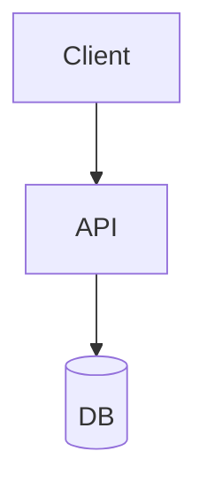

# Performance And Diagram Notes

작성일: 2026-06-16

## 성능 기준

- 글 상세 페이지는 본문 HTML을 가능한 가볍게 유지한다.
- 모든 글에 반복 삽입되는 DOM enhancement 코드는 `src/scripts/postEnhancements.ts` 같은 외부 모듈로 둔다.
- 글 링크 이동 체감 속도는 Astro `ClientRouter` + 핵심 글 링크의 `data-astro-prefetch="viewport"`로 보강한다.
- `/graph/`는 그래프를 보는 사용자에게 검색 비용을 먼저 청구하지 않는다.
- `/graph/`의 `/search-index.json`은 실제 그래프 검색 쿼리가 생겼을 때 로드한다.
- 배포 전에는 Node.js 24.x에서 `pnpm run verify`와 `pnpm run build`를 통과시킨다.

## 현재 적용한 최적화

- 포스트 상세 페이지의 대형 inline script를 제거하고 `src/scripts/postEnhancements.ts`로 이동했다.
- TOC 생성, heading anchor, code copy button, image lightbox 초기화를 idle 시점으로 늦췄다.
- scroll progress bar는 `requestAnimationFrame`으로 throttle한다.
- 홈/목록/관련 글/시리즈/이전·다음 글 링크에 viewport prefetch를 적용했다.
- 그래프 페이지는 첫 focus와 idle 시점에 Orama 검색 인덱스를 미리 받지 않는다.
- Mermaid 렌더링은 `src/scripts/diagramEnhancements.ts`에서 뷰포트 근처 진입 시 lazy-load한다.
- Mermaid는 `theme: "base"`, `look: "neo"`, 블로그 색상 토큰 기반 `themeVariables`, flowchart/sequence/gantt 간격 설정으로 전역 품질을 맞춘다.
- Mermaid SVG는 다이어그램 전용 frame 안에서 렌더하고, 모바일에서는 본문 폭을 넘는 그림을 축소하지 않고 가로 스크롤로 읽게 한다.
- 테마 토글 시 현재 페이지의 Mermaid SVG를 다시 렌더해 라이트/다크 대비가 깨지지 않게 한다.

## Mermaid 대안 검토

Mermaid가 유일한 선택지는 아니다. 다만 기존 글 호환성과 작성 속도를 생각하면 Mermaid는 계속 유지하는 편이 좋다. 새로 추가할 "더 세련된" 텍스트 기반 다이어그램은 D2가 가장 적합하다.

### 추천 우선순위

1. D2
   - 이 블로그의 아키텍처/시스템 설계 그림에 가장 잘 맞는다.
   - 테마, sketch mode, animation, 여러 layout engine, SVG/PNG/PDF export를 지원한다.
   - 런타임 JS 없이 빌드타임 SVG로 넣으면 글 렌더링 속도에도 유리하다.

2. Kroki
   - Mermaid, D2, Graphviz, PlantUML, Structurizr 등 여러 다이어그램 엔진을 HTTP API로 렌더링하는 게이트웨이다.
   - 라이브 API 의존은 빌드 재현성과 프라이버시 측면에서 피하고, 쓴다면 self-host 또는 build-time 렌더링으로 제한한다.

3. Excalidraw
   - 손그림 느낌의 편집형 다이어그램에는 좋다.
   - Mermaid 변환은 flowchart 중심이라 전체 Mermaid 대체재로 쓰기에는 제한이 있다.

4. Markmap
   - Markdown outline을 mind map으로 보여줄 때 좋다.
   - 시스템 아키텍처나 복잡한 플로우의 범용 대체재는 아니다.

5. Graphviz / PlantUML / Structurizr
   - UML, C4, graph layout에는 강하다.
   - 기본 시각 스타일은 D2보다 딱딱해서 글의 시각 품질을 높이는 목적이면 테마/후처리가 필요하다.

## 구현 방향

- 기존 `mermaid` fence는 유지한다.
- 새 `d2` fence를 추가했다.
- D2는 런타임 렌더링이 아니라 `src/utils/remarkD2.ts`에서 빌드타임 SVG로 산출한다.
- D2 JS wrapper는 worker를 사용하므로 Astro 프로세스에 직접 import하지 않고 `scripts/render-d2-block.mjs` child process에서 렌더한다.
- 빌드 스크립트에는 `scripts/check-d2.mjs` 렌더 검증을 추가했다.
- D2 기본 렌더는 라이트 정적 SVG로 둔다. `darkThemeID`는 SVG 내부 `prefers-color-scheme`를 만들 수 있으므로 글에서 명시적으로 필요할 때만 사용한다.
- 외부 HTTP 렌더러를 쓰는 경우 raw private content를 외부 API로 보내지 않는다.

### 작성 예시

````md


```d2
Client -> API -> DB
```

```d2 sketch elk theme=4 pad=56
Client -> API -> DB
```
````

## 참고 문서

- D2: https://d2lang.com/
- Kroki usage: https://docs.kroki.io/kroki/setup/usage/
- Kroki diagram types: https://docs.kroki.io/kroki/diagram-types/
- Kroki diagram options: https://docs.kroki.io/kroki/setup/diagram-options/
- Excalidraw Mermaid parser: https://docs.excalidraw.com/docs/%40excalidraw/mermaid-to-excalidraw/codebase/parser
- Markmap: https://markmap.js.org/
