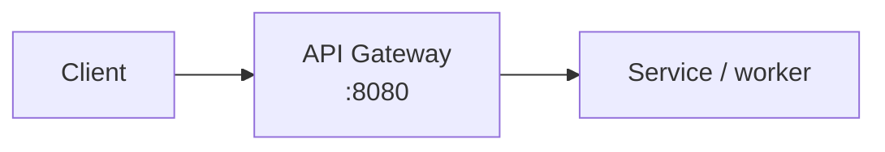

# SON BLOG Writing Workflow

Codex가 이 저장소에서 블로그 글을 기획, 작성, 검수, 반영할 때 따르는 기준이다. 예전 MkDocs 기반 `sonblog/CLAUDE.md`의 작성 자동화 지침을 Astro 기반 `sonblog-astro`에 맞게 다시 정리했다.

## 먼저 읽을 문서

글 작성 작업을 시작할 때는 아래 순서로 본다.

1. `AGENTS.md`
2. `docs/PROJECT_CONTEXT.md`
3. `docs/WRITING_WORKFLOW.md`
4. 다이어그램이 있으면 `docs/PERFORMANCE_AND_DIAGRAMS.md`
5. 검색 품질이나 synaptic-memory 관련 글이면 `docs/SEARCH_EVAL.md`
6. `sontrader` 자동매매 리서치 시리즈는 `docs/SONTRADER_SERIES_PLAN.md`

이 문서는 글 작성 전용이다. 배포, URL 정책, 검색, 그래프, 방문자 집계 같은 운영 규칙은 `docs/PROJECT_CONTEXT.md`를 우선한다.

## 예전 sonblog와 달라진 점

예전 `sonblog`는 MkDocs Material 기반이었고 글 원본이 `docs/` 아래에 있었다. 현재 저장소는 Astro content collection 기반이다.

| 항목             | 예전 sonblog             | 현재 sonblog-astro                              |
| ---------------- | ------------------------ | ----------------------------------------------- |
| 글 위치          | `docs/`                  | `src/content/posts/`                            |
| frontmatter 날짜 | `date`                   | `pubDatetime`                                   |
| 목차/nav         | `.pages` 관리            | Astro 라우팅과 topic 데이터                     |
| CMS              | 없음 또는 수동 편집 중심 | Decap CMS `public/admin/config.yml`             |
| 검색             | MkDocs/Orama custom      | Pagefind + semantic search fallback             |
| 그래프           | MkDocs 산출물 기반       | `public/assets/graph/graph-data.json` 빌드 산출 |
| 다이어그램       | Mermaid 중심             | Mermaid 유지, D2 build-time SVG 옵션 추가       |
| 배포             | MkDocs Pages             | GitHub Actions Astro build                      |

따라서 예전 문서의 `docs/...`, `.pages`, `date`, MkDocs 전용 이미지 폭 문법은 그대로 쓰지 않는다.

## 콘텐츠 위치와 frontmatter

글은 반드시 `src/content/posts` 아래 카테고리/서브카테고리에 둔다.

```text
src/content/posts/
  ai/
  search-engine/
  full-stack/
  devops/
  portfolio/
  notes/
```

새 글 기본 frontmatter:

```yaml
---
title: "구체적이고 검색 가능한 제목"
description: "무엇을 했고, 어떤 기술을 사용했고, 어떤 문제를 해결했는지 1~2문장으로 요약한다."
pubDatetime: 2026-06-17
tags:
  - 핵심기술
  - 프로젝트명
  - 문제영역
draft: true
---
```

frontmatter에는 날짜만 적어도 된다. 빌드 시 `pnpm run post-times`가 Git 최초 추가 시간을 읽어
`src/generated/post-times.json`을 만들고, frontmatter 날짜와 Git 최초 추가 날짜가 같은 글만 KST 시간까지
자동 표시한다. 이 파일은 카드, 글 상세, RSS, 검색 인덱스, 아카이브 정렬에서 공통으로 사용한다.

특정 발행 시간이 꼭 필요하고 Git 이력으로 판단하면 안 되는 예외 글만 KST 시간까지 직접 넣는다.

```yaml
pubDatetime: 2026-06-17T14:30:00+09:00
```

선택 필드:

- `modDatetime`: 기존 글을 의미 있게 수정했을 때만 추가한다.
- `featured`: 홈 상단 추천 글로 올릴 때만 사용한다.
- `series`, `seriesOrder`: 시리즈 글일 때만 사용한다.
- `ogImage`: 별도 OG 이미지가 있을 때만 사용한다.
- `canonicalURL`: 외부 원문이 있는 글일 때만 사용한다.
- `hideEditPost`: 공개 페이지의 edit link를 숨겨야 할 때 사용한다.

발행 준비가 끝나면 `draft: true`를 제거하거나 `draft: false`로 바꾼다. 미래 날짜 글은 프로덕션에서 공개되지 않을 수 있으므로 발행일은 정확히 확인한다.

## 글쓰기 스타일

기술 글은 아래 톤을 유지한다.

- `~다` 체로 쓴다.
- 실전 경험 기반으로 쓴다. "이 프로젝트에서는", "당시 문제는", "해결은" 같은 직접적인 문장을 선호한다.
- 이모지와 이모티콘을 쓰지 않는다.
- "살펴보겠습니다", "알아보겠습니다", "이번 포스트에서는" 같은 AI 티 나는 문장을 피한다.
- 굵은 글씨를 남발하지 않는다. 특히 문장 전체를 `**...**`로 감싸지 않는다.
- 코드블록에는 언어 태그를 붙인다.
- 표는 비교가 명확할 때만 쓴다. 설명을 표로 억지 변환하지 않는다.

권장 구조:

1. 문제 정의: 왜 이 작업을 했는지
2. 기존 구조 또는 장애 상황: 어떤 제약이 있었는지
3. 설계 선택: 왜 이 방향을 골랐는지
4. 핵심 구현: 코드, 설정, 아키텍처
5. 트러블슈팅: 실제로 막힌 부분과 해결
6. 결과: 성능, 운영 편의, 남은 한계

## 참조 리소스 우선순위

글의 근거는 아래 순서로 수집한다.

1. 실제 작업 repo의 커밋, diff, PR/MR, issue, pipeline log
2. 로컬 클론의 실제 소스코드와 설정 파일
3. 배포 환경의 명령 결과, 로그, 스크린샷
4. 공식 문서, release note, API reference
5. 신뢰 가능한 기술 블로그나 논문

외부 기술 정보가 최신성을 요구하면 반드시 현재 문서를 확인한다. 버전, API, 가격, 라이선스, 보안 정책은 바뀔 수 있으므로 기억만으로 쓰지 않는다.

시크릿, 사내 URL, 토큰, 계정, 고객사 민감 정보는 글에 넣지 않는다. 필요한 경우 구조만 익명화해서 설명한다.

## 주제 발굴 자동화

사용자가 "블로그 글 써줘", "최근 작업으로 글 소재 뽑아줘"처럼 요청하면 아래 흐름으로 진행한다.

### 1. 후보 소스 수집

GitHub 개인 프로젝트:

```bash
gh repo list SonAIengine --limit 50 --json name,pushedAt,description
gh api "repos/SonAIengine/{repo}/commits?since=YYYY-MM-DD&until=YYYY-MM-DD&per_page=100"
```

GitLab 회사 프로젝트:

```bash
set -a
source ~/.claude/.secrets
set +a
TOKEN="${GITLAB_TOKEN}"
GITLAB_API="${GITLAB_URL:-https://gitlab.x2bee.com}/api/v4"

curl --header "PRIVATE-TOKEN: $TOKEN" \
  "$GITLAB_API/projects?search=PROJECT"

curl --header "PRIVATE-TOKEN: $TOKEN" \
  "$GITLAB_API/projects/{ID}/repository/commits?per_page=100&since=YYYY-MM-DD&until=YYYY-MM-DD&author=sonsj97"
```

GitLab 인증은 먼저 `~/.claude/.secrets`를 확인한다. 현재 전역 secret에는 `GITLAB_URL`, `GITLAB_USER`, `GITLAB_TOKEN`이 들어있을 수 있다. 명령에서는 `TOKEN="${GITLAB_TOKEN}"`처럼 받아 쓰고, 토큰 값은 출력하거나 저장소 문서에 기록하지 않는다.

### 2. 커밋 그룹핑

커밋 메시지와 diff를 보고 글감 단위로 묶는다.

- `feat`, `fix`, `refactor`, `perf`, `infra`, `docs`를 기준으로 1차 분류한다.
- 단순 typo, version bump, merge commit은 제외한다.
- 시행착오와 해결 과정이 있는 묶음을 우선한다.
- "기능 하나"보다 "문제 하나를 끝까지 해결한 흐름"을 우선한다.

### 3. 기존 글 중복 체크

새 글을 만들기 전에 기존 글과 겹치는지 확인한다.

```bash
rg -n "핵심키워드|프로젝트명|에러메시지" src/content/posts
```

이미 같은 주제가 있으면 새 글 대신 후속편, 보강 수정, 시리즈 편입 중 하나를 제안한다.

### 4. 사용자에게 후보 제안

후보는 3~5개만 제안한다.

```text
주제 N: 제목
- 프로젝트: repo-name
- 기간: YYYY-MM-DD ~ YYYY-MM-DD
- 관련 커밋: N개
- 카테고리: ai / search-engine / devops / full-stack / portfolio / notes
- 블로그 가치: 왜 이 글이 읽을 가치가 있는지
```

사용자가 하나를 고르면 그때 실제 diff와 소스코드를 깊게 읽고 작성한다.

## draft 메모에서 글로 변환

현재 저장소에서는 예전 `docs/notes/draft.md` 대신 `src/content/posts/notes/` 아래에 초안 메모를 둘 수 있다. 자유 메모가 주어지면 다음 기준으로 글로 변환한다.

1. 메모를 주제별로 나눈다.
2. 기술 글이면 `ai`, `search-engine`, `full-stack`, `devops` 중 하나로 옮긴다.
3. 개인 메모나 짧은 기록이면 `notes`에 유지한다.
4. 글로 승격한 뒤에는 원 메모와 중복 내용이 남지 않도록 정리한다.
5. 초안 상태가 필요하면 `draft: true`를 붙인다.

## 다이어그램 작성 기준

기본은 Mermaid를 유지한다. 기존 글 호환성과 작성 속도가 가장 좋기 때문이다.

- flow는 `flowchart LR`를 기본으로 한다.
- 세로 흐름이 명확할 때만 `TB`를 쓴다.
- 커스텀 색상 `style`, `fill`, `color`는 남발하지 않는다.
- `/`, `:`, `<br/>`, `*`, 괄호가 들어간 노드/엣지 라벨은 큰따옴표로 감싼다.

예시:

````md

````

D2는 고급 아키텍처 그림이나 Mermaid보다 세련된 정적 SVG가 필요할 때 쓴다. 현재 프로젝트는 `d2` fence를 build-time SVG로 렌더링한다.

````md
```d2 sketch elk theme=4 pad=56
Client -> Gateway -> Worker -> Database
```
````

Mermaid/D2 관련 세부 규칙은 `docs/PERFORMANCE_AND_DIAGRAMS.md`를 따른다.

## 이미지와 스크린샷

이미지는 가능한 한 직접 촬영하거나 직접 만든 산출물을 사용한다.

- CMS 업로드 기본 위치는 `src/assets/images`다.
- 글과 강하게 묶인 로컬 이미지는 해당 글 폴더 근처에 둘 수 있다.
- 외부 이미지 hotlink는 장기 보존성이 낮으므로 새 글에서는 피한다.
- 모든 이미지에는 의미 있는 alt text를 넣는다.
- UI/대시보드 글은 실제 화면 스크린샷을 우선한다.
- 로그나 에러는 스크린샷보다 코드블록이 더 읽기 좋으면 코드블록으로 둔다.

Playwright로 촬영할 때는 민감 정보가 보이지 않는지 먼저 확인한다. 로그인 정보는 저장소에 기록하지 않는다.

## 작성 후 자동 반영 절차

글을 작성하거나 수정한 뒤에는 아래 절차로 검증한다.

1. `git status --short`로 변경 범위를 확인한다.
2. `pnpm run audit:content`로 frontmatter, description, 이미지 alt, 코드블록 언어를 확인한다.
3. 다이어그램이 있으면 `pnpm run lint:mermaid`와 `pnpm run lint:d2`를 확인한다.
4. 전체 배포 전에는 반드시 `pnpm run verify`와 `pnpm run build`를 실행한다.
5. 로컬 preview에서 해당 글 URL을 확인한다.
6. 발행이 필요한 경우 `main`에 push해서 GitHub Pages workflow를 돌린다.
7. 글 변경 후 검색 서비스는 `scripts/reindex-if-changed.sh` 또는 운영 cron이 `sonblog-search.service`를 재시작해 synaptic-memory 인덱스를 갱신한다.

배포하지 않는 단순 초안 작업이면 4~6번은 사용자 요청 전까지 생략할 수 있다.

## 글 품질 체크리스트

작성 완료 전 아래를 확인한다.

- 제목이 구체적이고 검색 가능한가
- description이 50~180자 수준에서 핵심 문제와 기술을 담는가
- tags가 4~8개 정도로 과하지 않은가
- "왜 이 문제를 풀었는지"가 앞부분에 드러나는가
- 실제 코드, 설정, 로그, 커밋 중 최소 하나를 근거로 삼았는가
- 외부 기술 설명은 공식 문서나 실제 버전 기준으로 확인했는가
- Mermaid/D2가 build에서 깨지지 않는가
- 모바일에서 긴 코드, 표, 다이어그램이 본문 폭을 밀지 않는가
- 내부 링크가 필요한 기존 글을 연결했는가
- 시크릿, 계정, 고객사 민감 정보가 없는가

## Codex 작업 원칙

Codex는 글쓰기 요청을 받으면 제안에서 멈추지 말고, 사용자가 명확히 반대하지 않는 한 실제 파일 생성이나 수정을 진행한다. 다만 주제가 아직 정해지지 않았거나 민감 repo 접근이 필요한 경우에는 먼저 후보를 제안하고 사용자 선택을 받는다.

새 글 작성 중 기존 사용자 변경이 보이면 되돌리지 않는다. 콘텐츠 파일은 prose-first 파일이므로 포맷터로 전체를 무리하게 재정렬하지 않는다.
