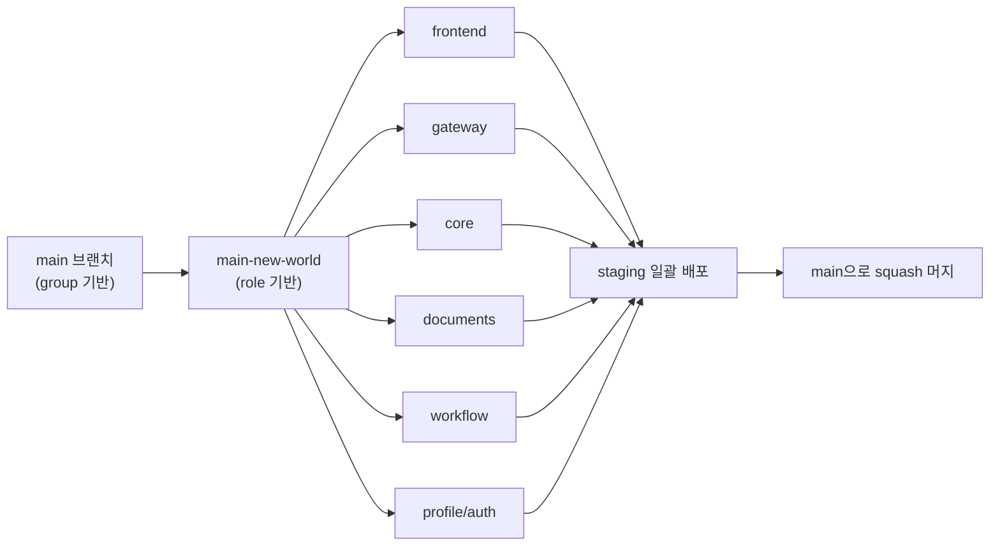
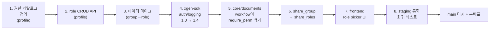

# XGEN 2.0 권한 모델 리팩토링: Group → Role 기반으로 6개 마이크로서비스 일괄 마이그레이션

## 왜 권한 모델을 통째로 갈아엎었나

XGEN 2.0은 워크플로우, 문서, 에이전트, 변수, 모델 등 도메인이 다른 자원을 각각 관리하는 마이크로서비스 6~7개로 구성된다. 출시 초기의 권한 모델은 단순했다. **그룹**이라는 1차원 컨테이너에 사용자를 묶고, 자원을 그룹에 공유하면 그 그룹의 모든 멤버가 접근할 수 있다. 만들기 쉬웠고 이해하기 쉬웠다.

문제는 운영이 진행되면서 그룹의 의미가 점점 흐려졌다는 거다. "검색팀 그룹"이 어느 순간부터 "검색팀이지만 워크플로우는 못 만들고 문서만 보는 사람들"의 의미로 변했고, 그 다음에는 "검색팀이고 문서는 보지만 일부 변수는 못 보는 사람들"이 됐다. 이렇게 되자 같은 사람을 여러 그룹에 동시에 넣는 우회가 시작됐고, 결국 그룹 5~10개에 같은 사람이 중복 소속된 운영 패턴이 굳어졌다.

여기서 결정해야 했다. 그대로 둘지, 아니면 진짜 RBAC(Role-Based Access Control)로 옮길지. 옮기기로 한 이유는 세 가지였다.

1. **다차원 권한 표현**. 같은 사람이 "워크플로우 read"와 "문서 write"를 동시에 가질 수 있어야 했다. 그룹 1차원으로는 못 한다.
2. **공유 단위 단순화**. 자원 공유 시 "이 자원에 어떤 행동을 할 수 있는가"를 명시할 수 있어야 했다. 그룹은 멤버십만 표현하지 행동을 표현하지 않는다.
3. **감사(audit) 가능성**. 누가 어떤 권한을 갖고 있는지 한눈에 보려면 권한 자체를 1급 객체로 다뤄야 했다.

그래서 권한 모델 전체를 group → role로 옮겼다. 한 사람은 여러 role을 가질 수 있고, 자원은 role과 공유되며, 각 API는 호출 시 필요한 권한을 명시한다. 이 변화가 6개 마이크로서비스 모두에 영향을 주는 작업이라 한 번에 진행해야 했다. 이 글은 그 마이그레이션 전략과 거기서 배운 것들을 정리한다.

> 회사 내부 서비스 구조와 관련된 내용이라 구체적인 도메인/엔드포인트/사용자 정보는 일부 일반화했다. 패턴과 의사결정 위주로 본다.

## 영향 범위 — 6개 서비스 + 게이트웨이

마이그레이션 대상은 다음과 같았다.

| 서비스 | 역할 | 변화 |
|--------|------|------|
| **frontend** | Next.js UI | 권한 표시 UI 전체 재작업, role picker 도입 |
| **gateway** | API Gateway | 인증 후 role context 전파, 권한 헤더 주입 |
| **core** | 메인 비즈니스 | share_group → share_roles, require_perm |
| **documents** | 문서/컬렉션 | document collection role-based sharing |
| **workflow** | 워크플로우/agentflow | agentflow 권한 매핑 role-based 전환 |
| **profile/auth** | 사용자/role 관리 | role CRUD, role-permission 매핑 API |

게이트웨이 + 백엔드 5개 + 프론트. 한 개라도 어긋나면 사용자가 본 권한과 실제 권한이 달라지는 사고가 난다. 이게 가장 무서운 시나리오였다 — UI는 "삭제 가능"이라고 보여주는데 백엔드는 거부하거나, 그 반대. 그래서 한 브랜치(`main-new-world`)에 모든 서비스의 변경을 동시에 올리고, 한꺼번에 머지하기로 했다.

## 단일 브랜치 전략 — `main-new-world`

마이크로서비스 마이그레이션의 가장 큰 함정은 **부분 배포**다. core가 새 권한 모델을 쓰는 동안 documents가 옛 모델을 쓰면, 같은 user 토큰이 두 서비스에서 다른 권한으로 해석된다. 사용자가 컬렉션은 못 만드는데 그 컬렉션 안의 문서는 수정할 수 있는 식의 비대칭이 발생한다.

해결책 두 가지가 있다.

**A. 모든 서비스에 옛 모델/새 모델을 동시에 살려두고 조용히 전환.** 백엔드 코드에 두 경로가 다 있다는 뜻이고, 서비스마다 cutover 시점을 다르게 가져갈 수 있다. 안전하지만 코드 복잡도가 폭발한다.

**B. 별도 브랜치(`main-new-world`)에서 전부 동시에 마이그레이션하고, 한 번에 main에 머지.** 짧은 동안의 risk window가 있지만, 코드는 깨끗하게 유지된다.

B를 골랐다. XGEN의 사용자 베이스가 충분히 작아서 short risk window를 감내할 수 있었고, 무엇보다 옛 모델 경로를 유지하면서 RBAC 전환을 같이 하면 코드가 두 배로 부풀어서 일관성을 맞추기 더 어려워진다는 판단이었다.

`main-new-world`는 약 일주일 동안 6개 서비스 모두에서 평행하게 작업됐다. 매일 밤 staging에 한꺼번에 배포해서 cross-service 시나리오를 돌렸다. 코드만 보면 "왜 이렇게 많은 서비스에 같은 패턴 변경이 한 번에 들어가나"라고 의아해할 수 있는데, 이게 그 이유다. **권한 모델은 분산해서 마이그레이션할 수 없는 cross-cutting 관심사**다.



## 패턴 1 — `share_group` → `share_roles`

가장 광범위한 변화는 자원 공유 모델이었다. 모든 자원(워크플로우, 문서 컬렉션, 변수, agentflow)에 `share_group: list[GroupId]` 필드가 있었는데, 이걸 `share_roles: list[RoleId]`로 바꿨다.

```python
# Before
class WorkflowShare:
    workflow_id: str
    share_group: list[str]   # group_id list

# After
class WorkflowShare:
    workflow_id: str
    share_roles: list[str]   # role_id list
```

단순한 이름 변경처럼 보이지만 의미가 다르다. **그룹은 멤버십이고, role은 권한 묶음이다.** 같은 자원에 두 role을 share했을 때, 사용자가 그중 하나만 가지고 있어도 접근 가능하다. role의 정의에 따라 read만 가능한 role과 write까지 가능한 role을 동시에 share할 수 있다.

마이그레이션 데이터는 다음 규칙으로 변환했다.

1. 옛 그룹 `검색팀`이 자원 X에 share돼 있었으면, 새 role `search_team_member`를 만들어 X에 share.
2. 옛 그룹 멤버 전원에게 새 role을 부여.
3. 옛 그룹은 일정 기간 read-only 상태로 남겨 두고, 머지 후 1주일 후 정식 deprecated.

이 데이터 마이그레이션을 한 번에 돌리려면 모든 서비스가 동시에 전환돼야 했다. 한 서비스만 옛 모델을 보고 있으면 그 서비스에서 자원을 만들 때 share_group을 채울 텐데, 새 모델은 그걸 모른다. 이 비대칭이 두려웠던 게 단일 브랜치 전략의 가장 큰 이유다.

## 패턴 2 — `require_perm` 통합

권한 체크가 컨트롤러마다 흩어져 있었다. 어떤 곳은 `if not user.is_admin`, 어떤 곳은 `if "workflow_write" not in user.permissions`, 어떤 곳은 그냥 체크 없음. 6개 서비스에 걸쳐 권한 체크 패턴이 통일되지 않으면 추후 새 권한이 추가될 때마다 6번의 변경이 필요하다.

`require_perm`이라는 단일 데코레이터로 통합했다.

```python
@require_perm("workflow:write")
async def update_workflow(workflow_id: str, body: WorkflowUpdate, user: User):
    ...
```

데코레이터의 책임:

1. user 객체에서 role list를 가져온다.
2. role → permission 매핑(서비스 시작 시 캐싱)을 조회한다.
3. 요구 권한을 가진 role이 하나라도 있으면 통과, 없으면 403.
4. 차단 이벤트는 audit log에 남긴다.

이 데코레이터를 모든 컨트롤러 진입점에 박았다. 약 200개 엔드포인트. 한 번에 일괄 적용했고, 그 후 권한 정의는 한 곳에서만 관리하면 된다.

```python
# 권한 정의 (단일 소스)
PERMISSIONS = {
    "workflow:read":        "워크플로우 조회",
    "workflow:write":       "워크플로우 수정",
    "workflow:delete":      "워크플로우 삭제",
    "document:read":        "문서 조회",
    "document:write":       "문서 수정",
    "agentflow:read":       "에이전트플로우 조회",
    "agentflow:write":      "에이전트플로우 수정",
    "admin:user_manage":    "사용자 관리",
    "admin:role_manage":    "role 관리",
    ...
}
```

이 매핑이 서비스 부팅 시 게이트웨이/core/profile에서 동시에 로드된다. 한 서비스만 다른 매핑을 들고 있으면 사용자 감각이 어긋나니까, 매핑 자체를 공통 SDK에서 import하도록 했다(다음 절에서 설명).

### 게이트웨이의 역할

게이트웨이는 인증 후 사용자의 role 목록을 backend로 forward해야 한다. 두 가지 방식이 가능했다.

- **A. 게이트웨이가 X-User-Roles 헤더에 role list를 박아서 백엔드로 전달.** 백엔드는 헤더만 신뢰. 빠르지만 게이트웨이를 우회해서 백엔드를 직접 호출하면 헤더 위조가 가능해서 위험.
- **B. 게이트웨이는 user_id만 forward, 백엔드가 매번 profile 서비스에서 role을 조회.** 안전하지만 hop 한 번 추가.

두 패턴을 섞었다. 게이트웨이가 X-User-Roles를 서명된 형태로 박고, 백엔드 진입점에서 서명을 검증한다. role 조회 hop을 줄이면서도 위조를 막는 절충. 게이트웨이를 우회해서 백엔드를 직접 호출하는 경로는 K8s 네트워크 정책으로 차단했다.

## 패턴 3 — 공통 SDK 추출 (`xgen-sdk` 1.0 → 1.4)

권한 모델 리팩토링과 거의 같은 시점에 진행한 게 공통 SDK 추출이다. 그동안 각 서비스에 흩어져 있던 패턴들 — 로깅, 설정 로딩, 권한 체크 데코레이터, MinIO 클라이언트 — 을 한 패키지로 묶었다.

```
xgen-sdk/
├── logging/        # structured logging, request_id propagation
├── config/         # 환경변수 + secrets 통합 로더
├── auth/           # require_perm, role context
├── storage/        # MinIO/S3 클라이언트 wrapper
└── observability/  # tracing, metrics
```

각 서비스의 `pyproject.toml`에 `xgen-sdk = "^1.4.0"`만 들어 있으면 된다. SDK에 새 기능이 추가되면 모든 서비스가 minor bump로 가져갈 수 있다.

이 분리가 가져온 가장 큰 효과는 **6개 서비스에 흩어진 보일러플레이트의 제거**였다. 마이그레이션 시작 시점에 service마다 약 200~400줄씩 있었던 logging/config/auth helper들이 모두 사라졌다. 합쳐서 1500줄이 넘는 코드가 SDK에 합쳐지고 100~200줄로 줄었다.

### `logger_helper.py` 제거

가장 자주 보이는 변경이 logging 관련이었다. 모든 서비스에 `app/utils/logger_helper.py`라는 파일이 존재했는데, 이게 거의 동일한 로직(structlog setup + request_id contextvar)이었다. 마이그레이션 중 SDK의 `xgen_sdk.logging`으로 모두 교체했다.

```python
# Before — 각 서비스마다
from app.utils.logger_helper import get_logger
log = get_logger(__name__)

# After — 모든 서비스 공통
from xgen_sdk.logging import get_logger
log = get_logger(__name__)
```

이 변경 자체는 단순하지만 6개 서비스에 걸쳐 수백 군데를 바꿔야 했다. 한 번에 끝내려고 단순 sed 변경으로 처리했고, 그 후 logger_helper.py 파일 자체를 deprecated shim으로 두고 다음 마이너 버전에서 삭제했다.

이 단계에서 한 가지 작은 사고가 있었다. 어떤 컨트롤러는 `logger_helper`에서 직접 contextvar를 import하고 있었는데, 단순 sed로는 잡히지 않았다. CI에서 import error가 나서야 발견. 그 후로 마이그레이션 PR은 ruff + 컴파일 체크를 무조건 거치도록 강제했다.

### MinIO/S3 클라이언트 통합

또 다른 흔한 중복은 storage 클라이언트 초기화였다. 각 서비스가 자기 MinIO endpoint, access key, bucket 이름을 환경변수로 로드하고 boto3를 wrap하는 코드를 자체적으로 갖고 있었다. SDK에 `xgen_sdk.storage.MinIOClient`를 만들고 모든 서비스가 import해서 쓰도록 통합했다.

이 통합의 부수 효과는 **재시도/타임아웃 정책의 일관성**이었다. 어떤 서비스는 5초 타임아웃, 어떤 서비스는 30초였는데 SDK로 통일하면서 모두 10초 + 지수 backoff 재시도로 정렬됐다.

## 의존성 충돌 해소 — langchain/langgraph 버전 제약 완화

마이그레이션 중에 흔히 만나는 부수 사고가 의존성 충돌이다. 이번에도 langchain/langgraph 쪽에서 한 번 터졌다.

원인은 일부 서비스가 너무 좁은 버전 제약을 걸어 두었기 때문. `langchain = "==0.x.y"` 같은 정확 버전 핀이 SDK가 요구하는 langchain 버전과 충돌했다. 마이그레이션 도중에 SDK를 import만 해도 의존성 해석이 실패했다.

해결은 두 단계.

1. 핀을 풀고 `langchain = ">=0.x.y, <1.0"` 같은 캐럿 제약으로 완화.
2. langgraph는 1.1.0 이상으로 일괄 bump. 이전 버전에 `ExecutionInfo` import가 없었던 게 SDK 호환을 깨고 있었다.

> "langchain/langgraph 버전 제약 완화 - 의존성 충돌 해소"
> "langgraph 버전 업그레이드 (>=1.1.0) - ExecutionInfo import 오류 수정"

이 두 변경을 각 서비스의 `pyproject.toml`에 동시에 적용해야 했다. 다시 강조하지만 **마이크로서비스에서 의존성 변경은 cross-cutting 관심사라 분산 진행이 어렵다.** 한 서비스만 새 버전이고 다른 서비스가 옛 버전이면, 두 서비스가 같은 라이브러리를 다른 방식으로 사용하다가 통합 테스트에서 깨진다.

## 패턴 4 — 권한 정리 (Orphan permission cleanup 제거)

Lifespan 함수에 `cleanup_orphan_permissions` 같은 정리 작업이 들어 있었다. 서비스 부팅 시 "사용자가 사라졌는데 남은 권한 레코드"를 청소하는 로직이었다. 이게 group 기반 모델의 잔재였다 — group이 갑자기 사라질 수 있는 모델이라 cleanup이 필요했지만, role 기반에서는 role과 사용자가 명시적으로 unbind되기 때문에 자동 cleanup이 무의미해졌다.

```python
# Before
async def lifespan(app):
    await cleanup_orphan_permissions()  # 매 부팅마다 DB scan
    yield

# After
async def lifespan(app):
    yield
```

부팅 시간이 줄었고, 무엇보다 디버깅이 쉬워졌다. 이전에는 권한 레코드가 갑자기 사라지면 "cleanup이 잡아갔나?" 의심부터 해야 했는데, 그 의심이 사라졌다.

## 패턴 5 — User Header Injection 단순화

게이트웨이가 백엔드로 forward할 때 `X-User-ID`를 박는데, 이 값이 어떤 서비스는 string, 어떤 서비스는 numeric expectation으로 처리되고 있었다. 권한 모델 마이그레이션 중에 같이 정리했다 — 모든 곳에서 numeric format으로 통일.

```python
# Before — 각 서비스에서 다르게 파싱
user_id = int(request.headers.get("X-User-ID", "0"))  # core
user_id = request.headers.get("X-User-ID", "")        # documents

# After — SDK 헬퍼로 통일
from xgen_sdk.auth import get_user_id
user_id = get_user_id(request)  # 항상 int 반환
```

`xgen_sdk.auth.get_user_id`는 헤더 파싱 + 검증 + 캐스팅을 한 곳에서 처리한다. 호출자는 타입 걱정 없이 사용하면 된다.

## 마이그레이션 수행 순서

전체 작업은 8일에 걸쳐 다음 순서로 진행됐다.



이 순서가 중요한 이유. **권한 카탈로그가 먼저 정의되지 않으면 require_perm을 박을 수 없다.** role CRUD가 없으면 데이터 마이그레이션 스크립트가 새 role을 만들 수 없다. 데이터 마이그레이션이 끝나야 백엔드가 role 기반으로 동작할 수 있다. SDK가 안정화되어야 require_perm이 모든 곳에서 동일하게 동작한다.

## 회귀 테스트 — cross-service 시나리오

마이그레이션의 진짜 test surface는 단위 테스트가 아니라 end-to-end 권한 시나리오다. 통합 테스트로 다음 매트릭스를 돌렸다.

| 사용자 role | 자원 종류 | 기대 동작 |
|------|------|-----------|
| `admin` | 모든 자원 | 전체 read/write |
| `workflow_editor` | workflow | read/write, document는 read만 |
| `document_editor` | document | read/write, workflow는 read만 |
| `viewer` | 모든 자원 | read만 |
| `external_user` | 자기 소유 자원만 | 다른 사용자의 자원은 403 |

각 시나리오를 게이트웨이를 통해 호출하고, role 컨텍스트가 모든 서비스에 정확히 전파되는지 확인했다. 처음 며칠은 매번 한두 개 케이스가 깨졌고, 그게 마이그레이션 완료의 신호였다.

가장 잡기 어려웠던 사고는 **role 캐시가 stale**하던 케이스. role-permission 매핑을 서비스 시작 시 캐싱했는데, role을 만들거나 권한을 추가하면 캐시가 안 갱신돼서 실시간 변경이 반영되지 않았다. 해결은 cache invalidation 이벤트를 메시지 버스로 broadcast하는 것. 모든 서비스가 그 이벤트를 받으면 자기 role 캐시를 무효화한다.

## 트러블슈팅 — 마이그레이션 도중 부서진 것들

### 1. logger_helper import의 사각지대

sed로 일괄 변경했지만 일부 컨트롤러가 contextvar를 직접 import하던 경로를 놓쳤다. CI에서 import error로 발견. 그 후 모든 마이그레이션 PR은 컴파일 + ruff lint를 강제 통과해야 했다.

### 2. share_group 데이터 마이그레이션의 NULL

옛 share_group이 NULL인 자원(공유 안 된 자원)이 있었다. 처음 마이그레이션 스크립트가 NULL을 빈 리스트로 변환하지 않고 그대로 NULL로 뒀더니, 새 모델이 NULL을 못 다뤘다. fix는 단순했다 — `share_roles = COALESCE(NULL, '{}')`.

### 3. xgen-sdk minor bump 폭주 (1.0.2 → 1.0.3 → 1.0.4 → 1.2.0 → 1.4.0)

마이그레이션 중에 SDK에 fix가 거의 매일 들어갔다. 매일 패치 버전이 나왔고, 모든 서비스의 `pyproject.toml`을 매일 bump해야 했다. 이건 SDK가 아직 안정화되지 않았을 때 cross-cutting 마이그레이션의 자연스러운 비용이다. 마이그레이션이 끝난 후에는 SDK도 안정됐고 이제 minor 단위로 천천히 올라간다.

### 4. agentflow permission 매핑 누락

agentflow 자원은 워크플로우와 별도 도메인이라 권한 카탈로그에서 빠뜨릴 뻔했다. staging 회귀 테스트에서 agentflow 호출이 403으로 막힌 후 발견. `agentflow:read`/`agentflow:write` 두 권한을 카탈로그에 추가하고, 데이터 마이그레이션도 같이 돌렸다.

### 5. 게이트웨이 X-User-Roles 헤더 사이즈

사용자가 role을 많이 가지면 X-User-Roles 헤더가 길어진다. 어떤 사용자는 30개 이상의 role을 갖고 있었고, 헤더 사이즈가 8KB를 넘어 nginx에서 잘렸다. 해결은 두 단계 — nginx의 `large_client_header_buffers` 설정을 늘리고, role list를 정수 ID로 인코딩(이름이 아니라)해서 사이즈를 줄였다.

### 6. lifespan에서 cleanup 제거 후 부팅 실패

`cleanup_orphan_permissions`를 lifespan에서 제거하면서 그 함수가 호출하던 보조 함수의 import도 함께 정리했는데, 다른 곳에서 그 보조 함수를 쓰던 경로가 있었다. 부팅 시 ImportError. dead code 정리는 grep + 컴파일 체크 둘 다 거쳐야 안전하다는 교훈.

## 결과 — 줄어든 것과 늘어난 것

마이그레이션 완료 후 측정했다.

**줄어든 것**

- 6개 서비스 합계 코드 라인 약 4,500 라인 감소 (보일러플레이트 SDK로 통합)
- 권한 체크 코드 패턴 수: 약 14가지 → 1가지(`require_perm`)
- 부팅 시간: 평균 3~4초 단축 (orphan cleanup 제거)
- 로그 포맷 일관성: 6개 서비스가 모두 동일 structured format

**늘어난 것**

- 권한 카탈로그 정의 (약 50개 권한)
- role 관리 API (CRUD + role-permission binding + role-user binding)
- 통합 테스트 시나리오 (cross-service 권한 매트릭스)
- xgen-sdk 의존성 (모든 서비스가 SDK를 통해서 권한/로깅/스토리지 사용)

**가장 큰 정성적 변화**는 권한 추가의 비용이다. 새 권한을 추가하려면 이전에는 6개 서비스의 컨트롤러를 모두 손봐야 했는데, 지금은 권한 카탈로그에 한 줄 추가 + 해당 컨트롤러에 `@require_perm` 데코레이터 한 줄이면 끝난다. 새 자원 도메인이 추가될 때도 같은 패턴을 그대로 가져다 쓸 수 있다.

## 회고 — Cross-Cutting 마이그레이션의 원칙

이번 마이그레이션을 끝내고 정리한 원칙 세 가지를 남겨 둔다.

**1. Cross-cutting 변경은 분산하지 마라.** 권한, 인증, 로깅 같은 기반 시스템은 마이크로서비스에 쪼개지 않고 한 브랜치에서 한 번에 끝내는 게 안전하다. 옛 모델/새 모델 병행 유지는 코드 복잡도가 두 배가 되고, 추후 옛 모델 제거가 또 한 번의 마이그레이션이 된다.

**2. 공통 SDK는 마이그레이션의 결과지 출발점이 아니다.** SDK를 먼저 만들고 마이그레이션을 시작하면 SDK 설계가 추상적이 된다. 마이그레이션을 진행하면서 반복 등장하는 패턴을 SDK로 추출하면 SDK의 API가 자연스럽게 잡힌다. 우리는 그래서 SDK 1.0.2 → 1.4.0이라는 빠른 minor bump를 거쳤다 — 마이그레이션 중에 추출 패턴을 계속 보강했기 때문이다.

**3. 회귀 테스트는 cross-service 시나리오로 짜라.** 단위 테스트가 통과해도 게이트웨이 → core → documents 흐름이 깨질 수 있다. cross-service 권한 매트릭스를 정의하고 매일 staging에 전체 배포 후 돌리는 게 마이그레이션 완료의 진짜 신호였다.

이 마이그레이션의 가치는 코드 줄 수 감소가 아니라 **다음 변경의 비용 감소**다. 새 자원 도메인 추가, 새 권한 추가, 새 마이크로서비스 통합 — 이 모두가 이전보다 한 자릿수 더 빨라졌다. RBAC로 옮긴 후 첫 신규 자원 도메인을 추가했을 때 컨트롤러 200줄 + 권한 카탈로그 5줄 + 데이터 마이그레이션 SQL 30줄로 끝났다. 그 정도면 만족이다.

다음 글에서는 같은 시기에 진행한 인프라 쪽 작업 — Jenkins 자격증명을 하드코딩에서 K8s Secret + JCasC 변수 참조로 옮긴 보안 전환 — 을 다룬다.
