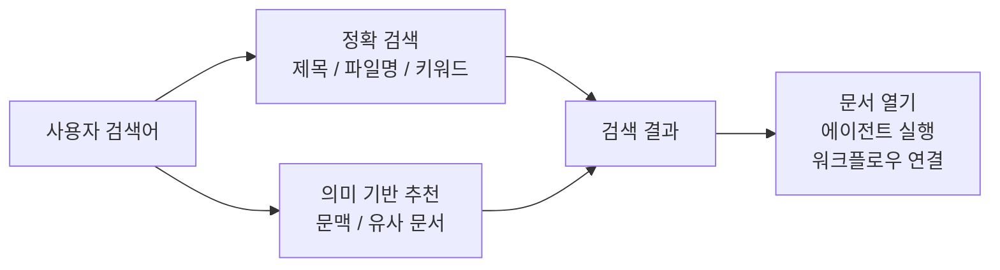

XGEN에서 검색은 부가 기능이 아니다. 사용자가 문서를 올리고, 워크플로우를 만들고, 에이전트에게 일을 맡기는 모든 흐름 앞에는 결국 같은 질문이 놓인다.

"필요한 지식이 어디에 있지?"

이 질문이 막히면 뒤의 기능이 아무리 좋아도 사용자는 멈춘다. 문서가 많아질수록 더 그렇다. 처음에는 파일명만 기억해도 충분하다. 그런데 시간이 지나면 비슷한 보고서가 늘고, 버전이 갈리고, 예전에 누가 올린 자료인지도 흐려진다. 이때 검색이 단순한 파일명 검색에 머무르면 XGEN은 지식 플랫폼이 아니라 파일 창고에 가까워진다.

그래서 XGEN의 검색 경험은 "정확히 입력한 단어를 찾는 기능"에서 끝나면 안 된다고 봤다. 사용자가 정확한 제목을 몰라도, 문서의 표현과 검색어가 조금 달라도, 에이전트가 필요한 근거를 다시 꺼내야 할 때도 버틸 수 있어야 한다.

## 사용자는 문서명을 기억하지 않는다

현실의 검색어는 생각보다 정돈되어 있지 않다.

```text
작년 보안 점검 결과
S3 버킷 권한 문서
고객 응대 매뉴얼 최신본
매출 하락 원인 분석했던 자료
RAG 성능 평가한 보고서
```

이런 검색어는 파일명과 정확히 일치하지 않을 가능성이 높다. 문서 제목은 "2026_Q1_security_audit_final_v3.pdf"일 수도 있고, "클라우드 스토리지 접근제어 개선안"일 수도 있다. 사용자는 "버킷"이라고 검색하지만 문서에는 "object storage"라고 적혀 있을 수도 있다.

이 간극을 줄이는 것이 XGEN 하이브리드 검색의 역할이다.

검색창은 사용자가 기억하는 말로 시작한다. XGEN은 그 말을 두 방향으로 해석한다. 하나는 정확히 맞는 단어와 파일을 찾는 방향이고, 다른 하나는 의미상 가까운 문서와 문단을 찾는 방향이다.



## 두 가지 검색을 같이 보는 이유

정확 검색은 여전히 중요하다.

`Qdrant`, `K3s`, `S3`, `vLLM`처럼 고유명사와 약어가 들어간 질의는 의미 검색만으로 처리하면 오히려 흐려질 수 있다. 사용자가 특정 기술명, 버전, 담당 시스템명을 입력했다면 그 단어가 실제로 들어간 문서를 빠르게 찾아줘야 한다. 이 영역에서는 키워드, 제목, 파일명, 태그가 강하다.

반대로 의미 기반 추천은 사용자가 정확한 표현을 모를 때 힘을 낸다. "계약서에서 위험 조항 찾기", "장애 원인 회고", "운영 인수인계 자료"처럼 의도로 찾는 검색어는 단어 하나하나보다 문맥이 중요하다. 문서 안에 검색어가 그대로 없어도 내용이 가까우면 후보로 올려야 한다.

둘 중 하나만 고르면 자주 어긋난다.

정확 검색만 있으면 표현이 조금만 달라도 놓친다. 의미 검색만 있으면 고유명사와 숫자, 버전, 코드명이 약해질 수 있다. XGEN에서는 두 신호를 함께 보고, 사용자가 "정확히 맞은 결과"와 "관련 있어 보이는 결과"를 구분해서 판단할 수 있게 하는 쪽이 더 낫다.

이전 글에서 다룬 [Qdrant 하이브리드 검색](/posts/ai/xgen/qdrant-hybrid-search-sparse-dense-vector-integration/)이나 [Sparse Vector와 Full-Text Index](/posts/ai/xgen/sparse-vector-full-text-index-hybrid-search-impl/)는 이 검색 경험의 내부 구현에 가까운 이야기다. 이번 글의 핵심은 구현 방식보다 사용자가 체감하는 변화다.

## 검색 결과를 무작정 섞지 않는다

검색 결과가 많아지면 모든 결과를 하나의 랭킹으로 합치고 싶어진다. 하지만 사용자가 보는 화면에서는 이게 꼭 좋은 선택은 아니다.

정확 검색 결과와 의미 기반 추천은 서로 다른 약속을 한다.

정확 검색은 "이 문서 안에 네가 입력한 단서가 있다"에 가깝다. 의미 기반 추천은 "표현은 달라도 이 문서가 의도와 가까워 보인다"에 가깝다. 둘의 점수를 같은 숫자처럼 섞어버리면 사용자는 결과가 왜 위에 올라왔는지 이해하기 어렵다.

그래서 XGEN 검색은 결과의 성격을 분리해서 보여주는 방향이 맞다.

- 정확히 맞은 문서
- 의미상 가까운 추천 문서
- 에이전트가 답변에 사용할 수 있는 근거 문단
- 확신이 낮아서 숨기는 결과

이 구분은 사소해 보이지만, 실제 사용성에는 크게 작용한다. 사용자는 "이건 검색어가 들어간 문서구나"와 "이건 관련 있을 수 있는 문서구나"를 다르게 받아들인다. 특히 업무 문서에서는 그 차이가 중요하다. 관련 있어 보인다는 이유만으로 최종 근거처럼 보이면 안 된다.

## 에이전트에게도 같은 검색 품질이 필요하다

XGEN에서는 사람이 직접 검색창에 입력하는 경우도 있지만, 에이전트가 검색을 호출하는 경우도 많다.

예를 들어 사용자가 이렇게 말할 수 있다.

```text
지난 분기 장애 회고 문서 기준으로 재발 방지 체크리스트 만들어줘.
```

이 요청은 단순한 채팅이 아니다. 에이전트는 먼저 관련 문서를 찾아야 한다. 그다음 문서 내용을 읽고, 필요한 근거를 뽑고, 체크리스트 형식으로 다시 정리해야 한다.

여기서 검색 품질이 낮으면 뒤의 답변도 흔들린다. 엉뚱한 문서를 가져오면 에이전트는 그럴듯하지만 틀린 답을 만들 수 있다. 반대로 좋은 검색은 에이전트를 훨씬 안정적으로 만든다. 사용자가 매번 문서를 첨부하지 않아도, XGEN 안에 쌓인 지식을 다시 호출할 수 있기 때문이다.

이 점에서 검색은 RAG의 한 단계가 아니라 XGEN 에이전트 경험의 기반이다. [Iterative RAG](/posts/ai/xgen/iterative-rag-search-engine-impl/)처럼 여러 번 검색하고 부족한 근거를 보강하는 구조도 결국 첫 검색 품질 위에 올라간다.

## 문서 처리 품질도 검색 경험의 일부다

검색창만 좋아져서는 부족하다. 문서가 들어오는 순간부터 검색 가능한 형태로 잘 바뀌어야 한다.

PDF, DOCX, PPT, Excel, HWP 계열 문서는 구조가 제각각이다. 표가 있고, 이미지가 있고, 머리말과 꼬리말이 있고, 스캔 이미지처럼 OCR이 필요한 경우도 있다. 이 과정에서 본문이 깨지거나 표가 이상하게 잘리면 검색은 당연히 나빠진다.

그래서 XGEN에서 문서 검색은 업로드 이후의 파이프라인까지 포함한다.

- 문서에서 텍스트를 안정적으로 추출한다.
- 표와 차트처럼 구조가 있는 정보를 최대한 보존한다.
- 이미지 영역은 필요한 경우 OCR로 텍스트화한다.
- 너무 큰 문서는 검색 가능한 단위로 나누되, 문맥을 잃지 않게 한다.
- 문서 제목, 요약, 키워드 같은 메타데이터를 함께 활용한다.

이 부분은 [문서 임베딩 파이프라인](/posts/ai/xgen/document-embedding-pipeline-chunking-option-preprocessing-strategy/)에서 더 자세히 정리해뒀다. 사용자는 검색창만 보지만, 검색창 뒤에는 문서를 검색 가능한 지식으로 바꾸는 작업이 계속 돌아간다.

## 좋은 검색은 "모른다"도 말할 수 있어야 한다

의미 검색을 붙이면 결과가 항상 나오는 것처럼 보일 수 있다. 하지만 결과가 항상 나온다는 말은, 틀린 결과도 항상 나올 수 있다는 말이다.

XGEN 검색에서 중요한 기준 중 하나는 확신이 낮은 결과를 과하게 보여주지 않는 것이다. 관련성이 애매한 문서를 그럴듯하게 상단에 올리면 사용자는 검색을 신뢰하지 않는다. 특히 에이전트가 그 결과를 근거로 답변까지 만들면 문제가 커진다.

검색은 친절해야 하지만, 지나치게 자신만만하면 안 된다.

좋은 검색 경험은 다음 상태를 구분한다.

- 확실히 찾은 결과
- 관련 있을 가능성이 높은 추천
- 근거로 쓰기에는 약한 후보
- 결과가 없다고 말해야 하는 경우

이 구분이 있어야 사용자는 결과를 믿고 다음 행동으로 넘어갈 수 있다.

## XGEN에서 기대하는 사용 흐름

이 기능이 잘 동작하면 사용 흐름은 단순해진다.

첫째, 사용자는 문서 제목을 외울 필요가 줄어든다. 기억나는 표현으로 검색해도 관련 문서를 찾을 수 있다.

둘째, 새로 합류한 사람도 과거 자료를 따라가기 쉬워진다. "어디 폴더에 있어요?" 대신 "이 주제로 검색해보세요"가 가능해진다.

셋째, 에이전트가 문서 근거를 다시 사용할 수 있다. 사용자가 매번 파일을 첨부하지 않아도 XGEN 안의 지식 저장소에서 필요한 문서를 꺼내 작업을 이어갈 수 있다.

넷째, 오래된 지식이 버려지지 않는다. 문서가 쌓이면 보통 찾기 어려워지고, 찾기 어려운 문서는 없는 것처럼 취급된다. 검색이 좋아지면 과거 회고, 장애 분석, 고객 대응 기록, 운영 매뉴얼이 다시 살아난다.

결국 목표는 화려한 검색 UI가 아니다. 사용자가 "그 문서 어디 있더라"에서 멈추지 않게 하는 것이다.

## 계속 평가해야 하는 기능

검색은 한 번 붙였다고 끝나는 기능이 아니다. 문서가 늘고, 사용자의 검색어가 바뀌고, 에이전트가 쓰는 방식도 바뀐다. 그래서 XGEN 검색도 계속 평가해야 한다.

내가 보는 기준은 단순하다.

- 정확한 제목 일부를 넣었을 때 바로 찾는가
- 한글과 영어가 섞여도 찾는가
- 약어, 제품명, 버전 같은 고유명사를 놓치지 않는가
- 의미 기반 추천이 정말 보조 역할을 하는가
- 무관한 질의에 엉뚱한 결과를 자신 있게 내지 않는가
- 에이전트가 근거로 써도 될 만큼 출처가 분명한가

블로그 검색 쪽에서는 이미 [synaptic-memory 검색 품질 평가 루프](/posts/ai/agent/synaptic-memory-search-eval-loop/)를 만들면서 작은 문제지와 채점기를 붙여봤다. XGEN 검색도 같은 방향으로 가야 한다. 감으로 "좋아진 것 같다"가 아니라, 같은 문제를 반복해서 풀리고 실패 유형을 쌓아야 한다.

## 정리

XGEN 하이브리드 검색은 사용자가 문서를 정확히 외우지 않아도 필요한 지식에 도착하게 만드는 기능이다.

정확 검색은 빠르고 분명한 단서를 잡는다. 의미 기반 추천은 표현이 달라도 가까운 문서를 찾아준다. 문서 처리 파이프라인은 검색 가능한 지식을 만들고, 에이전트는 그 지식을 다시 작업 흐름 안에서 사용한다.

중요한 건 검색 기술 자체보다 사용자 경험이다. 사용자가 문서명을 몰라도 찾을 수 있고, 에이전트가 근거를 놓치지 않고, 확신이 낮은 결과는 조심스럽게 다루는 것. 이 세 가지가 맞아야 XGEN의 검색은 단순 검색창이 아니라 지식 작업의 입구가 된다.
