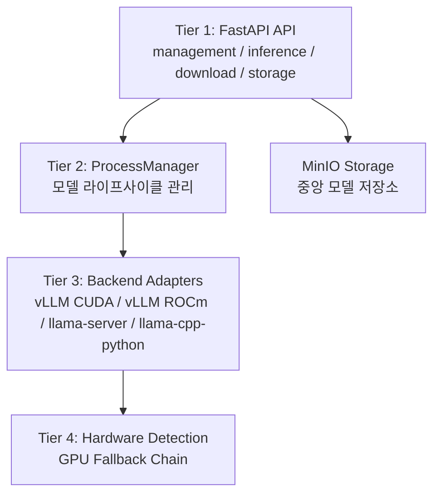
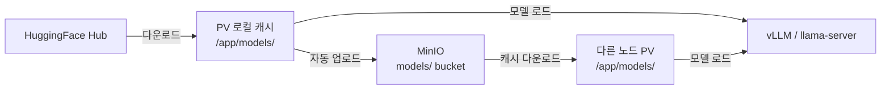
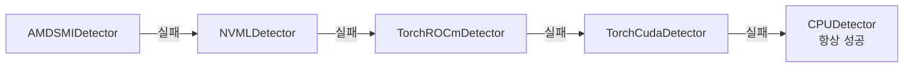

## 개요

XGEN 플랫폼에서 LLM 모델 서빙을 담당하는 서비스가 xgen-model이다. v1은 단일 파일에 모든 로직이 섞여 있었고, 모델 파일은 Pod의 로컬 디스크에만 존재했다. GPU 벤더(NVIDIA/AMD)별 분기도 하드코딩이었다.

v2에서 전면 리팩토링했다. 4-Tier 아키텍처로 관심사를 분리하고, MinIO 기반 중앙 모델 저장소를 도입했다. vLLM을 0.15.1에서 0.17.0으로 올리면서 embedding 플래그가 바뀌는 등 마이그레이션 이슈도 있었고, 여러 모델을 동시에 서빙하면서 LLM/임베딩 요청을 자동 라우팅하는 Inference Proxy도 새로 만들었다.

이 글에서는 v2 아키텍처의 설계 의도, MinIO 모델 허브의 캐시 전략, vLLM 0.17.0 마이그레이션, Inference Proxy, GPU 감지 Fallback Chain, zombie 프로세스 처리까지 다룬다.

---

## 4-Tier 아키텍처

v2의 핵심은 계층 분리다. 하위 계층이 상위 계층에 의존하지 않도록 설계했다.



| Tier | 역할 | 주요 모듈 |
|------|------|-----------|
| 1 | HTTP API, 라우팅, 요청 검증 | `management.py`, `inference.py`, `storage.py` |
| 2 | 모델 로드/언로드, 상태 관리, 백엔드 선택 | `process_manager.py` |
| 3 | 실제 프로세스 실행 (vLLM/llama-server) | `vllm_cuda.py`, `llama_server.py` 등 |
| 4 | GPU 하드웨어 감지 | `gpu_detector.py` |

디렉토리 구조가 이 계층을 그대로 반영한다.

```
xgen-model/
├── src/app/api/          # Tier 1
├── backend/
│   ├── process_manager.py # Tier 2
│   ├── adapters/          # Tier 3
│   ├── hardware/          # Tier 4
│   ├── storage/           # MinIO
│   └── download/          # HF Hub 다운로드
```

---

## MinIO 모델 허브

### 문제: 모델 파일이 Pod에 갇혀 있다

v1에서는 모델 파일이 Pod의 PV(Persistent Volume)에만 존재했다. 문제는 세 가지였다.

1. **멀티 노드 배포 불가**: 다른 노드에서 같은 모델을 쓰려면 다시 다운로드해야 한다
2. **모델 관리 불가**: 어떤 모델이 어디에 있는지 추적할 방법이 없다
3. **폐쇄망 배포 곤란**: HuggingFace에서 직접 다운로드할 수 없는 환경에서 모델을 전달할 방법이 없다

### 해결: MinIO 중앙 저장소 + PV 캐시



모든 모델은 MinIO의 `models/` 버킷에 원본이 저장된다. 각 노드의 PV는 캐시 역할이다.

**MinIO 버킷 구조**:

```
models/
  gguf/Qwen_Qwen3-4B/         ← GGUF 파일
  huggingface/Qwen_Qwen3-27B/  ← safetensors + config.json
```

MinIO prefix가 그대로 로컬 경로에 매핑된다.

```python
def _prefix_to_local(self, minio_prefix: str) -> Path:
    return self._models_dir / minio_prefix
    # "gguf/Qwen_Qwen3-4B" → /app/models/gguf/Qwen_Qwen3-4B
```

### 캐시 다운로드

모델 로드 요청이 오면, MinIO에서 로컬 PV로 캐시한다. 이미 존재하는 파일은 크기 비교로 스킵한다.

```python
async def download_to_cache(self, minio_prefix: str) -> Path:
    objects = self._client.list_objects(self._bucket, prefix=minio_prefix, recursive=True)
    for obj in objects:
        local_path = self._prefix_to_local(obj.object_name)
        if local_path.exists() and local_path.stat().st_size == obj.size:
            continue  # 크기 동일하면 스킵
        local_path.parent.mkdir(parents=True, exist_ok=True)
        self._client.fget_object(self._bucket, obj.object_name, str(local_path))
    return self._resolve_model_dir(local_dir)
```

`_resolve_model_dir`는 HuggingFace 캐시의 snapshot 디렉토리 구조를 인식한다. `config.json`이 있는 디렉토리를 찾아서 반환하는데, vLLM이 이 파일 위치를 기준으로 모델을 로드하기 때문이다.

### 다운로드 → 업로드 자동화

HuggingFace에서 모델을 다운로드하면 자동으로 MinIO에 업로드된다.

```python
async def _execute_download(self, job: DownloadJob):
    # Step 1: HuggingFace Hub에서 다운로드
    local_path = snapshot_download(
        repo_id=job.model_name,
        local_dir=target_dir,
    )
    job.local_path = local_path

    # Step 2: MinIO에 자동 업로드
    if self._minio_storage:
        job.status = DownloadStatus.UPLOADING
        minio_prefix = MinIOModelStorage.build_minio_prefix(
            job.model_name, job.format
        )
        await self._minio_storage.upload_model(
            Path(job.local_path), minio_prefix
        )
    job.status = DownloadStatus.COMPLETED
```

폐쇄망에서는 MinIO에 미리 모델을 업로드해두면, 각 노드에서 MinIO로부터 캐시 다운로드만 하면 된다. HuggingFace 접근 없이도 모델 배포가 가능해진다.

### API에서의 MinIO 연동

모델 로드 시 경로가 MinIO prefix인지 자동 판별한다.

```python
@router.post("/api/management/load")
async def load_model(payload: ModelLoadRequest):
    if minio_storage and _is_minio_prefix(payload.model_path):
        # MinIO에서 캐시 다운로드
        if not minio_storage.is_cached(payload.model_path):
            await minio_storage.download_to_cache(payload.model_path)
        actual_path = str(minio_storage.get_local_path(payload.model_path))
    else:
        actual_path = payload.model_path
    # 로컬 경로로 모델 로드
    await process_manager.load(actual_path, payload)
```

프론트엔드에서는 MinIO 모델 목록을 조회하고, 선택하면 prefix가 그대로 `model_path`로 전달된다. 사용자 입장에서는 로컬이든 MinIO든 동일한 인터페이스로 모델을 로드한다.

---

## vLLM 0.17.0 마이그레이션

### 변경점

vLLM 0.15.1에서 0.17.0으로 업그레이드하면서 breaking change가 있었다.

| 항목 | 0.15.1 | 0.17.0 |
|------|--------|--------|
| Embedding 모드 플래그 | `--task embedding` | `--runner pooling --convert embed` |
| Qwen3.5 지원 | 미지원 | 지원 |
| torch 버전 | 2.3.x | 2.6.x |

가장 큰 변경은 embedding 모드다. `--task embedding` 플래그가 `--runner pooling --convert embed`로 분리됐다.

```python
# vllm_base.py — 명령어 빌드
def _build_command(self, request: ModelLoadRequest) -> list[str]:
    cmd = [
        sys.executable, "-m", "vllm.entrypoints.openai.api_server",
        "--model", request.model_path,
        "--host", "0.0.0.0",
        "--port", str(port),
        "--served-model-name", request.model_name or request.model_path,
    ]

    if request.server_type == "embedding":
        cmd.extend(["--runner", "pooling", "--convert", "embed"])

    if request.tensor_parallel_size and request.tensor_parallel_size > 1:
        cmd.extend(["--tensor-parallel-size", str(request.tensor_parallel_size)])

    # extra_args: 프론트엔드에서 전달된 추가 플래그
    for key, value in request.extra_args.items():
        flag = f"--{key.replace('_', '-')}"
        if isinstance(value, bool):
            if value:
                cmd.append(flag)
        else:
            cmd.extend([flag, str(value)])

    return cmd
```

`extra_args`는 프론트엔드에서 사용자가 직접 vLLM 옵션을 지정할 수 있게 해준다. `max_model_len`, `gpu_memory_utilization` 같은 파라미터를 Python dict로 받아서 CLI 플래그로 변환한다.

### `--served-model-name` 설정

vLLM은 기본적으로 모델 경로를 그대로 모델 이름으로 사용한다. `/app/models/huggingface/Qwen_Qwen3-27B` 같은 긴 경로가 OpenAI 호환 API의 `model` 필드에 들어가면 불편하다.

`--served-model-name`으로 짧은 이름을 지정하면, `/v1/chat/completions`에서 `"model": "Qwen3-27B"`처럼 쓸 수 있다.

### 폐쇄망 환경변수

vLLM은 시작할 때 HuggingFace Hub에서 토크나이저 설정을 확인하려 한다. 폐쇄망에서는 이 요청이 타임아웃으로 시작이 지연된다.

```python
env = os.environ.copy()
env["HF_HUB_OFFLINE"] = "1"
env["TRANSFORMERS_OFFLINE"] = "1"
```

모든 vLLM 서브프로세스에 이 환경변수를 주입하여 외부 요청을 원천 차단한다.

---

## Inference Proxy: LLM/임베딩 자동 라우팅

xgen-model이 LLM과 임베딩 모델을 동시에 서빙하면, 추론 요청을 올바른 백엔드로 라우팅해야 한다. Inference Proxy가 이 역할을 한다.

```python
_EMBEDDING_PATHS = {"v1/embeddings", "v1/embed"}

def _detect_server_type(path: str) -> str:
    """요청 경로에서 서버 타입을 감지한다."""
    if path.startswith("embedding/"):
        return "embedding"
    if path in _EMBEDDING_PATHS:
        return "embedding"
    return "llm"
```

라우팅 규칙은 단순하다.

| 요청 경로 | 라우팅 대상 |
|-----------|------------|
| `/api/inference/v1/chat/completions` | LLM 백엔드 |
| `/api/inference/v1/completions` | LLM 백엔드 |
| `/api/inference/v1/embeddings` | Embedding 백엔드 |
| `/api/inference/embedding/v1/*` | Embedding 백엔드 (명시적) |

```python
@router.api_route("/api/inference/{path:path}", methods=["GET", "POST", "PUT", "DELETE"])
async def inference_proxy(path: str, request: Request):
    server_type = _detect_server_type(path)
    backend_url = _get_backend_url(server_type)
    if not backend_url:
        raise HTTPException(503, f"No {server_type} backend available")

    # 요청 프록시
    async with httpx.AsyncClient() as client:
        proxy_url = f"{backend_url}/{path}"
        response = await client.request(
            method=request.method,
            url=proxy_url,
            content=await request.body(),
            headers=dict(request.headers),
        )

    # SSE 스트리밍 처리
    if "text/event-stream" in response.headers.get("content-type", ""):
        return StreamingResponse(
            response.aiter_bytes(),
            media_type="text/event-stream"
        )
    return Response(content=response.content, status_code=response.status_code)
```

`_get_backend_url`는 ProcessManager에서 현재 로드된 모델 목록을 조회하고, `server_type`이 일치하는 모델의 포트를 반환한다. LLM과 임베딩이 각각 다른 포트에서 실행되므로, 프록시가 올바른 포트로 전달하는 것이다.

---

## GPU 감지 Fallback Chain

다양한 GPU 환경(NVIDIA, AMD RDNA/CDNA, CPU only)을 자동으로 감지하는 체인이다.



각 디텍터는 `detect() -> GPUDetectionResult | None`을 구현하고, 첫 번째 성공한 결과를 반환한다.

```python
class UnifiedGPUDetector:
    _CHAIN = [AMDSMIDetector, NVMLDetector, TorchROCmDetector, TorchCudaDetector, CPUDetector]

    def detect(self) -> GPUDetectionResult:
        for detector_cls in self._CHAIN:
            result = detector_cls().detect()
            if result:
                return result
```

AMD GPU의 경우 gfx 버전으로 RDNA/CDNA를 구분한다.

```python
if gfx_version.startswith("gfx90a") or gfx_version.startswith("gfx94"):
    gpu_type = GPUType.AMD_CDNA   # 데이터센터 GPU (MI250, MI300)
else:
    gpu_type = GPUType.AMD_RDNA   # 소비자 GPU (RX 7900, RX 9070)
```

이 구분이 중요한 이유는 CDNA는 vLLM ROCm을 지원하지만, RDNA는 llama-server Vulkan이 더 안정적이기 때문이다.

---

## 백엔드 자동 선택

GPU 타입과 모델 형식을 조합하여 최적의 백엔드를 자동 선택한다.

```python
def _select_backend(self, model_path: str, gpu_type: str) -> str:
    is_gguf = model_path.endswith(".gguf")

    if is_gguf:
        # GGUF → llama-server 우선
        if "llama-server-vulkan" in self._available:
            return "llama-server-vulkan"
        if "llama-server-cuda" in self._available:
            return "llama-server-cuda"
    else:
        # safetensors/HF → vLLM 우선
        if "vllm-cuda" in self._available:
            return "vllm-cuda"
        if "vllm-rocm" in self._available:
            return "vllm-rocm"

    return "llama-cpp-python"  # 최후 CPU fallback
```

| 모델 형식 | NVIDIA GPU | AMD CDNA | AMD RDNA | CPU only |
|-----------|-----------|----------|----------|----------|
| GGUF | llama-server-cuda | llama-server-rocm | llama-server-vulkan | llama-cpp-python |
| safetensors | vllm-cuda | vllm-rocm | llama-server-vulkan | llama-cpp-python |

사용자가 모델을 선택하면, GPU 환경에 따라 자동으로 최적 백엔드가 결정된다.

---

## 모델 라이프사이클과 zombie 프로세스

### 상태 관리

```python
class ModelState(Enum):
    LOADING = "loading"
    LOADED = "loaded"
    UNLOADING = "unloading"
    ERROR = "error"
```

모델 로드는 비동기다. 요청이 오면 `LOADING` 상태로 전환하고, 백그라운드에서 프로세스를 시작한다. vLLM이 ready 상태가 되면 `LOADED`로 전환한다.

### Ready 감지

vLLM은 모델 로딩이 끝나면 `Uvicorn running on ...` 로그를 출력한다. 이 로그를 감시하여 ready를 판단한다.

```python
async def _wait_for_ready(self, process, timeout: int = 300):
    """vLLM 프로세스의 ready 상태를 대기한다."""
    start = time.monotonic()
    async for line in process.stdout:
        text = line.decode()
        if "Uvicorn running on" in text:
            return True
        if time.monotonic() - start > timeout:
            raise TimeoutError(f"Model not ready in {timeout}s")
```

대형 모델(122B 등)은 로딩에 수십 분이 걸린다. llama-server는 타임아웃을 1800초(30분)로 설정했다.

### Zombie 프로세스 처리

모델 언로드 시 vLLM 프로세스가 깔끔하게 종료되지 않는 경우가 있었다. 특히 GPU 메모리를 해제하는 과정에서 hang이 걸렸다.

```python
async def _stop_process(self, process):
    """프로세스를 단계적으로 종료한다."""
    # Step 1: 로그 태스크 cancel (blocking readline 해제)
    if self._log_task:
        self._log_task.cancel()

    # Step 2: SIGTERM 시도
    process.terminate()
    try:
        await asyncio.wait_for(process.wait(), timeout=15)
        return
    except asyncio.TimeoutError:
        pass

    # Step 3: SIGKILL
    process.kill()
    try:
        await asyncio.wait_for(process.wait(), timeout=10)
        return
    except asyncio.TimeoutError:
        pass

    # Step 4: 최후 수단 — OS 레벨 kill + waitpid
    try:
        os.kill(process.pid, signal.SIGKILL)
        os.waitpid(process.pid, 0)
    except (ProcessLookupError, ChildProcessError):
        pass
```

4단계 종료 프로토콜이다. `SIGTERM` → `SIGKILL` → `os.kill` + `os.waitpid`. `os.waitpid`가 핵심인데, 이것을 호출하지 않으면 커널에 zombie 프로세스가 남아서 PID와 GPU 메모리를 계속 점유한다.

로그 태스크를 먼저 cancel하는 것도 중요하다. `process.stdout`을 비동기로 읽는 태스크가 살아있으면, 프로세스가 종료돼도 파이프가 닫히지 않아서 hang이 걸린다.

---

## tqdm 스레드 락 버그

vLLM 0.17.0 업그레이드 후 모델 로딩 시 랜덤하게 hang이 걸리는 현상이 있었다. 원인은 `ThreadPoolExecutor`에서 tqdm 프로그레스 바가 GIL을 잡고 놓지 않는 문제였다.

HuggingFace의 `snapshot_download`가 내부적으로 tqdm을 사용하는데, 이것이 `ThreadPoolExecutor` 안에서 실행되면 GIL 경합이 발생한다. 해결은 다운로드를 별도 프로세스로 분리하는 것이었다.

---

## 결과

v2 리팩토링 후 달라진 것들이다.

**MinIO 모델 허브**:
- 모델 다운로드 1회 → MinIO에 영구 저장 → 모든 노드에서 캐시로 즉시 사용
- 폐쇄망에서 MinIO에 모델만 넣으면 배포 완료 (HuggingFace 불필요)
- 프론트엔드에서 MinIO 모델 목록 조회 → 클릭 한 번으로 로드

**vLLM 0.17.0**:
- Qwen3.5 시리즈 지원 (27B, 122B)
- embedding 모드 안정성 향상 (`--runner pooling --convert embed`)
- `extra_args`로 사용자 커스텀 파라미터 전달 가능

**Inference Proxy**:
- LLM과 임베딩 모델 동시 서빙
- 클라이언트는 단일 엔드포인트(`/api/inference/`)만 알면 됨
- SSE 스트리밍 투명하게 프록시

**GPU Fallback Chain**:
- NVIDIA/AMD RDNA/AMD CDNA/CPU를 자동 감지
- 모델 형식(GGUF/safetensors)에 따라 최적 백엔드 자동 선택
- 사용자가 GPU 벤더를 신경 쓸 필요 없음
