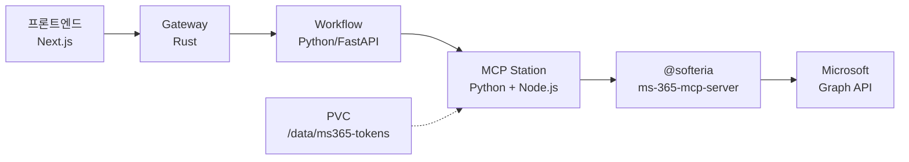
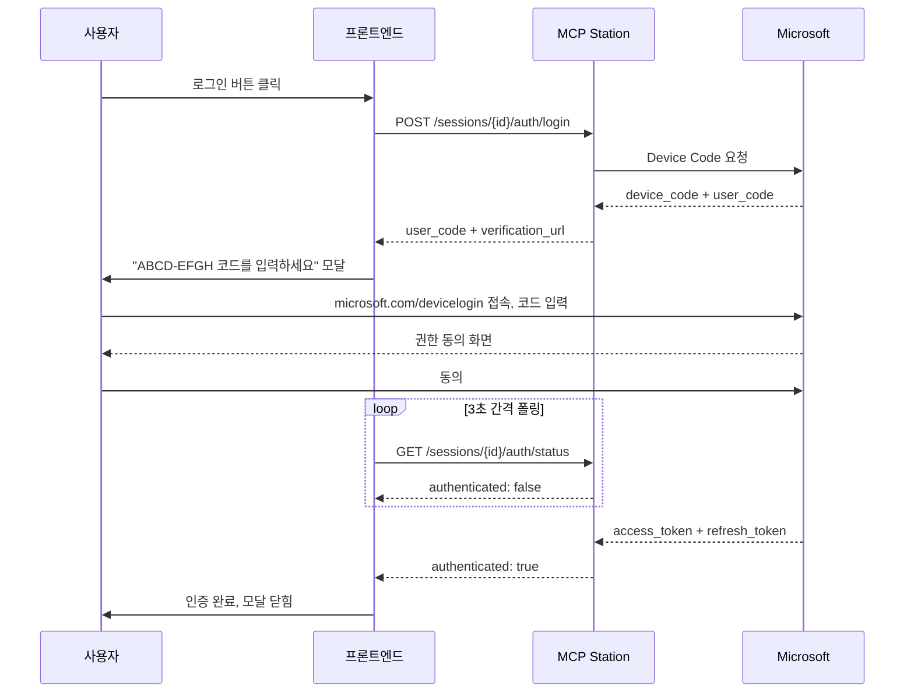

# XGEN MS 365 MCP 통합 — Device Code Flow 인증부터 워크플로우 노드까지

## 배경

XGEN 2.0은 AI Agent가 워크플로우를 통해 외부 서비스를 호출하는 플랫폼이다. 기존에 Teams 전용 MCP 노드(`teams_mcp`)가 있었지만, 커버리지가 Teams 메시지 전송에 한정되어 있었다. Microsoft 365 전체 — Outlook 메일, 캘린더, Teams, OneDrive, Planner, To Do, OneNote, Excel, SharePoint — 를 하나의 MCP 노드로 통합하는 작업을 진행했다.

기반 MCP 서버로 `@softeria/ms-365-mcp-server`를 선택했다. 100개 이상의 도구를 제공하며, Device Code Flow 인증을 지원한다. 문제는 이 MCP 서버를 XGEN의 K8s 환경에 어떻게 올리고, 인증을 어떻게 처리하며, 100개 이상의 도구를 LLM이 어떻게 소화하게 할 것인가였다.

3/3 저녁부터 3/4 오후까지, 약 18시간 동안 8번의 커밋을 거쳐 완성했다. 그 과정에서 인증 방식을 3번 바꿨다.


## 아키텍처 설계

### 왜 MCP Station을 경유하는가

XGEN의 워크플로우 엔진(`xgen-workflow`)은 Python/FastAPI 기반이다. 그런데 `@softeria/ms-365-mcp-server`는 Node.js 패키지로, `npx`로 실행해야 한다. xgen-workflow Docker 이미지에는 Node.js가 없다.

두 가지 선택지가 있었다:
1. xgen-workflow Dockerfile에 Node.js를 추가
2. 이미 Node.js가 있는 xgen-mcp-station을 경유

1번은 단순하지만, 워크플로우 이미지 크기가 불필요하게 커지고, MCP 서버마다 다른 런타임을 요구할 때마다 이미지를 수정해야 한다. 2번이 아키텍처적으로 올바른 선택이다.

xgen-mcp-station은 Python + Node.js 환경을 모두 갖추고 있고, MCP 서버 세션을 HTTP API로 관리하는 서비스다. 워크플로우 노드는 MCP Station의 REST API를 호출하여 세션을 생성하고, 도구를 로드하고, 도구를 실행한다.



### 4-Service 요청 흐름

실제 요청은 4개의 서비스를 거친다:

1. **프론트엔드**: 사용자가 MCP Station UI에서 MS365 로그인
2. **Gateway (Rust)**: `/api/mcp/*` 요청을 Workflow로 라우팅
3. **Workflow (Python)**: MCP 관련 엔드포인트를 MCP Station으로 프록시
4. **MCP Station (Python + Node.js)**: `npx @softeria/ms-365-mcp-server` 실행, 세션/인증 관리

이 구조에서 라우팅 설정이 잘못되면 404가 발생한다. 실제로 겪었다.


## 인증 방식의 3번 전환

이 작업에서 가장 많은 시행착오를 겪은 부분이다. 18시간 동안 인증 방식을 3번 바꿨다.

### 1차: Azure Portal 키 직접 입력

처음에는 가장 직관적인 방식을 시도했다. Azure Portal에서 앱을 등록하고, Client ID / Client Secret / Tenant ID 세 가지 키를 워크플로우 노드의 파라미터로 받는 방식이다.

```python
# 첫 번째 시도: Azure 키 3개를 환경변수로 전달
env_vars = {
    "MS365_CLIENT_ID": client_id,
    "MS365_CLIENT_SECRET": client_secret,
    "MS365_TENANT_ID": tenant_id,
}
```

문제: `@softeria/ms-365-mcp-server`를 자세히 읽어보니, 공식 문서 기준 필수 환경변수는 없었다. 내장 Client ID를 사용하며, Device Code Flow로 사용자가 직접 인증하는 방식이 기본이다. Azure에서 앱을 따로 등록할 필요가 없었다.

### 2차: Client Credentials Grant

서버 환경에서는 브라우저가 없으니 Device Code Flow가 불가능하다고 판단했다. Client Credentials Grant 방식으로 전환했다. 서비스 계정으로 MS Graph API에 접근하는 방식이다.

```python
# 두 번째 시도: Client Credentials (서비스 계정)
# Azure AD 관리자가 앱 등록 + Application 권한 부여 + 관리자 동의 필요
```

문제: Client Credentials Grant는 **Application 권한**만 사용할 수 있다. Delegated 권한(사용자 대신 행동)이 불가능하다. 즉, 특정 사용자의 메일을 읽거나, 특정 사용자의 캘린더에 일정을 추가하려면 관리자가 모든 사용자의 메일에 접근하는 권한을 부여해야 한다. 보안적으로 부적절하고, 고객사 Azure AD 관리자의 승인을 받기가 현실적으로 어렵다.

### 3차: Device Code Flow (최종)

다시 생각해보니, Device Code Flow가 서버 환경에서도 사용 가능하다. 서버에 브라우저가 없어도, **사용자의 브라우저**에서 인증하면 된다. 서버는 Device Code를 생성하고, 사용자에게 코드를 보여주고, 사용자가 자기 브라우저에서 `https://microsoft.com/devicelogin`에 접속하여 코드를 입력하면 된다.



이 방식의 장점:
- Azure 앱 등록 불필요 (`@softeria` 내장 Client ID 사용)
- Delegated 권한 사용 가능 (사용자 본인의 메일/캘린더만 접근)
- 고객사 Azure AD 관리자 승인 불필요
- 사용자별 토큰 분리 가능


## 토큰 캐시와 K8s PVC

Device Code Flow의 치명적인 단점이 하나 있다. Pod이 재시작되면 토큰이 사라진다. 사용자가 매번 다시 인증해야 한다면 사용성이 크게 떨어진다.

`@softeria/ms-365-mcp-server`는 `MS365_MCP_TOKEN_CACHE_DIR` 환경변수로 토큰 캐시 경로를 지정할 수 있다. 이 경로를 K8s PersistentVolumeClaim(PVC)에 마운트하면 Pod 재시작에도 토큰이 유지된다.

```yaml
# xgen-mcp-station Helm values
volumeMounts:
  - name: ms365-tokens
    mountPath: /data/ms365-tokens

volumes:
  - name: ms365-tokens
    persistentVolumeClaim:
      claimName: xgen-mcp-station-tokens

persistentVolumeClaims:
  - name: xgen-mcp-station-tokens
    storage: 1Gi
    accessMode: ReadWriteOnce
```

사용자별 토큰을 분리하기 위해, 캐시 경로에 user_id를 포함시킨다:

```python
TOKEN_CACHE_BASE_DIR = "/data/ms365-tokens"

# 세션 생성 시 사용자별 토큰 디렉토리 지정
token_dir = os.path.join(TOKEN_CACHE_BASE_DIR, str(user_id))
env_vars = {"MS365_MCP_TOKEN_CACHE_DIR": token_dir}
# → /data/ms365-tokens/user123/
```

이렇게 하면 사용자 A의 토큰과 사용자 B의 토큰이 분리되고, refresh token이 유효한 동안은 재인증 없이 사용할 수 있다.


## 워크플로우 노드 구현

### MS365MCP 노드

워크플로우 노드의 핵심 로직은 다음과 같다:

1. `user_id`로 MCP Station에서 인증된 기존 MS365 세션을 검색
2. 없으면 새 세션을 생성하고, 기존 토큰 캐시로 자동 인증 시도
3. 미인증이면 에러 ("MCP Station에서 로그인하세요")
4. 도구 로드 (npx 시작 대기 포함, 최대 30초 폴링)
5. 인증 관리 도구(login, logout 등) 제외 후 LangChain Tool로 변환

```python
class MS365MCP(Node):
    nodeId = "mcp/ms365_mcp"
    nodeName = "Microsoft 365 MCP"

    parameters = [
        {
            "id": "preset",
            "name": "기능 프리셋",
            "type": "STR",
            "value": "all",
            "options": [
                {"value": "all", "label": "전체 (All)"},
                {"value": "mail", "label": "메일 (Outlook Mail)"},
                {"value": "calendar", "label": "캘린더 (Calendar)"},
                {"value": "work", "label": "업무 (Teams + Planner + SharePoint)"},
                {"value": "files", "label": "파일 (OneDrive)"},
                # ...
            ],
        },
    ]
```

### 인증 아키텍처 재설계: 438줄 → 244줄

첫 구현에서는 워크플로우 실행 중에 Device Code Flow 인증을 수행했다. SSE 스트리밍 컨텍스트를 해킹하여 인증 코드를 실시간으로 사용자에게 전달하는 방식이었다.

```python
# 첫 구현 (삭제된 코드): 워크플로우 실행 중 인증
async def _perform_device_code_auth(self, session_id):
    # SSE 스트리밍 컨텍스트를 해킹하여 인증 코드 전달
    self._emit_auth_required(device_code, verification_url)
    # 90초 타임아웃으로 인증 완료 대기
    await self._wait_for_session_ready(session_id, timeout=90)
```

이 방식의 문제:
- 워크플로우 실행이 인증 대기 중 블로킹
- SSE 스트리밍 컨텍스트에 대한 의존성이 노드 내부에 침투
- 인증 실패 시 워크플로우 전체가 실패
- 코드가 438줄로 비대

재설계 후에는 **인증과 실행을 완전히 분리**했다. 인증은 MCP Station UI에서 사전에 수행하고, 워크플로우 노드는 인증된 세션만 사용한다. 244줄로 줄었다.

```python
# 재설계 후: 인증된 세션만 사용
def execute(self, preset="all", org_mode=True, user_id="", **kwargs):
    # 1. 인증된 기존 세션 검색
    session_id = sync_run_async(self._find_authenticated_session(user_id))

    if not session_id:
        # 2. 새 세션 생성 + 토큰 캐시로 자동 인증 시도
        session_id = sync_run_async(self._create_session(preset, org_mode, user_id))
        if not sync_run_async(self._check_auth(session_id)):
            raise RuntimeError("MS365 인증이 필요합니다. MCP Station에서 로그인하세요.")

    # 3. 도구 로드
    mcp_tools = sync_run_async(self._load_tools_with_retry(session_id))
    # 4. LangChain Tool 변환 (인증 도구 제외)
    return self._convert_to_langchain_tools(mcp_tools, session_id)
```

### verify-login 오탐 버그

인증 상태를 확인하는 `_check_auth()`에서 재미있는 버그가 있었다. MCP 서버의 `verify-login` 응답을 키워드로 판별하고 있었는데, 응답 텍스트에 `"success":false`가 포함되어 있을 때 "success"라는 단어가 매칭되어 인증 성공으로 오판했다.

```python
# 버그 코드
if "success" in response_text:  # "success":false도 매칭됨!
    return True

# 수정 코드
result = response.json()
return result.get("authenticated", False)
```

키워드 매칭 대신 JSON 파싱으로 수정했다. 이런 류의 버그는 정상 케이스에서는 발견되지 않고, 미인증 상태에서만 나타나기 때문에 놓치기 쉽다.


## 프론트엔드: Device Code 인증 UI

### MCP Station 인증 관리

MCP Station 페이지에 MS365 세션 전용 인증 UI를 추가했다.

**세션 카드에 인증 상태 뱃지**: MS365 세션 로드 시 `/auth/status` API를 호출하여 인증 여부를 확인하고, "인증됨" / "미인증" 뱃지를 표시한다.

**로그인 버튼 → Device Code 모달**: 로그인 버튼을 클릭하면 MCP Station에 `/auth/login`을 호출하여 Device Code를 받아오고, 모달에 표시한다.

모달에는 다음 정보가 표시된다:
- 8자리 Device Code (복사 버튼 포함)
- Microsoft 인증 페이지 링크 (`https://microsoft.com/devicelogin`)
- 3초 간격으로 인증 완료 여부 자동 폴링
- 인증 완료 시 모달 자동 닫힘 + 뱃지 갱신

### 프리셋 선택

전체 MS 365 도구를 로드하면 100개 이상, 약 3.4M 토큰이다. LLM의 context window를 초과하거나 비용이 폭발한다. 프리셋으로 필요한 도구만 선택적으로 로드할 수 있게 했다.

| 프리셋 | 포함 도구 | 용도 |
|--------|----------|------|
| mail | 메일 조회/발송/첨부파일 | 메일 자동화 |
| calendar | 일정 조회/생성/수정 | 스케줄 관리 |
| work | Teams + Planner + SharePoint | 팀 협업 |
| files | OneDrive 파일 관리 | 문서 처리 |
| personal | 메일 + 캘린더 + 연락처 + To Do | 개인 생산성 |
| excel | 엑셀 범위/차트/정렬 | 데이터 처리 |
| tasks | To Do + Planner | 작업 관리 |
| all | 전체 (100+개) | 범용 |

프론트엔드의 MCP 마켓 상세 페이지에서 `@softeria/ms-365-mcp-server`를 감지하면 프리셋 드롭다운이 자동으로 나타난다. 선택된 프리셋은 `server_args`에 `--preset` 옵션으로 주입된다.


## Gateway 라우팅 삽질

이 작업에서 가장 허무한 문제가 Gateway 라우팅이었다. MCP Station에 인증 엔드포인트를 추가했는데, 프론트엔드에서 호출하면 404가 발생했다.

### 1차 시도: Gateway → MCP Station 직접

"MCP Station에 직접 라우팅하면 되지 않을까?" 하고 Gateway의 `/api/mcp/*` 라우팅을 `xgen-mcp-station:8000`으로 변경했다.

```rust
// Gateway 라우팅 변경
"/api/mcp/*" => "http://xgen-mcp-station:8000"
```

결과: 인증 API는 동작했지만, MCP 마켓 목록 등 기존 `/api/mcp/market` 엔드포인트가 Workflow에 있었기 때문에 전부 404로 깨졌다.

### 2차 시도: Gateway → Workflow → MCP Station (최종)

원래 구조대로 Gateway → Workflow로 라우팅하되, Workflow에 auth 프록시 엔드포인트를 추가했다.

```python
# workflow mcpController.py에 추가
@router.post("/sessions/{session_id}/auth/login")
async def auth_login(session_id: str):
    # MCP Station으로 프록시
    async with httpx.AsyncClient() as client:
        resp = await client.post(
            f"{MCP_STATION_URL}/sessions/{session_id}/auth/login"
        )
        return resp.json()

@router.get("/sessions/{session_id}/auth/status")
async def auth_status(session_id: str):
    # MCP Station으로 프록시
    ...

@router.post("/sessions/{session_id}/auth/logout")
async def auth_logout(session_id: str):
    # MCP Station으로 프록시
    ...
```

이것이 올바른 구조다. Workflow 서비스가 MCP 관련 API의 단일 진입점 역할을 하고, 내부적으로 MCP Station에 위임한다. Gateway는 Workflow만 알면 된다.


## MCP Station Dockerfile

MCP Station은 Python + Node.js 듀얼 런타임 환경이 필요하다. Python은 FastAPI 메인 앱, Node.js는 `npx`를 통한 MCP 서버 실행용이다.

```dockerfile
# Python 기반 + Node.js 22 LTS 설치
FROM python:3.14-slim

# Node.js 22.x LTS (nodesource 저장소)
RUN curl -fsSL https://deb.nodesource.com/gpgkey/nodesource-repo.gpg.key \
    | gpg --dearmor -o /etc/apt/keyrings/nodesource.gpg \
    && echo "deb [signed-by=/etc/apt/keyrings/nodesource.gpg] \
       https://deb.nodesource.com/node_22.x nodistro main" \
    | tee /etc/apt/sources.list.d/nodesource.list \
    && apt-get update && apt-get install -y nodejs

# app 사용자로 실행 (npm 글로벌 설치 경로 설정)
USER app
ENV NPM_CONFIG_PREFIX=/home/app/.npm-global
ENV PATH=/home/app/.npm-global/bin:$PATH
```

`npx @softeria/ms-365-mcp-server`를 처음 실행하면 패키지를 다운로드하는 데 시간이 걸린다. 워크플로우 노드에서 도구 로드 시 최대 30초까지 폴링하는 이유다.

```python
TOOLS_LOAD_TIMEOUT = 30.0
TOOLS_LOAD_POLL_INTERVAL = 2.0

async def _load_tools_with_retry(self, session_id):
    start_time = time.time()
    while time.time() - start_time < TOOLS_LOAD_TIMEOUT:
        tools = await self._get_tools(session_id)
        if tools:
            return tools
        await asyncio.sleep(TOOLS_LOAD_POLL_INTERVAL)
```


## LangChain Tool 변환

MCP 서버에서 로드한 도구를 LangChain의 `@tool` 데코레이터로 감싸서 Agent가 호출할 수 있게 변환한다.

```python
AUTH_MANAGEMENT_TOOLS = {
    "login", "verify-login", "logout",
    "list-accounts", "select-account", "remove-account"
}

for mcp_tool in mcp_tools:
    tool_name = mcp_tool.get("name")
    if tool_name in AUTH_MANAGEMENT_TOOLS:
        continue  # 인증 도구는 Agent에 노출하지 않음

    def create_tool_fn(t_name, t_sid, t_schema, t_desc):
        @tool(t_name, description=t_desc, args_schema=t_schema)
        def wrapper(**kw) -> str:
            result = sync_run_async(self._call_mcp_tool(t_sid, t_name, kw))
            return str(result)
        return wrapper

    langchain_tools.append(create_tool_fn(tool_name, session_id, ...))
```

`create_tool_fn` 클로저 패턴에 주의해야 한다. 루프 안에서 직접 `@tool`을 정의하면 모든 tool이 마지막 `tool_name`을 참조하는 클로저 문제가 발생한다. 별도 함수로 분리하여 각 tool이 자신만의 `t_name`, `t_sid`를 캡처하도록 했다.


## 전체 흐름 정리

최종적으로 MS365 MCP가 동작하는 전체 흐름은 다음과 같다.

**사전 인증 (1회)**:
1. 사용자가 XGEN 관리자 > MCP Station 페이지 접속
2. MS365 세션 카드의 "로그인" 버튼 클릭
3. Device Code 모달에서 코드 복사
4. `microsoft.com/devicelogin`에서 코드 입력 + 권한 동의
5. 토큰이 PVC(`/data/ms365-tokens/{user_id}/`)에 저장
6. Pod 재시작에도 토큰 유지

**워크플로우 실행 (매번)**:
1. 사용자가 워크플로우에 MS365 MCP 노드 추가 (프리셋 선택)
2. 노드 실행 시 MCP Station에서 인증된 세션 검색
3. 없으면 새 세션 생성 → 토큰 캐시로 자동 인증
4. 도구 로드 (프리셋에 따라 필터링)
5. LangChain Tool로 변환 → Agent가 사용


## 회고

### 인증 방식 선택의 교훈

Client Credentials Grant와 Device Code Flow의 차이를 제대로 이해하지 못한 채 시작한 것이 시행착오의 원인이었다.

| | Client Credentials | Device Code Flow |
|---|---|---|
| 권한 타입 | Application (앱 자체) | Delegated (사용자 대신) |
| 사용자 컨텍스트 | 없음 | 있음 |
| Azure 앱 등록 | 필수 | 불필요 (내장 가능) |
| 관리자 동의 | 필수 | 사용자 본인만 |
| 접근 범위 | 모든 사용자 데이터 | 해당 사용자만 |

XGEN처럼 **사용자 본인의** 메일과 캘린더에 접근해야 하는 경우, Device Code Flow가 맞다. Client Credentials는 서비스 계정 시나리오(예: 전사 메일 감사)에 적합하다.

### 인증과 실행의 분리

처음에는 워크플로우 실행 중에 인증을 수행했다. SSE 스트리밍 컨텍스트를 해킹하여 Device Code를 전달하는 방식이었다. 동작은 했지만 코드가 복잡했고(438줄), 워크플로우 실행이 인증 대기 중 블로킹되는 문제가 있었다.

인증과 실행을 분리한 후 코드가 244줄로 줄었고, 관심사가 깔끔하게 나뉘었다. 인증은 MCP Station UI에서, 실행은 워크플로우 노드에서. 각자 자기 책임만 진다.

### 프리셋의 필요성

MS 365 도구가 100개 이상, 약 3.4M 토큰이라는 것은 예상하지 못했다. 전체를 로드하면 LLM의 context window를 넘기거나, 도구 선택 정확도가 급락한다. 프리셋으로 "메일만", "캘린더만", "업무용만" 선택할 수 있게 한 것이 실사용에서 핵심이었다.
