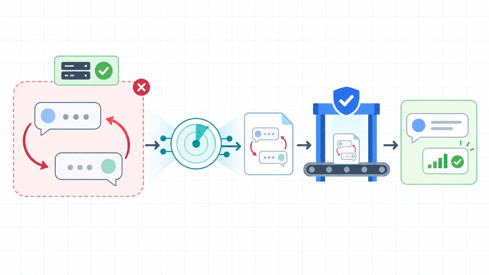
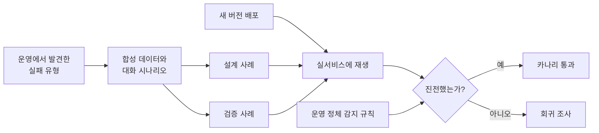

AI 서비스에서 가장 찾기 쉬운 문제는 오류가 난 문제다. 서버가 `500`을 반환하거나 작업 상태가 `failed`로 끝나면 로그와 알림이 남는다.

더 까다로운 문제는 오류가 없는데도 사용자는 아무것도 해결하지 못하는 경우다.

예를 들어 사용자가 데이터 파일을 올리고 "특징을 찾아줘"라고 요청했다고 하자. AI가 정답으로 삼을 데이터 열을 먼저 정해 달라고 묻고, 사용자는 무엇을 골라야 할지 모르겠다고 답한다. 그런데 AI는 다시 같은 질문을 조금 다른 말로 반복한다.

```text
사용자: 이 데이터에서 의미 있는 규칙을 찾아줘.
AI: 어떤 열을 예측할지 알려주세요.

사용자: 나도 잘 모르겠어. 먼저 살펴보고 추천해줘.
AI: 분석하려면 예측할 열을 선택해 주세요.
```

서버는 정상이고 응답도 빠르다. 예외도 발생하지 않았다. 하지만 사용자가 기대한 탐색은 시작되지 않았다. 시스템 관점에서는 성공처럼 보이고, 사용자 관점에서는 이미 실패한 대화다.

이 문제를 겪은 뒤 운영 모니터에 **대화 정체 감지**를 추가했다. 이어서 실제로 막혔던 대화의 형태를 합성 데이터로 재현하는 **재생 카나리(replay canary)**를 만들었다. 단순히 장애를 빨리 찾는 데서 끝내지 않고, 같은 실패가 다음 배포에서 다시 나타나는지도 확인하기 위해서다.



_서버가 정상이어도 대화는 실패할 수 있다. 반복 감지 결과를 합성 재현 사례로 바꾸고, 배포 뒤 같은 기준으로 다시 검사했다._

## 실패하지 않았는데 실패한 대화

기존 운영 모니터는 전형적인 장애를 잘 찾았다.

- 웹 페이지와 API가 응답하는가
- 작업이 `failed`로 끝났는가
- 실행 중인 작업이 제한 시간을 넘겼는가
- 최근 작업 성공률이 급격히 나빠졌는가

여기에 대화형 AI 특유의 빈틈이 있었다. AI가 이해 확인과 추가 질문만 반복하면 작업 자체가 만들어지지 않는다. 실패한 작업도 없고, 오래 실행 중인 작업도 없다. 감시할 대상이 생기기 전에 사용자가 대화를 포기해버린다.

그래서 대화의 성공 여부를 HTTP 상태 코드가 아니라 **진전(progress)**으로 다시 정의했다.

이 서비스에서 진전은 다음과 같은 상태로 이동하는 것이다.

- 실제 데이터 조회 결과를 보여준다.
- 분석이나 모델 생성 작업을 시작한다.
- 사용자의 질문에 직접 답한다.
- 다음 행동으로 이어지는 구체적인 선택지를 제시한다.

반대로 요청 이해, 입력 검증, 프로필 확인 같은 단계에만 계속 머문다면 응답이 몇 번 오갔더라도 진전으로 보지 않았다.

핵심은 메시지가 존재하느냐가 아니라, 대화 상태가 결과 쪽으로 이동했느냐다.

## 첫 시도는 막힘을 표현하는 문장을 찾는 것이었다

처음에는 사용자의 마지막 말에서 막힘을 나타내는 표현을 찾았다.

```text
잘 모르겠어
알아서 해줘
뭘 골라야 해
추천해줘
```

실제 문제를 빠르게 잡기에는 합리적인 출발이었다. 사용자가 "나도 잘 모르겠어"라고 했는데 AI가 같은 선택을 다시 요구하면 정체 가능성이 높다.

하지만 이 방식은 오래 갈 수 없었다.

첫째, 같은 뜻을 표현하는 문장은 끝없이 늘어난다. "감이 안 와", "네가 정해줘", "무엇부터 해야 하지"를 모두 목록에 넣기 시작하면 규칙이 사용자 표현을 따라다니게 된다.

둘째, 언어에 종속된다. 한국어 목록으로는 영어나 다른 언어로 된 대화를 감지할 수 없다.

셋째, 문장 하나만으로는 맥락을 알기 어렵다. 사용자가 "추천해줘"라고 말했더라도 AI가 실제 추천 결과를 내놓았다면 실패가 아니다.

결국 특정 단어가 아니라 **반복되는 대화 구조**를 봐야 했다.

## 키워드 대신 대화 구조를 감지했다

최종 규칙은 후보를 고르는 단계와 정체를 확정하는 단계로 나눴다.

먼저 최근 대화에서 사용자가 두 번 이상 말했고, 그사이 AI가 이해·검증 단계에만 머물렀다면 정체 후보가 된다. 중간에 데이터 조회나 실행 결과가 하나라도 나왔다면 여기서 제외한다.

후보 대화는 다음 둘 중 하나를 만족할 때 정체로 확정한다.

1. 사용자 메시지가 세 번 이상 쌓였는데도 진전이 없다.
2. 사용자 또는 AI가 앞선 말을 비슷하게 반복했다.

따라서 사용자 메시지가 두 번뿐인 대화는 반복 신호까지 있어야 정체가 된다. 세 번 이상 계속됐을 때는 표현이 달라도 상태가 바뀌지 않았다는 사실을 더 중요하게 본다.

판단 로직을 단순화하면 다음과 같다.

```python
def is_stalled(messages, now):
    recent = messages.within(minutes=30, now=now)
    user_turns = recent.from_user()
    agent_turns = recent.from_agent()

    if len(user_turns) < 2:
        return False

    if agent_turns.contains_progress():
        return False

    repeated = similar_pair(user_turns) or similar_pair(agent_turns)
    return len(user_turns) >= 3 or repeated
```

문장 유사도는 완전히 같은 문자열만 비교하지 않았다. 구두점이나 일부 표현이 달라도 같은 질문을 되풀이한 것으로 볼 수 있도록 문자열 유사도를 사용했다. 이 규칙은 "잘 모르겠어" 같은 특정 문구를 알 필요가 없어서 언어나 업무 분야에 덜 종속된다.

여기서 중요한 선택은 대화 상태를 별도의 의미로 기록해둔 것이다. 단순히 답변 텍스트만 보고 "좋은 답인지"를 추측하는 대신, 각 응답이 요청 이해인지, 검증인지, 데이터 탐색인지, 실제 결과인지 구분했다. 덕분에 모니터는 모델의 문장 품질을 평가하지 않고도 대화가 앞으로 갔는지 확인할 수 있다.

## 알림은 한 번만 보내야 한다

정체를 찾았다고 매번 알림을 보내면 또 다른 문제가 생긴다. 모니터가 몇 분마다 실행되기 때문에 같은 대화가 해소되지 않는 동안 동일한 경고가 계속 발생한다.

프로젝트별 마지막 알림 시간을 상태로 저장하고, 일정 시간 동안 같은 대화에는 다시 알리지 않도록 제한했다. 오래된 상태는 주기적으로 제거했다.

운영 알림에는 문제를 확인하는 데 필요한 최소 정보만 담았다.

- 어느 대화에서 발생했는가
- 사용자가 원한 작업을 요약하면 무엇인가
- 마지막 사용자 문장의 일부는 무엇인가
- 운영자가 확인할 수 있는 관리 화면은 어디인가

마지막 문장은 원인을 찾는 데 필요해 길이를 제한해 운영 알림 안에서만 확인한다. 이를 공개 평가 데이터나 블로그 글에 그대로 복사하지 않는 것도 중요하다. 대화 원문에는 파일명, 회사명, 개인 정보가 포함될 수 있기 때문이다. 재현 자산을 만들 때는 원문을 다시 복사하지 않고 실패 조건만 남겨 합성 시나리오로 바꿨다.

## 모니터링만으로는 같은 회귀를 막을 수 없었다

대화 정체 알림을 붙이면 운영자가 문제를 빨리 알 수 있다. 하지만 이미 사용자가 실패를 경험한 뒤다. 코드 수정 후 같은 문제가 다시 생기지 않았는지도 사람이 운영 화면에서 반복 확인해야 했다.

기존에 블로그 검색 품질을 [고정된 문제지와 지표로 반복 평가한 경험](/posts/ai/agent/synaptic-memory-search-eval-loop/)처럼, 대화형 AI에도 같은 실패 유형을 다시 풀게 하는 작은 시험이 필요했다.

일반적인 헬스 체크는 홈페이지가 열리고 API가 `200`을 반환하는지만 확인한다. 이번에는 그보다 한 단계 더 들어갔다. 배포가 끝난 실제 서비스에 합성 파일을 올리고, 사용자가 막혔던 순서대로 질문을 보내고, AI가 유용한 결과까지 도달하는지 확인했다. 이것을 재생 카나리라고 불렀다.

카나리는 새 버전을 일부 트래픽이나 작은 시험 요청으로 먼저 확인하는 방식이다. 여기서는 실제 사용자를 시험 대상으로 삼지 않고, 과거 실패 유형을 본뜬 합성 요청을 사용했다.



## 원문 대화가 아니라 실패의 모양을 재생했다

재생 시나리오는 실제 사용자 데이터의 복사본이 아니다. 같은 실패가 일어나는 데 필요한 구조만 남기고 데이터와 표현은 새로 만들었다.

예를 들어 다음과 같은 유형을 구성했다.

- 여러 시트가 있고 표 머리글이 첫 줄에 없는 스프레드시트
- 목표 열을 정하지 않은 상태에서 패턴 탐색을 요청하는 데이터
- 식별자 열을 제외하고 예측해야 하는 분류 데이터
- 같은 문제를 다른 열 이름과 다른 말투로 요청하는 검증 사례

실제 고객명, 파일명, 원문 문장, 운영 데이터는 사용하지 않았다. 숫자와 행도 실행할 때마다 새로 생성했다.

이 방식에는 두 가지 장점이 있다.

첫째, 공개하거나 자동화하기 어려운 개인정보 문제를 줄인다. 둘째, 특정 파일 하나를 외운 처리 로직이 아니라 실패 유형 자체를 해결했는지 확인할 수 있다.

## 시행착오: 같은 파일을 재사용하자 카나리가 전부 실패했다

처음 재생기를 만들 때는 테스트 결과를 비교하기 쉽도록 같은 합성 파일을 반복해서 사용했다. 그런데 모든 시나리오가 기대와 다른 곳에서 실패했다.

원인은 AI 로직이 아니었다. 서비스에는 평가 격리를 위해 이미 다른 작업에서 사용한 파일을 다시 받지 않는 보호 장치가 있었다. 카나리가 같은 파일을 재사용하자 대화 검증 전에 업로드 단계에서 거부된 것이다.

카나리 입장에서는 실패가 맞지만, 확인하려던 회귀와는 관계없는 실패였다. 테스트가 제품의 보호 장치와 충돌하면서 거짓 경보를 만든 셈이다.

해결은 각 실행에서 데이터를 새로 생성하는 것이었다. 열 구조와 실패 조건은 유지하되 값과 파일 내용은 매번 바꿨다. 재현 가능성이 필요할 때만 seed를 명시하도록 했다.

이 경험으로 운영 환경을 대상으로 하는 카나리는 단순한 고정 fixture보다 한 단계 더 필요하다는 것을 배웠다. 운영 서비스의 중복 방지, 격리, 소유권 규칙까지 통과해야 비로소 확인하려던 동작에 도달한다.

## 설계 사례와 검증 사례를 분리했다

실패 사례를 보고 코드를 고친 뒤 바로 그 사례만 다시 실행하면 통과하기 쉽다. 수정 코드가 그 문장과 열 이름에만 맞춰졌어도 테스트는 성공한다.

이를 피하려고 시나리오를 두 그룹으로 나눴다.

- `design`: 문제를 분석하고 수정 방향을 정할 때 사용한 사례
- `holdout`: 수정할 때 보지 않은 다른 데이터와 표현의 사례

예를 들어 설계 사례가 "특징을 찾아봐"라면 검증 사례는 "변수들 사이의 관계가 궁금해"처럼 표현을 바꿨다. 데이터의 업종, 열 이름, 파일 형식도 달리했다. 그래도 에이전트가 특정 답을 강요하지 않고 탐색을 시작해야 한다는 요구는 같다.

수정은 두 그룹이 모두 통과해야 끝난 것으로 봤다. 이 구분은 작은 기능에서도 꽤 중요했다. 한 사례를 통과시키는 예외 처리가 아니라, 여러 입력에 적용되는 규칙을 만들도록 압박하기 때문이다.

## 카나리는 무엇을 성공으로 판단하나

LLM 답변은 매번 문장이 달라질 수 있다. 따라서 특정 문장과 정확히 일치하는지는 성공 기준으로 삼지 않았다. 대신 업무와 무관한 표현에 덜 흔들리는 지표를 사용했다.

### 1. 막다른 응답이 없어야 한다

모델 호출이나 실행이 중간에 끊겨 "응답을 완료하지 못했다"는 식의 종료 문구가 나오면 실패다.

### 2. 운영 모니터와 같은 규칙으로 정체되지 않아야 한다

카나리 안에 별도의 정체 판정기를 만들지 않았다. 운영 모니터가 사용하는 함수를 그대로 불러왔다. 두 구현이 따로 존재하면 시간이 지나면서 기준이 달라질 수 있기 때문이다.

### 3. 요청에 맞는 단계까지 도달해야 한다

데이터 탐색 요청은 실제 조회 결과로 끝나야 한다. 모델 생성 요청은 무엇을 예측할지 합의한 상태까지 도달해야 한다. 그럴듯한 설명만 길게 생성하고 실행하지 않았다면 성공으로 보지 않는다.

### 4. 첫 유용한 응답까지의 시간과 비용을 기록한다

최종 성공만 보면 한참을 헤맨 뒤 우연히 답한 대화도 통과한다. 그래서 첫 유용한 응답까지 걸린 시간과 사용 비용을 함께 기록했다. 현재는 회귀를 관찰하는 값으로 쓰고, 충분한 실행 기록이 쌓이기 전까지 임의의 성능 향상 수치로 표현하지 않았다.

## CI가 아니라 배포 직후 별도 카나리로 실행했다

이 카나리는 실제 모델을 호출하고 배포된 서비스에 합성 파일을 올린다. 실행 시간과 비용이 들고 외부 모델 상태에도 영향을 받으므로 모든 커밋의 CI에서 돌리지는 않았다. 빠른 단위 테스트는 정체 판정 함수와 알림 중복 방지를 확인하고, 재생 카나리는 배포가 끝난 뒤 별도 단계에서 실행했다.

각 시나리오는 서로 분리된 새 사용자 환경에서 시작한다. 합성 파일을 업로드하고, 준비한 사용자 발화를 차례로 전송하고, 작업이 멈출 때까지 상태를 조회한다. 마지막에는 막다른 응답, 대화 정체, 기대한 처리 단계 도달 여부를 함께 판정한다.

여기서 카나리는 운영 모니터의 정체 판정 함수를 그대로 불러온다. 배포 검증용으로 비슷한 규칙을 하나 더 만들면 둘이 조금씩 달라질 수 있기 때문이다. 운영에서 발견한 실패 조건과 배포 후 통과 조건을 한 소스에서 관리했다.

기존에 만들었던 [사용자 시나리오 기록·실행·검증 파이프라인](/posts/ai/agent/scenario-validation-automation-recording-execution-validation-pipeline/)이 화면 흐름의 회귀를 잡는 쪽에 가깝다면, 이번 카나리는 실제 운영 서비스에서 LLM 대화가 결과까지 전진하는지 확인하는 데 초점을 맞췄다.

## 운영하면서 남은 한계

지금의 규칙이 모든 정체를 잡는 것은 아니다.

문자열 유사도는 뜻은 같지만 표현이 크게 다른 반복을 놓칠 수 있다. 반대로 필요한 확인 질문이 우연히 비슷하면 반복으로 볼 가능성도 있다. 현재는 사용자 턴 수, 진행 상태, 시간 구간을 함께 보면서 이 위험을 줄였다.

오래 걸리는 정상 작업도 별도 고려가 필요하다. 분석이 실제로 실행 중이라면 대화가 없더라도 정체가 아니다. 실행 상태와 대화 상태를 함께 봐야 한다.

또한 모든 실패를 자동 재시도로 해결해서는 안 된다. 파일 변경, 외부 시스템 호출, 결제처럼 부작용이 있는 작업은 재생 전에 격리된 데이터와 전용 계정이 필요하다. 이번 카나리도 읽기와 분석 중심의 합성 데이터로 범위를 제한했다.

문장 의미를 임베딩으로 비교하면 더 정교해질 수 있지만, 운영 모니터 자체가 외부 모델 호출에 의존하게 된다. 지금은 설명 가능하고 저렴한 구조적 규칙을 먼저 사용했다. 실제 누락과 오탐이 쌓이면 그때 의미 기반 판정을 추가할 수 있다.

## 오류율만으로는 AI 서비스의 실패를 볼 수 없다

대화형 AI는 정상 응답을 보내면서도 사용자를 제자리에 세워둘 수 있다. 그래서 서버 오류율, 작업 실패율, 응답 시간만으로는 품질을 충분히 설명할 수 없다.

이번 작업에서 가장 유효했던 기준은 단순했다.

> 이 대화는 다음 상태로 이동했는가?

이 질문을 운영 모니터와 배포 후 카나리가 함께 사용하게 만들었다. 모니터는 조용히 헛도는 대화를 발견하고, 카나리는 같은 실패 유형이 다시 나타나는지 확인한다. 실제 대화 원문 대신 합성 데이터와 구조적 신호를 사용해 개인정보 노출과 사례 맞춤형 구현도 피했다.

에이전트의 품질은 좋은 답변 한 번으로 완성되지 않는다. 실패를 발견하고, 재현 가능한 문제로 바꾸고, 다음 배포에서 다시 풀게 하는 과정까지 있어야 운영 가능한 기능이 된다.
