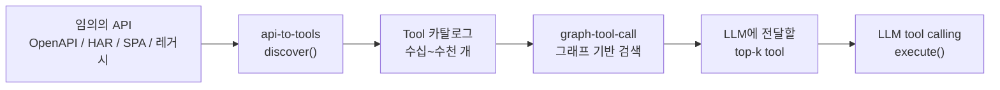
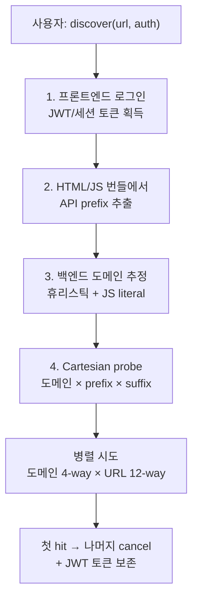

## 왜 이걸 만들었나

이전 글들에서 [graph-tool-call](./graph-tool-call-llm-agent-graph-based-tool-search-engine.md)을 다뤘다. graph-tool-call은 "이미 정의된 tool 수백 개에서 LLM이 호출할 후보를 빠르게 찾아주는" 검색 엔진이다. 그런데 정작 현장에서 가장 큰 병목은 검색이 아니라 **그 앞단 — tool 정의를 만드는 일** 자체였다.

XGEN 운영 중에 "이 백오피스 API들도 에이전트가 호출할 수 있게 해 달라"는 요구가 반복적으로 들어왔다. 그때마다 OpenAPI 스펙을 받아서 사람이 손으로 tool 메타데이터를 짜고, 인증 헤더 붙이고, 응답 스키마 보정하고… 백오피스 하나당 반나절이 사라졌다. 더 큰 문제는 **스펙이 없는 시스템**이었다. 사내 솔루션 일부는 Nexacro 기반 한국형 레거시였고, 어떤 곳은 Swagger를 분명히 쓰는데 인증 뒤에 숨어 있어 외부에서 안 보였고, 또 어떤 곳은 그냥 React 번들에 fetch 호출이 흩어져 있을 뿐이었다.

이걸 자동화하지 않으면 에이전트가 닿을 수 있는 API의 한계는 영원히 사람이 손으로 채워 넣은 만큼이 된다. 그래서 만든 게 `api-to-tools`다. 한 줄 요약:

> **URL 하나(필요하면 계정 하나)만 주면 LLM이 호출 가능한 tool 카탈로그가 나온다.**

```python
from api_to_tools import discover, AuthConfig

# 공개 OpenAPI
tools = discover("https://petstore.swagger.io")

# 인증이 필요한 백오피스 — 로그인 자동 → 백엔드 Swagger 사냥
tools = discover(
    "https://admin.example.com/",
    auth=AuthConfig(type="cookie", username="admin", password="admin"),
)

# 스펙이 아예 없는 사이트 — HAR 캡처
tools = discover("recording.har")
```

`discover()` 한 줄이 들어가는 자리에는 사실 5단계의 우선순위 결정 트리, 다중 인증 시도, 파서 다섯 종, 도메인 휴리스틱이 모두 숨어 있다. 이 글은 그 내부 구조와, **4일 만에 v0.3에서 v0.16까지** 13개 릴리스를 찍으며 정리해 간 설계 결정을 남겨 둔다.

## graph-tool-call과의 역할 분담

먼저 위치를 명확히 해 두자. 두 라이브러리는 짝처럼 움직이지만 책임이 다르다.



- **api-to-tools** — `0 → N` 변환. 외부 시스템을 보고 tool 정의를 만들어 낸다.
- **graph-tool-call** — `N → k` 검색. 이미 만들어진 tool 풀에서 LLM 컨텍스트에 넣을 후보만 추린다.

api-to-tools가 `Tool` 타입을 출력하면 graph-tool-call이 그대로 받아서 인덱싱한다. 둘 다 zero-dependency를 지향하고, 같은 tool 스키마를 공유하기 때문에 어댑터가 필요 없다.

## 5단계 Fallback 디스커버리

`discover()` 핵심은 한 사이트를 만났을 때 **어떤 순서로 가장 비용이 낮은 시도부터 비싼 시도로 내려가는지**다. 이 우선순위는 4일 동안 실제 사이트 수십 개를 돌려보며 hit rate를 측정한 다음에야 안정됐다.

```
1. Direct spec URL          → OpenAPI/WSDL/GraphQL/HAR/AsyncAPI 직접 입력
2. Nexacro platform 감지     → Nexacro crawler + SSV parser
3. Well-known paths probe   → /openapi.json, /v3/api-docs, /swagger.json …
4. Authenticated Swagger    → 로그인 → 백엔드 추정 → Bearer probe
5. JS bundle 정적 스캔      (opt-in: scan_js=True)
6. Playwright 동적 크롤     (opt-in: crawl=True)
7. CDP 크롤                 (Playwright 없이 Chrome DevTools Protocol)
```

순서가 단순한 `try/except` 체인이 아니다. 1~3단계는 **병렬**로 시도해서 가장 먼저 200을 주는 응답을 채택한다. 4단계는 (도메인 × 경로 prefix × 스펙 suffix)의 카르테시안 곱을 만든 다음, 도메인 단위 4-way 병렬, 도메인 안에서 12-way 병렬로 probe한다. 첫 번째 hit가 나오는 순간 나머지 future는 모두 cancel된다. 5~7단계는 비용이 크기 때문에 호출자가 명시적으로 opt-in 해야 한다.

이 우선순위가 왜 중요한지는 실제 측정치로 설명할 수 있다. 공개 API 대부분은 1~3단계에서 2초 안에 끝난다. 4단계까지 내려가는 사이트는 보통 사내 백오피스류이며, 4단계가 5초~30초 정도 걸린다. 만약 5~7단계까지 강제로 옵트인하면 분 단위로 늘어난다. 이 비용 구조 때문에 단순한 "전부 다 시도" 전략은 실용적이지 않다.

### 단계별 hit rate 통계 (실측)

| 단계 | 평균 소요시간 | 적중률 (개인 측정) |
|------|--------------|-------------------|
| 1. Direct spec URL | <0.1s | 사용자 명시 입력 시 100% |
| 2. Nexacro 감지 | 0.5~2s | 한국 레거시 백오피스에서 매우 높음 |
| 3. Well-known paths | 1~2s | 공개 API 95% |
| 4. Auth Swagger hunting | 5~30s | 사내 백오피스 70~80% |
| 5. JS bundle scan | 5~10s | SPA 60% |
| 6. Playwright 크롤 | 30~120s | 동적 SPA 80% |
| 7. CDP 크롤 | 20~60s | Playwright 없이 6단계 대안 |

내가 처음 v0.3을 만들었을 때는 단계 구분이 없었다. 무조건 well-known paths만 시도해 보고, 안 되면 포기였다. 그게 현장에서 깨졌다. 어떤 사이트는 `/api-docs`가 분명히 응답하지만 인증 없이는 401, 어떤 사이트는 백엔드가 별도 도메인(`api-admin.example.com`)에 있는데 프론트는 `admin.example.com`이고, 어떤 사이트는 그냥 SPA 번들 안에서만 fetch가 일어났다. 이걸 한 함수에 다 욱여넣다 보니 자연스럽게 우선순위 트리로 갈라졌다.

## 인증된 Swagger 사냥 — 4단계의 구체 동작

5단계 중에서 가장 복잡하고 가장 가치 있는 부분이다. 사내 시스템 대부분은 `/v3/api-docs`를 분명히 export하지만, 인증 없이는 401을 던진다. 사람이 스펙을 받으려면 백오피스에 로그인하고 개발자 도구로 직접 따 와야 한다. 이걸 자동화한다.

전체 흐름:



### Step 1 — 로그인 자동화

`AuthConfig(type="cookie", username=..., password=...)`가 주어지면 `try_api_login`이 다음을 시도한다.

1. 프론트엔드 HTML에서 form 액션 URL을 찾는다.
2. CSRF 토큰이 있으면 함께 추출해 보낸다.
3. 흔한 API 로그인 경로(`/api/login`, `/api/auth/login`, `/api/v1/auth/signin`, …)를 추정해서 JSON POST를 시도한다.
4. 응답에서 `Authorization: Bearer ...` 또는 Set-Cookie 세션을 캡처한다.

관건은 **JWT를 발견하면 그걸 그대로 들고 다닌다**는 점이다. v0.16에서 추가한 `fix: preserve discovered JWT token for execute()` 패치가 이걸 보장한다. 처음에는 로그인 후 디스커버리 단계에서만 토큰을 쓰고 버렸는데, 그러면 정작 LLM이 tool을 실행하는 시점에는 다시 401이 났다. detection 결과에 `discovered_token`을 매달아 두고, `to_tools()` 단계에서 모든 tool 메타데이터에 bearer auth를 주입하도록 바꿨다.

```python
# core.py — to_tools 일부
if detection.discovered_token:
    bearer = AuthConfig(
        type="bearer",
        token=detection.discovered_token,
        verify_ssl=auth.verify_ssl if auth else True,
    )
    auth_dict = asdict(bearer)
    for t in tools:
        t.metadata["auth"] = auth_dict
```

### Step 2 — API prefix 추출

스펙 suffix(`/v3/api-docs`)를 시도하기 전에, 이 사이트의 API가 어떤 경로 prefix를 쓰는지 알아야 한다. 어떤 곳은 `/api/`, 어떤 곳은 `/api/bo/`, 어떤 곳은 `/backend/v2/`처럼 비대칭이다.

```python
def _extract_api_prefixes_from_text(text: str) -> set[str]:
    prefixes: set[str] = set()
    for m in re.finditer(
        r'["\']/(api/[^"\'`\s/]+(?:/[^"\'`\s/]+)?)/[^"\'`\s]*["\']', text
    ):
        prefixes.add("/" + m.group(1))
    for m in re.finditer(r'/(api(?:/\w+){0,2})/', text):
        prefix = "/" + m.group(1)
        if len(prefix) > 4:
            prefixes.add(prefix)
    return prefixes
```

HTML에서 prefix가 나오지 않으면 JS 번들 15개를 가져와 같은 정규식을 돌린다. 마지막에 버전 prefix를 한 단계 벗긴 변형도 후보에 추가한다(`/api/bo/v1` → `/api/bo`). 이렇게 모은 prefix는 길이가 긴 순서로 정렬해 둔다. 더 구체적인 prefix가 hit할 가능성이 높기 때문이다.

### Step 3 — 백엔드 도메인 추정

같은 도메인에 백엔드가 함께 있으면 쉽지만, 분리된 경우(`api-admin.example.com` / `admin-api.example.com` / `gateway.example.com`)가 흔하다. 두 갈래로 후보를 모은다.

**휴리스틱 변형** — 프론트 도메인의 서브도메인을 변형해 후보를 만든다.

```python
guesses = [
    f"{scheme}://api-{subdomain}.{base_domain}",
    f"{scheme}://api.{base_domain}",
    f"{scheme}://{subdomain}-api.{base_domain}",
    f"{scheme}://{subdomain}api.{base_domain}",
    f"{scheme}://backend.{base_domain}",
    f"{scheme}://server.{base_domain}",
    f"{scheme}://docs.{base_domain}",
    f"{scheme}://swagger.{base_domain}",
    f"{scheme}://api-gateway.{base_domain}",
    f"{scheme}://gateway.{base_domain}",
    f"{scheme}://internal.{base_domain}",
    f"{scheme}://{host}",  # 동일 도메인 프록시
]
```

**JS literal 추출** — 휴리스틱이 놓치는 이국적 도메인(`x2backend.io`, `service-portal.cloud`)을 잡기 위해, JS 번들에서 URL 리터럴을 정규식으로 긁어 모은다. 단순히 모든 URL을 잡으면 Google Tag Manager, fbcdn, jsdelivr 같은 노이즈가 폭발한다. 그래서 `_is_plausible_backend_url` 필터를 거친다.

```python
exclude_hints = (
    "google", "googletagmanager", "gstatic", "googleapis",
    "facebook", "fbcdn", "twitter", "linkedin",
    "cloudflare.com", "jsdelivr.net", "unpkg.com",
    "sentry", "datadog", "newrelic", "mixpanel", "amplitude",
    "doubleclick", "adservice", ...
)
# 최소 하나는 만족해야 한다:
#   - 프론트엔드와 base 도메인을 공유, 또는
#   - 호스트명에 api/backend/server 같은 키워드 포함
```

이 필터를 만들기 전에는 한 사이트당 후보 도메인이 200개씩 나와서 probe 폭주가 일어났었다. v0.5 즈음 추가했다.

순서도 중요하다. 휴리스틱을 먼저, JS literal을 나중에 둔다. 이유는 hit rate. 95% 케이스는 휴리스틱(`api.example.com`)에서 끝나고, 거기서 끝나면 JS 번들 다운로드 비용 자체가 생략된다.

### Step 4 — Cartesian probe + early exit

도메인이 4개, prefix가 3개, suffix가 50개라고 하자. 그러면 후보 URL은 600개가 된다. 이걸 전부 직렬로 시도하면 분 단위가 걸린다. 두 단계 병렬을 쓴다.

```python
_PROBE_WORKERS = 12
_DOMAIN_WORKERS = min(4, len(all_domains))

with ThreadPoolExecutor(max_workers=_DOMAIN_WORKERS) as executor:
    futures = {
        executor.submit(_probe_swagger, client, domain, prefixes, token, timeout): domain
        for domain in all_domains
    }
    for fut in as_completed(futures):
        result = fut.result()
        if result:
            _cancel_remaining(futures)
            result.discovered_token = token
            return result
```

`_probe_swagger`는 도메인 하나 안에서 12-way 병렬로 URL을 probe한다. 한 도메인에서 hit이 나면 자기 도메인의 나머지 future를 cancel하고, 동시에 바깥 ThreadPoolExecutor의 다른 도메인 future도 cancel한다.

probe 자체에도 작은 트릭이 있다. 같은 URL을 두 가지 헤더로 시도한다. 먼저 `Authorization: Bearer ...`, 실패하면 cookie-only(헤더 없음). 어떤 백엔드는 JWT를 확인하지 않고 세션 쿠키만 본다. 또 어떤 곳은 그 반대다. 양쪽 다 시도하는 게 안전하다.

```python
attempts: list[dict] = []
if token:
    attempts.append({"Authorization": f"Bearer {token}"})
attempts.append({})  # cookie only
```

또 한 가지 — Swagger 응답이 곧장 OpenAPI가 아닐 때가 있다. SpringDoc은 종종 `swagger-config` 형식으로 답한다.

```json
{
  "urls": [
    {"name": "default", "url": "/v3/api-docs/public"},
    {"name": "admin",   "url": "/v3/api-docs/admin"}
  ]
}
```

이걸 만나면 재귀적으로 내부 url을 다시 probe한다. `_recursion_depth` 가드로 무한 루프는 방지한다.

### 우선순위로 묶어 둔 suffix

50개 suffix를 모두 균등하게 시도하지 않는다. 빈도가 압도적으로 높은 5개를 Tier 1으로 분리해서 먼저 던진다.

```python
_HIGH_PRIORITY_SUFFIXES = [
    "/api-docs",
    "/v3/api-docs",
    "/v2/api-docs",
    "/swagger.json",
    "/openapi.json",
]
```

Tier 1이 prefix 모두에 적용된 후, Tier 2(루트 + Tier 1), Tier 3(prefix × 나머지 suffix), Tier 4(루트 + 나머지 suffix) 순으로 fan-out된다. 평균적으로 Tier 1, 2 안에서 95%가 끝난다.

## 스펙이 없는 사이트 — JS 번들 정적 스캔과 CDP 크롤러

본 게임은 스펙이 있는 사이트를 자동화하는 것이지만, **스펙이 아예 없는 SPA**에도 해법이 있어야 한다. 이 영역은 v0.4~v0.7에서 빠르게 보강했다.

### `static_spa.py` — 브라우저 없는 SPA 분석

Playwright는 강력하지만 무겁다. CI에 chromium을 설치하는 비용, CDP 통신 비용, 브라우저 런타임 메모리 모두 부담이다. SPA 분석의 80%는 사실 정적으로 가능하다는 가설을 세우고 만든 게 `static_spa.py`다.

흐름:
1. 진입점 HTML을 받아 `<script src=...>` 목록을 모은다.
2. JS 번들을 다운로드해 `fetch(...)`, `axios.get(...)`, `XMLHttpRequest`, `WebSocket(...)` 호출 패턴을 정규식으로 찾는다.
3. URL 템플릿(`` `${API_BASE}/users/${id}` ``)을 발견하면 변수 부분을 path parameter로 추출한다.
4. BFS 라우트 하베스터가 frontend route 정의(`react-router`, `vue-router`)를 따라 다니며 하위 페이지 번들도 끌어온다.

이 단계의 가장 어려운 점은 minified 코드의 변수 추적이다. webpack/rollup 출력에서 `a("/api/users/"+t)` 같은 코드를 만나면 정규식만으로는 한계가 있다. 그래서 v0.6에서 `static_spa regex back-reference` 버그를 한 번 크게 잡았는데, 패턴 매칭이 욕심을 부려 잘못된 substring을 묶는 사고였다. 결국 라이브러리 본질이 휴리스틱 정규식이라 실패할 수밖에 없는 경우가 있다는 걸 받아들이고, 정적 스캔이 실패하면 자연스럽게 다음 단계(CDP 크롤러)로 넘어가도록 했다.

### `cdp_crawler.py` — Chrome DevTools Protocol 직통

Playwright는 사실상 CDP 위의 wrapper다. Playwright가 설치되지 않은 환경에서도 동적 SPA를 보고 싶었기 때문에 CDP 클라이언트를 직접 두드리는 경량 크롤러를 만들었다.

핵심 아이디어:
1. 시스템 Chrome을 `--remote-debugging-port`로 띄운다.
2. CDP 세션을 열고 `Network.enable`, `Page.enable`, `Runtime.enable`을 토글한다.
3. 사이트를 로드하면서 `Network.requestWillBeSent` / `Network.responseReceived` 이벤트를 모은다.
4. 페이지 안의 클릭 가능한 요소를 한정된 깊이로 BFS 클릭하면서 추가 트래픽을 유발한다.
5. 모은 트래픽을 HAR 형태로 저장하고, HAR 파서로 다시 Tool로 변환한다.

이 흐름의 장점은 산출물이 **HAR**이라는 것이다. HAR은 이미 Tool 변환 파서가 있으니, 크롤러는 트래픽 캡처에만 집중하면 된다. 책임 분리가 깔끔하게 떨어진다.

## Nexacro/SSV — 한국형 레거시 지원

이건 좀 특수한 사례다. 한국 금융권/공공기관 백오피스 중 상당수는 Nexacro Platform으로 만들어진 RIA다. UI는 XML 정의이고 백엔드와 SSV(Sobaru String Value)라는 자체 인코딩을 쓴다. OpenAPI는 당연히 없고, 일반적인 REST 응답도 아니다.

```python
# Nexacro 감지 트리거
def is_nexacro_platform(html: str) -> bool:
    markers = ["nexacro", "_nexacro_", "nexacro.Platform", "ssv:"]
    return any(m in html.lower() for m in markers)
```

감지되면 전용 크롤러가 페이지를 돌며 SSV 호출을 캡처하고, `parsers/ssv.py`가 SSV 페이로드를 분석해서 입력 컬럼/출력 컬럼을 Tool 파라미터로 변환한다. SSV 자체가 표준이 없는 한국 자체 포맷이라 외산 라이브러리에 기댈 수 없었고, 결국 인코더/디코더를 직접 작성했다.

`api-to-tools`가 zero-dependency를 추구하는 이유 중 하나가 이거다. 한국 레거시까지 다루려면 결국 직접 짜는 게 가장 가벼운 길이었다.

## Safe Mode — 크롤러가 운영을 부수지 않게

크롤링 시 가장 무서운 건 `deleteUser`, `cancelOrder`, `sendMail`을 LLM이든 휴리스틱이든 무심코 호출해 버리는 사고다. 이걸 방지하려고 `safe_mode=True`(기본값)를 도입했다. 동작은 단순하다.

1. 로그인이 끝난 다음부터 모든 POST/PUT/DELETE/PATCH 요청을 가로챈다.
2. 요청 자체는 캡처해서 디스커버리에는 사용한다(URL/payload 모양은 알아야 Tool로 만들 수 있으니까).
3. 그러나 **실제로 서버에 도달하지 않게** mock 응답을 돌려준다.

휴리스틱으로 read-style POST(`getUserList`, `searchItems`, `auth/login`)는 통과시킨다. 한국 백오피스에 RPC 스타일 POST 검색 API가 너무 많아서, 이걸 막으면 디스커버리가 거의 안 된다.

```python
discover(url, auth=auth, crawl=True, safe_mode=True)
# 안전. 운영을 건드리지 않음.

discover(url, auth=auth, crawl=True, safe_mode=False)
# 위험. 명시적 opt-out.
```

`--no-safe-mode` 같은 명시적 flag로만 끌 수 있게 했고, 문서에서도 "DANGEROUS"라고 못 박았다. 이런 안전장치는 한 번이라도 사고가 나면 라이브러리 신뢰가 무너지기 때문에 보수적으로 가는 게 맞다.

## Rate Limiting — 도메인당 token bucket

크롤러가 12-way 병렬로 도는 동안 대상 서버를 망치면 안 된다. 도메인당 token bucket을 두고, 디스커버리 probe는 20 req/s, tool execute는 10 req/s로 제한한다. 호출자가 추가 설정을 안 해도 자동으로 적용된다.

이게 없을 때는 v0.4 시점에 한 번 사내 dev 환경 nginx access log가 폭발했다. 그 사건 이후 확실히 박아 놓았다.

## Tool Result 압축과 LLM 어댑터

발견한 Tool은 LLM에 따라 포맷이 다르다. Anthropic, OpenAI, Gemini, Bedrock, LangChain, MCP — 어댑터 한 번 추가해 두면 사용자는 이걸 신경 쓸 필요가 없다.

```python
from api_to_tools import to_anthropic_tools, to_function_calling

claude_tools = to_anthropic_tools(tools)
openai_tools = to_function_calling(tools)
```

MCP 어댑터의 핵심 fix가 v0.16에 들어갔다. 처음에는 모든 파라미터를 `{kwargs: string}`이라는 단일 free-form string으로 노출했었는데, 이러면 LLM이 매번 JSON 직렬화 실수를 했다. 그래서 OpenAPI에서 추출한 정확한 타입(integer/string/boolean/object)으로 MCP 스키마를 다시 빌드하도록 바꿨다.

```
fix(mcp): generate proper parameter schema instead of {kwargs: string}
```

## OpenAPI 역방향 export, SDK codegen, Smoke Test

부수 기능 몇 개도 짧게 정리한다. 이것들은 모두 "tool 카탈로그가 있다는 사실"의 자연스러운 확장이다.

- **OpenAPI export** — 디스커버리 결과를 다시 OpenAPI 3.0 스펙으로 직렬화한다. 즉 HAR이나 SPA에서 추출한 API를 OpenAPI 형식으로 회사 위키에 올리는 길이 열린다.
- **Python/TypeScript SDK 생성** — 같은 Tool 정의로부터 타입 안전한 클라이언트 코드를 생성한다.
- **Smoke test** — `run_smoke_tests(tools)`는 GET 위주로 자동 호출해서 어느 엔드포인트가 살아 있는지 보고한다. mutation은 기본 제외, dry-run 모드도 있다.

이 셋이 묶이면 Tool 카탈로그 자체가 스펙·SDK·테스트의 단일 소스 오브 트루스가 된다.

## 트러블슈팅 — 4일 동안 부서진 것들

이 라이브러리를 만들면서 실제로 마주한 사고와 패치를 시간 순으로 정리해 둔다.

### 1. JWT 토큰 분실

처음에는 디스커버리 단계에서 받은 JWT를 그 자리에서 쓰고 버렸다. 결과적으로 LLM이 tool을 `execute()`하는 순간에는 토큰이 없어서 401이 났다. 패치는 `DetectionResult.discovered_token` 필드를 만들고, `to_tools()`에서 해당 토큰을 모든 tool의 메타데이터에 주입하게 했다. 이 시점에 한 가지 안티패턴도 같이 정리했는데 — 사용자가 명시적으로 준 `auth`보다 디스커버리에서 발견한 토큰을 우선시한다. 이유는, 사용자가 준 `cookie` auth는 로그인 자격증명이지 LLM 호출용 토큰이 아닐 가능성이 높기 때문.

### 2. 도메인 fan-out 폭주

JS literal 추출이 너무 관대했다. 한 번에 후보 도메인이 200개씩 나오면서 probe가 분 단위로 늘어났고, 일부는 외부 CDN 도메인이라 리퀘스트가 그쪽으로 흘러가는 사고도 있었다. `_is_plausible_backend_url` 필터를 추가해서 외부 CDN/analytics는 제외하고, 프론트와 base 도메인을 공유하거나 호스트명에 api 키워드가 있는 후보만 통과시켰다.

### 3. static_spa regex back-reference

`static_spa.py`의 핵심 라우트 추출 정규식이 욕심을 부려 잘못된 substring을 묶는 버그가 있었다. 특정 minified 번들에서 함수 호출 인자를 라우트로 오인했다. fix는 단순 정규식 수정이지만, 교훈은 "정적 스캔은 실패할 수 있다는 걸 흐름 안에서 받아들이고, 다음 단계로 넘어갈 길을 열어 두라"였다.

### 4. SOAP `auth` 미적용

WSDL/SOAP 디스커버리는 됐지만, 정작 `execute()`가 zeep client를 만들 때 BasicAuth/HTTPS 옵션이 안 들어가는 버그. v0.16에서 SOAP executor가 명시적으로 `AuthConfig`를 받도록 시그니처를 바꿨다.

### 5. CI ruff lint 78개 누적

기능 작업에 집중하다 보니 lint 에러가 눈덩이처럼 쌓였고, 한 번 작정하고 78개를 일괄 해결했다. 이후 pre-commit hook을 추가해서 처음부터 막도록 바꿨다.

### 6. langchain_core import 가드

`to_langchain_tools` 어댑터가 langchain이 안 깔린 환경에서도 import만으로 폭발하지 않게, optional import + 함수 호출 시점 가드로 분리했다. `pytest.importorskip`도 함께 도입.

## 실측: petstore로 보는 end-to-end

```python
from api_to_tools import discover, execute

tools = discover("https://date.nager.at/openapi/v3.json")
print(f"Found {len(tools)} tools")

tool = next(t for t in tools if "PublicHolidays" in t.name)
result = execute(tool, {"year": "2026", "countryCode": "KR"})
print(result.data)
```

`discover`가 약 0.5초, `execute`가 약 0.3초. tool 카탈로그(20개)가 즉시 LLM에 넘길 수 있는 형태로 떨어진다. 사내 백오피스로 같은 흐름을 돌리면 디스커버리가 5~15초 정도 걸리고, 결과로 1000개 단위의 tool이 나온다(graph-tool-call에 그대로 인덱싱하기 좋은 사이즈).

## 회고

4일 동안 13개 릴리스를 찍을 수 있었던 이유는 두 가지였다.

**첫째, 작은 기능을 빠르게 릴리스할 수 있는 신뢰 가능한 테스트 베이스가 있었다.** smoke test를 자동 생성해서 매 릴리스 전에 돌렸고, dry-run 모드가 있어서 외부 서버 없이도 회귀를 잡을 수 있었다.

**둘째, 단일 파일 wrapper가 아닌 명확한 계층 분리(detector / parsers / executors / adapters)가 있었다.** 새 포맷을 추가할 때 기존 코드를 건드리지 않아도 됐다. AsyncAPI, gRPC, HAR 모두 parser 한 파일을 추가하는 것으로 끝났다.

여전히 남은 과제도 많다. minified JS 번들에서의 변수 추적은 여전히 휴리스틱이고, 어떤 백엔드는 OpenAPI 스펙 자체가 거짓말을 하기도 한다(필드가 빠져 있거나 enum이 갱신 안 됨). 그래서 디스커버리 후에 사람이 한 번 훑어볼 수 있는 `info` / `list` CLI를 넣어 두었다. 자동화는 사람의 마지막 확인을 대체하는 게 아니라, 사람이 봐야 할 분량을 줄이는 일이라는 자세를 잊지 말아야 한다.

graph-tool-call이 "수많은 tool에서 적절한 후보를 찾는" 검색이라면, api-to-tools는 "그 tool 풀을 처음부터 만드는" 추출이다. 두 라이브러리가 같이 돌면 LLM이 닿을 수 있는 API의 표면적은 사람이 손으로 채워 넣을 수 있는 것보다 한 자릿수 이상 넓어진다. 다음 글에서는 graph-tool-call v0.19에 들어간 tool result 압축 — 실제 76K 토큰 응답을 116 토큰으로 줄인 케이스 — 을 다룬다.
