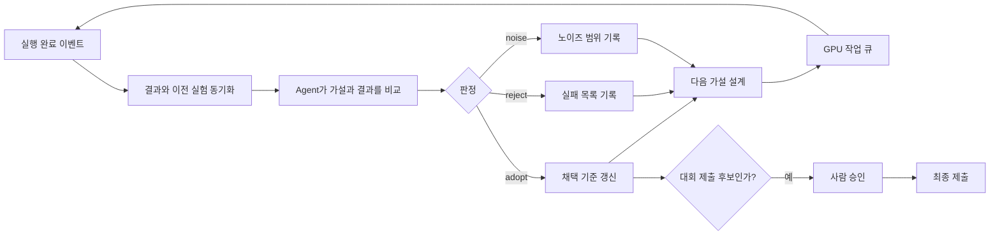

머신러닝 경진대회에서 가장 많은 시간을 쓰는 일은 모델 학습 자체가 아니다.

결과를 읽고, 왜 점수가 변했는지 추측하고, 다음 실험을 정하고, GPU 작업이 끝나면 다시 같은 판단을 반복하는 일이다. 보통은 사람이 노트북과 로그를 오가며 이 루프를 돌린다.

이번에는 그 역할을 AI Agent에게 맡겼다.

참가한 과제는 [2026 국립공원 위성 모니터링 AI 챌린지의 구상나무 고사 탐지](https://aifactory.space/ko/competitions/9304)였다. 초고해상도 위성영상에서 죽은 나무를 찾아 회전된 사각형으로 표시하는 객체탐지 문제다. 대회에는 151명이 참가했고 75개 팀이 제출했다.

에이전트는 완료된 실험을 읽고 `adopt`, `reject`, `noise` 중 하나로 판정했다. 이어서 다음 가설을 만들고 코드를 작성해 GPU 작업 큐에 넣었다. 실행이 끝나면 다시 결과를 동기화하고, 이전 실험과 비교하고, 다음 실험을 시작했다. 이 과정은 사람이 잠든 뒤에도 이어졌다.

다만 "사람 손이 전혀 들어가지 않았다"고 쓰면 정확하지 않다. 사람이 처음에 문제와 평가 기준을 정했고, 대회 제출과 코드 푸시, 삭제처럼 되돌리기 어려운 행동에는 승인 경계를 뒀다. **사람이 매 실험을 지시하지 않는 자율모드**였다는 표현이 실제 구조에 가깝다.

핵심은 AI에게 "점수를 높여줘"라고 말한 것이 아니었다. 에이전트가 스스로 실험을 이어갈 수 있도록 관찰, 기억, 판정, 실행, 안전장치를 하나의 폐쇄 루프로 만든 것이었다.

끝까지 돌려보고 나니 결론은 조금 역설적이었다. Agent를 더 자율적으로 만들려면 권한을 무작정 넓히는 게 아니라, 무엇을 개선으로 인정할지와 어디서 반드시 멈출지를 더 엄격하게 정의해야 했다. 이 글의 핵심은 특정 모델 기법보다 그 판단 구조에 있다.

## 사람이 하던 연구 루프를 에이전트에게 넘겼다

보통의 실험 과정은 다음과 같다.

1. 현재 가장 큰 병목을 찾는다.
2. 원인을 설명할 가설을 세운다.
3. 한 가지 조건만 바꾼 실험을 실행한다.
4. 결과가 우연인지 개선인지 판정한다.
5. 성공과 실패를 기록하고 다음 가설로 넘어간다.

언어모델은 1번과 2번을 그럴듯하게 이야기하는 데는 능숙하다. 하지만 실제 연구를 맡기려면 나머지가 더 중요하다. 이전 실험을 잊지 않아야 하고, GPU가 비어 있는지 확인해야 하며, 실패한 작업을 성공으로 착각해서도 안 된다. 무엇보다 같은 데이터만 계속 들여다보며 점수를 올리는 방향으로 흘러가면 안 된다.

그래서 에이전트 바깥에 `expharness`라는 로컬 실험 관리 도구를 만들었다. 완료된 결과와 부모 실험을 원장에 남기고, 다음 턴에 전달할 이벤트 패킷과 GPU 작업 큐, 승인 상태를 관리했다. 판단은 에이전트가 하지만, 사실과 상태는 하네스가 관리했다.

이 구조에서 에이전트는 연구자 역할을 맡고, 하네스는 실험실의 장부와 안전관리자 역할을 맡는다.

## 자율모드는 무엇을 했나

에이전트는 정해진 시각마다 무조건 깨어나는 방식으로 시작했지만, 곧 이벤트 기반으로 바꿨다. 실행이 끝났거나 GPU 슬롯이 비었거나 제출 후보를 점검할 시간이 됐을 때만 새로운 턴을 열었다.

각 턴에는 필요한 정보만 들어갔다.

- 방금 완료된 실험과 결과
- 현재 채택된 기준 실험
- 비교 가능한 부모 실험
- GPU 작업 상태
- 이미 실패한 접근
- 지금 해결해야 할 병목

에이전트는 이 패킷을 읽고 다음 행동을 결정했다. 완료된 결과가 없으면 같은 분석을 반복하지 않았고, 원격 GPU 상태를 확인할 수 없으면 새 작업도 시작하지 않았다.

한 번의 실제 자율 턴에서는 네 개 실험을 한꺼번에 판정했다. 하나는 `adopt`, 나머지 셋은 `noise`로 판정했다. 이 중 하나는 새 개선이 아니라 기존 결과를 재현한 대조군이었다. 이어서 재현된 부모 실험 위에 박스 위치를 미세 조정하는 새 가설을 만들고 GPU 큐에 올렸다. 동시에 대회 평가 서버에서 실행 시간이 제한 안에 들어오는지도 별도 진단 작업으로 확인했다.

사람이 한 일은 그 사이에 "다음에는 이 값을 0.4로 바꿔봐"라고 지시하는 것이 아니었다. 에이전트가 남긴 판정과 근거를 나중에 읽고, 제출할지 여부를 결정하는 일이었다.

로컬에 남은 기록만 세어도 자율 턴 파일 63개, 실험용 solution 변형 87개, 분석 도구 23개, 제출 노트북 생성기 7개가 있다. 숫자 자체보다 중요한 것은 각 산출물이 부모 실험과 가설, 판정 근거를 가졌다는 점이다.

## 점수가 올랐다는 말부터 의심하게 했다

자율 실험에서 가장 위험한 일은 에이전트가 실패하는 것이 아니다. 우연히 오른 점수를 개선으로 믿고 그 위에 다음 실험을 계속 쌓는 것이다.

처음에는 에이전트가 좋은 가설을 떠올릴 수 있느냐가 가장 어려운 문제라고 생각했다. 실제 병목은 반대편에 있었다. 가설을 만드는 것보다 나온 결과를 믿어도 되는지 판정하는 일이 더 어려웠다. 판정 기준이 틀리면 에이전트는 사람보다 빠른 속도로 잘못된 방향을 학습한다.

첫 번째 함정은 데이터 분할이었다. 이미지 패치를 무작위로 나누면 학습 데이터와 검증 데이터에 같은 촬영 장면의 일부가 섞인다. 나무의 모양뿐 아니라 촬영 시기, 센서, 밝기, 지형의 특징까지 공유되므로 점수가 높게 나온다.

무작위 분할 점수는 `0.3245`였지만, 촬영 장면 하나를 통째로 제외하는 LOSO(Leave-One-Scene-Out, 한 장면 제외 검증)에서는 `0.2219`로 내려갔다. 모델이 나무를 배운 것이 아니라 장면의 분위기를 기억한 부분이 있었다.

이후 모든 실험은 장면 단위 3-fold LOSO를 기준으로 판단했다. 세 장면 중 하나라도 크게 나빠지면 평균이 올라도 바로 채택하지 않았다.

두 번째 함정은 학습 자체의 무작위성이었다. 같은 코드도 초기 가중치와 데이터 순서에 따라 결과가 흔들렸다. 어떤 실험은 개선처럼 보였지만, 확인해보니 `workers` 수가 달라지면서 난수가 바뀐 결과였다.

그래서 비교 규칙을 더 엄격하게 만들었다.

- 한 실험에서는 하나의 조건만 바꾼다.
- 반드시 비교할 부모 실행을 지정한다.
- 같은 예측 결과에 후처리만 달리 적용할 수 있으면 짝비교를 우선한다.
- 점수 차이가 반복 실행의 흔들림 안에 있으면 `noise`로 남긴다.
- 다섯 번 판정할 때마다 작은 튜닝을 멈추고 더 큰 병목을 다시 찾는다.

에이전트가 창의적인 가설을 많이 내는 것보다, 근거 없는 개선을 버리는 능력이 더 중요했다.

이 원칙은 이전에 [검색 품질 평가 루프를 만들며 정리한 방식](/posts/ai/agent/synaptic-memory-search-eval-loop/)과 닮았다. 평가 문제와 실패 유형을 고정하지 않으면 검색 결과도 매번 좋아 보이는 사례만 골라 설명하게 된다. ML 실험에서는 여기에 학습 시드와 데이터 분할이라는 변수가 더해졌다.

## 에이전트가 찾아간 모델 개선 경로

에이전트가 백지에서 모든 기법을 발명한 것은 아니다. 대회 baseline과 데이터 명세, 로컬에 준비한 분석 도구, 공개된 연구 방법이 후보 공간을 만들었다. 에이전트의 역할은 그 안에서 어떤 가설을 먼저 검증할지 선택하고, 결과에 따라 조합하거나 버리는 것이었다.

초기 모델은 RGB 영상만 보는 회전 객체탐지 모델이었다. 에이전트가 실험 기록을 따라가며 찾은 첫 번째 유효한 방향은 분광 정보를 이용하는 것이었다.

위성영상에는 사람이 보는 RGB 외에도 적색과 근적외선 같은 밴드가 있다. 이 값으로 식물이 얼마나 건강한지 나타내는 NDVI(Normalized Difference Vegetation Index, 정규식생지수)를 계산할 수 있어 살아 있는 나무와 고사목을 구분하는 단서가 된다. 적색 반사율, NDVI, RGB 밝기를 세 채널로 구성하자 RGB만 사용한 모델보다 장면 일반화가 나아졌다.

다음 병목은 새로운 촬영 장면의 밝기와 분포 차이였다. 에이전트는 다음 두 단계를 조합했다.

1. 평가 장면의 통계로 Batch Normalization(배치 정규화, 학습 중 쌓은 특징 분포 통계) 값을 다시 맞춘다.
2. 모델이 확신하는 예측을 의사라벨로 만들어 짧게 self-training한다.

단일 교사가 만든 의사라벨은 시드에 따라 품질이 크게 흔들렸다. 잘 나온 교사를 뽑는 방식은 재현 가능한 연구가 아니라 복권에 가까웠다. 에이전트는 여러 교사가 함께 검출한 박스만 의사라벨로 쓰는 합의 방식으로 바꿨다. 그 결과 학생 모델 사이의 편차가 크게 줄었다.

분광 모델끼리 여러 개 합치는 것만으로는 오류가 충분히 다양하지 않았다. 에이전트는 RGB 모델을 다시 꺼내 분광 모델과 결합했다. RGB 단독 점수는 낮았지만 두 모델이 틀리는 위치가 달랐다. 같은 구조의 모델을 반복하는 대신, 입력 정보가 다른 모델의 합의를 사용한 이유다.

마지막에는 전체 탐지기를 계속 키우지 않았다. 이미 찾은 후보를 작은 crop 분류기로 다시 채점하고, 별도 회귀기로 박스 중심과 크기를 조금씩 보정했다. 큰 모델 하나가 모든 일을 하게 하는 대신 오류 종류별로 작은 후처리 모델을 붙였다.

이 경로는 사람이 미리 작성한 실험 계획표가 아니었다. 에이전트가 각 결과에서 남은 오류를 분석하고, 실패한 축을 닫고, 다음 레버를 선택하면서 만들어졌다.

## 자율모드가 스스로 빠진 함정도 있었다

에이전트가 계속 일한다고 해서 항상 앞으로 가는 것은 아니다. 오히려 자동화됐기 때문에 잘못된 가정도 더 빠르게 반복할 수 있었다.

### 추론한 모델을 그대로 학습에 사용했다

한동안 self-training 결과가 예상보다 불안정했다. 원인은 모델 라이브러리의 `predict()`가 내부 모델을 추론용으로 합치는 동작이었다. 같은 객체로 곧바로 `train()`을 호출하자 Batch Normalization 상태가 사라진 모델에서 학생 학습이 시작됐다.

예측 전에 학습 가능한 상태를 복사하고, 추론 뒤 복원하도록 바꿨다. 흥미로운 점은 이 버그를 고쳐도 평균 점수가 바로 크게 오르지는 않았다는 것이다. 버그는 실제였지만 기존 학습이 일부 손상을 흡수하고 있었다. 에이전트는 "버그를 찾았으니 성능도 올랐을 것"이라고 결론 내리지 않고 별도 대조 실험에서 `noise`로 판정했다.

### 평가 서버에서는 self-training이 실행되지 않았다

로컬에서는 정상이던 제출물이 평가 서버에서도 정상처럼 끝났다. 하지만 진단 로그를 심자 self-training 단계가 예외 처리에 걸려 건너뛰고 있었다.

원인은 모델 라이브러리의 AMP(자동 혼합 정밀도) 검사였다. AMP는 계산 속도와 메모리 사용량을 줄이기 위해 서로 다른 숫자 정밀도를 섞어 쓰는 기능이다. 검사 과정에서 작은 가중치를 인터넷에서 내려받으려 했고, 네트워크와 쓰기 권한이 제한된 평가 환경에서 실패했다. 전체 프로그램은 fallback 경로 덕분에 끝까지 실행됐지만, 핵심 적응 단계는 사라진 상태였다.

AMP 검사의 다운로드 경로를 우회하고, 실패 시 재시도 조건과 단계별 진단 값을 남기도록 수정했다. 이 사건 이후 "제출 성공"과 "의도한 알고리즘 실행 성공"을 분리해서 확인했다.

### 자동 배포도 사고를 자동화할 수 있었다

초기에는 GPU 서버에 파일을 동기화하는 명령 범위가 너무 넓었다. 잘못된 전송 한 번으로 원격 가상환경이 손상되고 진행 중인 실험이 함께 종료됐다.

이후 에이전트가 직접 `rsync`나 `scp`를 실행하지 못하게 했다. 배포 도구는 허용된 파일만 전송하고, 가상환경과 데이터 디렉터리는 거부했다. 대회 제출, Git push, 삭제도 같은 방식으로 사람 승인 경계 밖에 뒀다.

자율성은 권한을 모두 주는 것이 아니었다. 반복 가능한 일은 넓게 맡기고, 피해가 크거나 외부 상태를 바꾸는 행동은 좁게 막는 구조였다.

## 사람의 판단은 사라지지 않고 시스템이 됐다

처음에는 자율성을 사람의 개입 횟수로 생각했다. 사람이 덜 손댈수록 더 자율적인 시스템이라고 봤다. 실제로 중요한 변화는 개입 횟수가 아니었다. 사람이 매번 내리던 판단 중 반복 가능한 부분이 데이터 분할, 채택 규칙, 실행 조건, 권한 경계로 바뀐 것이었다.

사람은 하이퍼파라미터를 하나씩 고르는 역할에서 물러났다. 대신 다음 질문을 맡았다.

- 에이전트가 최적화하는 지표가 실제 목표와 같은가
- 공개 리더보드에 과적합하고 있지 않은가
- 대회 데이터와 외부 가중치의 라이선스를 지키는가
- 자동화가 건드려도 되는 시스템 경계는 어디까지인가
- 최종 제출 후보의 근거가 충분한가

이 중 하나라도 잘못 정하면 에이전트는 틀린 목표를 아주 성실하게 최적화한다.

이 구분은 ML 실험 밖에서도 쓸 수 있다. 결과를 측정할 수 있고, 실패를 되돌릴 수 있고, 이전 시도와 비교할 수 있는 일은 Agent의 폐쇄 루프로 옮기기 좋다. 반대로 목표 자체를 정하거나 외부에 되돌리기 어려운 영향을 주는 일은 사람이 책임져야 한다. 자율성은 사람의 판단을 삭제하는 것이 아니라, 반복 가능한 판단을 시스템으로 옮기는 일이었다.

[자동매매에서도 주문보다 신호 검증을 먼저 둔 이유](/posts/full-stack/poc/sontrader-autotrading-signal-validation-before-orders/)와 같다. 실행을 자동화하기 전에 무엇을 성공으로 인정할지부터 고정해야 한다. 자율 에이전트에서는 이 순서가 더 중요해진다.

결과보다 더 크게 남은 것은 연구 과정의 형태였다. 24시간 실험을 돌린 것보다, 왜 어떤 실험을 채택했고 어떤 실험을 버렸는지가 모두 추적 가능해졌다. 실패한 실험도 다음 턴의 금지 목록과 새로운 가설로 이어졌다.

## 자율 ML 연구에 필요했던 다섯 가지

이번 경험에서 자율 에이전트가 실제 ML 실험을 맡으려면 최소한 다음 다섯 가지가 필요했다.

1. **명확한 평가 단위**: 이미지 랜덤 분할이 아니라 실제 배포 환경을 닮은 장면 단위 검증이 필요하다.
2. **구조화된 기억**: 실험의 부모, 변경점, 결과, 판정을 사람이 읽을 수 있는 원장에 남겨야 한다.
3. **노이즈를 인정하는 판정 규칙**: 점수가 올랐다는 이유만으로 채택하지 않고 `noise`라는 결론을 허용해야 한다.
4. **이벤트 기반 실행**: 에이전트가 계속 깨어 있는 대신 새 정보가 생겼을 때만 판단하게 해야 한다.
5. **권한 경계**: 제출, 삭제, 배포처럼 피해 범위가 큰 행동은 별도 도구와 승인 절차로 제한해야 한다.

언어모델의 추론 능력만으로는 이 중 어느 것도 보장되지 않는다. 자율성은 좋은 프롬프트보다 시스템 구조에서 나왔다.

## 남은 한계

이 방식이 에이전트가 사람보다 더 좋은 모델을 만든다는 증거는 아니다. 대회 최종 순위만으로 자율 실험 시스템의 효과를 분리해서 측정할 수도 없다. 같은 시간과 GPU를 사용한 숙련된 연구자와의 통제 비교도 하지 않았다.

또한 에이전트가 만든 가설은 사용 가능한 도구와 기록의 범위에 갇힌다. 평가 코드가 틀렸거나 데이터 누수가 숨어 있으면 에이전트도 그 사실을 모른 채 최적화를 계속할 수 있다. 실제로 점수 산식과 비교 조건을 여러 번 바로잡아야 했다.

처음 기대한 것은 잠들지 않고 실험을 돌리는 AI 연구자였다. 실제로 얻은 것은 조금 달랐다. 결과를 읽고, 이전 실패를 기억하고, 다음 실험을 선택하는 사람의 연구 습관을 재사용 가능한 피드백 루프로 바꿀 수 있었다.

이 경험 뒤에는 자율성을 보는 기준도 달라졌다. Agent가 얼마나 오래 혼자 실행됐는지가 아니라, 왜 다음 실험을 계속했고 왜 어떤 지점에서 멈췄는지를 기록으로 설명할 수 있는지가 더 중요했다. 끝없이 움직이는 시스템보다 멈출 이유를 아는 시스템이 더 자율적이었다.

> 대회 규정에 따라 제공받은 위성영상과 레이블은 이 글에 사용하지 않았다. 모델 가중치와 제출물도 공개하지 않는다. 설명에 사용한 수치는 로컬 실험 기록이며 공식 최종 성적을 의미하지 않는다.
