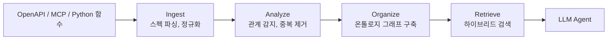
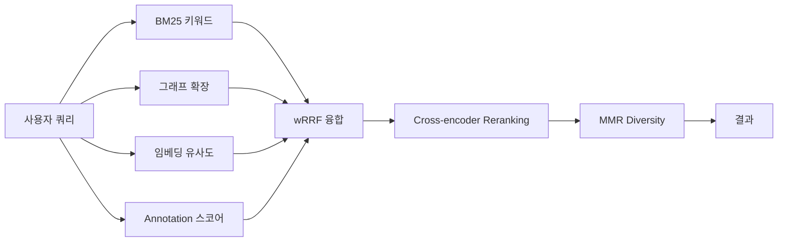

## 문제: Tool이 너무 많다

LLM Agent가 실제 업무에 투입되면, 사용할 수 있는 도구(tool)의 수가 급격히 늘어난다. 회사 내부 커머스 플랫폼인 X2BEE의 BO(Back Office) API만 해도 **1,077개의 endpoint**가 있다. 이 모든 tool 정의를 LLM의 context window에 넣는 것은 불가능하다. Claude의 200K 토큰이든, GPT-4o의 128K 토큰이든, 1,000개 이상의 tool schema를 한 번에 넘기면 토큰 비용이 폭발하고 정확도가 급락한다.

일반적인 해결책은 **벡터 검색**이다. tool description을 임베딩하고, 사용자 쿼리와 가장 유사한 tool을 찾는다. 동작은 하지만 치명적인 한계가 있다.

사용자가 *"주문을 취소하고 환불 처리해줘"*라고 말하면, 벡터 검색은 `cancelOrder`를 찾을 수 있다. 하지만 주문 ID를 얻기 위해 먼저 `listOrders`를 호출해야 하고, 취소 후에 `processRefund`가 뒤따라야 한다는 것은 모른다. 이것들은 단순히 비슷한 tool이 아니다. **워크플로우**를 이루고 있다.

이 문제를 해결하기 위해 **graph-tool-call**을 만들었다. tool 간 관계를 그래프로 모델링하고, 키워드 매칭 + 그래프 탐색 + 임베딩을 결합한 하이브리드 검색으로 적절한 도구를 찾는 Python 라이브러리다. 2/28에 첫 커밋을 하고 3/7에 v0.6.1까지 릴리스했다. 8일간의 개발 과정을 정리한다.


## 핵심 아이디어: Tool은 그래프다

벡터 검색이 놓치는 것은 **tool 간의 관계**다. API endpoint는 독립적으로 존재하지 않는다.

```
                    ┌──────────┐
          PRECEDES  │listOrders│  PRECEDES
         ┌─────────┤          ├──────────┐
         v         └──────────┘          v
   ┌──────────┐                    ┌───────────┐
   │ getOrder │                    │cancelOrder│
   └──────────┘                    └─────┬─────┘
                                         │ COMPLEMENTARY
                                         v
                                  ┌──────────────┐
                                  │processRefund │
                                  └──────────────┘
```

graph-tool-call은 6가지 관계 타입을 정의한다:

| 관계 | 의미 | 예시 |
|------|------|------|
| **REQUIRES** | A를 실행하려면 B의 결과가 필요 | `getOrder` → `listOrders` (ID 필요) |
| **PRECEDES** | A가 B보다 먼저 실행됨 | `POST /users` → `GET /users/{id}` |
| **COMPLEMENTARY** | A와 B는 함께 사용됨 | `cancelOrder` ↔ `processRefund` |
| **SIMILAR_TO** | A와 B는 유사한 기능 | `getOrder` ↔ `listOrders` |
| **CONFLICTS_WITH** | A와 B는 동시 실행 불가 | `updateOrder` ↔ `deleteOrder` |
| **BELONGS_TO** | tool이 카테고리에 속함 | `getOrder` → `orders` |

"주문 취소"를 검색하면, `cancelOrder`만 나오는 것이 아니라 **전체 워크플로우**가 나온다: 목록 조회 → 상세 조회 → 취소 → 환불. 이것이 그래프 기반 검색의 핵심 가치다.


## 아키텍처 설계

전체 파이프라인은 4단계로 구성된다.



각 단계가 독립적이고, 이전 단계의 출력이 다음 단계의 입력이 되는 파이프라인 구조다. 핵심 설계 원칙은 **LLM 없이도 동작하고, LLM이 있으면 더 좋아지는 것**이다.

### 프로젝트 구조

```
graph_tool_call/
├── core/           # ToolSchema, GraphEngine, Protocol
├── ingest/         # OpenAPI, MCP, Python 함수, Arazzo 파싱
├── analyze/        # 의존성 감지, 중복 제거, 충돌 감지
├── ontology/       # 자동 카테고리화, LLM 온톨로지
├── retrieval/      # BM25, 그래프 탐색, 임베딩, wRRF, Reranker
├── presets/        # 커머스 도메인 프리셋
├── visualization/  # HTML, GraphML, Cypher export
├── langchain/      # LangChain BaseRetriever 어댑터
├── tool_graph.py   # ToolGraph 메인 Facade
└── __main__.py     # CLI entry point
```

소스코드 약 6,800줄, 테스트 약 4,900줄. 총 318개 테스트가 통과한다.


## Ingest: 스펙에서 그래프로

### OpenAPI 자동 수집

가장 먼저 해결해야 할 문제는 **tool 등록의 진입장벽**이다. 수백 개의 tool을 수동으로 등록하는 것은 현실적이지 않다. OpenAPI/Swagger 스펙을 자동으로 파싱하여 tool graph를 생성하도록 설계했다.

```python
from graph_tool_call import ToolGraph

tg = ToolGraph()
tg.ingest_openapi("https://api.example.com/v3/api-docs")
# Swagger 2.0, OpenAPI 3.0, OpenAPI 3.1 자동 감지
# $ref 재귀 해석, operationId 자동 생성, deprecated 필터링
```

내부적으로는 `NormalizedSpec`이라는 중간 표현으로 변환한다. Swagger 2.0의 `definitions`와 OpenAPI 3.x의 `components/schemas`를 통일하고, `$ref` 포인터를 재귀적으로 해석하며, 순환 참조는 stub으로 대체한다.

실전에서 부딪힌 문제가 있었다. Swagger UI URL만 알고 있을 때 실제 spec URL을 찾아야 하는 상황이다. `_discover_spec_urls()` 함수가 이를 처리한다:

1. `/swagger-config` endpoint에서 spec URL 목록 추출
2. `swagger-initializer.js` 파싱으로 `configUrl` 추출
3. fallback으로 `/v3/api-docs` 시도

```python
# Swagger UI URL에서 자동으로 spec을 찾아 그래프 생성
tg = ToolGraph.from_url(
    "https://api.x2bee.com/bo/swagger-ui/index.html",
    cache="x2bee.json"  # 두 번째 호출부터 캐시 로딩
)
```

X2BEE BO API의 15개 그룹, 1,077개 endpoint를 `from_url()` 한 줄로 수집하는 데 성공했다.

### MCP Tool 수집

MCP(Model Context Protocol) 서버에서 제공하는 tool list도 수집할 수 있다. MCP 스펙의 `annotations` 필드를 보존하는 것이 핵심이다.

```python
mcp_tools = [
    {
        "name": "read_file",
        "description": "파일 읽기",
        "inputSchema": {"type": "object", "properties": {"path": {"type": "string"}}},
        "annotations": {"readOnlyHint": True, "destructiveHint": False},
    }
]
tg.ingest_mcp_tools(mcp_tools, server_name="filesystem")
```

OpenAPI endpoint에서도 HTTP method 기반으로 MCP annotation을 자동 추론한다. RFC 7231에 따라 GET은 `readOnlyHint=True`, DELETE는 `destructiveHint=True`로 매핑한다. 이 annotation 정보가 나중에 검색 시 중요한 시그널로 활용된다.

### 통합 스키마: ToolSchema

모든 소스에서 수집된 tool은 `ToolSchema`라는 통합 모델로 변환된다. OpenAI, Anthropic, LangChain, MCP 포맷을 자동 감지하여 파싱한다.

```python
class ToolSchema(BaseModel):
    name: str
    description: str = ""
    parameters: list[ToolParameter] = []
    tags: list[str] = []
    domain: str | None = None
    metadata: dict[str, Any] = {}      # method, path, response_schema 등
    annotations: MCPAnnotations | None = None
```

`parse_tool()` 함수가 포맷 자동 감지를 담당한다. `inputSchema` 키가 있으면 MCP, `input_schema`면 Anthropic, `function` 키가 있으면 OpenAI, `.name` 속성이 있으면 LangChain으로 판별한다.


## Analyze: 관계 자동 감지

### 2-Layer 의존성 탐지

수집된 tool들 사이의 관계를 자동으로 감지하는 것이 graph-tool-call의 핵심 기능이다. 2개의 레이어로 구성된다.

**Layer 1 — 구조적 분석 (Structural)**

HTTP method와 path 메타데이터를 기반으로 높은 신뢰도의 관계를 감지한다.

```python
# Path 계층: /users/{id}/orders는 /users에 의존
# → REQUIRES (confidence=0.95)

# CRUD 패턴: POST → GET → PUT → DELETE 순서
# → PRECEDES (confidence=0.85)

# 공유 스키마: 같은 $ref를 사용하는 endpoint
# → COMPLEMENTARY (confidence=0.85)

# 응답→요청 데이터 흐름: A의 response $ref가 B의 request $ref와 일치
# → PRECEDES (confidence=0.9)
```

CRUD 패턴 감지가 가장 실용적이다. 같은 리소스 그룹 내에서 POST(생성) → GET(조회) → PUT(수정) → DELETE(삭제) 순서를 자동으로 파악한다. 리소스 그룹핑은 path의 첫 번째 static segment로 결정한다: `/pets/{id}`와 `/pets`는 같은 `/pets` 그룹이다.

```python
# CRUD 순서 매핑
_CRUD_ORDER = {"post": 0, "get": 1, "put": 2, "patch": 2, "delete": 3}

# 같은 리소스의 tool 쌍에서 method 순서가 있으면 PRECEDES 관계
# createPet(POST) → getPet(GET) → updatePet(PUT) → deletePet(DELETE)
```

**Layer 2 — 이름 기반 분석 (Name-based)**

tool 이름의 리소스 토큰이 다른 tool의 파라미터에 나타나면 REQUIRES 관계를 추론한다.

```python
# getUser의 리소스 토큰: {"user"}
# updateUserProfile의 파라미터: {"user", "id", ...}
# → "user" 매칭 → REQUIRES (confidence=0.8)
```

camelCase, snake_case, kebab-case를 모두 분리하고, `get`, `create`, `update` 같은 동사는 제거하여 리소스 토큰만 추출한다. `id`, `name`, `type` 같은 범용 파라미터는 `_GENERIC_PARAMS`로 필터링하여 거짓 양성을 방지한다.

### 5-Stage 중복 제거

여러 소스에서 tool을 수집하면 중복이 발생한다. 5단계 파이프라인으로 중복을 감지한다.

| Stage | 방법 | 복잡도 |
|-------|------|--------|
| 1 | SHA256 exact hash | O(n) |
| 2 | RapidFuzz 이름 유사도 | O(n^2), C++ 구현 |
| 3 | 파라미터 Jaccard + 타입 호환성 | O(n^2 * params) |
| 4 | 임베딩 cosine similarity | O(n^2), optional |
| 5 | 가중 복합 점수 (0.2*이름 + 0.3*스키마 + 0.5*임베딩) | 합산 |

Stage 2(RapidFuzz)와 Stage 4(임베딩)는 optional dependency다. 설치되지 않으면 건너뛴다. Stage 5는 사용 가능한 stage의 점수를 adaptive하게 가중 합산한다. 임베딩이 없으면 `0.3*이름 + 0.7*스키마`로 재분배한다.

### 충돌 감지

PUT/DELETE처럼 동시에 실행하면 안 되는 tool 쌍을 감지한다. MCP annotation의 `destructiveHint` 정보도 활용한다. 감지된 충돌은 `CONFLICTS_WITH` 관계로 그래프에 추가된다.


## Retrieve: 하이브리드 검색

검색 파이프라인이 graph-tool-call의 가장 핵심적인 부분이다. 4개의 독립적인 스코어링 소스를 **weighted Reciprocal Rank Fusion(wRRF)**으로 결합한다.



### Source 1: BM25 키워드 매칭

외부 라이브러리 없이 BM25를 직접 구현했다. tool corpus가 보통 1,000개 미만이라 별도 라이브러리가 필요 없고, tool 이름의 camelCase 분리 같은 도메인 특화 토큰화가 필요하기 때문이다.

```python
class BM25Scorer:
    def __init__(self, tools, k1=1.2, b=0.75, stopword_df_threshold=0.5):
        # 각 tool의 name + description + tags + param names를 문서로 취급
        # IDF: log((N - n(qi) + 0.5) / (n(qi) + 0.5) + 1)
        # TF: tf * (k1 + 1) / (tf + k1 * (1 - b + b * dl / avgdl))
```

**한글 bigram 토큰화**가 중요한 기능이다. "정기주문해지"같은 한글 합성어는 형태소 분석기 없이는 단일 토큰으로 처리된다. 외부 의존성 없이 character bigram으로 해결했다:

```python
# "정기주문해지" → ["정기주문해지", "정기", "기주", "주문", "문해", "해지"]
def _korean_bigrams(text):
    korean_chars = [ch for ch in text if '\uac00' <= ch <= '\ud7af']
    return [korean_chars[i] + korean_chars[i+1] for i in range(len(korean_chars) - 1)]
```

**자동 stopword 계산**도 추가했다. corpus 전체에서 DF(Document Frequency)가 50% 이상이고 길이가 4자 이하인 토큰을 자동으로 stopword로 처리한다. X2BEE 1,077 tools 기준으로 `get`(61%), `list`(52%), `관리`(72%), `조회`(58%)가 자동 감지되었다.

### Source 2: 그래프 확장 (Graph Expansion)

BM25 상위 5개 tool을 seed로 사용하여 그래프를 BFS 탐색한다. 관계 타입별 가중치와 거리 감쇠를 적용한다.

```python
class GraphSearcher:
    def expand_from_seeds(self, seed_tools, max_depth=2, max_results=20):
        # Seeds: score = 1.0
        # BFS 탐색: score = relation_weight * (1 / (depth + 1))
        # PRECEDES: weight 0.9 (워크플로우 순서는 매우 중요)
        # REQUIRES: weight 0.9
        # COMPLEMENTARY: weight 0.7
        # SIMILAR_TO: weight 0.5
```

category와 domain 노드를 통과하여 형제 tool도 발견한다. "주문 취소" 검색 시 BM25가 `cancelOrder`를 찾으면, 그래프 확장이 PRECEDES 관계를 따라 `listOrders`와 `getOrder`를, COMPLEMENTARY 관계를 따라 `processRefund`를 가져온다.

### Source 3: 임베딩 유사도 (Optional)

sentence-transformers의 bi-encoder를 사용한 시맨틱 검색이다. optional dependency로 설치하지 않아도 나머지 소스로 동작한다.

```python
tg.enable_embedding("openai/text-embedding-3-large")
# 또는
tg.enable_embedding("sentence-transformers/all-MiniLM-L6-v2")
# 또는
tg.enable_embedding("ollama/nomic-embed-text")
```

`wrap_embedding()` 함수가 provider를 자동 감지한다. string shorthand(`"openai/..."`, `"ollama/..."`, `"sentence-transformers/..."`), callable, EmbeddingProvider 인스턴스를 모두 받는다. 임베딩이 활성화되면 가중치가 자동 재분배된다: graph 0.7→0.5, keyword 0.3→0.2, embedding 0→0.3.

임베딩의 중요한 역할 하나는 **fallback**이다. 한글 쿼리로 영문 tool을 검색할 때 BM25와 그래프 확장 모두 빈 결과를 반환할 수 있다. 이때 임베딩 결과를 그래프 확장의 seed로 사용하여 cross-lingual 검색을 가능하게 한다.

### Source 4: MCP Annotation-Aware Scoring

쿼리의 **행동적 의도**(읽기/쓰기/삭제)를 분류하고, tool의 MCP annotation과 얼마나 일치하는지 점수를 매긴다. LLM 없이 키워드 기반으로 동작한다.

```python
# 쿼리: "임시 파일 삭제"
# → delete_intent=1.0 (키워드 "삭제" 매칭)
# → destructiveHint=True인 tool이 상위 랭크

# 쿼리: "사용자 목록 조회"
# → read_intent=1.0 (키워드 "조회" 매칭)
# → readOnlyHint=True인 tool이 상위 랭크
```

한/영 키워드 사전을 내장했다. "삭제", "제거", "취소", "해지"는 delete intent로, "조회", "목록", "검색", "확인"은 read intent로 분류한다.

### wRRF 융합

4개 소스의 점수를 **weighted Reciprocal Rank Fusion**으로 결합한다. 일반 RRF가 모든 소스에 동일 가중치를 부여하는 반면, wRRF는 소스별 가중치를 적용한다.

```python
# wRRF_score(d) = sum(weight_i / (k + rank_i(d)))
# 기본 가중치: keyword=0.3, graph=0.7, embedding=0.0, annotation=0.2
# 임베딩 활성화 시: keyword=0.2, graph=0.5, embedding=0.3, annotation=0.2

def _wrrf_fuse(weighted_sources, k=60):
    fused = {}
    for scores, weight in weighted_sources:
        ranked = sorted(scores.items(), key=lambda x: x[1], reverse=True)
        for rank, (name, _) in enumerate(ranked, start=1):
            fused[name] = fused.get(name, 0.0) + weight / (k + rank)
    return fused
```

그래프 확장에 가장 높은 가중치(0.7 또는 0.5)를 부여한 이유는, 관계 정보가 이 시스템의 핵심 차별점이기 때문이다. 벡터 검색만으로는 워크플로우를 발견할 수 없다.

### Post-processing: Reranker + MMR

wRRF 결과에 두 가지 후처리를 적용할 수 있다.

**Cross-encoder Reranking**: bi-encoder가 쿼리와 문서를 독립적으로 인코딩하는 반면, cross-encoder는 (쿼리, 문서) 쌍을 함께 인코딩하여 더 정밀한 점수를 산출한다. `ms-marco-MiniLM-L-6-v2` 모델을 기본으로 사용한다.

```python
tg.enable_reranker()  # cross-encoder 활성화
# wRRF top-N 후보를 cross-encoder로 재순위
```

**MMR Diversity**: Maximal Marginal Relevance로 유사한 결과를 제거한다. 임베딩이 있으면 cosine similarity, 없으면 Jaccard 토큰 유사도로 중복을 판단한다.

```python
tg.enable_diversity(lambda_=0.7)
# lambda_: 1.0이면 순수 관련성, 0.0이면 순수 다양성
# MMR_score = lambda * relevance - (1 - lambda) * max_similarity_to_selected
```

### History-Aware Retrieval

Agent가 이전에 호출한 tool 목록을 받아서 검색에 반영한다. 이전 tool의 이름과 설명을 쿼리에 append하고, 그래프 확장의 seed로도 사용한다. 이미 사용한 tool은 0.8 감쇠를 적용하여 새로운 tool 발견을 유도한다.

```python
tools = tg.retrieve(
    "결제 처리",
    history=["listOrders", "getOrder", "cancelOrder"]
)
# cancelOrder와 관련된 processRefund가 상위 랭크
# 이미 사용한 listOrders, getOrder는 0.8 감쇠
```


## 3-Tier 검색: LLM 없이도, LLM과 함께도

검색 파이프라인을 3개 티어로 설계했다. GPU가 없는 환경에서도 동작하고, LLM이 있으면 점진적으로 품질이 향상된다.

| Tier | 필요 리소스 | 추가 기능 | 기대 개선 |
|------|------------|-----------|----------|
| **0 (BASIC)** | CPU만 | BM25 + 그래프 확장 + wRRF | 기본 |
| **1 (ENHANCED)** | 소형 LLM (1.5~3B) | + 쿼리 확장, 동의어, 번역 | Recall +15~25% |
| **2 (FULL)** | 대형 LLM (7B+) | + 의도 분해, 반복 정제 | Recall +30~40% |

Tier 1에서는 SearchLLM의 `expand_query()`로 동의어, 영어 번역, 관련 키워드를 추가하여 BM25의 어휘 불일치 문제를 완화한다. Tier 2에서는 `decompose_intents()`로 복합 쿼리를 분해한다: "주문 취소하고 환불 처리" → ["주문 조회", "주문 취소", "환불 처리"].


## Ontology: 자동 카테고리화

수집된 tool을 의미 있는 그룹으로 조직화하는 레이어다. 두 가지 모드를 지원한다.

### Auto 모드 (LLM 불필요)

세 가지 전략을 순차 적용한다:

1. **Tag 기반**: OpenAPI 스펙의 tags를 카테고리로 사용
2. **Domain 기반**: path prefix에서 추출한 domain 활용
3. **Embedding 클러스터링**: K-means 스타일의 경량 클러스터링 (numpy만 사용, scikit-learn 불필요)

클러스터 이름은 해당 그룹 tool들의 공통 토큰에서 자동 도출한다. `get`, `create` 같은 동사를 제거하고, 절반 이상의 tool에서 공유되는 토큰을 카테고리 이름으로 사용한다.

### LLM-Auto 모드

Auto 모드의 결과를 LLM으로 보강한다. LLM이 tool 쌍의 관계를 추론하고, 더 나은 카테고리를 제안하며, BM25 검색 품질 향상을 위한 영문 키워드를 생성한다.

```python
tg.build_ontology(llm="ollama/qwen2.5:7b")
# 또는
tg.build_ontology(llm="openai/gpt-4o-mini")
# 또는
tg.build_ontology(llm=lambda prompt: my_llm(prompt))
```

`wrap_llm()` 함수가 다양한 형태의 LLM을 자동 감지한다. string shorthand, callable, OpenAI client 인스턴스, OntologyLLM 구현체를 모두 받는다.


## 실전 적용: X2BEE 1,077 API

graph-tool-call을 회사 내부 커머스 플랫폼에 적용한 과정에서 예상치 못한 문제들을 만났다.

### 문제 1: Edge 폭발

1,077개 endpoint 대부분이 `/bo/` prefix를 공유하고 있어서, path 유사도 기반 edge가 폭발적으로 생성되었다. 이것은 retrieval engine의 버그가 아니라 **OpenAPI 스펙 설계의 문제**였다. 너무 flat한 path 구조, 의미 없는 공통 prefix가 원인이다.

이 문제를 해결하기 위해 **ai-api-lint**라는 별도 도구를 만들었다. OpenAPI 스펙의 AI/LLM agent 친화성을 0~100으로 평가하고, 14개 fixer로 자동 보정하는 lint 도구다.

```python
tg = ToolGraph.from_url(
    "https://api.x2bee.com/bo/swagger-ui/index.html",
    lint=True,        # ai-api-lint 자동 보정
    lint_level=2,     # 1=안전한 수정만, 2=추론 기반 수정 포함
    llm="ollama/qwen2.5:7b",
)
```

### 문제 2: 한글 검색 품질

한글 합성어("정기주문해지", "회원정보수정")가 BM25에서 제대로 매칭되지 않았다. character bigram 토큰화와 자동 stopword로 해결했다.

개선 전: "회원 정보 수정" 검색 → `saveMemberDelivery` (무관한 결과)
개선 후: "회원 정보 수정" 검색 → `getMemberInfo` 1위

### 문제 3: wRRF 가중치 버그

가장 어이없는 버그 하나. wRRF fusion에서 keyword/graph/embedding weight가 모두 1.0으로 하드코딩되어 있었다. 설정값이 전혀 반영되지 않고 있었다. 설정은 keyword=0.2, graph=0.5, embedding=0.3인데 실제로는 모두 1.0으로 동작하고 있었다. E2E 테스트에서 발견하여 수정했다.


## 시각화와 내보내기

그래프 구조를 시각적으로 확인하고 외부 도구와 연동하기 위한 export 기능을 제공한다.

```python
# Interactive HTML (vis.js 기반)
tg.export_html("graph.html", standalone=True, progressive=True)
# progressive: 카테고리 더블클릭 시 하위 tool 토글 (1000+ 노드 대응)

# GraphML (Gephi, yEd 호환)
tg.export_graphml("graph.graphml")

# Neo4j Cypher (CREATE statement)
tg.export_cypher("graph.cypher")
```

Progressive disclosure가 1,000개 이상의 노드를 다룰 때 핵심이다. 처음에는 카테고리 노드만 보여주고, 더블클릭하면 하위 tool 노드가 펼쳐진다.


## 커머스 프리셋

커머스 도메인에서 자주 나타나는 워크플로우 패턴을 자동 감지하여 PRECEDES 관계를 추가한다.

```python
tg.apply_commerce_preset()
# cart → order → payment → shipping → delivery → return → refund
# 3개 이상의 스테이지가 탐지되면 커머스 API로 판정
```

tool 이름에서 `cart`, `order`, `payment`, `shipping` 같은 키워드를 감지하고, 커머스 라이프사이클 순서에 따라 PRECEDES 관계를 자동 생성한다.


## 벡터 검색과의 비교

| 시나리오 | 벡터 검색 | graph-tool-call |
|----------|----------|-----------------|
| "주문 취소해줘" | `cancelOrder` 1개 | `listOrders → getOrder → cancelOrder → processRefund` |
| "파일 읽고 저장" | `read_file` 1개 | `read_file` + `write_file` (COMPLEMENTARY) |
| "오래된 레코드 삭제" | "삭제"와 매칭되는 아무 tool | `destructiveHint=True` tool 우선 |
| 여러 spec에 중복 tool | 중복 포함 | 5-Stage 자동 중복 제거 |
| 1,200개 endpoint | 느리고 노이즈 | 카테고리로 조직화, 그래프 탐색 |
| 한글 쿼리 → 영문 tool | 매칭 실패 | LLM 키워드 보강 또는 임베딩 fallback |


## 개발 타임라인

| 날짜 | 버전 | 내용 | 테스트 수 |
|------|------|------|-----------|
| 2/28 | v0.1.0 | 핵심 그래프 엔진 + 하이브리드 검색 | 32 |
| 3/01 | v0.2.0 | OpenAPI 수집, BM25, 의존성 감지 | 88 |
| 3/01 | v0.3.0 | 중복 제거, 임베딩, 온톨로지, 3-Tier | 181 |
| 3/02 | v0.4.0 | MCP Annotation-Aware Retrieval | 255 |
| 3/07 | v0.5.0 | CLI, 시각화, 충돌 감지, 커머스 프리셋 | 279 |
| 3/07 | v0.6.0 | Cross-encoder, MMR, History-aware, LLM 어댑터 | 318 |
| 3/07 | v0.6.1 | wRRF 버그 수정, 자동 stopword, 임베딩 어댑터 | 318 |

8일 동안 v0.1.0에서 v0.6.1까지 7번의 릴리스를 했다. 매일 한두 번의 의미 있는 기능 추가가 있었다. 테스트를 코드와 함께 작성한 덕분에 빠른 이터레이션이 가능했다. wRRF 가중치 버그도 E2E 테스트에서 잡혔다.


## 회고

### 잘한 것

**LLM 의존성을 optional로 설계한 것.** Tier 0(BASIC)은 GPU 없이 CPU만으로 동작한다. BM25 직접 구현, K-means 클러스터링에 numpy만 사용, intent classifier에 키워드 사전 사용. 이 결정 덕분에 `pip install graph-tool-call` 한 줄로 바로 사용할 수 있다.

**스펙 품질 문제를 분리한 것.** X2BEE 1,077 API 적용 시 발견한 edge 폭발과 requestBody 누락은 retrieval engine 버그가 아니라 스펙 품질 문제였다. 이를 graph-tool-call 내부에서 workaround하지 않고, ai-api-lint라는 별도 도구로 분리한 판단이 옳았다.

**wRRF의 가중치 조절 API.** 처음에는 가중치를 하드코딩했다가, 한국어 API처럼 BM25가 약한 경우를 만나면서 `set_weights()` API를 추가했다.

### 개선할 것

**벤치마크 부족.** Precision/Recall/NDCG 메트릭을 측정하는 프레임워크는 만들었지만, 표준 데이터셋에 대한 체계적인 벤치마크가 아직 없다. "개선 전/후" 비교가 커밋 메시지의 정성적 서술에 의존하고 있다.

**스케일링 테스트.** 1,077 tools까지는 검증했지만, 5,000~10,000 tools 규모에서의 성능은 미지수다. BM25와 그래프 확장은 문제없을 것으로 예상하지만, 중복 제거의 O(n^2) Stage가 병목이 될 수 있다.

**Interactive Dashboard.** Phase 4로 계획 중인 Dash Cytoscape 기반 대시보드가 있으면 온톨로지를 시각적으로 편집하고 검증할 수 있다. 현재는 코드 또는 CLI로만 작업해야 한다.


## 사용 방법

```bash
pip install graph-tool-call

# 임베딩 포함
pip install graph-tool-call[embedding]

# lint 포함
pip install graph-tool-call[lint]

# 전체
pip install graph-tool-call[all]
```

```python
from graph_tool_call import ToolGraph

# Swagger UI URL에서 전체 그래프 생성
tg = ToolGraph.from_url(
    "https://petstore.swagger.io/v2/swagger.json",
    cache="petstore.json",
)

# 검색
tools = tg.retrieve("새 펫을 등록하고 조회", top_k=5)
for t in tools:
    print(f"{t.name}: {t.description}")

# 시각화
tg.export_html("petstore.html", standalone=True, progressive=True)
```

GitHub: [SonAIengine/graph-tool-call](https://github.com/SonAIengine/graph-tool-call)
