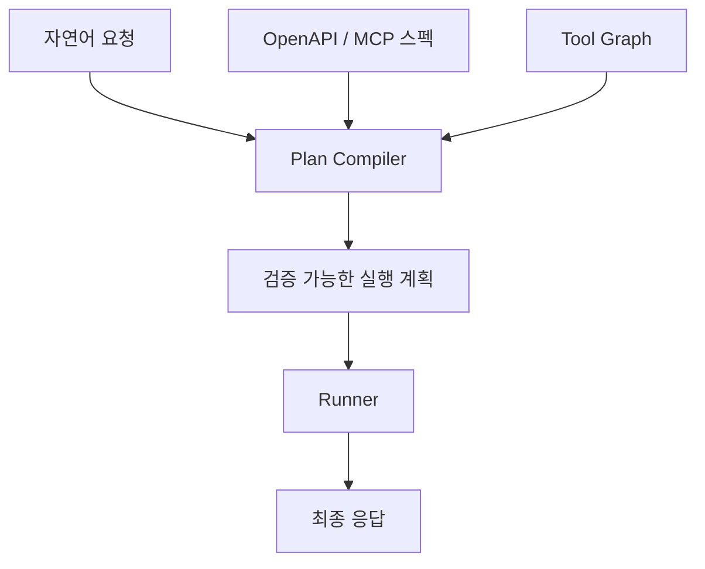
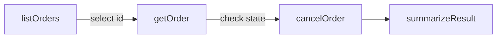
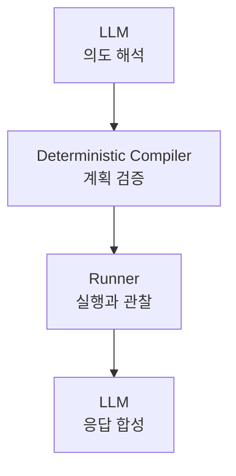

`graph-tool-call`을 처음 만들 때의 문제는 단순했다.

LLM에게 도구가 너무 많았다.

MCP 서버 하나만 붙어 있을 때는 괜찮다. 도구가 5개, 10개 정도면 LLM에게 전체 tool schema를 넘겨도 큰 문제가 없다. 그런데 MCP 서버가 늘어나고, OpenAPI 스펙을 통째로 tool로 변환하고, 사내 업무 시스템까지 붙기 시작하면 상황이 달라진다.

도구가 100개를 넘으면 prompt가 지저분해진다. 1,000개를 넘으면 "어떤 도구를 쓸지"보다 "도구 목록을 어떻게 넣을지"가 먼저 문제가 된다. 이때 필요한 것이 도구 검색엔진이었다.

그래서 이전 글 [graph-tool-call: LLM Agent를 위한 그래프 기반 도구 검색 엔진](/posts/ai/agent/graph-tool-call-llm-agent-graph-based-tool-search-engine/)에서는 이 문제를 다뤘다. OpenAPI와 MCP에서 도구를 수집하고, 도구 사이의 관계를 그래프로 만들고, BM25와 그래프 확장과 임베딩을 섞어서 필요한 도구만 찾아오는 구조였다.

그런데 도구 검색을 만들고 나니 다음 문제가 보였다.

검색은 "무엇을 쓸지"를 줄여준다. 하지만 실제 업무는 "어떤 순서로 실행할지"가 더 어렵다.

## 검색 결과만으로는 일이 끝나지 않는다

예를 들어 사용자가 이렇게 말한다고 하자.

```text
방금 만든 주문을 찾아서 상태를 확인하고, 취소 가능한 상태면 취소해줘.
```

도구 검색엔진은 여기서 `cancelOrder` 같은 도구를 잘 찾아낼 수 있다. 검색 관점에서는 꽤 좋은 결과다. 사용자가 "취소"라고 했고, 도구 이름에도 cancel이 있으니 상위에 올라오는 것이 맞다.

하지만 agent가 바로 `cancelOrder`를 호출하면 위험하다. 아직 모르는 것이 많다.

- "방금 만든 주문"이 어떤 주문인지 알아야 한다.
- 취소 전에 주문 상세를 조회해야 할 수 있다.
- 현재 상태가 취소 가능한 상태인지 확인해야 한다.
- 취소 API에 넣을 `order_id`를 이전 응답에서 꺼내야 한다.
- 실패하면 사용자에게 왜 실패했는지 설명해야 한다.

즉, 필요한 것은 단일 도구가 아니라 실행 경로다.


처음에는 이 간격을 LLM이 알아서 메울 수 있다고 생각하기 쉽다. "도구 설명을 잘 써두면 LLM이 순서대로 호출하지 않을까?"라는 기대다. 작은 예제에서는 실제로 그렇게 보인다. 하지만 도구가 많아지고 API 응답 구조가 제각각이 되면, 이 방식은 금방 흔들린다.

LLM은 자연어 의도 해석과 최종 설명에는 강하다. 반대로 API path, required field, 선행 조회 관계, 응답 wrapper 해제, destructive action 방어 같은 영역은 구조적 로직이 더 잘한다.

이 지점에서 graph-tool-call의 방향이 바뀌기 시작했다.

## 검색엔진 다음에는 컴파일러가 필요하다

여기서 말하는 컴파일러는 C나 Rust 컴파일러 같은 의미는 아니다. 자연어 요청과 API 스펙이라는 느슨한 입력을, 실행 가능한 중간 표현으로 낮추는 계층이라는 뜻에 가깝다.



검색엔진은 후보를 찾는다. 컴파일러는 후보를 실행 가능한 순서로 낮춘다.

이 차이가 중요하다.

| 단계 | 질문 | 산출물 |
| --- | --- | --- |
| Tool Retrieval | 어떤 도구가 관련 있는가? | tool 후보 목록 |
| Plan Compilation | 어떤 순서로 실행 가능한가? | stage 기반 실행 계획 |
| Runner | 실제 호출이 성공했는가? | stage별 결과와 오류 |
| Response Synthesis | 사용자에게 무엇을 말해야 하는가? | 최종 답변 |

도구 검색만 있을 때는 `cancelOrder`가 1등으로 나오는 것이 목표였다. 실행 계획 컴파일러까지 가면 목표가 바뀐다.

```text
1. 최근 주문 목록 조회
2. 사용자가 말한 "방금 만든 주문" 후보 선택
3. 주문 상세 조회
4. 취소 가능 상태인지 검사
5. 취소 가능하면 취소 실행
6. 결과를 사용자 언어로 요약
```

이제 문제는 ranking이 아니라 planning이다.

## 왜 그래프가 여기서 다시 중요해지는가

처음 graph-tool-call에서 그래프는 검색 품질을 높이기 위한 장치였다. `listOrders`, `getOrder`, `cancelOrder`가 서로 관련 있다는 것을 알면, 검색 결과를 더 넓게 확장할 수 있다.

그런데 실행 계획으로 넘어가면 그래프의 의미가 더 커진다. 그래프는 단순히 "비슷한 도구"를 알려주는 것이 아니라, "어떤 도구가 어떤 도구 앞에 와야 하는지"를 알려주는 재료가 된다.



도구 사이에는 여러 종류의 관계가 있다.

- 이 도구를 실행하려면 먼저 필요한 도구
- 같은 resource를 다루는 보완 도구
- 하나의 결과가 다음 도구의 입력으로 들어가는 관계
- read-only 도구와 destructive 도구의 경계
- 목록 조회와 상세 조회와 변경 작업의 순서

이 관계를 매번 LLM에게 추론시키면 느리고 비싸고 흔들린다. 반대로 그래프에 관계를 쌓아두면 plan compiler가 훨씬 안정적으로 움직일 수 있다.

그래서 graph-tool-call은 "도구를 검색하는 그래프"에서 "도구를 실행 순서로 엮는 그래프"로 성격이 넓어지고 있다.

## LLM에게 맡길 것과 맡기지 않을 것

이 작업에서 가장 중요한 판단은 LLM을 배제하는 것이 아니다. 오히려 반대다. LLM이 잘하는 일을 더 잘하게 만들기 위해, LLM이 못하는 일을 덜 맡기는 쪽에 가깝다.

LLM에게 맡기기 좋은 일은 이런 것이다.

- 사용자의 자연어 의도 해석
- 모호한 표현의 후보 추론
- 최종 결과 설명
- 실패 상황을 사람이 이해할 수 있는 문장으로 바꾸기

구조적 로직이 맡는 편이 좋은 일은 다르다.

- required field가 채워졌는지 검사
- 어떤 stage의 output이 다음 stage input에 연결되는지 확인
- destructive action 전에 read-only 조회를 넣기
- API 응답의 `data`, `result`, `items` 같은 wrapper를 해제하기
- 실패한 stage에서 재시도할지 중단할지 결정하기



이 구조가 마음에 드는 이유는 책임이 분리되기 때문이다. LLM이 모든 것을 즉흥적으로 판단하는 구조에서는 실패 원인을 찾기가 어렵다. 반면 plan compiler가 중간 표현을 만들면 어느 지점에서 틀렸는지 볼 수 있다.

- intent를 잘못 해석했는가
- 도구 검색이 잘못됐는가
- graph relation이 부족했는가
- field mapping이 틀렸는가
- runner가 응답을 잘못 풀었는가
- 최종 설명만 이상했는가

에이전트가 제품이 되려면 이 구분이 필요하다. "LLM이 이상하게 했다"로는 운영이 안 된다.

## MCP가 많아질수록 이 문제가 커진다

MCP의 좋은 점은 도구를 붙이기 쉬워진다는 것이다. 파일 시스템, GitHub, Slack, Notion, DB, 브라우저, 사내 API, 대학 포털, 개인 자동화 도구까지 모두 MCP 서버로 감쌀 수 있다.

하지만 좋은 점이 그대로 문제도 된다. 붙이기 쉬우면 많이 붙게 되고, 많이 붙으면 선택과 실행 순서가 어려워진다.

MCP 서버 1개와 도구 10개짜리 환경에서는 tool calling만으로 충분하다. MCP 서버 20개와 도구 1,000개짜리 환경에서는 이야기가 다르다.

```text
작은 MCP 환경
사용자 요청 → LLM → 적당한 tool 호출

큰 MCP 환경
사용자 요청 → 의도 정규화 → 도구 검색 → 실행 계획 → 권한/안전성 검사 → 실행 → 결과 압축 → 응답 합성
```

규모가 커질수록 agent는 chatbot보다 runtime에 가까워진다. 그리고 runtime에는 compiler가 필요하다.

이때 compiler가 하는 일은 거창한 추상이 아니다. 아주 현실적인 일을 한다.

- 지금 호출해도 되는 도구인지 본다.
- 먼저 조회해야 하는 값을 찾는다.
- 사용자가 말한 "그거"가 어떤 entity인지 연결한다.
- 없는 값은 추측하지 않고 질문으로 돌린다.
- 실행 결과를 다음 stage에 넘길 수 있는 모양으로 정리한다.

이런 층이 있어야 MCP가 "도구 모음"에서 "실제 업무 자동화 환경"으로 넘어갈 수 있다.

## v0.20 개발기가 구현 기록이라면, 이 글은 방향성 기록이다

이미 [graph-tool-call v0.20 개발기](/posts/ai/agent/graph-tool-call-v020-rpc-detection-plan-execute-compiler/)에서는 RPC 탐지, 동적 prefix, Intent Parser, PathSynthesizer, Runner, Response Synthesizer 같은 구현 흐름을 정리했다.

그 글이 내부 구조와 개발 과정을 다뤘다면, 이 글에서 남기고 싶은 말은 조금 더 단순하다.

graph-tool-call의 첫 번째 문제는 "LLM에게 모든 도구를 보여줄 수 없다"였다.

그래서 검색엔진이 필요했다.

두 번째 문제는 "찾은 도구 하나만으로는 일을 끝낼 수 없다"다.

그래서 실행 계획 컴파일러가 필요하다.

이 변화는 graph-tool-call의 정체성을 꽤 바꾼다. 처음에는 context window를 아끼는 retrieval layer였다. 이제는 LLM agent가 대규모 도구 환경에서 실제 작업을 끝낼 수 있게 돕는 execution planning layer로 확장되고 있다.

## 앞으로 더 중요한 것

실행 계획 컴파일러로 가려면 검색 정확도만으로는 부족하다. 앞으로 더 중요해지는 것은 이런 것들이다.

- plan schema를 얼마나 안정적으로 유지할 것인가
- tool output과 input을 어떻게 안전하게 연결할 것인가
- destructive action을 어떻게 방어할 것인가
- 사용자의 확인이 필요한 stage를 어떻게 표시할 것인가
- 실패한 plan을 어떻게 재계획할 것인가
- 어떤 부분을 LLM에게 맡기고 어떤 부분을 deterministic하게 처리할 것인가

개인적으로는 이 지점이 LLM agent 개발의 재미있는 갈림길이라고 본다.

초기 agent 데모는 "LLM이 도구를 호출한다"만 보여줘도 신기했다. 하지만 실제 제품에서는 그 다음 질문이 바로 온다.

```text
그 도구를 왜 골랐는가?
그 전에 조회해야 할 것은 없었는가?
그 값을 어디서 가져왔는가?
실패하면 어디서 멈추는가?
위험한 작업은 어떻게 막는가?
같은 요청을 다시 실행하면 같은 흐름이 나오는가?
```

이 질문에 답하려면 agent는 조금 더 컴파일러처럼 변해야 한다.

자연어를 바로 실행하지 않고, 먼저 계획으로 낮춘다. 계획을 검증한다. 실행한다. 관찰한다. 실패하면 어느 stage가 실패했는지 남긴다. 마지막에야 사용자에게 자연어로 돌려준다.

이것이 graph-tool-call이 검색엔진에서 실행 계획 컴파일러로 넘어가고 있는 이유다. 도구를 잘 찾는 것만으로는 부족하다. 이제는 찾은 도구를 안전하고 재현 가능한 실행 경로로 엮어야 한다.
