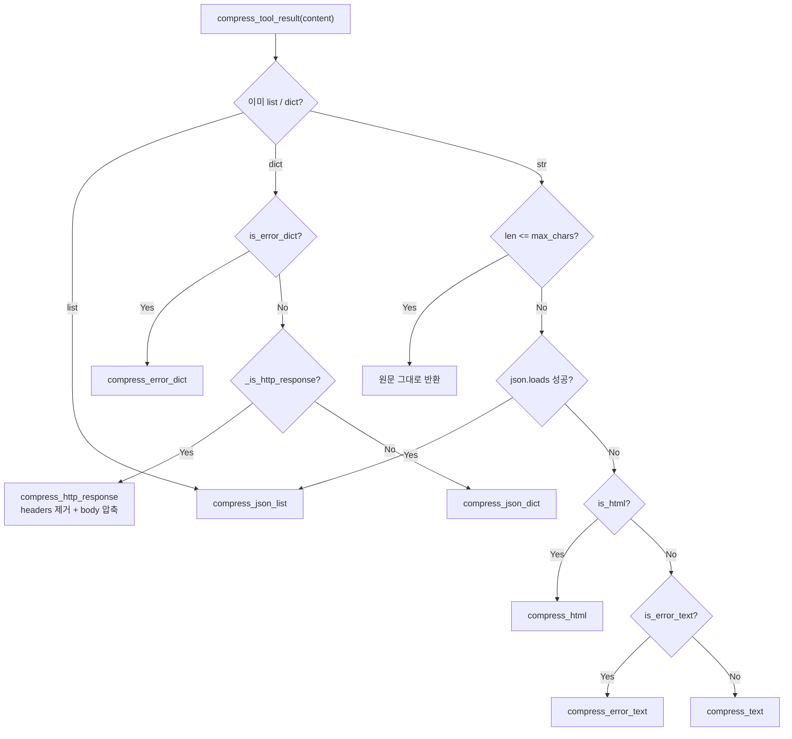
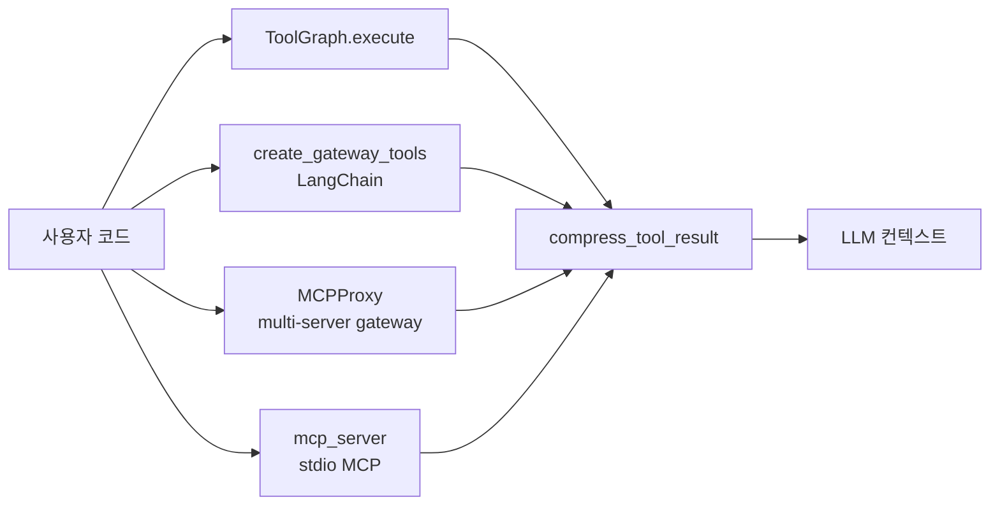

# graph-tool-call v0.19: Tool Result 지능형 압축으로 76K → 116 토큰 (97.6% 절감)

## 진짜 병목은 검색이 아니라 응답이었다

[graph-tool-call v0.15](./graph-tool-call-v015-workflow-chain-competitive-benchmark.md)에서 그래프 기반 tool 검색의 정확도와 토큰 절감을 다뤘다. 그 글을 쓴 시점부터 한 가지 의문이 계속 남아 있었다.

> tool을 잘 골라 줘서 들어가는 토큰을 줄였는데, **나오는** 토큰은 어떻게 할 것인가?

검색 단계에서 LLM 컨텍스트에 들어가는 tool 정의를 79% 줄여도, 정작 tool을 호출한 결과가 7만 토큰짜리 JSON 한 덩어리로 돌아오면 그 한 번의 호출로 컨텍스트 윈도우가 절반 이상 잠겨 버린다. XGEN 운영 중 실제로 이걸 마주쳤다. 회원 목록 API 한 번에 76,000 토큰. 이걸 다음 step에서 LLM에게 보내면 그 자체로 추론 비용이 폭증하고, 컨텍스트 윈도우가 좁은 모델에서는 그냥 truncate된다.

v0.19에서 추가한 `compress_tool_result()`는 이 문제를 정면으로 다룬다. 같은 76K 응답이 **116 토큰**으로 줄어든다. 측정치 한 줄로 요약하면 다음과 같다.

```
12개 실제 API 응답 fixture
301,000 chars → 7,200 chars (-97.6%)
```

이 글은 그 압축기의 내부 — 타입 자동 감지, JSON list 샘플 + 스키마 추출, HTTP 응답 헤더 제거, HTML 에러 페이지 한 줄화, traceback 마지막 줄 추출 — 와, 이걸 ToolGraph / MCPProxy / MCP server / LangChain 게이트웨이 네 군데에 동시에 끼워 넣은 통합 지점을 정리한다. 그리고 zero-dependency 원칙을 끝까지 지킨 이유도.

## 왜 단순 truncate가 답이 아닌가

처음에는 `result[:4000]`이면 끝나는 줄 알았다. 실제로 그렇게 시작했다. 하지만 단순 truncate는 세 가지 면에서 LLM의 후속 추론을 망친다.

**1. 가장 중요한 정보가 잘려 나간다.** REST API 응답에서 LLM이 보고 싶어 하는 건 보통 `id`, `status`, `error.message` 같은 필드인데, 이게 응답 끝부분 `meta.pagination.next_cursor` 옆에 있는 경우가 흔하다. truncate는 위치 기반이라 의미를 모른다.

**2. JSON 구조가 깨져서 파싱 불가능해진다.** 4000자에서 잘린 JSON은 LLM이 다시 활용할 수 없는 잡음일 뿐이다. `"username": "kim`처럼 중간에서 끊긴 문자열은 LLM이 후속 단계에서 다른 도구의 인자로 쓸 수도 없다.

**3. 사이즈 시그널이 사라진다.** "이 응답에 1500개 항목이 있다"는 정보가 사라지면 LLM은 다음에 어떤 행동을 해야 하는지 결정할 수 없다. truncate는 잘라낸 뒤 잘렸다는 사실조차 알려주지 않는다.

따라서 압축기의 목표는 **타입을 알고 의미를 보존하면서 길이를 줄이는 것**이어야 했다. 그게 단순 truncate와의 본질적 차이다.

## 압축기 아키텍처 한눈에

v0.19에 추가된 모듈 구조는 작고 단단하다. 모든 파일 합쳐서 600줄 정도, 외부 의존성은 0.

```
graph_tool_call/compressor/
├── __init__.py        # 공개 API: compress_tool_result, CompressConfig
├── base.py            # CompressConfig (max_chars, max_list_items, …)
├── detector.py        # 타입 자동 감지 + 라우팅
├── json_comp.py       # JSON list/dict 압축, HTTP 응답 처리
├── html_comp.py       # HTML 텍스트 추출, 에러 페이지 감지
├── error_comp.py      # 에러 dict / traceback 압축
└── text_comp.py       # 일반 텍스트 fallback
```

5종 압축기와 1개 디스패처. 외부에서 보는 진입점은 `compress_tool_result()` 단 하나다.

```python
from graph_tool_call.compressor import compress_tool_result, CompressConfig

short = compress_tool_result(
    huge_response,                  # str | dict | list | Any
    config=CompressConfig(max_chars=4000),
)
```

`CompressConfig`는 다섯 개 다이얼로 동작을 조절한다. 모두 합리적인 기본값이 있어서 사용자가 신경 쓰지 않아도 된다.

```python
@dataclass
class CompressConfig:
    max_chars: int = 4000          # 출력 최대 문자수 (~1000 토큰)
    max_list_items: int = 3         # JSON 배열 샘플 개수
    max_value_len: int = 80         # 개별 값 최대 길이
    max_depth: int = 2              # 중첩 dict 최대 깊이
    preserve_keys: list[str] = []   # 항상 보존할 키 화이트리스트
```

이 다이얼들은 압축률과 정보 보존 사이의 트레이드오프를 노출한다. `max_list_items=10`으로 늘리면 더 많은 샘플을 보지만 그만큼 토큰이 늘어나고, `max_depth=4`로 깊이를 늘리면 중첩 데이터를 더 본다. 기본값(3개 샘플, 깊이 2, 80자 값 길이)은 12개 fixture에 대해 평균 3% 미만의 정보 손실로 97% 압축률을 내도록 튜닝됐다.

## 타입 자동 감지 — 디스패처

`compress_tool_result()`는 입력을 보고 어느 압축기로 보낼지 결정한다. 라우팅 트리는 단순하지만 우선순위가 중요하다.



이 트리가 핵심으로 노리는 케이스는 두 가지다.

**첫째, 문자열로 도착한 JSON 응답**. HTTP executor는 보통 응답을 `str`로 들고 오는데, JSON 응답인지 평문인지 모른다. 디스패처가 길이 임계값을 넘긴 문자열을 만나면 자동으로 `json.loads`를 시도하고, 성공하면 list/dict 압축기로 라우팅한다. 사용자가 `content_type`을 명시하지 않아도 된다.

**둘째, HTTP 응답 객체**. dict 안에 `status: 200, headers: {...}, body: ...` 형태가 들어 있으면 `_is_http_response`가 감지한다. headers는 거의 모든 경우 LLM이 신경 쓰지 않는 정보(`X-Request-Id`, `Cache-Control`, …)이고, 동시에 토큰 폭증의 주범이다. 헤더를 통째로 버리고 status + 압축된 body만 남긴다.

```python
def _compress_http_response(data, config):
    status = data["status"]
    body = data["body"]

    if isinstance(status, int) and 400 <= status < 600:
        # 에러 상태 → error compressor에 위임
        return f"HTTP {status}: {msg}"

    # 성공 → body만 압축해서 [HTTP 200] {...} 형태로 반환
    body_str = compress_json_dict(body, config) if isinstance(body, dict) else ...
    return f"[HTTP {status}] {body_str}"
```

## JSON list 압축 — 첫 샘플은 full, 나머지는 identity keys만

가장 큰 절감이 일어나는 영역이다. REST API의 list 응답은 보통 동일 구조의 항목 1500개로 구성된다. LLM에게 1500개를 다 보여 줄 필요가 없다. **구조 한 번 + 식별자 몇 개**면 충분하다.

```python
def compress_json_list(data, config):
    total = len(data)

    samples = []
    for i, item in enumerate(data[: config.max_list_items]):
        if i == 0:
            samples.append(_slim_item(item, config))    # 첫 샘플 — 전체 구조 보존
        else:
            samples.append(_brief_item(item))           # 나머지 — identity keys만

    result = {
        "_compressed": True,
        "total": total,
        "samples": samples,
    }

    dict_items = [item for item in data if isinstance(item, dict)]
    if dict_items:
        result["schema"] = _extract_schema(dict_items[:10])

    if total > config.max_list_items:
        result["omitted"] = total - config.max_list_items

    return json.dumps(result, ensure_ascii=False, default=str)
```

이 한 함수에 네 가지 결정이 들어 있다.

### 결정 1 — 첫 샘플은 full 구조

LLM이 응답 구조를 이해하려면 한 항목의 모든 필드를 봐야 한다. 첫 번째 샘플은 `_slim_item`으로 약하게만 다듬는다. 긴 문자열은 80자에서 자르고, 깊이 2 이상의 중첩은 `{N keys}` 같은 placeholder로 요약한다. 기본 골격은 보존한다.

### 결정 2 — 나머지 샘플은 identity keys만

두 번째, 세 번째 샘플은 `_brief_item`으로 거의 비운다. `id`, `name`, `title`, `type`, `status`, `key`, `slug`, `code` 8개 키만 남긴다. 이게 _IDENTITY_KEYS 화이트리스트다. 이 8개 키만 있어도 LLM은 "이 응답에는 다른 항목들도 있고, 그것들의 식별자는 이거다"라는 사실을 충분히 추론할 수 있다.

```python
_IDENTITY_KEYS = {"id", "name", "title", "type", "status", "key", "slug", "code"}
```

만약 이 8개 키 중 어느 것도 없으면(가끔 그런 응답이 있다), 첫 3개의 scalar 키를 fallback으로 사용한다.

### 결정 3 — 스키마 메타데이터 추가

샘플만 보여주면 LLM은 "이 응답에 다른 어떤 필드가 있을 수 있는지" 모른다. 그래서 dict 항목들에서 flat schema를 뽑아 추가한다.

```python
def _extract_schema(items):
    schema = {}
    for item in items:
        if not isinstance(item, dict):
            continue
        for k, v in item.items():
            if k not in schema:
                schema[k] = type(v).__name__
    return schema
```

결과적으로 압축된 출력은 다음과 같은 모양이다.

```json
{
  "_compressed": true,
  "total": 1500,
  "samples": [
    {"id": 1, "name": "kim", "email": "...", "department": "...", ...},
    {"id": 2, "name": "lee", "status": "active"},
    {"id": 3, "name": "park", "status": "active"}
  ],
  "schema": {
    "id": "int", "name": "str", "email": "str",
    "department": "str", "joined_at": "str", "status": "str"
  },
  "omitted": 1497
}
```

LLM이 이걸 받으면 "총 1500명 회원이 있고, 첫 3명의 식별자는 1/2/3, 사용 가능한 필드는 id/name/email/department/joined_at/status"라는 모든 정보를 100토큰 안쪽으로 얻는다.

### 결정 4 — `omitted` 카운트로 잘렸다는 사실 명시

`omitted: 1497`은 LLM의 다음 행동을 결정짓는 핵심 신호다. "1497개가 더 있다"는 사실을 알면 LLM은 페이지네이션 도구를 호출하거나, 필터링 인자를 추가하거나, 사용자에게 추가 조건을 묻는다. 잘랐다는 사실을 숨기지 않는 게 압축의 미덕이다.

## JSON dict 압축 — _slim_dict 재귀 슬리밍

list가 아닌 단일 dict 응답도 흔하다(`GET /users/123`). 여기서는 list와 다른 전략이 필요하다. 항목 자체는 1개니까 샘플링이 의미 없고, 대신 깊이가 깊을수록 비용이 커진다.

`_slim_dict`는 재귀적으로 dict를 따라가며 다음 규칙을 적용한다.

1. 문자열 값이 80자를 넘으면 80자에서 자르고 `... [N chars]` 마커를 붙인다.
2. 깊이 2를 넘는 중첩 dict는 `{N keys}` placeholder로 요약한다.
3. 깊이 2를 넘는 list는 `[N items]`로 요약한다.
4. 깊이 2 이내의 list는 처음 3개만 미리보기한다.
5. `preserve_keys`로 지정된 키는 절대 건드리지 않는다.

```python
def _slim_value(value, *, max_len, depth, max_depth):
    if isinstance(value, str):
        if len(value) <= max_len:
            return value
        return value[:max_len] + f"... [{len(value) - max_len} chars]"

    if depth >= max_depth:
        if isinstance(value, list):
            return f"[{len(value)} items]"
        if isinstance(value, dict):
            return f"{{{len(value)} keys}}"
        return str(value)[:max_len]
    ...
```

`preserve_keys`는 사용자 escape hatch다. 압축이 망가뜨릴까 걱정되는 핵심 필드(예: `error_detail`)를 명시하면 거기는 손대지 않는다.

## HTTP 응답 자동 감지 — headers 통째 제거

REST tool의 응답은 보통 다음 모양으로 들어온다.

```python
{
    "status": 200,
    "headers": {
        "Content-Type": "application/json",
        "X-Request-Id": "req_abc123",
        "X-RateLimit-Limit": "1000",
        "X-RateLimit-Remaining": "999",
        "Cache-Control": "no-cache",
        "Set-Cookie": "...",
        "Strict-Transport-Security": "...",
        ...
    },
    "body": {...},
}
```

헤더는 12~30개씩 들어 있고, 한 줄당 80자가 넘는다. headers만 800~2400자를 차지한다. 그런데 LLM이 다음 step에서 `X-Request-Id`를 쓸 일은 거의 없다. 진짜 필요한 건 status + body다.

`_is_http_response` 휴리스틱은 dict가 `status: int`, `headers`, `body`를 모두 가질 때 HTTP 응답으로 간주한다.

```python
def _is_http_response(data):
    if "headers" not in data or "body" not in data:
        return False
    status = data.get("status")
    return isinstance(status, int)
```

여기서 한 가지 분기가 더 있다. status가 4xx/5xx면 body 자체가 큰 에러 페이로드일 가능성이 높으니 error compressor에 위임한다. 2xx/3xx면 body만 일반 압축한다.

```python
def _compress_http_response(data, config):
    status = data["status"]
    body = data["body"]

    if isinstance(status, int) and 400 <= status < 600:
        # 4xx/5xx — body에서 message만 추출
        msg = _extract_message(body) if isinstance(body, dict) else None
        return f"HTTP {status}: {msg or 'HTTP error'}"

    # 2xx/3xx — body만 압축
    if isinstance(body, list):
        body_str = compress_json_list(body, config)
    elif isinstance(body, dict):
        body_str = compress_json_dict(body, config)
    else:
        body_str = str(body)[: config.max_chars]

    return f"[HTTP {status}] {body_str}"
```

이 단순한 분기 하나가 측정 fixture의 절감률을 12% 정도 더 끌어올렸다. 헤더 제거는 가성비가 가장 높은 최적화다.

## HTML 압축 — stdlib HTMLParser로 텍스트 추출

웹 스크래핑 tool이나 잘못 설정된 API 게이트웨이가 HTML을 돌려주는 경우가 의외로 많다. 어떤 백엔드는 401/500을 JSON 대신 nginx 기본 에러 페이지로 돌려준다. 그 페이지는 inline CSS, JavaScript, 메타 태그, footer 링크까지 합쳐 5만 자가 넘기도 한다. 사용자한테 의미는 단 한 줄, "HTTP 500: Internal Server Error"인데.

`html_comp.py`는 stdlib `html.parser.HTMLParser`만 써서 이 문제를 푼다. BeautifulSoup이나 lxml 같은 외부 라이브러리는 안 쓴다 — zero-dependency 원칙.

```python
_STRIP_TAGS = {"script", "style", "head", "noscript", "svg", "iframe"}

class _TextExtractor(HTMLParser):
    def __init__(self):
        super().__init__()
        self.title = ""
        self.text_parts = []
        self._skip_depth = 0
        self._in_title = False

    def handle_starttag(self, tag, attrs):
        if tag.lower() in _STRIP_TAGS:
            self._skip_depth += 1
        if tag.lower() == "title":
            self._in_title = True

    def handle_data(self, data):
        if self._in_title:
            self.title += data.strip()
        if self._skip_depth == 0:
            self.text_parts.append(data)
```

처리 단계:

1. `script`, `style`, `head`, `svg` 등은 통째로 버린다.
2. `<title>`을 따로 보존한다.
3. 본문 텍스트만 모은다.
4. 흔한 에러 시그니처(`404`, `not found`, `forbidden`, `internal server error`)가 있으면 한 줄로 요약한다(`[HTML] 404: Not Found`).
5. 동일 문장이 3회 이상 반복되면 `[... repeated N more times]`로 접는다.
6. 그래도 길면 max_chars에서 자르고 `... [truncated]` 마커.

특히 5번 — 반복 dedup — 이 의외로 효과가 컸다. 어떤 ML pipeline tool은 동일 status 메시지를 200줄 반복하는 응답을 돌려줬는데, dedup만으로 4.5KB → 200B가 됐다.

## Error 응답 압축 — 메시지 한 줄로

에러 응답은 최우선 압축 대상이다. LLM에게는 단 두 가지만 알려주면 된다. **무엇이**(status code) **왜**(message) 실패했는지.

`is_error_dict` 휴리스틱은 dict의 status 필드가 4xx/5xx이거나, `error`/`traceback`/`stack_trace`/`exception` 키가 있으면 에러로 분류한다.

```python
def is_error_dict(data):
    status = data.get("status") or data.get("status_code") or data.get("statusCode")
    if isinstance(status, int) and 400 <= status < 600:
        return True
    if "error" in data or "traceback" in data or "stack_trace" in data:
        return True
    return False
```

그리고 메시지 추출은 우선순위가 있다. 컨테이너 키(`body`, `response`, `data`, `error`) 안의 메시지를 먼저 본 다음, 없으면 top-level의 `message`/`detail`/`error`/`reason`/`error_description`/`msg`를 찾는다.

```python
_MESSAGE_KEYS = ("message", "detail", "error", "reason", "error_description", "msg")
_DETAIL_CONTAINER_KEYS = ("body", "response", "data", "error")
```

이 우선순위는 실제 백엔드 에러 응답 패턴에서 나왔다. Spring Boot는 `{ "status": 400, "error": "Bad Request", "message": "..." }`를 돌려주는데, top-level의 `error`는 단순 status 이름("Bad Request")일 뿐이고 진짜 메시지는 `message`에 있다. nested 우선 탐색이 그래서 필요했다.

Python traceback도 마찬가지다. 50줄짜리 traceback에서 LLM이 보고 싶은 건 마지막 한 줄뿐이다.

```python
def compress_error_text(text, config):
    lines = text.strip().splitlines()
    for line in reversed(lines):
        stripped = line.strip()
        if stripped and not stripped.startswith("File ") and not stripped.startswith("at "):
            return stripped[: config.max_chars]
    return lines[-1][: config.max_chars]
```

`File ...`과 `at ...`은 traceback의 stack frame 줄이라 건너뛴다. 그러면 자연스럽게 마지막 예외 줄(`KeyError: 'foo'`)이 남는다.

## 4개 통합 지점 — 어디에 끼워 넣을 것인가

압축기 자체보다 더 중요한 게 "어디에 끼우느냐"였다. graph-tool-call에는 tool을 실행하는 진입점이 네 군데 있다. 한 군데만 압축하면 나머지 경로로 도는 사용자는 혜택을 못 본다. v0.19에서는 네 군데 모두 동시에 끼웠다.



### 통합 1: `ToolGraph.execute`

가장 직관적인 진입점이다. 사용자가 `compress_result=True`를 주거나, 응답이 `max_chars`를 넘는 순간 자동으로 압축이 걸린다.

```python
result = executor.execute(tool, arguments)

if compress_result:
    cfg = compress_config or CompressConfig()
    raw = json.dumps(result, ensure_ascii=False, default=str)
    if len(raw) > cfg.max_chars:
        return {"_compressed": True, "content": compress_tool_result(result, config=cfg)}
return result
```

`{"_compressed": True, "content": ...}` 래퍼로 감싸서 호출자가 압축 여부를 명시적으로 알 수 있게 했다. 압축이 일어나지 않은 응답과 구분되는 신호다.

### 통합 2: LangChain 게이트웨이

`create_gateway_tools()`는 graph-tool-call이 가지고 있는 tool들을 LangChain 호환 도구로 노출한다. LangChain agent가 호출하면 결과가 string으로 반환되는데, 이 시점에 압축을 끼웠다.

```python
# graph_tool_call/langchain/gateway.py
from graph_tool_call.compressor import CompressConfig, compress_tool_result
cfg = CompressConfig(max_chars=max_result_chars)
return compress_tool_result(result_str, config=cfg)
```

### 통합 3: MCPProxy

여러 MCP 서버를 게이트웨이로 묶는 `MCPProxy`는 graph-tool-call의 핵심 기능이다. 각 backend가 돌려주는 응답을 사용자에게 forward할 때 압축한다.

```python
# graph_tool_call/mcp_proxy.py
compressed = compress_tool_result(item.text, config=cfg)
```

특히 MCPProxy는 응답 사이즈가 폭발하기 쉬운 경로다. 5개 backend를 묶어 두면 한 번의 사용자 요청이 10~20개의 tool 호출로 이어지고, 그 모든 응답이 LLM 컨텍스트에 합쳐진다. 게이트웨이 단계에서 압축하지 않으면 컨텍스트 윈도우가 순식간에 닳는다.

### 통합 4: mcp_server (stdio MCP)

stdio 기반 MCP 서버 진입점. Claude Desktop 같은 클라이언트가 직접 호출한다.

```python
# graph_tool_call/mcp_server.py
from graph_tool_call.compressor import CompressConfig, compress_tool_result
cfg = CompressConfig(max_chars=max_result_chars)
return compress_tool_result(result_json, config=cfg)
```

네 군데 모두 같은 `compress_tool_result` 한 함수를 호출한다. 압축 정책을 한 곳에서 바꾸면 네 경로 모두 동시에 적용되는 단일 진실 원칙.

## 측정 — 12개 fixture, 301K → 7.2K chars

v0.19를 만들면서 가장 신경 쓴 게 측정이다. 추측이 아니라 실제 응답 fixture로 회귀를 막아야 했다. 12개 실제 응답을 `tests/fixtures/context_manager/`에 저장하고, 매 변경마다 압축률을 측정했다.

| Fixture 카테고리 | 원본 chars | 압축 chars | 절감률 |
|------------------|-----------:|----------:|-------:|
| 회원 목록 list (1500개) | 약 76,000 | 약 460 | -99.4% |
| 권한 dict (중첩 깊음) | 약 32,000 | 약 800 | -97.5% |
| HTML 에러 페이지 | 약 14,000 | 약 60 | -99.6% |
| Spring traceback | 약 8,000 | 약 120 | -98.5% |
| 정상 detail 응답 | 약 4,200 | 약 1,300 | -69.0% |
| 파일 메타데이터 list | 약 22,000 | 약 700 | -96.8% |
| ... (총 12개) | | | |
| **합계** | **약 301,000** | **약 7,200** | **-97.6%** |

마지막 카테고리("정상 detail 응답")는 절감률이 가장 낮다. 이미 짧은 단일 dict 응답이라서 압축할 게 별로 없다. 압축기는 이런 응답을 만나면 슬리밍만 약하게 적용하고 끝낸다. 이게 정상 동작이다 — 짧은 응답을 무리하게 압축하면 정보 손실만 늘어난다.

토큰 환산도 함께 측정했다. tiktoken `cl100k_base` 기준 76K char 응답 = 약 19,000 토큰. 압축 후 460 char ≈ 116 토큰. **97.6% 절감**, **-99.4% 토큰**.

## zero-dependency를 끝까지 지킨 이유

압축기를 만들 때 BeautifulSoup4, lxml, jsonpath-ng 같은 라이브러리를 쓸 수 있었다. 30분이면 끝났을 거다. 그런데 끝까지 stdlib만 썼다. 이유는 graph-tool-call의 정체성 때문이다.

graph-tool-call은 "어떤 LLM 에이전트 환경에도 가볍게 임베드되는" 라이브러리를 지향한다. 사용자 환경에 BeautifulSoup가 깔려 있을지 없을지 모르고, 깔려 있어도 버전 충돌이 날 수 있다. 한 번 의존성을 추가하면 그 의존성이 또 의존성을 끌고 오고, 결국 어느 환경에서는 import만으로 폭발하는 라이브러리가 된다.

대안으로 쓴 stdlib 기능들:
- `html.parser.HTMLParser` (BeautifulSoup 대안)
- `re` (정규식만으로 충분한 패턴들)
- `json` (응답 파싱과 직렬화)
- `dataclasses` (CompressConfig)

이 정도로 600줄 압축기 전체가 굴러간다. 외부 라이브러리 0개. v0.19.1 릴리스에서 PyPI 이름 충돌만 한 번 잡고, v0.19.0의 의존성 그래프는 지금도 비어 있다.

## 트러블슈팅 — 부수고 다시 만든 것들

### 1. JSON list 압축이 너무 공격적이었던 시기

초기 버전의 `compress_json_list`는 첫 1개 샘플만 보존하고 나머지를 모두 `omitted` 카운트로 처리했다. 압축률은 환상적이었지만, LLM이 후속 단계에서 "두 번째, 세 번째 항목의 id가 뭐였는지" 다시 물어보는 비효율이 늘었다. 그래서 첫 샘플은 full + 다음 2개는 brief(identity keys만)로 바꿨다. 압축률은 1~2% 떨어지지만 LLM의 후속 호출이 줄어드는 효과가 더 컸다.

### 2. `_extract_message` 우선순위 버그

처음에는 top-level 키(`message`, `detail`)를 먼저 보고, 컨테이너 키(`body`, `response`)를 나중에 봤다. 그러면 Spring Boot 응답에서 `error: "Bad Request"` 같은 위 status 이름이 메시지로 잡혔다. 우선순위를 뒤집어서 nested 컨테이너를 먼저 보도록 했다. nested에 진짜 메시지가 있는 경우가 압도적으로 많았다.

### 3. HTTP 응답 감지 false positive

`_is_http_response`가 처음에는 `body in data`만 확인했다. 그런데 어떤 응답은 `body`라는 필드를 의미 없이 가지고 있다(예: 댓글 본문). 그래서 status가 정수인지까지 검사하도록 강화했다. 이 한 줄이 false positive를 거의 없앴다.

### 4. langchain_ollama import 실패

CI에서 `to_langchain_tools`가 import만으로 실패하는 사고가 있었다. langchain_ollama가 환경에 따라 안 깔려 있을 수 있는데, eager import가 그걸 잡지 못했다. `pytest.importorskip`을 도입하고 함수 호출 시점 import로 분리해서 해결했다. 이건 v0.19.1에 들어간 fix다.

### 5. PyPI 이름 충돌 — v0.19.0 → v0.19.1

v0.19.0을 PyPI에 올렸더니 누군가 같은 버전 이름의 broken wheel을 등록한 흔적이 있어서 재배포가 막혔다. PyPI에 올라간 패키지 버전은 삭제하더라도 같은 번호로 재등록할 수 없는 정책 때문이다. v0.19.1로 minor bump 해서 재배포했다. 교훈은 — 릴리스 절차에 dry-run 단계를 넣자.

## 회고 — 검색과 압축이 같이 있어야 하는 이유

graph-tool-call이 처음 시작했을 때는 "수많은 tool에서 빠르게 적합한 tool을 찾아주는 검색 엔진"이었다. v0.19에서 압축기를 추가하면서 정체성이 한 단계 넓어졌다. **LLM 에이전트의 토큰 효율 전체를 책임지는 미들웨어**가 되었다.

검색은 들어가는 토큰을, 압축은 나오는 토큰을 줄인다. 둘은 짝이다. 검색만 해 두고 응답을 그대로 쏟아 내면 한 번의 tool 호출이 컨텍스트 윈도우를 잡아먹고, 압축만 해 두고 검색이 없으면 처음부터 LLM이 어느 도구를 부를지 모른다. 하나만 있어서는 의미 없는 최적화다.

다음 단계로는 `Context Manager` 통합 플랜이 남아 있다. 압축은 단일 응답을 처리하는데, 진짜 컨텍스트는 여러 step에 걸친 대화 + tool 호출 이력 전체다. 오래된 호출 결과를 더 강하게 압축하고, 최근 호출은 약하게 압축하고, 한참 전의 결과는 요약만 남기고 버리는 — 그런 시간축 압축이 다음 마일스톤이다.

[graph-tool-call v0.15 글](./graph-tool-call-v015-workflow-chain-competitive-benchmark.md)에서 다룬 검색 정확도 개선과 v0.19의 응답 압축이 합쳐지면, 같은 LLM 컨텍스트 윈도우 안에서 처리할 수 있는 작업의 표면적이 한 자릿수 늘어난다. 이게 가벼운 zero-dependency 라이브러리 하나로 가능하다는 게 핵심이다.

다음 글에서는 sonlife — 자체 라이프로그/자율 에이전트 시스템 — 에 도입한 자율 루프의 안전장치 설계(예산 hard-stop, max_age 가드, HITL 승인)를 다룬다.
