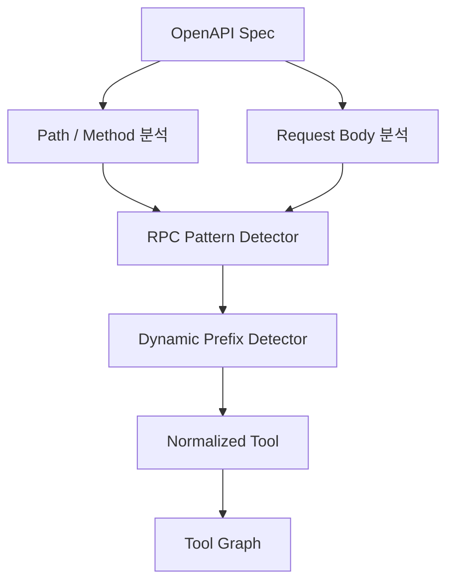
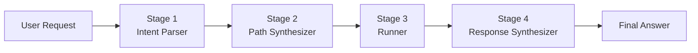
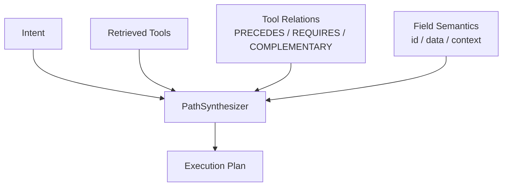
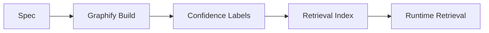
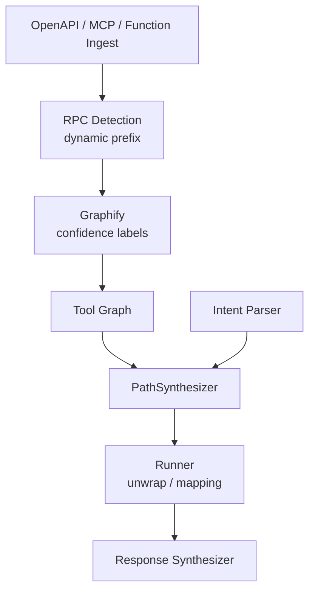

# graph-tool-call v0.20 개발기: RPC 탐지에서 Plan-and-Execute 컴파일러까지

## v0.19는 결과를 줄였고, v0.20은 실행 경로를 만들기 시작했다

`graph-tool-call`은 처음에는 LLM Agent의 tool 목록을 줄이기 위한 라이브러리였다. Kubernetes API처럼 tool이 수백 개만 되어도 모든 tool schema를 prompt에 넣는 방식은 바로 한계에 닿는다. 그래서 OpenAPI, MCP, Python 함수에서 tool을 수집하고, BM25와 그래프 관계, optional embedding을 조합해 필요한 tool만 찾아오는 구조로 시작했다.

v0.15에서는 1068개 tool 스트레스 테스트와 workflow chain API를 정리했다. 이전 글 [graph-tool-call v0.15: 1068 Tool 스트레스 테스트와 워크플로우 체인 엔진](graph-tool-call-v015-workflow-chain-competitive-benchmark.md)에서 다룬 흐름이다. 그 뒤 v0.17~v0.19에서는 LangChain agent에 `ToolGraph`를 직접 연결하고, gateway tool 2개로 대규모 tool set을 다루고, tool result 압축까지 붙였다. v0.19의 핵심은 "tool 호출 뒤 돌아오는 거대한 결과를 어떻게 context에 넣을 수 있을 만큼 줄일 것인가"였다.

그 다음 단계는 자연스럽게 "그럼 tool을 어떤 순서로 실행할 것인가"가 된다. 검색은 tool 후보를 찾는다. 압축은 결과를 줄인다. 하지만 agent가 실제 업무를 하려면 다음 문제가 남는다.

- 사용자 의도를 어떤 실행 intent로 정규화할 것인가
- 어떤 API path 또는 RPC method가 실제 목표에 가까운가
- 선행 조회가 필요한지 어떻게 판단할 것인가
- 응답 envelope 안에서 진짜 데이터는 어디에 있는가
- enum, option, context default 같은 실행 인자를 어떻게 채울 것인가
- 최종 응답을 사용자에게 어떻게 합성할 것인가

v0.20 개발 흐름은 이 질문을 다루기 시작했다. 아직 `pyproject.toml` 기준 공식 릴리스 버전은 v0.19.1이고, 이 글은 로컬 개발 브랜치의 미출시 작업을 기준으로 한 개발기다. 관련 커밋 흐름은 `eecbef1`, `d6a14e9`, `d46e393`, `fd11308`, `9b14a7a`, `2e67913`, `f7e6b42`, `285baa0` 근처에 모여 있다.

## 문제 1: REST처럼 보이지만 실제로는 RPC인 API

OpenAPI를 tool로 바꿀 때 가장 먼저 기대하는 구조는 REST다.

```text
GET    /orders
GET    /orders/{id}
POST   /orders
PATCH  /orders/{id}
DELETE /orders/{id}
```

이런 API는 path와 HTTP method만 봐도 resource와 action을 꽤 잘 추론할 수 있다. `GET /orders/{id}`는 조회, `DELETE /orders/{id}`는 삭제, `POST /orders`는 생성에 가깝다. graph-tool-call의 초기 관계 추론도 이 REST 감각을 많이 사용했다.

하지만 실제 업무 API는 REST만 있는 것이 아니다. 특히 오래된 엔터프라이즈 시스템이나 내부 업무 시스템은 다음처럼 RPC 형태를 자주 가진다.

```text
POST /api/common/execute
POST /api/service/action
POST /gateway
```

path는 거의 같고, 실제 기능은 body 안의 `method`, `cmd`, `service`, `action` 같은 필드에 들어간다. 이런 API를 REST 규칙으로만 분석하면 모든 tool이 비슷하게 보인다. path가 같으니 graph relation도 흐려지고, BM25도 endpoint 이름만으로는 분별력이 낮아진다.

v0.20 흐름의 첫 번째 큰 작업은 RPC 패턴 감지였다. `eecbef1` 커밋은 Layer 4 RPC 패턴 감지, 동적 prefix 감지, UTF-8 인코딩 fix를 묶은 작업이었다.



여기서 핵심은 path보다 payload semantics를 더 봐야 한다는 점이다. REST에서는 path가 resource 이름을 들고 있지만, RPC에서는 body field가 사실상 operation name이다. 그래서 tool 이름과 description을 만들 때도 path 문자열만 쓰면 안 된다. body의 action field, operation summary, schema title, enum 후보를 함께 보아야 한다.

## 동적 prefix 탐지

RPC 스타일 API에서 또 하나의 문제는 prefix다. 여러 operation이 같은 wrapper endpoint를 쓰고, 실제 service 이름만 payload 안에서 달라지는 경우가 있다.

예를 들어 개념적으로는 다음과 같다.

```json
{
  "service": "order",
  "action": "cancel",
  "payload": {
    "order_id": "..."
  }
}
```

다른 operation은 같은 endpoint를 쓰되 `service`나 `action` 값이 달라진다. 이런 구조에서는 `service.action` 조합이 tool의 진짜 이름에 가깝다. 동적 prefix 탐지는 이 값을 찾아서 tool name과 graph category에 반영하는 작업이다.

```text
POST /gateway + service=order + action=cancel
→ order.cancel

POST /gateway + service=payment + action=refund
→ payment.refund
```

이렇게 정규화하면 retrieval 단계에서 훨씬 유리해진다. 사용자가 "주문 취소"라고 말했을 때 path `/gateway`는 아무 힌트도 주지 못하지만, `order.cancel`은 강한 신호가 된다. 그래프에서도 `order.list`, `order.detail`, `order.cancel` 사이의 관계를 만들 수 있다.

## 문제 2: 검색 결과에서 실행 계획으로 넘어가기

기존 `retrieve()`는 사용자 query에 맞는 tool 후보를 반환한다. 이것만으로도 context overflow 문제는 많이 줄어든다. 하지만 agent가 실제로 task를 끝내려면 tool 후보만으로는 부족하다.

사용자가 이렇게 말한다고 하자.

```text
방금 만든 주문을 찾아서 상태를 확인하고, 취소 가능한 상태면 취소해줘.
```

단일 tool 검색이라면 `cancelOrder`가 상위에 올 수 있다. 하지만 실행에는 최소한 다음 정보가 필요하다.

- "방금 만든 주문"이 어떤 context value를 가리키는가
- 취소 전에 조회가 필요한가
- 조회 결과의 어떤 field가 취소 가능 상태를 나타내는가
- 취소 API에는 어떤 id를 넣어야 하는가
- 취소 결과를 최종 답변으로 어떻게 요약할 것인가

그래서 v0.20 방향에서는 plan-and-execute 레이어가 들어왔다. `fd11308`은 L0와 Stage 3 기반 레이어를 만들고, `d6a14e9`는 Stage 1 Intent Parser와 Stage 4 Response Synthesizer를 추가했다. `d46e393`은 Stage 2 PathSynthesizer를 graph 기반 deterministic plan 생성기로 구현했다.



이 구조는 agent loop를 완전히 없애려는 것이 아니다. 대신 LLM이 매번 "다음 tool이 뭐지"를 처음부터 고민하지 않도록, graph가 deterministic한 plan 후보를 먼저 만든다. LLM은 애매한 intent 해석이나 최종 응답 합성처럼 언어 판단이 필요한 곳에 집중한다.

## Stage 1: Intent Parser

Intent Parser의 역할은 사용자 요청을 실행 가능한 의도 구조로 바꾸는 것이다. 자연어를 곧장 tool 검색 query로 던지는 방식은 단순하지만, multi-turn이나 context 의존 요청에서 약하다.

예를 들어 "그거 취소해줘"라는 문장은 이전 대화가 없으면 의미가 없다. 직전 stage에서 `order_id`가 만들어졌는지, 사용자가 어떤 리소스를 보고 있었는지, 최근 tool result가 어떤 entity를 포함했는지 알아야 한다.

Intent Parser는 다음 값을 정규화해야 한다.

```json
{
  "domain": "order",
  "action": "cancel",
  "target": {
    "kind": "context_ref",
    "name": "last_order"
  },
  "constraints": [
    "if_cancelable"
  ],
  "output": "explain_result"
}
```

이 예시는 실제 내부 스키마를 그대로 옮긴 것이 아니라 개념 설명이다. 중요한 것은 사용자 요청이 검색 문자열 하나가 아니라 action, target, constraint, output expectation으로 분리된다는 점이다.

Intent Parser는 LLM이 잘할 수 있는 영역이다. 다만 결과는 자유 텍스트가 아니라 validation 가능한 구조여야 한다. 그래야 다음 단계인 PathSynthesizer가 결정적으로 처리할 수 있다.

## Stage 2: PathSynthesizer

PathSynthesizer는 graph-tool-call v0.20에서 가장 중요한 레이어다. 사용자의 intent와 tool graph를 보고 실행 가능한 tool chain을 만든다. 이름 그대로 "검색"이라기보다 "경로 합성"이다.



단일 검색과 다른 점은 다음과 같다.

- primary action tool만 고르지 않는다.
- prerequisite tool을 함께 찾는다.
- tool output이 다음 tool input으로 연결 가능한지 본다.
- context default로 채울 수 있는 field를 구분한다.
- enum 또는 dynamic option이 필요한 field를 표시한다.
- 실행 불가능한 chain은 후보에서 제외한다.

예를 들어 `cancelOrder`가 top result여도 `order_id`가 없으면 바로 실행할 수 없다. 이때 graph relation이 `listOrders → getOrder → cancelOrder`를 알려주면 PathSynthesizer는 선행 stage를 붙일 수 있다.

```text
Plan
1. listOrders
2. select target order
3. getOrder
4. cancelOrder
5. summarize result
```

이 단계에서 중요한 것은 모든 판단을 LLM에게 맡기지 않는 것이다. tool graph에는 이미 관계가 있다. OpenAPI schema에는 field 정보가 있다. MCP annotation이나 operation metadata에는 destructive, read-only, idempotent 같은 힌트가 있을 수 있다. PathSynthesizer는 이런 구조적 정보를 최대한 사용한다.

## FieldSemantic과 kind

`f7e6b42`는 ontology 쪽에 `kind`를 추가한 작업이었다. `kind`는 단순한 타입 정보가 아니라 field의 역할을 구분하기 위한 힌트다. 예를 들어 어떤 field는 사용자가 직접 넣어야 하는 data이고, 어떤 field는 context에서 가져올 수 있는 값이다.

```text
data
- 사용자가 제공하거나 명시적으로 선택해야 하는 값

context
- 이전 tool result, session state, profile, route param 등에서 가져올 수 있는 값
```

이 구분이 없으면 agent는 모든 required field를 사용자에게 물어보거나, 반대로 아무 값이나 추측해 넣으려 한다. 둘 다 좋지 않다. `order_id`가 직전 결과에 있으면 context에서 가져오면 되고, 사용자가 새로 입력해야 하는 값이면 질문해야 한다.

```json
{
  "field": "order_id",
  "semantic": "entity_id",
  "kind": "context",
  "source_hint": "previous_order.id"
}
```

field semantic은 plan compiler의 재료다. retrieval이 tool을 찾는 단계라면, field semantic은 tool 사이를 실제로 연결하는 단계다.

## Stage 3: Runner와 wrapper-agnostic unwrap

계획을 만들었다고 끝이 아니다. 실제 API 응답은 늘 깔끔하지 않다. 어떤 API는 결과를 `data`에 넣고, 어떤 API는 `result`에 넣고, 어떤 API는 list를 한 번 더 감싼다. RPC wrapper는 더 복잡하다.

`9b14a7a`는 plan runner에서 wrapper-agnostic envelope unwrap과 `response_root_keys` hint를 추가한 작업이었다. 이 작업이 필요한 이유는 명확하다. 다음 stage는 이전 stage의 "진짜 데이터"를 필요로 한다.

```json
{
  "status": "ok",
  "message": "success",
  "data": {
    "items": [
      {"id": "A", "state": "created"}
    ]
  }
}
```

여기서 다음 stage가 볼 것은 전체 응답이 아니라 `data.items[0].id`일 수 있다. API마다 wrapper가 다르므로 runner는 몇 가지 root key 후보를 알고 있어야 한다.

```text
raw response
→ unwrap envelope
→ select response root
→ map output field
→ feed next stage
```

이것도 LLM에게 맡길 수 있지만, 매번 맡기면 느리고 불안정하다. 흔한 wrapper 패턴은 deterministic하게 풀고, 애매한 경우에만 hint나 사용자 선택을 받는 편이 낫다.

## Stage 4: Response Synthesizer

Response Synthesizer는 실행 결과를 사용자에게 돌려주는 마지막 단계다. 여기서 중요한 점은 tool result 전체를 그대로 말하지 않는 것이다. v0.19에서 이미 tool result 압축을 다뤘지만, v0.20의 response synthesizer는 한 단계 더 목적 지향적이다.

사용자는 "취소해줘"라고 했지, 원시 JSON을 보고 싶은 것이 아니다. 최종 응답은 다음을 담으면 된다.

- 어떤 작업을 시도했는가
- 어떤 선행 조회를 했는가
- 실제로 실행됐는가
- 실패했다면 왜 실패했는가
- 사용자가 다음에 무엇을 해야 하는가

```text
주문 상태를 조회한 뒤 취소 가능 여부를 확인했다.
대상 주문은 이미 처리 중 상태라 자동 취소하지 않았다.
필요하면 상세 화면에서 수동 확인이 필요하다.
```

Response Synthesizer는 LLM이 잘하는 영역이다. 하지만 여기서도 입력은 정리되어 있어야 한다. runner가 stage별 event와 normalized result를 주면, synthesizer는 그 구조를 사용자 언어로 바꾼다.

## graphify와 zero-vector retrieval

`285baa0`은 graphify 쪽에 build-time-baked confidence labels와 zero-vector retrieval을 넣은 큰 작업이었다. 이름이 조금 낯설 수 있는데, 핵심은 "빌드 시점에 graph를 더 똑똑하게 만들어 런타임 검색 비용과 불확실성을 줄이자"는 방향이다.

Zero-vector retrieval은 embedding provider가 없거나 벡터를 쓰지 않는 환경에서도 검색 경로를 유지하기 위한 장치로 볼 수 있다. graph-tool-call은 core zero-dependency를 중요한 가치로 두고 있다. 즉, numpy나 sentence-transformers 없이도 BM25와 graph 기반 기능이 돌아가야 한다.



빌드 시점에 confidence label을 구워 두면 런타임은 매번 같은 추론을 반복하지 않아도 된다. 특히 API spec이 큰 경우, tool relation과 field semantic을 매번 새로 계산하는 것은 비용이 크다. 가능한 것은 빌드 타임에 정리하고, 런타임은 빠르게 plan을 합성하는 쪽이 맞다.

## v0.20 개발 흐름을 하나로 묶으면

전체 흐름을 하나로 묶으면 다음 그림이 된다.



v0.15까지의 graph-tool-call이 "tool graph를 만들어 검색한다"였다면, v0.20 방향은 "tool graph를 이용해 실행 계획을 컴파일한다"에 가깝다. 여기서 컴파일이라는 말을 쓰는 이유는, 자연어 intent와 API spec이라는 느슨한 입력을 검증 가능한 plan으로 낮추기 때문이다.

물론 아직 해야 할 일이 많다.

- plan schema를 안정화해야 한다.
- 실패한 stage의 재시도 정책을 정리해야 한다.
- dynamic option 선택 UX가 필요하다.
- field semantic의 오탐을 줄여야 한다.
- 실제 API fixture별 end-to-end benchmark가 더 필요하다.
- 문서와 public API를 릴리스 기준으로 정리해야 한다.

하지만 방향은 명확해졌다. LLM Agent에서 tool calling은 단순히 "함수 목록을 넣는다"가 아니다. 대규모 API에서는 retrieval이 필요하고, multi-step task에서는 plan이 필요하고, 실행 후에는 result compression과 response synthesis가 필요하다.

## 정리

graph-tool-call v0.20 개발 흐름에서 가장 중요한 변화는 검색 라이브러리에서 실행 계획 계층으로 이동하기 시작했다는 점이다.

v0.19는 tool result 압축으로 context budget 문제를 줄였다. v0.20은 RPC API를 더 정확히 tool graph로 바꾸고, intent parser와 path synthesizer로 실행 경로를 만들고, runner와 response synthesizer로 실제 호출 결과를 사용자에게 돌려주는 흐름을 만든다.

이 작업의 본질은 LLM에게 모든 판단을 맡기지 않는 것이다. LLM은 언어 intent와 최종 설명에 강하다. 하지만 API path, field mapping, prerequisite chain, wrapper unwrap 같은 부분은 구조적 정보와 deterministic logic이 더 잘한다. graph-tool-call은 그 둘을 나눠서 쓰는 방향으로 진화하고 있다.

아직 릴리스 전이지만, 이번 v0.20 개발 흐름은 다음 버전의 성격을 꽤 분명하게 보여준다. "수천 개 tool 중에서 무엇을 쓸지 찾는 라이브러리"에서 "찾은 tool을 어떤 순서로 안전하게 실행할지 계획하는 라이브러리"로 넘어가는 중이다.
