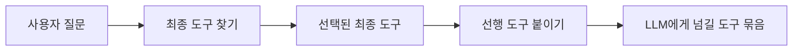
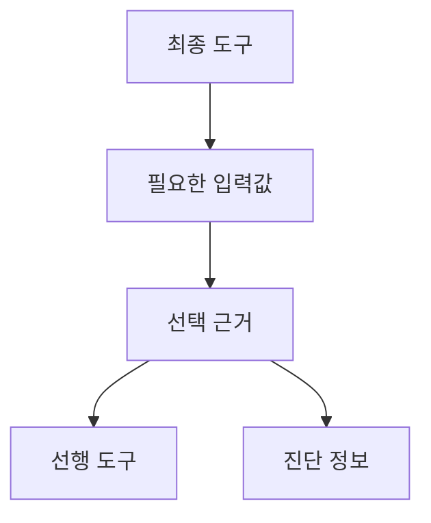
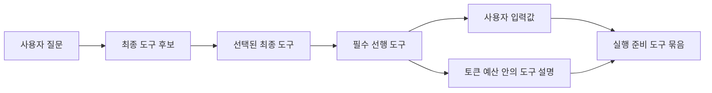

`graph-tool-call`의 초기 문제는 단순했다. LLM에게 수백 개 도구를 그대로 보여줄 수 없으니, 사용자 질문에 맞는 도구 몇 개만 골라줘야 했다.

여기서 도구는 사람이 누르는 버튼이나 API 호출에 가깝다. 예를 들어 주문을 조회하는 도구, 상품을 검색하는 도구, 재고를 가져오는 도구가 따로 있다. LLM 에이전트는 사용자의 말을 보고 이 도구들을 골라 실행한다.

처음에는 "사용자가 원하는 최종 도구를 잘 찾는가"가 중요했다. BM25, embedding, graph edge 같은 검색 신호를 섞어서 정답 도구를 상위 후보에 넣는 것이 목표였다.

하지만 v0.33~v0.36을 지나면서 문제가 바뀌었다. 최종 도구를 잘 찾는 것만으로는 충분하지 않았다. 실제 API 작업에는 입력값이 필요하고, 그 입력값을 만들기 위해 먼저 호출해야 하는 도구가 따로 있을 수 있다.

예를 들어 `getInventory`는 재고를 가져오는 도구다. 이 도구를 호출하려면 `skuId`가 필요하다. 사용자가 이미 `skuId`를 준 것이 아니라면, 앞에서 `searchProducts`나 `getProduct` 같은 도구로 `skuId`를 찾아야 한다. 이때 검색 결과에 `getInventory` 하나만 들어가면 검색은 성공처럼 보이지만, 실제 실행은 실패한다.

이 글에서 쓰는 용어는 이렇게 보면 된다.

- `target tool`: 사용자가 최종적으로 실행하고 싶은 도구
- `producer tool`: target tool에 필요한 입력값을 만들어주는 선행 도구
- `dependency`: target tool이 실행되기 전에 필요한 선행 관계
- `evidence`: 어떤 선행 도구를 붙여도 된다고 판단한 근거
- `bundle`: LLM에게 넘길 수 있도록 정리한 도구 묶음

이번 작업의 핵심은 이 지점이었다.

- 최종 도구 찾기와 선행 도구 붙이기를 분리한다.
- 선행 도구는 이름이 비슷해서가 아니라, API 계약상 필요한 근거가 있을 때만 고른다.
- 생성, 수정, 삭제 같은 위험한 선행 도구는 사용자의 의도와 명시적 허용이 있을 때만 자동으로 붙인다.
- 릴리즈에서 주장하는 수치는 README 문장이 아니라 재현 가능한 실험 파일로 남긴다.

관련 작업은 GitHub PR 기준으로 [#107](https://github.com/SonAIengine/graph-tool-call/pull/107), [#108](https://github.com/SonAIengine/graph-tool-call/pull/108), [#110](https://github.com/SonAIengine/graph-tool-call/pull/110), [#111](https://github.com/SonAIengine/graph-tool-call/pull/111)에 걸쳐 들어갔다.

## ToolLinkOS 비교에서 드러난 문제

먼저 외부 비교가 필요했다. 내부 실험만 보면 개선이 실제로 의미 있는지 알기 어렵다. 그래서 ToolLinkOS 데이터셋을 붙였다.

ToolLinkOS는 도구 검색 시스템을 비교하기 위한 공개 데이터셋이다. 573개 도구와 1,569개 질문이 있고, 각 질문마다 정답 도구와 필요한 선행 도구 목록이 들어 있다. graph-tool-call이 잘하던 것은 정답 도구를 찾는 일이었다. 약했던 것은 정답 도구에 필요한 선행 도구를 빠짐없이 붙이는 일이었다.

초기 그래프 탐색 결과는 다음과 같았다.

| 방식 | mAP@10 | Recall@10 | Target hit@10 | All required@10 |
| --- | ---: | ---: | ---: | ---: |
| BM25 | 0.166 | 0.236 | 0.906 | 0.020 |
| Dense E5 | 0.224 | 0.278 | 0.985 | 0.036 |
| Hybrid RRF | 0.206 | 0.271 | 0.968 | 0.032 |
| Graph RAG-Tool Fusion protocol | 0.852 | 0.940 | 0.866 | 0.797 |
| graph-tool-call 기존 그래프 탐색 | 0.359 | 0.635 | 0.953 | 0.091 |

이 숫자가 말하는 것은 명확했다. graph-tool-call은 최종 도구를 꽤 잘 잡았다. 하지만 최종 도구와 함께 필요한 선행 도구 묶음을 완성하는 능력은 부족했다.

표의 지표는 이름이 어렵지만 의미는 단순하다. `Target hit`은 최종 도구를 찾았는지, `All required`는 실행에 필요한 선행 도구를 모두 찾았는지를 본다. graph-tool-call은 최종 도구는 잘 찾았지만, 필요한 선행 도구를 모두 찾는 비율은 낮았다.

처음에는 이 결과가 불편했다. 기존 방식은 "그래프를 타면 관련 도구가 같이 올라온다"는 가정 위에 있었다. 그런데 선행 관계가 중요한 실험에서는 관련 도구를 섞어 올리는 것과 필수 선행 도구를 완성하는 것이 다른 문제였다.

그래서 검색 결과를 하나의 단순 순위표로 보지 않기로 했다.



최종 도구 후보와 선행 도구 후보가 같은 순위표에서 경쟁하면 안 된다. 최종 도구는 최종 도구끼리 비교하고, 선행 도구는 선택된 최종 도구가 요구하는 입력값을 기준으로 따로 완성해야 한다.

## B8: 최종 도구를 먼저 고정한다

v0.35에서 B8라는 내부 실험명을 붙인 구현 후보를 넣었다. 핵심은 역할 분리였다.

1. 최종 도구 후보 목록을 먼저 보존한다.
2. 선택된 최종 도구 하나를 기준으로 필요한 입력값을 본다.
3. 꼭 필요한 직접 선행 도구를 간접/선택 선행 도구보다 먼저 붙인다.
4. 다른 최종 도구 후보는 선행 도구와 섞지 않고 따로 남긴다.
5. 어떤 입력값 때문에 어떤 선행 도구를 골랐는지 근거와 진단 정보를 모두 남긴다.

이 방식으로 ToolLinkOS 전체 1,569개 케이스에서 기존 그래프 탐색 방식 대비 수치가 크게 올랐다.

| 지표 | 기존 그래프 탐색 | B8 방식 |
| --- | ---: | ---: |
| mAP@10 | 0.359 | 0.745 |
| Recall@10 | 0.635 | 0.869 |
| All required@10 | 0.091 | 0.567 |
| Target hit@10 | 0.953 | 0.960 |

여기서 중요한 것은 B8이 Graph RAG-Tool Fusion을 이겼다는 이야기가 아니다. 아직 아니다. Graph RAG-Tool Fusion은 같은 조건에서 mAP@10 0.852, Recall@10 0.940, All required@10 0.797이었다.

그래서 더 중요한 지점은 "좋은 결과가 나왔다"가 아니라 "무엇이 부족한지 외부 비교가 정확히 드러냈고, 그 부족한 축을 별도 설계 대상으로 분리했다"는 점이다.

## 근거가 있는 선행 도구만 자동으로 붙인다

선행 도구를 자동으로 붙이는 일은 위험하다. 이름이 비슷하다는 이유만으로 다른 API를 호출하면 실행 계획이 이상해진다.

그래서 v0.35에서는 선행 도구를 고를 때 쓰는 근거를 계층화했다.

- 사람이 직접 표시한 관계
- OpenAPI Link에 적힌 관계
- API 요청/응답 계약에서 나온 관계
- 실제 실행 기록에서 관찰된 관계
- 검증을 거쳐 승격된 실행 기록
- 이름이 비슷해서 추정한 약한 관계

자동 선택은 강한 근거가 있을 때만 허용한다. 이름만 비슷한 관계는 "후보일 수 있다"는 설명으로는 남길 수 있지만, 실행 계획에 몰래 들어가면 안 된다.

구현의 모양은 대략 이렇다.

```python
from graph_tool_call.graphify import complete_target_dependencies

closure = complete_target_dependencies(
    "getInventory",
    tools,
    graph=tool_graph,
    max_hops=3,
    policy="evidence_gated",
)

print(closure.required_dependencies)
print(closure.unresolved_fields)
print(closure.evidence)
```

closure 결과는 단순 목록이 아니다. 최종 도구, 필수 선행 도구, 선택 선행 도구, 입력값별 대안, 아직 해결하지 못한 입력값, 순환 관계, 근거, 진단 정보를 가진다. LLM이 실행 계획을 만들 때 이 결과를 그대로 소비할 수 있어야 하기 때문이다.



이 구조로 바꾸면서 최종 도구 선택과 선행 도구 완성이 섞이지 않았다. 단순 검색 엔진이라기보다, LLM에게 실행 가능한 도구 묶음을 만들어주는 계층에 가까워졌다.

## LLM에게 보여줄 도구 설명도 예산 안에 넣는다

LLM 에이전트에서는 "필요한 도구를 찾았다"만으로 충분하지 않다. 실제 프롬프트에 넣을 도구 설명이 토큰 예산 안에 들어와야 한다.

그래서 v0.35에서는 도구 묶음을 만들 때 최종 도구와 필수 선행 도구를 우선 보호하고, 도구 설명을 예산 안에서 줄여 넣도록 했다.

```python
from graph_tool_call.graphify import assemble_tool_bundle

bundle = assemble_tool_bundle(
    "Get inventory for the selected product.",
    "getInventory",
    tools,
    token_counter=counter,
    token_budget=4000,
)
```

도구 묶음은 이런 역할을 한다.

- 최종 도구를 보존한다.
- 다른 최종 도구 후보를 별도로 보존한다.
- 필수 선행 도구를 넣는다.
- 선택 선행 도구는 예산이 허락할 때만 넣는다.
- 사용자가 직접 넣어야 할 입력값을 분리한다.
- 빠진 도구와 토큰 예산 사용량을 기록한다.

검색 결과를 그대로 LLM에게 주는 방식과 다르다. LLM에게 넘기는 것은 "검색 결과"가 아니라 "실행 계획을 만들기 위한 최소 도구 묶음"이다.

## 잘못된 자동 실행을 막는다

v0.36에서 가장 중요한 변경은 안전 장치였다.

문제는 생성, 수정, 삭제 계열 선행 도구였다. 어떤 최종 도구가 입력값을 요구할 때, 그 입력값을 만들어내는 도구가 `create`, `update`, `delete` 계열이면 자동으로 붙이면 안 된다.

예를 들어 사용자가 "선택한 secret을 조회해줘"라고 했는데 `secretName`이 없다고 해서 `createSecret`을 먼저 호출하면 안 된다. 조회 요청에서 생성 도구를 자동 실행하는 것은 잘못된 계획이다.

v0.36에서는 위험한 선행 도구를 허용하는 조건을 두 개로 나눴다.

1. 사용자 요청이 쓰기/삭제 계열이어야 한다.
2. 연결 어댑터가 `allow_mutation=True`로 명시적으로 허용해야 한다.

둘 중 하나만 만족하면 안 된다.

```python
bundle = assemble_tool_bundle(
    "Read the selected secret.",
    "getSecret",
    tools,
    allow_mutation=True,
)

assert bundle.required_tools == []
assert bundle.closure["safety"]["query_intent"] == "read"
assert bundle.closure["safety"]["mutation_dependencies_allowed"] is False
```

반대로 사용자가 "secret을 만들고 확인해줘"라고 했고 어댑터가 변경 작업을 허용하면 선행 도구를 붙일 수 있다.

```python
bundle = assemble_tool_bundle(
    "Create a secret, then inspect it.",
    "getSecret",
    tools,
    allow_mutation=True,
)

assert bundle.required_tools == ["createSecret"]
assert bundle.closure["safety"]["query_intent"] == "write"
```

context나 auth scope 같은 입력도 선행 도구로 자동 연결하지 않는다. 이런 값은 `user_input_slots`로 올린다. 검색 API나 목록 API를 하나 더 호출해서 namespace나 token scope를 추정하는 것은 안전하지 않다.

## 아직 일부 검증은 통과하지 못했다

ToolLinkOS는 사람이 만든 선행 관계 그래프를 제공한다. 이 조건에서는 검색과 그래프 탐색 품질을 비교할 수 있지만, graph-tool-call이 OpenAPI 문서만 보고 선행 관계를 자동으로 찾아낼 수 있는지는 증명하지 못한다.

그래서 별도로 OpenAPI 자동 검증 gate를 만들었다.

```bash
make paper-openapi-closure
```

v0.35 시점의 첫 public corpus run은 Petstore와 Kubernetes를 대상으로 했다.

- 267 tools
- 12 queries
- 선행 관계가 필요한 케이스 3개
- 필요한 선행 도구 발견 비율 0.667
- all-required-found 0.667
- 케이스당 예상 밖 선행 도구 0.667

v0.36의 안전 장치 이후에는 같은 검증에서 예상하지 못한 선행 도구가 14개에서 0개로 줄었다. 필요한 선행 도구를 찾는 비율은 0.667로 유지됐고, 선행 관계 완성 여부는 1.00이 됐다.

그래도 이 검증은 의도적으로 통과하지 않는다. 선행 관계가 필요한 케이스가 3개뿐이라 최소 30개 기준에 못 미치고, Petstore의 선택적인 adoption 흐름도 아직 자동 선행 호출로 인정하지 않기 때문이다.

이 부분은 숨기면 안 된다. release 가능한 엔지니어링은 초록색 badge만 모으는 일이 아니다. 어떤 claim은 통과했고, 어떤 claim은 아직 보류인지 분리해야 한다.

## 숫자는 재현 가능한 파일로 남긴다

v0.36에서는 공개 README의 대표 수치를 바꿨다. 모델 점수처럼 보이는 큰 숫자 대신, 재현 가능한 7개 케이스 실험 파일을 전면에 둔다.

릴리즈 근거는 `benchmarks/results/releases/v0.36.0/dependency-chain-evidence.json`에 들어간다. 이 파일은 LLM이나 외부 API 없이, 저장소에 들어 있는 commerce OpenAPI 예제와 정답 데이터만으로 다시 만들 수 있다.

검증 명령은 두 개다.

```bash
make launch-evidence
make launch-evidence-check
```

공개 근거의 핵심 수치는 다음과 같다.

| 지표 | before | after |
| --- | ---: | ---: |
| 필요한 선행 도구 발견 비율 | 0.1429 | 1.0000 |
| candidate plan coverage | 0.4762 | 1.0000 |
| 최종 도구 Recall@5 | 1.0000 | 1.0000 |

이 수치는 "모든 API에서 항상 100%"라는 주장이 아니다. 직접 고른 7개 회귀 테스트에서 선행 도구 확장이 의도한 대로 동작한다는 릴리즈 주장이다.

검증도 릴리즈 근거 파일에 맞췄다.

- CPU-only full suite: 1211 passed, 3 skipped
- launch and OpenAPI focused suite: 52 passed
- ruff check, format check
- 릴리즈 근거 파일 최신성 검사
- clean wheel public smoke
- English/Korean Docusaurus production build

이렇게 두면 README의 주장, 패키지 릴리즈, 실험 파일, CI 검증이 같은 방향을 본다.

## 검색 결과가 아니라 실행 준비물로 바뀐다

v0.20까지의 graph-tool-call은 "검색엔진에서 실행 계획 컴파일러로 간다"는 방향을 잡았다. v0.36은 그 방향을 더 구체화했다.

변화는 세 가지다.

첫째, 최종 도구와 선행 도구를 같은 순위 문제로 보지 않는다. 최종 도구 찾기는 사용자 요청과 가장 잘 맞는 작업을 찾는 문제이고, 선행 도구 붙이기는 최종 도구가 요구하는 입력값을 채우는 문제다.

둘째, 그래프 관계를 실행 근거로 바로 쓰지 않는다. 관계에는 근거의 강도가 있어야 하고, 약한 근거는 대안이나 진단 정보로 내려가야 한다.

셋째, 실행 안전성을 검색 이후가 아니라 선행 도구를 붙이는 단계에 넣는다. 위험한 선행 도구, 인증/권한 관련 입력, 아직 해결하지 못한 필수 입력값은 모두 LLM에게 구조적으로 보여야 한다.

최종적으로 LLM에게 넘기는 것은 이런 구조가 된다.



이 구조의 장점은 실패가 설명 가능하다는 점이다.

- 최종 도구를 못 찾았는가
- 최종 도구는 찾았지만 선행 도구가 없는가
- 선행 도구는 있지만 위험한 변경 작업이라 차단했는가
- context/auth 입력이라 사용자 입력으로 돌렸는가
- 토큰 예산 때문에 선택 도구 설명을 뺐는가

agent가 실제 제품이 되려면 이 차이가 중요하다. "LLM이 도구를 잘못 골랐다"는 말은 디버깅 단위가 너무 크다. 어느 단계에서 어떤 근거가 부족했는지를 남겨야 고칠 수 있다.

## 남은 일

v0.36은 끝이 아니라 기준선을 세운 릴리즈다.

남은 과제는 명확하다.

1. OpenAPI 자동 검증 기준의 선행 관계 케이스를 30개 이상으로 늘린다.
2. ToolRet, Re-Invoke, TGR 같은 외부 비교 어댑터를 추가한다.
3. XGEN Quality Lab shadow evaluation으로 실제 제품 트래픽에 가까운 조건에서 품질을 본다.
4. 선택 워크플로우 완성은 결정적인 안전 검증과 분리된 계획 평가로 다룬다.
5. 구조화된 도구 묶음 지표와 일반 상위 K개 검색 지표를 계속 같이 본다.

이번 작업에서 가장 큰 교훈은 외부 실험을 이기기 위해 코드를 바꾸면 안 된다는 것이다. 실험이 드러낸 실패 유형을 설계 언어로 바꿔야 한다.

graph-tool-call v0.36의 변화는 그래서 선행 도구 붙이기 자체보다, 주장을 다루는 방식의 변화에 더 가깝다. 최종 도구를 찾았다는 말과 실행 가능한 계획을 만들었다는 말을 분리했고, 근거가 약한 관계를 실행에서 배제했고, 릴리즈 주장을 재현 가능한 파일로 고정했다.

LLM agent 도구 검색은 이제 "정답 도구를 상위 몇 개 안에 넣었는가"만으로 평가하기 어렵다. 실제 agent는 선택한 도구를 호출해야 하고, 호출하려면 입력이 필요하며, 입력을 만들기 위해 다른 도구를 부를 때는 안전해야 한다. v0.36은 그 문제를 정면으로 분리한 릴리즈였다.
