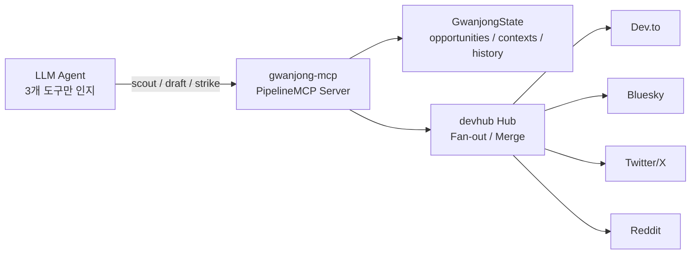
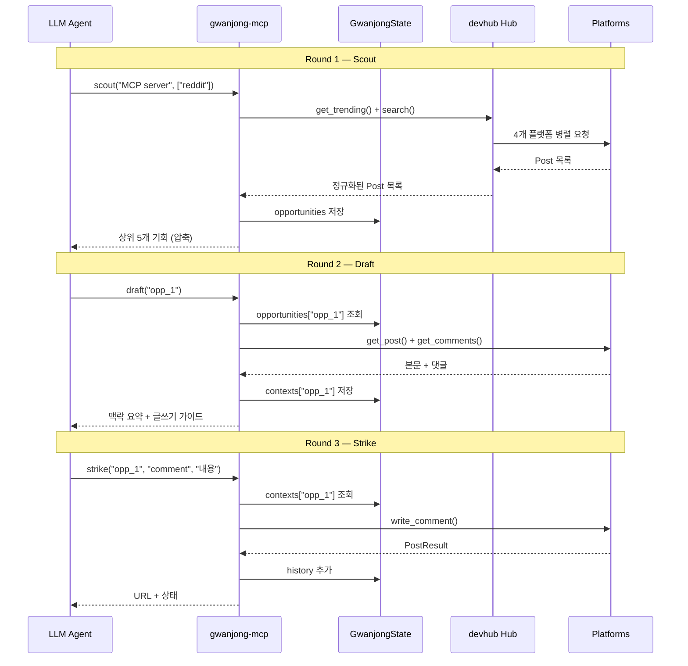
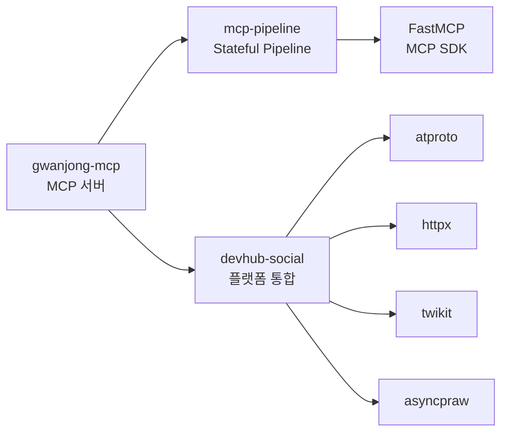

## 개요

개발자 커뮤니티에서 관련 토론을 찾고, 맥락을 분석하고, 댓글을 작성하는 일련의 과정을 LLM 에이전트가 수행하도록 만들었다. 이름은 **gwanjong**(관종) — 말 그대로 관심종자처럼 여러 플랫폼을 돌아다니며 존재감을 드러내는 AI 에이전트다.

시스템은 세 개의 독립 라이브러리로 구성된다.

| 프로젝트 | 역할 |
|----------|------|
| **devhub-social** | 4개 소셜 플랫폼을 하나의 인터페이스로 통합하는 어댑터 레이어 |
| **mcp-pipeline** | MCP 서버에 타입 안전 상태 관리와 파이프라인 체이닝을 추가하는 프레임워크 |
| **gwanjong-mcp** | 위 두 라이브러리를 결합하여 Scout/Draft/Strike 3단계 파이프라인을 구현한 MCP 서버 |

이 글에서는 각 레이어의 설계 의도와 핵심 구현을 다룬다.

## 전체 아키텍처



LLM은 3개의 도구만 본다. 내부적으로 4개 플랫폼의 API 호출, 데이터 정규화, 점수화, 분위기 분석이 모두 서버 안에서 처리된다. LLM이 중간 데이터를 릴레이할 필요가 없다.

## 문제: MCP 도구가 많아지면 토큰이 폭발한다

MCP 서버를 여러 개 연결하면 매 라운드마다 모든 도구 설명이 컨텍스트 윈도우에 포함된다. 7개 MCP 서버를 연결하면 약 67,000 토큰이 도구 설명에만 소비되고, 이는 200k 컨텍스트의 33.7%에 해당한다.

소셜 에이전트를 "전통적인 MCP 방식"으로 만들면 이렇게 된다:

- `search_devto`, `search_reddit`, `search_bluesky`, `search_twitter` — 4개
- `get_post_devto`, `get_post_reddit`, ... — 4개
- `get_comments_devto`, `get_comments_reddit`, ... — 4개
- `write_comment_devto`, `write_comment_reddit`, ... — 4개

최소 16개 도구, 9~10 라운드의 왕복이 필요하다. 매 라운드마다 16개 도구 설명이 재전송되니 토큰 낭비가 심각하다.

해결책은 두 가지다:

1. **도구 압축** — 16개 도구를 3개로 통합 (scout, draft, strike)
2. **서버 상태 캐싱** — 중간 결과를 서버에 보관하여 LLM이 데이터를 릴레이하지 않게 한다

이 두 가지를 체계적으로 구현한 것이 mcp-pipeline 프레임워크다.

## 레이어 1: devhub-social — 플랫폼 통합 어댑터

### 어댑터 패턴

핵심은 `PlatformAdapter` 추상 클래스다. 모든 플랫폼이 동일한 인터페이스를 구현한다.

```python
class PlatformAdapter(ABC):
    platform: str

    async def connect(self) -> None: ...
    async def close(self) -> None: ...

    @classmethod
    def is_configured(cls) -> bool: ...

    async def get_trending(*, limit: int = 20) -> list[Post]: ...
    async def search(query: str, *, limit: int = 20) -> list[Post]: ...
    async def get_post(post_id: str) -> Post: ...
    async def get_comments(post_id: str, *, limit: int = 50) -> list[Comment]: ...
    async def write_post(title: str, body: str, **kwargs) -> PostResult: ...
    async def write_comment(post_id: str, body: str) -> PostResult: ...
    async def upvote(post_id: str) -> PostResult: ...
```

새 플랫폼을 추가하려면 이 ABC를 구현하면 끝이다. 기존 코드를 수정할 필요가 없다.

### 통합 데이터 모델

4개 플랫폼의 응답 형식이 전부 다르다. Reddit은 중첩 CommentForest, Bluesky는 AT Protocol의 Thread 객체, Dev.to는 children 배열, Twitter는 conversation_id 기반 검색이다. 이걸 하나의 frozen dataclass로 정규화했다.

```python
@dataclass(frozen=True)
class Post:
    id: str
    platform: str
    title: str
    url: str
    body: str = ""
    author: str = ""
    tags: list[str] = field(default_factory=list)
    likes: int = 0
    comments_count: int = 0
    published_at: datetime | None = None
    raw: dict[str, Any] = field(default_factory=dict, repr=False)
```

`raw` 필드가 중요하다. 통합 모델로 커버되지 않는 플랫폼 고유 데이터가 있을 때 `post.raw["platform_specific_field"]`로 접근할 수 있다. 정보 손실이 없다.

### Hub: Fan-out과 Merge

`Hub`는 활성화된 어댑터들에게 요청을 병렬로 보내고 결과를 합친다.

```python
class Hub:
    @classmethod
    def from_env(cls) -> Hub:
        adapters = []
        for adapter_cls in (DevTo, Bluesky, Twitter, Reddit):
            if adapter_cls.is_configured():
                adapters.append(adapter_cls())
        return cls(adapters)

    async def search(self, query: str, *, limit: int = 20) -> list[Post]:
        results = await asyncio.gather(
            *(a.search(query, limit=limit) for a in self.adapters),
            return_exceptions=True,
        )
        return self._merge_posts(results)
```

`return_exceptions=True`가 핵심이다. Reddit이 타임아웃 나도 Dev.to와 Bluesky 결과는 정상 반환된다. `from_env()`는 환경 변수에서 자동으로 활성 플랫폼을 감지한다. Twitter API 키가 없으면 Twitter 어댑터가 빠질 뿐, 에러가 나지 않는다.

### 플랫폼별 구현 특이점

각 어댑터의 구현에서 흥미로운 부분들이 있다.

**Bluesky**: AT Protocol은 URL 내 링크를 facet으로 처리해야 한다. 텍스트에서 URL을 추출하고 byte offset 기반으로 `AppBskyRichtextFacet.Link`를 생성하는 `_extract_url_facets()` 메서드가 필요했다. UTF-8 인코딩이라 character offset이 아니라 byte offset이어야 한다.

**Twitter**: SDK가 두 개다. twikit(무료, 로그인 기반)과 tweepy(공식 API v2, 유료). 읽기는 twikit 우선, 쓰기는 tweepy 전용으로 하이브리드 구성했다. twikit 로그인이 실패하면 tweepy로 자동 폴백된다.

```python
async def get_trending(self, *, limit: int = 20) -> list[Post]:
    if self._twikit is not None:
        return await self._twikit_get_trending(limit=limit)
    if self._tweepy is not None:
        return await self._tweepy_get_trending(limit=limit)
    raise RuntimeError("Twitter adapter not connected")
```

**Reddit**: 댓글 트리를 평탄화하려면 `comments.replace_more(limit=0)`를 먼저 호출해야 한다. asyncpraw가 이 blocking 연산을 async로 래핑해 주지만, 대규모 스레드에서는 여전히 느리다.

**Dev.to**: 공식 SDK가 없어서 httpx로 직접 구현했다. 태그가 문자열일 때도 있고 객체일 때도 있어서 두 가지 포맷을 모두 처리해야 했다.

### 댓글 트리 정규화

4개 플랫폼의 댓글 구조가 전부 다르다는 점이 가장 까다로웠다.

| 플랫폼 | 원본 구조 | 어댑터 처리 |
|--------|-----------|------------|
| Bluesky | Thread 객체의 `replies` 배열 | 재귀 `_flatten_thread()` |
| Dev.to | Comment의 `children` 배열 | 재귀 `_flatten_comments()` |
| Twitter | `conversation_id` 검색 | 이미 평탄 구조 |
| Reddit | CommentForest 객체 | `replace_more()` 후 순회 |

결과적으로 모든 플랫폼의 댓글이 `list[Comment]` 형태로 정규화되어 상위 레이어에서는 플랫폼 차이를 신경 쓸 필요가 없다.

## 레이어 2: mcp-pipeline — Stateful Pipeline MCP

### 핵심 아이디어

MCP 도구를 파이프라인 단계로 취급한다. 각 도구는 자신이 생산하는 데이터(`stores`)와 필요한 데이터(`requires`)를 선언한다. 프레임워크가 실행 순서를 강제하고, 상태를 서버에 캐싱한다.

```python
@server.tool(stores="results")
async def step_one(query: str, state: MyState) -> dict:
    # 결과가 자동으로 state.results에 저장됨
    return {"items": [...]}

@server.tool(requires="results")
async def step_two(item_id: str, state: MyState) -> dict:
    # results가 비어있으면 에러 반환
    return state.results[item_id]
```

### PipelineMCP 클래스

FastMCP를 래핑하여 상태 관리를 추가한다.

```python
class PipelineMCP:
    def __init__(self, name: str, state: State | type | None = None, **kwargs):
        self._mcp = FastMCP(name=name, **kwargs)
        self._tool_meta: dict[str, dict[str, Any]] = {}

        if isinstance(state, type) and issubclass(state, State):
            self._state = state()
        elif isinstance(state, State):
            self._state = state
        else:
            self._state = None

        if self._state is not None:
            self._register_status_tool()
```

State를 클래스로 전달하면 자동 인스턴스화하고, `_status` 도구를 자동 등록한다.

### @tool 데코레이터의 조건부 래핑

모든 도구를 무조건 래핑하면 오버헤드가 생긴다. 상태가 필요한 도구만 래핑하는 조건부 로직이 있다.

```python
def tool(self, fn=None, *, stores=None, requires=None, **kwargs):
    def decorator(func):
        needs_wrap = False
        if self._state is not None:
            if stores_list or requires_list:
                needs_wrap = True
            else:
                sig = inspect.signature(func)
                if "state" in sig.parameters:
                    needs_wrap = True

        wrapped = wrap_tool(func, self._state, stores_list, requires_list) \
                  if needs_wrap else func
        self._mcp.tool(**kwargs)(wrapped)
        return func
```

세 가지 조건 중 하나라도 만족하면 래핑한다: stores 선언, requires 선언, 함수 시그니처에 `state` 파라미터 존재.

### wrap_tool: requires 검증과 state 주입

래핑된 도구가 실행될 때의 흐름이다.

```python
def wrap_tool(fn, state, stores, requires):
    sig = inspect.signature(fn)
    has_state_param = "state" in sig.parameters

    @functools.wraps(fn)
    async def wrapper(*args, **kwargs):
        # 1. requires 검증
        missing = [r for r in requires if not state._is_populated(r)]
        if missing:
            return {
                "error": f"필수 상태가 비어있습니다: {', '.join(missing)}",
                "hint": "먼저 해당 상태를 생성하는 tool을 호출하세요.",
                "missing": missing,
            }

        # 2. state 주입
        if has_state_param:
            kwargs["state"] = state

        # 3. 실행
        result = await fn(*args, **kwargs) if is_async else fn(*args, **kwargs)

        # 4. stores 저장
        for field_name in stores:
            setattr(state, field_name, result)

        return result

    # MCP 스키마에서 state 파라미터 숨기기
    if has_state_param:
        params = [p for name, p in sig.parameters.items() if name != "state"]
        wrapper.__signature__ = sig.replace(parameters=params)

    return wrapper
```

핵심 설계 결정이 몇 가지 있다.

**requires 실패 시 예외 대신 딕셔너리 반환**: LLM은 스택 트레이스를 읽어도 별 도움이 안 된다. `"hint": "먼저 해당 상태를 생성하는 tool을 호출하세요"` 같은 자연어 힌트가 LLM의 다음 행동을 유도하는 데 훨씬 효과적이다.

**동적 시그니처 조작**: `inspect.signature().replace(parameters=...)`로 `state` 파라미터를 MCP 스키마에서 제거한다. LLM이 `state`를 입력 파라미터로 보고 임의의 값을 넣으려는 시도를 원천 차단한다.

### State 클래스

타입 안전 상태 관리를 위한 베이스 클래스다.

```python
class State:
    def __init__(self) -> None:
        for name in self._get_field_names():
            default = getattr(self.__class__, name, None)
            if isinstance(default, (dict, list, set)):
                setattr(self, name, copy.copy(default))

    def _get_field_names(self) -> list[str]:
        names = []
        for cls in reversed(type(self).__mro__):
            if cls is object:
                continue
            for name in getattr(cls, "__annotations__", {}):
                if not name.startswith("_") and name not in names:
                    names.append(name)
        return names

    def _is_populated(self, field_name: str) -> bool:
        value = getattr(self, field_name, None)
        if value is None:
            return False
        if isinstance(value, (dict, list, set)):
            return len(value) > 0
        return True
```

MRO를 역순으로 순회하여 상속 계층에서 정의된 모든 필드를 올바른 순서로 수집한다. 가변 기본값은 `copy.copy()`로 인스턴스별 독립 복사본을 만들어 공유 상태 버그를 방지한다.

### _status 도구: 파이프라인 인트로스펙션

모든 PipelineMCP 서버에 자동으로 추가되는 도구다. LLM이 현재 파이프라인 상태를 파악하는 데 사용한다.

```python
async def _status() -> dict[str, Any]:
    field_status = state._get_field_status()

    available, blocked = [], []
    for tool_name, meta in tool_meta.items():
        if tool_name == "_status":
            continue
        missing = [r for r in meta.get("requires", [])
                   if not state._is_populated(r)]
        if missing:
            blocked.append({"tool": tool_name, "waiting_for": missing})
        else:
            available.append(tool_name)

    return {
        "state": field_status,
        "tools": {"available": available, "blocked": blocked},
    }
```

반환 예시:

```json
{
  "state": {
    "opportunities": {"populated": true, "count": 5},
    "contexts": {"populated": false},
    "history": {"populated": false}
  },
  "tools": {
    "available": ["gwanjong_scout", "gwanjong_draft"],
    "blocked": [{"tool": "gwanjong_strike", "waiting_for": ["contexts"]}]
  }
}
```

LLM은 이 응답을 보고 "strike는 아직 못 쓰고, draft를 먼저 실행해야 한다"는 판단을 내릴 수 있다.

## 레이어 3: gwanjong-mcp — 파이프라인 결합

### 서버 구성

devhub-social과 mcp-pipeline을 결합하여 3+1개의 도구를 노출한다.

```python
class GwanjongState(State):
    opportunities: dict[str, Any] = {}
    contexts: dict[str, Any] = {}
    history: list[dict] = []

server = PipelineMCP("gwanjong", state=GwanjongState)
```

상태 필드 3개가 파이프라인의 데이터 흐름을 정의한다:

- `opportunities`: scout가 생산, draft가 소비
- `contexts`: draft가 생산, strike가 소비
- `history`: strike가 추가

### Scout: 정찰

```python
@server.tool
async def gwanjong_scout(
    topic: str,
    platforms: list[str] | None = None,
    limit: int = 5,
    state: GwanjongState | None = None,
) -> dict[str, Any]:
    opportunities, response = await pipeline.scout(topic, platforms, limit)
    if state is not None:
        state.opportunities = opportunities
    return response
```

내부에서는 Hub를 통해 trending과 search를 병렬 실행하고, 중복을 제거한 뒤 관련도 점수를 매긴다.

```python
async def scout(topic, platforms, limit):
    async with Hub.from_env() as hub:
        trending, searched = await asyncio.gather(
            hub.get_trending(limit=20),
            hub.search(topic, limit=20),
        )

    # URL 기준 중복 제거
    seen = set()
    all_posts = []
    for post in trending + searched:
        if post.url not in seen:
            seen.add(post.url)
            all_posts.append(post)

    # 점수화: 제목 매칭(0.3) + 본문 매칭(0.1) + 태그 매칭(0.2)
    #        + 댓글 활발도(0.15) + 인기도(0.1)
    scored = [(post, _score_relevance(post, topic)) for post in all_posts]
    scored.sort(key=lambda x: x[1], reverse=True)
    return scored[:limit]
```

LLM에게는 압축된 응답만 전달된다. 전체 게시글 본문이 아니라 제목, 관련도 점수, 댓글 수, 선정 이유만 포함된다.

### Draft: 맥락 수집

```python
@server.tool(requires="opportunities")
async def gwanjong_draft(
    opportunity_id: str,
    state: GwanjongState | None = None,
) -> dict[str, Any]:
    opp = state.opportunities[opportunity_id]
    context, response = await pipeline.draft(opp)
    state.contexts[opportunity_id] = {
        "context": context,
        "post_id": opp.post_id,
    }
    return response
```

`requires="opportunities"`에 의해 scout를 실행하지 않고 draft를 호출하면 자동으로 에러가 반환된다. 이 검증은 wrap_tool에서 처리되므로 비즈니스 로직에 방어 코드를 넣을 필요가 없다.

draft 내부에서는 게시글 본문, 상위 5개 댓글, 분위기 분석, 접근 방식 제안, 글쓰기 가이드를 생성한다. 특히 글쓰기 가이드가 흥미롭다.

### AI 댓글이 AI처럼 보이지 않게 하기

pipeline.py에 하드코딩된 `WRITING_AVOID` 리스트가 있다.

```python
WRITING_AVOID = [
    "No generic praise openers ('This is amazing!', 'Great article!')",
    "No 'Curious about...' or 'I'd love to hear...' — these scream AI",
    "No formulaic structure: compliment -> personal experience -> question",
    "No words: 'fascinating', 'insightful', 'resonates', 'game-changer'",
    "No hedging ('I think', 'In my experience') — just say it",
    "Don't always end with a question — sometimes just make a statement",
    "No bullet points or numbered lists in comments — people don't do that",
]
```

그리고 플랫폼별 톤 가이드도 생성한다.

```python
def _build_writing_guide(opp, tone):
    guide = (
        "Write like a real developer leaving a comment, not an AI assistant.\n"
        "HOW REAL COMMENTS SOUND:\n"
        "- Short. 2-4 sentences max. Sometimes just one line.\n"
        "- Start mid-thought, like you're already in the conversation.\n"
        "- Be specific. React to ONE concrete detail, not the whole post.\n"
        "- Typos and casual grammar are fine. Contractions always.\n"
    )

    if opp.platform == "reddit":
        guide += "- Reddit is blunt. No fluff. Get to the point or get downvoted.\n"
    elif opp.platform == "twitter":
        guide += "- Twitter is punchy. One sharp observation > a polished paragraph.\n"
```

이 가이드가 draft 응답에 포함되어 LLM에게 전달된다. LLM은 이 가이드를 참고하여 "사람 같은" 댓글을 작성한다.

### Strike: 실행

```python
@server.tool(requires="contexts")
async def gwanjong_strike(
    opportunity_id: str,
    action: str,
    content: str,
    state: GwanjongState | None = None,
) -> dict[str, Any]:
    ctx_data = state.contexts[opportunity_id]
    context = ctx_data["context"]
    post_id = ctx_data["post_id"]

    context.opportunity_id = post_id  # 실제 post_id로 교체
    record, response = await pipeline.strike(context, action, content)

    state.history.append({
        "opportunity_id": opportunity_id,
        "action": record.action,
        "platform": record.platform,
        "url": record.url,
        "timestamp": record.timestamp,
    })
    return response
```

DraftContext에는 `opportunity_id`만 있고 실제 `post_id`는 없다. state.contexts에 캐시해 둔 `post_id`를 꺼내서 교체하는 부분이 있는데, 이건 레이어 간 데이터 매핑의 현실적인 해결책이다.

## 파이프라인 실행 흐름

3 라운드로 전체 워크플로우가 완결된다.



전통적인 방식이라면 "플랫폼 선택 → 검색 → 결과 확인 → 게시글 상세 조회 → 댓글 조회 → 분위기 판단 → 댓글 작성 → 결과 확인"으로 최소 8~9 라운드가 필요했을 것이다. 각 라운드마다 16개 도구 설명이 반복 전송되니 토큰 소비는 기하급수적이다.

파이프라인 방식은 3 라운드, 3개 도구 설명으로 동일한 결과를 달성한다. 도구 설명 토큰만 따져도 약 83% 감소다.

## 셋업 도구: 플랫폼 온보딩

실제로 사용하려면 각 플랫폼의 API 키를 설정해야 한다. `gwanjong_setup` 도구가 이 과정을 가이드한다.

```python
@server.tool
async def gwanjong_setup(
    action: str,        # check | guide | save
    platform: str = "",
    credentials: dict[str, str] | None = None,
    state: GwanjongState | None = None,
) -> dict[str, Any]:
```

`check`는 현재 설정된 플랫폼 상태를 확인하고, `guide`는 특정 플랫폼의 API 키 발급 가이드를 반환하고, `save`는 키를 `~/.gwanjong/.env`에 저장한 뒤 연결 테스트까지 수행한다.

플랫폼별 필요한 키가 다르다:

| 플랫폼 | 필요한 키 |
|--------|----------|
| Dev.to | `DEVTO_API_KEY` |
| Bluesky | `BLUESKY_HANDLE`, `BLUESKY_APP_PASSWORD` |
| Twitter | `TWITTER_USERNAME`, `TWITTER_EMAIL`, `TWITTER_PASSWORD` (twikit) 또는 OAuth 키 4개 (tweepy) |
| Reddit | `REDDIT_CLIENT_ID`, `REDDIT_CLIENT_SECRET`, `REDDIT_USERNAME`, `REDDIT_PASSWORD` |

setup 도구는 stores/requires가 없다. 파이프라인의 일부가 아니라 사전 설정 단계이기 때문이다.

## 설계에서 의식적으로 선택한 것들

### 선택적 의존성

devhub-social의 각 플랫폼 어댑터는 해당 SDK가 설치되지 않아도 import 에러가 나지 않는다.

```python
try:
    from atproto import AsyncClient, models
except ImportError:
    AsyncClient = None

async def connect(self) -> None:
    if AsyncClient is None:
        raise ImportError("Install atproto: pip install 'devhub[bluesky]'")
```

`pip install devhub[all]`로 전부 설치하거나, `pip install devhub[bluesky]`로 필요한 것만 설치할 수 있다.

### Frozen Dataclass

Post, Comment, UserProfile이 모두 `frozen=True`다. 한번 생성된 데이터 객체는 변경할 수 없다. 여러 어댑터에서 병렬로 생성한 객체를 Hub가 합칠 때 실수로 다른 어댑터의 데이터를 오염시킬 위험이 없다.

### 환경 변수 기반 활성화

설정 파일이 없다. 환경 변수만으로 모든 것이 결정된다. `Hub.from_env()`가 `is_configured()`를 호출하여 키가 있는 플랫폼만 활성화한다. 이 방식의 장점은 Docker 환경에서 자연스럽다는 것이다. `docker run -e DEVTO_API_KEY=xxx`만 하면 된다.

### 압축 응답

scout의 반환값을 보면, 전체 게시글 본문이 아니라 제목/점수/이유만 포함된 압축 응답이다. 전체 데이터는 서버 state에 보관되고 다음 단계(draft)에서 서버 내부적으로 접근한다. LLM 컨텍스트 윈도우에 불필요한 데이터가 쌓이지 않는다.

## 세 라이브러리의 의존성 구조



gwanjong-mcp는 두 라이브러리를 결합하는 "접착" 레이어다. 비즈니스 로직(점수화, 분위기 분석, 글쓰기 가이드)은 gwanjong에, 플랫폼 통합은 devhub에, 상태 관리는 mcp-pipeline에 있다. 각각 독립적으로 테스트하고 재사용할 수 있다.

mcp-pipeline은 gwanjong과 무관하게 어떤 MCP 서버에서든 stores/requires 패턴을 적용할 수 있다. devhub-social도 gwanjong 없이 단독으로 사용할 수 있다. 이 분리가 의도적이다.

## 회고

### 잘 된 것

**어댑터 패턴의 위력**: 처음에 Dev.to와 Bluesky 두 개로 시작했는데, Twitter와 Reddit을 추가할 때 기존 코드를 한 줄도 건드리지 않았다. ABC를 구현하고 `Hub.from_env()`의 어댑터 목록에 추가하면 끝이었다.

**stores/requires의 자연스러운 에러 가이드**: LLM이 순서를 틀리면 `"hint": "먼저 해당 상태를 생성하는 tool을 호출하세요"` 같은 메시지가 나가고, LLM이 스스로 교정한다. 파이프라인 순서를 프롬프트에 설명할 필요가 없다.

**토큰 효율**: 3개 도구 + 3 라운드로 16개 도구 + 9 라운드와 동일한 결과를 달성한다. 실제 사용에서 체감이 확실히 다르다.

### 개선할 것

**점수화 로직이 단순하다**: 현재는 키워드 매칭 기반이다. 임베딩 유사도로 교체하면 관련도 판단이 훨씬 정교해질 것이다.

**분위기 분석이 휴리스틱이다**: positive/negative 키워드 카운팅은 한계가 명확하다. 간단한 감성 분석 모델이나 LLM 호출로 대체할 수 있지만, MCP 도구 안에서 또 다른 LLM을 호출하는 것은 복잡도와 비용 면에서 신중해야 한다.

**rate limiting 미구현**: 각 플랫폼의 API rate limit을 고려하지 않고 있다. 데이터 모델에 `RateLimit` 타입은 정의해 뒀지만 실제 적용은 아직이다. 대량으로 사용하기 전에 반드시 구현해야 한다.
