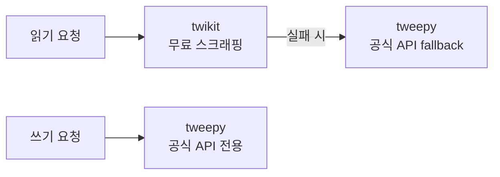
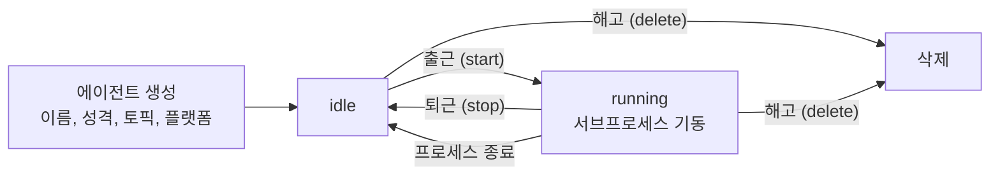
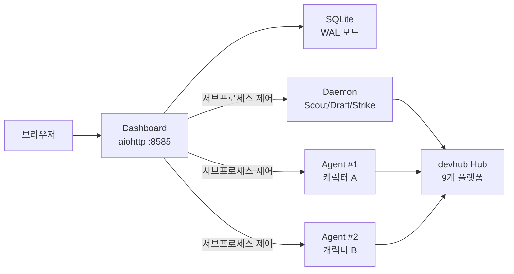

## 개요

[이전 글](/ai/agent/gwanjong-mcp-ai-social-agent-mcp-system-design-impl/)에서 gwanjong-mcp의 시스템 설계를 다뤘다. Scout/Draft/Strike 3단계 파이프라인, devhub-social 어댑터 레이어, mcp-pipeline 상태 관리가 핵심이었다.

시스템을 설계하는 것과 실제로 운영하는 것은 완전히 다른 문제다. 4개 플랫폼(Dev.to, Bluesky, Twitter, Reddit)으로 시작한 에이전트를 9개 플랫폼으로 확장하면서, 설계 단계에서 예상하지 못한 문제들을 대량으로 만났다.

- 플랫폼이 스팸으로 판정하여 계정을 제한하는 일이 반복됐다
- 같은 저자의 게시글에 여러 번 댓글을 달아 추적당했다
- 영어 게시글에 한글 댓글을 달아 문맥이 깨졌다
- 답글이 달려도 무시하고 일방적으로 댓글만 퍼뜨리니 효과가 없었다

이 글에서는 4개 → 9개 플랫폼 확장, 캠페인 기반 GTM 시스템 구축, 스팸 방지 방어 체계, 에이전트 캐릭터 시스템, 자동 대댓글까지 — 운영 과정에서 쌓인 실전 경험을 정리한다.

---

## 플랫폼 확장: 4개에서 9개로

### 새로 추가된 플랫폼

| 플랫폼 | 읽기 방식 | 쓰기 방식 | 특이점 |
|--------|----------|----------|--------|
| Mastodon | REST API | REST API | 멀티 인스턴스 지원 |
| Hacker News | Firebase + Algolia | 웹 스크래핑 | 공식 쓰기 API 없음 |
| Stack Overflow | Stack Exchange API v2.3 | Stack Exchange API | quota 관리 필요 |
| GitHub Discussions | GraphQL API | GraphQL mutation | 2단계 탐색 |
| Discourse | REST API | REST API | 멀티 인스턴스 병렬 검색 |

기존 4개 플랫폼도 확장과 함께 개선됐다. 특히 Twitter는 하이브리드 아키텍처로 전환했고, Bluesky는 facet 기반 URL 자동 링크를 추가했다.

### Hacker News: 공식 API 없는 플랫폼 다루기

Hacker News는 읽기는 Firebase API와 Algolia 검색을 제공하지만, 쓰기 API가 없다. 댓글/포스트 작성은 웹 스크래핑으로 구현해야 한다.

```python
async def _ensure_auth(self) -> None:
    """HN 로그인 후 쿠키를 캐시한다."""
    resp = await self._http.post(
        "https://news.ycombinator.com/login",
        data={"acct": self._username, "pw": self._password}
    )
    self._cookies = resp.cookies  # 'user' 쿠키

async def write_comment(self, post_id: str, body: str) -> PostResult:
    """댓글 작성 — HMAC 토큰을 페이지에서 추출한 뒤 POST."""
    page = await self._http.get(f"https://news.ycombinator.com/item?id={post_id}")
    hmac_token = self._extract_hmac(page.text)
    resp = await self._http.post(
        "https://news.ycombinator.com/comment",
        data={"parent": post_id, "text": body, "hmac": hmac_token}
    )
```

HMAC 토큰을 페이지에서 추출하는 과정이 핵심이다. HN은 댓글 폼에 숨겨진 HMAC 값을 포함하는데, 이를 먼저 가져와야 댓글 POST가 성공한다.

### Twitter 하이브리드 아키텍처

Twitter는 API 비용 문제로 하이브리드 구조를 채택했다.



- **읽기**: twikit(무료, 로그인 기반 스크래핑)을 우선 사용하고, 실패 시 tweepy(공식 API)로 자동 전환
- **쓰기**: tweepy 공식 API만 사용 (스크래핑 쓰기는 계정 정지 위험)

twikit은 `~/.devhub/twitter_cookies.json`에 쿠키를 캐시하여 재로그인을 최소화한다. 공식 API의 Bearer Token은 검색 전용으로 활용한다.

### 독립 트윗 방지

Twitter API의 함정이 하나 있다. reply로 보낸 트윗이 가끔 독립 트윗으로 발행되는 경우가 있다. 이렇게 되면 맥락 없는 이상한 트윗이 타임라인에 올라간다.

```python
async def write_comment(self, post_id: str, body: str) -> PostResult:
    tweet = await self._tweepy.create_tweet(
        text=body, in_reply_to_tweet_id=post_id
    )
    # reply가 실제로 됐는지 검증
    verify = await self._tweepy.get_tweet(
        tweet.data["id"], tweet_fields=["in_reply_to_user_id"]
    )
    if verify.data and not verify.data.in_reply_to_user_id:
        logger.warning("reply가 독립 트윗으로 발행됨 — 삭제")
        await self._tweepy.delete_tweet(tweet.data["id"])
        return PostResult(success=False, error="Reply posted as standalone")
```

발행 후 바로 검증하여, `in_reply_to_user_id`가 없으면 즉시 삭제한다. 방어적이지만 확실한 방법이다.

### Bluesky facet 기반 URL 링크

Bluesky(AT Protocol)는 텍스트 내 URL을 자동으로 링크로 만들어주지 않는다. facet이라는 byte offset 기반 어노테이션을 직접 만들어야 한다.

```python
def _extract_url_facets(text: str) -> list:
    url_pattern = re.compile(
        r"https?://[^\s]+|"
        r"(?<!\w)[\w.-]+\.(?:com|org|net|io|dev|app|xyz|me|co)(?:/[^\s]*)?"
    )
    facets = []
    encoded = text.encode("utf-8")
    for m in url_pattern.finditer(text):
        byte_start = len(text[:m.start()].encode("utf-8"))
        byte_end = len(text[:m.end()].encode("utf-8"))
        uri = m.group() if m.group().startswith("http") else f"https://{m.group()}"
        facets.append({
            "index": {"byteStart": byte_start, "byteEnd": byte_end},
            "features": [{"$type": "app.bsky.richtext.facet#link", "uri": uri}]
        })
    return facets
```

UTF-8 인코딩 후 byte offset을 계산하는 게 핵심이다. 한글이 포함된 텍스트에서 문자 인덱스와 바이트 인덱스가 다르기 때문에, `text[:m.start()].encode("utf-8")`으로 정확한 바이트 위치를 구한다. bare domain(`example.com`)도 `https://`를 자동으로 붙여서 링크화한다.

---

## 캠페인 기반 GTM 시스템

플랫폼이 9개로 늘어나자 "모든 곳에서 무작위로 댓글 달기"는 비효율적이었다. 특정 주제에 집중하고, KPI를 추적하고, 전환을 측정하는 **캠페인 시스템**을 도입했다.

### Campaign 모델

```python
@dataclass
class Campaign:
    id: str
    name: str
    objective: str       # awareness | engagement | conversion
    topics: list[str]    # 타겟 키워드
    platforms: list[str]  # 활동 플랫폼
    icp: str             # Ideal Customer Profile
    cta: str             # Call to Action
    kpi_target: dict     # {"comments": 50, "posts": 10, "conversions": 5}
    start_date: str
    end_date: str
    status: str          # active | paused | completed
```

캠페인을 생성하면 scout 단계에서 해당 topics과 platforms만 타겟팅한다. 여러 캠페인을 동시 운영할 수 있고, 각각 독립적인 KPI를 추적한다.

### UTM 자동 주입과 전환 추적

EventBus의 `strike.before` 이벤트에서 댓글/포스트 내 URL에 UTM 파라미터를 자동 주입한다.

```python
class ConversionTracker:
    async def _on_strike_before(self, event: Event):
        if not event.data.get("campaign_id"):
            return
        content = event.data["content"]
        campaign = self.storage.get_campaign(event.data["campaign_id"])
        # URL에 UTM 파라미터 주입
        content = self._inject_utm(content, campaign)
        event.data["content"] = content

    def _inject_utm(self, text: str, campaign: Campaign) -> str:
        for url in self._find_urls(text):
            if "utm_" in url:
                continue  # 기존 UTM 있으면 스킵
            sep = "&" if "?" in url else "?"
            utm = f"{sep}utm_source=gwanjong&utm_medium=social&utm_campaign={campaign.id}"
            text = text.replace(url, url + utm)
        return text
```

`strike.after`에서 발행 성공 시 conversions 테이블에 전환 이벤트를 기록한다. Dashboard에서 캠페인별 KPI 리포트를 조회할 수 있다.

---

## 스팸 방지 방어 체계

운영 초기에 가장 큰 문제는 **플랫폼의 스팸 판정**이었다. 에이전트가 열심히 활동하면 할수록 계정이 제한되거나 차단됐다. 다단계 방어 체계를 구축했다.

### 플랫폼별 Rate Limit 정책

```python
# policy.py — 9개 플랫폼 일일 한도
PLATFORM_LIMITS = {
    "devto":              {"comment": 5, "post": 1, "upvote": 5,  "min_interval": 300},
    "bluesky":            {"comment": 8, "post": 2, "upvote": 5,  "min_interval": 300},
    "twitter":            {"comment": 8, "post": 2, "upvote": 5,  "min_interval": 300},
    "reddit":             {"comment": 5, "post": 0, "upvote": 5,  "min_interval": 300},
    "github_discussions":  {"comment": 6, "post": 1, "upvote": 10, "min_interval": 300},
    "discourse":           {"comment": 6, "post": 1, "upvote": 10, "min_interval": 300},
    "mastodon":           {"comment": 8, "post": 2, "upvote": 10, "min_interval": 300},
    "hackernews":         {"comment": 5, "post": 1, "upvote": 10, "min_interval": 600},
    "stackoverflow":      {"comment": 5, "post": 1, "upvote": 10, "min_interval": 600},
}
```

HN과 Stack Overflow는 커뮤니티 감시가 엄격해서 최소 간격을 10분으로 설정했다. Reddit은 포스트 0으로 제한 — 댓글만 허용한다.

### 연속 실패 자동 차단

API 에러가 3회 연속 발생하면 해당 플랫폼을 24시간 자동 차단한다.

```python
CONSECUTIVE_FAIL_THRESHOLD = 3
PLATFORM_BAN_MINUTES = 60 * 24  # 24시간

class SafetyGuard:
    def __init__(self):
        self._consecutive_fails: dict[str, int] = {}
        self._platform_banned_until: dict[str, str] = {}

    async def _on_strike_failed(self, event: Event):
        platform = event.data["platform"]
        self._consecutive_fails[platform] = self._consecutive_fails.get(platform, 0) + 1
        if self._consecutive_fails[platform] >= CONSECUTIVE_FAIL_THRESHOLD:
            ban_until = datetime.utcnow() + timedelta(minutes=PLATFORM_BAN_MINUTES)
            self._platform_banned_until[platform] = ban_until.isoformat()

    async def _on_strike_before(self, event: Event):
        platform = event.data["platform"]
        banned = self._platform_banned_until.get(platform)
        if banned and datetime.utcnow().isoformat() < banned:
            raise Blocked(f"{platform} banned until {banned}")
```

플랫폼이 rate limit을 반환하거나 인증이 만료됐을 때, 무한 재시도 대신 빠르게 물러나는 전략이다. 성공 시에는 카운터가 리셋된다.

### 콘텐츠 품질 가드

LLM이 생성한 댓글이 "AI가 쓴 티"가 나면 스팸 판정 확률이 높아진다. 여러 단계의 콘텐츠 검증을 수행한다.

```python
# safety.py — AI 탐지 키워드
AI_WORDS = {"fascinating", "insightful", "game-changer", "groundbreaking", ...}
AI_OPENER_PATTERNS = [r"^this is amazing", r"^great (article|post|write-up)", ...]
COMPLIMENT_EXPERIENCE_QUESTION = re.compile(r"^.{0,50}(great|love|nice).+I.+(use|work|build).+\?")
```

- AI 단어 밀도 검사 (fascinating, insightful 등)
- AI 오프너 패턴 탐지 (^this is amazing, ^great article 등)
- 칭찬→경험→질문 공식 탐지 (LLM이 즐겨 쓰는 패턴)
- 플랫폼별 길이 제한 (Twitter 280자, Bluesky 300자)
- URL 과다 포함 시 self-promotion 판정

### 스팸 키워드 필터

scout 단계에서 수집된 게시글 중 스팸성 콘텐츠를 사전 필터링한다.

```python
_SPAM_KEYWORDS = {
    "whale", "token", "solana", "nft", "airdrop",
    ...,
    "miniature", "painting", "tabletop", "crisis protocol"
}
```

3개 이상 매칭 시 스팸으로 판정하여 스킵한다. 마지막 네 개 키워드(`miniature`, `painting`, `tabletop`, `crisis protocol`)는 재미있는 사례다. "Marvel Crisis Protocol"이라는 미니어처 게임이 MCP(Model Context Protocol)와 동명이의어라서, MCP 키워드로 검색하면 이 게임 관련 게시글이 대량으로 잡혔다.

---

## 저자 중복 댓글 방지

같은 저자의 게시글에 반복적으로 댓글을 달면 스토킹처럼 보인다. 이를 방지하는 메커니즘을 구축했다.

```python
# pipeline.py — scout 결과 필터링
async def _filter_by_author(self, scored_posts: list) -> list:
    # 최근 30일간 댓글 단 저자 목록
    recent_authors = self.storage.get_recent_authors(days=30)
    seen_authors: set[str] = set()
    filtered = []
    for post in scored_posts:
        if post.author in recent_authors:
            continue  # 이미 활동한 저자
        if post.author in seen_authors:
            continue  # 이번 배치에서 중복
        seen_authors.add(post.author)
        filtered.append(post)
    return filtered
```

actions 테이블의 `author` 컬럼에 댓글 대상 게시글의 저자를 기록하고, scout 시 최근 30일 내 이미 댓글을 단 저자의 게시글은 건너뛴다. 레거시 데이터(author 필드가 비어있던 시절)는 URL 기반 fallback으로 처리한다.

---

## 원문 언어 감지

초기에 영어 게시글에 한글 댓글을 다는 사고가 있었다. LLM 시스템 프롬프트에 언어 감지 지시를 추가하여 해결했다.

```python
# llm.py — 시스템 프롬프트 중 언어 섹션
LANGUAGE_INSTRUCTION = """
LANGUAGE:
Detect the language of the post title and body.
Write your {output_label} in the SAME language.
If the post is in English, write in English.
If in Korean, write in Korean.
Never mix languages unless the post does.
"""
```

별도의 언어 감지 모델을 쓰지 않고 LLM 자체의 능력에 위임한 방식이다. 실용적으로 충분히 동작한다.

---

## 에이전트 캐릭터 시스템

단일 에이전트가 모든 플랫폼에서 동일한 말투로 활동하면 자연스럽지 않다. **캐릭터 시스템**을 도입하여 여러 페르소나의 에이전트를 동시 운영할 수 있게 했다.

### 에이전트 라이프사이클



에이전트 생성 시 DiceBear 아바타 스타일과 시드를 지정하면 고유한 프로필 이미지가 생성된다. personality 필드에 캐릭터 설정을 넣으면 LLM이 해당 성격으로 댓글을 생성한다.

### 동시 실행 제한

```python
_MAX_CONCURRENT_AGENTS = 3
_AGENT_MEM_LIMIT_MB = 4096

async def start_agent(self, agent_id: str):
    running = sum(1 for a in self._agents.values() if a["status"] == "running")
    if running >= _MAX_CONCURRENT_AGENTS:
        raise HTTPError(429, "최대 동시 실행 에이전트 수 초과")
    # 메모리 제한 적용
    resource.setrlimit(resource.RLIMIT_AS, (_AGENT_MEM_LIMIT_MB * 1024 * 1024, -1))
```

서버 리소스를 보호하기 위해 동시 실행 에이전트는 3개로 제한하고, 각 에이전트 프로세스에 4GB 메모리 상한을 적용한다. 에이전트가 비정상 종료하면 모니터 태스크가 자동으로 상태를 idle로 복구한다.

### LLM에 personality 반영

```python
agent_personality = os.getenv("GWANJONG_AGENT_PERSONALITY", "")
if agent_personality:
    system_prompt += (
        f"\nCHARACTER: Your name is {agent_name}. "
        f"{agent_personality}. "
        f"Write in a way that reflects this personality."
    )
```

환경변수로 전달된 personality가 LLM 시스템 프롬프트에 반영된다. "신랄한 백엔드 개발자", "친절한 ML 엔지니어" 같은 캐릭터를 만들면, 같은 게시글에도 전혀 다른 톤의 댓글이 생성된다.

---

## 자동 대댓글

일방적으로 댓글만 퍼뜨리는 건 효과가 없다. 누군가 답글을 달았을 때 대화를 이어가야 engagement가 올라간다.

### 답글 감지

```python
class ReplyTracker:
    async def check_replies(self):
        """최근 댓글에 달린 답글을 감지한다."""
        recent_comments = self.storage.get_recent_comments()
        for comment in recent_comments:
            adapter = self.hub.get_adapter(comment.platform)
            replies = await adapter.get_comments(comment.post_id)
            for reply in replies:
                if reply.parent_id == comment.id and reply.author != self.username:
                    self.storage.add_reply(reply)  # UNIQUE 제약으로 중복 방지
                    await self.bus.emit("reply.detected", reply)
```

주기적으로 내가 단 댓글의 게시글을 다시 방문하여, 내 댓글에 달린 답글을 감지한다. SQLite의 UNIQUE 제약으로 같은 답글이 중복 처리되지 않도록 보장한다.

### 대댓글 생성

```python
async def _reply_to_reply(self, event: Event):
    reply = event.data
    # 원래 내 댓글 조회
    my_comment = self.storage.get_action(reply.parent_id)
    # LLM 컨텍스트 구성
    context = DraftContext(
        body_summary=f"내 댓글: {my_comment.content}\n@{reply.author}의 답글: {reply.body}"
    )
    # 대댓글 생성 및 발행
    response = await self.llm.draft(context)
    await self.pipeline.strike(platform=reply.platform, content=response)
```

원래 내 댓글과 상대방의 답글을 LLM에 함께 제공하여, 대화 맥락을 유지한 대댓글을 생성한다. 이 과정도 safety guard와 rate limit 정책을 동일하게 거친다.

---

## 운영 안정성 개선

### SQLite 동시 접근 문제

Dashboard(웹 서버)와 Daemon(에이전트 프로세스)이 같은 SQLite DB에 동시 접근하면 `database is locked` 에러가 발생한다. WAL(Write-Ahead Logging) 모드로 해결했다.

```python
conn.execute("PRAGMA journal_mode=WAL")
conn.execute("PRAGMA synchronous=NORMAL")
```

WAL 모드에서는 읽기와 쓰기가 동시에 가능하다. `synchronous=NORMAL`은 WAL 모드에서 안전한 수준이면서 성능을 높인다.

### 인덱스 9개 추가

Dashboard의 summary API가 느려지는 문제가 있었다. actions 테이블이 커지면서 COUNT 쿼리가 full scan을 돌았다.

```sql
CREATE INDEX idx_actions_platform_ts ON actions(platform, created_at);
CREATE INDEX idx_actions_post_url ON actions(post_url);
CREATE INDEX idx_actions_agent_id ON actions(agent_id);
CREATE INDEX idx_actions_author ON actions(author);
CREATE INDEX idx_seen_posts_platform ON seen_posts(platform);
CREATE INDEX idx_rate_log_platform_action_ts ON rate_log(platform, action, created_at);
CREATE INDEX idx_approval_queue_status ON approval_queue(status);
CREATE INDEX idx_replies_responded ON replies(responded);
CREATE INDEX idx_scout_runs_created ON scout_runs(created_at);
```

### N+1 쿼리 제거

Dashboard의 `get_summary()`가 플랫폼 9개 x 기간 3종(오늘/주간/전체) = 27개 COUNT 쿼리를 날리고 있었다. 단일 GROUP BY 배치 쿼리로 통합했다.

```python
# 수정 전: N+1
for platform in platforms:
    for period in ["today", "week", "all"]:
        count = db.execute(f"SELECT COUNT(*) FROM actions WHERE platform=? AND ...", (platform,))

# 수정 후: 단일 쿼리
stats = db.execute("""
    SELECT platform,
        SUM(CASE WHEN created_at >= ? THEN 1 ELSE 0 END) as today,
        SUM(CASE WHEN created_at >= ? THEN 1 ELSE 0 END) as week,
        COUNT(*) as total
    FROM actions GROUP BY platform
""")
```

7일 차트도 일별 개별 쿼리에서 `GROUP BY date(created_at), platform` 단일 쿼리로 통합했다.

---

## 운영 콘솔



운영 콘솔은 aiohttp 기반 SPA로, Daemon과 에이전트 프로세스를 웹에서 직접 제어한다. 주요 화면은 네 가지다.

- **Summary**: 플랫폼별 활동 통계, rate limit 잔여, 7일 차트, engagement 비율
- **Agents**: 에이전트 목록, 출근/퇴근, 실적, 캐릭터 설정
- **Campaigns**: 캠페인 CRUD, KPI 달성률, 전환 이벤트
- **Logs**: Daemon 실시간 로그 (최근 200줄)

Docker Compose로 daemon과 dashboard를 함께 배포한다. `gwanjong-data` named volume을 공유하여 SQLite DB가 컨테이너 간에 일관성을 유지한다.

---

## 회고

### 운영에서 배운 것

**스팸 방지는 기술보다 절제다.** 기술적으로 하루 100개 댓글을 달 수 있어도, 5개가 적절하다. 플랫폼마다 "자연스러운 활동량"의 기준이 다르고, 이를 초과하면 바로 제재가 온다.

**AI 콘텐츠 탐지는 패턴의 문제다.** "fascinating", "insightful" 같은 단어 자체가 문제가 아니라, LLM이 이 단어들을 특정 패턴(칭찬→경험→질문)으로 조합하는 것이 탐지 포인트다. 패턴을 깨뜨리는 것이 핵심이다.

**대화형 engagement가 일방적 댓글보다 효과적이다.** 자동 대댓글 기능 도입 후 engagement rate가 올라갔다. 일방적 댓글 10개보다 대화 2~3회가 실제 관계 형성에 훨씬 효과적이다.

### 현재 한계

- reply_settings가 restricted인 트윗은 아예 건너뛰므로, 인플루언서 게시글에는 접근이 안 된다
- Chronos Foundation Model처럼 HN의 HMAC 토큰 구조가 바뀌면 스크래핑이 깨질 수 있다
- 에이전트 캐릭터의 personality가 길어지면 LLM의 지시 따르기(instruction following) 품질이 떨어진다
