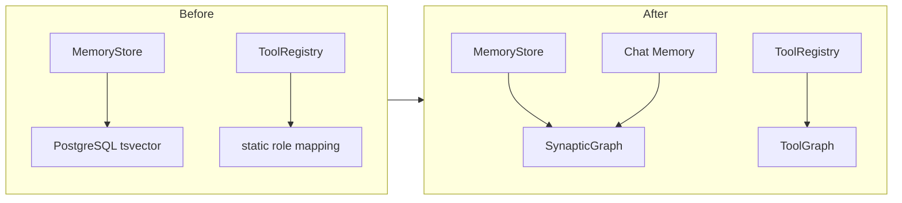

# AI 회사 자율운영 플랫폼에 synaptic-memory + graph-tool-call 통합기

## 배경: 왜 라이브러리를 도입했는가

Hive Corp은 AI 에이전트들이 자율적으로 회사를 운영하는 플랫폼이다. CEO(사용자)가 Matrix 채팅으로 지시하면, CTO 에이전트가 LLM으로 판단하고, Developer 에이전트가 코드를 작성하고, 스프린트를 돌리고, 성장 엔진이 조직을 최적화한다.

문제는 핵심 기능 두 가지를 처음부터 자체 구현하고 있었다는 점이다.

**1. 메모리 시스템** — PostgreSQL tsvector 기반 전문 검색. culture, rule, lesson 등 6가지 타입의 회사 기억을 저장하고, 에이전트에게 컨텍스트로 주입했다. 영어는 tsvector, 한국어는 LIKE fallback이라는 이원화된 검색 구조였다.

**2. 도구 레지스트리** — CTO, Developer, PM 등 역할별로 사용 가능한 도구를 하드코딩한 정적 매핑. `DEFAULT_ROLE_TOOLS`라는 dict에 역할→도구 목록을 수동으로 관리했다.

두 시스템 모두 동작은 했지만, 확장성에 한계가 있었다.

- 메모리 검색은 키워드 매칭 수준. 의미 기반 검색이나 시간 경과에 따른 기억 감쇠(decay) 같은 건 직접 구현해야 했다
- 도구 레지스트리는 에이전트가 늘어날수록 role mapping을 수동으로 관리해야 했다
- 대화 히스토리 기능이 아예 없었다. 매 턴 메시지 하나만 LLM에 보내고 이전 맥락을 잊었다

이미 만들어놓은 라이브러리 두 개가 있었다.

- [synaptic-memory](https://github.com/PlateerLab/synaptic-memory) — brain-inspired knowledge graph. Spreading activation, Hebbian learning, 4단계 memory consolidation(L0→L3), resonance 기반 검색
- [graph-tool-call](https://github.com/SonAIengine/graph-tool-call) — LLM 에이전트용 그래프 기반 도구 검색 엔진. BM25 + 그래프 확장 + 임베딩 하이브리드 검색

자체 구현을 제거하고 이 두 라이브러리로 교체하기로 했다.

---

## 아키텍처 변경 개요



변경 범위는 크게 세 영역이다.

| 영역 | Before | After |
|------|--------|-------|
| 회사 기억 저장/검색 | PostgreSQL + tsvector + LIKE | SynapticGraph (resonance 검색) |
| 도구 선택 | 하드코딩 role→tools dict | ToolGraph.retrieve() |
| 대화 메모리 | 없음 (매 턴 stateless) | SynapticGraph add/search/link |

52개 파일, +2,796 / -1,156 줄의 변경이 발생했다.

---

## 1. MemoryStore 교체: PostgreSQL → SynapticGraph

### 기존 구조

기존 `MemoryStore`는 PostgreSQL에 직접 SQL을 실행하는 구조였다.

```python
class MemoryStore:
    def __init__(self, db: Database) -> None:
        self._db = db

    async def search(self, query: str, *, limit: int = 10) -> list[Memory]:
        if has_korean:
            # tsvector는 한글 토크나이징 불가 -> LIKE fallback
            rows = await self._db.fetch_all(
                "SELECT * FROM memory WHERE content LIKE ?",
                (f"%{query}%", limit),
            )
        else:
            rows = await self._db.fetch_all(
                "SELECT * FROM memory WHERE content_tsv @@ plainto_tsquery('simple', ?)",
                (query, limit),
            )
```

영어/한국어 검색 분기, tsvector 트리거 관리, GIN 인덱스 — 모두 직접 관리해야 하는 코드였다.

### 교체 후 구조

생성자가 `Database` 대신 `SynapticGraph`를 받는다.

```python
from synaptic.graph import SynapticGraph
from synaptic.models import NodeKind

class MemoryStore:
    def __init__(self, graph: SynapticGraph) -> None:
        self._graph = graph

    async def save(self, memory: Memory) -> Memory:
        kind = _TYPE_TO_KIND.get(memory.type, NodeKind.CONCEPT)
        node = await self._graph.add(
            title=f"[{memory.type.value}] {memory.source or 'system'}",
            content=memory.content,
            kind=kind,
            tags=[memory.type.value, memory.source],
            source=memory.source,
        )
        memory.id = node.id
        return memory

    async def search(self, query: str, *, limit: int = 10) -> list[Memory]:
        result = await self._graph.search(query, limit=limit)
        return [_node_to_memory(a.node) for a in result.nodes]
```

핵심 변경 포인트:

- `save()` → `graph.add()` 한 줄. NodeKind 매핑으로 타입 보존
- `search()` → `graph.search()` 한 줄. 영어/한국어 분기 제거. SynapticGraph 내부에서 FTS + spreading activation + resonance scoring을 자동 처리
- `list_all()` / `list_by_type()` → `backend.list_nodes()`로 직접 조회
- `update()` → `backend.update_node()`. 삭제+재생성이 아닌 in-place 업데이트

### MemoryType ↔ NodeKind 매핑

Hive Corp의 6가지 기억 타입과 SynapticGraph의 NodeKind를 양방향으로 매핑했다.

```python
_TYPE_TO_KIND = {
    MemoryType.CULTURE: NodeKind.CONCEPT,
    MemoryType.RULE: NodeKind.RULE,
    MemoryType.LESSON: NodeKind.LESSON,
    MemoryType.PREFERENCE: NodeKind.CONCEPT,
    MemoryType.KNOWLEDGE: NodeKind.CONCEPT,
    MemoryType.DECISION: NodeKind.DECISION,
}
```

round-trip 시 원본 타입이 손실되는 문제가 있었다. CULTURE도 PREFERENCE도 모두 `CONCEPT`에 매핑되기 때문이다. 해결책으로 tags에 원본 MemoryType을 저장하고, 역변환 시 tags에서 먼저 복원을 시도한다.

```python
def _node_to_memory(node: object) -> Memory:
    tags = list[str](node.tags)
    mem_type = _KIND_TO_TYPE.get(node.kind, MemoryType.KNOWLEDGE)
    for tag in tags:
        try:
            mem_type = MemoryType(tag)
            break
        except ValueError:
            continue
    return Memory(id=node.id, type=mem_type, content=node.content, ...)
```

### schema.sql에서 memory 테이블 제거

PostgreSQL의 memory 테이블, tsvector 컬럼, GIN 인덱스, 트리거 함수를 모두 삭제했다. SynapticGraph가 자체 SQLite 파일(`.hive/knowledge.db`)로 관리한다.

```sql
-- 삭제된 코드
CREATE TABLE IF NOT EXISTS memory (...);
ALTER TABLE memory ADD COLUMN IF NOT EXISTS content_tsv tsvector;
CREATE INDEX IF NOT EXISTS idx_memory_fts ON memory USING GIN(content_tsv);
CREATE OR REPLACE FUNCTION memory_tsv_trigger() RETURNS trigger AS $$ ... $$;
```

### Optimizer의 메모리 아카이빙

기존에는 SQL DELETE로 오래된 기억을 직접 삭제했다.

```python
# Before
cursor = await self._db.execute(
    f"DELETE FROM memory WHERE type IN (...) AND created_at < ?",
    (*archivable_types, cutoff),
)
```

교체 후에는 SynapticGraph의 내장 기능을 사용한다.

```python
# After
async def archive_old_memories(self) -> int:
    graph = self._memory.graph
    await graph.consolidate()  # L0→L1→L2→L3 승격
    decayed = await graph.decay()  # vitality 감쇠
    pruned = await graph.prune()  # 약한 edge 정리
    return decayed + pruned
```

consolidate는 자주 접근되는 기억을 상위 레벨로 승격시키고, decay는 오래 접근 안 된 기억의 vitality를 낮추고, prune은 약한 연결을 정리한다. 직접 삭제 로직을 구현할 필요가 없다.

---

## 2. ToolRegistry 교체: static dict → ToolGraph

### 기존 구조

역할별로 사용 가능한 도구를 하드코딩했다.

```python
DEFAULT_ROLE_TOOLS = {
    "CTO": ["web_search", "web_fetch", "file_read", "shell_exec", "knowledge_search"],
    "Developer": ["web_search", "web_fetch", "file_read", "file_write", "shell_exec", ...],
    "PM": ["web_search", "web_fetch", "knowledge_search"],
    "*": ["web_search", "web_fetch", "knowledge_search"],
}
```

새 도구가 추가되면 이 dict를 수동으로 업데이트해야 했고, 역할이 추가되면 매핑도 추가해야 했다.

### 교체 후 구조

graph-tool-call의 `ToolGraph`가 도구 간 관계를 분석하고, query 기반으로 관련 도구를 자동 선별한다.

```python
from graph_tool_call import ToolGraph

class ToolRegistry:
    def __init__(self, tools: dict[str, Tool]) -> None:
        self._tools = tools
        self._graph = ToolGraph()
        openai_tools = [
            {
                "type": "function",
                "function": {
                    "name": tool.name,
                    "description": tool.description,
                    "parameters": tool.input_schema(),
                },
            }
            for tool in tools.values()
        ]
        if openai_tools:
            self._graph.add_tools(openai_tools)
```

생성 시 모든 builtin 도구를 OpenAI function format으로 변환하여 ToolGraph에 등록한다. 이후 역할이나 태스크 설명으로 검색하면 관련 도구만 반환한다.

```python
def get_tools_for_role(self, role: str) -> list[Tool]:
    results = self._graph.retrieve(role, top_k=len(self._tools))
    found = [self._tools[r.name] for r in results if r.name in self._tools]
    return found or list(self._tools.values())

def retrieve_for_task(self, query: str, *, top_k: int = 5) -> list[Tool]:
    results = self._graph.retrieve(query, top_k=top_k)
    return [self._tools[r.name] for r in results if r.name in self._tools]
```

`retrieve_for_task`는 태스크 설명을 기반으로 상위 k개 도구만 선별한다. 현재는 builtin 도구가 6~9개라서 효과가 크지 않지만, 외부 API 도구가 추가되면 token 절약 효과가 커진다. ToolGraph는 BM25 + 그래프 확장으로 "cancel my order"라는 query에 `cancelOrder`뿐 아니라 `listOrders → getOrder → processRefund` 워크플로우 체인까지 찾아낸다.

---

## 3. 대화 메모리: SynapticGraph로 CEO↔CTO 맥락 유지

가장 큰 기능 추가다. 기존에는 매 턴 메시지 하나만 LLM에 보내는 stateless 구조였다. "아까 보낸 문서 요약해줘"라고 하면 CTO가 "무슨 문서요?"라고 답하는 상황이었다.

### 구현

별도의 대화 저장소를 만들지 않고, 이미 통합한 SynapticGraph를 그대로 활용했다.

**저장**: 매 턴 CEO 메시지와 CTO 응답을 각각 노드로 저장하고, `CAUSED` edge로 연결한다.

```python
async def _save_chat_turn(graph, user_msg, assistant_msg, room):
    ceo_node = await graph.add(
        title="CEO", content=user_msg,
        kind=NodeKind.ENTITY, tags=["chat", room], source="CEO",
    )
    cto_node = await graph.add(
        title="CTO", content=assistant_msg,
        kind=NodeKind.ENTITY, tags=["chat", room], source="CTO",
    )
    await graph.link(ceo_node.id, cto_node.id, kind=EdgeKind.CAUSED)
```

**검색**: 다음 턴에 현재 메시지로 SynapticGraph를 검색하여 관련 대화 히스토리를 가져온다.

```python
async def _build_chat_history(graph, message, room):
    result = await graph.search(message, limit=20)
    history = []
    for activated in result.nodes:
        node = activated.node
        if "chat" not in node.tags:
            continue
        role = "user" if node.title == "CEO" else "assistant"
        history.append({"role": role, "content": node.content})
    return history
```

**주입**: 검색된 히스토리를 Anthropic messages API의 대화 히스토리로 직접 넣는다.

```python
msgs: list[MessageParam] = [
    MessageParam(role=h["role"], content=h["content"])
    for h in history_msgs
]
msgs.append({"role": "user", "content": f"CEO: {message}"})
```

이 구조의 장점은 단순한 최근 N개 메시지 슬라이딩 윈도우가 아니라, **의미 기반으로 관련 대화를 검색**한다는 것이다. 1시간 전에 한 논의라도 현재 질문과 관련이 있으면 컨텍스트에 포함된다. SynapticGraph의 spreading activation이 연결된 노드까지 탐색하기 때문에, CEO가 "아까 그 건" 이라고 말하면 직접 매칭되지 않더라도 연결된 대화를 찾아올 수 있다.

---

## 4. ResonanceAssembler 단순화

기존에는 SynapticGraph가 비어있을 때 MemoryStore(PostgreSQL)로 fallback하는 이중 구조였다.

```python
# Before
class ResonanceAssembler:
    def __init__(self, graph, legacy_memory=None):
        self._graph = graph
        self._legacy = legacy_memory

    async def assemble(self, agent_role, task_title="", *, max_items=20):
        result = await self._graph.search(query, limit=max_items)
        if result.nodes:
            return "## Company Knowledge\n" + ...
        # Fallback to legacy memory
        if self._legacy is not None:
            memories = await self._legacy.get_context_for_agent(...)
            return "## Company Memory\n" + ...
```

MemoryStore 자체가 SynapticGraph를 사용하게 되면서 fallback이 불필요해졌다.

```python
# After
class ResonanceAssembler:
    def __init__(self, graph: SynapticGraph) -> None:
        self._graph = graph

    async def assemble(self, agent_role, task_title="", *, max_items=20):
        result = await self._graph.search(query, limit=max_items)
        if not result.nodes:
            return ""
        lines = [f"- [{n.node.kind}] {n.node.title}: {n.node.content[:300]}"
                 for n in result.nodes]
        return "## Company Knowledge\n" + "\n".join(lines)
```

생성자 인자가 2개에서 1개로 줄었고, 전체 코드가 절반으로 줄었다.

---

## 5. 에이전트 컨텍스트 주입 변경

에이전트에게 시스템 프롬프트와 함께 회사 기억을 주입하는 `get_context_for_agent`도 변경했다. 기존에는 SQL로 culture/rule/preference를 항상 조회하고, 나머지는 키워드 검색했다.

```python
# After
async def get_context_for_agent(self, agent_role, *, max_items=20):
    # 1. 공통 기억 (culture + rule + preference) - backend 직접 조회
    shared = []
    for kind in (NodeKind.RULE,):
        nodes = await self._graph.backend.list_nodes(kind=kind, limit=50)
        shared.extend(_node_to_memory(n) for n in nodes)
    # CONCEPT 중 culture/preference 태그가 있는 것도 포함
    concept_nodes = await self._graph.backend.list_nodes(kind=NodeKind.CONCEPT, limit=50)
    shared.extend(
        _node_to_memory(n) for n in concept_nodes
        if any(t in ("culture", "preference") for t in n.tags)
    )
    # 2. role 관련 기억 - graph.search()
    remaining = max_items - len(shared)
    if remaining > 0:
        result = await self._graph.search(agent_role, limit=remaining)
        shared_ids = {m.id for m in shared}
        shared.extend(
            _node_to_memory(a.node) for a in result.nodes
            if a.node.id not in shared_ids
        )
    return shared[:max_items]
```

culture/rule 같은 회사 전체 적용 기억은 `backend.list_nodes()`로 확실히 포함시키고, role 관련 기억은 `graph.search()`의 resonance 기반 검색으로 가져온다.

---

## 트러블슈팅

### ToolGraph에 AsyncMock이 안 먹는 문제

테스트에서 `AsyncMock()`으로 도구를 만들면 `input_schema()` 호출 시 coroutine이 반환되어 ToolGraph 내부에서 `dict.get()` 호출 시 에러가 발생했다.

```
AttributeError: 'coroutine' object has no attribute 'get'
```

`input_schema()`는 sync 호출이므로 `MagicMock`을 사용하고, `run()`만 `AsyncMock`으로 분리했다.

```python
def _make_mock_tool(name, description="A tool", schema=None):
    tool = MagicMock()
    tool.name = name
    tool.description = description
    tool.input_schema = MagicMock(return_value=schema or {"type": "object", "properties": {}})
    tool.run = AsyncMock()
    return tool
```

### search("*")가 아무것도 반환 안 하는 문제

`list_all()`을 `graph.search("*")`로 구현했더니 결과가 0건이었다. SynapticGraph의 FTS 엔진이 `*`를 와일드카드로 처리하지 않기 때문이다.

`backend.list_nodes()`를 직접 호출하는 것으로 변경했다.

```python
async def list_all(self) -> list[Memory]:
    nodes = await self._graph.backend.list_nodes(limit=200)
    return [_node_to_memory(n) for n in nodes]
```

### TestClient와 asyncpg event loop 충돌

FastAPI의 `TestClient`(sync)를 사용하는 views 테스트에서 asyncpg connection이 다른 event loop에 바인딩되어 `RuntimeError: Future attached to a different loop` 에러가 발생했다.

`TestClient` 대신 `httpx.AsyncClient` + `ASGITransport`로 전환하여 같은 event loop에서 동작하도록 했다.

```python
@pytest.fixture
async def client(view_db):
    transport = httpx.ASGITransport(app=_test_app())
    return httpx.AsyncClient(transport=transport, base_url="http://test")
```

---

## 결과

### 제거된 코드

- PostgreSQL memory 테이블 + tsvector 트리거 + GIN 인덱스
- `DEFAULT_ROLE_TOOLS` 정적 role 매핑
- `ResonanceAssembler`의 legacy fallback
- `StoreKnowledgeTool`의 MemoryStore fallback
- `Optimizer.archive_old_memories()`의 SQL DELETE 로직

### 추가된 기능

- 대화 메모리 (SynapticGraph add/search/link)
- 태스크 기반 도구 선택 (`retrieve_for_task`)
- Memory consolidation (L0→L3 자동 승격)
- Vitality decay + edge pruning (자동 기억 관리)
- Hebbian learning 기반 연결 강화 (자주 함께 활성화되는 기억이 더 강하게 연결)

### 수치

- 변경 파일: 52개
- 코드: +2,796 / -1,156 줄
- 라이브러리 의존성: 2개 추가 (synaptic-memory, graph-tool-call)
- 자체 구현 대비 코드량: MemoryStore 140줄 → 130줄 (유사하지만 기능 3배), ToolRegistry 63줄 → 85줄 (지능형 검색 추가)
- 테스트: 101개 관련 테스트 통과

자체 구현을 고집하지 않고 검증된 라이브러리를 활용하면, 핵심 기능 개발에 집중할 수 있다. synaptic-memory의 consolidation이나 graph-tool-call의 workflow chain 같은 고급 기능은 직접 구현했으면 몇 주는 걸렸을 것이다. 라이브러리의 `add`, `search`, `link` 세 메서드만으로 대화 메모리, 회사 기억, 도구 검색이 모두 해결되었다.
