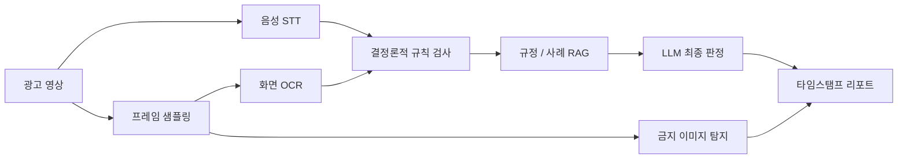
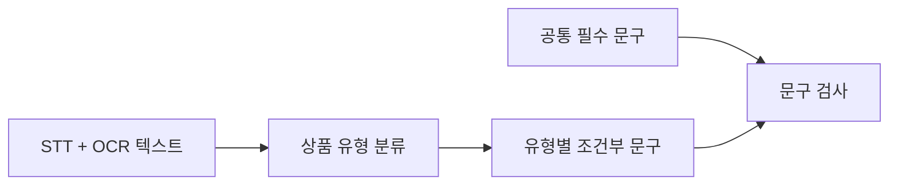
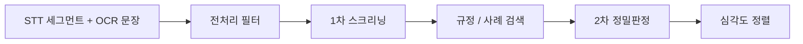

## 공개 범위

이 글은 보험 광고 영상 심의 자동화 POC를 공개 가능한 범위로 정리한 기록이다. 실제 규정 원문 파일, 내부 매뉴얼, 서버 주소, 계정, 테스트 영상 원본, 고객사 식별 정보는 포함하지 않는다.

또한 이 시스템은 법적 판단을 자동으로 확정하는 도구가 아니다. 목표는 사람이 심의할 때 놓치기 쉬운 장면과 문장을 먼저 찾아주고, 왜 의심되는지 근거를 붙여주는 QA 파이프라인이다.

## 영상 광고는 한 장면만 봐서는 안 된다

보험 광고는 단순한 이미지 한 장이 아니다. 유튜브나 숏폼 영상 안에는 음성 설명, 화면 자막, 고지 카드, 하단 고정 문구, 상품 설명 장면, 썸네일성 이미지가 섞여 있다.

사람이 볼 때도 놓치기 쉬운 항목이 많다.

- 필수 안내 문구가 화면에 나왔는가
- 너무 짧게 나오지는 않았는가
- 10분이 넘는 영상에서 처음과 마지막에 모두 노출됐는가
- 화면 하단에 고정 노출됐는가
- 음성으로도 안내했는가
- 과장, 비방, 절판마케팅 같은 금지표현이 있는가
- 지폐, 동전, 로고처럼 금지될 수 있는 이미지가 들어갔는가

초기 목표는 단순했다. 광고 영상을 넣으면 위반 의심 타임스탬프와 근거를 리포트로 뽑는다.

하지만 만들면서 곧 알게 됐다. 이 문제는 "LLM에게 영상 내용을 요약해 달라"로 풀 수 있는 문제가 아니었다. 규정은 세밀하고, OCR은 틀리고, STT는 보험 용어를 자주 망가뜨리고, 과거 사례만 보면 규정에 없는 기준을 만들어낼 수 있었다.

글에서 쓰는 도구를 쉽게 풀면 이렇다.

- OCR은 화면 속 글자를 읽는 기술이다.
- STT는 음성을 글자로 바꾸는 기술이다.
- RAG는 규정 문서와 과거 사례를 검색해서 LLM에게 근거로 붙여주는 방식이다. 쉽게 말해 "답하기 전에 관련 자료부터 찾아보게 하는 구조"다.
- 객체 탐지는 영상 프레임 안에서 지폐, 동전, 로고 같은 물체를 찾는 기술이다.
- LLM 판정은 앞 단계가 모은 근거를 보고 애매한 항목을 해석하는 단계다.

그래서 파이프라인을 여러 단계로 나눴다.



핵심 원칙은 하나였다. LLM은 모든 것을 혼자 판단하지 않는다. 먼저 규칙과 데이터로 좁히고, 애매한 항목만 근거와 함께 LLM에 넘긴다. 그래야 결과가 "모델이 그렇게 말했다"가 아니라 "이 장면, 이 문구, 이 규정 때문에 의심된다"로 남는다.

## 1단계: 영상에서 시간축이 있는 텍스트를 만든다

먼저 영상에서 두 종류의 텍스트를 뽑았다.

- 음성: Whisper 기반 STT
- 화면: 일정 간격으로 프레임을 뽑고 PaddleOCR로 자막 인식

여기서 중요한 것은 텍스트 자체보다 시간축이다. "어떤 문구가 있었는가"만으로는 부족하다. 심의에서는 "몇 초 동안", "어느 위치에", "몇 번" 나왔는지도 봐야 한다.

초기에는 2초 간격으로 프레임을 샘플링했다. 그런데 이 방식에는 원리적 결함이 있었다. 규정 최소 노출 시간이 2초 또는 4초인데, 샘플링 간격도 2초면 측정 해상도가 규정 최소값과 같아진다. 3초 노출된 문구가 타이밍에 따라 4초처럼 계산될 수 있다.

그래서 프레임 간격을 2초에서 0.5초로 줄였다.

| 항목 | 2초 간격 | 0.5초 간격 |
| --- | ---: | ---: |
| 7분 영상 프레임 수 | 208장 | 831장 |
| 14분 영상 프레임 수 | 428장 | 1,712장 |
| OCR 시간 증가 | 기준 | 약 3.9배 |
| 노출 시간 오차 | 최대 1.5초 확인 | 더 촘촘하게 측정 |

비용은 늘었지만 감당 가능한 수준이었다. 7분 영상 전체 처리는 여전히 영상 길이보다 훨씬 짧았다. 심의 도구에서는 빠른 오답보다 조금 느린 정답 후보가 낫다.

## 2단계: 모든 문구를 무조건 요구하면 오탐이 난다

처음에는 필수 안내 문구 목록을 코드에 넣고, 영상 OCR 텍스트에서 유사한 문구가 있는지 검사했다.

```text
광고 영상
  -> OCR 텍스트
  -> 필수 문구 목록과 유사도 비교
  -> 기준 이하이면 FAIL
```

이 방식은 공통 문구에는 잘 맞았다. 문제는 상품 유형별 조건부 문구였다.

예를 들어 어떤 문구는 변액보험 광고에서만 필요하고, 어떤 문구는 태아보험 광고에서만 필요하다. 이걸 모든 광고에 일괄 적용하면 실손보험 영상에 변액보험용 문구를 요구하는 식의 오탐이 난다.

그래서 먼저 광고의 상품 유형을 분류하고, 그 유형에 필요한 문구만 검사하도록 바꿨다.



이 변경의 효과는 좋았다. 무관한 문구를 요구하던 오탐이 사라졌고, 그 자리에 실제 상품 유형에 맞는 위반 의심 항목이 올라왔다. 오탐을 줄이면 검사가 약해지는 것이 아니라, 진짜 봐야 할 항목이 더 선명해진다.

## 3단계: 사례 RAG만 쓰면 기준이 잘못 귀납된다

초기 RAG는 과거 심의 사례를 먼저 색인했다. POC에서 사용한 심의 사례 9,090건을 임베딩해서 Qdrant에 넣고, 유사 사례를 찾아 LLM 판정에 붙였다. 여기서 임베딩은 문장을 숫자 형태로 바꿔 비슷한 문장을 찾기 쉽게 만드는 작업이고, Qdrant는 그런 벡터를 검색하는 데이터베이스다.

이 자체는 효과가 있었다. 어떤 문구가 과거에 어떻게 지적됐는지 보여주면 LLM 판정이 더 실무 기준에 가까워졌다. 실제로 규정 문구만 줬을 때는 통과로 보던 항목이, 유사 사례를 함께 주자 위반 의심으로 바뀐 케이스도 있었다.

하지만 곧 반대 문제가 나왔다.

사례만 보면 LLM이 "과거 사례에서 문구 변형이 지적됐다"는 패턴을 너무 강하게 배운다. 그런데 규정 원문에는 상품 종류와 매체 특성에 따라 본질적 의미를 해치지 않는 범위에서 변형 가능한 항목도 있었다.

즉 사례는 해석 예시이고, 1차 기준은 규정 원문이어야 했다.

그래서 RAG 컬렉션을 둘로 나눴다.

| 컬렉션 | 내용 | 역할 |
| --- | --- | --- |
| 규정 원문 | 기준 문서를 잘게 나눈 조각 | 판정의 1차 근거 |
| 과거 심의 사례 | POC에서 사용한 사례 9,090건 | 해석 예시 |

LLM 프롬프트에도 이 우선순위를 명시했다.

```text
규정 원문을 1차 근거로 본다.
과거 사례는 해석 예시로만 사용한다.
규정과 사례가 충돌하면 규정이 우선한다.
```

이후 판정이 더 안정됐다. "사례에서 자주 보인 패턴"과 "규정이 실제로 요구하는 기준"을 분리했기 때문이다.

## 4단계: OCR 교정 대신 다중 프레임 합의를 썼다

영상 OCR은 같은 자막도 프레임마다 다르게 읽는다. 한 프레임에서는 맞게 읽고, 다른 프레임에서는 한두 글자가 깨진다. 사람 눈에는 같은 자막인데, 기계가 읽은 결과는 매번 조금씩 달라질 수 있다.

처음에는 LLM으로 OCR 후처리를 할까 생각했다. 하지만 심의에서는 이것이 위험하다. LLM이 실제 영상의 오타까지 알아서 고쳐버리면, "문구가 정확히 표시됐는가"를 검사할 수 없게 된다.

그래서 교정이 아니라 합의를 썼다.

같은 문구가 여러 프레임에 반복 노출되면, 각 프레임에서 읽힌 문자열을 모아 문자 단위 다수결을 낸다. 중요한 것은 최종 문자열만이 아니라 합의율이다.

```text
프레임 1: 계약체결에 따른 이익 또는 손실은 ...
프레임 2: 계약체결에 따른 이익 또는 손실은 ...
프레임 3: 계약체결에 따른 이의 또는 손실은 ...

합의 결과: 계약체결에 따른 이익 또는 손실은 ...
합의율: 대부분의 위치에서 높음
```

합의율이 높으면 실제 화면 문구로 신뢰한다. 특정 글자만 낮으면 OCR 노이즈로 본다. 이렇게 하면 LLM이 마음대로 문장을 고치는 문제를 피하면서도, 단일 프레임 OCR 오류에 흔들리지 않는다.

## 5단계: 형식 요건은 위치와 시간으로 봐야 한다

필수 문구가 존재하는지만 보면 부족하다. 보험 광고 규정은 문구의 크기, 노출 시간, 노출 횟수, 위치까지 요구한다.

OCR은 텍스트뿐 아니라 글자가 화면 어디에 있는지도 준다. 이 위치 상자를 개발 쪽에서는 bbox라고 부른다. 처음에는 이 위치 정보를 저장만 하고 버리고 있었다. 이후에는 위치 정보를 판정에 사용했다.

검사한 항목은 다음과 같다.

- 폰트 크기: 영상 세로 길이 대비 일정 비율 이상인가
- 노출 시간: 영상 길이에 따라 요구 시간 이상인가
- 노출 횟수: 긴 영상에서 2회 이상 노출됐는가
- 위치: 상시 자막이 화면 하단에 있는가
- 고정성: 자막 위치가 크게 흔들리지 않는가

여기서 애매했던 부분은 카드형 고지와 상시 자막 구분이었다. 영상 초반이나 마지막에 전체화면 고지 카드가 나오면, 그 문구는 화면 중앙이나 상단에도 있을 수 있다. 이걸 하단 고정 자막으로 착각하면 오탐이 난다.

처음에는 "짧게 나오면 카드"라는 규칙만 썼지만 부족했다. 결국 같은 시간대에 여러 필수 문구가 함께 노출되는지를 보고 카드형 고지를 구분했다.

이 과정에서 순서 의존 버그도 나왔다. 같은 루프 안에서 다른 문구의 판정 결과를 참조했더니, 아직 처리되지 않은 문구는 값이 없었다. 같은 카드에 속한 문구인데도 처리 순서에 따라 동시 노출 수가 1, 2, 3, 4로 증가했다. 위치 판정을 별도 루프로 분리해서 해결했다.

이건 작은 버그처럼 보이지만, 컴플라이언스 도구에서는 중요하다. 같은 입력을 넣었는데 처리 순서에 따라 결과가 바뀌면 신뢰할 수 없다.

## 6단계: 금지표현은 스크리닝과 정밀판정을 나눴다

필수 문구 검사는 형식 요건에 가깝다. 하지만 광고 심의에는 내용 요건도 있다. 과장 표현, 비방 표현, 근거 없는 비교, 절판마케팅 같은 항목이다.

모든 문장을 LLM으로 정밀판정하면 비용이 크고 결과도 산만해진다. 그래서 2단계로 나눴다.



전처리에서 제거한 것도 많다.

- 이미 필수 고지 문구로 검증한 텍스트
- OCR이 프레임마다 조금씩 달라 생긴 중복 문장
- STT 품질 점수가 낮아 의미가 깨진 문장
- 너무 짧아 판단하기 어려운 조각 텍스트

실측에서 이 전처리가 중요했다. 법정 고지 문구가 금지표현으로 오판되거나, STT가 깨진 단어를 실제 회사 비방처럼 해석하는 케이스가 있었기 때문이다.

한 샘플에서는 검토 대상이 295건에서 175건으로 줄었고, 다른 샘플에서는 747건 이상에서 181건으로 줄었다. 사람이 볼 리포트라면 이 차이가 크다. 700건짜리 리포트는 사실상 읽지 않는다.

## 7단계: 금지 이미지는 모델 점수만 보면 안 됐다

금지 이미지 탐지에는 Grounding DINO를 붙였다. 찾고 싶은 것은 지폐, 동전, 금화, 통화 기호, 로고처럼 규정상 문제가 될 수 있는 시각 요소였다.

초기 실험에서 모델 신뢰도 점수만으로는 부족했다. 전체 화면을 크게 덮은 오탐이 실제 로고보다 더 높은 점수를 받는 경우가 있었다. 반대로 아주 작은 하단 자막 일부를 금화로 오인하는 경우도 있었다.

그래서 위치 상자의 면적 필터를 같이 걸었다.

| 문제 | 대응 |
| --- | --- |
| 화면 대부분을 덮는 큰 박스 오탐 | 최대 면적 비율 제한 |
| 자막 일부를 금화로 보는 작은 박스 오탐 | 최소 면적 비율 제한 |
| 같은 위치 이미지 반복 탐지 | 위치 기준으로 묶어 리포트 |
| OCR과 탐지 라이브러리 충돌 | 별도 프로세스에서 탐지 실행 |

이후 후보가 100건 이상에서 18건 수준으로 줄었다. 여기서 중요한 것은 모델을 바꾼 것이 아니라 후처리 기준을 현실에 맞게 넣은 것이다. 비전 모델의 점수는 "심의상 의미 있는 객체인가"와 같지 않다.

## 운영 중 발견한 함정들

### STT 프롬프트 바이어싱은 기각했다

보험 용어 STT 품질이 완벽하지 않았다. 그래서 Whisper prompt에 보험 용어 사전을 넣어 보았다. 짧은 40초 샘플에서는 좋아 보였다. 오인식되던 단어가 제대로 바뀌었다.

하지만 전체 영상에서는 역효과가 났다. 프롬프트가 직전 발화의 연속처럼 취급되면서 초반 발화가 누락됐고, 세그먼트 수와 텍스트 길이가 크게 줄었다. 용어 몇 개를 고치는 것보다 발화를 통째로 놓치는 것이 훨씬 위험했다.

그래서 기본값은 비활성화했다. 컴플라이언스 도구에서는 "조금 틀리게 듣는 것"보다 "아예 못 듣는 것"이 더 치명적이다.

### 문서 파서 품질이 RAG 품질을 결정했다

처음에는 자체 스크립트로 규정 문서를 텍스트화했다. 그런데 일부 PDF, PPTX, XLSX가 아예 색인되지 않았고, HWP 표도 제대로 복원되지 않았다. 문제는 LLM이 아니라 입력 문서 품질이었다.

이후 XGEN 표준 파서를 빌려 규정 문서를 다시 색인했다. 표를 보존하고, 문서 출처와 페이지 정보는 별도 메타데이터로 관리하고, 검색에 직접 쓰는 본문만 임베딩하도록 조정했다.

특히 문서를 나눈 모든 조각에 문서 메타데이터 블록이 반복되는 문제가 있었다. 본문보다 메타데이터가 더 길면 검색이 작성자, 작성일 같은 정보에 끌려간다. 검색 품질을 위해 메타데이터는 별도로 보관하고 본문에서 제거했다.

### 임시 파일도 재현성 버그가 된다

영상 처리 파이프라인은 중간 산출물이 많다. 프레임 이미지, STT 결과, OCR JSON, 리포트가 생긴다.

한 번은 이전 영상에서 추출한 프레임이 남아 새 영상 처리 결과에 섞였다. 새 영상이 이전 영상보다 짧으면 오래된 프레임이 그대로 남아 있기 때문이다. 실행 시작 시 작업 디렉터리를 비우도록 해서 해결했다.

재현성은 거창한 실험 관리에서만 깨지는 것이 아니다. 남은 파일 하나로도 깨진다.

## 결과

POC 기준으로 확인한 결과는 다음과 같다.

| 항목 | 결과 |
| --- | --- |
| 과거 심의 사례 색인 | 9,090건 |
| 규정 원문 색인 | 문서 조각 431개, 표가 포함된 조각 315개 |
| OCR 성능 | 208프레임 기준 CPU 32분 19초에서 GPU 23초 수준까지 개선 |
| 샘플링 해상도 | 2초에서 0.5초로 변경, 노출 시간 오차 최대 1.5초 확인 |
| 금지표현 후보 감축 | 한 샘플에서 295건에서 175건으로 감소 |
| 금지 이미지 후보 감축 | 100건 이상에서 18건 수준으로 감소 |
| 별도 12개 사례 점검 | 위반 샘플 8건은 모두 위반 의심으로 잡았고, 전체 12건 중 10건이 기대 판정과 일치 |

이 수치를 최종 제품 성능으로 보면 안 된다. 샘플 수가 작고, 테스트 데이터도 제한적이다. 실무자 피드백으로 기준을 더 다듬어야 한다. 그래도 POC로는 충분한 방향성을 보여줬다.

가장 중요한 변화는 "AI가 광고를 알아서 심의한다"가 아니었다. 사람이 검토해야 할 장면과 문장을 줄이고, 각 항목에 규정 원문과 유사 사례 근거를 붙일 수 있게 된 것이다.

## 남은 과제

아직 제품이라고 부르기에는 부족한 부분이 남아 있다.

- STT 용어 오인식은 근본 해결이 필요하다.
- LLM 상품 유형 분류는 같은 입력에서 항상 같은 결과가 나오도록 결정성을 높여야 한다.
- 금지표현 정밀도는 실무자가 검토 가능한 건수까지 더 줄여야 한다.
- 규칙 문구는 코드 하드코딩이 아니라 `rule_id`, `source_ref`, `applies_to`, `check_type`을 가진 정책 데이터로 옮겨야 한다.
- 영상 심의 날짜와 규정 시행일을 맞추는 시점 필터가 필요하다.
- 썸네일과 제목 검증은 영상 파일만으로는 부족하므로 입력 스키마를 확장해야 한다.

특히 정책 데이터화가 중요하다. 컴플라이언스 시스템에서 규칙이 코드에 박혀 있으면 변경 추적과 설명 가능성이 약해진다. 어떤 규칙이 어느 문서의 어느 조항에서 왔는지, 언제부터 적용되는지, 어떤 상품에만 적용되는지를 데이터로 관리해야 한다.

## 정리

이번 POC에서 얻은 결론은 단순하다.

보험 광고 영상 심의는 멀티모달 문제이지만, 멀티모달 모델 하나로 끝나는 문제는 아니다. OCR, STT, 객체탐지, 규칙 엔진, RAG, LLM 판정이 각자 맡을 일이 다르다.

OCR은 화면의 근거를 만든다. STT는 음성 안내와 발화 내용을 잡는다. 객체탐지는 이미지 규정을 본다. 규칙 엔진은 명확한 요건을 빠르게 걸러낸다. RAG는 판정 근거를 붙인다. LLM은 애매한 해석을 맡되, 규정 원문과 사례의 우선순위 안에서 움직여야 한다.

AI를 심의관으로 세우는 것이 아니라, 심의관이 놓치기 쉬운 근거를 먼저 정리해 주는 보조자로 세우는 쪽이 더 현실적이었다.
