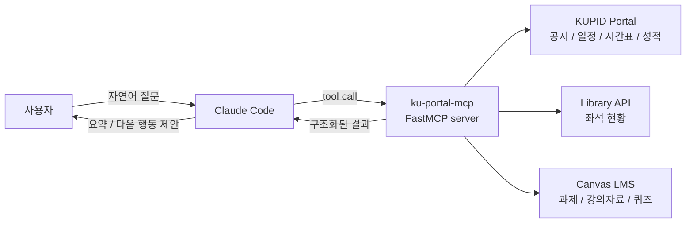

## 대학 생활에도 "도구 호출"이 필요했다

대학 포털은 자주 보지만, 매번 들어가기는 귀찮은 시스템이다.

공지사항을 확인하려면 포털에 로그인해야 하고, 수업 시간표는 다른 화면에 있고, 도서관 좌석은 또 다른 사이트에 있다. 과제와 강의자료는 Canvas LMS에 있다. 장학공지, 학사일정, 강의계획서, 수강신청 내역, 성적 조회까지 포함하면 "학교 생활에 필요한 정보"는 하나의 포털에 모여 있는 듯하면서도 실제로는 여러 화면과 여러 인증 흐름에 흩어져 있다.

그래서 [ku-portal-mcp](https://github.com/SonAIengine/ku-portal-mcp)를 만들었다. 목표는 거창하지 않았다.

Claude Code에서 이렇게 물어보고 싶었다.

```text
이번 주 과제 뭐 있어?
오늘 수업 뭐야?
중앙도서관 빈자리 있어?
수강신청 공지 새로 올라온 거 있어?
딥러닝 강의자료 보여줘.
```

브라우저를 열고, 로그인하고, 메뉴를 찾고, 표를 읽는 과정을 매번 사람이 반복하지 않게 만드는 것. 이 정도만 되어도 체감은 꽤 크다.

## MCP가 잘 맞았던 이유

처음부터 챗봇 서비스를 만들 생각은 아니었다. 별도 웹앱을 만들면 UI, 로그인 저장, 배포, 사용자 관리까지 모두 따라온다. 그런데 내가 원한 것은 "학교 포털을 대신 조작하는 앱"이 아니라 "이미 쓰는 에이전트가 학교 포털을 도구처럼 사용할 수 있는 상태"였다.

MCP는 이 문제에 잘 맞았다.



Claude Code는 사용자의 질문을 이해하고, 필요한 tool을 고른다. `ku-portal-mcp`는 포털과 LMS에서 데이터를 가져와 구조화된 JSON으로 돌려준다. LLM은 로그인 HTML이나 세션 쿠키를 직접 만지지 않는다. 지저분한 부분은 MCP 서버 안에 숨기고, Claude는 "공지 조회", "시간표 조회", "과제 조회" 같은 의미 단위의 도구만 본다.

이 구조가 좋은 이유는 단순하다. 포털 파싱 코드는 바뀔 수 있고, 학교 시스템의 HTML도 바뀔 수 있다. 하지만 Claude가 바라보는 도구 계약은 최대한 안정적으로 유지할 수 있다.

## 만든 기능들

현재 `ku-portal-mcp`는 KUPID와 Canvas LMS를 묶어 20개가 넘는 tool을 제공한다. 기능을 나열하면 많아 보이지만, 실제로는 세 묶음이다.

첫 번째는 학교 공용 정보다. 공지사항, 학사일정, 장학공지, 학과 공지, 도서관 좌석 현황처럼 로그인 여부와 상관없이 학생들이 자주 확인하는 정보다. 특히 도서관 좌석은 공개 API를 사용하기 때문에 로그인 없이 바로 조회할 수 있다.

두 번째는 내 학사 정보다. 개인 시간표, 수강신청 내역, 전체 성적, 누적 GPA, 취득학점, 강의계획서 같은 정보다. 이쪽은 KUPID SSO가 필요하고, 세션을 잘 유지해야 한다.

세 번째는 Canvas LMS다. 수강과목, 과제, 강의자료, 할 일 목록, 대시보드, 성적, 제출 상태, 퀴즈 목록을 조회한다. 포털과 같은 ID/PW를 쓰지만 인증 흐름은 다르다. KUPID 쪽 SSO와 Canvas 쪽 KSSO/SAML 흐름을 분리해서 다룬 이유다.

```text
ku_portal_mcp/
├── server.py      # MCP tool 등록
├── auth.py        # KUPID SSO 로그인, 세션 캐싱
├── scraper.py     # 공지 / 일정 / 장학 파싱
├── library.py     # 도서관 좌석 현황
├── timetable.py   # 시간표 + ICS export
├── courses.py     # 개설과목 / 강의계획서 / 수강신청 내역
├── grades.py      # 전체 성적 / 누적 GPA / 취득학점
└── lms.py         # Canvas LMS 연동
```

처음에는 공지와 도서관 정도면 충분하다고 생각했다. 그런데 막상 써보면 질문이 계속 자연스럽게 확장된다. "오늘 수업 뭐야?"를 물으면 다음에는 "강의실 어디야?"가 필요하고, 그다음에는 "이번 주 제출할 과제 있어?"가 필요해진다. 사용자의 생활 단위는 서비스 경계와 다르다. 그래서 MCP 서버도 포털 메뉴 단위가 아니라 학생의 행동 단위로 커졌다.

## 인증은 생각보다 일이 많았다

이 프로젝트에서 제일 귀찮았던 부분은 tool 등록이 아니라 인증이다.

KUPID 포털은 단순히 ID/PW를 POST하면 끝나는 구조가 아니다. 로그인 페이지에서 동적 hidden field와 CSRF 값을 읽고, SSO token을 얻은 뒤, GRW 쪽 세션까지 넘겨야 공지 화면을 안정적으로 읽을 수 있다. 그래서 `auth.py`에서는 로그인 페이지를 먼저 가져오고, 동적 필드명을 파싱하고, `ssotoken`, `PORTAL_SESSIONID`, `GRW_SESSIONID`를 세션 객체로 묶었다.

세션은 매번 새로 만들지 않는다. `~/.cache/ku-portal-mcp/session.json`에 30분 TTL로 캐싱한다. 다만 TTL 끝까지 버티다가 실패하는 것보다, 만료에 가까워지면 미리 갱신하는 편이 사용감이 좋다. Claude 입장에서는 tool call이 실패한 뒤 재시도하는 것보다, 서버가 알아서 세션을 교체해주는 편이 자연스럽다.

Canvas LMS는 더 복잡하다. KSSO SAML 로그인 흐름을 따라가고, Canvas 세션을 만든 다음, Canvas REST API를 세션 쿠키로 호출한다. `lms.py`에는 KSSO 로그인, SAML redirect 추적, Canvas native login, LMS 세션 캐싱이 따로 들어가 있다. 포털과 LMS가 같은 학교 계정으로 묶여 있어도, 자동화 코드에서는 별개의 시스템처럼 다뤄야 했다.

이런 인증 코드는 글로 보면 지루하지만, MCP 서버에서는 중요하다. 사용자는 "과제 보여줘"라고 말했을 뿐인데, 내부에서는 세션 생성, 만료 확인, 재로그인, API 호출, HTML 파싱, JSON 직렬화가 모두 이어진다. 이 부분이 흔들리면 에이전트 경험 전체가 흔들린다.

## 설치는 한 줄에 가깝게

사용자에게 복잡한 설정을 요구하면 아무도 쓰지 않는다. 그래서 배포는 PyPI 패키지로 정리했다.

Claude Code에서는 다음처럼 등록한다.

```bash
claude mcp add -s user \
  -e KU_PORTAL_ID=your-kupid-id \
  -e KU_PORTAL_PW=your-kupid-password \
  ku-portal \
  uvx ku-portal-mcp@latest
```

이 방식의 장점은 로컬 프로젝트마다 패키지를 설치하지 않아도 된다는 점이다. Claude Code가 MCP 서버를 실행할 때 `uvx`가 최신 패키지를 가져와 실행한다.

그리고 자주 쓰는 질의는 `/ku` 슬래시 커맨드로 줄였다.

```text
/ku 도서관
/ku 공지 수강신청
/ku 과제
/ku 시간표
/ku 성적
```

자연어로도 충분히 동작하지만, 반복해서 쓰는 명령은 짧아야 한다. 에이전트 도구도 결국 제품이라서, 기능보다 사용 빈도가 중요하다.

## 사용자 반응에서 보인 것

만든 뒤 학과 단톡방에 공유했다. 공개 글에는 단톡방 제목, 개인 이름, 시간표 출력 같은 식별 가능한 정보는 빼고, 공유 글과 반응만 남겼다.


반응이 온 지점이 흥미로웠다. 사람들은 "MCP 서버를 만들었다"보다 "공지, 과제, 시간표, 강의계획서를 메시지로 받을 수 있다"는 부분에 반응했다. 한 사용자는 "너무 멋져요"라고 댓글을 달았다. 기술적으로는 FastMCP, SAML, 세션 캐시, HTML 파싱이 들어갔지만, 사용자에게 중요한 건 그런 단어가 아니었다.

학생 입장에서 핵심은 이거다.

학교 시스템을 내가 찾아가는 게 아니라, 필요한 순간에 내 작업 흐름 안으로 끌어올 수 있는가.

이 차이가 크다. 포털은 원래 사람이 메뉴를 타고 들어가서 읽는 시스템이다. MCP로 묶으면 에이전트가 "필요한 정보만" 가져와서 요약하고, 다음 행동까지 이어줄 수 있다.

예를 들어 매일 아침 cron으로 이런 요약을 받을 수 있다.

```text
오늘 수업:
- 16:30 딥러닝

이번 주 할 일:
- 자연어처리 과제 1개
- 텍스트마이닝 강의자료 업데이트

확인할 공지:
- 수강신청 정정 안내
- 장학금 신청 마감
```

이건 단순 알림 앱과 다르다. 알림 앱은 이벤트를 그대로 밀어준다. 에이전트는 공지, 시간표, 과제, 도서관 좌석 같은 여러 출처를 합쳐서 "지금 나에게 필요한 형태"로 바꿔준다.

## 자동화의 선

단톡방에 올릴 때 농담처럼 "퀴즈나 과제까지 맡겨버릴 수도 있을 것 같다. 그러면 안 되겠지만"이라고 썼다. 이 부분은 실제로 중요하다.

`ku-portal-mcp`는 현재 조회 중심으로 설계했다. 공지 읽기, 과제 목록 확인, 시간표 조회, 성적 확인, 강의자료 목록 보기까지는 생산성을 올리는 자동화다. 하지만 과제 제출, 퀴즈 응시, 출석 체크 같은 행동은 다른 영역이다. 사용자의 책임과 평가가 걸린 작업을 에이전트가 대신 수행하게 만들면 편의성보다 위험이 커진다.

그래서 기준은 이렇게 잡는 게 맞다.

- 읽기: 가능
- 요약: 가능
- 일정화: 가능
- 리마인드: 가능
- 제출/응시/평가 개입: 기본적으로 금지

에이전트 도구는 "할 수 있다"와 "해도 된다"를 분리해야 한다. 특히 학교 시스템처럼 개인 정보와 평가가 얽힌 곳에서는 더 그렇다. 기술적으로 자동 제출을 붙일 수 있더라도, 제품적으로는 막아두는 게 맞다.

## 남은 과제

이 프로젝트는 아직 완성형이라기보다, 학교 생활 데이터를 에이전트 도구로 묶어본 실험에 가깝다. 다음 단계는 몇 가지가 보인다.

첫째, 알림 루프다. 매일 아침 공지, 과제, 시간표를 요약해서 보내는 cron 작업을 붙이면 실제 사용성이 확 올라간다. 다만 raw credential을 서버에 모으는 방식은 피해야 한다. 로컬에서 실행하거나, 사용자가 명시적으로 관리하는 secret store와 묶어야 한다.

둘째, 변경 감지다. 단순히 "전체 공지 보여줘"보다 "어제 이후 새로 올라온 것만 알려줘"가 훨씬 유용하다. 이건 마지막 조회 시점과 항목 ID를 로컬에 저장하면 된다.

셋째, 요약 품질이다. 학교 공지는 길고, 첨부파일이 붙는 경우도 많다. 에이전트가 제목만 요약하면 놓치는 것이 생긴다. 상세 본문과 첨부파일 메타데이터까지 보고 "내가 해야 할 행동"을 뽑아내는 쪽이 더 중요하다.

넷째, 학교별 확장성이다. KUPID와 Canvas LMS 연동은 고려대에 맞춰져 있지만, 구조 자체는 다른 학교에도 적용할 수 있다. 학교마다 포털 인증과 LMS 구성이 다르기 때문에 공통 프레임워크와 학교별 adapter를 나누는 방식이 다음 실험이 될 수 있다.

## 만들고 나서 든 생각

이 프로젝트를 만들면서 다시 느낀 건, 좋은 에이전트 도구는 거창한 AI 기능에서 시작하지 않는다는 점이다. 오히려 매일 반복해서 확인하는 지루한 시스템을 자연어 도구로 바꾸는 쪽이 체감이 크다.

KUPID와 Canvas는 원래 LLM을 위해 만든 시스템이 아니다. HTML은 사람이 보는 화면이고, SSO는 브라우저 흐름을 전제로 하고, 메뉴 구조는 서비스 담당자 기준으로 나뉘어 있다. `ku-portal-mcp`는 그 사이에 얇은 번역 계층을 넣은 것이다.

사람은 "오늘 뭐 해야 하지?"라고 묻는다.

시스템은 공지, 시간표, 과제, 좌석, 강의자료를 각자 다른 방식으로 가진다.

MCP 서버는 그 둘 사이를 이어준다.

아직은 작은 프로젝트지만, 방향은 꽤 선명하다. 앞으로의 개인 자동화는 앱을 하나 더 만드는 것보다, 이미 존재하는 시스템들을 에이전트가 호출 가능한 도구로 바꾸는 쪽으로 갈 가능성이 크다. 학교 포털도 예외는 아니었다.
