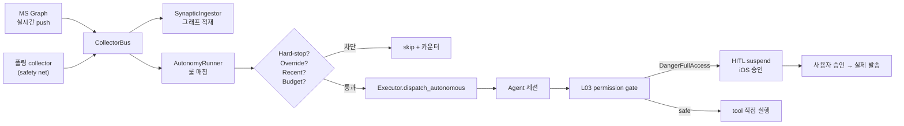

## "자동으로 답장"이 무서운 이유

sonlife는 내가 운영하는 라이프로그 + 자율 에이전트 시스템이다. 메일·Teams DM·캘린더·카카오톡·Git 활동을 collector가 SQLite에 적재하고, 그 위에서 에이전트가 라이프로그를 검색하고 답신을 작성한다. 처음에는 단순한 검색/요약 도구였는데, 사용자가 매번 "이 메일 답장 좀 써 줘"를 명시적으로 요청해야 했다.

자연스러운 다음 단계는 자율 루프였다. **수집기가 새 이벤트를 보면 자동으로 에이전트를 띄워서 답신 초안을 만든다.** 좋은 아이디어처럼 들리지만, 한 번 사고가 나면 결과가 끔찍한 영역이다.

- 잘못된 사람에게 자동 답장이 나가면 **전송된 메시지는 회수할 수 없다.**
- 추론 비용이 기하급수적으로 늘면 하루에 수십 달러가 사라진다.
- 워터마크가 리셋되거나 컨테이너가 며칠 다운돼 있다가 깨어나면 **두 달 전 메일에 뒷북 답장**이 나갈 수 있다.
- 룰이 잘못 매칭되면 같은 이벤트에 대해 무한히 에이전트가 깨어난다.

이 글은 sonlife에 자율 루프를 D-1 ~ D-3 + M1a 단계로 도입하면서 박아 넣은 안전장치들을 정리한다. 예산 hard-stop, HITL 게이트, max_age 가드, MS Graph 실시간 push, synaptic preflight — 모두 "한 번이라도 실수하면 끝"이라는 가정에서 설계됐다.

## 큰 그림

먼저 전체 흐름부터.



좌측이 수집, 중앙이 룰 엔진, 우측이 실행 + 안전장치다. 핵심은 **각 단계가 독립적으로 차단을 걸 수 있다**는 점이다. 어느 한 곳이 무너져도 다음 단계에서 멈춘다.

## CollectorBus — 수집과 후속 처리의 분리

처음 자율 루프를 만들 때 가장 큰 결정은 "어떤 수집기가 어떤 후속 행동을 일으킬지" 하드코딩하지 않는 것이었다. collector는 자기가 수집한 lifelog를 publish만 하고, 후속 처리는 구독자가 알아서 한다. 이게 D-1에서 만든 `CollectorBus`다.

```python
class CollectorBus:
    """수집기 → 후속 처리(구독자) 사이의 publish/subscribe 채널."""

    def subscribe(self, callback) -> None: ...
    async def publish(self, collector_name, entries) -> None: ...
```

구독자 두 종류가 붙는다.

- **AutonomyRunner** — 룰 매칭 후 에이전트 dispatch
- **SynapticIngestor** — synaptic-memory 그래프에 노드 추가

이 분리가 왜 중요한가. **구독자 격리** 덕분에 에이전트 dispatch가 실패해도 수집은 계속 굴러간다. 반대도 마찬가지. ingestor가 죽어도 collector는 자기 일을 한다. 만약 둘이 한 함수 안에 묶여 있었다면, 한쪽 예외가 다른 쪽을 죽였을 거다.

> "수집 자체는 절대 막지 않음 — bus 구독자 격리 활용"

이 한 줄을 코드 주석에 박아 두고, 모든 구독자 콜백은 except 블록으로 감싼다. 자율 루프의 어떤 트러블도 라이프로그 적재를 멈추면 안 된다.

## 트리거 룰 엔진 — 한 이벤트, 한 룰, 한 dispatch

D-2에서 추가한 룰 엔진은 의외로 단순하다. `TriggerRule` 프로토콜은 단 두 메서드.

```python
@runtime_checkable
class TriggerRule(Protocol):
    name: str
    def matches(self, entry: LifelogEntry) -> bool: ...
    def build_task(self, entry: LifelogEntry) -> AutonomyTask: ...
```

룰의 핵심 설계 원칙 두 가지를 못 박아 둔다.

> 1. 룰은 외부로 나가는 액션을 직접 수행하지 않는다. **프롬프트만 만든다.** 실제 send_email/git_push 등은 L03 permission + HITL 훅에서 게이트된다.
> 2. 한 이벤트는 최대 한 룰만 매칭 (runner에서 break). 중복 발화 방지.

룰이 직접 행동하지 않는다는 게 가장 중요하다. 룰은 "이런 상황이면 이런 작업을 하고 싶다"는 의도를 LLM 프롬프트로 표현할 뿐이다. 실제 외부 호출은 에이전트가 시도하고, 그 시도는 다음 절에서 설명할 permission gate를 통과해야 한다.

`DEFAULT_RULES`에는 5개 정도의 룰이 살아 있다.

| Rule | 매칭 조건 | 액션 |
|------|-----------|------|
| `important_email_reply_draft` | source=email AND importance=high AND age≤2h | 회신 초안 작성 → send_email 시도 → HITL |
| `teams_dm_reply_draft` | source=teams AND oneOnOne AND not self AND age≤1h | 답신 작성 → send_teams_message 시도 → HITL |
| `cross_channel_urgency` | 동일 sender가 ≥2개 채널에 ≥3건 (2h 내) | "긴급 같음" 알림만 |
| `calendar_conflict_check` | 새 일정 추가 시 기존과 충돌 | 사용자에게 충돌 안내만 |
| `daily_briefing_trigger` | 아침 첫 메일 도착 시 1일 1회 | brief 작성 후 알림만 |

매칭 우선순위는 룰 등록 순서. 첫 매칭에서 break해서 한 이벤트가 여러 dispatch를 트리거하지 못하게 한다.

## 안전장치 1 — max_age 뒷북 가드

`important_email_reply_draft` 룰의 매칭 조건에 `_is_recent(entry, 2 * 60 * 60)`이 들어 있다. 2시간이 지난 메일에는 자율 답장을 만들지 않는다. 이게 의외로 중요한 가드다.

이걸 넣게 된 사고가 있었다. 컨테이너를 며칠 셧다운했다가 다시 띄웠더니, 워터마크가 리셋되면서 collector가 **이미 며칠 지난 메일 수십 통**을 한꺼번에 publish했다. 그리고 자율 루프가 그 모든 메일에 대해 답장을 만들기 시작했다. 다행히 HITL에서 막혔지만, 만약 `send_email`이 자동 발송이었다면 이미 답장이 며칠 지난 옛 메일에 줄줄이 나갔을 거다.

```python
def _is_recent(entry: LifelogEntry, max_age_seconds: int) -> bool:
    age = _entry_age_seconds(entry)
    if age is None:
        # timestamp 파싱 실패는 stale로 간주 (보수적)
        return False
    if age < 0:
        return True  # 미래 시각 = clock skew, 신선으로 간주
    return age <= max_age_seconds
```

세 가지 디테일이 있다.

1. **timestamp 파싱 실패는 stale로 간주.** "확실히 최근이 아니면 답장하지 않는다"는 보수적 기본값.
2. **미래 시각(음수 age)은 신선으로 간주.** 컨테이너 clock이 어긋났을 때를 위한 예외.
3. 룰별로 max_age가 다르다. Teams DM은 1시간, 메일은 2시간. Teams가 더 실시간성이 강하다는 직관 반영.

작은 함수지만 이게 자율 루프 신뢰성의 1차 방어선이다.

## 안전장치 2 — 예산 Hard-Stop

가장 큰 안전장치다. M1a #1에서 추가한 예산 hard-stop은 자율 루프가 **일일 한도의 150%를 넘어 사용하면 자동으로 정지**한다. 자정(KST)이 지나면 자동 해제.

```python
GLOBAL_DAILY_MAX_COST_USD = float(os.getenv("BUDGET_GLOBAL_MAX_COST_USD", "20.0"))
HARD_STOP_MULTIPLIER = float(os.getenv("BUDGET_HARD_STOP_MULTIPLIER", "1.5"))

def hard_stop_threshold_usd() -> float:
    return GLOBAL_DAILY_MAX_COST_USD * HARD_STOP_MULTIPLIER
```

기본 한도는 $20, hard-stop은 $30. 이 두 단계가 의미하는 게 다르다.

- **$20 (BLOCKED)** — 개별 dispatch가 차단된다. 이건 정상 동작이다. 새 자율 작업이 큐에 들어오지 않는다는 것뿐, 이미 진행 중인 세션은 계속 돈다.
- **$30 (HARD STOP)** — runner 자체가 죽는다. `enabled` 프로퍼티가 False로 flip되고, 모든 신규 dispatch가 즉시 멈춘다. 자정까지.

왜 두 단계가 필요한가. BLOCKED만 있으면 충분해 보이지만, **이미 시작된 세션이 계속 비용을 누적하는 누수 시나리오**가 있다. 한 세션이 sub-agent를 5개 spawn하고, 각 sub-agent가 또 자식을 spawn하면 누적 비용이 한도를 한참 넘긴 후에야 알아차린다. hard-stop은 그 누수에 대비한 100% 안전장치다.

```python
async def _check_hard_stop(self) -> None:
    if self._budget_store is None:
        return
    if self.hard_stopped:
        return  # 이미 오늘 정지됨

    global_cost = self._budget_store.get_global_today_cost()
    threshold = GLOBAL_DAILY_MAX_COST_USD * HARD_STOP_MULTIPLIER
    if global_cost < threshold:
        return

    # Hard stop 발동
    self._hard_stopped_date = kst_today()
    logger.critical(
        "[autonomy] BUDGET HARD STOP — global $%.2f >= $%.2f",
        global_cost, threshold,
    )
    await self._send_hard_stop_alert(...)
```

발동 조건은 단순하지만 발동 후 동작이 까다롭다.

- **하루 한 번만 알림.** `if self.hard_stopped: return`. 이미 걸린 상태면 추가 체크/알림 안 함.
- **APNs critical 알림 1회.** 사용자에게 즉시 푸시. 알림 실패는 로그만 — 정지 자체는 로컬에서 이미 확정됐기 때문에 알림이 실패해도 안전성에는 영향 없음.
- **자정 KST 지나면 자동 해제.** `kst_today() != self._hard_stopped_date`로 비교.
- **수동 reset 가능.** iOS 토글에서 `force_reset_hard_stop()`을 호출하면 즉시 풀린다. 긴급 상황 escape hatch.

이걸 만들고 나서 한 가지 더 추가한 게 있는데, **hard-stop 체크를 enabled 체크보다 먼저** 넣은 거다. 왜냐하면 hard-stop은 "사고가 났다"는 정보 자체가 알림에 남아야 하는 사건이라, env가 `false`로 꺼져 있어도 hard-stop 발동은 로그에 남겨야 했다.

```python
async def _on_new_events(self, collector_name, entries):
    ...
    # M1a #1: hard-stop을 env kill-switch보다 먼저 체크
    await self._check_hard_stop()

    if not self.enabled:
        return
```

## 안전장치 3 — iOS Toggle Override (Persistence 포함)

자율 루프는 환경변수 `AUTONOMY_ENABLED=false`로 기본 꺼져 있다. 그런데 사용자가 iOS 앱에서 한 번 토글하면 그게 영구적으로 적용돼야 한다. 서버가 재시작돼도 유지돼야 하고, env를 다시 안 건드려도 돼야 한다.

이게 M1a #2의 override 메커니즘이다.

```python
@property
def enabled(self) -> bool:
    """우선순위: hard_stop > override > env. 기본 false."""
    if self.hard_stopped:
        return False
    if self._override_enabled is not None:
        return self._override_enabled
    return self.env_enabled
```

세 단계 우선순위:

1. **hard_stopped** — 가장 강함. 무엇도 이걸 우회할 수 없음 (수동 reset 제외).
2. **override** — iOS/API 토글. None이면 env로 fallback.
3. **env** — 기본값.

override 상태는 작은 JSON 파일에 영속화한다. 위치는 `~/.sonlife/autonomy_override.json`, 환경변수로 override 가능.

```python
def set_enabled_override(self, value: bool | None, *, source: str = "api") -> None:
    self._override_enabled = value
    self._override_source = source if value is not None else None
    state = {
        "override_enabled": value,
        "source": source if value is not None else None,
        "updated_at": datetime.now(timezone.utc).isoformat(),
    }
    _save_override_state(state)
```

소소한 디테일: `tmp.replace(p)`로 atomic write를 한다. 토큰 만료, 디스크 풀 같은 순간에도 상태 파일이 깨지면 안 된다.

## 안전장치 4 — L03 Permission Gate + HITL Suspend

여기가 자율 루프의 진짜 핵심이다. 룰이 만든 프롬프트가 에이전트로 들어가면, 에이전트는 LLM으로서 자유롭게 도구를 호출할 수 있다. 그런데 일부 도구(`send_email`, `send_teams_message`, `git_push`, `ssh_exec`, …)는 외부에 영향을 주는 도구다. 이걸 **사용자 확인 없이 실행하면 안 된다.**

L03 permission gate는 도구마다 권한 레벨을 박아 두는 시스템이다.

```python
@sonlife_tool(permission=PermissionLevel.DANGER_FULL_ACCESS)
def send_teams_message(chat_id: str, body: str) -> dict:
    ...
```

권한 레벨:
- `READ_ONLY` — 검색/조회. 자유롭게 호출.
- `WRITE_LOCAL` — DB write, vault write. 자유롭게 호출.
- `REQUIRES_APPROVAL` — 외부 호출이지만 idempotent. 한 번 사용자 확인.
- `DANGER_FULL_ACCESS` — 메시지 발송, git push, 파일 삭제. 매번 HITL.

자율 세션이 `send_teams_message`를 호출하려고 시도하면, **L03 permission hook이 실행을 가로채서 세션을 suspend**한다. 세션 상태가 `awaiting_approval`이 되고, iOS 앱에 푸시가 간다. 사용자가 승인 버튼을 누르면 그제야 실제 호출이 일어난다.

```python
class NewTeamsDirectMessageReplyDraft:
    """1:1 Teams DM 도착 → 답신 초안 작성 + send_teams_message 발송 시도.

    send_teams_message는 REQUIRES_APPROVAL이므로 에이전트가 발송 시도하면
    L03 permission hook이 HITL로 자동 suspend → 사용자 승인 후 실제 발송.
    """
```

이 구조의 좋은 점은 **룰이 도구 목록을 알 필요가 없다**는 거다. 룰은 그냥 "이런 답신을 작성해서 보내 줘"를 LLM 프롬프트로 만들 뿐이고, 안전성은 도구 메타데이터에 박힌 권한 레벨이 자동으로 보장한다. 새 도구를 추가할 때 권한만 정확히 박으면 자율 루프와 자연스럽게 통합된다.

### 룰 프롬프트의 도구 선택 강건화

이걸 만들고 한 가지 사고가 있었다. Teams DM에 답신해야 하는데, 에이전트가 무심코 `email_compose_draft`를 호출했다. 그 도구는 REQUIRES_APPROVAL이었지만 — 더 큰 문제는 사용자가 승인하면 **이메일이 나간다**는 거였다. Teams DM에 대한 답을 이메일로 보내는 사고.

원인은 LLM이 도구 이름의 추상화 수준을 헷갈린 것. `compose_draft`라는 단어가 일반적이라 채널을 무시했다. 패치는 룰 프롬프트에서 채널 종류를 명시적으로 못 박는 것이었다.

```python
prompt = (
    "## 작업: Teams 1:1 DM 답신 (이메일 아님)\n\n"
    f"발신자 **{sender}** 가 사용자에게 Teams 채팅으로 메시지를 보냈다. "
    "답신을 작성해서 **Teams 채팅으로 되돌려** 보내야 한다.\n\n"
    f"### 받은 메시지\n{body}\n\n"
    f"### Teams 채팅방 ID\n{chat_id}\n\n"
    "### 반드시 지킬 것\n"
    "1. 이것은 **Teams 채팅** 이다. 이메일이 아니다.\n"
    "2. 답신 발송은 반드시 `send_teams_message` 도구를 사용한다.\n"
    f"   호출 형식: `send_teams_message(chat_id=\"{chat_id}\", body=<답신 텍스트>)`\n"
    "3. **절대로 `email_compose_draft` 나 `email_send` 를 사용하지 말 것.**\n"
    "..."
)
```

LLM은 부정문에 약하다지만, "절대로 X 사용하지 말 것" 같은 명시적 가드는 도구 선택 사고를 막는 데 효과가 있다. 도구 이름까지 인용해서 박아 둔 게 핵심.

## 안전장치 5 — Synaptic Preflight

D-3 이후 자율 루프는 synaptic-memory(라이프로그의 그래프 인덱스)에 의존한다. 에이전트가 답장을 작성하기 전에 synaptic에서 발신자와의 과거 대화 맥락을 끌어온다. 그런데 만약 synaptic 그래프 자체가 망가져 있으면? 답장이 맥락 없이 작성된다. 이건 차라리 답장을 안 만드는 것보다 못하다.

그래서 dispatch 직전에 synaptic ingestor의 health를 체크한다.

```python
async def _match_and_dispatch(self, collector_name, entries):
    # Preflight: synaptic ingestor가 unhealthy면 전체 dispatch 차단
    if self._synaptic_ingestor is not None and not self._synaptic_ingestor.healthy:
        self._bump_skip("synaptic_dead")
        logger.error(
            "[autonomy] synaptic ingestor unhealthy (%s) → dispatch 전면 차단",
            self._synaptic_ingestor.last_error,
        )
        return
```

`SynapticIngestor.healthy`는 마지막 ingest 시도가 성공했는지를 추적한다. 한 번이라도 예외가 발생하면 False로 flip되고, 다음 정상 적재까지 계속 False다. 자율 루프는 이게 True인 상태에서만 dispatch한다.

이 가드는 두 가지 효과를 동시에 낸다.

1. **맥락 없는 답신을 막음.** synaptic이 죽은 상황에서 자율 답장이 나가지 않음.
2. **수집은 계속 진행.** preflight는 dispatch만 막지 collector publish를 막지 않음. 데이터는 SQLite에 정상 적재됨, ingestor만 잠시 쉰다.

## MS Graph Change Notifications — 폴링 30분 → 초 단위

자율 루프의 응답 속도는 collector 폴링 주기에 묶여 있다. 메일 collector가 30분마다 한 번 도는 환경에서는 새 메일을 받고도 30분 뒤에야 답장 초안이 만들어진다. Teams DM은 더 답답하다 — 30분 후 답장이 오면 사실상 의미 없다.

해결책은 Microsoft Graph의 **Change Notifications**다. Graph가 새 메시지/이벤트를 감지하는 즉시 우리 webhook URL로 POST를 보내 준다. 폴링이 아니라 push.

```python
SUBSCRIPTION_SPECS: list[dict[str, Any]] = [
    {
        "id": "outlook_mail",
        "resource": "/me/mailFolders('Inbox')/messages",
        "change_type": "created",
        "max_lifetime_seconds": 4230 * 60 - 300,  # 약 70시간
    },
    {
        "id": "teams_chats",
        "resource": "/me/chats/getAllMessages",
        "change_type": "created",
        "max_lifetime_seconds": 60 * 60 - 60,  # 59분
    },
]
```

리소스마다 최대 subscription 수명이 다르다는 게 첫 번째 함정이다. Outlook은 70시간이지만 Teams는 60분이다. 60분마다 갱신해야 한다는 뜻이고, 이건 별도 renewal 작업이 필요하다는 뜻이다. `task_scheduler.py`에 만료 5분 전에 PATCH를 보내는 작업을 매분 돌린다. 갱신이 실패하면 새 subscription을 만든다.

### 보안 — clientState secret과 validation handshake

Graph webhook에 가장 신경 쓴 부분이 보안이다. webhook URL은 결국 외부에 노출돼야 하는데, 그 URL을 알면 누구나 가짜 notification을 보낼 수 있다. Graph는 이 위협을 막기 위해 `clientState`라는 secret을 둔다.

1. 우리가 subscription을 만들 때 32바이트 랜덤 secret을 등록한다.
2. Graph가 webhook으로 notification을 보낼 때 같은 secret을 함께 전송한다.
3. 우리 webhook 핸들러는 secret이 일치할 때만 처리한다.

```python
def get_client_state() -> str:
    """위조 방지 secret. 환경변수 없으면 자동 생성해 state 파일에 저장."""
    env_val = os.getenv("MS_GRAPH_WEBHOOK_CLIENT_STATE", "").strip()
    if env_val:
        return env_val
    state = _load_state()
    secret = state.get("_client_state")
    if not secret:
        secret = secrets.token_urlsafe(32)
        state["_client_state"] = secret
        _save_state(state)
    return secret
```

환경변수가 있으면 그걸 쓰고, 없으면 처음 한 번 자동 생성해서 state 파일에 저장한다. **이 비밀 값은 어디에도 코드에 박지 않는다.** 환경변수 또는 자동 생성된 로컬 파일에만 존재한다.

또 한 가지 — Graph는 subscription을 만들 때 **validation handshake**를 한다. 우리 webhook URL로 GET을 보내고, 응답에 특정 토큰이 들어 있어야 subscription을 활성화한다. 이건 webhook URL이 진짜로 우리 통제 하에 있는지 확인하는 절차다. 이 핸드셰이크 응답을 잘못 짜면 subscription이 등록되지 않는다.

```python
# webhook handler 내부 (의사 코드)
async def graph_webhook(request):
    # Validation handshake
    token = request.query_params.get("validationToken")
    if token:
        return Response(content=token, media_type="text/plain")

    # 실제 notification
    body = await request.json()
    for notification in body.get("value", []):
        if notification.get("clientState") != get_client_state():
            logger.warning("[graph] clientState mismatch — drop")
            continue
        await _handle_notification(notification)
    return Response(status_code=202)
```

### 폴링은 safety net으로 유지

push가 들어와도 폴링을 끄지는 않았다. Graph 공식 문서에서도 권장하는 패턴이다. 이유는 두 가지.

1. Graph가 가끔 notification을 잃는다(공식 문서에 lost notification이 있을 수 있다고 명시).
2. webhook URL이 일시적으로 unreachable이면 그 시점의 notification이 영구히 사라진다.

폴링 주기는 30분에서 더 줄일 필요가 없어졌다. push가 즉시 처리해 주고, 폴링은 누락 보정 역할만 하면 되니까. 결과적으로 응답 속도는 30분 → 초 단위로 단축됐고, API 호출량은 오히려 줄었다(폴링이 매번 변화 없음을 확인하던 비용이 사라졌으니까).

## SynapticIngestor — 수집과 동시에 그래프에 적재

자율 루프가 답장을 잘 쓰려면 발신자와의 과거 맥락이 필요하다. 그 맥락은 `synaptic-memory` 그래프에서 검색해 온다. 그러려면 새로 수집한 lifelog가 그래프에 빠르게 들어가 있어야 한다.

`SynapticIngestor`는 CollectorBus 구독자다. collector가 publish하는 모든 lifelog를 받아서 synaptic 노드로 변환해 적재한다.

```python
SUPPORTED_SOURCES = {
    "email", "teams", "kakaotalk", "voice", "github", "gitlab",
}

@dataclass(frozen=True)
class SynapticNodeSpec:
    title: str
    content: str
    kind: str | None
    tags: list[str]
    source: str
    properties: dict[str, str]
    use_document_chunking: bool = False  # 긴 트랜스크립트용
```

소스별 mapper가 따로 있다. 메일은 메일 mapper, Teams는 Teams mapper. 각 mapper는 lifelog entry를 받아 `SynapticNodeSpec`을 만든다. 적재할 때 properties에 `lifelog_source`, `lifelog_source_id`, `timestamp`, `importance` 같은 추적용 메타를 박아 둔다. 이게 있으면 나중에 "이 그래프 노드는 어떤 lifelog에서 왔는가"를 역추적할 수 있다.

### Kuzu 백엔드 전환 — synaptic-memory 0.11.0 → 0.12.0

처음에는 synaptic-memory가 SQLite 백엔드만 지원했다. 그래프 검색이라기보다는 SQLite + 인덱스에 가까웠다. v0.11에서 Kuzu(고성능 임베디드 그래프 DB) 백엔드가 추가됐고, v0.12에서 동시성 처리(write lock)가 들어가면서 sonlife도 Kuzu로 옮겼다.

Kuzu의 이점은 진짜 그래프 쿼리가 가능하다는 것. 예를 들어 "발신자가 X인 메일 → 그 메일에서 언급된 인물 → 그 인물과의 과거 대화"를 한 번의 Cypher 쿼리로 가져올 수 있다. SQLite로는 N+1 query가 됐던 패턴이 한 번에 끝난다.

전환 후 한 번 동시성 사고가 있었다. 두 collector가 동시에 ingest하려고 하면 Kuzu가 lock 충돌을 던졌다. v0.12.0에서 write lock을 추가해서 해결.

## D-3b: Self-Context v2 — synaptic 3계층 검색

자율 루프의 최종 추론 품질은 발신자 맥락을 얼마나 정확히 가져오는지에 달려 있다. D-3b에서 도입한 Self-Context v2는 synaptic 그래프를 3계층으로 검색한다.

1. **Tier 1 (발신자 직접)** — 발신자 이름/이메일 정확 매칭. 가장 신뢰도 높은 직접 맥락.
2. **Tier 2 (과거 대화)** — 같은 채널에서의 과거 대화. 톤/관계 추정에 활용.
3. **Tier 3 (관련 엔티티)** — 메일 본문에 언급된 엔티티(프로젝트명, 인물, 시스템)의 그래프 이웃.

각 tier에서 가져온 결과를 LLM 컨텍스트에 합쳐서 system prompt에 주입한다. Haiku로 query expansion을 한 번 거친 다음에 검색하기 때문에 짧은 메시지에서도 의미 있는 맥락이 잡힌다.

이 3계층 검색이 동작하려면 synaptic 그래프가 항상 healthy해야 한다. 그래서 앞서 설명한 `synaptic_preflight`가 dispatch 직전에 들어간다. 검색 자체가 실패하면 답신 품질이 무너지니까.

## 관측 — 카운터와 skip reasons

자율 루프의 모든 결정은 카운터로 남는다. 사후 분석과 튜닝의 기반이다.

```python
self._seen_count: int = 0
self._per_source_count: dict[str, int] = {}
self._dispatched_count: int = 0
self._skipped_reasons: dict[str, int] = {}
```

이 카운터들이 `/api/autonomy/state` 엔드포인트로 노출되고, iOS 앱의 메모리/관측 대시보드에서 시각화된다. skip reasons를 보면 자율 루프가 어디서 가장 많이 차단되고 있는지 알 수 있다.

| skip reason | 의미 |
|------|------|
| `hard_stop` | 예산 hard-stop 발동 |
| `max_per_batch` | 한 batch에 3건 초과 |
| `already_triggered` | 같은 event_id에 이미 세션 있음 |
| `budget_blocked` | BLOCKED 상태 |
| `synaptic_dead` | synaptic 그래프 unhealthy |
| `dispatch_error` | executor 호출 실패 |

이 분포가 시간이 지나면서 모양이 잡힌다. 처음 며칠은 `max_per_batch`가 압도적이었다(룰이 너무 많이 매칭). 룰을 더 엄격하게 만든 다음에는 `already_triggered`가 가장 많아졌다(중복 폴링). MS Graph push로 옮긴 후에는 `already_triggered`도 거의 사라졌다.

M1a #6a에서는 추가로 **주간 거절률 메트릭**을 수집한다. HITL 승인 단계에서 사용자가 거절한 비율. 이게 높으면 룰의 정확도가 낮다는 신호다. 매주 이 수치를 보고 룰 매칭 조건을 튜닝한다.

## 트러블슈팅 — 부서졌고 고친 것들

### 1. 워터마크 리셋 → 뒷북 답장 시도

이미 설명했다. max_age 가드(2시간/1시간)로 해결.

### 2. Teams 룰이 이메일 도구를 호출

LLM이 도구 이름의 추상화를 헷갈림. 룰 프롬프트에 채널 명시 + 도구 이름 명시 + 부정형 가드.

### 3. dispatch 카운터가 동시성에서 깨짐

처음에는 카운터가 단순 dict였는데, 여러 collector가 동시에 publish하면 race condition. Python 단일 스레드 asyncio라 큰 문제는 아니었지만, atomic하지 않은 read-modify-write가 가끔 카운트를 잃었다. 해결은 단순히 카운터 update를 한 함수로 묶고 await을 그 안에 두지 않는 것.

### 4. APNs 토큰 만료 → 알림 전송 실패

hard-stop 발동 시 APNs로 critical 알림을 보내는데, 토큰이 만료된 상태였다. 알림 실패가 hard-stop 자체를 막으면 안 된다는 원칙을 적용해서, APNs sender 호출을 try/except로 감싸고 실패는 로그만 남기고 계속 진행하도록 했다. **안전장치는 다른 안전장치의 실패에 의존하면 안 된다.**

### 5. preview.summary가 "send_teams_message 실행" 같은 기계어로 노출

iOS 앱 알림에 hook 이벤트의 raw 표현이 그대로 떴다. 사용자에게는 "발신자 X에게 답신 작성 중" 같은 사람 친화적 문구가 필요. fix는 hook event → 사람 친화 문구 매퍼를 따로 만든 것.

### 6. Graph subscription 갱신 실패

Teams subscription의 max_lifetime이 60분이라 갱신을 자주 해야 하는데, 갱신 작업이 한 번 실패하면 만료 후 push가 끊겼다. 해결은 갱신 실패 시 즉시 새 subscription을 만들고, state 파일을 atomic write로 갱신하는 것. `secrets.token_urlsafe(32)` clientState도 이 시점에 함께 회전.

### 7. synaptic Kuzu write lock 충돌

두 collector가 동시에 ingest하면 Kuzu가 lock 에러를 던졌다. synaptic-memory v0.12.0에서 write lock을 라이브러리 레벨에서 추가하는 fix가 들어와 해결.

## 회고 — "자동"보다 "안전한 자동"이 어렵다

자율 루프를 만드는 시간의 80%가 안전장치 설계였다. 룰 엔진 자체는 며칠이면 끝나지만, 그 룰이 사고를 일으키지 않게 만드는 데는 한 달 가까이 걸렸다.

세 가지 원칙이 자리잡았다.

**1. 모든 단계가 독립적으로 차단한다.** hard-stop, override, max_age, synaptic preflight, permission gate. 어느 한 곳이 무너져도 다른 곳에서 멈춘다. 단일 안전장치는 신뢰하지 않는다.

**2. 외부로 나가는 액션은 항상 HITL을 통과한다.** 룰은 의도만 표현하고, 도구는 권한 메타를 가지고, permission gate가 자동으로 suspend한다. 사용자 승인 없이는 어떤 메시지도 나가지 않는다.

**3. 관측이 안전장치의 일부다.** 카운터, skip reasons, 거절률을 다 본다. 자율 루프가 어디서 차단되는지를 시각화해야 룰을 튜닝할 수 있다.

이게 자리 잡고 나서야 자율 루프를 본격적으로 켤 수 있었다. 그전까지는 dry-run 모드(`AUTONOMY_ENABLED=false`)로 룰 매칭만 로그에 남기면서 한 달간 관찰만 했다. 그 한 달이 안전장치 디자인의 베이스라인을 만들어 줬다.

다음 글은 회사 코드 영역으로 넘어가서, XGEN 2.0 백엔드들에서 권한 모델을 group 기반에서 role 기반으로 마이그레이션하면서 6개 마이크로서비스를 일관성 있게 리팩토링한 과정을 다룬다.
