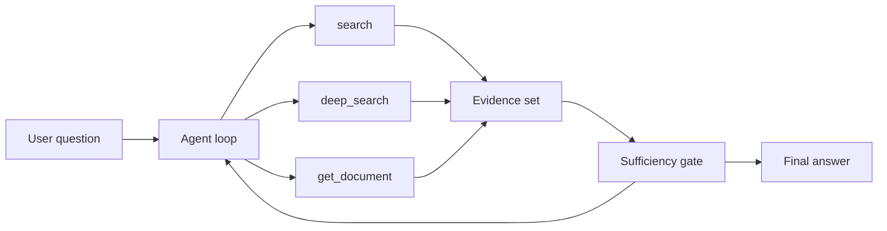
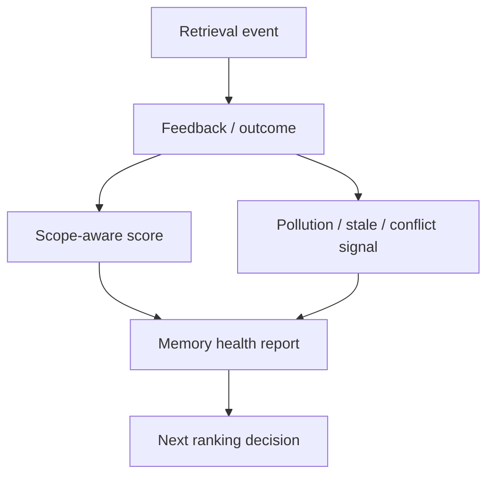
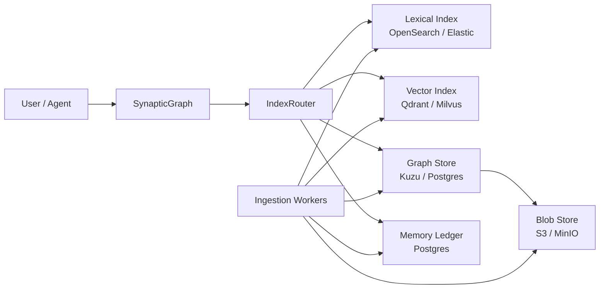

## 처음에는 검색 점수만 보면 된다고 생각했다

처음에는 단순하게 생각했다.

검색엔진이 좋아졌는지는 ranking 점수를 보면 된다. BM25를 손보고, vector search를 붙이고, reranker를 넣고, graph expansion을 조정한다. 특정 query를 넣었을 때 정답 문서가 top10 안에 들어오는지 보면 된다. 이건 검색엔진을 만드는 사람에게 가장 익숙한 싸움이다.

그런데 `synaptic-memory`를 MS MARCO full tier까지 올려서 재기 시작하자 이상한 장면이 나왔다.

검색 도구를 더 늘렸는데 자동으로 좋아지지 않았다. `deep_search`는 더 똑똑해 보였고, scripted session은 더 많은 tool call을 썼지만, full MS MARCO의 짧은 웹 passage 검색에서는 단일 `graph.search`보다 확실히 낫다고 말하기 어려웠다.

이때부터 질문이 바뀌었다.

"검색을 잘하는가"가 아니라 "에이전트가 검색을 잘 시키고 있는가"를 봐야 했다.

LLM agent는 검색 API를 한 번만 호출하지 않는다. 처음 검색 결과를 보고, 다른 표현으로 다시 찾고, 문서를 열어보고, 필요하면 더 좁히거나 넓힌다. 이때 중요한 질문은 "첫 검색 결과가 몇 점인가"에서 끝나지 않는다.

이런 질문이 더 중요해진다.

- agent가 검색 도구를 반드시 쓰는가
- 첫 결과가 애매할 때 follow-up query를 잘 바꾸는가
- `search`, `deep_search`, `get_document`를 상황에 맞게 고르는가
- 같은 도구 호출을 반복하지 않는가
- 관련 문서를 찾았을 때 충분하다고 멈출 수 있는가
- 못 찾았을 때 비용만 태우지 않고 실패를 드러낼 수 있는가

최근 `synaptic-memory` 작업은 이 지점으로 넘어갔다. 단순히 "검색이 된다"가 아니라, 에이전트가 큰 코퍼스 위에서 검색을 어떻게 운전하는지 측정하기 시작했다.

이 글의 주인공은 ranking 함수 하나가 아니다. 검색 도구를 호출하는 순서, query를 다시 쓰는 방식, 증거를 누적하는 방법, 실패를 다음 실행에 남기는 운영 레이어다.

## 평가 무대는 884만 개 passage였다

이번에 기준으로 삼은 데이터는 MS MARCO passage 전체 tier다.

```text
documents: 8,841,823 passages
dataset: MS MARCO passage dev
storage: SQLite FTS 기반 persistent DB
agent model: deepseek-v4-flash
max turns: 5
force first tool: yes
sufficiency gate: yes
```

작은 toy dataset이 아니다. 로컬 artifact 기준으로 corpus JSONL은 수 GB, SQLite DB는 10GB가 넘는다.

처음에는 embedder-free `graph.search()` 경로로 대규모 검색을 확인했다. 이후 `deep_search`, scripted session, 마지막으로 실제 LLM-planned agent loop까지 올렸다.

왜 이렇게 단계적으로 봤냐면, 각 단계가 보는 병목이 다르기 때문이다.

| 단계 | 보는 것 |
| --- | --- |
| `graph.search` | 단일 검색 API의 ranking 품질 |
| `deep_search` | deterministic rewrite와 evidence expansion |
| scripted session | 고정된 다중 tool 호출의 누적 reach |
| `run_agent_loop` | LLM이 직접 도구를 고르고 query를 바꾸는 능력 |

검색엔진만 평가하려면 첫 줄이면 된다. 하지만 agentic search를 보려면 마지막 줄까지 가야 한다.

## 단일 검색은 출발점일 뿐이었다

full MS MARCO 50-query 기준으로 단일 검색 계열은 이런 결과를 냈다.

| Mode | Docs | Queries | Hit@10 | Reach@All | Search time |
| --- | ---: | ---: | ---: | ---: | ---: |
| `graph_search` | 8,841,823 | 50 | 22/50 | 25/50 | 69.8s |
| `deep_search` | 8,841,823 | 50 | 22/50 | 22/50 | 203.4s |
| `scripted_session` | 8,841,823 | 50 | 22/50 | 24/50 | 413.7s |

이 숫자는 처음 봤을 때 조금 김이 빠졌다.

`deep_search`가 항상 `graph_search`보다 좋아질 것 같지만, full MS MARCO처럼 짧은 웹 passage 검색에서는 그렇지 않았다. rewrite와 expansion은 비용을 늘렸지만 top10 품질을 바로 끌어올리지는 못했다. scripted session도 cumulative reach는 조금 올렸지만 비용은 크게 늘었다.

하지만 이 김 빠지는 결과가 오히려 핵심이었다. 여기서 얻은 결론은 단순하다.

> 도구가 많다고 자동으로 좋아지지 않는다.

검색 surface를 늘리는 것과 agent가 그 surface를 잘 쓰는 것은 다른 문제였다. 도구를 더 만들었다는 사실은 출발점일 뿐이고, 그 도구를 언제 쓰게 할지까지 설계해야 했다.

## agent loop로 들어가자 다른 숫자가 보였다

그래서 실제 agent loop를 돌렸다. 여기부터는 검색엔진 benchmark라기보다 작은 운전 시험에 가깝다. agent는 이전 evidence를 보고 다음 행동을 고른다. `search`로 시작할 수도 있고, `deep_search`로 다시 물을 수도 있고, 문서를 열어볼 수도 있다.

흐름은 대략 이렇다.



처음 Ollama fallback으로 돌린 smoke에서는 `6/20`에 머물렀다. 여기서 바로 드러난 문제가 있었다. 모델이 검색 도구를 쓰지 않고 그냥 답하는 경우가 있었다.

그래서 `force first tool`을 넣었다.

적어도 한 번은 검색 도구를 쓰게 하자 결과가 `6/20 -> 9/20`으로 올라갔다. 대단한 알고리즘을 넣은 게 아니다. 에이전트에게 "먼저 찾아봐"라는 운영 규칙을 강제했을 뿐이다.

이게 agentic search에서 중요한 감각이다.

모델의 똑똑함보다 먼저, 도구 사용 계약이 필요하다. agentic search는 "모델이 알아서 잘하겠지"로 두면 생각보다 쉽게 흐트러진다.

## DeepSeek Flash 경로에서 23/50까지 갔다

이후 DeepSeek Flash를 붙여 50-query check를 돌렸다.

결과는 이랬다.

```text
Reach: 23/50
Mean turns: 4.14
Mean tool calls: 5.78
Mean first relevant turn: 1.70
Mean elapsed: 50.8s
Mean prompt tokens: 19.6k
Queries with >1 tool type: 48/50
Queries with rewrites: 48/50
Zero-tool answers: 0/50
Duplicate tool calls: 0
```

여기서 좋은 신호는 단순히 `23/50`이 아니다. 숫자만 보면 아직 충분히 높지 않다.

좋은 신호는 agent가 실제로 탐색을 하고 있었다는 점이다. 거의 모든 query에서 여러 도구를 사용했고, query rewrite도 했다. 중복 tool call은 없었고, 검색 없이 답하는 경우도 없었다.

더 흥미로운 건 delayed discovery였다.

일부 query는 첫 검색에서 바로 정답을 못 찾았다. 하지만 3턴 이후에 follow-up search로 relevant document에 도달했다. 이건 단일 검색 benchmark에서는 보이지 않는 성질이다.

agentic search가 의미 있으려면 바로 이 구간을 잡아야 한다.

첫 검색이 틀렸을 때, 다시 찾는 능력. 이게 단일 검색엔진과 agentic search를 가르는 차이다.

## rewrite hint를 넣자 31/50까지 올라갔다

그 다음 작업은 rewrite hint였다.

실패 로그를 보면 반복되는 패턴이 있었다. agent가 탐색할 의지는 있는데, follow-up query가 약해서 gold document 근처로 못 가는 경우가 있었다.

예를 들어 이런 유형이다.

- process wording이 다른 경우
- blood-borne / sexually transmitted처럼 표현이 갈라지는 경우
- serving size가 들어간 nutrition query
- tire size와 gas mileage처럼 원인/영향 표현이 갈리는 경우
- bicycle tube sizing처럼 문서 표현이 query와 다르게 쓰인 경우

그래서 `deep_search` 내부에 bounded deterministic rewrite hint를 넣었다. LLM에게 무작정 "잘 바꿔봐"라고 맡기는 대신, 검색 도메인에서 반복되는 표현 전환을 deterministic하게 보조했다.

그 결과 7월 3일 기준 post scale plan run에서는 50-query 결과가 이렇게 바뀌었다.

```text
Reach: 31/50
Mean turns: 4.18
Mean tool calls: 6.18
Mean first relevant turn: 1.16
Mean elapsed: 57.2s
Mean prompt tokens: 21.5k
Mean unique tools: 2.38
Mean unique search targets: 5.84
Mean query rewrites: 4.48
Queries with >1 tool type: 48/50
Queries with query rewrites: 46/50
Duplicate tool calls: 0
Empty tool calls: 6
```

`23/50 -> 31/50`은 꽤 큰 차이다. 특히 같은 50-query 흐름에서 나온 변화라 더 의미가 있었다.

하지만 이 결과를 "rewrite만 넣으면 해결"로 읽으면 안 된다. 오히려 반대다. rewrite hint는 좋아졌지만 평균 tool call과 token도 함께 늘었다. agent는 더 많이 탐색했고, 더 많은 증거를 읽었고, 더 오래 걸렸다.

그래서 다음 질문은 정확도가 아니라 운영이다.

이 비용을 어디까지 허용할 것인가. 어떤 query에서만 deep path를 태울 것인가. 언제 멈출 것인가. 어떤 실패를 retry하고 어떤 실패를 그대로 반환할 것인가.

이 지점에서 글의 축이 다시 바뀐다.

처음에는 ranking을 고치고 있었다. 그런데 31/50까지 오자 다음 병목은 "정확도" 하나가 아니었다. 비용, 중단 조건, 실패 기록, 증거 재사용, scope별 강화 같은 운영 문제가 같이 올라왔다.

검색엔진에서 운영 레이어로 관심이 넘어가는 순간이다.

## 그래서 memory operating layer가 필요해졌다

이 흐름에서 `synaptic-memory`는 단순 graph 검색 라이브러리로 남기 어렵다.

에이전트가 검색 도구를 반복해서 쓰기 시작하면, 시스템은 다음 정보를 기억해야 한다.

- 어떤 query에서 어떤 evidence가 도움이 됐는가
- 어떤 결과가 repeated failure였는가
- 어떤 edge가 특정 task scope에서 강화됐는가
- 어떤 memory가 오래됐거나 충돌하거나 오염됐는가
- 어떤 retrieval path가 비용 대비 성과가 낮았는가

그래서 최근 작업에 memory event ledger, retrieval feedback ledger, scope-aware reinforcement, signal penalty, memory health report가 들어갔다.

이건 "기억을 많이 저장하자"가 아니다. 더 많은 기억은 오히려 검색을 더럽힐 수도 있다.

검색 결과를 다시 검색 품질의 입력으로 돌려보내기 위한 운영 장치다.



에이전트가 한 번 잘못 찾는 것은 자연스럽다. 문제는 그 실패를 다음에도 똑같이 반복하는 것이다.

memory operating layer의 목표는 실패를 기록하고, 성공한 경로를 강화하고, 의심스러운 기억을 바로 삭제하지 않고 health signal로 드러내는 것이다. 즉, agent가 검색을 반복할수록 시스템이 조금 더 자기 상태를 알게 만드는 레이어다.

## 10TB 계획은 그래서 등장했다

7월 3일에는 10TB-class scale operating layer 계획도 들어갔다.

처음 보면 갑자기 스케일 이야기가 튀어나온 것처럼 보일 수 있다. 하지만 앞의 흐름과 이어져 있다. agent loop를 돌리기 시작하면 검색은 더 이상 "문서 넣고 top-k 뽑기"가 아니다. 후보 생성, 증거 확장, feedback, health, retry, ACL, index lag가 한 흐름에 들어온다.

여기서 중요한 건 "지금 당장 10TB-ready"라고 말하는 게 아니다. 오히려 현재 SQLite/Kuzu 스타일 proof가 어디까지고, 10TB로 가려면 무엇을 분리해야 하는지를 명확히 한 것이다.

큰 방향은 이렇다.



단일 저장소가 모든 걸 소유하지 않는다.

- blob store는 원문과 큰 추출 텍스트를 가진다.
- lexical index는 BM25와 field filter를 맡는다.
- vector index는 ANN 후보를 낸다.
- graph store는 관계와 provenance를 가진다.
- ledger는 event, feedback, health, lag를 가진다.
- `IndexRouter`가 이 후보들을 합치고 fallback을 관리한다.

이 설계가 필요한 이유는 단순하다.

884만 passage에서도 이미 build, retrieval, rewrite, token, latency가 각각 다른 병목으로 나타난다. 10TB로 가면 "검색 알고리즘 하나"로 해결할 수 없다. 후보 생성, 증거 확장, health, ingestion lag, ACL, index generation까지 운영 계약이 필요하다.

## 이번 평가에서 배운 것

첫째, 단일 검색 점수만 보면 agentic search를 오해한다.

`graph.search`의 Hit@10은 중요하다. 하지만 agent loop에서는 cumulative evidence reach, tool call 수, first relevant turn, duplicate call, empty call, token 사용량이 같이 중요하다.

둘째, LLM에게 도구를 던져주는 것만으로는 부족하다.

처음부터 검색 도구를 쓰게 할지, 언제 `deep_search`로 갈지, 언제 문서를 열지, 언제 멈출지 계약이 있어야 한다. agent loop는 자유도가 높아서 좋아지는 게 아니라, 자유도를 관리할 수 있을 때 좋아진다.

셋째, rewrite는 검색 품질의 핵심 레버다.

하지만 rewrite를 LLM prompt에만 맡기면 재현성이 약하다. 반복되는 실패 유형은 deterministic hint로 끌어내리는 편이 더 낫다. 특히 대규모 passage 검색에서는 표현 차이가 곧 recall 차이다.

넷째, 검색은 결국 운영 문제로 간다.

큰 코퍼스에서는 ranking 함수만 예쁘게 만든다고 끝나지 않는다. ingestion, index reuse, FTS fallback, rerank pool, event ledger, health report, feedback loop가 같이 필요하다.

## 다음 목표

지금 결과는 좋은 중간 지점이다. 완성이라기보다는 방향이 드러난 지점에 가깝다.

`31/50`은 "agent loop가 의미 있는 탐색을 하고 있다"는 신호다. 동시에 아직 `19/50`은 못 찾았다. 여기서 할 일은 더 명확해졌다.

- high-call miss를 유형별로 나눈다.
- follow-up query가 약한지, 후보 생성이 약한지 분리한다.
- `deep_search`가 항상 비싼 길로 빠지지 않게 route gate를 둔다.
- lexical/vector/graph 후보를 `IndexRouter`에서 더 명시적으로 합친다.
- memory feedback이 다음 ranking에 실제로 어떤 영향을 주는지 계량한다.
- 대규모 코퍼스에서는 Hit@10과 agent reach를 따로 관리한다.

처음에는 검색엔진을 만들고 있었다.

이제는 조금 다르다.

검색엔진 위에서 도구를 고르고, 증거를 읽고, 실패를 기억하고, 다음 검색을 더 잘하게 만드는 agentic search operating layer를 만들고 있다.

이 글에서 말하고 싶은 건 결국 하나다.

검색보다 어려운 건 검색을 시키는 일이다.

이게 `synaptic-memory`가 최근에 이동한 방향이다.
