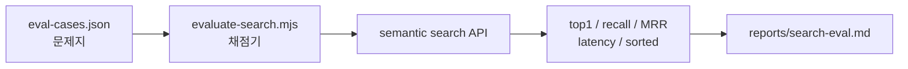

블로그에 `synaptic-memory` 기반 semantic search를 붙이고 나서 처음에는 꽤 그럴듯했다.

제목을 정확히 기억하지 못해도 관련 글을 추천해주고, 한글과 영어가 섞인 검색어도 어느 정도 따라왔다. `Pagefind`가 정적 전문 검색을 맡고, `synaptic-memory`가 의미 기반 추천을 보강하는 구조도 블로그에는 잘 맞았다.

이전에 [AI 회사 자율운영 플랫폼에 synaptic-memory + graph-tool-call을 통합한 과정](/posts/ai/agent/hive-corp-synaptic-memory-graph-tool-call-integration/)을 정리한 적이 있다. 그때의 관심이 "에이전트가 기억을 잘 꺼내 쓰게 만들기"였다면, 이번에는 조금 더 작고 직접적인 문제다. 내 블로그 검색창에서 이 라이브러리가 정말 쓸 만한 결과를 내고 있는지 확인하는 일이다.

그런데 며칠 써보니 이상한 기분이 들었다.

"좋아진 것 같은데, 진짜 좋아진 건가?"

검색창에 몇 개 쿼리를 넣어보면 감은 온다. 어떤 검색어는 잘 맞고, 어떤 검색어는 엉뚱하다. 하지만 감으로만 고치면 금방 길을 잃는다. 오늘 scorer를 조금 바꿔서 `RAG` 검색이 좋아져도, 내일 `딥러닝` 검색이 망가질 수 있다. `chunk`를 키웠더니 긴 글은 좋아졌는데 짧은 약어 검색은 흐려질 수도 있다.

검색 품질은 느낌으로 고치기 시작하면 끝이 없다. 그래서 작은 문제지를 만들기로 했다.

## 검색 엔진에도 문제지가 필요하다

처음 목표는 거창한 벤치마크가 아니었다. 이 블로그에 맞는 작은 시험지만 있으면 됐다.

- 이 검색어를 넣으면 어떤 글이 나와야 하는가
- 몇 번째 안에는 들어와야 성공인가
- 무관한 검색어에는 결과를 안 보여주는가
- 응답 속도가 검색 UX를 해치지 않는가
- 점수가 높은 순서대로 제대로 정렬되어 있는가

이 정도만 매번 같은 방식으로 확인해도, 개선 작업의 결이 달라진다.

그래서 저장소에 세 가지를 넣었다.

```text
search-service/eval-cases.json   # 검색 문제지
scripts/evaluate-search.mjs      # 채점기
reports/search-eval.md           # 사람이 읽는 리포트
```

실행은 단순하다.

```bash
pnpm run search:eval
```

기본으로는 운영 semantic search API를 때린다.

```bash
https://search.infoedu.co.kr/search?q=...
```

로컬 검색 서버를 테스트하고 싶으면 API 주소만 바꿔서 실행한다.

```bash
SEARCH_API=http://127.0.0.1:8182 pnpm run search:eval
```

배포 전에 실패를 강하게 잡고 싶을 때는 strict mode를 켠다.

```bash
SEARCH_EVAL_STRICT=true pnpm run search:eval
```

이 정도면 사이드 프로젝트에는 충분하다. 중요한 건 화려한 평가 시스템이 아니라, 매번 같은 문제를 풀게 하는 것이다.

## raw query 로그를 그대로 쓰지는 않는다

검색 평가를 만들 때 가장 쉬운 방법은 실제 사용자가 입력한 검색어를 저장하는 것이다. 하지만 블로그 검색어도 생각보다 민감할 수 있다.

누군가는 회사명, 개인 이름, 내부 프로젝트명, 장애 상황, 아직 공개하지 않은 기술명을 검색할 수 있다. 그래서 이 블로그에서는 raw query를 평가셋으로 바로 쓰지 않는다.

원칙은 단순하게 잡았다.

- 실제 raw query를 그대로 저장하지 않는다.
- 필요한 검색어는 사람이 보고 익명화해서 넣는다.
- 비공개 글이나 초안은 정답으로 넣지 않는다.
- 회사명, 고객사명, 내부 코드명은 일반화한다.
- 실패 사례는 원문보다 실패 유형으로 남긴다.

예를 들면 이런 식이다.

```json
{
  "id": "qdrant_workflow_hybrid",
  "query": "워크플로우 엔진 qdrant 하이브리드",
  "intent": "Qdrant 하이브리드 검색을 워크플로우 엔진에 붙인 글이 최상위여야 한다.",
  "type": "positive",
  "relevant": [
    "/posts/ai/xgen/xgen-1-0-workflow-engine-qdrant-hybrid-search/",
    "/posts/search-engine/qdrant/hybrid-queries/",
    "/posts/ai/xgen/qdrant-hybrid-search-sparse-dense-vector-integration/"
  ],
  "minTopScore": 0.75
}
```

여기에는 민감한 정보가 없다. 하지만 검색 엔진이 풀어야 할 과제는 남아 있다.

## 문제 유형을 나눈 이유

검색 점수 평균 하나만 보면 거의 아무것도 알 수 없다.

`RAG` 같은 짧은 약어 검색이 약한 것과, `대학원 Deeplearn` 같은 오타/혼합어 검색이 약한 것은 원인이 다르다. 무관한 검색어에 그럴듯한 결과를 뱉는 문제도 완전히 다른 층이다.

그래서 문제지를 유형별로 나눴다.

### 1. 정확한 키워드 검색

`RAG`, `K3s`, `ArgoCD`, `Qdrant`처럼 제목이나 태그에 가까운 검색어다.

이 유형은 semantic search가 너무 똑똑할 필요는 없다. 관련 글을 상위에 안정적으로 올리면 된다.

```json
{
  "id": "k3s_argocd_gitops",
  "query": "k3s argocd gitops",
  "intent": "K3s와 ArgoCD GitOps 배포 글이 1위권에 나와야 한다.",
  "type": "positive",
  "relevant": [
    "/posts/devops/infra/xgen-2-0-infra-k8s-argocd-ops-deploy/",
    "/posts/devops/infra/xgen-k3s-anatomy-4-cicd-jenkins-argocd/",
    "/posts/devops/infra/reusable-gha-helm-k3s-generic-deploy-platform-setup/"
  ],
  "minTopScore": 0.75
}
```

### 2. 의미 검색

제목을 정확히 몰라도 의도로 찾는 경우다.

```json
{
  "id": "search_api_llmops_compose",
  "query": "검색 API LLMOps docker compose",
  "intent": "Search API와 LLMOps Docker Compose 글이 나와야 한다.",
  "type": "positive",
  "relevant": [
    "/posts/devops/infra/search-api-llmops-docker-compose/"
  ],
  "minTopScore": 0.7
}
```

이런 케이스는 `synaptic-memory`가 힘을 내야 하는 구간이다. 제목 단어 몇 개만 맞추는 게 아니라, 글의 주제와 구조를 따라가야 한다.

### 3. 한글/영문/오타 혼합 검색

개발 블로그 검색어는 얌전하지 않다.

`딥러닝`, `deep learning`, `Deeplearn`이 섞인다. `vllm fastapi 500 오류`처럼 영문 라이브러리명과 한글 증상이 붙기도 한다.

그래서 이런 케이스를 일부러 넣었다.

```json
{
  "id": "deep_learning_typo_mixed",
  "query": "대학원 Deeplearn",
  "intent": "오타/혼합어 Deeplearn도 딥러닝 글로 보정되어야 한다.",
  "type": "positive",
  "relevant": [
    "/posts/ai/deep-learning/dropout/",
    "/posts/ai/deep-learning/tokenization/",
    "/posts/ai/deep-learning/transformer-query-key-value/"
  ],
  "minTopScore": 0.65
}
```

이 케이스는 단순한 lowercase 처리만으로는 어렵다. alias dictionary, typo normalization, tag relation, title boost가 같이 필요할 수 있다.

### 4. negative query

검색 품질에서 생각보다 중요한 게 "안 보여줘야 할 때 안 보여주는 능력"이다.

semantic search는 기본적으로 뭐라도 비슷한 걸 찾으려는 성향이 있다. 하지만 무관한 검색어에 자신 있게 엉뚱한 글을 추천하면 사용자는 검색을 믿지 않는다.

그래서 정답이 없어야 하는 문제도 넣었다.

```json
{
  "id": "gibberish_no_result",
  "query": "아무말 zzzznotfound 외계어",
  "intent": "무관 질의는 결과를 과신하지 않아야 한다.",
  "type": "negative",
  "relevant": [],
  "maxTopScore": 0.55,
  "maxResults": 0
}
```

이 문제는 검색 엔진에게 이렇게 묻는다.

"모르면 모른다고 할 수 있는가?"

나는 이 능력이 꽤 중요하다고 본다. 검색은 항상 결과를 내는 기능이 아니라, 사용자가 찾는 글이 없다는 사실도 정직하게 알려줘야 하는 기능이다.

## 채점기는 단순하게 만들었다

채점기는 `scripts/evaluate-search.mjs`에 있다. 하는 일은 크게 네 가지다.

1. `search-service/eval-cases.json`을 읽는다.
2. 각 query로 검색 API를 호출한다.
3. 결과 URL과 정답 URL을 비교한다.
4. `reports/search-eval.md`와 `reports/search-eval.json`을 만든다.

흐름은 이렇다.



지표도 일부러 너무 많이 넣지 않았다.

| 지표 | 보는 것 |
| --- | --- |
| `top1` | 첫 번째 결과가 정답인가 |
| `recall@5` | 상위 5개 안에 정답이 하나라도 있는가 |
| `MRR@5` | 첫 정답이 몇 번째에 나왔는가 |
| `sorted` | 결과 점수가 내림차순인가 |
| `negative pass` | 무관 질의에서 과신하지 않는가 |
| `latency` | 검색 응답이 UX 예산 안에 들어오는가 |

처음부터 복잡한 평가를 넣으면 평가 시스템 자체를 관리하느라 지친다. 지금은 `top1`, `recall@5`, `MRR@5`, `negative`, `latency` 정도가 가장 해석하기 쉽다.

## 실제로 돌려보니 뭐가 보였나

이 글을 쓰는 시점에 운영 검색 API를 대상으로 평가를 돌려봤다.

```bash
pnpm run search:eval
```

결과는 이렇게 나왔다.

```json
{
  "total": 10,
  "pass": 5,
  "fail": 5,
  "positiveTop1": 0.875,
  "positiveRecall": 1,
  "positiveMrr": 0.9166666666666666,
  "negativePass": 0,
  "sortedPass": 0.5,
  "avgLatencyMs": 150.45
}
```

처음 봤을 때 느낌은 반반이었다.

좋은 점도 있다. positive query는 상위 5개 안에 정답이 모두 들어왔다. `positiveRecall`이 1이라는 건 "찾아야 할 글을 아예 못 찾는" 문제는 크지 않다는 뜻이다. 평균 응답도 약 150ms라서 지금 규모에서는 충분히 빠르다.

하지만 약한 부분도 바로 보인다.

- `negativePass`가 0이다.
- `sortedPass`가 50%다.
- 오타/혼합어 검색에서 top1이 틀린 케이스가 있다.
- 무관 질의에 높은 점수를 주는 overconfidence가 있다.

이게 바로 평가 루프의 장점이다. 막연히 "검색이 별로다"가 아니라, 어디부터 고쳐야 하는지 말해준다.

## 가장 먼저 보인 문제: 점수 정렬

리포트에서 가장 자주 보인 실패는 `scores_not_sorted`였다.

예를 들어 `k3s argocd gitops` 검색은 정답 자체는 잘 찾았다.

```text
1. 0.910 K3s + ArgoCD로 AI 플랫폼 GitOps 배포 구축하기
2. 0.819 Reusable GitHub Actions와 Helm으로 K3s 범용 배포 플랫폼 구축하기
3. 0.824 XGEN K3s 인프라 완전 해부 (4) - CI/CD 파이프라인
```

정답은 상위에 있다. 하지만 2번 점수보다 3번 점수가 더 높다. 이건 사용자 눈에는 큰 문제가 아닐 수도 있지만, 검색 엔진 관점에서는 이상 신호다.

가능한 원인은 몇 가지다.

- chunk 단위 결과를 문서 단위로 합친 뒤 다시 정렬하지 않았다.
- stage별 score가 섞였는데 final score로 normalize되지 않았다.
- rerank 전후 결과 순서와 표시 점수가 어긋났다.
- 문서 dedup 이후 순서가 보존되면서 점수 정렬이 깨졌다.

이건 모델 문제가 아니라 결과 조립 문제에 가까워 보인다. 그래서 첫 번째 고도화 후보는 거창한 embedding 교체가 아니라 "문서 단위 merge 이후 final score 기준 재정렬"이다.

작지만 이런 수정이 검색 신뢰도를 많이 올린다.

## 더 중요한 문제: 모르면 모른다고 하기

더 심각한 건 negative query였다.

```text
query: 아무말 zzzznotfound 외계어
top1: OpenSearch 동의어(Synonym) 사전 관리 자동화
score: 0.865
```

이건 꽤 위험한 신호다. 무관한 검색어인데도 score가 높다. 검색 UI가 이 결과를 자신 있게 보여주면 사용자는 "이 검색은 아무거나 갖다 붙이는구나"라고 느낀다.

semantic search에서는 이런 일이 자주 생긴다. 임베딩 공간에서는 모든 문장이 어딘가에는 가장 가깝다. 그래서 top-k만 뽑으면 항상 결과가 나온다.

하지만 제품 검색 UX에서는 "가장 가까운 것"과 "보여줄 만큼 가까운 것"이 다르다.

여기서 필요한 것은 confidence gate다.

```text
if top_score < threshold:
  hide semantic results

if query looks like gibberish:
  require stronger lexical overlap

if semantic results are weak:
  let Pagefind stay as the primary result
```

이걸 평가셋에 넣어두면 threshold를 바꿀 때마다 바로 확인할 수 있다. 무관 질의가 다시 높은 점수로 튀어나오면 `SEARCH_EVAL_STRICT=true`에서 잡힌다.

## 오타와 혼합어는 alias 문제에 가깝다

`대학원 Deeplearn` 케이스도 흥미로웠다.

의도는 딥러닝 글 묶음을 찾는 것이다. 그런데 top1은 `DeepSeek` 지시문 글이었다.

```text
query: 대학원 Deeplearn
expected: 딥러닝 글
actual top1: 문서 처리 서비스에 DeepSeek 지시문 적용하기
```

왜 이런 일이 생겼을까.

`Deeplearn`이라는 입력은 사람 눈에는 `deep learning`의 짧고 어색한 표현처럼 보인다. 그런데 검색 엔진 입장에서는 `DeepSeek`의 `Deep`과도 가까워 보일 수 있다. 특히 한글 `딥러닝`과 영문 `deep learning`, 붙여쓴 `deeplearn` 사이를 명시적으로 이어주지 않으면 이상한 쪽으로 붙는다.

이 케이스의 고도화 후보는 명확하다.

```yaml
failure_type: mixed_language_alias_gap
candidate_fix:
  - korean_english_alias_dictionary
  - typo_normalization
  - title_and_tag_boost
  - acronym_dictionary
```

여기서 바로 scorer를 갈아엎으면 안 된다. 먼저 alias 문제인지, chunking 문제인지, title boost 문제인지 분리해야 한다. 평가셋이 있으면 이 분리가 쉬워진다.

## 실패를 backlog로 바꾸는 방식

검색 평가의 진짜 가치는 점수표가 아니다. 실패를 backlog로 바꾸는 데 있다.

예전에는 검색 결과가 이상하면 바로 코드를 만지고 싶었다. 하지만 한 쿼리만 보고 scorer를 바꾸면 다른 쿼리가 망가진다.

이제는 실패를 이렇게 남긴다.

```yaml
id: gibberish_no_result
symptom: 무관 질의에 높은 점수의 결과가 노출됨
failure_type: overconfident_negative
evidence:
  top_score: 0.865
  expected: no_result_or_low_confidence
candidate_fix:
  - semantic_confidence_threshold
  - lexical_overlap_guard
  - gibberish_detection
  - fallback_to_pagefind_only
```

그리고 비슷한 실패가 여러 개 쌓이면 그때 기능을 넣는다.

이 순서가 중요하다.


검색 품질 개선은 "기능을 많이 넣는 일"이 아니라 "반복되는 실패를 줄이는 일"에 가깝다.

## 지금 기준의 고도화 우선순위

이번 평가 결과만 놓고 보면 우선순위는 이렇다.

### 1. final score 기준 재정렬

`scores_not_sorted`가 여러 케이스에서 보였다. 이건 사용자가 직접 체감하기 전에도 고쳐야 하는 기본 정합성 문제다.

문서 단위로 결과를 합친 뒤에는 반드시 최종 score로 다시 정렬해야 한다.

```js
results.sort((a, b) => b.score - a.score);
```

단순해 보이지만, 검색 결과가 여러 stage를 거치면 이런 기본이 쉽게 깨진다.

### 2. negative query confidence gate

무관한 검색어에 높은 점수를 주는 문제를 먼저 막아야 한다.

검색 결과가 없으면 없는 대로 두는 게 낫다. 특히 semantic 추천은 보조 영역이므로, 확신이 낮으면 숨기는 편이 UX에 좋다.

### 3. 한글/영문 alias dictionary

`딥러닝`, `deep learning`, `deeplearn`, `DeepLearn` 같은 표현을 연결해야 한다. 기술 블로그에서는 이 문제가 계속 나온다.

처음부터 거대한 동의어 사전을 만들 필요는 없다. 평가셋에서 반복되는 alias부터 작게 넣으면 된다.

### 4. title, description, tag boost

본문 chunk가 우연히 query와 가까워서 제목이 더 정확한 글을 밀어내는 경우가 있다. 블로그 검색에서는 제목과 description, tag가 강한 신호다.

semantic score에 문서 메타데이터 boost를 섞는 방식이 필요하다.

### 5. Pagefind와 hybrid UI까지 평가 확장

현재 `evaluate-search.mjs`는 semantic search API를 먼저 평가한다. 하지만 실제 사용자는 `/search/` 페이지에서 Pagefind 결과와 semantic 추천을 같이 본다.

다음 단계는 세 층을 분리해서 보는 것이다.

- Pagefind only
- synaptic-memory only
- hybrid UI behavior

이렇게 나눠야 "semantic은 좋아졌는데 UI에서는 안 보인다"거나 "Pagefind가 이미 잘 찾는데 semantic이 위에서 공간을 낭비한다" 같은 문제를 잡을 수 있다.

## 매일 돌릴 필요는 없지만, 바꿀 때는 돌려야 한다

검색 평가는 매일 거창하게 돌릴 필요는 없다. 대신 검색 로직을 건드릴 때는 습관처럼 돌리는 게 좋다.

```bash
pnpm run search:eval
```

그리고 release 전에는 strict mode를 쓸 수 있다.

```bash
SEARCH_EVAL_STRICT=true pnpm run search:eval
```

리포트는 `reports/` 아래에 생긴다.

```text
reports/search-eval.md
reports/search-eval.json
```

이 저장소에서 `reports/`는 생성 산출물이라 커밋하지 않는다. 대신 의미 있는 개선 결과는 글이나 별도 문서에 요약하면 된다.

## 정리

`synaptic-memory`를 블로그 검색에 붙인 건 시작에 가깝다. 진짜 중요한 건 그 다음이다.

검색 결과가 좋아졌는지, 나빠졌는지, 어떤 유형에서 실패하는지 반복해서 볼 수 있어야 한다. 그래야 라이브러리 고도화도 감이 아니라 근거로 움직인다.

이번 작은 평가 루프가 보여준 결론은 단순하다.

- 관련 글을 찾는 능력은 이미 어느 정도 있다.
- 결과 정렬과 confidence gate는 더 다듬어야 한다.
- 오타/혼합어 처리는 alias layer가 필요하다.
- 검색 UI까지 포함한 hybrid 평가가 다음 단계다.

검색은 사용자가 블로그와 대화하는 입구다. 그 입구가 조금만 좋아져도 오래 쌓인 글들이 다시 살아난다. 그래서 나는 검색 평가셋을 꽤 좋아한다. 작고 조용하지만, 사이드 프로젝트를 "느낌 좋은 기능"에서 "계속 좋아지는 시스템"으로 바꿔준다.
