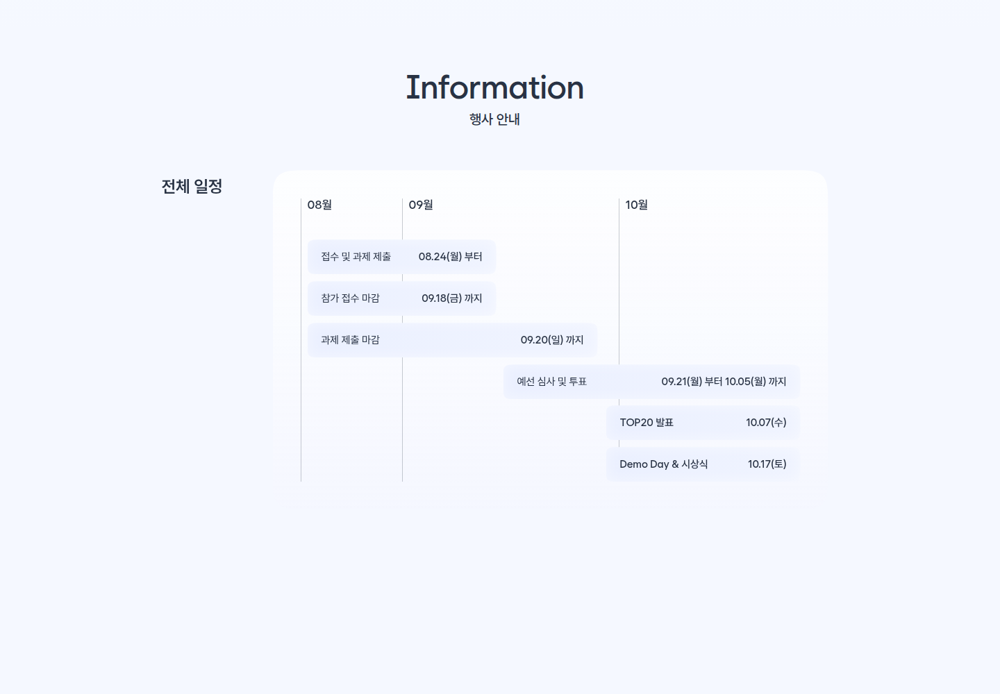
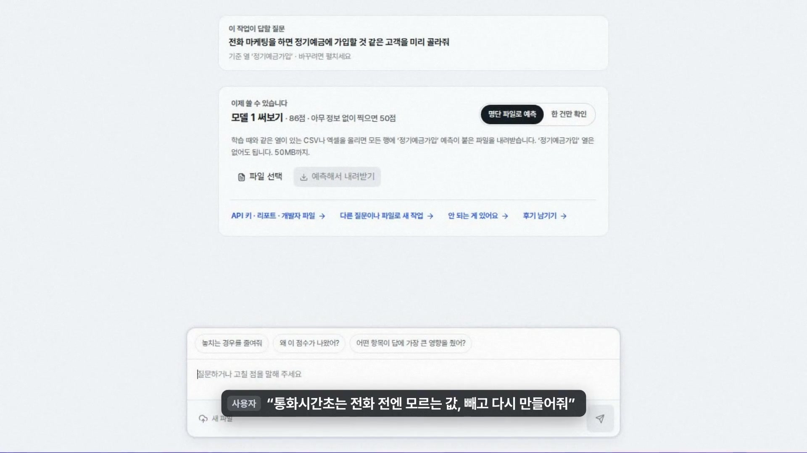
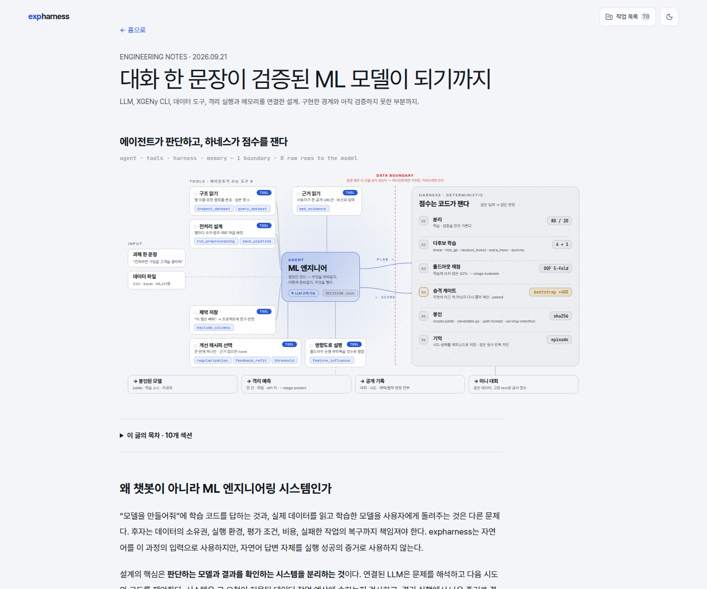
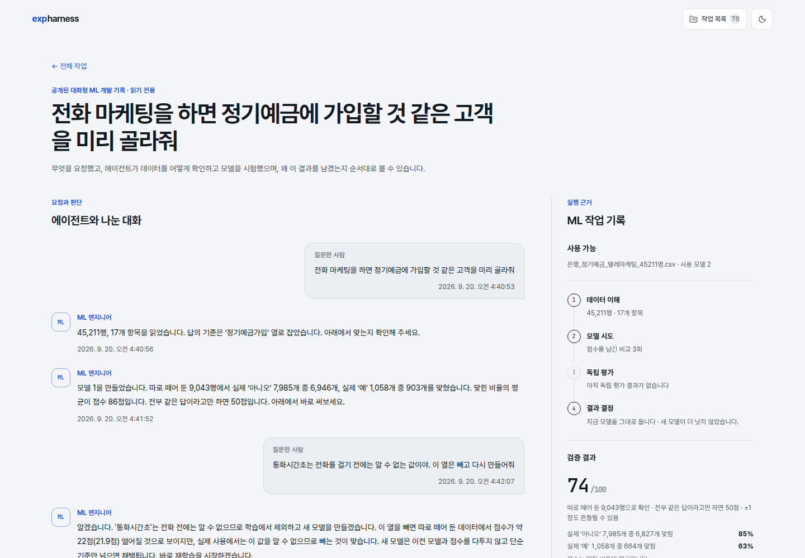

머신러닝 모델을 만들려면 보통 데이터를 읽고, 어떤 열을 예측할지 정하고, 여러 알고리즘을 시험한 뒤 가장 나은 모델을 골라야 한다. 모델이 실패하면 원인을 추측해 다시 코드를 고친다. 전문 지식뿐 아니라 반복 작업도 많이 필요한 과정이다.

이 과정을 대화로 줄일 수 있을까. 사용자가 데이터 파일과 원하는 결과를 설명하면 AI Agent가 데이터를 조사하고, 학습 코드를 작성하고, 실제로 실행한 결과를 보고 다음 시도를 고르는 서비스 말이다.

이 질문에서 [`expharness`](https://ml.bridge.infoedu.co.kr/)를 만들었다. 그리고 [원티드 AI Championship 2026](https://static.wanted.co.kr/ai-championship/2026/landing.html)에 작동하는 웹 서비스로 출품했다.

처음에는 Agent가 좋은 모델을 만들 수 있는지가 가장 어려운 문제라고 생각했다. 실제로 더 어려웠던 일은 따로 있었다. Agent가 말한 점수와 비용, 완료 사유를 어디까지 믿을 것인지 정하는 일이었다.

결론부터 말하면 설계 원칙은 한 문장으로 정리된다.

> Agent에게 판단은 맡기되, 사실 판정은 맡기지 않는다.

Agent는 가설과 코드를 제안한다. 하지만 데이터 분할, 점수 계산, 예산 차감, 실행 성공 여부와 최종 모델 선택은 바깥 시스템이 증거를 보고 결정한다. 이 분리가 없으면 AI는 틀린 점수를 자신 있게 설명하고, 시스템은 그 설명을 공식 사실처럼 보여줄 수 있다.

대회는 자유 주제로, 해결하려는 문제와 AI 활용 방법을 설명하고 실제 사용할 수 있는 서비스를 제출하는 방식이었다. 참가 접수는 9월 18일, 과제 제출은 9월 20일에 마감됐다. 이 글은 결과나 순위보다 마감일까지 제품을 실제로 작동시키며 확인한 설계와 실패를 다룬다.

## 데이터와 과제만 주세요

출품작의 목표는 사용자가 머신러닝 알고리즘을 먼저 고르지 않아도 되는 경험이었다.

예를 들어 고객 정보를 담은 표에서 정기예금 가입 여부를 예측하고 싶다고 하자. 사용자는 CSV나 Excel 파일을 올리고 "정기예금에 가입할 것 같은 고객을 골라줘"라고 말한다. Agent는 목표 열과 평가 방법을 확인하고 데이터를 조사한다. 이후 후보 코드를 작성해 제한된 환경에서 실행하고, 이전 후보보다 나아졌는지 확인한다.

대화 중 조건을 바꿀 수도 있다. 위 장면에서는 통화시간처럼 실제 예측 시점에 알 수 없는 값을 제외해 달라고 요청했다. 시스템은 기존 모델을 말로만 수정했다고 하지 않고, 해당 열을 뺀 새 후보를 다시 학습하고 비교한다.

### 100초로 보는 실제 사용 흐름

아래 영상은 공개된 [UCI Bank Marketing 데이터](https://archive.ics.uci.edu/dataset/222/bank+marketing)로 과제를 만들고, Agent가 학습한 모델에서 누수 가능성이 있는 `통화시간초` 열을 제외한 뒤 다시 학습하고, 예측과 공개 실행 기록까지 확인하는 흐름을 담았다.

<figure>
  <video
    controls
    playsinline
    preload="metadata"
    poster="/assets/videos/expharness-intro-v3-poster.jpg"
    width="1920"
    height="1080"
    aria-label="expharness에서 자연어 요청으로 모델을 만들고 데이터 누수 열을 제외해 다시 학습하는 100초 시연"
  >
    <source src="/assets/videos/expharness-intro-v3.mp4" type="video/mp4" />
    브라우저에서 영상을 재생할 수 없다면
    <a href="/assets/videos/expharness-intro-v3.mp4">MP4 파일을 열어 볼 수 있다.</a>
  </video>
  <figcaption>
    실제 서비스 화면을 녹화한 99.8초 시연이다. 데이터는 공개 사용이 허용된 UCI Bank Marketing을 사용했고, 화면의 자막은 편집 과정에서 추가했다.
  </figcaption>
</figure>

사용자에게는 하나의 대화처럼 보이지만 내부 책임은 나뉜다. 아래 그림은 제출 후 검증 계층을 더 확장하면서 [현재 구현을 한 장으로 정리한 기술 문서](https://ml.bridge.infoedu.co.kr/architecture)다. 제출 당시에도 Agent와 하네스를 분리하는 원칙은 같았지만, 후보 수와 승격 게이트 같은 세부 정책은 이후 계속 보완됐다.

Agent는 무엇을 시도할지 결정하지만 자기 답안에 점수를 매기지 않는다. 학습 코드는 네트워크가 없는 CPU 컨테이너에서 제한된 시간과 메모리로 실행한다. 호스트 평가기는 미리 고정한 데이터 분할과 지표로 결과를 계산한다. 점수와 산출물의 해시, 사용한 예산은 원장에 남긴다.

원본 데이터 행을 그대로 언어모델에 보내는 구조도 피했다. 데이터 파일은 격리 실행 영역에서 처리하고, Agent에는 허용된 스키마와 집계 결과를 전달했다. 개인정보가 들어갈 수 있는 표를 다루는 서비스에서 편의보다 먼저 정해야 할 경계였다.

## 별도 ML 대회는 제품이 아니라 검증 사례였다

비슷한 시기에 [위성영상 객체탐지 대회에서 Agent가 다음 실험을 고르는 자율 루프](/ai/agent/autonomous-agent-ml-hackathon-experiment-loop/)도 운영했다. 두 작업은 목적이 다르다.

원티드에 제출한 것은 데이터와 목표를 받아 모델 개발 과정을 수행하는 `expharness` 플랫폼이다. 위성영상 대회는 특정 문제에서 자율 실험 루프를 검증한 별도 사례다. 특정 대회의 모델이나 데이터를 제품 안에 넣어 범용 능력처럼 보이지 않도록 분리했다.

제출 범위도 의도적으로 좁혔다. 마감일까지 실제로 확인한 것은 독립적이고 동일한 분포를 가정할 수 있는 표 형식 데이터의 분류와 회귀였다. 이미지 전 과제, 대규모 GPU 학습, 모든 데이터에서의 자동 성능 향상은 제출 주장에 넣지 않았다.

## 점수가 0.820에서 0.709로 떨어졌는데 더 좋아졌다

개발 중 가장 중요한 수정은 성능을 올린 기능이 아니었다. 부풀려진 점수를 낮춘 기능이었다.

새 데이터를 추가한 뒤 기존 우승 모델을 다시 평가하는 과정에서 `balanced accuracy`가 `0.820`으로 나왔다. Balanced accuracy는 각 정답 종류를 얼마나 고르게 맞혔는지 보는 점수다. 불균형한 분류 문제에서 단순 정확도보다 한쪽 답에 치우친 모델을 찾기 쉽다.

문제는 평가 데이터 일부를 그 모델이 이미 학습에 사용했다는 점이었다. 시험을 치른 학생에게 같은 문제를 다시 주고 실력이 늘었다고 판단한 셈이다. 이를 데이터 누수라고 한다.

학습에 사용한 행과 평가에 남겨 둔 행의 해시를 따로 기록하도록 바꿨다. 재평가할 때는 모델이 한 번도 보지 않은 행만 사용했다. 같은 시나리오의 점수는 `0.820`에서 `0.709`로 내려갔다.

숫자만 보면 퇴보다. 하지만 `0.709`는 모델이 한 번도 학습하지 않은 90행에서 독립 계산한 값과 일치했다. 거짓으로 높은 점수보다 낮아도 재현 가능한 점수가 제품에는 더 유용했다.

이 사건은 Agent에게 평가까지 맡기면 안 되는 이유를 분명하게 보여줬다. Agent가 정직하게 행동해도 입력으로 받은 점수가 오염돼 있으면 잘못된 방향을 선택한다. 데이터 분할과 비교 대상은 프롬프트의 부탁이 아니라 시스템 계약이어야 했다.

## 모르는 비용을 0원으로 기록하면 예산은 장식이 된다

모델 제공자가 토큰 사용량은 알려주지만 정확한 비용을 알려주지 않는 경우가 있었다. 초기 구현은 이런 호출을 0원으로 기록했다.

100원짜리 시험 예산으로 질문을 20번 해도 사용액은 계속 0원이었다. 예산 제한은 화면에만 존재했고 실제로는 한 번도 작동하지 않았다.

해결은 모르는 비용을 싸다고 가정하지 않는 것이었다. 정확한 비용이 오지 않으면 호출마다 허용한 최대 금액을 예약했다. 같은 조건에서 여덟 번 호출 후 예약액이 101원에 도달했고, 아홉 번째 요청부터는 모델 호출 없이 안전한 규칙 기반 응답으로 전환됐다.

여기서 101원은 실제 청구액이 아니다. 최악의 경우를 대비해 잡아 둔 상한이다. 화면에서도 `실제 비용`과 `예약 비용`을 구분했다.

운영 시스템에서 `unknown`은 `zero`와 다르다. 측정하지 못한 시간을 0초로, 확인하지 못한 위험을 0으로 기록하면 제한 장치는 가장 필요한 순간에 작동하지 않는다.

## Agent의 설명과 시스템의 사실이 충돌했다

공개 데이터로 실제 회귀 모델 두 개를 비교했을 때도 비슷한 문제가 나왔다. Agent는 선형 모델인 Ridge를 먼저 만들고, 결과를 본 뒤 비선형 관계를 잡기 위해 Random Forest를 제안했다.

개발 데이터에서 결정계수 `R²`는 `0.5237`에서 `0.5488`로 올랐고, 별도로 남겨 둔 최종 데이터에서는 `0.5490`이었다. R²는 예측이 단순 평균보다 얼마나 나은지 보는 회귀 지표다. 1에 가까울수록 좋지만, 이 한 번의 결과가 다른 데이터에서도 같은 개선을 보장하지는 않는다.

문제는 모델 선택 뒤의 설명이었다. Agent는 "추가 실험 예산이 없다"며 종료를 제안했다. 그 판단 시점의 실제 원장에는 예약 예산 672원이 남아 있었고, 후보 한 개를 더 시험할 여지도 있었다. 이후 최종 평가와 웹 예측을 실행하면서 예약 사용액이 328원에서 368원으로 늘었다.

조기 종료 자체는 잘못이 아니다. 더 시도할 가치가 없다고 판단할 수 있다. 잘못된 것은 Agent의 설명을 시스템 메시지로 그대로 게시한 일이었다.

이후 종료 이유를 둘로 나눴다.

- Agent의 원문은 `제안`으로 보존한다.
- 시스템은 실제 후보 수, 잔여 예산, 최종 평가 예약액을 원장에서 다시 계산한다.
- `모델이 종료를 선택함`, `후보 수 제한`, `예산 소진`을 서로 다른 상태로 기록한다.

Agent가 판단을 내릴 수는 있지만, 예산이 남았는지 같은 사실까지 결정하게 해서는 안 됐다.

조회 화면은 결과만 보여주는 대시보드가 아니다. 사용자가 무엇을 요청했고 Agent가 어떤 후보를 만들었으며, 어느 점수를 근거로 무엇을 선택했는지 순서대로 확인하는 기록이다. 이 화면은 제출 후에도 같은 원칙을 유지하며 확장한 현재 공개 기록이다.

## 첫 실제 모델 실행은 학습까지 가지 못했다

완성된 성공 화면만 보면 처음부터 자연스럽게 작동한 것처럼 보인다. 실제 첫 모델 시험은 [UCI Wine 데이터](https://archive.ics.uci.edu/dataset/109/wine)로 진행했지만 코드 생성 단계에서 멈췄다. 178행, 13개 특징으로 와인의 종류를 분류하는 작은 공개 데이터라 전체 흐름을 빠르게 확인하기에 적당했다.

시스템은 사용자 목표를 일부 잘못 해석했고, 이미 알려 준 데이터 분할을 다시 물었다. 조건을 보완한 뒤에는 모델 제공자의 제한에 걸려 후보 코드를 만들지 못했다. 제품 화면에는 구체적인 원인 대신 일반적인 `xgeny_run_failed`만 표시됐다.

더 큰 문제는 코드에 있던 `max_tokens=4000` 값이 실제 명령줄 도구의 생성 한도로 전달되지 않았다는 점이었다. 내부 변수 이름만 보면 제한이 적용된 것 같았지만 실행 계약에는 연결되지 않았다.

실패 원장을 확인해 `provider_limit`를 별도 상태로 보존하고, 원인을 모르는 실패와 구분했다. 정확한 제한을 알 수 없는 경우에는 토큰 부족이나 HTTP 오류 중 하나로 단정하지 않았다. 같은 요청을 자동으로 반복하는 기능도 넣지 않았다. 실패 원인을 모르면서 재시도하면 비용만 늘고 같은 오류를 재생할 수 있기 때문이다.

이 실패 뒤에야 데이터 이해, 코드 생성, 컨테이너 학습, 후보 비교, 최종 평가, 웹 예측, 다운로드까지 한 흐름으로 통과했다. 유명한 소규모 공개 데이터로 통합 동작을 확인한 것이므로, 이를 Agent의 일반적인 ML 실력 증명으로 부풀리지는 않았다.

## 제출 당일에는 정상 배포가 세 번 실패로 판정됐다

ML 시스템도 결국 사용자가 접속할 수 있는 웹 서비스여야 했다. 제출 마감일에는 모델보다 배포가 더 큰 문제였다.

운영 서버의 디스크 입출력이 포화된 상태에서 배포가 세 번 실패했다. 릴리스 자체는 정상이었지만 검증 단계가 평소보다 오래 걸렸다.

첫 번째 실패에서는 앱이 뜨는 데 9초가 걸렸는데 헬스체크가 약 7초 만에 포기하고 롤백했다. 두 번째는 모델 생성 확인 작업이 5초 안에 끝나지 않아 실패했다. 마지막에는 1080p 소개 영상이 추가되면서 복사, 압축 해제, 기동, 헬스체크를 합친 시간이 전체 180초 제한을 넘었다.

처음에는 제한 시간을 늘리면 느린 배포를 숨기는 것처럼 느껴졌다. 하지만 둘은 다른 문제였다.

> 타임아웃은 "얼마나 빨라야 하는가"가 아니라 "언제 포기할 것인가"다.

상태가 바뀌면 즉시 다음 단계로 넘어가기 때문에 상한을 90초나 420초로 늘려도 평소 배포가 느려지지 않는다. 속도 회귀는 별도 성능 측정으로 잡고, 배포 게이트는 부하가 있는 정상 실행을 거짓 실패로 만들지 않도록 조정했다.

제출 직전의 이 사건은 ML 제품도 결국 웹 서비스라는 사실을 다시 보여줬다. 좋은 모델이 있어도 사용자가 접속할 수 없으면 출품작은 작동하지 않는다.

## 마감일까지 확인한 범위

마감일까지 공개 데이터로 다음 흐름을 확인했다.

1. 자연어 목표와 파일을 받아 실행 조건을 확정했다.
2. Agent가 서로 다른 두 후보의 실제 학습 코드를 작성했다.
3. 두 후보를 같은 개발 데이터와 같은 지표로 비교했다.
4. 선택된 후보를 개발에 사용하지 않은 데이터로 한 번 더 평가했다.
5. 웹에서 새 행을 입력해 예측하고 모델과 소스 묶음을 내려받았다.
6. 서버를 다시 시작한 뒤에도 완료 상태와 기록이 복구됐다.

이 검증은 전복의 물리적 측정값으로 나이를 추정하는 [UCI Abalone 데이터](https://archive.ics.uci.edu/dataset/1/abalone) 4,177행에서 약 5분 27초가 걸렸다. 후보는 Ridge에서 Random Forest로 바뀌었고 개발 R²는 약 `0.0251` 높아졌다. 예약 예산 원장은 웹 예측 한 번까지 포함해 1,000원 중 368원을 사용한 것으로 기록했다. 두 UCI 데이터는 모두 CC BY 4.0으로 공개돼 있다.

여기에는 분명한 한계가 있다.

- 한 개의 표 형식 회귀 과제에서 확인한 결과다.
- CPU 컨테이너에서 실행했으며 GPU 학습을 검증하지 않았다.
- 다음 후보가 항상 이전 후보보다 좋아진다는 뜻이 아니다.
- 성능이 나빠진 뒤 다른 전략으로 실제 회복하는 기능은 당시 합성 테스트까지만 통과했다.
- 예약 예산은 실제 청구 비용이 아니다.

제출 후 화면과 기능은 계속 바뀌었다. 따라서 현재 서비스에서 보이는 모든 기능을 마감 당시 완성된 기능으로 설명하지 않는다. 출품 시점의 주장은 대화로 모델 제작, 같은 조건의 비교, 독립 평가, 예측과 다운로드까지였다.

## 해커톤에서 얻은 네 가지 기준

### 1. Agent는 제안하고 하네스는 증명해야 한다

언어모델은 다음 가설과 코드를 만드는 데 유용했다. 하지만 점수, 비용, 성공 상태는 실행 기록에서 계산해야 했다. 자연어 설명은 근거가 아니라 검토할 주장이다.

### 2. 가장 좋은 모델보다 가장 좋은 기록을 먼저 보존해야 한다

새 후보가 실패해도 이전 최선 모델을 잃지 않게 했다. 어떤 데이터로 어떤 코드를 실행했고 왜 선택했는지 남아 있어야 결과를 다시 사용할 수 있다. 실험 횟수가 많아지는 것보다 계보가 끊기지 않는 것이 중요했다.

### 3. 모르는 값은 0이 아니다

알 수 없는 비용을 0원으로 취급하자 예산 제한이 무력해졌다. 알 수 없는 실패를 일반 오류로 뭉개자 복구 방법도 찾을 수 없었다. `unknown`을 별도 상태로 보존하는 것이 보수적인 시스템의 출발점이었다.

### 4. 낮아진 점수가 더 나은 제품을 만들 수 있다

데이터 누수를 제거하자 점수는 `0.820`에서 `0.709`로 떨어졌다. 대신 실제 새 데이터에서 재현되는 값이 됐다. ML 제품에서 신뢰할 수 있는 낮은 숫자는 설명할 수 없는 높은 숫자보다 가치가 크다.

## AI에게 일을 맡긴다는 것

이 프로젝트를 시작할 때는 사용자의 일을 얼마나 많이 대신할 수 있는지를 봤다. 끝날 때는 시스템이 Agent를 얼마나 잘 의심하는지가 더 중요해졌다.

Agent가 코드를 쓰고 다음 실험을 고르는 것만으로는 자율 ML 개발이 완성되지 않는다. 틀린 점수를 거부하고, 모르는 비용을 숨기지 않고, 이미 얻은 최선을 보존하고, 말과 실제 상태가 다를 때 원장을 믿는 장치가 필요하다.

`expharness`에서 하네스는 Agent의 능력을 제한하는 껍데기가 아니었다. Agent의 판단을 실제로 사용할 수 있는 결과로 바꾸는 검증 장치였다.

AI에게 더 많은 결정을 맡길수록 바깥 시스템은 더 단순해지는 것이 아니라 더 엄격해져야 한다. 원티드 해커톤에 서비스를 제출하며 얻은 가장 큰 결론은 그것이었다.

> 이 글의 시연과 수치는 공개 사용이 허용된 데이터와 자체 실행 기록을 바탕으로 정리했다. 사용자 데이터, 인증 정보, 내부 프롬프트와 운영 경로는 포함하지 않았다. 공개 화면의 예측 결과는 제품 흐름을 설명하기 위한 사례이며 일반적인 모델 성능을 보장하지 않는다.
