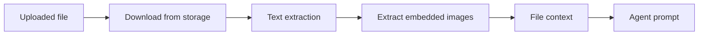
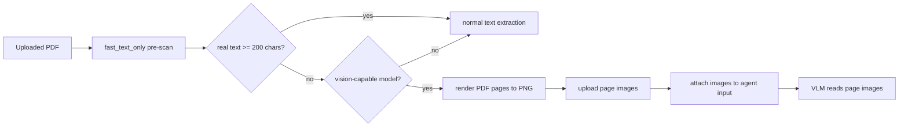
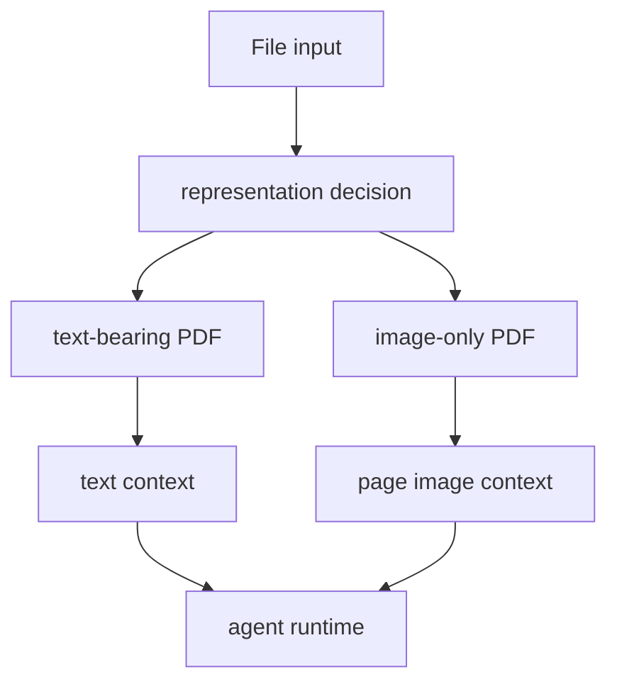

## PDF라고 다 같은 PDF가 아니었다

문서 처리에서 제일 애매한 실패는 "파일이 깨졌다"가 아니라 "텍스트가 없는 PDF를 텍스트로 읽으려 했다"일 때다.

사용자는 PDF를 올렸고, 시스템은 PDF를 처리한다고 말한다. 그런데 안쪽을 열어보면 그 PDF는 텍스트 문서가 아니라 스캔된 이미지 묶음일 수 있다. 사람 눈에는 같은 문서처럼 보이지만, 텍스트 추출기 입장에서는 전혀 다른 입력이다.

텍스트 레이어가 있는 PDF는 비교적 단순하다. 페이지에서 문자열을 추출하고, 표와 이미지가 있으면 보조 처리를 붙이면 된다. 하지만 스캔 PDF는 다르다. 페이지 전체가 이미지라서 일반적인 텍스트 추출기는 빈 문자열을 반환하거나, `[Page Number]`, `[Image]` 같은 구조 마커만 남긴다.

이 상태에서 에이전트에게 "이 파일을 분석해 줘"라고 보내면 이상한 일이 생긴다.

에이전트는 실제 문서 내용을 본 적이 없다. 그런데 파일이 있다는 사실, 파일명, 빈 추출 결과, 약간의 구조 마커만 보고 답을 만들려고 한다. 사용자는 PDF를 올렸다고 생각하지만, 모델은 정작 PDF의 내용을 읽지 못한 상태다.

이번 작업의 핵심은 OCR 하나를 붙이는 것이 아니었다. 더 정확히는 문서를 모델이 이해할 수 있는 입력 형태로 바꿔 주는 경로를 만드는 일이었다.

## 기존 경로는 텍스트 PDF에 맞춰져 있었다

기존 XGEN Agent의 파일 처리 흐름은 대략 이랬다.



이 구조는 텍스트 기반 문서에는 잘 맞는다. PDF에서 텍스트를 뽑고, 문서 안에 이미지 태그가 있으면 이미지를 별도 첨부로 넘긴다. 추출된 텍스트는 파일 컨텍스트로 들어가고, 에이전트는 그 내용을 바탕으로 답한다.

하지만 스캔 PDF에서는 병목이 앞단에서 생긴다.

텍스트 추출기는 "텍스트가 없음"을 제대로 알려줘야 한다. 그런데 실제 운영에서는 더 지저분한 상태가 나온다.

- 추출 결과가 거의 비어 있다.
- 페이지 수가 많으면 구조 마커만 길게 쌓인다.
- 무거운 추출 경로를 바로 태우면 오래 걸린다.
- 처리 시간이 긴 것과 파일이 깨진 것을 사용자에게 같은 오류처럼 보여주기 쉽다.
- 모델이 비전 입력을 받을 수 있는데도 PDF를 이미지로 보여주는 경로가 없다.

처음에는 스캔 문서라면 OCR 처리 옵션을 고르면 된다고 생각하기 쉽다. 하지만 에이전트 파일 입력에서는 이 선택이 매번 사용자에게 노출되면 안 된다. 사용자는 "이게 텍스트 PDF인지 스캔 PDF인지"를 알고 싶어서 파일을 올리는 게 아니다. 그냥 읽히길 기대한다.

그래서 기본 경로에서 먼저 해야 할 일은 자동 판별이었다.

## 먼저 가볍게 본다

해결의 첫 단계는 full extraction이 아니라 fast pre-scan이었다.

전체 문서 처리를 바로 시작하지 않고, 먼저 아주 싼 방식으로 "이 PDF 안에 실제 텍스트가 있는가"만 확인한다. 이 경로에서는 이미지 추출, 표 분석, OCR, 메타데이터 처리를 건너뛴다. 목적은 좋은 추출 결과를 만드는 것이 아니라, 문서의 타입을 빨리 판별하는 것이다.

개념적으로는 이렇게 동작한다.

```python
def should_use_vision_path(pdf) -> bool:
    text = fast_text_only(pdf)
    real_text = remove_structure_markers(text)
    return len(real_text.strip()) < 200
```

여기서 중요한 점은 `text`의 길이를 그대로 믿지 않는다는 것이다.

스캔 PDF에서도 추출기가 완전히 빈 문자열만 주는 것은 아니다. 페이지 번호, 이미지 위치, 내부 마커 같은 구조 정보가 문자열로 남을 수 있다. 페이지가 많은 PDF에서는 이런 마커만으로도 길이가 꽤 늘어난다. 그러면 텍스트가 있는 문서로 오판한다.

그래서 판별 전에 구조 마커를 제거했다.

```text
[Page Number: 1]
[Image: ...]
[Page Number: 2]
[Image: ...]
```

이런 문자열은 본문이 아니다. 에이전트가 읽을 수 있는 문서 내용도 아니다. 따라서 사전스캔에서는 제거한 뒤 실제 텍스트 길이만 본다.

기준값은 200자다. 너무 높게 잡으면 짧은 텍스트 PDF까지 스캔 문서로 오판할 수 있고, 너무 낮게 잡으면 스캔 PDF를 놓칠 수 있다. 여기서는 "일반적인 문서 본문이 있다면 최소한 이 정도는 나온다"는 보수적인 기준으로 잡았다.

## 텍스트가 없으면 페이지를 이미지로 바꾼다

사전스캔 결과 실제 텍스트가 거의 없으면 기존 텍스트 추출 경로를 고집하지 않는다. PDF 페이지를 이미지로 렌더링하고, 그 이미지를 VLM에 직접 보여준다.

전체 흐름은 이렇게 바뀐다.



여기서 포인트는 "스캔 PDF를 OCR 텍스트로 바꿔서 다시 텍스트 모델에 넣는다"가 아니다. 문서가 이미지라면 이미지로 보이게 한다. 비전 모델이 있다면 페이지 이미지를 직접 읽게 하는 편이 더 자연스럽다.

이를 위해 문서 처리 서비스 쪽에는 `render-pdf-pages` 성격의 경로를 추가했다. 이 경로는 PDF의 앞쪽 페이지를 PNG로 렌더링하고, 기존 파일 저장소에 업로드한 뒤, 이미지 경로 목록을 반환한다.

렌더된 페이지는 새로운 별도 타입으로 다루지 않았다. 기존 이미지 파일 파이프라인과 같은 계약을 사용했다.

```text
PDF page render
-> PNG image
-> storage upload
-> image file_info
-> agent image input
```

이 선택이 중요했다. "PDF 페이지 이미지"라는 특수한 타입을 새로 만들면 에이전트 실행부, 이미지 처리부, 프롬프트 구성부가 모두 복잡해진다. 이미 이미지 입력을 처리하는 경로가 있으니, 렌더된 페이지도 그 경로에 태웠다.

## 모델이 볼 수 없으면 조용히 기존 경로로 돌아간다

모든 모델이 이미지를 볼 수 있는 것은 아니다. 그래서 파일 처리보다 먼저 provider와 model을 확정해야 했다.

기존에는 파일 처리 후에 모델을 결정해도 됐다. 텍스트 추출만 한다면 모델의 종류를 몰라도 된다. 하지만 스캔 PDF를 비전 경로로 보낼지 결정하려면 현재 모델이 vision-capable인지 알아야 한다.

그래서 실행 순서를 조금 앞당겼다.

```text
1. provider/model/base_url 결정
2. 파일 다운로드
3. PDF fast pre-scan
4. vision 가능 여부 확인
5. 가능하면 페이지 렌더링
6. 불가능하면 기존 텍스트 추출 경로로 fallback
```

이 fallback은 제품 안정성 측면에서 중요하다.

비전 경로는 어디까지나 더 좋은 읽기 경로다. 이 경로가 실패했다고 전체 실행을 깨면 안 된다. 사전스캔 실패, 렌더링 실패, 이미지 다운로드 실패, 비전 미지원 모델 같은 상황에서는 기존 텍스트 추출 경로로 돌아간다.

이 원칙을 세웠다.

```text
vision path is best-effort.
existing text path remains the safe fallback.
```

덕분에 새 기능이 기존 문서 처리 동작을 깨지 않는다. 텍스트 PDF는 그대로 텍스트로 처리되고, 스캔 PDF만 가능한 경우에 비전 경로를 탄다.

## 강제 옵션도 필요했다

자동 판별만 있으면 충분해 보이지만, 운영에서는 강제 옵션도 필요하다.

어떤 PDF는 텍스트가 조금 있긴 하지만 핵심 정보는 이미지 안에 있다. 예를 들어 양식 문서, 스캔 위에 얇은 텍스트 레이어가 붙은 문서, 표가 이미지로 들어간 문서가 그렇다. 이런 경우 사전스캔은 "텍스트가 있다"고 판단할 수 있지만, 사용자는 페이지 그대로를 보고 싶어 한다.

그래서 파일 처리 방식에 `vision_pages` 옵션을 추가했다.

```text
default:
  fast pre-scan으로 스캔 PDF를 자동 판별한다.

vision_pages:
  모든 PDF를 페이지 이미지로 렌더링해서 비전 모델에 직접 보여준다.
```

기본값은 자동 판별이다. 사용자가 특별히 조정하지 않아도 텍스트 레이어가 없는 PDF를 읽게 만드는 것이 목표였기 때문이다. 하지만 문제가 있는 문서에서는 강제로 페이지 렌더링 경로를 탈 수 있어야 한다.

이런 옵션은 제품에서 작지만 중요하다. 자동화는 80%의 사용성을 만든다. 강제 옵션은 나머지 20%의 디버깅 가능성을 만든다.

## 페이지 수는 무한히 늘릴 수 없다

PDF를 이미지로 렌더링하면 한 가지 제약이 바로 생긴다. 페이지 수가 곧 이미지 수가 된다.

VLM 입력은 공짜가 아니다. 페이지를 전부 이미지로 넣으면 비용과 지연 시간이 빠르게 늘어난다. 특히 긴 PDF에서는 앞부분만 읽어도 충분한 경우가 많고, 반대로 특정 페이지를 지정해야 하는 경우도 있다.

이번 구현에서는 기존 `max_images` 값을 렌더링할 최대 페이지 수로 재사용했다. 예를 들어 최대 이미지 수가 20이면 PDF 앞쪽 20페이지만 렌더링한다.

그리고 에이전트에게 이 사실을 명시한다.

```text
이 파일은 텍스트 레이어가 없는 스캔/이미지 PDF입니다.
페이지 이미지 20/53개를 첨부했습니다.
첨부된 페이지 이미지를 직접 읽고 답변하세요.
전체 53페이지 중 앞 20페이지만 포함되었습니다. 답변 시 이 범위를 명시하세요.
```

이 문장이 꽤 중요하다. 모델은 자신이 전체 문서를 봤는지 일부만 봤는지 알아야 한다. 그래야 답변에서 "첨부된 범위 기준"이라고 말할 수 있다.

좋은 파일 처리 파이프라인은 내용을 넘기는 데서 끝나지 않는다. 모델이 어떤 범위의 근거를 봤는지도 같이 알려줘야 한다.

## 느린 것과 깨진 것을 구분해야 한다

파일 처리에서 사용자 경험을 망치는 문장 중 하나가 "파일이 손상되었습니다"다.

물론 실제로 파일이 깨졌을 수도 있다. 하지만 대용량 문서, 이미지가 많은 문서, 추출기가 오래 걸리는 문서는 깨진 것이 아니라 느린 것이다. 이 둘을 같은 오류로 보여주면 사용자는 잘못된 조치를 한다. 파일을 다시 올리거나, 원본이 깨졌다고 생각하거나, 시스템을 믿지 않게 된다.

그래서 타임아웃을 별도 오류로 분리했다.

```text
ERROR564:
  텍스트 추출 중 오류가 발생했다.
  파일 손상 가능성을 확인해야 한다.

ERROR570:
  파일 처리 시간이 초과됐다.
  파일이 손상된 것이 아니라 용량이 크거나 이미지가 많아 오래 걸리는 상황이다.
```

이건 기능이라기보다 운영 언어에 가깝다. 같은 실패라도 사용자가 다음에 무엇을 해야 하는지 알 수 있어야 한다. "손상"이면 파일을 확인해야 하고, "시간 초과"면 파일을 나누거나 처리 시간을 늘려야 한다.

문서 처리 시스템에서는 이런 작은 문구가 디버깅 시간을 크게 줄인다.

## fast path도 의존성을 믿기만 하면 안 된다

이번 작업에서 예상보다 중요했던 부분은 fast path의 안정성이었다.

처음 의도는 `fast_text_only`를 문서 처리 라이브러리의 빠른 추출 진입점에 연결하는 것이었다. 그런데 실제 확인 과정에서 PDF fast 추출 경로가 특정 버전에서 깨지는 문제가 있었다. 더 나쁜 점은, 빠른 경로가 깨졌을 때 안전한 fallback으로 전체 추출을 타면서 사전스캔이 느려진다는 점이었다.

사전스캔은 빠르기 위해 존재한다. 그런데 내부 fallback 때문에 full extraction처럼 느려지면 설계 목적이 사라진다.

그래서 PDF의 fast path는 `fitz`를 직접 사용해 페이지 텍스트만 뽑는 경로로 분리했다.

```python
def fast_pdf_text(path: str) -> str:
    parts = []
    with fitz.open(path) as doc:
        for page in doc:
            parts.append(page.get_text())
    return "\n".join(parts)
```

이 코드는 완성도 높은 문서 추출기가 아니다. 그럴 필요도 없다. 여기서 필요한 것은 표 구조 복원이나 이미지 분석이 아니라, 텍스트 레이어가 존재하는지 빠르게 확인하는 것이다.

역할이 좁을수록 구현은 단순해질 수 있다. 그리고 단순한 구현은 운영에서 더 잘 버틴다.

## 결과적으로 입력 표현이 하나 늘었다

이번 변경을 기능 목록으로 쓰면 "스캔 PDF 지원"이라고 말할 수 있다. 하지만 내부적으로는 더 정확히 이렇게 표현하는 편이 맞다.

에이전트가 파일을 읽는 방식에 새로운 입력 표현이 추가됐다.

```text
텍스트 PDF:
  PDF -> extracted text -> file context -> agent

스캔 PDF:
  PDF -> page images -> image attachments -> VLM agent
```

이 차이를 분명히 두면 설계가 깔끔해진다.



기존 시스템은 문서를 텍스트로 환원하려 했다. 이제는 문서의 실제 형태에 맞춰 텍스트 컨텍스트와 이미지 컨텍스트를 나눠서 전달한다.

LLM 시대의 문서 처리는 결국 이 방향으로 간다. 모든 입력을 텍스트 하나로 밀어 넣는 것이 아니라, 모델이 잘 볼 수 있는 형태를 선택해야 한다. 텍스트는 텍스트로, 이미지는 이미지로, 표는 가능하면 구조로, 긴 문서는 범위와 출처를 붙여서 넘겨야 한다.

## 남은 과제

이번 작업으로 스캔 PDF를 읽는 기본 경로는 생겼지만, 끝난 문제는 아니다.

첫 번째는 페이지 선택이다. 지금은 앞쪽 N페이지를 렌더링하는 방식이다. 사용자가 특정 페이지를 묻거나, 목차를 보고 관련 페이지만 고르는 경로가 붙으면 비용을 줄이면서 정확도를 높일 수 있다.

두 번째는 부분 OCR과 VLM의 역할 분리다. 모든 스캔 PDF를 VLM에 직접 보여주는 것이 항상 최선은 아니다. 반복 조회가 많은 문서는 OCR 결과를 캐시해서 텍스트 검색이 가능하게 만드는 편이 낫다. 반면 일회성 분석이나 레이아웃 이해가 중요한 문서는 VLM이 더 자연스럽다.

세 번째는 citation이다. 페이지 이미지를 읽은 답변도 "몇 페이지에서 본 내용인지"를 남겨야 한다. 현재는 페이지 이미지 이름에 `p1/total` 같은 정보를 붙여 모델이 범위를 알 수 있게 했지만, 장기적으로는 답변의 근거 표시까지 이어져야 한다.

네 번째는 평가셋이다. 스캔 PDF, 텍스트 PDF, 혼합 PDF를 따로 모아야 한다. 단순히 "답이 맞았다"만 볼 게 아니라, 어떤 경로를 탔는지, 텍스트 PDF를 스캔으로 오판하지 않았는지, 스캔 PDF를 기존 추출로 흘려보내지 않았는지를 같이 봐야 한다.

## 정리

이번 작업의 핵심은 스캔 PDF를 읽게 만든 것이지만, 더 큰 관점에서는 에이전트 파일 입력의 원칙을 다시 세운 작업이었다.

문서가 텍스트면 텍스트로 읽는다. 문서가 이미지면 이미지로 보여준다. 둘을 구분하기 위해 먼저 가볍게 본다. 자동 판별이 틀릴 수 있으니 강제 옵션을 둔다. 새 경로가 실패해도 기존 경로로 돌아간다. 사용자가 해야 할 다음 행동이 다르다면 오류 메시지도 다르게 말한다.

에이전트가 파일을 잘 읽게 하려면 모델만 좋아져서는 부족하다. 모델 앞에 놓이는 입력 표현을 잘 만들어야 한다. 스캔 PDF 비전 경로는 그 방향으로 간 작은, 하지만 꽤 실용적인 개선이었다.
