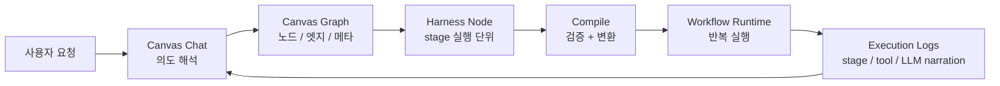
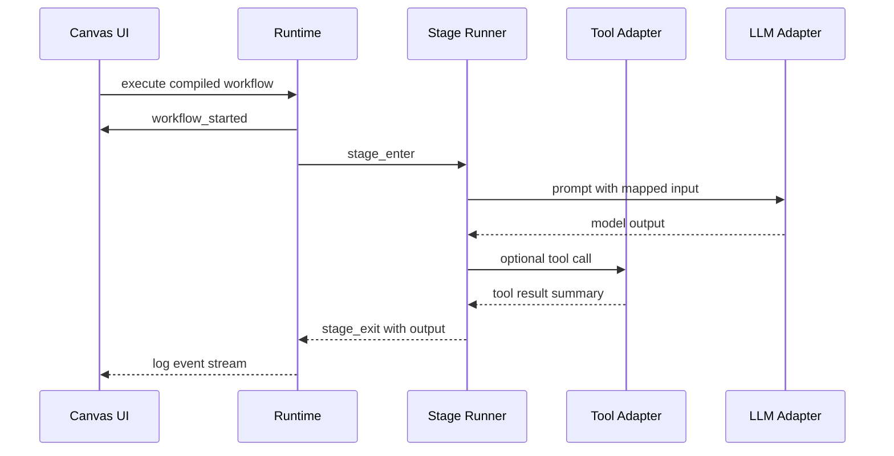
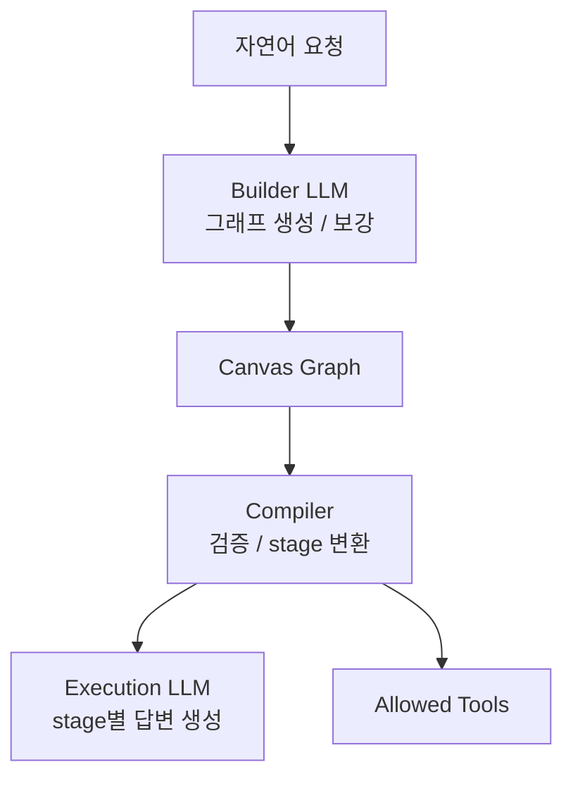
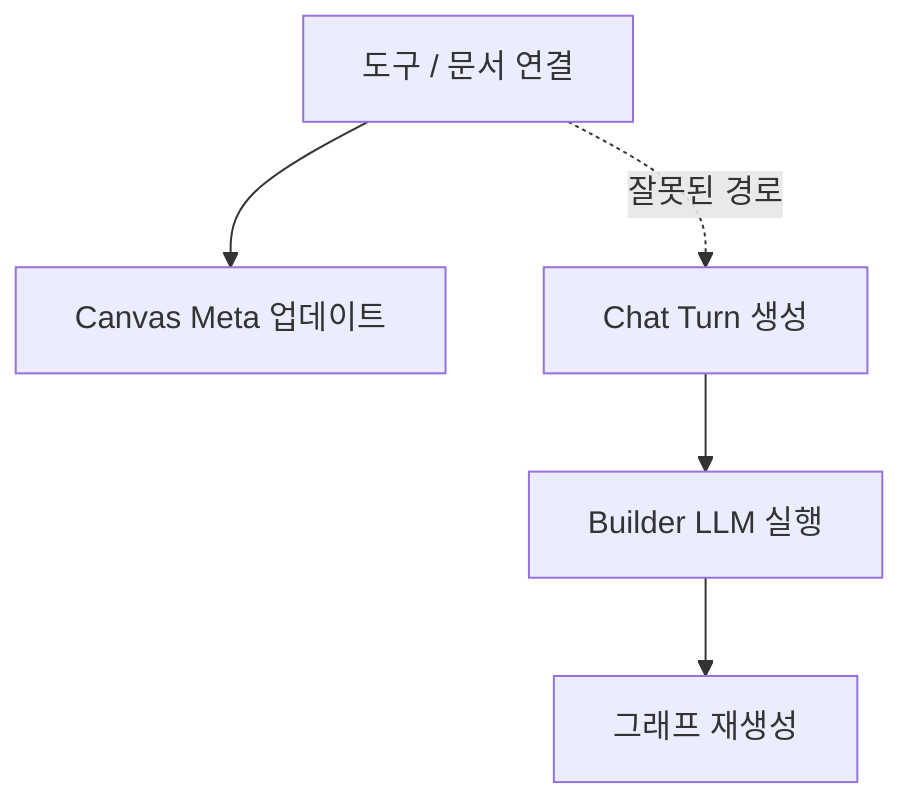
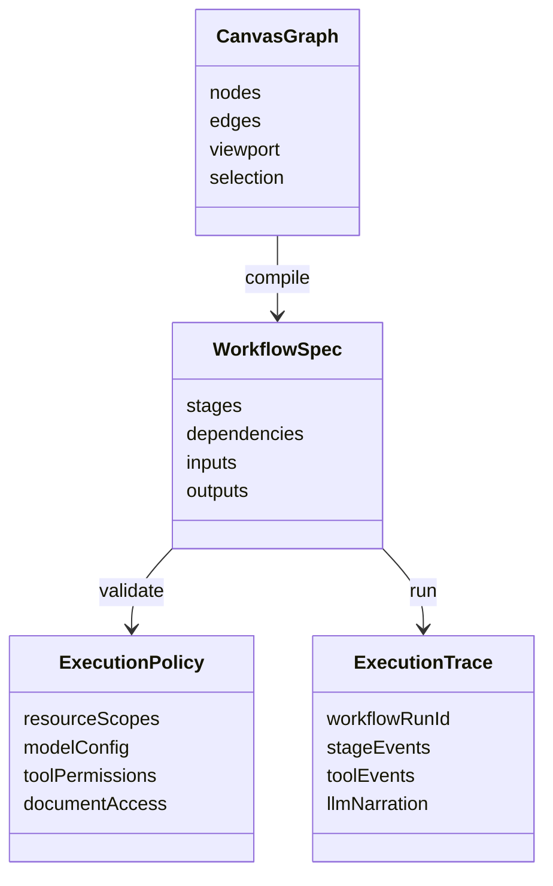

# XGEN Canvas Chat와 Harness 컴파일: 대화형 워크플로우를 실행 가능한 에이전트 파이프라인으로 만들기

## 대화형 빌더는 실행 가능성 앞에서 다시 검증된다

Canvas Chat의 목표는 단순했다. 사용자가 "문서 몇 개를 읽고, 조건을 판단하고, 필요한 도구를 호출한 뒤, 결과를 표로 정리해 줘"라고 말하면 캔버스 위에 노드와 엣지가 생기고 바로 실행까지 이어지는 경험을 만드는 것이다. 하지만 실제 제품으로 만들다 보면 "대화로 만든다"와 "운영에서 반복 실행한다" 사이에 꽤 큰 간격이 있다.

대화형 빌더는 의도 파악에는 강하다. 사용자가 설명하는 문제를 노드 구조로 바꾸고, 필요한 도구를 붙이고, 빠르게 시험 실행해 볼 수 있다. 반면 운영 워크플로우는 재현성이 중요하다. 같은 입력이면 같은 단계가 실행되어야 하고, 어느 stage에서 어떤 tool이 호출되었는지 남아야 하며, 공유 권한과 실행 권한도 캔버스와 런타임 사이에서 어긋나면 안 된다.

그래서 2026년 6월 초 XGEN 작업의 한 축은 Canvas Chat을 "대화형 워크플로우 편집기"에서 "컴파일 가능한 에이전트 파이프라인 작성 환경"으로 끌어올리는 것이었다. 내부 작업 기준으로는 `xgen-workflow!594`, `xgen-workflow!595`, `xgen-workflow!596`, `xgen-workflow!599`, `xgen-workflow!600`, `xgen-workflow!611`, `xgen-workflow!614`, `xgen-workflow!616`, `xgen-workflow!617`, `xgen-frontend!967`, `xgen-frontend!969`, `xgen-frontend!983`, `xgen-frontend!986`, `xgen-frontend!989`, `xgen-frontend!990`에 걸친 흐름이었다. 본문에는 내부 주소나 접속 정보는 넣지 않고 구조와 판단만 정리한다.

## 핵심 변화: Canvas와 Harness를 같은 실행 언어로 묶기

기존 Canvas는 사용자가 노드를 배치하고 연결하는 편집 표면에 가까웠다. 여기에 Canvas Chat이 들어오면서 LLM이 노드를 생성하고 수정하는 흐름이 붙었다. 문제는 여기서 한 번 더 생긴다. LLM이 만든 그래프가 바로 "실행 가능한 그래프"인지, 아니면 "사용자가 보기 좋은 편집 그래프"인지 구분해야 한다.

Harness 노드는 이 간격을 메우기 위한 실행 단위다. Canvas가 사람이 이해하기 쉬운 모델이라면, Harness는 런타임이 해석하기 쉬운 모델이다. 그래서 컴파일 흐름은 단순 변환이 아니라 의미 보존 작업에 가깝다.



이 구조에서 중요한 원칙은 **실행 모델을 UI 상태의 부산물로 만들지 않는 것**이다. 캔버스는 줌, 위치, 선택 상태, 임시 입력, 채팅 메시지 같은 편집 데이터를 가진다. 런타임은 그런 값이 필요 없다. 런타임에 필요한 것은 stage 순서, 입력 포트, 출력 포트, 도구 선택, 모델 설정, 권한, 문서 참조, 평가 기준이다.

그래서 컴파일 단계에서는 다음 항목을 분리한다.

- UI 전용 상태: 위치, 접힘 여부, 선택 상태, 임시 입력값
- 실행 상태: stage id, dependency, input mapping, output schema, tool binding
- 정책 상태: 실행 권한, 공유 권한, 사용자 제공 모델 설정, 문서 접근 범위
- 관찰 상태: 로그 표시 이름, stage label, tool argument summary, 결과 preview

처음에는 "Canvas JSON을 그대로 실행기에 넘기면 되지 않을까"라는 유혹이 있다. 하지만 UI 상태가 실행 계약이 되는 순간 작은 프론트엔드 리팩터링도 런타임 호환성 문제가 된다. 컴파일 계층을 둔 이유가 여기에 있다.

## Header의 Compile 버튼은 작은 UI가 아니라 제품 경계다

`xgen-frontend!967`에서 Canvas header에 Compile 버튼을 넣은 것은 보기보다 중요한 변화였다. 버튼 하나가 생긴 것이 아니라 사용자의 mental model이 바뀐다.

이전 흐름은 "캔버스에서 실행해 본다"에 가까웠다. Compile 버튼이 들어가면 사용자는 "이 그래프를 실행 가능한 파이프라인으로 확정한다"고 이해한다. 그래서 Compile은 단순 저장 버튼처럼 동작하면 안 된다. 최소한 다음 검증을 해야 한다.

- 시작 stage가 존재하는가
- 연결되지 않은 필수 input이 있는가
- tool node가 실행 권한을 가진 도구를 참조하는가
- 문서 node가 현재 사용자의 접근 범위 안에 있는가
- LLM node가 모델 설정과 system prompt를 정상적으로 가진 상태인가
- Harness node로 변환할 때 stage 순서가 결정 가능한가

```text
Canvas Header
├── Save        편집 상태 저장
├── Run         현재 캔버스 즉시 실행
└── Compile     재현 가능한 실행 파이프라인으로 확정
```

Save와 Compile을 분리한 점이 중요하다. 저장은 사용자의 편집물을 보존한다. Compile은 실행 계약을 만든다. 둘을 합치면 "저장했는데 왜 실행이 안 되지" 또는 "실행 가능한 형태로 바뀌면서 왜 내 편집 상태가 바뀌었지" 같은 혼란이 생긴다.

## Harness node를 stage로 낮추는 변환

`xgen-workflow!596`과 `xgen-frontend!969`는 Harness node를 stage로 내려보내는 흐름과 UI를 맞춘 작업이었다. Harness node는 캔버스 위에서는 하나의 시각 노드이지만, 런타임에서는 stage 목록과 dependency graph로 바뀐다.

예를 들어 사용자가 다음 흐름을 만든다고 하자.

```text
입력 문서 선택
→ 요약
→ 위험 조건 판단
→ 필요하면 검색 tool 호출
→ 최종 답변 생성
```

캔버스에서는 이 흐름이 사람이 읽기 쉬운 노드 묶음으로 표현된다. 하지만 런타임에서는 다음처럼 stage가 명확해야 한다.

```json
{
  "stages": [
    {
      "id": "load_documents",
      "type": "document",
      "outputs": ["documents"]
    },
    {
      "id": "summarize",
      "type": "llm",
      "inputs": ["documents"],
      "outputs": ["summary"]
    },
    {
      "id": "risk_check",
      "type": "judge",
      "inputs": ["summary"],
      "outputs": ["risk_level"]
    },
    {
      "id": "tool_search",
      "type": "tool",
      "condition": "risk_level.requires_external_lookup",
      "outputs": ["search_result"]
    }
  ]
}
```

이 JSON은 실제 내부 스키마를 그대로 옮긴 것이 아니라 개념을 단순화한 예시다. 핵심은 stage가 **입력과 출력의 이름을 가진다**는 점이다. 에이전트 워크플로우에서 가장 흔한 장애는 "앞 단계 결과가 다음 단계 prompt에 들어가지 않았다" 또는 "tool 결과는 있었는데 최종 답변 stage가 보지 못했다" 같은 데이터 연결 문제다. stage 입출력을 명시하면 이런 문제를 로그와 검증에서 잡을 수 있다.

## 로그는 디버깅 도구가 아니라 사용자 신뢰 장치다

`xgen-workflow!595`는 stage input/output과 tool args/results를 Canvas log에 남기는 작업이었다. 이 작업은 단순히 개발자가 보기 편한 로그를 추가한 게 아니다. 사용자가 에이전트를 믿으려면 "무엇을 근거로 답했는지"를 볼 수 있어야 한다.

실행 로그는 최소 네 계층으로 나눴다.



여기서 "tool result summary"라는 표현이 중요하다. 도구 결과를 그대로 전부 로그에 뿌리면 편하긴 하다. 하지만 운영 환경에서는 결과에 문서 일부, 사용자 입력, 외부 시스템 응답이 섞일 수 있다. 그래서 로그는 다음 원칙을 가져야 한다.

- stage 입출력은 구조를 보여주되 대용량 본문은 요약한다.
- 도구 인자는 재현에 필요한 필드 위주로 남긴다.
- 외부 시스템 응답은 preview와 상태 중심으로 남긴다.
- 사용자 제공 설정값은 표시 여부를 필드별로 통제한다.
- 오류는 원인을 좁힐 수 있을 만큼 남기되 환경 식별자는 숨긴다.

로그가 지나치게 빈약하면 사용자는 에이전트가 멋대로 답했다고 느낀다. 반대로 너무 자세하면 보안과 가독성이 무너진다. Canvas Chat에서는 "사람이 이해할 수 있는 실행 서사"가 필요했다. 그래서 `xgen-workflow!599`, `xgen-workflow!600`에서는 LLM narration과 ReAct 스타일의 사고 흐름 표시를 Canvas log에 붙였다.

여기서도 경계가 있다. 모델의 내부 추론을 그대로 보여주는 것이 목적은 아니다. 사용자에게 필요한 것은 "이 stage가 어떤 목적을 가지고 어떤 도구를 사용했고 어떤 결과를 다음 stage로 넘겼는지"다. 그래서 narration은 다음처럼 동작해야 한다.

```text
Stage: 위험 조건 판단
Reason: 요약된 문서에서 계약 변경 조건과 승인 요건을 확인한다.
Action: judge rule 실행
Observation: 승인 조건 2개가 누락되어 추가 검토 필요
Next: 관련 문서를 검색해 누락 조건을 보강한다.
```

이 정도면 사용자는 흐름을 따라갈 수 있고, 개발자는 어떤 stage에서 판단이 달라졌는지 재현할 수 있다.

## Builder LLM과 실행 LLM을 분리해야 한다

`xgen-workflow!611`과 `xgen-workflow!614`에서는 Builder LLM forced, preserved execution, auto augmentation, multi-tool 지원이 핵심이었다. 여기서 얻은 가장 큰 교훈은 **워크플로우를 만드는 LLM과 워크플로우를 실행하는 LLM은 역할이 다르다**는 점이다.

Builder LLM은 사용자의 자연어 요청을 분석해서 그래프를 만든다.

- 필요한 stage를 추론한다.
- node type을 고른다.
- 문서와 도구를 연결한다.
- 누락된 입력을 질문하거나 기본값으로 채운다.
- 실행 가능한 형태가 되도록 자동 보강한다.

실행 LLM은 이미 만들어진 stage 안에서 동작한다.

- 주어진 input mapping만 읽는다.
- stage별 system prompt를 따른다.
- 허용된 tool만 호출한다.
- output schema에 맞춰 결과를 낸다.

두 역할을 섞으면 문제가 생긴다. 실행 중인 stage가 갑자기 그래프 구조를 바꾸거나, 빌더가 사용해야 할 모델 설정이 사용자의 실행 모델 설정을 덮어쓸 수 있다. 특히 사용자 제공 모델 설정을 지원할수록 이 경계가 중요해진다.



Builder LLM을 강제한 이유는 제품 경험 때문이다. 빌더는 "그래프를 잘 만드는 모델"이어야 한다. 반면 실행 LLM은 사용자의 비용, 품질, 배포 환경에 따라 달라질 수 있다. 같은 모델 선택 UI를 공유하더라도 내부적으로 역할을 분리하지 않으면 디버깅이 어려워진다.

## 자동 보강은 편하지만, 실행 보존이 먼저다

Canvas Chat은 사용자가 대충 말해도 어느 정도 구조를 채워 줘야 한다. 예를 들어 "문서 보고 위험한 부분 알려줘"라고만 말해도 문서 load stage, 요약 stage, 위험 판단 stage, 최종 답변 stage를 만들 수 있어야 한다. 이것이 auto augmentation이다.

하지만 auto augmentation에는 함정이 있다. 이미 사용자가 손으로 고친 그래프를 다시 채팅 메시지 하나로 덮어쓰면 신뢰가 깨진다. 그래서 preserved execution이 필요했다. 기존 실행 가능한 경로가 있다면, 새 요청은 그 경로를 최대한 보존하면서 필요한 부분만 추가해야 한다.

판단 기준은 다음과 같다.

- 사용자가 명시적으로 "다시 만들어 줘"라고 했는가
- 기존 stage id와 연결이 실행 가능한가
- 새 요청이 기존 stage의 목적을 바꾸는가, 아니면 보강하는가
- tool 추가가 기존 실행 순서를 바꾸는가
- 문서 또는 모델 설정 변경이 전체 그래프에 영향을 주는가

이 기준이 없으면 채팅형 편집은 예측 불가능해진다. 사용자는 "조금 수정해 줘"라고 했는데 그래프가 통째로 재생성되는 경험을 싫어한다. 반대로 "새로 설계해 줘"라고 했는데 기존 노드가 끈질기게 남아 있어도 답답하다. Canvas Chat의 품질은 결국 이 intent 구분에서 갈린다.

## Tool과 Document 메타는 LLM 없이도 먼저 보여줄 수 있다

`xgen-workflow!616`은 tool/document meta intro를 LLM 없이 보여주는 작업이었다. 이건 작은 최적화처럼 보이지만 UX에서는 꽤 크다.

도구와 문서가 붙은 상태에서 채팅을 열면 사용자는 먼저 "지금 이 캔버스가 무엇을 알고 있는지" 보고 싶다. 이를 매번 LLM에게 설명시키면 느리고 비용이 들며, 때로는 틀린 설명을 만든다. 이미 시스템이 알고 있는 메타데이터라면 LLM을 거치지 않고 deterministic하게 보여주는 편이 낫다.

```text
현재 연결된 도구
- 문서 검색: 사내 문서 인덱스에서 관련 문서를 찾는다.
- 표 생성: stage 출력을 표 형태로 정리한다.

현재 연결된 문서
- 계약 템플릿 묶음
- 승인 정책 문서
```

이런 소개는 생성형 답변이 아니라 UI 상태 요약이다. 그래서 LLM을 쓰지 않는 편이 더 정확하다. LLM은 "이 도구들을 어떤 순서로 써야 하는가"처럼 판단이 필요한 곳에 쓰고, 이미 아는 메타를 문장으로 바꾸는 데는 쓰지 않는다.

## system prompt는 재생성하지 말고 직접 주입해야 할 때가 있다

`xgen-workflow!617`은 system prompt 직접 주입과 관련된 작업이었다. 이 이슈는 실제 제품에서 자주 나온다. 사용자가 특정 stage의 지시문을 직접 편집했는데, 실행 직전에 빌더가 이를 다시 생성해 버리면 사용자의 의도가 사라진다.

특히 다음 상황에서는 재생성보다 직접 주입이 맞다.

- 사용자가 stage prompt를 직접 저장한 경우
- 조직 표준 prompt가 template로 선택된 경우
- 평가 기준이나 출력 형식이 명확히 지정된 경우
- 컴파일된 워크플로우를 재실행하는 경우

반대로 prompt 생성이 필요한 경우도 있다.

- 사용자가 자연어 요청만 했고 stage가 아직 비어 있는 경우
- node type은 결정됐지만 역할 설명이 없는 경우
- tool과 document가 바뀌어 stage 설명을 보강해야 하는 경우

핵심은 prompt의 출처를 추적하는 것이다.

```json
{
  "stage_id": "risk_check",
  "prompt": {
    "source": "user_edited",
    "content": "문서에서 승인 조건 누락 여부만 판단한다. 추측하지 않는다."
  }
}
```

`source`가 없으면 시스템은 언제 재생성해도 되는지 알 수 없다. 결국 좋은 컴파일러는 그래프를 변환하는 코드가 아니라 "무엇을 보존해야 하는지"를 아는 코드다.

## Canvas Chat UI에서 생긴 의외의 버그들

이번 작업에서 프론트엔드 쪽으로도 자잘하지만 중요한 버그가 많았다. `xgen-frontend!983`, `xgen-frontend!986`, `xgen-frontend!989`, `xgen-frontend!990`에 걸친 흐름이다.

첫 번째는 markdown table 표시 문제였다. Canvas Chat 로그에서 stage 결과를 표로 보여주려는데, 스트리밍 중간 상태에서는 markdown table이 완성되지 않은 채 들어온다. 일반 markdown parser는 파이프 구분선이 완성되기 전까지 표로 인식하지 못하거나, 반쯤 깨진 HTML을 만든다.

해결 방향은 "스트리밍 중에는 안전한 preview, 완료 후에는 정식 markdown 렌더"였다.

```text
streaming chunk
→ line buffer
→ incomplete table guard
→ final markdown render
```

두 번째는 사용자 제공 모델 설정 표시였다. 사용자가 직접 넣은 설정값을 UI에 보여줄 때, 값 자체를 노출하면 안 된다. 그래서 badge와 modal은 "설정됨", "마지막 4자리 수준의 힌트", "공급자 이름", "사용 범위" 정도만 보여주고 실제 값은 다시 표시하지 않는 쪽이 안전하다.

세 번째는 busy state sync 문제였다. Canvas에서 실행 중인데 Chat panel은 입력 가능해 보이거나, 반대로 실행이 끝났는데 버튼이 계속 비활성화되는 식이다. 이런 상태 불일치는 사용자를 불안하게 만든다. 실행 상태는 컴포넌트별 local state로 흩어지면 안 되고, workflow execution id를 기준으로 공유되어야 한다.

네 번째는 attach 동작이 의도치 않게 재실행을 유발한 문제였다. 도구나 문서를 붙이는 동작은 그래프 메타 변경이지 "새로운 사용자 메시지"가 아니다. 그런데 빈 메시지 turn처럼 처리되면 LLM이 다시 실행되고, 그래프가 예상치 않게 바뀐다. 그래서 detachOnly 같은 명시적 플래그와 attach event 분리가 필요했다.



attach는 메타 업데이트로 끝나야 한다. 사용자가 "이 도구를 사용해서 흐름을 다시 설계해 줘"라고 말했을 때만 Builder LLM이 실행되어야 한다.

## 권한 전파는 컴파일러의 책임이다

Canvas에서 권한이 맞아 보이는데 컴파일된 실행에서 실패하거나, 반대로 Canvas에서는 보이지 않는 도구가 실행기에 붙어 버리면 큰 문제다. 그래서 권한 전파는 UI의 표시 문제가 아니라 컴파일러의 계약이어야 한다.

권한은 최소 세 지점에서 확인한다.

- 편집 시점: 사용자가 Canvas에 노드와 도구를 붙일 수 있는가
- 컴파일 시점: 실행 파이프라인에 포함될 모든 리소스 접근이 가능한가
- 실행 시점: 현재 실행 주체가 해당 tool/document/model을 사용할 수 있는가

이 세 지점이 중복처럼 보일 수 있다. 하지만 실제 운영에서는 모두 필요하다. 편집 시점 검증만 있으면 공유 워크플로우를 다른 사용자가 실행할 때 깨진다. 실행 시점 검증만 있으면 사용자는 컴파일 후에야 실패를 알게 된다. 컴파일 시점 검증은 "이 파이프라인이 현재 조건에서 실행 가능하다"는 중간 계약을 만들어 준다.

```text
Canvas permission
→ Compile permission snapshot
→ Runtime permission check
```

여기서 snapshot이라는 단어를 조심해야 한다. 권한을 복사해서 영구 허가권처럼 저장한다는 뜻이 아니다. 컴파일 당시 어떤 리소스가 필요했고 어떤 권한 범위를 기대했는지 기록한다는 뜻이다. 실제 실행에서는 현재 권한을 다시 확인한다.

## 컴파일 실패는 친절해야 한다

컴파일러는 실패할 수밖에 없다. 오히려 실패하지 않는 컴파일러가 위험하다. 연결이 비어 있거나, stage 출력이 다음 stage 입력과 맞지 않거나, 권한이 없는 도구를 참조하면 실행 전에 멈춰야 한다.

문제는 실패 메시지다. "invalid workflow"는 아무 도움이 되지 않는다. Canvas에서 바로 수정할 수 있게 실패 위치와 이유를 알려줘야 한다.

```json
{
  "ok": false,
  "errors": [
    {
      "node_id": "tool_search",
      "field": "input.query",
      "message": "검색어 입력이 이전 stage 출력과 연결되어 있지 않습니다."
    },
    {
      "node_id": "final_answer",
      "field": "output.schema",
      "message": "표 출력이 선택되었지만 column 정의가 없습니다."
    }
  ]
}
```

이런 오류는 UI에서 node highlight, side panel, chat suggestion으로 이어질 수 있다.

```text
컴파일 실패
→ 문제 node 강조
→ 수정 가능한 field로 focus
→ Canvas Chat에 수정 제안 표시
```

좋은 실패는 사용자를 막는 것이 아니라 다음 행동을 알려준다. 특히 AI 워크플로우 빌더에서는 사용자가 모든 스키마를 알고 있다고 기대하면 안 된다. 컴파일러는 엄격해야 하지만, UI는 친절해야 한다.

## ReAct 로그는 실행을 설명하는 언어다

ReAct 스타일 로그를 붙일 때 조심할 점은 이것을 모델 내부 생각처럼 포장하지 않는 것이다. 제품 로그로 필요한 것은 "실행 설명"이다. Stage가 어떤 observation을 받았고, 어떤 action을 선택했으며, 그 결과가 무엇인지 요약하면 충분하다.

예를 들어 tool 호출 stage는 이렇게 보일 수 있다.

```text
Observation
- 위험 조건 판단 stage에서 "추가 문서 확인 필요"가 나왔다.

Action
- 문서 검색 도구를 호출한다.

Result
- 관련 문서 3개를 찾았다.
- 최종 답변 stage에는 제목, 요약, 출처 식별자만 전달한다.
```

이 구조는 사용자에게 투명성을 주고, 운영자에게 디버깅 단서를 준다. "왜 이 도구를 호출했는가"가 남아 있으면 불필요한 tool 호출과 비용 증가도 추적할 수 있다.

## Canvas Chat에서 컴파일러까지 이어지는 상태 모델

최종적으로 상태 모델은 다음 네 묶음으로 정리할 수 있다.



CanvasGraph는 편집 가능한 상태다. WorkflowSpec은 실행 가능한 상태다. ExecutionPolicy는 실행해도 되는지 판단하는 상태다. ExecutionTrace는 실행 후 사용자에게 보여줄 상태다.

이 네 묶음을 섞지 않는 것이 중요하다. 특히 trace가 다시 graph를 바꾸거나, graph의 viewport 정보가 spec에 들어가거나, policy가 UI 표시용 문자열로만 남으면 나중에 반드시 문제가 된다.

## 이번 구현에서 얻은 기준

이번 Canvas Chat / Harness 컴파일 작업을 지나며 기준이 꽤 선명해졌다.

첫째, **대화형 편집과 결정적 실행은 분리해야 한다.** 사용자는 채팅으로 빠르게 만들고 싶어 하지만, 운영은 같은 입력에 대해 같은 stage가 돌아가야 한다. 컴파일러는 이 둘 사이의 번역기다.

둘째, **로그는 제품 기능이다.** stage 입출력, tool 인자와 결과, LLM narration이 남아야 사용자가 에이전트를 믿고 수정할 수 있다. 단, 로그는 보안과 가독성을 동시에 만족해야 한다.

셋째, **Builder LLM과 Execution LLM은 역할이 다르다.** 빌더는 그래프를 만들고 보강한다. 실행 LLM은 stage 안에서 제한된 입력과 도구로 결과를 만든다. 이 경계가 흐려지면 재현성이 깨진다.

넷째, **사용자가 고친 것은 보존해야 한다.** system prompt, stage 연결, 도구 선택, 출력 형식은 출처를 기록해야 한다. 그래야 자동 보강과 사용자 편집이 싸우지 않는다.

다섯째, **attach와 run은 다른 이벤트다.** 도구나 문서를 붙였다고 해서 LLM이 다시 실행되면 안 된다. 사용자가 의도한 편집과 실행 트리거를 UI 이벤트 수준에서 분리해야 한다.

여섯째, **권한은 세 번 확인한다.** 편집 시점, 컴파일 시점, 실행 시점의 검증은 각각 역할이 다르다. 어느 하나로 합치면 공유와 재실행에서 문제가 생긴다.

Canvas Chat은 보기에는 채팅창 하나와 캔버스 하나의 조합이다. 하지만 실제로는 자연어 빌더, 그래프 편집기, 컴파일러, 런타임, 로그 뷰어, 권한 시스템이 맞물린 제품이다. 이번 작업의 의미는 "LLM이 노드를 그려 준다"가 아니라, 그 노드가 실행 가능한 파이프라인으로 내려가고 다시 사용자에게 설명 가능한 로그로 올라오는 왕복 경로를 만든 데 있다.

이 왕복 경로가 안정되면 다음 단계가 가능해진다. 사용자는 자연어로 초안을 만들고, 캔버스에서 구조를 다듬고, Harness로 컴파일하고, 실행 로그를 보며 다시 수정한다. AI 워크플로우 빌더가 장난감에서 운영 도구로 넘어가는 순간은 바로 이 반복 루프가 끊기지 않을 때다.
