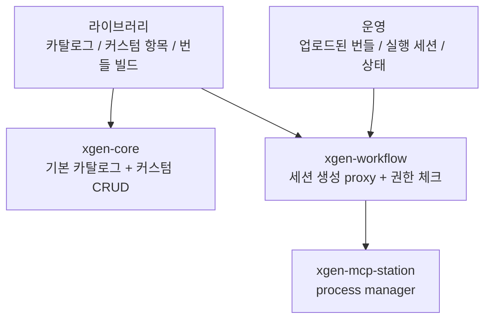
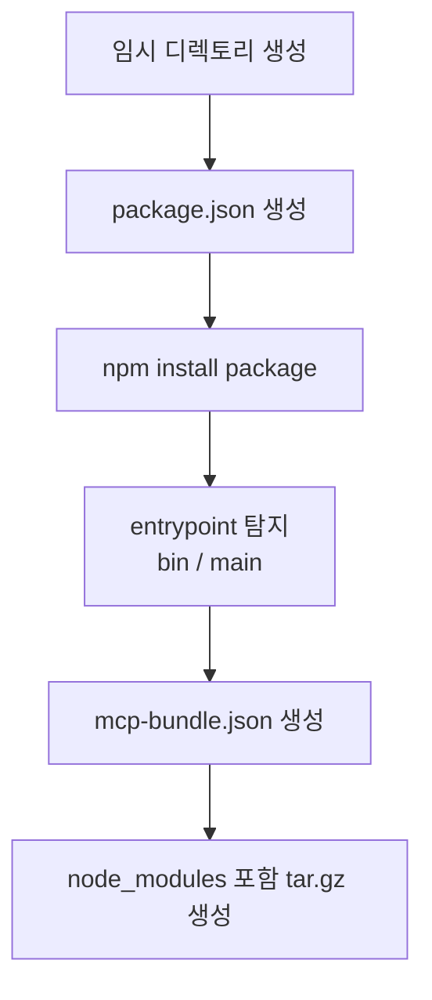
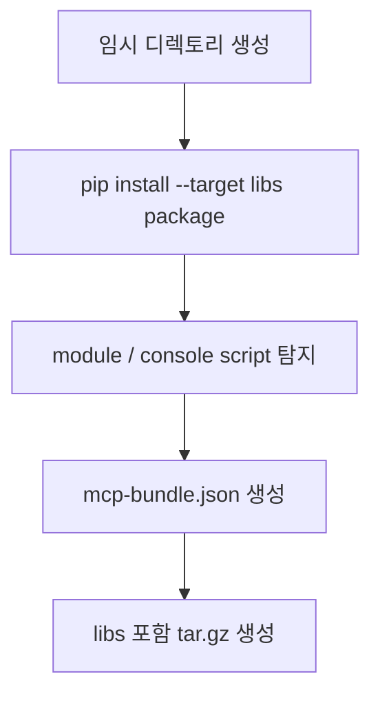
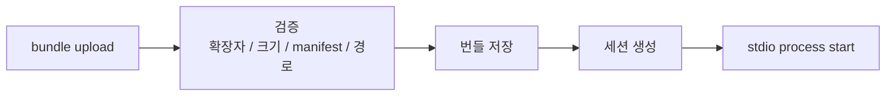
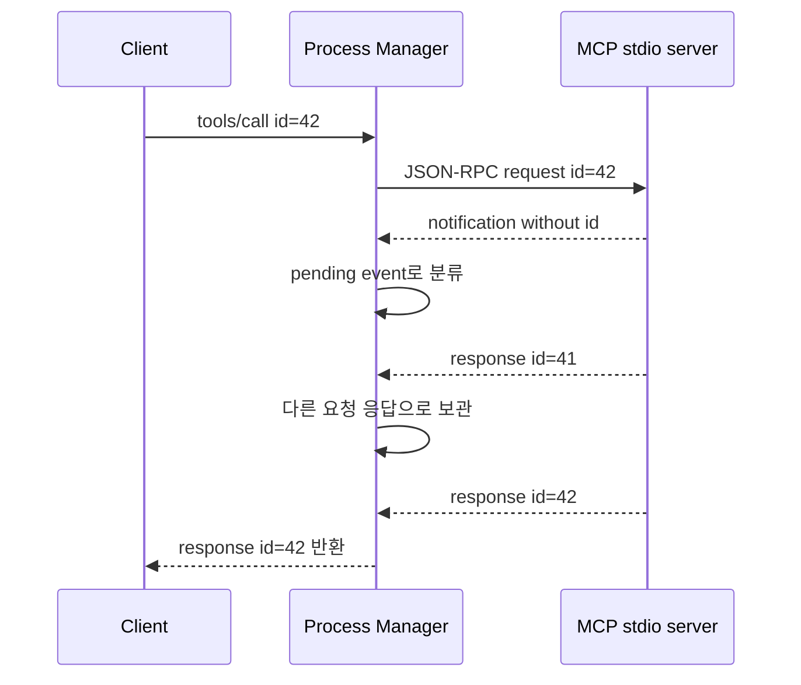
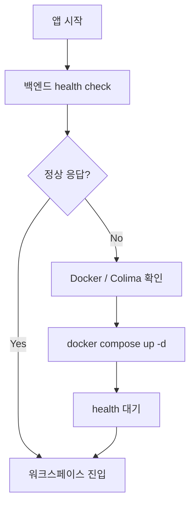
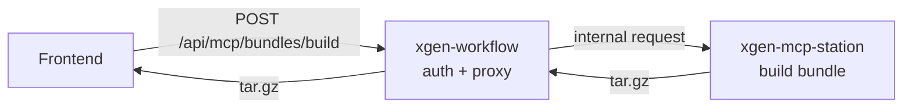
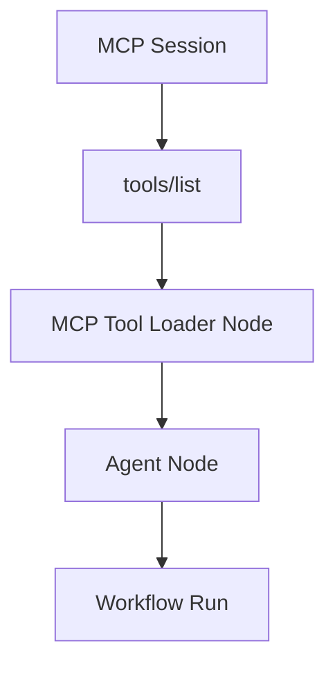

# XGEN MCP 폐쇄망 번들 시스템: 외부망 패키지를 .tar.gz로 묶어 원클릭 도구 세션까지 연결하기

## 문제는 MCP 서버가 아니라 설치 경로였다

MCP 서버를 붙이는 것 자체는 어렵지 않다. `npx`로 실행하거나 Python 패키지를 설치한 뒤 stdio로 띄우면 된다. 문제는 그 방식이 **인터넷이 열려 있는 개발자 노트북**을 전제로 한다는 점이다.

운영 환경은 달랐다. XGEN은 고객사별로 인터넷 접근 조건이 다르고, 일부 환경은 폐쇄망이다. 개발 환경에서는 `npx some-mcp-server` 한 줄로 끝나는 서버도 폐쇄망에서는 다음 질문으로 바뀐다.

- 패키지와 transitive dependency를 어떻게 반입할 것인가?
- Node.js 기반 MCP와 Python 기반 MCP를 같은 방식으로 다룰 수 있는가?
- 사용자는 어디에서 패키지명을 입력하고, 어디에서 번들을 받아야 하는가?
- 폐쇄망 내부에서는 번들을 업로드한 뒤 어떤 API가 세션을 만들어야 하는가?
- stdio MCP 서버가 로그와 JSON-RPC 응답을 섞어 내보내면 어떻게 정확한 응답을 고를 것인가?

처음에는 MCP 라이브러리 화면에 "설치" 버튼만 있으면 충분하다고 생각했다. 하지만 실제 운영 기준으로 보면 설치 버튼은 끝이 아니라 시작이었다. 외부망에서 번들을 만들고, 파일을 폐쇄망으로 옮기고, 업로드하고, 세션을 복원하고, 캔버스에서 MCP Tool Loader로 연결되는 전체 동선이 필요했다.

이 글은 2026년 6월 초에 진행한 XGEN MCP 폐쇄망 번들 시스템 구현을 정리한다. 관련 작업은 내부 MR 기준으로 `xgen-core!224`, `xgen-core!225`, `xgen-frontend!1013`, `xgen-frontend!1014`, `xgen-workflow!637`, `xgen-workflow!643`, `xgen-mcp-station!9`, `xgen-mcp-station!11`, `xgen-mcp-station!12`에 걸쳐 있었다. 본문에는 내부 주소나 접속 정보는 포함하지 않고, 구조와 판단만 남긴다.

## 전체 흐름

완성된 흐름은 네 단계다.

1. 웹 또는 데스크톱 앱에서 MCP 라이브러리를 연다.
2. 외부망 환경에서 패키지명과 runtime을 입력해 번들을 빌드한다.
3. 생성된 `.tar.gz` 파일을 폐쇄망 XGEN에 업로드한다.
4. 업로드된 번들로 MCP 세션을 만들고 캔버스 도구로 연결한다.

```mermaid
flowchart LR
    User["사용자"]
    UI["XGEN MCP 라이브러리<br/>웹 / 데스크톱 공통 UI"]
    Gateway["xgen-workflow<br/>bundle build proxy"]
    Station["xgen-mcp-station<br/>bundle builder"]
    Bundle["MCP bundle<br/>.tar.gz"]
    Airgap["폐쇄망 XGEN"]
    Session["MCP Session<br/>stdio process"]
    Canvas["Canvas<br/>MCP Tool Loader"]

    User --> UI
    UI -->|"패키지명 / runtime / args"| Gateway
    Gateway --> Station
    Station --> Bundle
    Bundle -->|"파일 반입"| Airgap
    Airgap -->|"upload bundle"| Session
    Session --> Canvas
```



여기서 중요한 점은 "외부망 빌드"와 "폐쇄망 실행"을 분리했다는 것이다. 폐쇄망 내부에서는 패키지 레지스트리에 접근하지 않는다. 이미 dependency까지 포함된 번들을 받아서 압축을 풀고 실행할 뿐이다. 설치 실패 지점이 줄고, 운영자가 검수해야 할 파일도 하나로 모인다.

## 왜 마켓과 번들을 분리했나

초기 MCP 라이브러리 화면은 "카탈로그에서 고르고 설치"에 가까웠다. 하지만 폐쇄망 요구사항을 넣으면서 역할을 분리해야 했다.

- **마켓 카탈로그**: 어떤 MCP 서버가 있는지 보여준다.
- **커스텀 아이템**: 조직이나 사용자가 자체 MCP 항목을 등록한다.
- **번들 빌드**: 외부망에서 실행 가능한 패키지 묶음을 만든다.
- **운영 세션**: 실제로 실행 중인 MCP process를 관리한다.

이 네 가지가 한 화면에 섞이면 사용자는 "설치", "업로드", "실행", "등록"을 구분하지 못한다. 그래서 UI를 라이브러리와 운영으로 나눴다.



`xgen-core`는 기본 카탈로그와 커스텀 항목 CRUD를 담당한다. 웹과 데스크톱이 같은 카탈로그를 보려면 이 정보가 프론트엔드 번들 안에 박혀 있으면 안 된다. 서버에서 읽어서 제공해야 한다.

`xgen-workflow`는 권한과 gateway 역할을 맡는다. 프론트엔드가 `xgen-mcp-station`을 직접 때리면 네트워크 토폴로지와 인증이 UI에 새어 나온다. 대신 workflow 서비스가 `/api/mcp/...` 계열 엔드포인트를 열고 내부 서비스로 프록시한다.

`xgen-mcp-station`은 실제 MCP process lifecycle을 다룬다. 번들을 풀고, 환경 변수를 준비하고, stdio process를 띄우고, JSON-RPC 요청과 응답을 주고받는다.

## 기본 카탈로그: 서버가 제공하는 원클릭 설치 목록

기본 카탈로그는 `xgen-core`에 둔다. 카탈로그 항목은 JSON 형태의 정적 정의로 관리하고, 서버 시작 시 읽어서 마켓 목록에 합친다. 이렇게 하면 웹과 데스크톱 앱이 같은 목록을 본다.

```text
constants/default_mcp/
├── filesystem.json
├── git.json
├── browser.json
└── ...
```

항목 구조는 단순해야 한다. UI가 보여줄 값과 세션 생성에 필요한 값만 남긴다.

```json
{
  "id": "filesystem",
  "name": "Filesystem",
  "runtime": "node",
  "package": "@modelcontextprotocol/server-filesystem",
  "description": "로컬 파일 시스템을 읽고 쓰는 MCP 서버",
  "default_args": ["./workspace"],
  "env_schema": []
}
```

여기서 실제 운영 secret 값은 절대 카탈로그에 들어가지 않는다. `env_schema`에는 "이 서버가 어떤 환경 변수를 요구하는지"만 들어간다. 값은 세션 생성 시 사용자 입력이나 서버 측 secret store에서 주입한다. 카탈로그는 공유 가능한 메타데이터여야 하고, 실행 credential은 별도 생명주기를 가져야 한다.

커스텀 항목도 같은 모델을 따른다. 사용자가 MCP 항목을 추가하면 `xgen-core`가 이름 중복을 처리하고 DB에 저장한다. 삭제는 항목 정의만 지우며, 이미 실행 중인 세션 정리는 운영 영역에서 별도로 다룬다.

## 외부망 번들 빌드 API

번들 빌드의 핵심 엔드포인트는 다음 형태다.

```http
POST /api/mcp/bundles/build
Content-Type: application/json

{
  "runtime": "node",
  "package": "@example/mcp-server",
  "args": ["--mode", "stdio"]
}
```

응답은 JSON이 아니라 바이너리 tarball이다.

```http
HTTP/1.1 200 OK
Content-Type: application/gzip
Content-Disposition: attachment; filename="mcp-bundle-example.tar.gz"
```

프론트엔드는 이 응답을 blob으로 받아 파일 다운로드를 시작한다. 웹에서는 상대 경로 API를 쓰고, Tauri 데스크톱 앱에서는 런타임에 주입된 backend base URL을 붙인다. 이 차이를 UI 컴포넌트가 직접 알면 유지보수가 어려워서 공통 API client 함수 안으로 숨겼다.

```typescript
async function buildMCPBundle(input: BuildBundleRequest): Promise<Blob> {
  const baseUrl = getBackendBaseUrl();
  const response = await fetch(`${baseUrl}/api/mcp/bundles/build`, {
    method: "POST",
    headers: { "Content-Type": "application/json" },
    body: JSON.stringify(input),
  });

  if (!response.ok) {
    throw new Error(`bundle build failed: ${response.status}`);
  }

  return await response.blob();
}
```

이 코드는 실제 구현을 단순화한 예시다. 중요한 것은 에러 메시지에 내부 host, token, command full output을 그대로 넣지 않는다는 점이다. 번들 빌드 실패는 사용자에게 "패키지 설치 실패", "엔트리포인트 탐지 실패", "지원하지 않는 runtime"처럼 분류된 원인으로 보여줘야 한다.

## Node.js 번들: node_modules를 포함한 실행 단위 만들기

Node.js MCP 서버는 보통 npm 패키지다. 외부망 빌더는 임시 디렉토리에서 패키지를 설치한 뒤 실행에 필요한 파일을 묶는다.



`package.json`의 `bin`이 있으면 우선 사용하고, 없으면 `main`을 본다. 둘 다 없으면 보수적으로 실패한다. 추정에 실패했는데 억지로 실행하면 폐쇄망 내부에서 디버깅하기 더 어려워진다. 외부망 빌드 단계에서 실패시키는 편이 낫다.

번들 메타데이터는 이렇게 생겼다.

```json
{
  "schema_version": 1,
  "runtime": "node",
  "command": "node",
  "entrypoint": "node_modules/example-server/dist/index.js",
  "args": ["--mode", "stdio"],
  "env_schema": []
}
```

`command`와 `entrypoint`는 실행에 필요한 최소 정보다. 실제 secret은 없다. 환경 변수 이름 목록 정도는 들어갈 수 있지만 값은 들어가면 안 된다.

tarball을 만들 때는 symlink 처리도 중요하다. npm 패키지는 bin에 symlink를 자주 만든다. 폐쇄망 서버에서 압축을 풀었을 때 symlink가 예상 밖의 경로를 가리키면 보안상 좋지 않다. 그래서 tar 생성 시 dereference하거나, 허용된 번들 루트 내부 경로만 포함하도록 검사한다.

## Python 번들: target directory 방식

Python MCP 서버는 `pip install --target` 방식이 다루기 쉽다. 가상환경을 통째로 묶는 방식도 가능하지만, 운영 서버의 Python 버전과 ABI가 맞지 않으면 문제가 커진다. 이번 구현에서는 번들 안에 라이브러리 디렉토리와 메타데이터를 넣고, 실행 시 `PYTHONPATH`를 설정하는 방식으로 잡았다.



Python 패키지는 entrypoint 추정이 Node보다 어렵다. console script metadata를 읽을 수 있으면 가장 좋고, 아니면 사용자가 command와 args를 명시하도록 한다. 자동 추정은 편하지만, 폐쇄망에서는 모호함이 곧 운영 비용이다.

예시 메타데이터는 다음과 같다.

```json
{
  "schema_version": 1,
  "runtime": "python",
  "command": "python",
  "entrypoint": "-m example_mcp_server",
  "args": [],
  "pythonpath": ["libs"],
  "env_schema": []
}
```

여기서도 원칙은 같다. 실행에 필요한 구조만 담고, credential은 담지 않는다.

## 업로드와 세션 생성

폐쇄망 XGEN에서는 이미 만들어진 `.tar.gz`를 업로드한다. 업로드 API는 파일을 받아 저장하고, 메타데이터를 읽어 세션 생성 요청으로 바꾼다.



검증 단계에서 봐야 할 것은 네 가지다.

1. 압축 파일 형식과 크기가 허용 범위인지 확인한다.
2. `mcp-bundle.json`이 존재하고 schema version이 맞는지 확인한다.
3. tar 내부 경로가 번들 루트 밖으로 탈출하지 않는지 확인한다.
4. 실행 command가 허용된 runtime과 일치하는지 확인한다.

특히 세 번째가 중요하다. tar 파일에는 `../../some/path` 같은 path traversal 위험이 있다. 운영 서비스는 압축을 풀기 전에 모든 member path를 정규화하고, 대상 디렉토리 내부에 남는지 확인해야 한다.

```python
def safe_extract_members(members, target_dir):
    target = Path(target_dir).resolve()

    for member in members:
        dest = (target / member.name).resolve()
        if not str(dest).startswith(str(target) + os.sep):
            raise ValueError("bundle contains invalid path")
```

실제 구현은 더 많은 예외 처리를 갖지만, 판단의 핵심은 이 정도다. 업로드된 번들은 신뢰할 수 없는 입력이다. "외부망에서 우리가 만들었다"는 가정만으로 검증을 생략하면 안 된다. 중간 전달 과정에서 파일이 바뀔 수도 있고, 사용자가 임의 번들을 올릴 수도 있다.

## stdio JSON-RPC correlation 버그

이번 작업에서 가장 실전적인 버그는 번들 자체가 아니라 stdio 응답 처리에서 나왔다.

MCP stdio 서버는 stdout으로 JSON-RPC 메시지를 내보낸다. 그런데 현실의 서버는 항상 얌전하지 않다. 로그를 stdout에 섞기도 하고, notification을 먼저 보내기도 하고, 이전 요청의 늦은 응답이 다음 요청 앞에 도착하기도 한다.

문제의 패턴은 이랬다.

```text
요청 A: tools/list id=1
응답 A: {"jsonrpc":"2.0","id":1,"result":{...}}

요청 B: tools/call id=2
stdout 다음 줄: {"jsonrpc":"2.0","method":"notifications/progress",...}
stdout 그 다음 줄: {"jsonrpc":"2.0","id":2,"result":{...}}
```

단순 구현은 `stdout_queue.get()`으로 "다음 줄"을 응답으로 반환한다. 그러면 요청 B의 결과로 notification을 받거나, 심하면 직전 `tools/list` 결과를 tool call 응답으로 착각한다.

해결은 JSON-RPC `id`를 기준으로 correlation하는 것이다.



process manager는 stdout에서 JSON 객체를 읽을 때 다음 규칙을 따른다.

- `id`가 요청 id와 같으면 현재 요청의 응답이다.
- `method`만 있고 `id`가 없으면 notification이다.
- 다른 `id`의 응답이면 pending map에 보관한다.
- JSON이 아닌 stdout 로그는 structured log로 넘기거나 무시한다.

이 변경으로 "도구 호출했는데 직전 목록 응답이 돌아오는" 재현 어려운 버그가 사라졌다. MCP 서버가 늘어날수록 이런 작은 protocol 처리 차이가 안정성을 좌우한다.

## 데스크톱 앱에서는 백엔드도 자동 기동해야 한다

웹 XGEN에서는 백엔드가 항상 떠 있다고 가정할 수 있다. 데스크톱 앱은 다르다. 사용자가 앱을 열었는데 로컬 Docker compose가 내려가 있으면 MCP 화면은 비어 있고, 버튼은 실패한다. 사용자는 "백엔드 먼저 켜세요"라는 말을 듣고 싶어 하지 않는다.

그래서 Tauri 앱 부팅 단계에 backend ensure 과정을 넣었다.



이 흐름은 MCP UX와 직접 연결된다. MCP 세션은 로컬 process와 backend API가 함께 있어야 의미가 있다. 앱이 backend를 자동으로 올려주면 사용자는 "MCP 라이브러리에서 고르고 실행"이라는 제품 경험만 본다.

물론 자동 기동은 조심해야 한다. 앱이 사용자 몰래 임의 명령을 실행하는 것처럼 보이면 안 된다. 그래서 다음 원칙을 둔다.

- 이미 떠 있는 백엔드는 건드리지 않는다.
- compose profile은 필요한 서비스만 올린다.
- 실패 시 내부 command 전체가 아니라 사용자가 이해 가능한 단계로 표시한다.
- secret 값은 로그와 UI에 노출하지 않는다.

## 웹과 데스크톱의 API base URL 문제

Tauri 앱에서 흔히 만나는 문제는 origin이다. 웹에서는 `/api/...` 상대 경로가 같은 도메인의 백엔드로 간다. Tauri에서는 앱 origin이 `tauri://...` 또는 로컬 WebView origin이므로 상대 경로가 백엔드로 가지 않는다.

이번 작업에서도 RAG 문서 API와 MCP API에서 이 문제가 반복됐다. 해결은 API client의 base URL 결정을 한 곳으로 모으는 것이다.

```typescript
export function getBackendBaseUrl(): string {
  const runtimeBase = window.__XGEN_BACKEND_BASE_URL__;
  if (runtimeBase) return runtimeBase.replace(/\/$/, "");
  return "";
}
```

웹에서는 빈 문자열을 반환해 상대 경로를 유지하고, 데스크톱에서는 Tauri 부팅 시 주입된 backend URL을 사용한다. 각 feature package가 `isTauri ? ... : ...` 분기를 직접 들고 있으면 시간이 갈수록 깨진다. 특히 Model Studio, RAG 문서, MCP 라이브러리처럼 웹/데스크톱이 동시에 쓰는 기능은 공통 client가 필요하다.

## 보안 기준: 번들에는 credential을 넣지 않는다

폐쇄망 번들 시스템에서 가장 피해야 할 실수는 "한 번에 실행되게 하자"는 이유로 credential을 번들에 넣는 것이다. 그러면 `.tar.gz` 파일이 곧 secret 묶음이 된다. 파일 전달, 백업, 로그, 다운로드 기록 어디에서든 새나갈 수 있다.

이번 설계의 기준은 단순하다.

| 위치 | 들어가도 되는 것 | 들어가면 안 되는 것 |
|------|------------------|--------------------|
| 카탈로그 | 이름, 설명, runtime, package, 기본 args | API key, token, password |
| 번들 | dependency, entrypoint, manifest | 실제 credential 값 |
| 세션 요청 | env key 이름, secret 참조 id | 평문 secret 값 |
| 로그 | 단계, 상태, 분류된 오류 | command 전체, env dump, credential |

환경 변수가 필요한 MCP 서버는 많다. 예를 들어 외부 API를 호출하는 MCP 서버라면 access token이 필요할 수 있다. 하지만 번들은 "서버 코드와 의존성"이고, credential은 "실행 환경의 상태"다. 둘의 생명주기를 분리해야 한다.

실행 시에는 secret store나 사용자 입력을 통해 세션 환경을 구성한다. UI에 표시할 때도 값 자체가 아니라 "설정됨", "미설정", "권한 필요" 같은 상태만 보여준다.

## 실패 처리: 사용자에게 필요한 만큼만 보여주기

번들 빌드는 실패할 수 있다. 패키지명이 틀렸을 수도 있고, 레지스트리에 없는 버전일 수도 있고, 설치 스크립트가 postinstall에서 실패할 수도 있다. 중요한 것은 실패를 있는 그대로 던지지 않는 것이다.

좋은 실패 메시지는 세 층으로 나뉜다.

1. 사용자 메시지: "패키지 설치에 실패했다."
2. 원인 분류: `PACKAGE_NOT_FOUND`, `ENTRYPOINT_NOT_FOUND`, `INSTALL_TIMEOUT`
3. 운영 로그: 내부 trace, exit code, sanitized command

사용자에게는 1과 2를 보여준다. 운영 로그에는 3을 남기되, 환경 변수와 내부 주소는 마스킹한다. 이 원칙이 없으면 디버깅을 편하게 하려다가 UI에 민감정보가 그대로 노출된다.

```python
def public_error(exc):
    if isinstance(exc, PackageNotFound):
        return {
            "code": "PACKAGE_NOT_FOUND",
            "message": "패키지를 찾을 수 없다. 이름과 버전을 확인해야 한다.",
        }
    if isinstance(exc, EntrypointNotFound):
        return {
            "code": "ENTRYPOINT_NOT_FOUND",
            "message": "실행 진입점을 자동으로 찾지 못했다. command를 명시해야 한다.",
        }
    return {
        "code": "BUNDLE_BUILD_FAILED",
        "message": "번들 빌드에 실패했다. 입력값과 지원 runtime을 확인해야 한다.",
    }
```

이런 형태로 에러를 설계하면 프론트엔드도 분기하기 쉽다. `ENTRYPOINT_NOT_FOUND`라면 command 입력 UI를 안내하고, `PACKAGE_NOT_FOUND`라면 패키지명과 version을 확인하도록 유도하면 된다.

## 왜 xgen-workflow가 proxy를 맡았나

번들 빌드 자체는 `xgen-mcp-station`이 잘한다. 그런데 프론트엔드가 station을 직접 호출하지 않고 `xgen-workflow`의 프록시를 거친 이유가 있다.

첫째, 권한 체크 위치를 통일하기 위해서다. 사용자가 MCP station을 관리할 수 있는지 판단하는 것은 제품 권한 모델과 연결된다. 이 판단이 프론트엔드나 station 내부에 흩어지면 나중에 role 변경 시 누락이 생긴다.

둘째, 네트워크 구조를 숨기기 위해서다. 웹 배포, 데스크톱 앱, 폐쇄망 환경은 서비스 주소와 route가 다르다. 프론트엔드는 항상 `/api/mcp/...`만 호출하고, 내부 라우팅은 backend가 책임진다.

셋째, timeout과 바이너리 응답 처리를 통제하기 위해서다. 번들 빌드는 일반 JSON API보다 오래 걸릴 수 있고, 응답도 tarball이다. 프록시 계층에서 timeout, streaming, content disposition을 명확히 다루는 편이 안정적이다.



프록시는 "그냥 전달"이 아니다. 권한, timeout, 응답 헤더, 에러 정규화까지 포함한 제품 API 경계다.

## 캔버스 연결: MCP Tool Loader

번들로 세션을 만들었다고 끝이 아니다. XGEN에서 MCP 서버는 캔버스의 에이전트가 사용할 수 있어야 한다. 그래서 세션 생성 이후에는 MCP Tool Loader 노드가 해당 세션의 tool list를 읽고, 에이전트 실행 시 바인딩한다.



여기서 앞서 말한 JSON-RPC correlation fix가 중요해진다. `tools/list`와 `tools/call`이 안정적으로 응답을 받아야 캔버스 실행이 예측 가능하다. MCP 서버 하나를 직접 테스트할 때는 운 좋게 지나가는 문제도, 캔버스에서 여러 노드가 순차 실행될 때는 바로 드러난다.

## 검증 시나리오

이번 기능은 단위 테스트만으로는 충분하지 않다. 파일 다운로드, 폐쇄망 반입, 업로드, process 실행, tool 호출까지 이어지는 end-to-end 흐름이 핵심이기 때문이다.

검증 시나리오는 다음 순서로 잡았다.

1. 외부망 빌더에서 Node 기반 MCP 서버 번들을 만든다.
2. 생성된 tarball에 manifest와 dependency가 포함됐는지 확인한다.
3. UI에서 번들을 다운로드한다.
4. 폐쇄망과 같은 조건의 환경에 업로드한다.
5. 업로드된 번들로 MCP 세션을 생성한다.
6. `tools/list`가 정상 응답하는지 확인한다.
7. 간단한 tool call을 실행한다.
8. 캔버스 MCP Tool Loader에서 세션을 연결한다.

이 중 하나라도 깨지면 사용자는 "MCP가 안 된다"라고만 느낀다. 그래서 단계별 상태를 UI와 로그에 남겨야 한다.

```text
bundle_created
bundle_uploaded
manifest_validated
session_created
tools_list_loaded
tool_call_succeeded
```

상태 이름은 내부 구현보다 사용자 동선에 맞춰야 한다. "process spawned"보다 "세션 생성됨"이 낫고, "JSON-RPC response id matched"보다 "도구 목록 로드됨"이 낫다.

## 운영하면서 배운 점

**첫째, 폐쇄망 지원은 설치 기능이 아니라 공급망 기능이다.** 패키지를 설치하는 버튼 하나가 아니라, 외부망 빌드, 파일 검증, 반입, 업로드, 실행, 로그, 권한까지 이어지는 흐름이다. 이 전체 흐름을 하나의 제품 기능으로 봐야 한다.

**둘째, MCP는 protocol detail을 무시하면 금방 흔들린다.** stdio는 단순해 보이지만 stdout은 깨끗한 응답 채널이 아니다. notification, log, 이전 응답이 섞일 수 있다. JSON-RPC `id` correlation은 선택이 아니라 기본 안전장치다.

**셋째, 웹과 데스크톱을 동시에 지원하려면 API 경계를 더 엄격히 잡아야 한다.** 웹에서는 상대 경로가 자연스럽지만 데스크톱에서는 깨진다. 모든 feature가 각자 base URL을 판단하면 오래 못 간다. 공통 API client와 runtime config가 필요하다.

**넷째, 번들에는 secret을 넣지 않는다.** 폐쇄망 반입 파일은 여러 사람과 시스템을 거친다. credential을 포함하면 파일 자체가 민감정보가 된다. 번들은 실행 코드와 의존성만, secret은 실행 시점의 환경으로 분리해야 한다.

**다섯째, 커스텀 MCP 항목은 결국 필요하다.** 기본 카탈로그는 시작점일 뿐이다. 고객사나 팀마다 내부 API, 내부 문서, 내부 자동화 도구가 다르다. 커스텀 항목 CRUD와 번들 업로드를 함께 제공해야 운영자가 자기 환경에 맞게 확장할 수 있다.

## 결과

결과적으로 XGEN의 MCP 기능은 "개발자가 로컬에서 npx로 띄우는 실험"에서 "폐쇄망 고객 환경에서도 반입 가능한 도구 생태계"로 이동했다.

- 기본 MCP 카탈로그를 서버에서 제공한다.
- 사용자는 커스텀 MCP 항목을 추가하고 삭제할 수 있다.
- 외부망에서 Node/Python MCP 번들을 `.tar.gz`로 만든다.
- 폐쇄망 XGEN에서 번들을 업로드해 세션을 생성한다.
- stdio JSON-RPC 응답 correlation으로 tool call 안정성을 높였다.
- Tauri 데스크톱 앱에서는 backend 자동 기동과 MCP UX를 연결했다.

MCP는 도구를 연결하는 표준이지만, 운영 환경까지 표준화해 주지는 않는다. 특히 폐쇄망에서는 "설치할 수 있다"와 "운영할 수 있다" 사이에 큰 간격이 있다. 이번 작업의 의미는 그 간격을 제품 흐름으로 메운 데 있다.

다음 단계는 이 번들 시스템을 더 강하게 격리하는 것이다. 번들을 실행할 때 process 단위 격리만으로 충분한지, workspace별 sandbox를 어떻게 줄지, 네트워크와 파일 시스템 권한을 어디까지 제한할지 결정해야 한다. MCP 서버가 많아질수록 설치 편의성보다 실행 격리가 더 중요해진다. 번들 시스템은 그 격리 정책을 얹기 위한 공급망의 첫 단추다.
