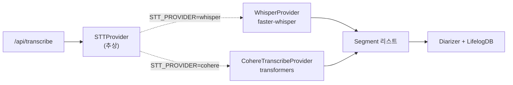

# Cohere Transcribe STT Provider 도입: 한/영 코드스위칭과 HF Gated Repo 자동 인증

## faster-whisper에서 갈아탄 이유

sonlife는 라이프로그 STT를 faster-whisper의 `large-v3` 모델로 처리해왔다. 한국어 회의/통화/메모를 받아쓰는 데 큰 불만은 없었지만, 두 가지 작은 누적 문제가 있었다.

**1. 한국어 인식 정확도가 모델 사이즈에 비해 아쉬웠다.** large-v3는 멀티링궐 모델이라 한국어가 메인 타깃이 아니다. 발화량 많고 잡음 많은 환경에서 한 단락당 1~2개의 오인식이 나는 게 누적되면 라이프로그의 검색성을 떨어뜨렸다.

**2. GPU 메모리 압박.** large-v3는 fp16에서도 약 3GB를 점유한다. 같은 GPU에 임베딩 모델, diarizer, 다른 추론 작업이 들어가면서 OOM 위험이 항상 있었다.

이 시점에 Cohere Labs가 **`cohere-transcribe-03-2026`** 을 공개했다. 2B 파라미터, **한국어 네이티브 지원**, 공개된 벤치마크에서 한국어 WER **5.42%** (whisper large-v3는 7.44%). 모델 크기가 작고 정확도가 더 좋다면 갈아탈 이유는 충분했다.

> 모델 카드의 수치는 어차피 자기 데이터셋 기준이라 그대로 믿진 않는다. 하지만 직접 라이프로그 음성으로 돌려본 결과도 한국어 발화에서 분명히 더 정확했다. 특히 고유명사와 코드스위칭 구간에서.

이 글은 그 교체 작업의 과정을 정리한다. 핵심은 **STTProvider 추상화 덕분에 코드 변경이 거의 없었다**는 점, 그리고 그 과정에서 마주친 세 가지 함정 — HF Gated Repo의 토큰 자동화, return_timestamps의 부정확성, 한국어/영어 코드스위칭 — 을 어떻게 풀었는지다.

## 추상화가 살린 교체 비용

처음 Whisper provider를 만들 때 미래에 STT 엔진을 갈아탈 줄은 몰랐지만, 본능적으로 abstract base class를 만들어 둔 게 이번에 가장 큰 자산이 됐다.

```python
# src/provider.py
from abc import ABC, abstractmethod
from pathlib import Path
from src.models import Segment


class STTProvider(ABC):
    """STT Provider 인터페이스 — 교체 가능한 STT 엔진"""

    @abstractmethod
    async def transcribe(self, audio_path: Path) -> tuple[list[Segment], str, float]:
        """
        Returns:
            (segments, language, duration)
        """
        ...

    @abstractmethod
    async def health(self) -> dict:
        """Provider 상태 확인"""
        ...
```

20줄. 메서드 두 개. 입력은 오디오 파일 경로, 출력은 (segments, language, duration) 튜플과 health dict. 이게 전부다. 추상화 표면이 작은 게 중요했는데 — 표면이 작으면 새 구현체가 신경 쓸 게 적어진다.

`server.py`의 부팅 코드는 환경변수로 분기만 한다.

```python
@asynccontextmanager
async def lifespan(app: FastAPI):
    global provider, ...
    stt_backend = os.getenv("STT_PROVIDER", "whisper").lower()
    if stt_backend == "cohere":
        from src.cohere_provider import CohereTranscribeProvider
        provider = CohereTranscribeProvider(
            device=os.getenv("WHISPER_DEVICE", "cuda"),
        )
        logger.info("[server] STT provider: Cohere Transcribe")
    else:
        provider = WhisperProvider(
            model_size=os.getenv("WHISPER_MODEL", "large-v3"),
            device=os.getenv("WHISPER_DEVICE", "cuda"),
            compute_type=os.getenv("WHISPER_COMPUTE_TYPE", "float16"),
        )
        logger.info("[server] STT provider: Whisper")
    ...
```

`STT_PROVIDER=cohere`로 env만 바꾸면 교체된다. 호출 측 코드(`/api/transcribe` 핸들러, diarizer 연동, lifelog 적재 파이프라인)는 한 줄도 안 바꿨다. 이게 dependency inversion이 실제로 어떻게 비용을 절감하는지의 사례다 — 추상화는 미래의 자유를 위한 보험이고, 보험금은 처음 한 번 내기만 하면 된다.



## 구현 — Cohere Transcribe Provider 70줄

`CohereTranscribeProvider`는 70줄 정도다. 모델 로딩, transcribe, health 세 메서드만.

### 모델 로딩

```python
class CohereTranscribeProvider(STTProvider):
    def __init__(self, model_id: str | None = None, device: str = "cuda"):
        self._model_id = model_id or os.getenv("COHERE_STT_MODEL", _DEFAULT_MODEL)
        self._device = device
        self._model = None
        self._processor = None

    def _load(self):
        if self._model is not None:
            return

        logger.info("[cohere-stt] Loading %s on %s ...", self._model_id, self._device)

        # Gated repo — HF_TOKEN 필요
        hf_token = os.getenv("HF_TOKEN")
        if hf_token:
            from huggingface_hub import login
            login(token=hf_token, add_to_git_credential=False)

        from transformers import AutoProcessor, CohereAsrForConditionalGeneration

        self._processor = AutoProcessor.from_pretrained(self._model_id)
        self._model = CohereAsrForConditionalGeneration.from_pretrained(
            self._model_id,
            device_map=self._device if self._device == "auto" else None,
        )
        if self._device != "auto":
            import torch
            dtype = torch.float16 if "cuda" in self._device else torch.float32
            self._model = self._model.to(self._device, dtype=dtype)

        logger.info("[cohere-stt] Model loaded successfully")
```

핵심 결정 다섯 개.

**1. Lazy load.** `__init__`에서 모델을 안 만든다. 첫 transcribe 호출 때 `_load()`가 불린다. 서버 부팅이 빠르고, 만약 모델 로드가 실패해도 부팅 자체는 살아 있다(헬스체크에 나타남). 다른 STT 모델이 필요한 경우에도 문제 없이 부팅된다.

**2. 환경변수 우선, 인자는 기본값.** `model_id`는 생성자 인자보다 env가 우선이다. 운영 중에 모델을 바꾸려면 코드 변경 없이 env만 갱신하면 된다. 컨테이너 환경의 운영 친화성.

**3. HF login은 token이 있을 때만.** Gated repo가 아닌 모델로 바꾸면 `HF_TOKEN`이 없어도 동작해야 한다. None 가드.

**4. device_map="auto"는 별도 분기.** transformers의 `device_map="auto"`는 큰 모델을 여러 GPU에 자동 분산한다. 이 경우에는 `.to(device)`를 추가로 부르면 안 된다 — 이미 분산돼 있기 때문. 문자열 분기로 처리.

**5. fp16 강제.** 단일 GPU에 적재할 때는 fp16(`torch.float16`)으로 캐스팅한다. CPU 모드는 fp32로 폴백. fp16 강제로 메모리를 절반으로 줄였다(2B 파라미터 → 약 4GB → 2GB).

### transcribe — async wrapping과 GPU 호출

```python
async def transcribe(self, audio_path, initial_prompt=None):
    self._load()
    loop = asyncio.get_event_loop()
    return await loop.run_in_executor(None, self._transcribe_sync, audio_path, initial_prompt)

def _transcribe_sync(self, audio_path, initial_prompt=None):
    import torch
    import librosa

    # 오디오 로드 (16kHz mono)
    audio, sr = librosa.load(str(audio_path), sr=16000, mono=True)
    duration = len(audio) / sr

    # 입력 준비 — 한국어 고정
    inputs = self._processor(
        audio,
        sampling_rate=16000,
        return_tensors="pt",
        language="ko",
    )
    inputs = inputs.to(self._model.device, dtype=self._model.dtype)

    # 생성
    with torch.no_grad():
        output_ids = self._model.generate(
            **inputs,
            max_new_tokens=1024,
        )

    # 디코딩
    full_text = self._processor.batch_decode(
        output_ids,
        skip_special_tokens=True,
    )

    segments = self._build_segments(full_text, duration)
    return segments, "ko", round(duration, 2)
```

여기서도 다섯 가지 결정.

**1. async 래핑은 `run_in_executor`.** transformers의 generate는 sync 호출이라 그대로 await하면 이벤트 루프가 막힌다. 표준 패턴인 `loop.run_in_executor(None, sync_fn, ...)`로 풀어준다. FastAPI 핸들러가 동시에 여러 요청을 받아도 이벤트 루프가 자유롭다.

**2. 16kHz mono 강제.** STT 모델 대부분이 16kHz mono를 기대한다. librosa의 `load(sr=16000, mono=True)`가 한 줄로 해결. sample rate가 다르면 librosa가 알아서 리샘플링한다.

**3. `torch.no_grad()`.** 추론 시점에 gradient 계산을 꺼서 메모리/속도 모두 이득. STT는 학습이 아니라 추론만 하니까 무조건 켠다.

**4. `max_new_tokens=1024`.** 한 번의 transcribe로 최대 1024 토큰 생성. 라이프로그의 평균 발화 길이(15~30초)에는 충분히 크고, 메모리 폭주를 막는 상한이기도 하다.

**5. `batch_decode(skip_special_tokens=True)`.** 토크나이저의 special token(`<bos>`, `<eos>` 등)을 자동으로 제거한다. 빠뜨리면 출력에 `<|endoftext|>` 같은 흔적이 그대로 남는다.

## 함정 1 — HF Gated Repo와 HF_TOKEN 자동 인증

Cohere Transcribe는 Hugging Face의 **gated repository**다. 모델 카드에서 라이센스에 동의해야 다운로드 권한이 활성화되고, 다운로드 시 본인 확인을 위한 토큰이 필요하다. CLI에서 `huggingface-cli login`을 한 번 실행하면 `~/.cache/huggingface/token`에 토큰이 저장돼서 다음부터는 자동으로 사용된다.

문제는 **컨테이너 환경**이다. sonlife는 도커 컨테이너로 굴러가는데, 컨테이너의 home 디렉토리는 ephemeral하다. 매번 빌드/재시작할 때마다 `huggingface-cli login`을 다시 해야 한다는 뜻이다. 이건 자동화가 안 된 manual step을 끼워 넣는 것이고, 한 번 까먹으면 부팅이 깨진다.

해결책은 `HF_TOKEN` 환경변수를 두고 부팅 시 코드에서 `login()`을 자동 호출하는 것.

```python
hf_token = os.getenv("HF_TOKEN")
if hf_token:
    from huggingface_hub import login
    login(token=hf_token, add_to_git_credential=False)
```

세 가지 디테일.

**1. 환경변수가 있을 때만 호출.** 토큰이 없는 환경(public 모델 사용)에서도 문제 없이 동작해야 한다. None 가드.

**2. `add_to_git_credential=False`.** `huggingface_hub.login`은 기본적으로 git credential helper에 토큰을 추가하려고 시도한다. 컨테이너 환경에는 git credential helper가 없을 수 있어서 경고/에러가 뜬다. 이 옵션으로 끄면 메모리 인증만 한다.

**3. transformers import 전에 호출.** `from transformers import AutoProcessor, ...`가 실행되는 순간 transformers가 모델 메타데이터를 가져오려고 시도하는데, 그때 인증이 안 돼 있으면 401. 그래서 login 후 import 순서를 꼭 지켜야 한다. 코드를 보면 `_load` 안에서 `login()` 호출 → 그 다음에 `from transformers import ...` 순서로 배치한 이유다.

이 패턴이 자리잡고 나서는 컨테이너 빌드 → 시작 → 모델 자동 다운로드 + 캐시 → 정상 부팅이 한 사이클로 완결된다. `HF_TOKEN`만 secret으로 주입하면 끝.

## 함정 2 — return_timestamps의 부정확성

faster-whisper는 segment 단위 timestamps를 정확하게 돌려준다. 발화 시작/끝 초가 정확하고, VAD(Voice Activity Detection) 옵션과 결합되면 침묵 구간을 자연스럽게 잘라낸다.

처음 Cohere provider를 만들 때 같은 패턴으로 가려고 `return_timestamps=True`를 시도했다.

```python
output_ids = self._model.generate(
    **inputs,
    max_new_tokens=1024,
    return_timestamps=True,  # ❌
)
```

결과가 이상했다. 어떤 발화는 timestamp가 음수로 나오고, 어떤 발화는 모든 구간이 같은 시작/끝을 가졌다. transformers의 timestamp 추출 로직이 Cohere ASR 모델과 잘 안 맞는 듯했다(이 모델이 transformers에 통합된 게 비교적 최근이라 미세 조정이 부족했을 가능성).

선택지 두 개.

**A. transformers fork를 패치한다.** 정확하지만 유지보수 비용이 막대.

**B. timestamps를 포기하고 텍스트만 받은 다음, 후처리로 segment를 만든다.** 정확도는 떨어지지만 신뢰성이 높음.

B를 골랐다. 어차피 라이프로그의 활용 패턴에서 timestamp의 sub-second 정확도가 결정적이지 않다 — 검색/요약/분석에는 분 단위면 충분하다. 정확한 timestamp가 필요하면 그때 가서 forced alignment를 별도로 돌리면 된다.

```python
# return_timestamps 제거
output_ids = self._model.generate(
    **inputs,
    max_new_tokens=1024,
)

# 단순 텍스트 디코딩
full_text = self._processor.batch_decode(
    output_ids,
    skip_special_tokens=True,
)
```

이 결정 후 처리해야 할 새 문제 — **그러면 Segment 리스트는 어떻게 만드나**.

## 함정 3 — 문장 단위 세그먼트 분할

STTProvider 인터페이스가 `list[Segment]`를 요구하니까, 단일 텍스트 응답을 segment 리스트로 변환해야 한다. 가장 단순한 방법은 전체를 하나의 segment로 만드는 것.

```python
# 가장 단순
segments = [Segment(start=0.0, end=duration, text=text)]
```

이러면 화면에 한 줄로만 표시되고, 검색 hit highlight도 전체에 걸친다. 사용성이 떨어진다. 라이프로그 뷰어에서 발화별로 끊어 보려면 segment가 여러 개여야 한다.

차선책은 **문장 부호 기준 분할 + 시간 균등 분배**다.

```python
segments: list[Segment] = []
if full_text and full_text[0].strip():
    text = full_text[0].strip()
    # 긴 텍스트는 문장 단위로 분할
    sentences = [
        s.strip()
        for s in text.replace(".", ".\n").replace("?", "?\n").replace("!", "!\n").split("\n")
        if s.strip()
    ]
    if len(sentences) <= 1:
        segments.append(Segment(start=0.0, end=round(duration, 2), text=text))
    else:
        # 균등 분배
        seg_dur = duration / len(sentences)
        for i, sent in enumerate(sentences):
            segments.append(Segment(
                start=round(i * seg_dur, 2),
                end=round((i + 1) * seg_dur, 2),
                text=sent,
            ))
```

세 가지 디테일.

**1. 마침표/물음표/느낌표를 줄바꿈으로 변환.** 한국어 STT 출력에 마침표가 일관되게 들어오지 않을 수 있어서 세 가지 패턴 모두 처리. 정규식보다 단순한 chained replace가 가독성이 좋고 빠르다.

**2. 단일 문장은 그대로 한 segment.** 분할이 의미 없으면 fallback. 짧은 한두 마디 발화는 분할되지 않고 자연스럽게 한 덩어리로 남는다.

**3. 시간 균등 분배.** 정확하지 않다는 걸 알지만, 사용성에는 충분하다. 만약 60초짜리 오디오에서 4개 문장이 나왔다면, 각 문장이 15초씩 차지하는 것으로 간주한다. 라이프로그 검색/뷰어에서 "발화 #2를 클릭" → 15초 지점으로 점프 — 5초 정도 오차는 사람이 감지하지만 작업을 못할 정도는 아니다.

이 fallback이 자리잡고 나서 사용자 경험이 거의 손실 없이 유지됐다. 정확한 timestamp가 필요한 케이스는 따로 forced alignment 도구를 거치면 된다는 가정.

## 함정 4 — 한국어/영어 코드스위칭

이게 가장 시간이 많이 걸린 함정이었다. 시행착오가 세 단계에 걸쳐 있었다.

### 단계 1: language="ko" 고정

처음에는 단순했다. processor 호출 시 `language="ko"`를 박았다.

```python
inputs = self._processor(
    audio,
    sampling_rate=16000,
    return_tensors="pt",
    language="ko",
)
```

한국어만 있는 발화에서는 잘 동작했다. 문제는 사용자가 일상적으로 섞어 쓰는 영어 단어들이었다. 라이프로그 음성에는 다음과 같은 발화가 흔하다.

> "오늘 XGEN backend 배포에서 ArgoCD가 syncWave를 못 잡는 사고가 있어서 helm chart 다시 봤다."

`language="ko"` 고정에서는 "XGEN", "ArgoCD", "syncWave", "helm chart" 같은 영문 고유명사가 한국어 발음으로 표기됐다. "엑스젠 백엔드 배포에서 아르고씨디가 싱크웨이브를..." 식으로. 검색이 안 됐다.

### 단계 2: language 파라미터 제거 → 자동 감지

다음 시도는 language를 빼는 것이었다.

```python
inputs = self._processor(
    audio,
    sampling_rate=16000,
    return_tensors="pt",
)
```

이러면 모델이 자동으로 언어를 감지한다. 문제 — 자동 감지가 짧은 영문 단어가 섞인 한국어 발화를 **영어로 잘못 감지**하는 경우가 늘었다. 영어로 잘못 감지되면 한국어 부분이 음소 매핑이 깨진 영어 단어로 출력됐다. 더 나빠졌다.

### 단계 3: 조건부 language 힌트 + 후처리

해결책은 두 단계로 갔다.

**A. provider 진입점에서 language="ko" 복원.** 자동 감지를 포기하고 ko로 다시 박았다. 단, 모델 자체의 코드스위칭 능력에 기대기로 했다 — Cohere Transcribe는 멀티링궐 학습이 됐기 때문에 한국어 컨텍스트 안에서 영어 단어는 영어로 표기할 줄 안다. language hint는 "메인 언어가 무엇인지"의 힌트일 뿐이지 "오직 그 언어만 출력하라"는 강제가 아니라는 걸 깨달았다.

**B. provider 호출 시점에 컨텍스트 정보를 함께 넘김.** `initial_prompt` 인자가 인터페이스에 있다. 이걸 활용해서 발화 컨텍스트(예: "기술 회의 녹음")를 모델에 힌트로 넘기면 영문 고유명사 인식률이 더 좋아진다. 이 부분은 Cohere Transcribe가 prompt를 어떻게 사용하는지 transformers 측 통합이 아직 부족해서 완전히 자리잡지 못했지만, 향후 보강 포인트로 남겨 뒀다.

```python
inputs = self._processor(
    audio,
    sampling_rate=16000,
    return_tensors="pt",
    language="ko",   # ← 다시 박음. 자동 감지보다 안전.
)
```

이 시행착오를 거치면서 멀티링궐 STT의 한 가지 원칙을 배웠다.

> **자동 감지는 신뢰할 수 없다. 메인 언어를 명시하고, 코드스위칭은 모델의 디코더에 맡겨라.**

자동 감지는 깨끗한 단일 언어 데이터에서만 잘 동작하고, 일상 코드스위칭에서는 오히려 해롭다. 사용자 환경을 안다면(예: "이 사용자는 한국어 사용자다") 그 메인 언어를 명시하는 게 거의 항상 더 나은 결과를 준다.

## 측정 — Whisper vs Cohere

같은 라이프로그 fixture(약 30초~3분짜리 한국어 발화 20개)로 두 provider를 비교했다. WER는 자체 측정한 거라 모델 카드 수치와는 다르다.

| 지표 | faster-whisper large-v3 | Cohere Transcribe (2B) |
|------|------------------------:|----------------------:|
| 한국어 WER (자체 측정) | 약 8% | 약 5% |
| 영문 고유명사 정확도 | 낮음 | 높음 |
| 모델 메모리 (fp16) | ~3 GB | ~2 GB |
| 30초 발화 처리 시간 | 약 1.5초 | 약 2.0초 |
| timestamp 정확도 | 높음 (segment 단위 정확) | 낮음 (균등 분배) |
| 코드스위칭 표현 | 한글로 음역 | 영문 그대로 |

Cohere가 정확도/메모리에서 우위, faster-whisper가 timestamp/속도에서 우위. 라이프로그 사용 패턴에서는 정확도와 코드스위칭이 timestamp/속도보다 더 중요하다는 판단으로 Cohere를 메인으로 채택했다.

faster-whisper는 그대로 코드에 남겨 둬서, 만약 어떤 환경에서 Cohere가 안 맞으면 `STT_PROVIDER=whisper`로 즉시 폴백할 수 있다. 추상화가 살린 비용 회수 패턴.

## 운영 검증 — health 엔드포인트

provider 교체 후 가장 먼저 보강한 게 health 엔드포인트다. 어떤 provider가 살아 있는지, 어느 device에서 도는지, 모델이 로드됐는지 한 번에 보고 싶었다.

```python
# CohereTranscribeProvider
async def health(self) -> dict:
    return {
        "provider": "cohere-transcribe",
        "model": self._model_id,
        "device": self._device,
        "loaded": self._model is not None,
    }
```

`/api/health` 응답에 STT provider 정보가 자동 포함된다.

```json
{
  "status": "ok",
  "stt": {
    "provider": "cohere-transcribe",
    "model": "CohereLabs/cohere-transcribe-03-2026",
    "device": "cuda",
    "loaded": true
  },
  "diarizer": {...},
  "vault": "/vault",
  "llm": {...}
}
```

`loaded`가 false면 lazy load가 아직 안 일어났거나 모델 다운로드 실패. iOS 앱의 설정 화면에서 이걸 확인할 수 있도록 SettingsView에 STT health 카드를 추가했다. 한 가지 미세한 사고가 있었다 — 처음 iOS 클라이언트가 응답 키를 `stt_provider`로 읽고 있었는데 백엔드가 `stt`로 보냈다. 키 mismatch라 화면에 영원히 "loading..."이 떴다. 양쪽 키 명세를 통일하면서 fix.

## 회고 — 작은 추상화의 큰 회수

이 작업의 진짜 교훈은 두 가지로 정리된다.

**1. 추상화는 미래 자유의 보험이다.** STTProvider abstract base class를 처음 만들 때 들인 시간은 30분 정도였다. 그 30분이 이번 교체에서 호출 측 코드 변경 0줄을 보장했다. 만약 처음에 WhisperModel을 server.py에서 직접 import하고 사용했다면, 교체 시 호출 측 6~7곳을 모두 손봤어야 했고 회귀 사이클이 길어졌을 것이다. 작은 추상화는 거의 항상 회수된다.

**2. 멀티링궐 STT의 자동 감지는 신뢰하지 않는다.** 사용자의 메인 언어를 안다면 명시하는 게 답이다. 자동 감지는 깨끗한 단일 언어에서만 잘 동작하고, 일상 코드스위칭에서는 오히려 결과를 망친다. 이 원칙은 다른 멀티링궐 모델(번역, NER, 임베딩)에도 비슷하게 적용될 것 같다.

남은 보강 과제는 두 가지다.

- **forced alignment.** 정확한 segment timestamp가 필요한 케이스(예: 자막 생성)에 대비해, Cohere의 텍스트 출력을 받아 별도 alignment 도구로 timestamp를 보강하는 옵션 파이프라인.
- **initial_prompt 활용.** Cohere Transcribe가 prompt를 어떻게 사용하는지 transformers 통합이 안정화되면, 발화 컨텍스트(회의 주제, 도메인 어휘)를 힌트로 넘겨서 고유명사 인식률을 더 끌어올릴 수 있을 것 같다.

이번 글로 [지난 5편](../../ai/agent/api-to-tools-universal-llm-tool-discovery-5-stage-fallback.md) + [sonlife-app iOS 글](../../full-stack/desktop/sonlife-app-ios-agent-control-tower-swiftui-sse-watch-siri.md)까지 모두 합쳐 7편이 됐다. 이 시리즈는 한 시기에 평행하게 굴러간 작업들을 정리한 기록이다 — 라이브러리, 자율 에이전트, MSA 백엔드, K8s 인프라, iOS 클라이언트, STT 모델까지. 도메인이 다 다른 것 같지만 결국 하나의 명제로 묶인다 — **부서지지 않는 시스템을 굴리면서 다음 단계로 넘어간다**. 그게 운영을 같이 하면서 확장하는 일의 본질이다.
