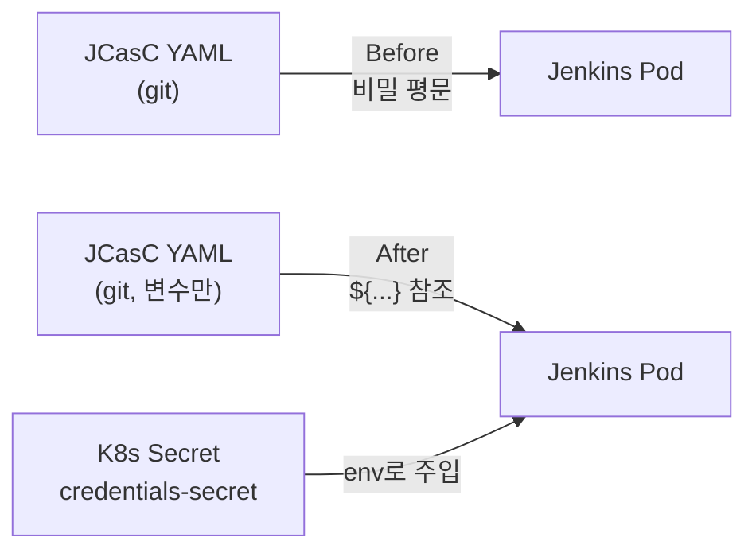

# Jenkins 자격증명 하드코딩 제거: K8s Secret + JCasC 변수 참조 전환과 부수 인프라 fix

## 왜 이 작업이 미뤄지고 있었나

JCasC(Jenkins Configuration as Code)로 Jenkins를 관리하기 시작했을 때, 가장 빠르게 굴리는 방법은 admin 자격증명을 YAML에 그대로 적는 것이다. 첫 부팅이 한 번에 되고, JCasC가 의도대로 동작하는지 확인하기 쉽고, 어차피 dev 환경이라는 핑계가 통한다.

```yaml
# bad — 하드코딩
jenkins:
  securityRealm:
    local:
      allowsSignup: false
      users:
        - id: "admin"
          password: "admin1234"
```

이 패턴은 처음에는 무해해 보이지만 시간이 지나면서 누적되는 빚이다. 첫째, JCasC YAML이 git에 들어가는 순간 비밀이 git 히스토리에 영구히 남는다. 둘째, 환경별로 다른 비밀번호를 쓰려면 YAML이 환경별로 분기된다. 셋째, 비밀 회전이 사실상 불가능해진다 — 회전하려면 git 커밋이 따라붙고, 모든 환경에 동시에 배포해야 한다.

이 작업은 한참 미뤄져 있었다. 이번에 다른 인프라 fix들과 묶어서 한꺼번에 정리했다. 이 글은 자격증명을 K8s Secret + JCasC 변수 참조로 옮긴 절차와, 같은 시기에 묶어 처리한 Fuseki deployment strategy 변경, JCasC TARGET_ENV 파라미터 오버라이드, SSE 스트리밍 라우트 fix를 함께 정리한다.

> 회사 인프라와 관련된 작업이라 실제 키 이름/값/도메인은 일반화했다. 패턴과 의사결정 위주로 본다.

## 목표 — 무엇을 무엇으로 바꾸나



전환 후의 흐름:

1. K8s Secret이 admin user/password를 보유한다. git에 들어가지 않는다.
2. Jenkins Pod의 deployment가 그 Secret을 환경변수로 주입한다.
3. JCasC YAML은 `${JENKINS_ADMIN_PASSWORD}` 같은 변수 참조만 갖는다.
4. Jenkins가 부팅하면서 JCasC 플러그인이 환경변수를 치환한다.

git에 남는 건 변수 이름뿐이다. 비밀의 실체는 K8s Secret 안에만 있고, 회전은 Secret만 갱신하면 된다.

## Step 1 — Secret 정의

K8s Secret은 단순한 dict이지만, 무엇을 키로 둘지가 의외로 중요하다. 경험상 두 가지 원칙을 따른다.

1. **키 이름은 환경변수 명명 규칙(UPPER_SNAKE_CASE)으로.** Pod에 바로 env로 매핑할 때 이름이 그대로 쓰이기 때문.
2. **하나의 secret에 한 서비스의 모든 자격증명을 묶는다.** Jenkins용은 한 Secret, ArgoCD용은 다른 Secret. 너무 잘게 쪼개면 mount가 복잡해지고, 너무 크게 묶으면 Secret 회전 시 영향 범위가 넓어진다.

```yaml
# credentials-secret.yaml
apiVersion: v1
kind: Secret
metadata:
  name: jenkins-credentials
  namespace: ci
type: Opaque
stringData:
  JENKINS_ADMIN_USER: "admin"
  JENKINS_ADMIN_PASSWORD: "<rotate-me>"
  JENKINS_AGENT_SECRET: "<rotate-me>"
  REGISTRY_USERNAME: "<rotate-me>"
  REGISTRY_PASSWORD: "<rotate-me>"
```

`stringData`를 쓰면 base64 인코딩이 자동이라 매니페스트가 사람이 읽기 쉽다. 실 운영에서는 sealed-secrets, sops, 또는 외부 secret manager(Vault, AWS Secrets Manager)를 통해 이걸 git에서 격리한다. 이번 케이스에서는 K8s Secret은 직접 적용하고, 매니페스트는 git에 넣지 않는 정책으로 갔다.

## Step 2 — Pod에 환경변수 주입

Jenkins deployment(또는 helm values)에서 secret의 키를 env로 매핑한다.

```yaml
# jenkins-deployment.yaml (발췌)
spec:
  containers:
    - name: jenkins
      env:
        - name: JENKINS_ADMIN_USER
          valueFrom:
            secretKeyRef:
              name: jenkins-credentials
              key: JENKINS_ADMIN_USER
        - name: JENKINS_ADMIN_PASSWORD
          valueFrom:
            secretKeyRef:
              name: jenkins-credentials
              key: JENKINS_ADMIN_PASSWORD
```

`secretKeyRef`로 명시적으로 매핑하면 Pod 명세를 보면서 어떤 secret의 어떤 키를 쓰는지 알 수 있다. `envFrom: secretRef` 패턴으로 일괄 주입할 수도 있는데, 그러면 어떤 키들이 들어가는지 추적이 어려워진다. 보안성이 중요한 자격증명은 한 키씩 명시하는 게 낫다.

## Step 3 — JCasC YAML을 변수 참조로

JCasC 플러그인은 `${VAR_NAME}` 형식의 placeholder를 환경변수에서 자동으로 치환한다. 이전 하드코딩 부분을 다음과 같이 바꾼다.

```yaml
# jenkins.yaml (JCasC)
jenkins:
  securityRealm:
    local:
      allowsSignup: false
      users:
        - id: "${JENKINS_ADMIN_USER}"
          password: "${JENKINS_ADMIN_PASSWORD}"

credentials:
  system:
    domainCredentials:
      - credentials:
          - usernamePassword:
              scope: GLOBAL
              id: "registry-creds"
              username: "${REGISTRY_USERNAME}"
              password: "${REGISTRY_PASSWORD}"
```

placeholder 치환은 부팅 시 한 번 일어난다. 환경변수가 비어 있으면 JCasC가 빈 문자열을 그대로 password로 박는데, 이건 보안 사고의 원인이 될 수 있다. JCasC는 `${ENV_VAR:-default}` 문법도 지원하니까, 안전한 디폴트가 의미 있는 값에 대해서는 fallback을 두는 것도 한 방법이다. admin password는 fallback이 의미 없으니 그냥 비어 있으면 부팅 자체를 실패시키는 게 낫다.

## Step 4 — 부팅 검증

전환 직후 가장 먼저 확인해야 할 것:

1. **Pod가 정상 부팅되는지.** Secret이 없거나 키 이름이 다르면 deployment가 CreateContainerConfigError로 멈춘다. `kubectl describe pod`로 확인.
2. **JCasC가 placeholder를 치환했는지.** Jenkins 로그에 "JCasC processed jenkins.yaml" 라인이 있어야 한다. 치환 실패 시 변수가 그대로 사용자명/비밀번호로 박힌다.
3. **로그인 가능한지.** 새 비밀번호로 admin 계정 로그인.
4. **기존 credential 항목이 보존되는지.** 마이그레이션 중에 credential ID가 바뀌면 그 ID를 참조하는 파이프라인이 깨진다.

이 네 단계를 staging에서 한 번, prod에서 한 번 더 거쳤다. 마이그레이션 직후에는 옛 평문 YAML 버전을 git에서 즉시 삭제하지 말고 한두 시간 정도 둬서, 만약 부팅이 안 되면 즉시 롤백할 수 있게 했다. 그 후 git 히스토리도 되도록 정리해서 평문이 남지 않도록 한다(이미 push된 비밀은 회전이 정답이다).

## 묶어서 처리한 부수 fix들

이 자격증명 정리와 같은 시기에 인프라 PR을 몇 개 함께 처리했다. 보안 전환을 한 PR에 몰아넣는 것보다, 작은 fix를 같이 묶어 staging 회귀 한 번에 끝내는 게 효율적이라 그렇게 했다. 각각의 배경과 결정을 짧게 남겨 둔다.

### Fix 1 — Fuseki deployment strategy를 RollingUpdate → Recreate

Apache Jena Fuseki(SPARQL endpoint)를 Pod 한 개로 운영 중인데, 메모리 사용량이 항상 한계 근처였다. RollingUpdate 전략은 새 Pod를 띄우고 옛 Pod를 죽이는 동안 두 Pod가 잠시 공존한다. 메모리 한계가 빡빡한 환경에서는 이 잠깐의 공존만으로도 OOM이 일어난다. 새 Pod가 시작 중에 죽고, 옛 Pod도 종료 처리 중이라 결국 양쪽 다 사라지는 사고.

해결은 `Recreate` 전략으로 변경.

```yaml
spec:
  strategy:
    type: Recreate
```

`Recreate`는 옛 Pod를 먼저 죽이고 그 다음 새 Pod를 띄운다. 메모리 사용량이 두 배가 될 일이 없다. 단점은 down time이 발생한다는 것 — 옛 Pod가 죽고 새 Pod가 ready가 될 때까지 SPARQL endpoint가 응답하지 않는다.

이 트레이드오프를 받아들인 이유는 두 가지.

1. Fuseki는 비동기 백오피스 서비스라 1~2분 down time이 사용자 경험을 직접 망가뜨리지 않는다.
2. RollingUpdate 중에 OOM으로 양쪽 Pod가 다 죽는 사고가 down time이 있는 Recreate보다 훨씬 위험하다.

비슷한 상황에서 옛날 같으면 메모리 limit을 늘려서 RollingUpdate를 유지하려 했을 텐데, Fuseki의 메모리 사용량이 워크로드 따라 변동이 심해서 limit 증액만으로는 안전하지 않았다. 전략 자체를 바꾸는 게 더 견고하다.

### Fix 2 — JCasC 폴더 빌드의 TARGET_ENV 파라미터 오버라이드 허용

JCasC로 빌드 잡을 일괄 생성하는데, 폴더 단위로 `TARGET_ENV` 같은 파라미터의 기본값을 박아 두는 패턴을 쓴다. 어떤 폴더는 dev, 어떤 폴더는 stg, 어떤 폴더는 prod. 그런데 JCasC가 폴더 파라미터를 잡 단위 override보다 우선시하는 기본 동작이라, 잡에서 명시한 `TARGET_ENV`가 무시되고 폴더 디폴트만 적용되는 사고가 있었다.

원인은 JCasC의 `propertiesStrategy`가 기본적으로 `merge` 모드라 폴더 파라미터를 잡 파라미터 위에 덮어쓰는 것. fix는 잡 정의에서 명시적으로 override를 허용하도록 옵션을 켰다.

```groovy
// 잡 정의에서 폴더 파라미터를 override할 수 있게 함
parameters {
  string {
    name('TARGET_ENV')
    defaultValue("${TARGET_ENV ?: 'dev'}")  // 잡 빌드 파라미터로 들어오면 그게 우선
    description('Build target environment')
  }
}
```

이 한 줄로 폴더 디폴트는 유지하되 잡 빌드 시점에 사용자가 다른 환경을 지정하면 그게 우선 반영된다. JCasC의 명시성을 살린 fix.

### Fix 3 — SSE 스트리밍 라우트 누락 보정

같은 시기에 frontend gateway 쪽에서 SSE 스트리밍 경로 일부가 라우팅 누락된 사고가 있었다. SSE는 일반 REST보다 까다로운 게, 응답이 즉시 끝나지 않고 chunk가 계속 흘러나온다. nginx/ingress가 buffer flush를 안 해 주면 클라이언트가 메시지를 한참 뒤에 받거나 아예 timeout으로 끊긴다.

fix 두 가지를 같이 했다.

1. **누락된 SSE 라우트를 ingress에 명시.** `/api/v1/stream/*`, `/api/v1/agent/events` 같은 경로가 default 라우팅에 안 잡혀 있었다.
2. **SSE 라우트만 buffer off.** ingress annotation으로 해당 경로의 proxy buffering을 끈다.

```yaml
metadata:
  annotations:
    nginx.ingress.kubernetes.io/proxy-buffering: "off"
    nginx.ingress.kubernetes.io/proxy-read-timeout: "3600"
    nginx.ingress.kubernetes.io/proxy-send-timeout: "3600"
```

`proxy-buffering: off`는 ingress 전체가 아니라 SSE 경로만 적용한다. 일반 REST에는 buffering이 켜져 있어야 효율이 좋다. Ingress의 path-level annotation을 활용한 fix.

## 정리 — 작은 fix를 묶어 처리하는 가치

이번 작업은 한 가지 큰 보안 전환(자격증명)과 세 가지 작은 fix(Fuseki, JCasC override, SSE)를 한 staging 회귀 사이클에 묶어 처리한 케이스다. 이런 패턴이 가져오는 이점이 몇 가지 있다.

**1. 회귀 비용을 한 번만 낸다.** 인프라 변경은 staging에 배포하고 결과를 확인하는 루프가 무겁다. 작은 fix들을 따로따로 굴리면 매번 회귀 사이클을 다시 돌아야 한다. 한 번에 묶으면 회귀 1회로 끝난다.

**2. 변경 폭이 분명해진다.** 자격증명 전환 같은 큰 변경 한 건만 있는 PR은 리뷰가 무겁고 수정이 한 박자에 안 끝난다. 보조 fix와 묶으면 PR 단위가 적당히 커지고, 리뷰 시 "어차피 이번에 인프라 정리하는 김에" 분위기로 통과되기 쉽다.

**3. 의존성 순서를 자연스럽게 정리한다.** Fuseki Recreate는 Jenkins 자격증명 전환과 직접 관련은 없지만, 같은 staging 환경의 동시 안정성을 위해 같이 적용해야 한다. 한 PR에서 처리하면 의존성이 명시된다.

**단점은 분명히 있다.** PR이 너무 다양한 변경을 담으면 git blame이 어려워지고, 롤백 단위가 거칠어진다. 그래서 이번처럼 묶을 때는 **하나의 큰 변경 + 작은 부수 fix들**이라는 구조를 유지했다. 큰 변경이 두 개 이상이면 PR을 쪼개는 게 낫다.

## 회고 — Secret 관리는 결국 운영 문제다

자격증명을 K8s Secret으로 옮기는 코드 변경 자체는 30분이면 끝난다. 진짜 비용은 그 다음에 발생한다.

**1. Secret은 어떻게 회전하는가?** 비밀번호를 바꿔야 할 때 Secret만 갱신하면 안 되고, Jenkins Pod를 재시작해서 새 환경변수를 읽게 해야 한다. 자동화를 안 해 두면 회전이 점점 느려진다.

**2. Secret은 어떻게 git에 안 들어가도록 강제하는가?** 단순한 정책 문서로는 부족하다. pre-commit hook, CI 단계의 secret 스캐너(gitleaks 등), 또는 sealed-secrets 같은 패턴이 필요하다. 이번 작업에서는 Secret 매니페스트를 git에 안 두는 정책을 잡았지만, 다음 단계로 sealed-secrets 도입을 검토 중이다.

**3. Secret은 누가 볼 수 있는가?** K8s RBAC로 Secret read 권한을 분리해야 한다. cluster-admin이 너무 많으면 Secret 보안의 의미가 옅어진다. 이번 정리와 함께 Secret read 권한도 ci 네임스페이스의 운영자 역할로 좁혔다.

이 세 가지 운영 질문이 풀리지 않으면 코드 변경만으로는 진짜 보안 개선이 안 된다. 자격증명을 K8s Secret으로 옮긴 건 출발점일 뿐이다.

함께 처리한 Fuseki, JCasC override, SSE 라우트 fix는 각각 다른 도메인이지만 모두 "운영 중에 쌓여 가던 작은 부채"였다. 인프라 작업은 큰 마이그레이션 한 번에 모든 걸 해결할 수 없고, 결국 이런 작은 정리들의 누적이 시스템의 신뢰성을 만든다.

이번 시리즈 5편에서 다룬 주제들 — `api-to-tools`로 임의의 API를 LLM 도구로 변환하기, `graph-tool-call v0.19`의 tool result 압축, `sonlife` 자율 에이전트의 안전장치 설계, XGEN 2.0의 group → role 권한 마이그레이션, 그리고 이번 글의 Jenkins 자격증명 전환 — 은 모두 같은 시기에 평행하게 진행된 작업들이다. 라이브러리, 에이전트 시스템, MSA 백엔드, K8s 인프라까지 레이어가 다 다르지만, 공통점이 하나 있다. **현재 시스템이 부서지지 않으면서 다음 단계로 넘어가는 길을 찾는 일**이라는 것. 그게 결국 운영을 같이 하면서 확장하는 일의 본질인 것 같다.
