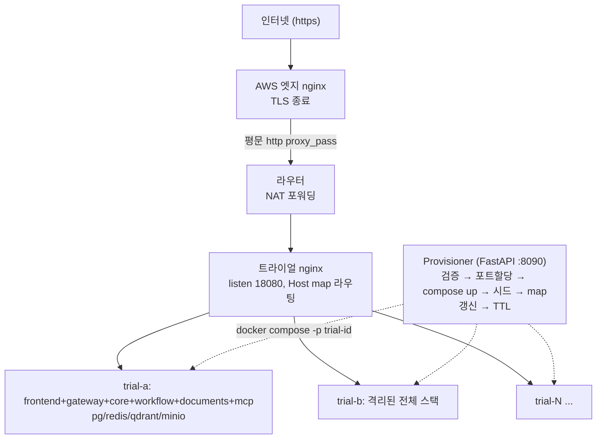
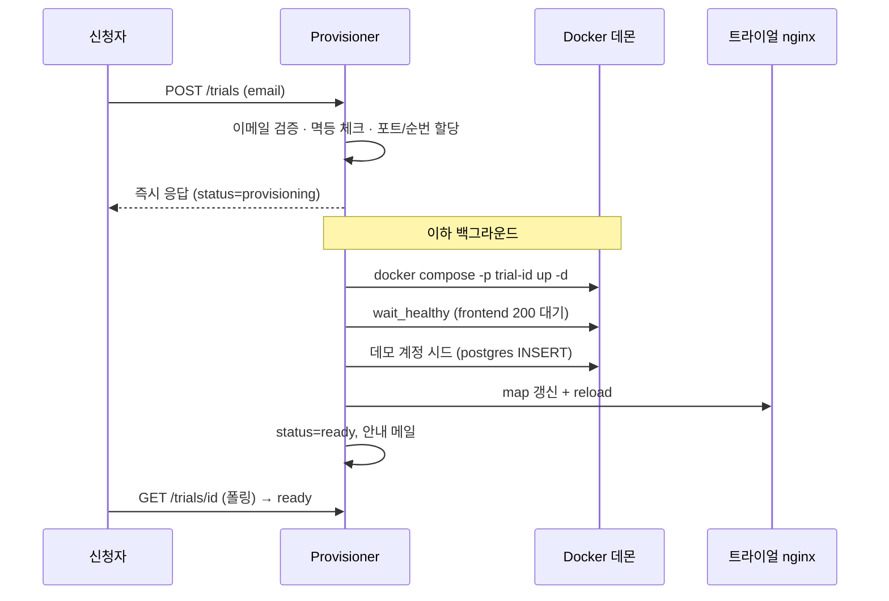
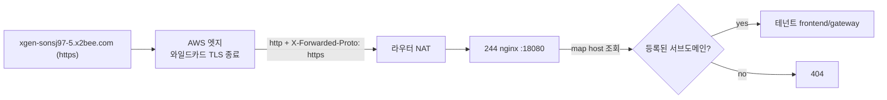

# 체험존 프로비저너: 신청 한 건으로 격리된 멀티테넌트 스택을 자동 발급하다

## 개요

XGEN 2.0은 7개 마이크로서비스로 구성된 AI 에이전트 플랫폼이다. 영업이나 데모 상황에서 "한 번 써보고 싶다"는 요청이 들어오면, 그때마다 사람이 직접 서버에 붙어 스택을 띄우고 계정을 만들고 URL을 안내했다. 신청자가 늘면 이 수작업은 곧 병목이 된다.

목표는 분명했다. **이메일 한 줄이 담긴 신청이 오면, 신청자마다 완전히 격리된 XGEN 전체 스택을 자동으로 발급하고, 전용 URL로 즉시 접속할 수 있게 하는 것**이다. 사람이 개입하지 않는 셀프서비스 체험존(Trial Zone)을 만드는 일이다.

문제를 분해하면 세 가지다.

1. 신청자마다 **격리된 풀스택**을 한 묶음으로 기동해야 한다. 한 사람의 데이터가 다른 사람에게 새면 안 된다.
2. 발급할 때마다 **전용 서브도메인**을 부여하고, 인증서 발급이나 DNS 레코드 추가 같은 수작업 없이 라우팅이 붙어야 한다.
3. 자원은 유한하다. 만료된 체험존은 **자동으로 회수**해서 RAM과 포트를 돌려받아야 한다.

이 글은 이 세 문제를 해결하는 프로비저너를 PoC부터 e2e 실기동까지 끌고 가며 겪은 설계 결정과 트러블슈팅을 정리한 것이다. 핵심은 화려한 오케스트레이터가 아니라, **"가장 단순한 구조로 격리와 자동화를 동시에 달성하는 선택"**과 **"실제로 돌려봐야만 드러나는 함정들"**이었다.

## 아키텍처 설계

### 격리 방식 3안 비교

가장 먼저 결정해야 할 것은 "테넌트 하나를 어떻게 격리하느냐"였다. 세 가지 안을 두고 비교했다.

| 안 | 격리 단위 | 기동 속도 | 격리 강도 | 운영 난이도 | 비고 |
|----|----|----|----|----|----|
| A. 진짜 DinD | `docker:dind` 안에서 compose up | 느림 (이미지 pull 반복) | 강 | privileged 필요, 보안 약점 | 최초 아이디어 |
| B. Compose per-tenant | 호스트 데몬에 `compose -p trial-<id>` | 빠름 (이미지 캐시 공유) | 중 | 쉬움 | **채택** |
| C. k8s 네임스페이스 | 테넌트별 namespace | 중 | 강 (NetworkPolicy) | 중 | 향후 확장 옵션 |

A안(Docker-in-Docker)은 직관적이다. 테넌트마다 독립된 도커 데몬을 띄우면 격리는 확실하다. 하지만 프로비전할 때마다 컨테이너 이미지 10개를 새로 pull하고 시작해야 하니 느리고 무겁고, `privileged` 컨테이너가 필요해 보안 표면이 넓어진다.

C안(k8s 네임스페이스)은 가장 정석이다. NetworkPolicy로 강하게 격리되고 확장성도 좋다. 다만 PoC 단계에서 당장 필요한 건 "빠르게 검증 가능한 최소 구조"였다.

결국 **B안 — 호스트 도커 데몬에서 compose 프로젝트 단위로 테넌트를 격리**하는 방식을 택했다. 이유는 다음과 같다.

- **이미지 캐시와 레이어를 테넌트 간에 공유**한다. 첫 테넌트가 이미지를 받아두면 그다음부터는 기동이 수 초로 끝나고 디스크도 절약된다. compose 프로젝트(`-p trial-<id>`)는 네트워크와 볼륨을 자동으로 격리해주므로, privileged나 DinD의 보안 위험 없이 격리 목적을 달성한다.
- **추론은 개인 LLM API 키로 외부 API를 호출**하도록 설계했다. 덕분에 GPU를 점유하는 공용 `xgen-model` 스택을 통째로 제거할 수 있었고, 수용량 계산이 GPU 병목 없이 **순수 RAM의 함수**로 단순해졌다.
- **프론트엔드는 재빌드 없이 재사용**된다. 프론트는 same-origin BFF 구조에 런타임 env(`NEXT_PUBLIC_BACKEND_HOST`)로 백엔드를 지정하므로, 빌드를 다시 하지 않고 env 주입만으로 다른 백엔드에 붙는다. 멀티테넌트에서 이 점이 결정적이었다.

### DB는 절대 공유하지 않는다

설계에서 타협하지 않은 원칙이 하나 있다. **테넌트마다 독립된 postgres를 띄운다.** 여러 버전의 앱이 같은 `plateerag` DB를 공유하면, 앱의 `auto_migrate`가 자기 스키마 기준으로 stale 컬럼을 DROP해 다른 버전의 스키마를 파괴한 전례가 있었기 때문이다. 자원을 아끼겠다고 DB를 공유하는 순간 데이터 정합성이 무너진다. 그래서 테넌트마다 postgres/redis/qdrant/minio를 각자 갖는다.

### 전체 컴포넌트 구성

전체 구조는 다음과 같다.



네 덩어리로 나뉜다.

- **provisioner** (`trial-zone/provisioner/`): FastAPI 단일 프로세스. 신청 검증, 스택 기동, nginx 등록, TTL 회수를 담당한다. 상태는 sqlite에 저장하고, 오케스트레이션은 `docker compose` 서브프로세스로 한다. 의도적으로 단순하게 만든 PoC다.
- **edge** (`trial-zone/edge/*.conf`): AWS 엣지에 그대로 복사해 쓰는 TLS 종료 nginx 설정 템플릿이다.
- **tenant compose** (`compose/trial/`): 테넌트 한 명의 격리 풀스택 정의(`docker-compose.tenant.yml`), gateway 라우팅(`services.trial.yaml`), DB 자격증명 override(`config.trial.yml`), env 템플릿(`tenant.env.example`).
- **244 nginx** (`trial-zone/nginx/trial.conf`): 평문 18080으로 listen하면서 Host 기반으로 경로를 분기한다. provisioner가 갱신하는 2개의 map 파일을 참조한다.

### 수용량

244 호스트(메모리 여유 약 350GB) 기준으로 실측했다. 테넌트 하나가 쓰는 RAM은 idle 시 약 2.0~2.3GB, 활성 부하 시 약 3.5~4GB다. documents가 약 0.8~1GB, workflow가 0.65~0.8GB, mcp-station이 부하 시 약 1GB를 먹는다. 여유 메모리 중 약 250GB를 체험존에 할당하면 **동시 약 60개**가 안전한 상한이다. 그래서 `TRIAL_MAX_TENANTS=60`으로 캡을 걸었다. GPU를 제거한 덕에 RAM이 유일한 병목이 됐고, 용량 계획이 단순한 산수가 됐다.

## 핵심 구현

### 비동기 발급: 신청은 즉시, 기동은 백그라운드

처음에는 `POST /trials` 핸들러가 모든 걸 동기로 처리했다. compose up, 헬스 대기, 계정 시드, nginx 등록까지 전부 `await`로 기다린 뒤 응답을 보냈다. 결과적으로 신청 폼이 **1~2분 동안 로딩**됐다. 사용자 경험으로는 낙제다.

그래서 발급을 비동기로 전환했다. 핸들러는 멱등 체크와 포트/순번 할당, DB 레코드 생성까지만 동기로 하고 **즉시 응답**한다. 무거운 기동은 백그라운드 태스크로 떼어낸다.

```python
async def create_trial(req: TrialRequest):
    _validate_email_domain(req.email)
    async with _provision_lock:
        existing = store.get_by_email(req.email)   # 멱등: 같은 이메일이면 기존 인스턴스 반환
        if existing:
            return _view(existing)
        if store.count_active() >= settings.MAX_TENANTS:
            raise HTTPException(503, f"체험존 정원({settings.MAX_TENANTS}) 초과 — 잠시 후 다시 시도하세요")
        port = store.allocate_port()
        if port is None:
            raise HTTPException(503, "가용 포트 없음")
        seq = store.next_seq()                       # 전역 순번 (몇 번째 데모인지)
        subdomain = build_subdomain(req.email, seq)  # 예: xgen-sonsj97-5
        trial_id = subdomain
        store.create(trial_id=trial_id, email=req.email, subdomain=subdomain, port=port, metadata="")
    # 기동은 백그라운드 — 즉시 'provisioning' 상태로 응답
    gateway_port = port + settings.GATEWAY_PORT_OFFSET
    _spawn(_provision_stack(trial_id, subdomain, req.email, req.send_email, port, gateway_port))
    return _view(store.get(trial_id))
```

포트 할당과 순번 발급은 동시 신청이 겹치면 깨질 수 있으므로 `_provision_lock`으로 직렬화한다. 응답을 보낸 뒤 클라이언트는 `GET /trials/{id}`를 폴링하며 `provisioning`이 `ready`로 바뀌는 걸 기다린다. 이 변경으로 응답 시간이 **1~2분에서 0.02초로** 떨어졌고, 실제 ready까지는 약 42초가 걸린다.

백그라운드 파이프라인은 각 단계의 실패를 명확히 처리한다. 어느 단계든 실패하면 즉시 teardown해서 절반만 뜬 좀비 스택을 남기지 않는다.

```python
async def _provision_stack(trial_id, subdomain, email, send_email, port, gateway_port) -> None:
    """백그라운드: 스택 기동 → 헬스 대기 → 데모계정/카탈로그 시드 → nginx 등록 →
    status=ready → 안내 메일. 어느 단계든 실패하면 teardown(레코드 삭제)."""
    fqdn = fqdn_for(subdomain)
    try:
        env_content = orchestrator.render_env(port=port, gateway_port=gateway_port, subdomain=subdomain)
        ok, out = await orchestrator.up(trial_id, env_content)
        if not ok:
            await _teardown(trial_id, fqdn); return
        if not await orchestrator.wait_healthy(port):
            await _teardown(trial_id, fqdn); return
        seed_ok, creds = await seed.seed_demo_account(trial_id, email)
        if not seed_ok:
            await _teardown(trial_id, fqdn); return
        store.set_login(trial_id, creds.get("username", ""), creds.get("password", ""))
        await seed.seed_llm_catalog(trial_id)        # 비치명적: 실패해도 진행
        nok, _ = await nginx.register(fqdn, port, gateway_port)
        if not nok:
            await _teardown(trial_id, fqdn); return
        store.set_status(trial_id, "ready")
        # ... 안내 메일 발송 (블로킹이라 asyncio.to_thread)
```

동기 시절에는 단계 실패 시 `HTTPException(500/504)`을 던졌지만, 백그라운드로 옮긴 뒤로는 던질 곳이 없으므로 예외 대신 `_teardown` 후 `return`한다. "실패하면 깨끗이 치운다"는 원칙은 그대로다.

발급 전체 흐름을 시퀀스로 보면 이렇다.



### 엣지 TLS 종료와 동적 서브도메인 라우팅

체험존을 공개하려면 `https://xgen-sonsj97-5.x2bee.com` 같은 주소가 인증서 경고 없이 열려야 한다. 테넌트마다 인증서를 발급받는 건 비현실적이다.

해법은 **TLS를 AWS 엣지에서 한 번만 종료**하는 것이다. `*.x2bee.com` 와일드카드 DNS가 이미 AWS 엣지를 향하고 있으므로, **새 테넌트가 생겨도 DNS 레코드를 추가할 필요가 없다.** 엣지 nginx는 와일드카드 인증서로 TLS를 종료하고, 내부로는 평문 HTTP로 넘긴다.



엣지 conf는 `proxy_pass http://<라우터>:<TRIAL_PORT>` 한 줄로 끝난다. 중요한 건 **테넌트가 아무리 늘어도 엣지 conf는 바뀌지 않는다**는 점이다. 어떤 테넌트로 갈지는 244 nginx가 Host 헤더를 보고 결정하기 때문이다. 이 구조 덕에 엣지는 한 번 설정하고 잊으면 된다.

244 nginx는 사실상 프로덕션의 Istio VirtualService를 평문 nginx로 재현한 것이다. `map $host`로 동적 upstream을 고른 뒤 경로별로 분기한다.

- SSE 스트리밍 3종(agentflow execute stream, retrieval 업로드 SSE 등)은 `proxy_buffering off`로 frontend에 직결
- 그 외 `/api/`는 gateway로
- 그 외 `/`는 frontend로
- 미등록·만료 서브도메인은 `if ($front_up = "") { return 404; }`

upstream은 `127.0.0.1:<호스트 발행 포트>` 형태다. 호스트명이 아니라 IP를 쓰는 이유는, nginx가 host 네트워크에서 동작하면서 proxy_pass 변수에 IP를 직접 넣어야 resolver 없이 동작하기 때문이다. 여기서 호스트명을 쓰면 502가 난다.

provisioner는 두 개의 map 파일을 갱신한다.

```
/etc/nginx/trial/frontend.map :  <host>  127.0.0.1:<frontend_port>;
/etc/nginx/trial/api.map      :  <host>  127.0.0.1:<gateway_port>;
```

map 파일을 직접 덮어쓰다가 reload 타이밍에 깨진 파일을 읽으면 nginx 전체가 영향을 받는다. 그래서 임시 파일에 쓴 뒤 `replace()`로 **원자적으로 교체**한 다음 reload한다.

```python
def _write(path: Path, entries: dict[str, str]) -> None:
    body = _HEADER + "".join(f"{h}  {t};\n" for h, t in sorted(entries.items()))
    tmp = path.with_suffix(path.suffix + ".tmp")
    tmp.write_text(body, encoding="utf-8")
    tmp.replace(path)  # 원자적 교체 — reload가 반쪽짜리 파일을 읽지 않도록

async def register(fqdn: str, frontend_port: int, gateway_port: int) -> tuple[bool, str]:
    ip = settings.TENANT_HOST_IP
    _upsert(fqdn, f"{ip}:{frontend_port}", f"{ip}:{gateway_port}", remove=False)
    return await _reload()   # docker exec xgen-trial-nginx nginx -s reload
```

### 서브도메인 네이밍의 진화

서브도메인을 어떻게 지을 것인가는 사소해 보이지만, 세 번 바뀌었다. 각 변경에는 분명한 이유가 있었다.

1. **해시 방식(초기)**: `sha1(email)[:8]` → `abcd1234.trial.xgen.x2bee.com`. 충돌은 없지만 URL만 봐서는 누구 체험존인지 알 수 없다. 운영자가 디버깅할 때 매번 DB를 뒤져야 했다.

2. **이메일 로컬파트 반영**: 해시 대신 `<로컬파트>-<4hex>`를 썼다. `xgen2-trial-sonsj97-3a9f`처럼 "누구"인지 URL로 식별되면서 4자리 hex로 충돌도 막았다. DNS 라벨에 하이픈이 들어가므로 엣지의 `server_name` 정규식을 `[a-z0-9-]+`로 넓혔다.

3. **전역 순번(현재)**: 접미사를 해시에서 **전역 순번**으로 바꿨다. `xgen-sonsj97-d9cd`가 `xgen-sonsj97-5`가 됐다. "몇 번째 데모인지"가 URL에 드러나 운영 가시성이 올라갔다. store에 `counters` 테이블과 `next_seq()`(영속 단조 증가, 행 삭제와 무관)를 추가했다. 멱등성은 해시 매칭이 아니라 `get_by_email()` 이메일 조회로 따로 보장하므로, 신규 신청일 때만 순번을 소비한다. 엣지 정규식 `[a-z0-9-]+`가 숫자도 이미 커버하므로 **인프라는 한 줄도 안 바꿨다.**

```python
def local_label(email: str) -> str:
    """이메일 로컬파트 → DNS 라벨용 영숫자. (예: john.doe@x → johndoe)"""
    local = email.strip().lower().split("@", 1)[0]
    return re.sub(r"[^a-z0-9]", "", local)[:25] or "user"

def build_subdomain(email: str, seq: int) -> str:
    """발급 서브도메인 = <prefix><로컬파트>-<전역순번>. 예: xgen-sonsj97-5
    순번으로 '몇 번째 데모'인지 식별. 멱등성은 이메일 조회로 별도 보장."""
    return f"{settings.SUBDOMAIN_PREFIX}{local_label(email)}-{seq}"
```

### 테넌트 env 렌더링과 기동

테넌트마다 다른 건 포트와 도메인, 그리고 주입할 LLM 키뿐이다. 그래서 `tenant.env.example`을 베이스로 두고 테넌트 고유 값만 덮어쓴다.

```python
def render_env(*, port: int, gateway_port: int, subdomain: str) -> str:
    base = Path(settings.ENV_TEMPLATE).read_text(encoding="utf-8")
    fqdn = f"{subdomain}.{settings.BASE_DOMAIN}"
    overrides = {
        "TENANT_FRONTEND_PORT": str(port), "TENANT_GATEWAY_PORT": str(gateway_port),
        "TENANT_ALLOWED_HOSTS": f"localhost,{fqdn}",
        "TENANT_SITE_URL": f"{settings.SCHEME}://{fqdn}",
        "TENANT_OPENAI_API_KEY": settings.OPENAI_API_KEY,
        "TENANT_ANTHROPIC_API_KEY": settings.ANTHROPIC_API_KEY,
        # ...
    }
    # base 라인 중 key가 매칭되면 override 값으로 교체, 없으면 append
```

기동 자체는 compose 서브프로세스 한 번이다.

```python
async def up(trial_id: str, env_content: str) -> tuple[bool, str]:
    env_file = _env_path(trial_id)
    env_file.write_text(env_content, encoding="utf-8")
    code, log = await _run(
        "docker", "compose", "-p", _project(trial_id),
        "-f", settings.COMPOSE_FILE, "--env-file", str(env_file),
        "up", "-d", "--remove-orphans",
    )
    return code == 0, log
```

기동 후에는 frontend 호스트 포트가 200을 응답할 때까지 최대 180초 폴링한다. 헬스가 확인돼야 nginx에 등록하므로, 사용자가 절반만 뜬 스택에 접속하는 일이 없다.

### 데모 계정 시드

테넌트가 떴어도 로그인할 계정이 없으면 의미가 없다. 그래서 테넌트 postgres에 활성 superuser를 직접 INSERT한다.

```python
async def seed_demo_account(trial_id: str, email: str) -> tuple[bool, dict]:
    plain = secrets.token_urlsafe(settings.SEED_PASSWORD_LEN)[: settings.SEED_PASSWORD_LEN]
    pw_hash = _sha256(plain)   # 프론트가 로그인 시 SHA256(plain)을 보내 직접 비교
    sql = (
        "INSERT INTO users (username, email, password_hash, full_name, is_active, is_superuser) "
        f"VALUES ({_sql_quote(email)}, {_sql_quote(email)}, {_sql_quote(pw_hash)}, ...) "
        "ON CONFLICT (email) DO UPDATE SET password_hash=EXCLUDED.password_hash, is_active=true;"
    )
    ok, out = await orchestrator.exec_psql(trial_id, sql)
    return ok, {"username": email, "email": email, "password": plain}
```

발급된 비밀번호는 영속 저장해서 목록·조회에서도 다시 보여준다. 운영자가 신청자에게 안내할 때 매번 새로 만들 필요가 없다.

### TTL 회수와 볼륨 보존

자원이 유한하므로 만료된 체험존은 자동 회수한다. reaper가 5분마다 만료 또는 무접속 테넌트를 조회한다.

```python
def expired(self) -> list[sqlite3.Row]:
    now = _utcnow()
    idle_cut = (now - timedelta(hours=settings.IDLE_HOURS)).isoformat()
    cur = self._conn.execute(
        "SELECT * FROM trials WHERE status='ready' AND (expires_at < ? OR last_seen < ?)",
        (now.isoformat(), idle_cut),
    )
    return cur.fetchall()
```

TTL은 처음 48시간이었는데, 체험 기간이 너무 짧다는 피드백에 15일(360시간)로 늘렸다. 이때 함정이 하나 있었다. heartbeat가 연동돼 있어서 idle 기준이 TTL보다 짧으면, 접속을 안 하는 사이 무접속으로 조기 회수돼버린다. 그래서 `IDLE_HOURS`도 360으로 맞춰 "접속을 안 해도 15일은 보장"되게 했다.

회수에서 가장 중요한 결정은 **데이터 볼륨을 보존**하는 것이다. 초기에는 `compose down -v`로 볼륨까지 지웠는데, 체험 중 만든 워크플로우나 문서가 자산인 경우 회수와 함께 증발한다. 그래서 `-v`를 뺐다.

```python
async def down(trial_id: str) -> tuple[bool, str]:
    args = ["docker", "compose", "-p", _project(trial_id), "-f", settings.COMPOSE_FILE]
    # 데이터 보존: -v 미사용 → 볼륨(postgres/minio/qdrant/redis)은 디스크에 남김(자산 백업).
    #   컨테이너·네트워크만 제거 → RAM·호스트포트 회수. -t 3: 정지 grace 단축.
    args += ["down", "--remove-orphans", "-t", "3"]
    code, log = await _run(*args)
    return code == 0, log
```

이렇게 하면 컨테이너와 네트워크만 제거돼 RAM과 호스트 포트는 돌려받으면서, 볼륨은 `trial-<subdomain>_*`로 디스크에 남는다. 실제로 `xgen-keepdata-4`를 회수했을 때 컨테이너 0개, 네트워크 0개, 볼륨 4개 유지를 확인했다. 회수 시 store의 행 자체는 삭제해서 `subdomain`/`port`의 UNIQUE 제약을 풀어 즉시 재사용할 수 있게 하되, 에러 로그는 별도 테이블에 보존한다.

## 트러블슈팅: 돌려봐야만 드러나는 함정들

설계가 깔끔해 보여도, provisioner 컨테이너로 신청부터 teardown까지 실제로 e2e를 돌리면 종이 위에서는 안 보이던 버그가 쏟아진다. 한 커밋에서 버그 4종과 배포 함정 1종을 잡았다.

### 버그 1 — 컨테이너 레이아웃에서 터지는 경로 계산

기본 compose 파일 경로를 `Path(__file__).resolve().parents[3]`로 계산했다. 로컬에서는 잘 됐다. 그런데 도커 이미지(`/srv/app`)에서는 부모 디렉토리가 3단계까지 없어서 **IndexError**로 죽었다. 경로를 하드코딩한 게 화근이었다.

```python
def _repo_root() -> Path:
    """compose/trial 을 포함한 상위 디렉토리를 repo 루트로 탐지.
    도커 이미지(/srv/app)처럼 레이아웃이 다를 때도 안전(없으면 /repo fallback)."""
    here = Path(__file__).resolve()
    for parent in here.parents:
        if (parent / "compose" / "trial").is_dir():
            return parent
    return Path("/repo")
```

"몇 단계 위"가 아니라 "특정 디렉토리를 찾을 때까지 위로 탐색"하는 방식으로 바꿔, 로컬과 컨테이너 양쪽에서 안전하게 만들었다.

### 버그 2 — DB만 보고 포트를 할당하다

포트 풀을 DB 기준으로만 관리했다. 그런데 `kubectl port-forward` 같은 **트라이얼과 무관한 프로세스가 OS 레벨에서 점유**한 포트와 겹치면, DB는 비었다고 판단해 할당했지만 compose가 포트 bind에 실패했다. DB의 세계관과 OS의 현실이 어긋난 것이다.

```python
def _os_port_free(port: int) -> bool:
    """OS 레벨에서 포트가 비어있는지(타 프로세스 점유 여부) 확인."""
    with socket.socket(socket.AF_INET, socket.SOCK_STREAM) as s:
        s.setsockopt(socket.SOL_SOCKET, socket.SO_REUSEADDR, 1)
        try:
            s.bind(("0.0.0.0", port)); return True
        except OSError:
            return False
```

frontend와 gateway 양쪽 포트 모두 `socket.bind`로 직접 가용성을 확인하고 나서야 할당하도록 고쳤다.

### 버그 3 — 죽은 행이 점유한 UNIQUE 키

`subdomain`과 `port`에 UNIQUE 제약이 걸려 있는데, terminated 상태의 행이 그 값을 여전히 점유하고 있었다. 같은 이메일로 재신청하면 INSERT가 **UNIQUE 충돌**로 실패했다. upsert로 기존 행을 재사용하도록 고쳤다.

```sql
INSERT INTO trials(...) VALUES(...)
 ON CONFLICT(id) DO UPDATE SET
  email=excluded.email, subdomain=excluded.subdomain, port=excluded.port,
  status=excluded.status, ...
```

이후 회수 정책이 행을 아예 삭제하는 쪽으로 바뀌면서, 이 upsert는 race나 잔존 행에 대한 안전망 역할로 남았다.

### 버그 4 — 반환형 하나가 만든 false-negative

가장 골치 아팠던 건 이거다. `exec_psql`이 `(returncode, out)` 튜플을 그대로 반환했는데, 호출하는 쪽은 `(bool, str)`을 기대했다. 성공을 뜻하는 returncode 0이 `bool(0) == False`로 평가돼, **시드 성공을 실패로 오인**했다. 시드가 멀쩡히 됐는데도 파이프라인이 teardown으로 빠지는, 재현조차 헷갈리는 버그였다.

```python
-    return await _run(*args)
+    code, out = await _run(*args)
+    return code == 0, out
```

반환형을 `(code == 0, out)`으로 통일하니 끝났다. 한 줄짜리 수정이지만, 타입을 느슨하게 다룬 대가가 가장 컸다.

### 배포 함정 — bind mount 경로는 호스트가 해석한다

provisioner 컨테이너는 repo를 `..:/repo`로 마운트했다. 그래서 컨테이너 안에서는 `/repo`가 맞다. 그런데 테넌트 compose의 bind mount는 **컨테이너 안의 도커 클라이언트가 아니라 호스트 도커 데몬이 경로를 해석**한다. 호스트에는 `/repo`가 없으니 bind가 실패했다.

해결은 repo를 **호스트와 동일한 절대경로**로 마운트하는 것이다.

```
volumes:
  - ${TRIAL_REPO_ROOT}:${TRIAL_REPO_ROOT}:ro
```

기동 시 `export TRIAL_REPO_ROOT=$(git rev-parse --show-toplevel)`로 호스트 절대경로를 넣어준다. provisioner 내부 경로와 호스트 경로가 같아야, 데몬이 보는 경로와 컨테이너가 보는 경로가 일치한다. Docker-out-of-Docker로 호스트 데몬을 조종할 때 흔히 빠지는 함정이다.

### PoC 단계의 함정 둘

ADR에 기록해둔, 더 앞 단계의 함정도 있었다.

- **gateway가 env `DATABASE_URL`을 무시한다**: gateway는 이미지에 내장된 `config.yml`의 `<site>.<env>` 값을 1순위로 쓰고 `${VAR}` 확장도 하지 않는다(Rust `src/config.rs`). 그래서 env로 아무리 DB 주소를 넣어도 내장 기본값(`dev_password123` 등)을 썼다. `config.trial.yml`을 마운트해 `docker.development` 섹션을 체험존 자격증명으로 덮어쓰는 방식으로 우회했다.
- **프론트의 `K3S_ENV=true`가 rewrites를 죽인다**: 프론트 이미지에 `K3S_ENV=true`가 박혀 있어 `next.config`의 rewrites가 비활성됐고, `/api` same-origin 프록시가 동작하지 않았다(catch-all 라우트가 `/api/*`를 prerender 404로 삼켰다). 그래서 1포트 BFF 안을 버리고, 프로덕션 Istio가 `/api`를 라우팅하듯 **nginx가 경로를 분기**하는 2포트(frontend+gateway) 구조로 갔다. 앞서 244 nginx가 경로를 나눠 라우팅하는 이유가 바로 이것이다.

## 보안과 운영

셀프서비스로 공개하는 만큼 보안 표면을 좁히는 데 신경 썼다.

- **회사 이메일만 허용한다.** `EMAIL_DOMAIN_ALLOWLIST`(화이트리스트)와 `EMAIL_BLOCKLIST`(gmail, naver, daum, kakao, outlook 등 수십 개 개인 웹메일 도메인)를 둬서, 개인 메일로 신청하면 "회사 이메일로 신청해주세요"라며 403을 돌려준다.
- **레지스트리 인증을 마운트한다.** provisioner가 호스트 데몬으로 사설 레지스트리(`docker.x2bee.com`)에서 테넌트 이미지를 pull하려면 자격증명이 필요하다. `${DOCKER_CONFIG_JSON}:/root/.docker/config.json:ro`로 호스트의 docker config를 읽기 전용 마운트했다.
- **관리 대시보드는 basic auth로 막는다.** 엣지 정규식이 `xgen-trial-admin.x2bee.com`도 이미 트라이얼 nginx로 보내므로 새 라우터가 필요 없었다. 그 호스트만 provisioner(:8090, 대시보드와 API가 same-origin)로 프록시하되 `auth_basic`을 걸었다. 무인증은 401, 인증은 200이다.
- **공개 신청 경로는 최소 노출.** 무인증 신청 vhost는 `location = /trials`(POST/OPTIONS만) 하나만 열고, 목록·조회·삭제·대시보드는 전부 404로 막는다. `client_max_body_size 16k`, IP 기준 `10r/m` rate limit으로 남용을 차단한다.
- **개인정보를 수집하지 않는다.** 신청 입력은 `{email, send_email}`뿐이다. 서버 관리 LLM 키는 테넌트 컨테이너 env로만 전달돼 사용자에게 노출되지 않고, 추론은 외부 API로 나간다.

운영 가시성을 위해 두 가지를 더 붙였다. 하나는 **에러 로그 영속 수집**이다. 5분 주기로 모든 활성 테넌트의 backend 로그에서 ERROR/WARN을 읽어 누적 저장하고, `(occurred_at|message|function_name)`의 SHA1을 키로 중복을 막는다. 테넌트가 회수돼도 로그는 남아 "반복 에러 Top"으로 지속 개선의 근거가 된다. 다른 하나는 **심층 모니터링**이다. 각 테넌트 postgres를 읽기 전용으로 팬아웃해 `jsonb_build_object` 단일 쿼리로 채팅·워크플로우·실행·토큰·RAG·계정 통계와 DB 크기를 집계하고, docker stats로 컨테이너 자원을 함께 본다.

## 결과 및 회고

PoC부터 e2e 실기동까지 끌고 온 결과, 신청 응답은 **1~2분에서 0.02초로** 줄었고 ready까지는 약 42초가 걸린다. 244 한 대에서 RAM 기준 **동시 약 60개** 테넌트를 안전하게 운영할 수 있고, 만료 회수는 5분 주기 reaper가 알아서 처리한다. 신청부터 회수까지 사람이 개입할 일이 없어졌다.

돌아보면 배운 것은 세 가지다.

첫째, **가장 단순한 격리가 가장 빨리 검증된다.** DinD나 k8s 네임스페이스가 더 "정석"이지만, compose 프로젝트 단위 격리는 이미지 캐시 공유와 낮은 운영 난이도로 PoC를 빠르게 굴리게 해줬다. GPU를 빼고 추론을 외부 API로 돌린 결정은 용량 계획을 단순한 산수로 만들었다. 확장이 필요해지면 C안(k8s)으로 가는 길은 열어뒀다.

둘째, **테넌트가 늘어도 인프라가 안 바뀌는 구조가 옳았다.** TLS는 엣지에서 한 번만 종료하고, 와일드카드 DNS와 정규식 server_name 덕에 새 테넌트가 생겨도 인증서·DNS·엣지 conf를 건드리지 않는다. 서브도메인 네이밍을 해시에서 순번으로 바꿀 때도 정규식이 숫자를 이미 커버해 인프라를 한 줄도 안 고쳤다. "변하는 것"과 "변하지 않는 것"의 경계를 잘 그으면 운영이 조용해진다.

셋째, **e2e를 직접 돌려야만 보이는 버그가 있다.** 컨테이너 레이아웃에서 터지는 경로 계산, OS가 점유한 포트, 죽은 행의 UNIQUE 충돌, 반환형 불일치가 만든 false-negative, 호스트가 해석하는 bind mount 경로 — 이 다섯은 코드 리뷰로는 잘 안 잡힌다. 특히 Docker-out-of-Docker로 호스트 데몬을 조종할 때 "컨테이너가 보는 경로"와 "데몬이 보는 경로"의 차이는 반드시 한 번은 밟게 되는 함정이었다.

지금은 PoC 수준의 단일 프로세스지만, 다음 단계로는 발급 이벤트를 큐로 분리하고, 향후 수요가 244 한 대를 넘으면 ADR의 C안(k8s 네임스페이스 + NetworkPolicy)으로 확장하는 길을 검토하고 있다. 그래도 "신청 한 건으로 격리된 스택을 자동 발급한다"는 핵심 경험은, 가장 단순한 도구(compose, nginx, FastAPI)만으로 충분히 만들 수 있었다.
