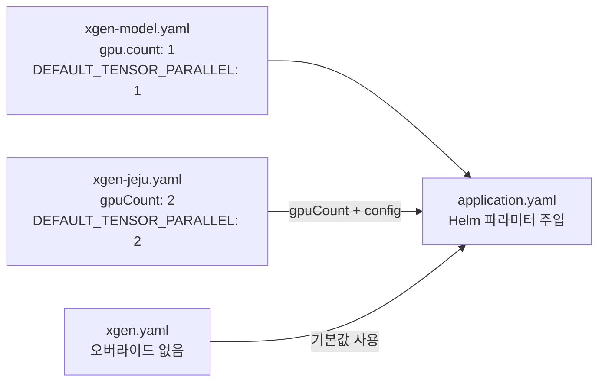
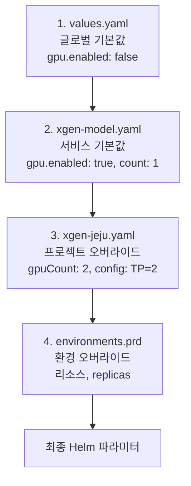

## 배경

XGEN 플랫폼에서 LLM 모델 서빙을 담당하는 서비스가 `xgen-model`이다. vLLM과 llama.cpp를 백엔드로 지원하고, GPU 위에서 동작한다. 온프레미스 K3s에서는 큰 문제 없이 돌아갔지만, 제주 폐쇄망 환경과 AWS EKS에 배포하면서 상황이 복잡해졌다.

이 글은 GPU 모델 서빙 서비스를 다중 환경에 배포하면서 겪은 일련의 삽질 — Istio 비활성화, 이미지 풀 정책, GPU 전용 배포 전략, 헬스체크 타임아웃, MinIO 인증, 프론트엔드 연동 — 을 시간 순서대로 기록한다. 각 문제가 어떤 맥락에서 발생했고, 왜 그렇게 해결했는지를 남긴다.

이전 글 "[XGEN 멀티사이트 배포 자동화](xgen-multi-site-deploy-automation-codebase-n-client-site-ops.md)"에서 프로젝트별 YAML 단일 진입점 구조를 만들었다. 이번 글은 그 구조 위에서 GPU 서비스를 올리면서 생긴 추가적인 문제들이다.

## 환경 구성

현재 xgen-model이 배포되는 환경은 세 곳이다.

| 환경 | 인프라 | 서비스 메시 | GPU | 네트워크 |
|------|--------|------------|-----|---------|
| 온프레미스 (dev/prd) | K3s | Istio | NVIDIA GPU x1 | 인터넷 가능 |
| 제주 (jeju) | K3s | Traefik | NVIDIA RTX 5090 x2 | 폐쇄망 |
| AWS (aww) | EKS | ALB Ingress | - | 클라우드 |

제주 환경이 가장 까다로웠다. 인터넷이 안 되고, GPU가 2장이고, Istio 대신 Traefik을 쓴다. 온프레미스에서 잘 되던 설정이 하나도 안 맞았다.

## 문제 1: 폐쇄망에서 이미지를 못 당겨온다

### 증상

제주 서버에 ArgoCD sync를 걸면 Pod가 `ImagePullBackOff` 상태에 빠졌다. 폐쇄망이라 외부 레지스트리(docker.x2bee.com)에 접근할 수 없다. 로컬 레지스트리(localhost:30500)에 이미지가 있는데, `imagePullPolicy: Always`가 기본값이라 매번 레지스트리에서 pull을 시도했다.

일반 환경에서는 `Always`가 맞다. 최신 이미지를 항상 가져와야 하니까. 하지만 폐쇄망에서는 로컬 레지스트리 Pod가 아직 뜨지 않은 상태에서 다른 서비스가 먼저 시작되면, 레지스트리에 접근할 수 없어서 실패한다. 노드에 캐시된 이미지가 있는데도 사용하지 않는다.

### 해결: 프로젝트 단위 imagePullPolicy 오버라이드

`xgen-jeju.yaml`에 프로젝트 단위 설정을 추가했다.

```yaml
# k3s/argocd/projects/xgen-jeju.yaml

# ── 폐쇄망: 이미지 풀 정책 ──
# 로컬 레지스트리 Pod 부팅 전에도 캐시된 이미지로 즉시 시작
imagePullPolicy: IfNotPresent
```

ArgoCD Application 템플릿에서 이 값을 주입한다.

```yaml
# k3s/argocd/templates/application.yaml

{{- /* 폐쇄망: imagePullPolicy 오버라이드 */}}
{{- if $.Values.imagePullPolicy }}
- name: image.pullPolicy
  value: {{ $.Values.imagePullPolicy | quote }}
{{- end }}
```

`IfNotPresent`로 설정하면 노드에 이미지가 캐시되어 있으면 pull을 시도하지 않는다. 폐쇄망에서 레지스트리 접근 실패 문제가 해결된다. 다른 프로젝트(`xgen.yaml`, `xgen-aww.yaml`)에는 이 설정이 없으므로 기본값 `Always`가 유지된다.

## 문제 2: Istio DestinationRule이 없다고 에러

### 증상

제주 환경은 K3s 기본 Traefik을 사용한다. Istio가 설치되어 있지 않다. 그런데 Helm 차트에 Istio DestinationRule과 Gateway 리소스가 포함되어 있어서, ArgoCD sync 시 CRD 미존재 에러가 발생했다.

### 해결: 프로젝트 단위 Istio 비활성화

```yaml
# k3s/argocd/projects/xgen-jeju.yaml

# ── Istio 비활성화 (Traefik 사용 환경) ──
istioEnabled: false
```

Application 템플릿에서 Istio 관련 파라미터를 조건부로 주입한다.

```yaml
# k3s/argocd/templates/application.yaml

{{- /* Istio 비활성화 (Traefik 환경) */}}
{{- if hasKey $.Values "istioEnabled" }}
{{- if not $.Values.istioEnabled }}
- name: istio.destinationRule.enabled
  value: "false"
- name: ingress.enabled
  value: "false"
{{- end }}
{{- end }}
```

`hasKey`로 키 존재 여부를 먼저 확인하는 이유가 있다. `istioEnabled`가 아예 없는 프로젝트(온프레미스 등)에서는 이 블록 전체가 건너뛰어져야 한다. `not $.Values.istioEnabled`만 체크하면 키가 없을 때도 `false`로 평가되어 Istio가 비활성화된다. 기존 프로젝트에 영향을 주면 안 되니 이중 체크가 필요하다.

## 문제 3: GPU 서비스가 RollingUpdate로 배포되면 안 된다

### 증상

xgen-model을 업데이트할 때 기본 RollingUpdate 전략이 적용됐다. 그런데 GPU는 한 노드에 하나의 Pod만 점유할 수 있다. `maxSurge: 100%`로 새 Pod를 먼저 띄우려 해도, GPU를 기존 Pod가 점유하고 있어서 새 Pod는 `Pending` 상태에 무한 대기했다.

일반 서비스(CPU)는 RollingUpdate가 맞다. 무중단 배포를 위해 새 Pod를 먼저 띄우고 트래픽을 전환한 뒤 기존 Pod를 내린다. 하지만 GPU 서비스는 배타적 리소스이므로 이 전략이 성립하지 않는다.

### 해결: GPU 서비스에 Recreate 전략 적용

Deployment 템플릿에서 GPU 활성화 여부에 따라 배포 전략을 분기했다.

```yaml
# k3s/helm-chart/templates/deployment.yaml

spec:
  replicas: {{ include "xgen-service.replicas" . }}
  {{- if .Values.gpu.enabled }}
  strategy:
    type: Recreate
  {{- else }}
  strategy:
    type: RollingUpdate
    rollingUpdate:
      maxSurge: 100%
      maxUnavailable: 0
  {{- end }}
```

`gpu.enabled`는 `xgen-model.yaml`에서 `true`로 설정되어 있고, 다른 서비스의 `values.yaml`에서는 기본값 `false`다.

```yaml
# k3s/helm-chart/values.yaml (기본값)
gpu:
  enabled: false

# k3s/helm-chart/values/xgen-model.yaml
gpu:
  enabled: true
  count: 1
```

Recreate 전략은 기존 Pod를 먼저 내리고 새 Pod를 띄운다. 순간적인 다운타임이 발생하지만, GPU 서비스에서는 이것이 유일하게 작동하는 전략이다. GPU가 해제되어야 새 Pod가 GPU를 할당받을 수 있기 때문이다.

## 문제 4: 프로젝트마다 GPU 수가 다르다

### 증상

온프레미스는 GPU 1장, 제주는 RTX 5090 2장이다. `xgen-model.yaml`에 `gpu.count: 1`이 하드코딩되어 있어서, 제주 환경에서도 GPU 1장만 사용했다. vLLM의 tensor parallelism을 활용하려면 2장 모두 써야 한다.

### 해결: 프로젝트별 gpuCount + config 오버라이드

프로젝트 YAML에서 서비스별로 GPU 수와 환경변수를 오버라이드할 수 있게 했다.

```yaml
# k3s/argocd/projects/xgen-jeju.yaml

environments:
  prd:
    services:
      - name: xgen-model
        replicas: 1
        autoscaling: { enabled: false }
        gpuCount: 2
        resources:
          requests: { memory: "16Gi",  cpu: "4000m" }
          limits:   { memory: "48Gi", cpu: "16000m" }
        config:
          CUDA_VISIBLE_DEVICES: "0,1"
          DEFAULT_TENSOR_PARALLEL: "2"
```

ArgoCD Application 템플릿에서 `gpuCount`와 `config`를 Helm 파라미터로 주입한다.

```yaml
# k3s/argocd/templates/application.yaml

{{- /* 서비스별 GPU 오버라이드 */}}
{{- if .gpuCount }}
- name: gpu.count
  value: {{ .gpuCount | quote }}
- name: "resources.requests.nvidia\\.com/gpu"
  value: {{ .gpuCount | quote }}
- name: "resources.limits.nvidia\\.com/gpu"
  value: {{ .gpuCount | quote }}
{{- end }}
{{- /* 서비스별 config 오버라이드 */}}
{{- range $k, $v := .config }}
- name: config.{{ $k }}
  value: {{ $v | quote }}
{{- end }}
```

여기서 `nvidia\\.com/gpu`의 이스케이프가 핵심이다. Helm의 `--set` 파라미터에서 점(`.`)은 키 구분자로 해석된다. `nvidia.com/gpu`를 그대로 넣으면 `nvidia` → `com/gpu`로 파싱된다. 백슬래시로 이스케이프해서 리터럴 점으로 취급되게 해야 한다. 이걸 찾는 데 시간을 꽤 썼다.

이 구조의 핵심은 **xgen-model.yaml의 기본값은 건드리지 않는다**는 것이다. 기본값은 GPU 1장이다. 제주 환경만 프로젝트 YAML에서 `gpuCount: 2`로 오버라이드한다. 다른 프로젝트에 영향이 없다.



## 문제 5: GPU 모델 로딩 중 Pod가 죽는다

### 증상

xgen-model Pod가 배포 직후 `CrashLoopBackOff`에 빠졌다. 로그를 보면 vLLM이 모델을 로딩하고 CUDA graph를 캡처하는 중이었다. 대형 모델(70B 파라미터 등)은 이 과정에 수 분이 걸린다. 그 동안 HTTP `/health` 엔드포인트가 응답하지 않아 Kubernetes liveness probe가 실패하고, Pod를 재시작했다.

기본 헬스체크 설정은 이랬다:

```yaml
healthCheck:
  type: http
  path: /health
  # 기본값: initialDelaySeconds=10, periodSeconds=10, failureThreshold=3
  # → 10초 후부터 10초 간격으로 체크, 3번 실패하면 재시작
  # → 최대 허용 시간: 10 + (10 * 3) = 40초
```

40초 안에 GPU 모델 로딩이 끝나지 않으면 Pod가 죽는다. 대형 모델은 3~5분이 걸린다.

### 해결: GPU 모델 로딩에 맞는 헬스체크 타임아웃

liveness probe와 readiness probe의 역할을 구분하여 설정했다.

```yaml
# k3s/helm-chart/values/xgen-model.yaml

# GPU 모델 로딩 시 CUDA graph 캡처 등으로 수 분간 블로킹될 수 있음
healthCheck:
  type: http
  path: /health
  livenessProbe:
    initialDelaySeconds: 60      # 60초 후 첫 체크 시작
    periodSeconds: 30            # 30초 간격
    timeoutSeconds: 10           # 응답 대기 10초
    failureThreshold: 20         # 20번 실패까지 허용
  readinessProbe:
    initialDelaySeconds: 30      # 30초 후 첫 체크
    periodSeconds: 10            # 10초 간격
    timeoutSeconds: 10
    failureThreshold: 30         # 30번 실패까지 허용
```

**liveness probe**: 60초 후 시작, 30초 간격으로 20번까지 실패 허용. 최대 허용 시간은 `60 + (30 * 20) = 660초` = **11분**. 대형 모델도 이 안에 로딩이 끝난다. 이 시간이 지나도 헬스체크가 통과하지 않으면 진짜 문제이므로 재시작이 맞다.

**readiness probe**: 30초 후 시작, 10초 간격으로 30번까지 실패 허용. 최대 `30 + (10 * 30) = 330초` = **5.5분**. 모델 로딩 완료 전에는 트래픽을 받지 않는다.

두 probe의 차이를 의식적으로 설계했다. liveness는 "이 Pod가 살아있는가?"를 판단하고, 실패하면 **재시작**한다. readiness는 "이 Pod가 트래픽을 받을 준비가 됐는가?"를 판단하고, 실패하면 Service에서 **제외**만 한다. GPU 모델 로딩 중에는 readiness만 실패해야지, liveness까지 실패하면 로딩이 영원히 끝나지 않는 무한 재시작 루프에 빠진다.

## 문제 6: MinIO 모델 저장소에 접근이 안 된다

### 증상

xgen-model이 MinIO에서 모델 파일을 다운로드하려 할 때 `AccessDenied` 에러가 발생했다. 로그를 뒤져보니 원인이 단순했다.

xgen-model 코드는 `MINIO_ACCESS_KEY` / `MINIO_SECRET_KEY`를 사용한다. 그런데 XGEN 인프라의 글로벌 ConfigMap에 정의된 키는 `MINIO_DATA_ACCESS_KEY` / `MINIO_DATA_SECRET_KEY`였다. `DATA_` prefix가 붙어 있었다. 다른 서비스(xgen-documents 등)는 이 prefix가 붙은 키를 사용하지만, xgen-model은 prefix 없는 키를 사용했다.

### 해결: 서비스별 config에 명시적 credential 추가

```yaml
# k3s/helm-chart/values/xgen-model.yaml

config:
  # xgen-model 코드가 MINIO_ACCESS_KEY/SECRET_KEY를 사용 (DATA_ prefix 없는 버전)
  MINIO_ACCESS_KEY: "minio"
  MINIO_SECRET_KEY: "minio123"
  MINIO_MODEL_BUCKET: "models"
```

서비스별 ConfigMap에 명시적으로 추가했다. 코드를 고쳐서 `DATA_` prefix를 붙이는 방법도 있었지만, xgen-model은 독립적인 모델 서버로 다른 서비스와 환경변수 규칙이 다를 수 있다. 인프라에서 매핑해 주는 것이 더 안전했다.

이런 credential 불일치는 서비스가 독립적으로 개발되고 인프라가 나중에 통합될 때 흔히 발생한다. 코드를 고치면 하위 호환성이 깨질 수 있고, 인프라에서 매핑하면 코드 변경 없이 해결된다.

## 문제 7: Jenkins에서 AWS EKS에 자동 배포가 안 된다

### 증상

온프레미스 K3s에서는 Jenkins가 같은 클러스터 안에서 돌아가므로 in-cluster 인증으로 `kubectl rollout restart`를 실행할 수 있었다. AWS EKS는 외부 클러스터이므로 kubeconfig와 context가 필요했다.

### 해결: environments.yaml에 AWW 환경 추가

```yaml
# k3s/jenkins/config/environments.yaml

# AWW 환경 (AWS EKS)
aww:
  server:
    ip: "eks-aww"
    kubeconfig: "/home/son/.kube/config"
    context: "eks-aww"
  argocd:
    server: ""
    appSuffix: "-aww"
```

Jenkins 파이프라인에서 aww 환경을 선택하면 kubeconfig와 context를 명시하여 kubectl을 실행한다.

```groovy
// k3s/jenkins/build.groovy

// aww 환경 배포 (AWS EKS)
if (targetEnv == 'aww') {
    def awwKubeconfig = envConfig.environments.aww?.server?.kubeconfig ?: ''
    def awwContext = envConfig.environments.aww?.server?.context ?: ''
    if (awwKubeconfig && awwContext) {
        sh """
            if [ -f ${awwKubeconfig} ]; then
                kubectl --kubeconfig=${awwKubeconfig} --context=${awwContext} \
                    rollout restart deployment/${deploymentName} -n ${namespace} \
                    || echo "Rollout restart skipped on aww"
                kubectl --kubeconfig=${awwKubeconfig} --context=${awwContext} \
                    rollout status deployment/${deploymentName} -n ${namespace} \
                    --timeout=120s || echo "Rollout status check skipped on aww"
            else
                echo "kubeconfig for aww not found, skipping"
            fi
        """
    }
}
```

방어적으로 작성했다. kubeconfig 파일 존재 여부를 확인하고, kubectl 실패 시에도 파이프라인이 중단되지 않는다(`|| echo`). AWS EKS에 배포가 선택사항인 경우가 있기 때문이다.

`TARGET_ENV` choices에 `aww`를 추가하여 Jenkins UI에서 선택할 수 있게 했다.

```groovy
choice(
    name: 'TARGET_ENV',
    choices: ['dev', 'prd', 'aww', 'both'],
    description: '배포 대상 환경 (dev: 현재 서버, prd: 운영 서버, aww: AWS EKS, both: dev+prd)'
)
```

## 문제 8: 프론트엔드에서 GPU 수를 인식하지 못한다

GPU 인프라 문제가 해결되고 나니, 프론트엔드에서 모델 배포 UI를 개선해야 했다. 여기서도 여러 문제가 나왔다.

### 8-1: tensor_parallel_size가 항상 1이다

모델 배포 폼에서 `tensor_parallel_size`가 1로 하드코딩되어 있었다. GPU 2장 환경에서 배포하면 자동으로 TP=2가 적용되어야 하는데, 사용자가 매번 수동으로 바꿔야 했다.

```javascript
// 수정 전: 하드코딩
tensor_parallel_size: 1

// 수정 후: GPU 수에 맞게 자동 설정
tensor_parallel_size: gpuStatus.device_count
```

GPU 상태 API(`/gpu/status`)가 이미 `device_count`를 반환하고 있었으므로, 이 값을 그대로 사용하면 됐다.

### 8-2: VRAM 합산이 안 된다

GPU 상태 표시에서 `total_memory_gb`가 primary GPU의 VRAM만 보여주고 있었다. GPU 2장이면 각 24GB인데 24GB만 표시됐다. 48GB로 합산해서 보여줘야 사용자가 어느 모델까지 올릴 수 있는지 판단할 수 있다.

### 8-3: 백엔드별 파라미터가 혼재한다

모델 배포 폼에 vLLM용 파라미터(`max_model_len`)와 llama.cpp용 파라미터(`n_ctx`)가 동시에 노출되고 있었다. 사용자가 혼란스러워했다.

```javascript
// n_ctx: llamacpp 선택 시에만 표시
// max_model_len: vLLM 선택 시에만 표시 (기존)
```

백엔드 선택에 따라 관련 없는 파라미터를 숨기도록 조건부 렌더링을 추가했다.

### 8-4: Traefik이 %2F를 거부한다

HuggingFace 모델명은 `organization/model-name` 형태로 슬래시를 포함한다. 프론트엔드에서 `encodeURIComponent()`로 인코딩하면 슬래시가 `%2F`가 된다. 온프레미스의 Istio는 이를 허용하지만, 제주의 Traefik은 `%2F`를 포함한 경로를 `400 Bad Request`로 거부했다.

백엔드 FastAPI의 path parameter가 이미 슬래시를 처리할 수 있으므로(`{model_name:path}`), 프론트엔드에서 인코딩을 제거했다. `organization/model-name`을 그대로 URL에 넣으면 FastAPI가 올바르게 파싱한다.

이 문제는 서비스 메시/인그레스 계층의 차이에서 비롯됐다. Istio와 Traefik의 URL 처리 방식이 다르다는 걸 폐쇄망 배포 전에는 의식하지 못했다.

## xgen-model의 Helm values 전체 구조

최종적으로 완성된 `xgen-model.yaml`의 구조다. 각 설정이 어떤 문제를 해결하기 위해 추가됐는지를 주석으로 남겼다.

```yaml
serviceName: xgen-model

image:
  tag: latest-amd64
  pullPolicy: Always          # 폐쇄망에서는 프로젝트 YAML이 IfNotPresent로 오버라이드

port: 8000

# GPU 모델 로딩에 맞는 헬스체크 (문제 5)
healthCheck:
  type: http
  path: /health
  livenessProbe:
    initialDelaySeconds: 60
    periodSeconds: 30
    timeoutSeconds: 10
    failureThreshold: 20       # 최대 11분 허용
  readinessProbe:
    initialDelaySeconds: 30
    periodSeconds: 10
    timeoutSeconds: 10
    failureThreshold: 30       # 최대 5.5분

# GPU 활성화 (문제 3: Recreate 배포 전략 트리거)
gpu:
  enabled: true
  count: 1                     # 제주에서는 프로젝트 YAML이 2로 오버라이드 (문제 4)

resources:
  requests:
    memory: "8Gi"
    cpu: "2000m"
    nvidia.com/gpu: 1          # 프로젝트 YAML이 gpuCount로 오버라이드 가능
  limits:
    memory: "24Gi"
    cpu: "8000m"
    nvidia.com/gpu: 1

autoscaling:
  enabled: false               # GPU 리소스 제한으로 HPA 비활성화

nodeSelector:
  gpu: nvidia                  # GPU 노드에만 스케줄링

affinity:
  podAntiAffinity:             # 한 노드에 1 Pod만
    requiredDuringSchedulingIgnoredDuringExecution:
      - labelSelector:
          matchLabels:
            app: xgen-model
        topologyKey: kubernetes.io/hostname

config:
  DEFAULT_BACKEND: "vllm"
  CUDA_VISIBLE_DEVICES: "0"   # 제주: "0,1"로 오버라이드
  DEFAULT_GPU_MEMORY_UTIL: "0.9"
  DEFAULT_TENSOR_PARALLEL: "1" # 제주: "2"로 오버라이드
  VLLM_ATTENTION_BACKEND: "FLASH_ATTN"
  MINIO_ACCESS_KEY: "minio"   # 문제 6: DATA_ prefix 불일치 해결
  MINIO_SECRET_KEY: "minio123"
  MINIO_MODEL_BUCKET: "models"

volumes:
  - name: models
    hostPath:
      path: /data/models
      type: DirectoryOrCreate
  - name: huggingface-cache
    hostPath:
      path: /data/huggingface
      type: DirectoryOrCreate
```

## 오버라이드 계층 구조

설정이 여러 레이어에서 주입되므로 우선순위를 정리한다.



우선순위가 높을수록 나중에 적용된다. `xgen-model.yaml`에서 `gpu.count: 1`로 설정하고, `xgen-jeju.yaml`에서 `gpuCount: 2`로 오버라이드하면 최종 값은 2가 된다. ArgoCD Application 템플릿의 `parameters` 목록에서 나중에 나오는 파라미터가 이전 값을 덮어쓴다.

이 계층 구조 덕분에 **기본값은 안전하게 유지**하면서 **특정 환경만 달라지는 부분을 최소한으로 선언**할 수 있다. xgen-jeju.yaml에서 `gpuCount: 2`와 `config.CUDA_VISIBLE_DEVICES: "0,1"`, `config.DEFAULT_TENSOR_PARALLEL: "2"` 세 줄만 추가하면 GPU 2장 환경이 완성된다.

## 회고

### 패턴: 인프라에서 매핑, 코드는 건드리지 않는다

8개 문제를 해결하면서 공통된 패턴이 있었다. **코드를 고치는 대신 인프라 설정으로 해결**하는 것이다.

- MinIO credential 불일치 → 코드에서 `DATA_` prefix를 붙이는 대신, ConfigMap에 별도 키를 추가
- imagePullPolicy → 코드 변경 없이 프로젝트 YAML에서 오버라이드
- GPU 수 → 코드의 기본값은 1 유지, 프로젝트 YAML에서 2로 오버라이드

이 방식의 장점은 **기존 환경에 영향이 없다**는 것이다. 온프레미스에서 잘 돌아가는 설정을 건드리지 않고, 새 환경의 차이점만 선언적으로 표현한다.

### 교훈: GPU 서비스는 일반 서비스와 다르다

CPU 기반 서비스에서 당연한 것들이 GPU 서비스에서는 전부 문제가 됐다.

- RollingUpdate → GPU가 배타적이라 Recreate 필수
- 기본 헬스체크 → CUDA graph 캡처 시간 미고려
- HPA → GPU 리소스는 동적 확장이 비현실적
- Pod Anti-Affinity → GPU 노드에 Pod가 몰리면 안 됨

GPU 서비스를 처음 K8s에 올리는 사람이라면, 이 네 가지는 반드시 먼저 확인해야 한다. "일반 서비스처럼 올리면 되겠지"라는 가정이 가장 큰 함정이다.

### 다음 할 일

제주 폐쇄망과 AWS EKS 배포가 안정화됐으므로, 다음은 **모델 자동 배포 파이프라인**이다. 현재는 모델 배포를 프론트엔드 UI에서 수동으로 하고 있는데, GitOps 방식으로 모델 정의 YAML을 커밋하면 자동으로 배포되는 구조를 만들 계획이다.
