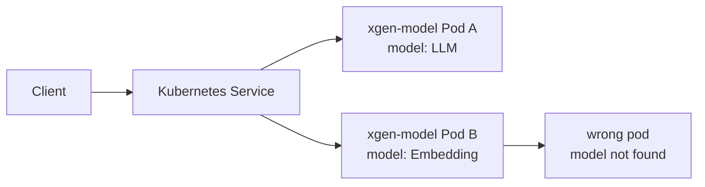
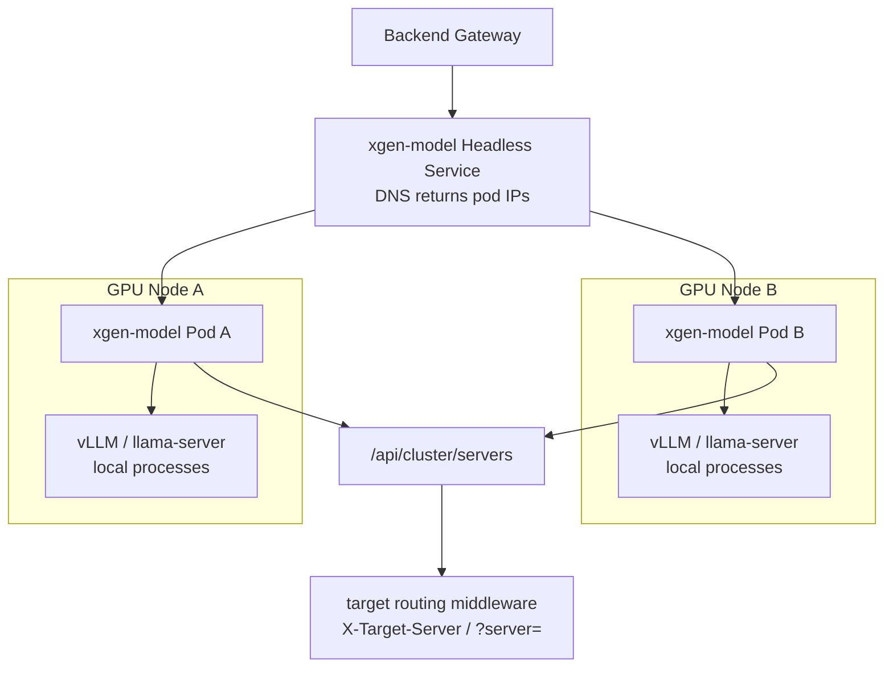
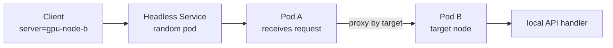
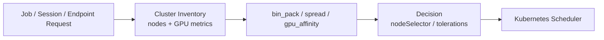
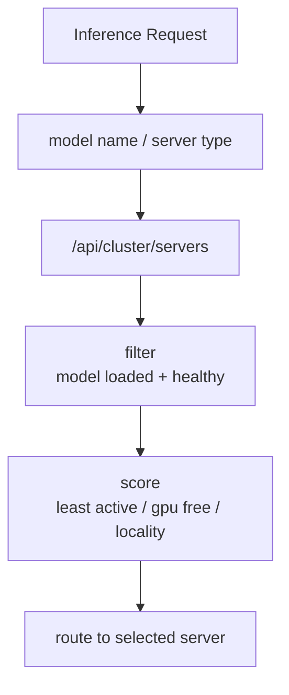
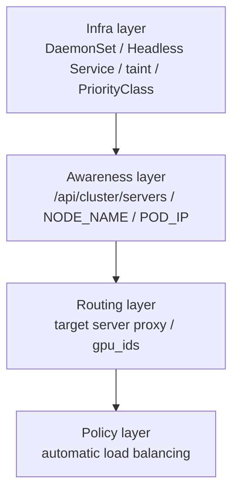

`xgen-model`은 XGEN에서 LLM과 임베딩 모델을 실제 GPU 위에 올리는 모델 서빙 서비스다. 처음에는 단순했다. GPU가 있는 노드에 `Deployment` 하나를 띄우고, 그 안에서 vLLM이나 llama-server 프로세스를 관리하면 됐다.

그런데 GPU 노드가 늘어나기 시작하면 문제가 바뀐다. 이제 질문은 "모델 서버를 어떻게 띄울 것인가"가 아니라 "여러 GPU 노드를 하나의 모델 서버 풀처럼 어떻게 다룰 것인가"가 된다.

이 글은 `xgen-model`을 멀티노드 GPU 서빙 구조로 확장하면서 적용한 설계를 정리한다. 핵심은 네 가지다.

- GPU 노드마다 `xgen-model` Pod를 하나씩 띄운다.
- Headless Service DNS로 모든 `xgen-model` Pod를 발견한다.
- `xgen-model` 내부에 cluster-aware API를 두어 노드별 서버 상태를 집계한다.
- 요청에 타겟 서버가 지정되면 해당 노드의 Pod로 프록시한다.

여기서 조심해야 할 표현이 있다. 이 구조는 "완성된 자동 부하분산 로드밸런서"라기보다, "멀티노드 모델 서버 풀을 만들기 위한 기반"에 가깝다. 자동으로 가장 한가한 GPU 서버를 고르는 정책은 아직 다음 단계다. 하지만 그 전 단계인 서버 발견, 노드 식별, 타겟 라우팅, GPU 슬롯 분리는 이미 꽤 중요한 기반이다.

## 왜 일반 Service 로드밸런싱만으로는 부족한가

일반적인 stateless API 서버라면 Kubernetes Service가 충분하다. Pod가 여러 개 있고, Service가 그중 하나로 요청을 보내면 된다. 어느 Pod가 받아도 같은 결과를 반환한다.

모델 서버는 다르다.

`xgen-model` Pod는 단순 API 서버가 아니라, 내부에 로컬 상태를 가진다.

- 어떤 모델이 로드되어 있는가
- 그 모델이 어느 port의 vLLM 프로세스로 떠 있는가
- 어떤 GPU index를 점유하고 있는가
- 모델 로딩 중인지, 정상 로드됐는지, 실패했는지
- Pod가 올라간 노드의 GPU 모델과 VRAM이 무엇인가

이 정보는 Kubernetes Service가 알지 못한다. Service는 L4/L7 관점에서 endpoint를 고를 뿐, "이 Pod에는 Qwen 모델이 올라와 있고, 저 Pod에는 embedding 모델이 올라와 있다"는 사실을 모른다.

그래서 단순 round-robin은 위험하다. 사용자가 특정 노드에 로드한 모델을 호출하려는데 요청이 다른 Pod로 가면 "모델 없음"이 된다. 반대로 모델 로드 요청이 아무 Pod로나 가면 GPU 메모리 배치가 예측 불가능해진다.



따라서 `xgen-model`에는 두 단계가 필요했다.

첫째, Kubernetes 레벨에서는 GPU 노드 전체에 서버를 펼친다.  
둘째, 애플리케이션 레벨에서는 어떤 서버에 어떤 모델이 있는지 알고 라우팅한다.

## 구조 전체 그림

전체 구조는 아래와 같다.



Kubernetes 입장에서는 `xgen-model`이 GPU 노드마다 하나씩 뜬다. `xgen-model` 입장에서는 Headless Service DNS를 통해 자기 형제 Pod들을 발견한다. 클라이언트나 게이트웨이는 `/api/cluster/servers`로 현재 서버 목록을 볼 수 있고, 필요하면 특정 서버로 요청을 보낼 수 있다.

## 1. Deployment에서 DaemonSet으로

처음 `xgen-model`은 일반 Deployment였다. `replicas: 1`이면 한 GPU 노드에만 뜬다. GPU 노드가 여러 대 있어도 나머지 노드는 놀 수 있다. `replicas`를 늘리는 방법도 있지만, GPU 노드 수와 replica 수를 사람이 맞춰야 하고, 노드가 추가되거나 제거될 때 자동성이 떨어진다.

GPU 노드마다 하나의 모델 서버를 띄우려면 `DaemonSet`이 더 자연스럽다.

```yaml
# k3s/helm-chart/values/xgen-model.yaml
workloadKind: DaemonSet

nodeSelector:
  gpu: nvidia
```

Helm template에서는 `workloadKind`에 따라 `Deployment`와 `DaemonSet`을 나눴다.

```yaml
{{- $isDaemonSet := eq (.Values.workloadKind | default "Deployment") "DaemonSet" -}}
apiVersion: apps/v1
kind: {{ if $isDaemonSet }}DaemonSet{{ else }}Deployment{{ end }}
metadata:
  name: {{ include "xgen-service.name" . }}
spec:
  {{- if not $isDaemonSet }}
  replicas: {{ include "xgen-service.replicas" . }}
  {{- end }}
  {{- if $isDaemonSet }}
  updateStrategy:
    type: RollingUpdate
  {{- end }}
```

이렇게 하면 기본 chart는 기존처럼 Deployment로 쓸 수 있고, `xgen-model`만 DaemonSet으로 전환할 수 있다.

여기서 중요한 점은 모든 노드가 아니라 GPU 노드에만 뜨게 하는 것이다. `nodeSelector: gpu=nvidia`를 넣고, GPU 노드에만 이 라벨을 부여한다. GPU가 없는 노드에 모델 서버가 떠봤자 vLLM을 제대로 실행할 수 없다.

## 2. GPU 노드 taint와 PriorityClass

GPU 노드는 비싼 자원이다. 일반 CPU workload가 GPU 노드에 스케줄되면 GPU 서버가 엉뚱한 작업으로 채워질 수 있다. 그래서 GPU 노드에는 taint를 걸고, GPU workload만 toleration을 갖게 했다.

```yaml
tolerations:
  - key: xgen.io/gpu
    operator: Exists
    effect: NoSchedule
```

`xgen-model`은 운영 중인 모델 서빙 서비스이므로 우선순위도 높게 둔다.

```yaml
priorityClassName: xgen-prod-serving
```

이 설정의 의미는 단순하다.

- GPU 노드는 아무 Pod나 쓰지 못한다.
- `xgen-model`은 GPU taint를 통과할 수 있다.
- GPU가 부족한 상황에서 운영 서빙 workload가 학습이나 샌드박스보다 우선한다.

이런 정책은 코드 안에 넣으면 안 된다. Kubernetes scheduler가 이해할 수 있는 PodSpec에 있어야 운영자가 관찰하고 제어할 수 있다.

## 3. Headless Service로 형제 Pod 찾기

DaemonSet으로 Pod를 여러 개 띄우면 다음 문제가 생긴다.

"현재 떠 있는 `xgen-model` Pod 목록을 어떻게 알 것인가?"

Kubernetes API를 직접 호출하는 방법도 있다. 하지만 그러려면 RBAC가 필요하고, 서비스 코드가 Kubernetes API에 결합된다. `xgen-model`이 꼭 Kubernetes API client를 들고 있을 필요는 없다.

대신 Headless Service를 사용했다.

```yaml
service:
  headless: true
```

Service template에서는 `clusterIP: None`을 넣는다.

```yaml
apiVersion: v1
kind: Service
metadata:
  name: {{ include "xgen-service.name" . }}
spec:
  type: ClusterIP
  {{- if (default (dict) .Values.service).headless }}
  clusterIP: None
  {{- end }}
  selector:
    {{- include "xgen-service.selectorLabels" . | nindent 4 }}
```

Headless Service는 일반 ClusterIP처럼 하나의 VIP만 돌려주는 대신, selector에 매칭되는 Pod IP들을 DNS A record로 반환한다. 즉 `xgen-model`이라는 DNS 이름을 조회하면 ready 상태인 `xgen-model` Pod IP 목록을 얻을 수 있다.

애플리케이션 코드에서는 이렇게 처리한다.

```python
def _resolve_peers() -> list[str]:
    if not POD_IP:
        return []
    try:
        _, _, ips = socket.gethostbyname_ex(CLUSTER_SERVICE)
        peers = sorted(set(ips))
        if POD_IP not in peers:
            return [POD_IP]
        return peers
    except Exception:
        return [POD_IP]
```

여기서 `POD_IP not in peers` 처리가 중요하다. Service가 headless가 아니면 DNS 결과로 Pod IP 목록이 아니라 ClusterIP VIP 하나만 받을 수 있다. 이 경우 VIP와 자기 Pod IP를 모두 peer로 취급하면 같은 서버를 두 번 세는 버그가 생긴다. 그래서 DNS 결과에 자기 Pod IP가 없으면 "headless가 아니다"라고 보고 자기 자신만 반환한다.

작은 방어 코드지만, 운영에서는 이런 분기가 차이를 만든다.

## 4. Downward API로 노드와 Pod 신원 주입

서버 목록을 보여주려면 각 Pod가 자신이 어느 노드에서 떠 있는지 알아야 한다. 이를 위해 Kubernetes Downward API를 사용했다.

```yaml
env:
  - name: POD_NAME
    valueFrom:
      fieldRef:
        fieldPath: metadata.name
  - name: POD_IP
    valueFrom:
      fieldRef:
        fieldPath: status.podIP
  - name: NODE_NAME
    valueFrom:
      fieldRef:
        fieldPath: spec.nodeName
```

이 값은 `xgen-model`의 cluster API에서 그대로 사용된다.

```python
NODE_NAME = os.environ.get("NODE_NAME", "")
POD_NAME = os.environ.get("POD_NAME", "")
POD_IP = os.environ.get("POD_IP", "")
```

이전에도 XGEN에서는 멀티 Pod 환경에서 Downward API를 쓴 적이 있다. `xgen-workflow`에서는 세션 상태가 어느 Pod에 있는지 식별하기 위한 목적이었다. `xgen-model`에서는 목적이 조금 다르다. 여기서는 "이 모델 서버가 어느 GPU 노드에 붙어 있는가"가 핵심이다.

## 5. `/api/cluster/servers`: 모델 서버 목록 집계

각 Pod는 자기 자신의 상태를 반환하는 내부 endpoint를 가진다.

```python
@router.get("/_self")
async def cluster_self(request: Request):
    return _self_info(request)
```

`_self_info()`는 현재 Pod의 노드명, Pod 이름, Pod IP, GPU 개수, 로드된 모델 목록을 모은다.

```python
def _self_info(request: Request) -> dict:
    pm = request.app.state.process_manager
    gpu = pm.gpu_info or {}
    all_gpus = gpu.get("all_gpus") or []

    loaded = []
    for name, info in (pm.loaded_models or {}).items():
        loaded.append({
            "name": name,
            "model_type": info.get("model_type") or "llm",
            "backend": info.get("backend_type") or "unknown",
            "state": info.get("state") or "running",
        })

    return {
        "node": NODE_NAME or "unknown",
        "pod_name": POD_NAME,
        "pod_ip": POD_IP,
        "gpu": {
            "type": gpu.get("gpu_type"),
            "count": len(all_gpus) if all_gpus else (1 if gpu.get("available") else 0),
        },
        "loaded_models": loaded,
    }
```

`/api/cluster/servers`는 Headless Service DNS로 peer Pod 목록을 얻은 뒤, 각 Pod의 `/_self`를 병렬 호출한다.

```python
@router.get("/servers")
async def cluster_servers(request: Request):
    peers = _resolve_peers()

    async def fetch(ip: str) -> dict:
        if ip == POD_IP:
            info = _self_info(request)
            info["reachable"] = True
            return info
        try:
            async with httpx.AsyncClient(timeout=_PEER_TIMEOUT) as client:
                resp = await client.get(f"http://{ip}:{SELF_PORT}/api/cluster/_self")
                resp.raise_for_status()
                info = resp.json()
                info["reachable"] = True
                return info
        except Exception:
            return {"node": "unknown", "pod_ip": ip, "reachable": False, "loaded_models": []}

    results = await asyncio.gather(*[fetch(ip) for ip in peers])
    servers = sorted(results, key=lambda s: (s.get("node") or "", s.get("pod_ip") or ""))
    return {
        "servers": servers,
        "count": len(servers),
        "self_node": NODE_NAME or "unknown",
    }
```

이 API가 생기면 운영 화면이나 gateway가 "현재 모델 서버 풀이 어떻게 생겼는지"를 볼 수 있다.

```json
{
  "servers": [
    {
      "node": "gpu-node-a",
      "pod_name": "xgen-model-abc",
      "pod_ip": "10.42.1.20",
      "gpu": { "type": "nvidia", "count": 1 },
      "loaded_models": [
        { "name": "llm-main", "model_type": "llm", "state": "loaded" }
      ],
      "reachable": true
    }
  ],
  "count": 1,
  "self_node": "gpu-node-a"
}
```

이건 아직 자동 스케줄러가 아니다. 하지만 자동 스케줄러가 판단하려면 가장 먼저 필요한 관측 데이터다.

## 6. 서버 타겟 라우팅

서버 목록만 있어서는 부족하다. 사용자가 특정 노드의 모델을 조작하거나 호출할 수 있어야 한다.

그래서 `xgen-model` 내부에 target routing middleware를 넣었다. 요청에 `X-Target-Server` 헤더나 `?server=` 쿼리가 있으면, 현재 Pod가 그 대상이 아닐 때 해당 노드의 Pod IP로 프록시한다.

```python
async def server_routing_middleware(request: Request, call_next):
    path = request.url.path
    target = request.headers.get("x-target-server") or request.query_params.get("server")

    if (
        not target
        or not path.startswith("/api/")
        or path.startswith(_ROUTE_EXCLUDE)
        or "x-cluster-routed" in request.headers
    ):
        return await call_next(request)

    ip = await _resolve_target_ip(target)
    if ip is None:
        return await call_next(request)

    return await _proxy_to_peer(request, ip)
```

라우팅 루프를 막기 위해 `x-cluster-routed` 헤더를 넣는다. 이미 한 번 프록시된 요청은 다시 프록시하지 않는다.

이 구조의 장점은 클라이언트가 어떤 Pod에 닿든, 원하는 서버로 도달할 수 있다는 점이다.



Kubernetes Service가 어느 Pod로 먼저 보냈는지는 중요하지 않다. 애플리케이션 레벨에서 target을 보고 한 번 더 라우팅한다.

## 7. Pod 안에서는 `gpu_ids`로 슬롯을 나눈다

멀티노드는 노드 간 문제다. 하지만 한 노드 안에 GPU가 여러 장 있을 수도 있다. 이 경우에는 모델별로 어떤 GPU를 쓸지 지정할 수 있어야 한다.

`xgen-model`의 `ModelLoadRequest`에는 `gpu_ids`가 들어갔다.

```python
gpu_ids: list[int] | None = Field(
    default=None,
    description=(
        "할당할 GPU 인덱스 목록. "
        "[0]=GPU0만, [0,1]=GPU 0·1 둘 다."
    ),
)
```

`gpu_ids`가 들어오면 `tensor_parallel_size`를 자동으로 맞춘다.

```python
@model_validator(mode="after")
def _sync_tensor_parallel_with_gpu_ids(self) -> "ModelLoadRequest":
    if self.gpu_ids is not None:
        self.tensor_parallel_size = len(self.gpu_ids)
    return self
```

사용자가 `gpu_ids=[0,1]`을 보내면서 `tensor_parallel_size=1`을 같이 보내면 이상한 상태가 된다. GPU 두 장을 보이게 해놓고 vLLM에는 TP=1이라고 말하는 셈이다. 그래서 `gpu_ids`가 명시되면 `tensor_parallel_size`는 GPU 개수와 강제로 맞춘다.

vLLM CUDA adapter에서는 모델 프로세스별로 `CUDA_VISIBLE_DEVICES`를 주입한다.

```python
def _setup_env(self, env: dict[str, str], request: ModelLoadRequest) -> dict[str, str]:
    env["VLLM_ATTENTION_BACKEND"] = "FLASH_ATTN"

    if request.gpu_ids is not None:
        visible = ",".join(str(i) for i in request.gpu_ids)
        env["CUDA_VISIBLE_DEVICES"] = visible

    return env
```

그리고 이미 다른 모델이 명시적으로 점유한 GPU와 충돌하는지도 검사한다.

```python
def _check_gpu_conflict(self, requested_gpu_ids: list[int] | None) -> None:
    if requested_gpu_ids is None:
        return

    occupied: dict[int, str] = {}
    for name, info in self._models.items():
        if info.gpu_ids:
            for gid in info.gpu_ids:
                occupied[gid] = name

    conflicts = [(gid, occupied[gid]) for gid in requested_gpu_ids if gid in occupied]
    if conflicts:
        raise ValueError("requested gpu_ids conflict with already loaded models")
```

이건 노드 간 로드밸런싱은 아니다. 하지만 모델 서버 하나 안에서 GPU 슬롯을 명확히 나누는 작업이다. 멀티노드 서빙에서도 이 층이 중요하다. 노드를 고른 뒤에는 결국 그 노드 안에서 GPU를 어떻게 쓸지 결정해야 하기 때문이다.

## Workbench 스케줄러와 xgen-model 라우팅은 역할이 다르다

조사하면서 헷갈리기 쉬운 지점이 있었다.

XGEN에는 Workbench 분산 스케줄러도 있다. 이 스케줄러는 `training_job`, `serving_endpoint`, `workbench_session` 같은 workload를 어느 pool과 노드에 배치할지 결정한다.

정책은 대략 세 가지다.

| 정책 | 목적 |
|------|------|
| `bin_pack` | 자원을 한쪽으로 모아 단편화를 줄인다 |
| `spread` | 부하를 여러 노드로 분산한다 |
| `gpu_affinity` | 같은 GPU 모델끼리 묶어 분산 추론/학습 효율을 높인다 |

이 스케줄러는 Kubernetes scheduler를 대체하지 않는다. 대신 `nodeSelector`, `tolerations`, `priorityClassName`, `runtimeClassName`을 결정해서 PodSpec에 주입한다.



반면 `xgen-model` cluster routing은 이미 떠 있는 모델 서버 Pod 사이에서 "어느 서버에 요청을 보낼 것인가"를 다룬다.

둘은 연결될 수 있지만 같은 기능은 아니다.

- Workbench scheduler: workload 배치 시점의 노드 선택
- xgen-model cluster routing: 실행 중인 모델 서버로의 요청 라우팅

이 구분을 명확히 해야 한다. 그래야 다음 고도화가 어디에 붙어야 하는지 보인다.

## 아직 남은 것: 자동 로드밸런싱

현재 구조는 "서버를 발견하고, 지정할 수 있다"까지 왔다. 다음 단계는 "자동으로 고른다"다.

자동 로드밸런싱을 하려면 최소한 아래 정보가 필요하다.

- target model이 이미 로드된 서버인가
- 서버가 reachable인가
- GPU 메모리 여유가 있는가
- 현재 처리 중인 요청 수가 얼마인가
- 모델 로딩 중인지, 안정 상태인지
- 같은 모델이 여러 서버에 올라와 있다면 어느 서버가 더 적합한가

그리고 정책도 필요하다.



예를 들어 LLM 추론 요청은 아래 순서로 처리할 수 있다.

1. 요청에서 모델 이름과 server type을 확인한다.
2. `/api/cluster/servers`에서 로드된 모델 목록을 가져온다.
3. 해당 모델이 올라와 있는 서버만 후보로 남긴다.
4. unreachable, loading, error 서버를 제거한다.
5. GPU 사용률, 요청 수, 최근 latency로 점수를 매긴다.
6. 가장 적합한 서버로 target routing한다.

모델 로드 요청은 다르게 봐야 한다.

1. 필요한 모델 크기와 `gpu_ids` 또는 TP 값을 확인한다.
2. 서버별 GPU/VRAM 여유를 본다.
3. 이미 같은 모델이 로드된 서버가 있으면 중복 로드를 피한다.
4. 적합한 서버를 고른 뒤, 그 서버의 `/api/management/load`로 보낸다.
5. 로드된 상태를 state store에 기록한다.

추론 요청과 모델 로드 요청은 같은 "라우팅"처럼 보이지만 정책이 다르다. 추론은 latency와 availability가 중요하고, 로드는 GPU 배치와 장기 상태가 중요하다.

## 다중 노드 vLLM TP는 다른 문제다

또 하나 구분해야 할 것이 있다.

현재 구조는 GPU 노드마다 `xgen-model` 서버를 띄우는 것이다. 즉 여러 서버가 있고, 각 서버가 자기 노드의 GPU로 모델을 띄운다.

반면 "하나의 거대한 모델을 여러 노드에 걸쳐 하나의 vLLM 엔진으로 실행"하는 것은 다른 문제다. 이 경우에는 Ray cluster, StatefulSet, headless Service, pipeline parallel, tensor parallel 구성이 필요하다.

현재 차트에도 이 한계가 드러난다.

```yaml
# 다중 노드 TP (vLLM ray cluster) 는 별도 구성 필요
# 본 차트는 단일 노드 TP 만 지원.
DEFAULT_TENSOR_PARALLEL: "1"
DEFAULT_PIPELINE_PARALLEL: "1"
```

즉 현재 단계는 "여러 xgen-model 서버를 노드별로 띄우고 라우팅한다"에 가깝다. "하나의 vLLM 모델을 여러 노드로 쪼개 실행한다"는 다음 설계 주제다.

둘을 섞으면 안 된다.

| 주제 | 현재 상태 | 의미 |
|------|----------|------|
| 노드별 xgen-model 서버 | 구현됨 | GPU 노드마다 모델 서버 Pod |
| Headless Service 기반 발견 | 구현됨 | Pod IP 목록 DNS 조회 |
| 서버 타겟 라우팅 | 구현됨 | 특정 노드/POD로 요청 프록시 |
| Pod 내부 GPU 슬롯 분리 | 구현됨 | `gpu_ids`, TP 자동 정합 |
| 자동 least-loaded 라우팅 | 남은 작업 | 서버 상태 기반 자동 선택 |
| 다중 노드 vLLM Ray TP/PP | 남은 작업 | 하나의 모델을 여러 노드에 분산 |

## 얻은 결론

이 작업에서 가장 중요한 결론은 단순하다.

GPU 모델 서버는 stateless API 서버처럼 다루면 안 된다.

Kubernetes Service가 endpoint를 분산해주는 것만으로는 부족하다. 모델 서버는 어떤 모델이 어느 GPU에 올라와 있는지, 어떤 노드에 있는지, 어떤 프로세스가 살아 있는지라는 애플리케이션 상태를 가진다. 이 상태를 모르면 round-robin은 오히려 장애를 만든다.

그래서 `xgen-model` 멀티노드화는 세 층으로 나눠서 봐야 한다.



현재 구현은 `Infra`, `Awareness`, `Routing`까지다. 이것만으로도 운영자는 여러 GPU 노드의 모델 서버를 한눈에 보고, 특정 서버로 요청을 보낼 수 있다. 하지만 진짜 자동 로드밸런싱은 `Policy` layer가 들어와야 완성된다.

나는 이 순서가 맞다고 본다. 자동화를 먼저 만들면 근거 없는 라우팅이 된다. 서버 발견, 노드 식별, 상태 집계, 타겟 라우팅이 먼저 있어야 그 위에 정책을 얹을 수 있다.

XGEN의 다음 단계는 `xgen-model`을 "GPU 서버 여러 개"가 아니라 "상태를 가진 모델 서버 풀"로 다루는 것이다. 그때 로드밸런싱은 단순한 round-robin이 아니라, 모델 상태와 GPU 상태를 함께 보는 스케줄링 문제가 된다.

## 관련 글

- [Kubernetes Downward API로 멀티 Pod 세션 라우팅 구현](/posts/devops/infra/kubernetes-downward-api-multi-pod-session-routing/)
- [XGEN GPU 모델 서빙 인프라 실전기 — 폐쇄망 배포부터 멀티 GPU 오버라이드까지](/posts/devops/infra/xgen-gpu-model-serving-infra-practical-airgap-deploy-multi-gpu/)
- [XGEN Workbench 분산 실행 인프라: KVM 컴퓨트 풀, GPU 워커, PriorityClass, NetworkPolicy까지](/posts/devops/infra/xgen-workbench-kvm-gpu-distributed-dispatch-infra/)
