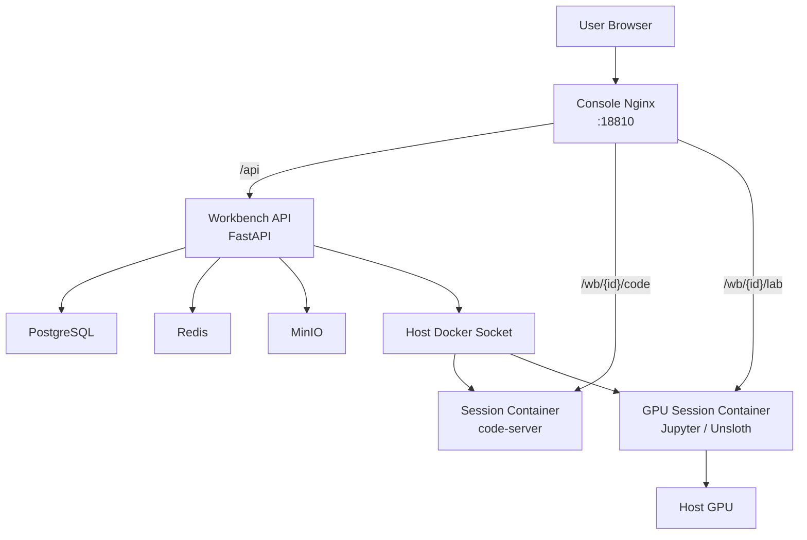
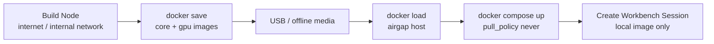

## 왜 Docker 독립 스택이 필요했나

이전에 Workbench를 만들 때의 핵심은 실행 경계를 분리하는 일이었다. 사용자가 XGEN에서 Prompt Studio, SandboxExec, Dataset, Training Job, Workspace를 쓰더라도 실제 실행은 별도 Workbench 컨트롤러와 compute pool로 내려가야 했다.

그때의 기본 전제는 Kubernetes였다. Workbench 컨트롤러가 Pod, PVC, Service, VirtualService, Job 같은 리소스를 만들고, K8s scheduler가 CPU, memory, GPU를 배정한다. 이 구조는 플랫폼 입장에서는 정석에 가깝다.

그런데 실제 배포 조건은 항상 정석대로 오지 않는다.

- 고객사 폐쇄망에는 외부 레지스트리 접근이 없다.
- 단일 GPU 서버 한 대만 있는 환경도 있다.
- K8s 클러스터를 먼저 깔고 운영하는 것 자체가 부담일 수 있다.
- Workbench만 빠르게 검증하고 싶은 PoC 환경이 있다.
- 운영자는 "이미지를 어떻게 넣고, 어디서 실행 확인을 하느냐"를 먼저 묻는다.

그래서 이번 작업의 방향은 분명했다. Workbench의 핵심 모델은 유지하되, Kubernetes가 없어도 단일 Docker 호스트에서 돌아가게 만든다.

이 글은 2026년 6월 말에 진행한 `xgen-workbench` Docker 독립 스택과 폐쇄망 배포 패키지 작업을 정리한다. 관련 작업은 `xgen-workbench`의 Docker standalone stack, `DockerDriver`, `save/load-images` 스크립트, GPU 세션 이미지 반입, 그리고 `xgen-infra`의 폐쇄망 배포 흐름과 맞물려 있었다. 내부 주소, 토큰, 고객사별 값은 넣지 않는다.

## 기존 Workbench 글과 다른 점

이미 Workbench 분산 실행 인프라 글에서는 KVM compute pool, GPU worker, PriorityClass, NetworkPolicy, headless worker를 다뤘다.

그 글의 질문은 이것이었다.

> 사용자의 실험과 플랫폼 서버의 생명주기를 어떻게 분리할 것인가?

이번 글의 질문은 다르다.

> 그 실행 계층을 K8s 없는 폐쇄망 단일 서버에도 어떻게 올릴 것인가?

분산 실행 인프라가 "어디에 실행할 것인가"의 문제였다면, Docker 독립 스택은 "어떻게 가져가서 실제로 켤 것인가"의 문제였다.

폐쇄망에서는 설치 버튼보다 반입 경로가 중요하다. 외부망에서 이미지를 만들고, 파일로 저장하고, USB로 옮기고, 내부 서버에서 load한 뒤, 어떤 서비스도 외부 registry에 pull을 시도하지 않아야 한다. 여기서 한 단계라도 모호하면 배포는 성공한 것처럼 보여도 실제 세션 생성에서 깨진다.

## 전체 구조

Docker 독립 스택은 Workbench 컨트롤 플레인과 세션 컨테이너를 한 Docker 호스트 안에 놓는다.



구성은 단순하다.

| 구성요소 | 역할 |
| --- | --- |
| Workbench API | 세션, 이미지, pool, artifact 메타데이터 관리 |
| Console Nginx | `/api`와 `/wb/{id}/...` 경로 프록시 |
| PostgreSQL | Workbench 메타데이터 저장 |
| Redis | 세션 discovery와 캐시 |
| MinIO | artifact, dataset, 모델 파일 저장 |
| Docker socket | 세션 컨테이너 생성 |
| Session image | code-server, JupyterLab, GPU 학습 환경 |

핵심은 세션을 컨트롤 플레인 컨테이너 내부에서 띄우지 않는다는 점이다. Workbench API는 호스트 Docker socket을 통해 별도 세션 컨테이너를 만든다. 즉 Docker-out-of-Docker, 줄여서 DooD 구조다.

DinD처럼 컨테이너 안에 Docker daemon을 하나 더 띄우는 방식도 가능하지만, 여기서는 폐쇄망 단일 서버 운영을 우선했다. 호스트 Docker가 이미지를 가지고 있고, Workbench는 그 호스트 Docker에게 세션 컨테이너 생성을 요청한다. 이미지 공급 경로도 호스트 Docker 기준으로 맞추면 된다.

## PoolDriver 추상화가 여기서 살아났다

Workbench를 처음 만들 때부터 compute pool을 추상화해 둔 이유가 있었다. 실행 환경은 계속 바뀐다.

- K8s cluster에서 Pod로 띄울 수도 있다.
- KVM pool에서 격리된 VM을 잡을 수도 있다.
- 외부 edge worker에 dispatch할 수도 있다.
- 단일 Docker 호스트에서 컨테이너로 띄울 수도 있다.

이번 작업에서는 `docker` pool type을 추가하고, `DockerDriver`가 세션 생성을 맡도록 했다.

```python
def select_driver(pool_type: str):
    if pool_type == "k8s":
        return get_kubernetes_driver()
    if pool_type == "kvm":
        return get_kvm_driver()
    if pool_type == "docker":
        return get_docker_driver()
    raise PoolDriverError(f"unsupported pool type: {pool_type}")
```

컨트롤러 입장에서는 세션을 만든다는 행위가 같다. 사용자가 어떤 이미지를 골랐고, CPU/memory/GPU를 얼마나 요청했고, 어떤 pool에 배치할지만 정한다.

차이는 driver 안으로 숨긴다.

```python
run_kwargs = {
    "image": image.image_uri,
    "name": f"workbench-session-{session.id}",
    "detach": True,
    "environment": {
        "XGEN_SESSION_ID": str(session.id),
        "XGEN_USER_ID": str(session.user_id),
    },
    "labels": {
        "app": "xgen-workbench-session",
        "session-id": str(session.id),
    },
    "restart_policy": {"Name": "unless-stopped"},
    "volumes": {
        f"workbench-session-{session.id}-home": {
            "bind": "/home/xgen",
            "mode": "rw",
        }
    },
}
```

실제 코드에는 네트워크, CPU quota, memory limit, GPU 환경변수, password, container label 같은 세부값이 더 붙는다. 중요한 것은 모델이다. Workbench session은 DB의 세션 메타데이터이고, driver는 그 세션을 특정 실행 환경의 리소스로 바꾼다.

K8s에서는 Pod와 Service가 되고, Docker standalone에서는 container와 volume이 된다.

## 세션 프록시는 포트 매핑보다 이름 해석이 낫다

세션 컨테이너를 만들 때 매번 호스트 포트를 열 수도 있다. 하지만 폐쇄망 단일 서버에서 세션 수가 늘어나면 포트 관리가 바로 귀찮아진다.

대신 compose 네트워크 안에서 컨테이너 이름으로 프록시한다.

```text
/wb/{session_id}/code  ->  workbench-session-{session_id}:8080
/wb/{session_id}/lab   ->  workbench-session-{session_id}:8080
```

Console Nginx는 사용자가 접근하는 단일 진입점이다. 사용자는 한 포트로 들어오고, 내부에서는 path 기반으로 API와 세션 컨테이너가 갈린다.

이 구조의 장점은 세션 컨테이너가 호스트 포트를 공개하지 않아도 된다는 점이다. 세션은 compose 네트워크 안에서만 발견되고, 외부 노출은 Nginx가 통제한다.

물론 이 구조도 완전한 보안 경계는 아니다. 같은 Docker network에 붙은 컨테이너 간 접근, Docker socket 권한, 세션 컨테이너의 네트워크 정책을 따로 봐야 한다. 그래도 단일 서버 PoC와 폐쇄망 반입용으로는 운영자가 이해하기 쉬운 구조다.

## 폐쇄망에서 진짜 문제는 compose가 아니라 이미지다

Docker Compose 파일 하나를 만든다고 폐쇄망 배포가 끝나는 게 아니다. 폐쇄망에서 가장 자주 깨지는 지점은 이미지 공급이다.

외부망에서는 compose가 없는 이미지를 registry에서 pull하면 된다. 폐쇄망에서는 그 순간 바로 실패한다. 더 나쁜 경우는 일부 이미지는 이미 있어서 컨트롤 플레인은 뜨는데, 사용자가 세션을 만들 때 세션 이미지가 없어서 뒤늦게 실패하는 것이다.

그래서 이번 배포 문서는 이미지 공급 경로를 두 갈래로 나눴다.

첫 번째는 내부망에서 private registry에 접근할 수 있는 환경이다. 이 경우에는 compose가 지정한 이미지를 직접 pull하면 된다. 운영자가 신경 써야 할 것은 registry 로그인, 이미지 태그, GPU runtime, `.env` 값이다.

두 번째는 registry 접근도 막힌 완전 폐쇄망이다. 이 경우에는 pull을 전제로 하면 안 된다.



외부망 빌드 노드에서 이미지를 만들고 tar로 저장한다. 폐쇄망 호스트에서는 그 tar를 `docker load` 한다. compose에는 `pull_policy: never`를 둔다. 이 설정은 단순하지만 중요하다. Docker가 registry에 접근하지 않겠다는 의도를 명시한다.

즉 배포 경로는 이렇게 갈린다.

| 배포 경로 | 전제 | 핵심 체크 |
| --- | --- | --- |
| Registry 직접 pull | 내부망에서 private registry 접근 가능 | 로그인, 태그, runtime, `.env` |
| USB/offline 반입 | registry 접근 불가 | `docker save/load`, 이미지 목록, `pull_policy: never`, checksum |

둘 중 어느 쪽이든 Workbench 입장에서 중요한 조건은 같다. 컨트롤 플레인 이미지뿐 아니라 사용자가 실제로 띄울 session image까지 같은 경로로 공급되어야 한다.

```yaml
services:
  workbench:
    image: private-registry.example/xgen/workbench:latest-amd64
    pull_policy: never

  console:
    image: private-registry.example/xgen/workbench/console:latest-amd64
    pull_policy: never

  postgres:
    image: private-registry.example/xgen/workbench/postgres:16-alpine
    pull_policy: never
```

실제 배포 파일에는 PostgreSQL, Redis, MinIO, Workbench API, Console, base session image, GPU session image가 모두 포함된다. 여기서 session image가 핵심이다. 컨트롤 플레인 이미지만 준비해도 API는 뜬다. 하지만 Workbench의 본질은 세션을 띄우는 데 있으므로 세션 이미지까지 반드시 준비해야 한다.

## GPU 세션 이미지는 optional이 아니었다

초기 문서에서는 GPU 세션 이미지를 약간 선택 사항처럼 다룰 여지가 있었다. 하지만 실제 Workbench 관점에서는 그렇지 않았다.

Workbench가 제공해야 하는 세션은 단순 code-server만이 아니다.

- 가벼운 개발용 code-server
- JupyterLab 기반 분석 세션
- GPU 학습이나 fine-tuning용 Unsloth 이미지
- 모델/데이터셋 실험용 notebook 환경

폐쇄망에서 GPU 세션 이미지를 빼면 배포는 되는 것처럼 보인다. 관리 콘솔도 열리고 API도 health check를 통과한다. 하지만 사용자가 GPU 세션을 만들면 호스트 Docker가 이미지를 찾지 못한다. 이 실패는 사용자 경험상 "배포가 됐는데 왜 기능이 안 되지?"로 보인다.

그래서 문서를 고쳤다.

GPU 세션 이미지는 선택 사항이 아니다. Workbench 기능 범위에 GPU 세션이 포함되어 있다면, 해당 이미지는 core 이미지와 같이 반입해야 한다.

이미지 크기도 문제다. GPU 세션 이미지는 Python, CUDA 계열 패키지, Jupyter, 학습 라이브러리를 포함하면서 수 GB를 훌쩍 넘는다. USB 반입 시간, 디스크 여유 공간, `docker load` 시간까지 운영 절차에 포함해야 한다.

## Docker socket을 열 때의 불편한 진실

DooD 구조의 가장 큰 장점은 단순함이다. 가장 큰 단점도 명확하다. Workbench 컨트롤 플레인이 호스트 Docker socket에 접근한다.

Docker socket 접근은 강한 권한이다. 컨테이너를 만들고, 볼륨을 붙이고, 환경변수를 주입하고, 네트워크에 연결할 수 있다. 이 권한을 가진 서비스는 사실상 호스트의 중요한 실행 제어권을 가진다.

그래서 이 구조는 다음 전제를 깔고 봐야 한다.

- 단일 서버/폐쇄망/PoC 성격의 배포에 우선 적용한다.
- Workbench API 인증과 사용자 권한 검사를 반드시 통과시킨다.
- 세션 이미지 목록을 허용된 이미지로 제한한다.
- 세션 컨테이너 label, 이름, network, volume 경로를 규칙화한다.
- 운영 환경에서는 Docker socket proxy나 별도 agent 방식으로 줄이는 방향을 검토한다.

K8s 구조는 복잡하지만 RBAC, namespace, NetworkPolicy, admission policy로 권한을 쪼갤 수 있다. Docker standalone은 단순하지만 권한 경계가 굵다. 이 차이를 숨기면 안 된다.

그래서 이 스택은 "K8s를 대체하는 최종 운영 아키텍처"라기보다, 폐쇄망 단일 서버에서 Workbench를 현실적으로 올리기 위한 제품 패키지에 가깝다.

## 통합 테스트가 필요한 이유

이 작업은 unit test만으로는 부족하다. API 함수가 맞는지보다 중요한 건 전체 흐름이다.

1. compose stack이 올라온다.
2. API health가 통과한다.
3. 기본 compute pool과 image seed가 들어간다.
4. 세션 생성 요청이 들어간다.
5. DockerDriver가 세션 컨테이너를 만든다.
6. Console Nginx가 `/wb/{id}/...`로 프록시한다.
7. 세션 컨테이너 안의 IDE가 열린다.
8. MinIO, DB, Redis 연결이 끊기지 않는다.
9. GPU 세션이면 CUDA visible device가 보인다.

그래서 통합 테스트 플랜과 harness를 같이 만들었다. Docker standalone stack은 "서비스 하나가 import된다"보다 "사용자가 브라우저에서 세션을 열 수 있다"가 성공 조건이다.

특히 폐쇄망 배포는 테스트 환경과 운영 환경의 차이가 크다. 외부망에서는 이미지가 없으면 pull해서 성공해 버릴 수 있다. 하지만 폐쇄망에서는 pull이 불가능하다. 따라서 테스트에서도 `pull_policy: never`와 local image load 전제를 맞춰야 한다.

## 운영 절차는 짧아야 한다

폐쇄망 배포 문서는 길 수밖에 없다. 사전 요구사항, registry 직접 pull 경로, USB 반입 경로, 이미지 목록, GPU runtime, 환경변수, compose up, smoke test, 트러블슈팅을 다 써야 한다.

하지만 실제 운영자가 처음 따라 할 명령은 짧아야 한다.

```bash
bash deploy/load-images.sh ./out
cp deploy/.env.prod.example .env
vi .env
docker compose -f deploy/docker-compose.prod.yml --env-file .env up -d
```

완전 폐쇄망이면 이 정도로 시작점이 좁아져야 한다. registry에 접근 가능한 내부망이면 `load-images.sh` 단계는 빠지고, 로그인과 compose up이 중심이 된다. 자세한 설명은 문서 뒤에 있어도 된다. 처음부터 모든 원리를 읽어야만 실행할 수 있으면 배포 패키지로서는 실패다.

이번 작업에서 `save-images.sh`와 `load-images.sh`를 분리한 이유도 여기에 있다.

- 빌드 노드는 이미지를 만들고 tar로 저장한다.
- 폐쇄망 호스트는 tar를 load하고 compose를 켠다.

두 환경의 역할을 섞지 않는다. 폐쇄망 호스트에서 build를 시도하지 않고, 외부망 빌드 노드에서 운영 `.env`를 만들지도 않는다.

## 결과적으로 바뀐 것

이번 작업으로 Workbench는 세 가지 배포 모드를 갖게 됐다.

| 모드 | 적합한 환경 | 장점 | 한계 |
| --- | --- | --- | --- |
| Kubernetes | 플랫폼 운영, 다중 사용자, 정책 강한 환경 | RBAC, scheduler, PVC, NetworkPolicy 활용 | 설치와 운영 부담 |
| KVM / Edge | 격리 실행, 외부 GPU 서버, 분산 dispatch | 호스트 분리, 외부 자원 연결 | agent와 네트워크 설계 필요 |
| Docker standalone | 단일 서버, PoC, 폐쇄망 반입 | 설치 단순, USB 이미지 반입 가능 | HA와 권한 경계 약함 |

이 표에서 중요한 건 우열이 아니다. Workbench가 하나의 실행 모델을 여러 환경에 맞게 접을 수 있게 됐다는 점이다.

처음 Workbench를 만들 때는 컨트롤러와 K8s 리소스가 중심이었다. 이후 KVM과 edge worker가 붙으면서 "어디에서 실행할 것인가"가 넓어졌다. 이번 Docker 독립 스택은 "어떻게 반입하고 켤 것인가"를 풀었다.

실제 제품에서는 이 마지막 질문이 꽤 중요하다. 좋은 아키텍처도 고객사 서버에 올라가지 못하면 데모에 머문다. 폐쇄망에서는 더 그렇다. 인터넷이 없고, registry가 없고, GPU driver 상태도 제각각이다. 운영자가 확실히 들고 갈 수 있는 파일과 절차가 있어야 한다.

## 남은 과제

Docker standalone은 끝난 구조가 아니다. 오히려 명확한 한계를 가진 실용 옵션이다.

앞으로 더 봐야 할 부분은 이렇다.

- Docker socket 권한을 더 좁히는 방법
- 세션 컨테이너별 네트워크 격리
- 사용자별 quota와 동시 세션 제한
- GPU 공유와 독점 모드의 정책화
- 이미지 버전 매니페스트와 checksum 검증
- 오프라인 업그레이드 절차
- artifact 백업과 복구
- 장기 세션 정리와 디스크 회수

특히 이미지 검증은 더 중요해질 것이다. 폐쇄망 반입 파일은 여러 사람과 장비를 거친다. "어떤 이미지를 반입했는가"를 사람이 파일명으로만 기억하면 안 된다. manifest, digest, checksum, 버전 문서가 같이 움직여야 한다.

## 정리

이번 작업의 핵심은 Workbench를 더 작게 만든 것이 아니다. 오히려 실행 모델은 그대로 두고, 배포 표면을 하나 더 만든 것이다.

K8s에서는 Workbench session이 Pod가 된다. Docker standalone에서는 container가 된다. KVM에서는 VM이나 host agent task가 된다. 사용자는 같은 Workbench 경험을 쓰지만, 실행 환경은 배포 조건에 맞게 바뀐다.

폐쇄망 배포는 기능 개발과 다른 종류의 문제다. API가 맞고 UI가 예뻐도, 이미지가 반입되지 않으면 아무 일도 일어나지 않는다. 그래서 이번에는 코드보다 공급망과 운영 절차가 중요했다.

내가 얻은 결론은 단순하다.

Workbench 같은 실행 플랫폼은 "무엇을 실행할 수 있는가"만으로 완성되지 않는다. "그 실행 환경을 어디에, 어떤 파일 묶음으로, 어떤 절차로 가져가서 켤 수 있는가"까지 가야 제품이 된다.

이번 Docker 독립 스택은 그 방향으로 Workbench를 한 단계 더 접은 작업이었다.
