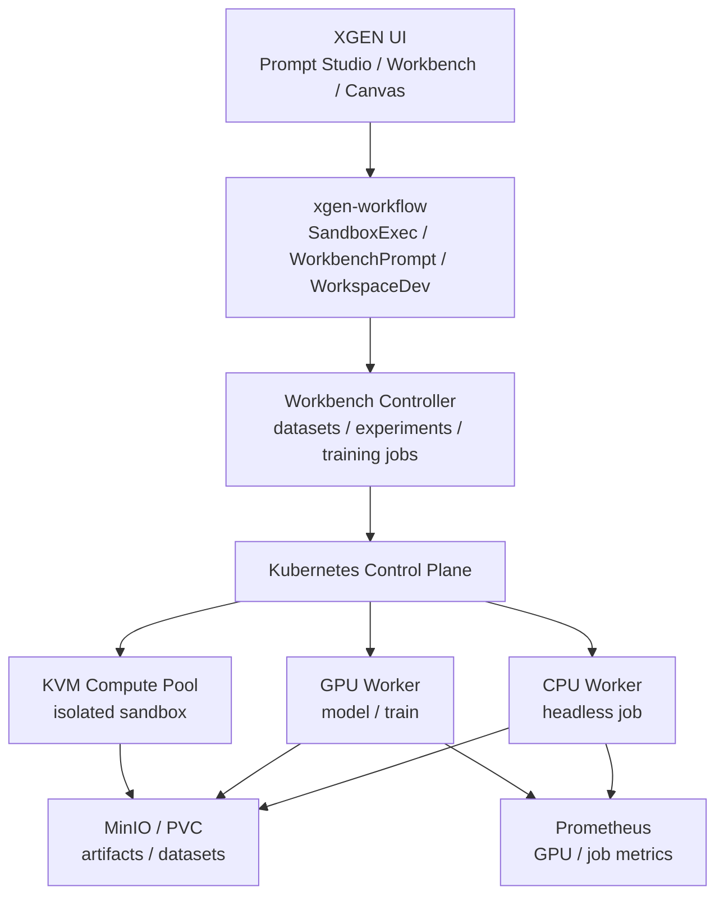
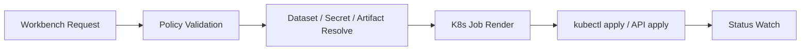
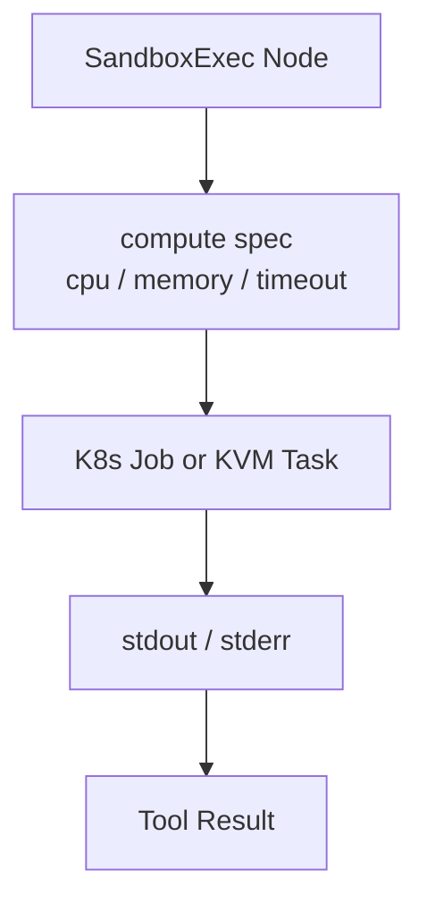
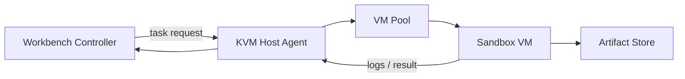
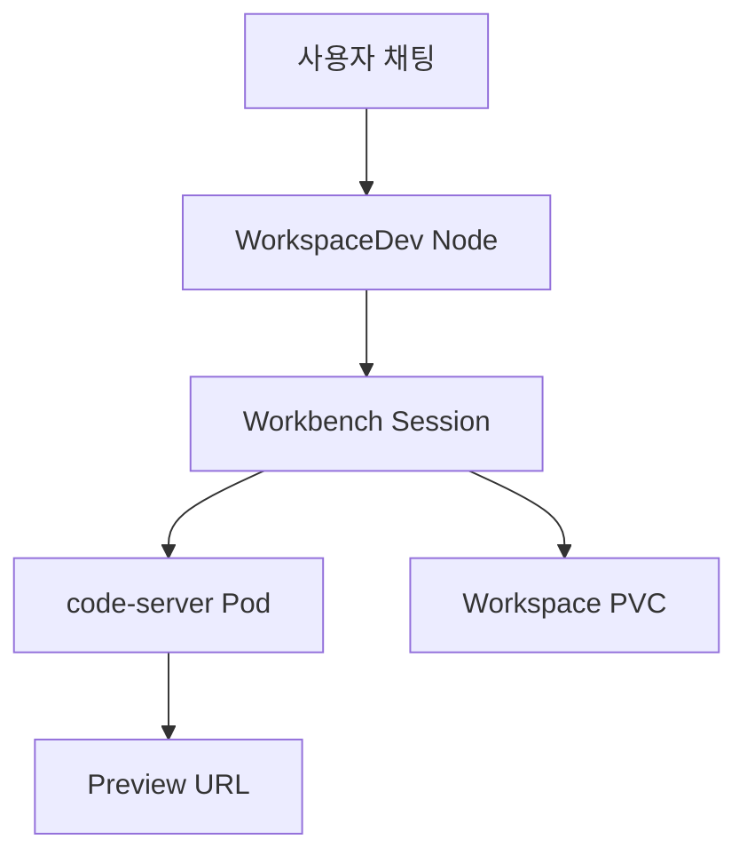
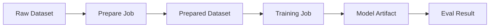
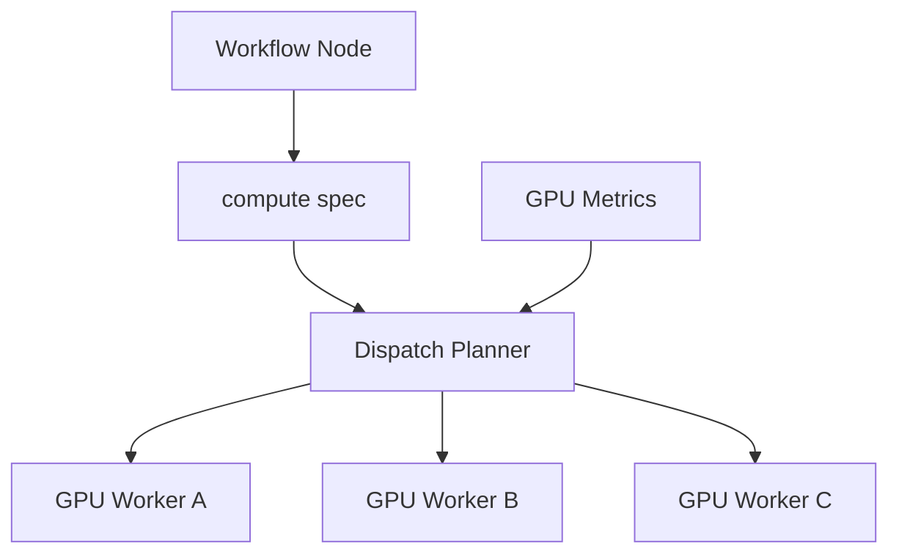
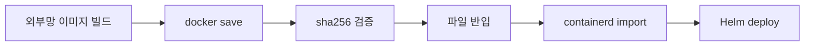

## 왜 Workbench가 필요했나

XGEN은 처음에는 "워크플로우를 만들고 실행하는 플랫폼"에 가까웠다. 사용자가 캔버스에서 노드를 연결하고, 에이전트가 도구를 호출하고, 결과를 스트리밍으로 받는다. 이 구조만으로도 많은 업무 자동화가 가능하다.

하지만 LLMOps/MLOps 요구가 들어오면 실행 단위가 달라진다.

- Prompt 실험을 여러 번 돌리고 결과를 추적해야 한다.
- 데이터셋을 업로드하고 라벨링하거나 변환해야 한다.
- Fine-tuning job을 띄우고 결과 artifact를 보관해야 한다.
- 코드 기반 실험은 notebook보다 재현 가능한 workspace가 필요하다.
- GPU가 필요한 작업은 일반 workflow Pod에서 처리하면 안 된다.
- 장시간 작업은 사용자의 채팅 세션과 분리되어야 한다.

기존 workflow 실행기는 "요청이 들어오면 현재 서비스 Pod에서 처리"하는 방식에 가까웠다. 짧은 도구 호출과 문서 처리에는 맞지만, 학습 job, sandbox 실행, GPU inference, 장기 실행 workspace에는 맞지 않는다.

그래서 Workbench를 별도 실행 계층으로 분리했다. 사용자는 XGEN UI 안에서 Prompt Studio, SandboxExec, WorkspaceDev, Dataset, Training Job을 사용하지만, 실제 실행은 K8s 내부의 전용 Workbench 컨트롤러와 컴퓨트 풀로 내려간다.

이 글은 2026년 5월부터 6월 초까지 진행한 XGEN Workbench 분산 실행 인프라 작업을 정리한다. 관련 작업은 `xgen-infra`의 Workbench 스캐폴딩, KVM compute pool, GPU worker, distributed-xgen Phase 0~3, 그리고 `xgen-workflow`의 SandboxExec / WorkbenchPrompt / WorkspaceDev / compute dispatch 변경에 걸쳐 있었다. 본문에는 내부 주소, token 값, 클러스터 고유명은 넣지 않는다.

## 전체 아키텍처

Workbench는 크게 네 층으로 나뉜다.

1. XGEN UI와 workflow node
2. Workbench 컨트롤러 API
3. K8s 실행 계층
4. 외부 또는 내부 compute pool



핵심은 workflow Pod가 직접 무거운 일을 하지 않는다는 점이다. workflow는 요청을 해석하고, 어떤 compute spec이 필요한지 정한 뒤, Workbench 컨트롤러에 실행을 위임한다. 컨트롤러는 K8s Job, Deployment, PVC, Service, VirtualService 같은 리소스를 만들고 상태를 추적한다.

## 단일 Pod 실행의 한계

처음에는 workflow 서비스 내부에서 Python 함수를 실행하고, 필요하면 subprocess를 띄우는 방식으로도 충분해 보였다. 그러나 다음 문제가 쌓였다.

**1. 격리 부족**  
사용자 코드 실행과 플랫폼 서버가 같은 Pod 안에 있으면 blast radius가 크다. 코드가 CPU를 다 먹거나 파일 시스템을 오염시키면 workflow 서비스 자체가 흔들린다.

**2. 자원 예약 불가**  
K8s scheduler는 Pod 단위로 CPU, memory, GPU를 예약한다. 서비스 내부 subprocess는 K8s가 보지 못한다. GPU를 써야 하는 작업은 별도 Pod로 분리해야 scheduler가 장치를 배정할 수 있다.

**3. 장기 실행 추적 어려움**  
Fine-tuning이나 데이터셋 변환은 분 단위, 길면 시간 단위로 돈다. HTTP 요청이나 채팅 턴의 수명과 묶이면 재시도, 취소, 재개가 어렵다.

**4. 운영 정책 적용 어려움**  
NetworkPolicy, PriorityClass, nodeSelector, toleration, anti-affinity 같은 정책은 Pod spec에 붙는다. 실행이 서비스 내부로 숨어 있으면 운영 정책을 적용할 위치가 없다.

따라서 Workbench는 "기능"이 아니라 "실행 경계"로 봐야 했다.

## Workbench Controller: 실행을 리소스로 바꾸는 계층

Workbench 컨트롤러의 역할은 사용자 요청을 K8s 리소스로 바꾸는 것이다. 예를 들어 training job 요청은 다음 정보로 정규화된다.

```yaml
job:
  kind: training
  image: xgen-workbench-train
  command:
    - python
    - train.py
  resources:
    cpu: "4"
    memory: "16Gi"
    gpu: 1
  datasetRef: dataset-001
  outputRef: artifact-001
  timeoutSeconds: 14400
```

이 스펙은 곧바로 Pod가 아니다. 먼저 정책을 통과해야 한다.

- 사용자가 해당 dataset에 접근할 수 있는가?
- GPU 요청량이 namespace quota를 넘지 않는가?
- timeout이 상한을 넘지 않는가?
- image가 허용 목록에 있는가?
- 네트워크 접근이 필요한 작업인가?

이 검증을 거친 뒤 K8s Job spec으로 변환한다.



컨트롤러가 따로 있으면 workflow는 단순해진다. workflow node는 "이런 실행을 해 달라"고 요청하고, 결과 stream이나 job id를 받는다. 실제 Pod 작성, RBAC, artifact 저장, 상태 추적은 컨트롤러가 맡는다.

## RBAC: 컨트롤러가 만들 수 있는 리소스를 제한한다

Workbench 컨트롤러는 K8s 리소스를 만든다. 따라서 ServiceAccount와 Role을 매우 조심해서 잡아야 한다. 처음부터 cluster-admin 같은 권한을 주면 개발은 편하지만 운영에서는 위험하다.

필요한 권한은 기능별로 나눴다.

| 기능 | 필요한 권한 |
|------|-------------|
| Job 실행 | jobs create/get/list/watch/delete |
| Workspace preview | services create/get/delete |
| 외부 URL 노출 | virtualservices create/get/delete |
| Autoscaling | hpa create/get/delete |
| Artifact 저장 | secret/configmap 일부 read, PVC create |

Role은 namespace 범위로 제한한다. Workbench가 자기 namespace 밖의 Deployment나 Secret을 읽을 이유는 없다.

```yaml
apiVersion: rbac.authorization.k8s.io/v1
kind: Role
metadata:
  name: xgen-workbench-controller
rules:
  - apiGroups: ["batch"]
    resources: ["jobs"]
    verbs: ["create", "get", "list", "watch", "delete"]
  - apiGroups: [""]
    resources: ["pods", "pods/log", "services", "persistentvolumeclaims"]
    verbs: ["create", "get", "list", "watch", "delete"]
  - apiGroups: ["networking.istio.io"]
    resources: ["virtualservices"]
    verbs: ["create", "get", "list", "watch", "delete"]
```

예시는 설명용이다. 실제 운영에서는 resourceName 제한, namespace 분리, admission policy까지 더해진다.

## SandboxExec: 한 번 실행하고 버리는 격리 실행

Workbench의 첫 번째 실행 형태는 `SandboxExec`이다. 사용자가 짧은 코드나 명령을 실행하고 결과를 받는 노드다. 이 노드는 장기 workspace가 아니라 disposable execution에 가깝다.



`SandboxExec`를 workflow 서비스 내부에서 실행하지 않은 이유는 명확하다. 사용자가 입력한 명령은 불완전하고 예측하기 어렵다. timeout, 파일 시스템, 네트워크, CPU 제한이 필요하다. 이 제한은 K8s Job이나 KVM sandbox 같은 실행 경계가 있어야 제대로 걸 수 있다.

여기서 KVM compute pool이 등장한다. Pod 격리만으로 충분한 작업도 있지만, 일부 실행은 더 강한 경계가 필요하다. 특히 임의 코드 실행과 외부 dependency 설치가 들어가면 container boundary만으로는 불안하다.

## KVM Compute Pool: 강한 격리와 재사용성 사이

KVM compute pool은 Workbench가 필요할 때 격리된 VM 기반 실행 환경을 요청할 수 있게 하는 계층이다.



이 구조에서 K8s는 모든 것을 직접 실행하지 않는다. K8s 안의 컨트롤러가 KVM host agent에 task를 요청하고, host agent가 VM pool을 관리한다. 이렇게 하면 K8s cluster 안에 GPU worker와 CPU job을 두면서도, 더 강한 격리가 필요한 실행은 KVM 쪽으로 빼낼 수 있다.

설계할 때 본 트레이드오프는 세 가지다.

**1. 매번 새 VM을 만들 것인가, pool을 둘 것인가**  
매번 새 VM을 만들면 격리는 좋지만 startup latency가 크다. pool을 두면 빠르지만 VM 상태 오염을 관리해야 한다. Workbench에서는 짧은 실행도 많기 때문에 pool 기반이 현실적이다.

**2. 파일 전달을 어떻게 할 것인가**  
stdin에 모든 파일을 넣을 수는 없다. artifact store를 공통 경로로 두고, task spec에는 입력 artifact ref와 출력 artifact ref만 넣는다.

**3. host agent 인증을 어떻게 할 것인가**  
agent 등록에는 별도 secret이 필요하지만, 값은 Helm values나 문서에 남기지 않는다. 배포 manifest에는 placeholder와 Secret 참조만 둔다.

```yaml
env:
  - name: EDGE_REGISTER_TOKEN
    valueFrom:
      secretKeyRef:
        name: workbench-edge-register
        key: token
```

여기서 중요한 것은 secret 이름과 key 이름은 인프라 계약이지만, 값은 배포 환경의 Secret에만 있다는 점이다.

## WorkspaceDev: 채팅으로 영속 워크스페이스 개발

`SandboxExec`가 한 번 실행하고 버리는 노드라면, `WorkspaceDev`는 영속 workspace에 가깝다. 사용자가 채팅으로 개발을 요청하면 code-server Pod와 PVC가 준비되고, dev server preview URL이 노출된다.



여기서 중요한 차이는 수명이다. `SandboxExec`는 실행 결과를 받으면 끝난다. `WorkspaceDev`는 같은 대화 안에서 같은 workspace를 재사용해야 한다. 코드 수정, dev server 실행, preview 확인이 한 흐름으로 이어지기 때문이다.

이를 위해 session id와 workspace id를 분리한다. 대화는 바뀔 수 있지만 workspace는 유지될 수 있고, workspace는 삭제 전까지 PVC를 가진다. 운영 관점에서는 idle timeout과 cleanup job이 필수다.

## Dataset과 Training Job

Workbench가 LLMOps/MLOps 플랫폼이 되려면 prompt 실행만으로는 부족하다. 데이터셋과 학습 job이 있어야 한다.

데이터셋은 세 가지 상태를 가진다.

- raw: 사용자가 업로드한 원본
- prepared: 학습/평가에 맞게 변환된 데이터
- labeled: 사람이 검수하거나 자동 라벨링한 결과

Training Job은 dataset ref를 받아 실행되고, output artifact를 남긴다.



이 흐름에서 MinIO 같은 object storage가 필요하다. Pod local disk에만 결과를 두면 job이 끝난 뒤 추적이 끊긴다. artifact는 job id, dataset version, code version과 함께 저장되어야 한다.

`xgen-track` SDK를 workbench image에 넣은 것도 이 맥락이다. 사용자가 학습 코드 안에서 metric, parameter, artifact를 기록할 수 있어야 한다. SDK는 실험 추적의 최소 단위이고, Workbench 컨트롤러는 그 결과를 UI에 연결한다.

## GPU Worker: 모델 서빙과 학습을 분리한다

GPU 작업은 일반 CPU job과 다르다. scheduler, image, resource limit, driver compatibility, device plugin, model cache가 모두 영향을 준다.

처음에는 GPU가 필요한 작업도 일반 Workbench job의 resource 옵션으로만 처리하려 했다. 하지만 모델 서빙과 학습은 운영 특성이 다르다.

| 구분 | 모델 서빙 | 학습 / 실험 |
|------|-----------|-------------|
| 수명 | 길다 | 짧거나 중간 |
| 트래픽 | 지속 요청 | batch성 |
| 실패 처리 | auto-restore 필요 | retry / artifact 보존 |
| GPU 사용 | 점유 지속 | job 기간 동안 점유 |
| 스케일링 | replica / routing | queue / scheduling |

그래서 GPU worker를 분리하고, 모델 서빙에는 auto-restore와 GPU slot 지정 개념을 넣었다. 학습 job은 Workbench 컨트롤러가 Job으로 만들고, 서빙은 Deployment 또는 전용 process manager로 관리한다.

## GPU 메트릭 기반 dispatch

분산 실행으로 넘어가면 "어디서 실행할 것인가"가 문제가 된다. 단순 round-robin은 GPU에서는 위험하다. VRAM이 이미 꽉 찬 노드에 job을 보내면 곧바로 OOM이 난다.

그래서 dispatch spec에 compute 필드를 두고, GPU 메트릭을 기반으로 후보 worker를 고른다.

```yaml
compute:
  kind: gpu
  gpuCount: 1
  minFreeMemoryMiB: 16000
  preferredVendor: nvidia
  isolation: container
```

workflow node는 이 spec을 직접 해석하지 않는다. spec을 Workbench 컨트롤러나 dispatch 계층으로 넘기고, 실제 placement는 인프라가 결정한다.



여기서 Prometheus URL을 config로 넣은 이유는 hardcoding을 피하기 위해서다. dev, stage, 고객사 환경마다 monitoring endpoint가 다르다. 코드에 주소를 박으면 환경이 늘 때마다 이미지를 다시 빌드해야 한다.

## PriorityClass: 중요한 job을 밀어 넣는 방법

GPU와 Workbench가 섞이면 우선순위가 필요하다. 모든 job이 같은 priority라면 장시간 실험이 중요한 운영 서빙 Pod를 밀어낼 수 있고, 반대로 낮은 중요도의 batch가 계속 자원을 점유할 수도 있다.

그래서 PriorityClass를 3단계로 나눴다.

```yaml
apiVersion: scheduling.k8s.io/v1
kind: PriorityClass
metadata:
  name: xgen-critical
value: 100000
globalDefault: false
description: "critical control plane or serving workloads"
---
apiVersion: scheduling.k8s.io/v1
kind: PriorityClass
metadata:
  name: xgen-interactive
value: 50000
globalDefault: false
description: "interactive workbench sessions"
---
apiVersion: scheduling.k8s.io/v1
kind: PriorityClass
metadata:
  name: xgen-batch
value: 10000
globalDefault: false
description: "batch training and offline jobs"
```

interactive workspace는 사용자가 기다리고 있으므로 batch보다 높다. 모델 서빙이나 control plane은 interactive보다 높다. 이 값 자체보다 중요한 것은 정책의 존재다. 운영자가 "왜 이 Pod가 먼저 스케줄됐는가"를 설명할 수 있어야 한다.

## Anti-affinity: GPU 장애 도메인을 나눈다

GPU worker가 여러 개일 때 같은 종류의 중요한 Pod가 한 노드에 몰리면 장애 도메인이 커진다. 특히 모델 서빙 replica가 모두 같은 노드에 있으면 노드 하나 장애로 전체 서비스가 내려간다.

이를 막기 위해 anti-affinity를 넣는다.

```yaml
affinity:
  podAntiAffinity:
    preferredDuringSchedulingIgnoredDuringExecution:
      - weight: 100
        podAffinityTerm:
          labelSelector:
            matchLabels:
              app.kubernetes.io/component: gpu-worker
          topologyKey: kubernetes.io/hostname
```

`required`가 아니라 `preferred`로 둔 이유는 작은 클러스터 때문이다. 고객사나 개발 환경은 노드 수가 넉넉하지 않을 수 있다. 반드시 분산을 강제하면 스케줄 자체가 실패할 수 있다. preferred는 가능하면 분산하고, 불가능하면 실행을 우선한다.

## NetworkPolicy: Workbench job의 네트워크를 닫는다

Workbench job은 사용자가 만든 코드나 외부 패키지를 실행할 수 있다. 네트워크를 기본 허용으로 두면 내부 서비스에 접근할 수 있는 범위가 지나치게 넓어진다.

NetworkPolicy는 기본 차단 후 필요한 egress만 여는 방식이 낫다.

```yaml
apiVersion: networking.k8s.io/v1
kind: NetworkPolicy
metadata:
  name: workbench-default-deny
spec:
  podSelector:
    matchLabels:
      app.kubernetes.io/part-of: xgen-workbench
  policyTypes:
    - Ingress
    - Egress
  ingress: []
  egress:
    - to:
        - namespaceSelector:
            matchLabels:
              name: storage
      ports:
        - protocol: TCP
          port: 9000
```

예시는 object storage만 허용하는 형태다. 실제로는 DNS, metrics, artifact store, 필요한 내부 API만 열어야 한다. 인터넷 egress는 환경 정책에 따라 별도로 다룬다. 폐쇄망에서는 기본적으로 외부 egress가 없고, 외부망 개발 환경에서도 job별로 허용 여부를 분리하는 편이 안전하다.

## GPU 이미지 폐쇄망 반입

GPU worker는 이미지 크기가 크다. CUDA, Python, vLLM, 학습 라이브러리, tokenizer 관련 dependency가 들어가면 수 GB 단위가 된다. 인터넷이 막힌 환경에서는 registry pull이 실패하므로 이미지 반입 절차가 필요하다.



이 흐름은 이전에 다뤘던 폐쇄망 배포와 같은 원칙을 따른다. 다른 점은 GPU 이미지가 더 크고, driver/runtime compatibility 검증이 더 중요하다는 점이다. 이미지가 들어왔다고 끝이 아니다. 실제 노드에서 CUDA visible device, torch cuda, vLLM import, 간단한 inference까지 smoke test해야 한다.

## TP/PP와 분산 모델 서빙

대형 모델은 단일 GPU에 올라가지 않는다. tensor parallelism과 pipeline parallelism을 조합해야 한다. 인프라 관점에서는 이 설정이 단순 환경변수가 아니라 scheduling constraint가 된다.

```yaml
modelServing:
  tensorParallelSize: 4
  pipelineParallelSize: 2
  gpuCount: 8
```

이 값들이 맞지 않으면 두 가지 문제가 생긴다.

첫째, 필요한 GPU 수보다 적은 노드에 스케줄되어 모델 로드가 실패한다. 둘째, 여러 노드에 걸쳐 통신해야 하는데 NetworkPolicy나 service discovery가 막혀 distributed runtime이 초기화되지 않는다.

따라서 distributed-xgen 작업에서는 GPU 메트릭뿐 아니라 통신 정책도 같이 봐야 했다. GPU alert도 단순 사용률이 아니라 memory pressure, device unavailable, worker heartbeat, model restore failure 같은 신호로 나눠야 한다.

## Headless Worker와 라이브 보드

분산 dispatch가 들어가면 운영자는 현재 어떤 worker가 살아 있고 어떤 job이 어디에 갔는지 봐야 한다. 이를 위해 headless worker와 admin live board가 필요했다.

worker는 자신이 가진 compute capability를 보고한다.

```json
{
  "worker_id": "worker-a",
  "kind": "gpu",
  "status": "ready",
  "resources": {
    "gpu_count": 2,
    "free_memory_mib": 42100
  },
  "labels": {
    "zone": "rack-a",
    "isolation": "container"
  }
}
```

UI는 이 정보를 직접 scheduler처럼 쓰지 않는다. 대신 운영자가 상태를 이해하도록 보여준다. "왜 이 job이 대기 중인가"를 설명하려면 worker 상태, queue, priority, 실패 이유가 한 화면에 있어야 한다.

## 구성값은 환경별로 분리한다

Workbench는 환경 의존성이 강하다. dev에서는 idle timeout을 짧게 두고, stage에서는 실제 GPU worker를 붙이고, 고객사 환경에서는 폐쇄망 이미지와 별도 storage class를 쓴다.

따라서 Helm values에서 환경별 override를 명확히 분리해야 한다.

```yaml
workbench:
  enabled: true
  idleCheckIntervalSeconds: 300
  artifactStore:
    bucket: xgen-workbench-artifacts
  compute:
    kvm:
      enabled: true
      agentUrl: ""
    gpu:
      enabled: true
      metrics:
        prometheusUrl: ""
```

여기서 값이 비어 있는 항목은 배포 환경에서 채운다. 내부 주소나 token 값을 chart 기본값에 넣지 않는다. chart는 구조를 제공하고, secret 값은 클러스터의 Secret 또는 별도 배포 파이프라인에서 주입한다.

## 장애 포인트

Workbench는 여러 계층을 지나므로 장애 지점도 많다.

| 증상 | 가능 원인 | 확인 지점 |
|------|-----------|-----------|
| job이 Pending | GPU 부족, PriorityClass, nodeSelector 불일치 | scheduler event |
| workspace preview 404 | Service/VirtualService 생성 실패, dev server 미기동 | controller log, Pod log |
| artifact 없음 | object store 권한, output path 불일치 | job log, bucket |
| KVM task timeout | VM pool 부족, host agent 연결 실패 | agent heartbeat |
| GPU OOM | free memory 추정 오류, 동시 job | GPU metrics |
| 취소 안 됨 | Job delete 권한 부족, finalizer | RBAC, controller |

이 표를 runbook으로 옮겨야 운영이 가능하다. Workbench는 "기능이 된다"보다 "안 될 때 어디를 볼지 안다"가 더 중요하다.

## 구현하면서 바꾼 관점

처음에는 Workbench를 UI 기능으로 생각했다. Prompt Studio, Dataset, Training Job, SandboxExec 같은 메뉴와 노드가 핵심이라고 봤다. 하지만 작업을 진행하면서 실제 핵심은 실행 경계라는 걸 알게 됐다.

사용자가 버튼을 누르면 어디선가 Pod가 뜬다. 그 Pod는 어떤 권한을 갖는가. 어떤 storage를 읽을 수 있는가. 어떤 네트워크로 나갈 수 있는가. GPU가 필요하면 어느 노드로 가는가. 실패하면 누가 재시도하는가. 결과는 어디에 남는가. 이 질문에 답하지 못하면 Workbench는 데모에서만 동작한다.

그래서 설계의 중심을 "기능 목록"에서 "실행 계약"으로 옮겼다.

```text
UI action
  -> workflow node
  -> compute spec
  -> policy validation
  -> scheduler decision
  -> isolated execution
  -> artifact tracking
  -> observable status
```

이 체인이 Workbench의 본체다.

## 결과

이번 작업으로 XGEN은 단일 workflow 실행기를 넘어, LLMOps/MLOps 작업을 분산 실행할 수 있는 기반을 갖추기 시작했다.

- Workbench 컨트롤러와 ServiceAccount/RBAC를 추가했다.
- Workbench base image와 SDK 설치 경로를 정리했다.
- Dataset, Training Job, artifact 저장 흐름을 스캐폴딩했다.
- SandboxExec와 WorkbenchPrompt 노드로 workflow와 실행 계층을 연결했다.
- KVM compute pool을 Helm values와 agent 구조로 배선했다.
- WorkspaceDev 노드로 영속 개발 세션과 live preview를 연결했다.
- GPU worker, GPU 메트릭, distributed dispatch, PriorityClass, NetworkPolicy, anti-affinity를 단계적으로 넣었다.
- 폐쇄망 GPU 이미지 반입과 검증 스크립트 흐름을 정리했다.

아직 끝난 구조는 아니다. Workbench는 앞으로 quota, admission policy, per-user cost accounting, artifact lineage, job replay까지 들어가야 한다. 하지만 이번 단계에서 중요한 선은 그었다. 사용자의 실험과 플랫폼 서버의 생명주기를 분리했고, 무거운 작업을 K8s와 KVM의 실행 경계 안으로 밀어 넣었다.

LLMOps/MLOps 플랫폼에서 UI는 절반이다. 나머지 절반은 실행을 어디에, 어떤 권한으로, 어떤 우선순위로, 어떤 관측 가능성 아래 둘 것인가다. Workbench는 그 절반을 XGEN 안에 만들기 위한 첫 번째 인프라 작업이었다.
