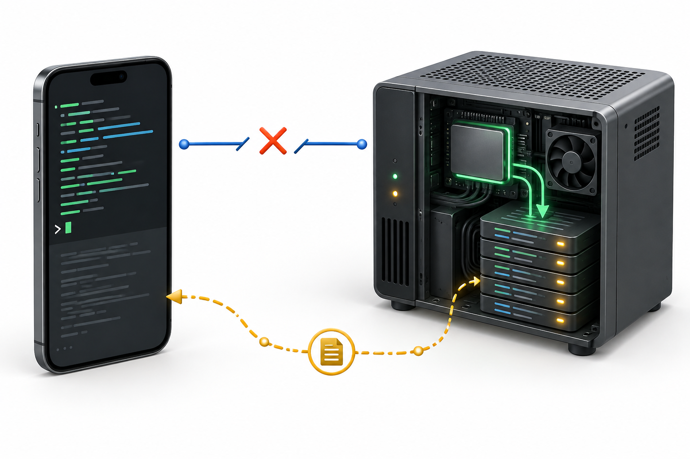
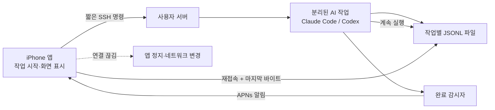
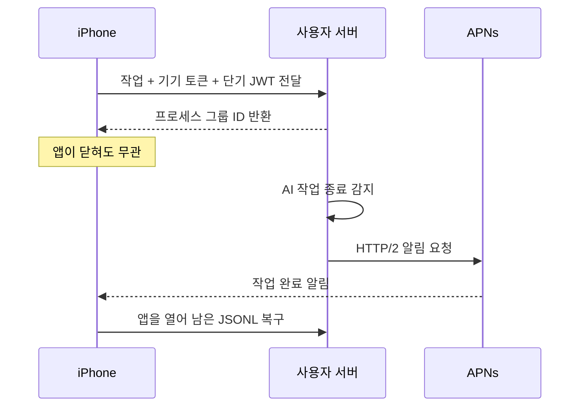

아이폰에서 서버의 AI 코딩 도구를 실행하면 곧 현실적인 문제가 생긴다. 작업은 몇 분에서 수십 분이 걸리는데, 사용자는 그동안 화면을 끄거나 다른 앱으로 이동한다. iOS 앱이 백그라운드에서 멈추면서 SSH 연결도 더는 믿을 수 없게 된다. 작업을 SSH 연결에 직접 매달아 두면 휴대폰을 주머니에 넣는 행동이 곧 작업 중단이 된다.

Pocket Agent에서는 이 관계를 뒤집었다. 아이폰은 작업을 **시작하고 관찰하는 리모컨**만 맡고, 실제 AI 작업은 서버에서 독립된 프로세스로 계속 실행한다. 출력은 파일에 남기고, 앱이 돌아오면 마지막으로 읽은 바이트 다음부터 이어 받는다. 연결은 사라져도 작업과 기록은 남는다.

이 글은 네이티브 iOS 앱에서 사용자의 서버에 SSH로 접속해 Claude Code와 Codex를 실행하면서, 연결 끊김을 정상 상황으로 다루기까지의 설계와 시행착오를 정리한 기록이다. 별도 중계 서버나 전용 에이전트 데몬을 설치하지 않고, 서버에 이미 있는 SSH와 CLI만 사용한다는 제약도 끝까지 유지했다.



## 연결이 아니라 작업을 오래 살려야 했다

처음 떠올리기 쉬운 해법은 SSH 연결을 오래 유지하는 것이다. keepalive를 보내고, 앱에 백그라운드 실행 권한을 주고, 끊어지면 빨리 다시 접속하는 식이다. 그러나 이것만으로는 문제를 없앨 수 없다.

Apple 문서상 일반적인 iOS 앱은 백그라운드로 이동한 뒤 곧 정지 상태가 된다. 백그라운드 전환 시 기본적으로 주어지는 시간도 길지 않으며, 계속 실행할 수 있는 모드는 정해진 용도에 한정된다. 코딩 작업이 끝날 때까지 SSH 소켓을 붙잡는 것은 운영체제의 실행 모델과 맞지 않는다. [Apple도 백그라운드 실행의 대안이 있으면 그 대안을 사용하라고 안내한다](https://developer.apple.com/documentation/Xcode/configuring-background-execution-modes).

실제 일주일치 작업 시간을 확인하니 절반은 92초 안에 끝났지만, 작업 10건 중 1건꼴로 405초보다 오래 걸렸다. 가장 긴 작업은 3,233초였고, 10분을 넘긴 작업도 8건이었다. 연결 수명을 늘리는 최적화보다 **연결 수명과 작업 수명을 분리하는 설계**가 먼저였다.



핵심 구성요소는 세 개다.

- **작업 프로세스**는 SSH 채널이 닫혀도 서버에서 계속 실행한다.
- **JSON Lines(JSONL) 파일**은 AI가 만든 이벤트를 한 줄씩 저장하는 영속 스트림이다.
- **바이트 오프셋**은 앱이 그 파일을 어디까지 확정적으로 읽었는지 나타내는 책갈피다.

이렇게 나누면 재접속은 실행 중인 프로세스에 다시 매달리는 일이 아니다. 같은 파일의 다음 위치부터 읽는 단순한 복구 작업이 된다.

## Swift 코드를 쓰기 전에 셸부터 검증했다

이 구조에서 가장 위험한 부분은 SwiftUI 화면이 아니라 원격 셸의 동작이었다. 그래서 앱 코드를 만들기 전에 실제 서버를 대상으로 스파이크 테스트를 작성했다. 계획을 설명하는 문서가 아니라, 실패하면 프로젝트 방향을 바꾸기 위한 검증이었다.

확인한 항목은 다음과 같다.

- SSH 접속을 끊어도 작업이 끝까지 실행되는가
- 읽기를 중간에 멈춘 뒤 정확히 이어 붙일 수 있는가
- 한글과 이모지의 중간 바이트에서 네트워크 청크가 갈려도 손실이 없는가
- 이전 대화를 세션 ID로 이어갈 수 있는가
- 작업 취소 시 자식과 손자 프로세스가 남지 않는가
- 따옴표, 줄바꿈, 셸 명령처럼 보이는 문자가 프롬프트에 있어도 실행되지 않는가
- 비로그인 SSH 채널에서도 CLI 경로를 찾을 수 있는가

검증한 12개 조건은 모두 통과했지만, 예상과 다른 사실도 세 가지 나왔다. 구조화된 스트림 출력에는 도움말만 보고 알기 어려운 추가 옵션이 필요했고, 분리된 프로세스 트리에는 `SIGINT`가 듣지 않아 `SIGTERM` 뒤 `SIGKILL`로 정리해야 했다. 비로그인 SSH 셸에는 개발 도구의 경로가 잡히지 않아 로그인 셸을 명시해야 했다.

이 발견들을 테스트와 명령 생성기에 먼저 고정한 뒤에야 Swift 구현으로 넘어갔다. 모바일 앱의 화면에서 간헐적으로 재현할 문제를 셸 수준의 결정적인 테스트로 바꾼 셈이다.

## 분리 실행의 핵심은 프로세스 그룹이었다

서버에 보내는 실제 명령은 더 복잡하지만, 형태를 줄이면 아래와 같다.

```bash
bash -lc '
  cd "$PROJECT_DIR" || exit 1
  set -m
  nohup "$AGENT_CLI" -p "$(cat "$PROMPT_FILE")" \
    >> "$JOB_FILE" 2> "$ERROR_FILE" < /dev/null &
  pgid=$!
  printf "%s\n" "$pgid"
'
```

`nohup`은 SSH 채널이 닫힐 때 발생하는 hangup 신호에서 작업을 보호한다. `set -m`은 작업을 독립된 프로세스 그룹으로 만들어, 나중에 그룹 전체의 생존 여부를 묻거나 한 번에 종료할 수 있게 한다. 앱은 반환된 프로세스 그룹 ID를 저장한다.

프롬프트를 명령행 문자열로 직접 조립하지 않은 것도 중요했다. 평범한 질문에도 따옴표와 줄바꿈이 들어가고, 코드에는 `$()`나 백틱처럼 셸에서 의미를 갖는 문자가 흔하다. 프롬프트를 파일로 전달하고 그 내용을 한 번 읽게 하면, 파일 안의 문자가 다시 셸 문법으로 평가되지 않는다. 짧은 프롬프트는 Base64로 인코딩해 실행 명령과 함께 보내 왕복 횟수를 줄이고, 큰 프롬프트는 파일 전송으로 되돌아가도록 했다.

취소도 PID 하나가 아니라 프로세스 그룹 전체를 향한다.

```bash
kill -TERM -- -"$PGID"
sleep 5
kill -KILL -- -"$PGID" 2>/dev/null || true
```

AI CLI가 셸이나 빌드 도구를 다시 실행할 수 있으므로 부모 프로세스 하나만 죽여서는 부족하다. 먼저 정상 종료할 시간을 주고, 남은 프로세스만 강제 종료한다.

## 재접속은 마지막 바이트 다음부터 시작한다

작업 출력은 한 줄에 이벤트 하나를 담는 JSONL 파일로 쌓인다. 앱은 파일을 실시간으로 읽다가 완전한 줄을 만났을 때만 화면용 이벤트로 변환한다. 네트워크 연결이 끊기면 아직 줄이 끝나지 않은 조각은 확정하지 않는다.

여기서 줄 번호 대신 바이트 위치를 사용했다. 같은 한 줄이라도 한글은 여러 바이트를 사용하고, SSH가 전달하는 청크의 경계는 문자나 줄 경계와 일치하지 않는다. 이미 처리한 바이트 수가 `N`이라면 재접속 명령은 1부터 세는 `tail` 규칙에 맞춰 `N + 1`부터 읽는다.

```bash
tail -c +$((COMMITTED_OFFSET + 1)) -F "$JOB_FILE"
```

더 중요한 규칙은 **출력 줄 저장과 오프셋 전진을 하나의 SQLite 트랜잭션으로 묶는 것**이다.

```text
BEGIN
  새 JSONL 줄 저장
  committed_byte_offset 갱신
COMMIT
```

둘을 따로 저장하면 앱이 그 사이에 종료될 때 두 종류의 오류가 생긴다. 줄만 저장되고 오프셋이 남으면 같은 내용을 다시 읽고, 오프셋만 앞서가면 아직 저장하지 않은 답변을 영원히 건너뛴다. 한 트랜잭션으로 묶으면 둘 다 반영되거나 둘 다 취소된다.

실제 스파이크에서는 7,220바이트 출력의 2,247바이트 지점에서 읽기를 끊고 나머지를 다시 붙여 원본과 일치하는지 확인했다. 한글과 이모지가 포함된 데이터도 여러 경계로 나눠 같은 방식으로 검증했다. 이 테스트 덕분에 “대체로 이어진다”가 아니라 “완전한 줄 뒤의 바이트만 재개점이 된다”는 불변식을 만들 수 있었다.

## 시행착오 1: 백그라운드에 보냈는데 전혀 분리되지 않았다

첫 구현에서는 명령을 다음과 비슷하게 조립했다.

```bash
mkdir ... && cd ... && set -m && nohup agent ... & echo $!
```

겉으로는 AI 프로세스만 백그라운드로 보내는 것처럼 보였다. 실제로는 셸 연산자 우선순위 때문에 `&`가 앞의 명령 목록 전체를 비동기 작업으로 만들었다. 그 안의 `nohup agent`는 여전히 포그라운드에서 실행됐고, 비동기 셸의 표준 출력이 SSH 채널에 연결된 채 남았다.

증상은 명확했다. 20초짜리 작업을 보내면 앱이 약 20초 동안 “연결 중”에 머물렀다. 작업이 끝난 뒤에야 SSH 호출이 반환됐고, 답변은 스트리밍되지 않고 한꺼번에 나타났다.

해결은 백그라운드로 보낼 범위를 괄호로 정확히 묶는 것이었다.

```bash
prepare && ( nohup agent ... & pgid=$!; echo "$pgid" )
```

수정 후 시작 명령은 0~1초 안에 프로세스 그룹 ID를 돌려줬고, 작업은 서버에서 계속됐다. 셸 한 줄의 모양이 사용자에게는 “실시간으로 답이 오는 앱”과 “한참 멈춘 앱”의 차이였다.

## 시행착오 2: AI가 만든 백그라운드 작업은 턴과 함께 죽었다

서버 작업을 SSH에서 분리했으니 그 안에서 실행한 모든 명령도 안전할 것이라 생각하기 쉽다. 그러나 한 번의 AI 응답을 `claude -p` 프로세스 하나로 실행하는 구조에서는 다른 경계가 있었다.

에이전트가 오래 걸리는 명령을 자체 `run_in_background` 기능으로 실행한 뒤 “완료되면 알려주겠다”고 답한 사례가 두 번 있었다. 실제 작업 파일을 확인하니 둘 다 정확히 `[killed]`로 끝났고, 기록 시각도 해당 AI 턴이 종료된 시각과 같았다. SSH가 끊어서가 아니라, 한 턴을 담당하던 CLI 프로세스가 끝나면서 자신이 만든 백그라운드 셸을 정리한 것이었다.

이 환경에서는 기다림을 한 단계 더 바깥으로 보내는 대신, AI 턴 안에서 포그라운드로 기다리게 했다. 보통 터미널에서는 불편한 선택이지만 여기서는 다르다. AI 턴 자체가 이미 서버에서 분리되어 있고 출력도 재개할 수 있으므로, 15분 동안 포그라운드 반복문을 기다려도 휴대폰은 묶이지 않는다.

CLI가 자신이 어떤 실행기 안에 있는지 알 수 없으므로 매 턴의 시스템 안내에 이 제약을 추가했다. 이 문구가 셸 명령의 인자 경계를 깨뜨리지 않는지도 테스트했다. 연결 끊김 문제를 해결하고 나니, 그 안쪽의 **턴 수명과 자식 작업 수명**이 다음 경계로 드러난 사례였다.

## 시행착오 3: 두 번째 앱이 아니라 테스트가 운영 DB를 열고 있었다

실사용 중 한 턴이 다음 오류로 종료됐다.

```text
SQLite error 5: database is locked
while executing COMMIT TRANSACTION
```

당시 데이터베이스는 기본 rollback journal 모드였고 잠금 대기 시간은 0이었다. 두 연결이 겹치면 SQLite가 기다리지 않고 즉시 `SQLITE_BUSY`를 반환했고, 출력 저장 실패는 해당 턴의 실패로 이어졌다.

처음에는 앱을 두 번 실행한 상황을 의심했다. 열린 파일을 추적해 보니 예상 밖의 두 번째 연결은 테스트 프로세스였다. iOS 앱 테스트 번들은 앱을 호스트로 실행한다. 테스트를 시작하면 앱 초기화 코드가 사용자의 실제 Application Support 디렉터리를 열고, 운영 DB 마이그레이션과 제목 보정 작업까지 수행하고 있었다.

해결은 두 층으로 나눴다.

1. 디스크 DB는 Write-Ahead Logging(WAL) 모드로 열고 쓰기 잠금에 최대 10초간 대기하도록 했다.
2. 테스트 실행은 매번 별도의 임시 Application Support 디렉터리를 사용하게 했다.

[SQLite의 WAL 모드](https://www.sqlite.org/wal.html)는 읽기가 쓰기를 막지 않고 쓰기가 읽기를 막지 않도록 동시성을 높인다. 다만 작성자는 한 번에 하나뿐이므로 WAL만으로 모든 충돌이 사라지지는 않는다. [busy timeout](https://sqlite.org/c3ref/busy_timeout.html)을 함께 둔 이유다. 수정 후 전체 테스트를 다시 실행하며 실제 DB를 여는 프로세스를 추적했고, 운영 파일에는 앱 프로세스 하나만 접근하는 것을 확인했다.

이 장애의 교훈은 “SQLite에는 WAL을 켜자”보다 넓었다. 테스트 격리는 테스트 데이터만의 문제가 아니다. 앱 시작 시 접근하는 DB, 로그, 비밀정보 저장소, 푸시 설정 파일까지 모두 같은 경계 안에서 분리해야 한다.

## 작업을 실행한 서버가 완료를 알려주게 했다

재접속 복구가 되더라도 사용자가 앱을 다시 열기 전에는 완료 사실을 모른다. [iOS 백그라운드 작업은 시스템이 적절한 실행 시점을 결정한다](https://developer.apple.com/documentation/backgroundtasks/choosing-background-strategies-for-your-app). 특히 10분이 넘는 작업은 사용자가 화면을 보고 있지 않을 가능성이 높았다.

별도 푸시 서버를 새로 두면 “서버에 아무것도 설치하지 않는다”는 원칙이 깨진다. 대신 작업 시작 명령 옆에 작은 완료 감시자를 함께 실행했다. 감시자는 프로세스 그룹이 사라질 때까지 기다렸다가 Apple Push Notification service(APNs)에 알림을 보낸다.



APNs 서명용 개인 키는 휴대폰의 Keychain 밖으로 내보내지 않는다. 휴대폰이 현재 시각으로 만든 단기 JSON Web Token(JWT)과 기기 토큰만 작업 명령에 실어 보낸다. [Apple은 토큰 기반 APNs 요청에 ES256으로 서명한 JWT를 사용하고, 발급 시각이 한 시간을 넘은 토큰은 거부한다](https://developer.apple.com/documentation/UserNotifications/establishing-a-token-based-connection-to-apns). 서버에 장기 개인 키나 기기 등록 서비스를 둘 필요가 없는 이유다.

이 알림은 최선 노력 방식이다. 서버가 외부 네트워크에 연결할 수 없거나 작업이 JWT 유효 시간을 넘기면 알림이 오지 않을 수 있다. 그래도 작업과 JSONL 파일은 그대로 남아 다음 접속 때 복구된다. 알림 실패가 작업 실패로 번지지 않게 한 것이다.

개인정보 측면의 선택도 남았다. 여러 작업이 동시에 돌 때 “작업 완료”만으로는 어느 대화인지 알 수 없어 알림 본문에 대화 제목을 넣었다. 따라서 제목은 APNs를 거친다. 민감한 프로젝트에서는 제목을 일반 문구로 바꾸는 옵션이 필요하다. 편의 기능에도 데이터 경로를 명시해야 한다.

## 끊김에 강해진 뒤에는 느린 시작이 보였다

안정성이 확보되자 다음 문제는 앱이 버벅이는 것이었다. 실사용 중 메인 스레드 감시 로그에는 아이폰에서 250~839밀리초, Mac에서 최대 585밀리초의 멈춤이 잡혔다.

가장 큰 원인은 대화 목록을 동기식으로 전부 읽는 코드였다. 639개 대화에서 목록 요약을 읽는 데 Mac 기준 39밀리초가 걸렸고, 이 작업이 화면 갱신뿐 아니라 서버 연결 상태가 변할 때마다 반복됐다. DB 조회는 메인 액터 밖으로 옮기고, 연결 상태 변화에는 이미 가진 목록의 표시만 다시 계산하게 했다.

앱 시작 시의 두 조회도 같은 방식으로 줄였다.

| 작업 | 변경 전 | 변경 후 |
|---|---:|---:|
| 제목 보정 대상 찾기 | 25.5ms | 0.3ms |
| 최근 서버 하나 찾기 | 6.9ms | 0.1ms |

첫 번째 조회는 제목 없는 대화를 모두 순회했지만, 실제로 제목을 만들 원문이 없는 대화가 대부분이었다. 원문이 있는 행만 DB에서 고르게 바꾸자 아무 일도 하지 않는 시작 비용이 사라졌다. 두 번째 조회는 대화 전체를 읽어 최근 서버 하나를 찾던 코드를 단일 행 쿼리로 바꿨다.

수치 자체보다 중요한 점은 측정 순서다. 화면이 느리다는 인상을 애니메이션으로 덮지 않고, 메인 스레드 정지 시간을 기록한 뒤 가장 비싼 동기 작업부터 옮겼다.

## 별도 게이트웨이 방식과 무엇이 달라졌나

이전에 만든 [iOS 에이전트 컨트롤 타워](/posts/full-stack/desktop/sonlife-app-ios-agent-control-tower-swiftui-sse-watch-siri/)는 백엔드가 작업 상태와 Server-Sent Events(SSE), 승인 요청, 푸시를 관리한다. 여러 사용자와 업무 시스템을 연결하는 서비스라면 중앙 게이트웨이가 자연스럽다.

웹 백엔드에서 다룬 [클라이언트 연결 끊김에도 워크플로우 실행 유지하기](/posts/full-stack/backend/client-workflow-execution-keep/)도 실행과 전송을 분리한다는 원칙은 같다. 다만 그 구조는 DB와 결과 조회 API가 복구를 맡고, Pocket Agent는 설치할 백엔드가 없으므로 작업 파일과 바이트 오프셋이 같은 역할을 맡는다.

Pocket Agent의 목표는 다르다. 사용자가 이미 관리하는 한 대 이상의 개발 서버에 바로 접속하고 싶었다. 서버마다 게이트웨이를 배포하고 인증 체계를 운영하는 대신, SSH를 제어 채널로 쓰고 파일을 복구 채널로 삼았다.

| 구분 | 중앙 게이트웨이 | SSH 직결 + 작업 파일 |
|---|---|---|
| 서버 준비 | 전용 서비스 배포 필요 | SSH와 AI CLI만 필요 |
| 실시간 전달 | SSE/WebSocket 등 | SSH tail |
| 연결 끊김 복구 | 서버 세션 API | JSONL 바이트 오프셋 |
| 다중 사용자 관리 | 중앙화하기 쉬움 | 별도 설계 필요 |
| 적합한 환경 | 팀 서비스, 통합 업무 | 개인 서버, 직접 관리 환경 |

어느 방식이 항상 더 낫다는 결론은 아니다. 중앙 통제와 다중 사용자 기능이 필요하면 게이트웨이가 유리하다. 설치 마찰을 줄이고 사용자의 서버를 그대로 활용하는 것이 우선이면 SSH 직결 구조가 단순하다.

## 결과와 남은 한계

현재 구조에서 휴대폰 잠금, 앱 종료, Wi-Fi와 셀룰러 전환은 더 이상 작업 종료 조건이 아니다. 앱이 돌아오면 저장한 오프셋부터 출력을 복구하고, 작업을 실행한 서버가 완료 알림도 보낼 수 있다. Claude Code와 Codex는 출력 형식과 세션 파일이 다르지만, 바깥의 분리 실행·작업 파일·재접속 구조는 함께 사용한다.

다만 “연결이 끊겨도 안전하다”가 모든 실패를 해결했다는 뜻은 아니다.

- 사용자가 관리하는 서버에 SSH와 지원되는 AI CLI가 미리 설치되어 있어야 한다.
- CLI 버전이 바뀌면 이벤트 형식과 세션 재개 동작을 다시 검증해야 한다.
- APNs 알림은 네트워크와 단기 JWT에 의존하는 선택 기능이다.
- WAL 데이터베이스를 복사할 때는 본 파일만 떼지 말고 WAL 상태까지 고려해야 한다.
- 다중 사용자 서비스에 필요한 계정, 권한 분리, 감사 체계는 이 구조만으로 제공되지 않는다.

가장 크게 남은 교훈은 모바일 네트워크를 더 끈질기게 유지하는 법이 아니었다. 오래 걸리는 작업에서는 연결을 신뢰하지 말고, **작업의 생존**, **출력의 보존**, **읽은 위치의 커밋**, **완료 통지**를 서로 독립적으로 설계해야 한다. 그러면 끊김은 예외가 아니라 잠시 화면을 보지 않은 상태가 된다.

## 참고 문서

- [Apple: Configuring background execution modes](https://developer.apple.com/documentation/Xcode/configuring-background-execution-modes)
- [Apple: Extending your app's background execution time](https://developer.apple.com/documentation/uikit/extending-your-app-s-background-execution-time)
- [Apple: Choosing Background Strategies for Your App](https://developer.apple.com/documentation/backgroundtasks/choosing-background-strategies-for-your-app)
- [Apple: Establishing a token-based connection to APNs](https://developer.apple.com/documentation/UserNotifications/establishing-a-token-based-connection-to-apns)
- [Apple: Sending notification requests to APNs](https://developer.apple.com/documentation/usernotifications/sending-notification-requests-to-apns)
- [SQLite: Write-Ahead Logging](https://www.sqlite.org/wal.html)
- [SQLite: Set A Busy Timeout](https://sqlite.org/c3ref/busy_timeout.html)
