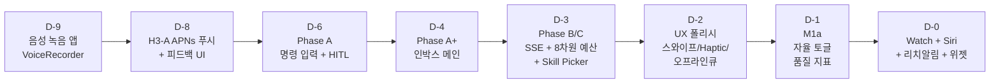

# sonlife-app iOS 컨트롤 타워: SwiftUI + SSE 실시간 인박스 + APNs 인라인 승인 + Watch + Siri

## 음성 녹음 앱이 컨트롤 타워가 된 이유

sonlife-app은 원래 단순한 음성 녹음 앱이었다. iOS에서 백그라운드 녹음을 하고, 청크 단위로 서버에 업로드하고, STT 결과를 받아오는 게 전부였다. 프로젝트명도 `VoiceRecorder`였다.

그게 9일 동안 완전히 다른 앱이 됐다. 같은 코드베이스에 명령 입력, HITL 승인, 실시간 작업 인박스, 예산 대시보드, Skill picker, 시스템 상태 모니터, synaptic 그래프 관측 뷰, Apple Watch 앱, Siri Shortcuts, 위젯이 차례로 들어왔다. 프로젝트명은 `SonlifeApp`으로 바뀌었고, 본래 녹음 기능은 메뉴 한 항목으로 밀려났다.

이 변화를 일으킨 건 같은 시기에 진행한 [sonlife 백엔드의 자율 에이전트 루프](../../ai/agent/sonlife-autonomy-loop-budget-hardstop-hitl-graph-push.md)다. 백엔드가 메일/Teams를 자율 답신하기 시작하고, HITL 승인이 필요한 상황이 매일 몇 번씩 발생하고, 예산 hard-stop 사고가 한 번 일어나자 — **모바일에서 즉시 보고, 즉시 승인하고, 즉시 거절할 수 있는 클라이언트가 없으면 자율 루프 자체가 못 굴러간다**는 게 분명해졌다.

> 백엔드의 안전장치는 클라이언트의 즉응성과 짝이 되어야 한다.

이 글은 그 짝의 한쪽 — iOS 네이티브 컨트롤 타워 — 을 9일 동안 설계하고 부수고 다시 만든 과정을 정리한다. SwiftUI의 새 동시성 모델, URLSession.bytes로 SSE를 받는 네이티브 패턴, 오프라인 큐, APNs 인라인 액션 + Face ID, Apple Watch + Siri까지. iOS 풀스택 가까운 영역을 9일에 압축한 케이스다.

## 9일의 진화 — 한눈에 보이는 단계

먼저 시간순 흐름.



각 단계가 그날의 가장 큰 결정 한두 개씩을 안고 있었다. 순서가 중요했다 — Phase A 없이 인박스로 바로 갔다면 화면 구조가 안 잡혔을 거고, Phase B 없이 SSE를 도입했다면 폴링 폴백이 없어서 안정성이 무너졌을 거고, UX 폴리시 없이 Watch로 갔다면 작은 화면에서 무엇을 표시할지 감을 못 잡았을 거다.

## Phase A — 명령 입력과 HITL 승인 UI

가장 먼저 만든 건 백엔드의 핵심 흐름과 1:1로 맞물리는 화면 두 개였다.

**1. CommandInputView** — 자연어 명령을 입력해서 `/api/command`로 dispatch.
**2. ApprovalSheetView** — HITL 승인이 걸린 도구 호출의 상세 + 승인/거절/수정.

이 둘이 있어야 사용자가 "내가 직접 작업을 시작하고", "에이전트가 자율로 시작한 작업의 위험한 단계를 막는" 두 사이클을 모두 닫을 수 있다.

`OrchestratorAPI`는 단순한 enum 기반 클라이언트로 시작했다. Foundation의 URLSession + Codable로 충분했고, 의존성이 없는 게 iOS 앱에서 빌드/유지보수 양면으로 이점이 컸다.

```swift
enum OrchestratorAPI {
    static var serverURL: String {
        ChunkUploader.shared.currentServerURL
    }

    static func dispatch(input: String) async throws -> CommandResponse {
        let body = CommandRequest(
            input: input, inputType: "text",
            source: "ios_app", urgency: "normal"
        )
        return try await post("api/command", body: body)
    }

    static func approve(token: String, modifiedArgs: ApprovalArgs? = nil)
        async throws -> CommandResponse {
        let body = ApprovalRequest(
            decision: modifiedArgs == nil ? "approve" : "modify",
            modifiedArgs: modifiedArgs, reason: nil
        )
        return try await post("api/approval/\(token)", body: body)
    }

    static func reject(token: String, reason: String?) async throws -> CommandResponse {
        ...
    }
}
```

`async/await`은 Swift Concurrency 모델 덕분에 콜백 지옥 없이 깔끔하게 떨어진다. iOS 17+의 `@Observable`과 `@Bindable`을 사용해 ViewModel 보일러플레이트도 거의 사라졌다. 이게 SwiftUI에서 자율 에이전트 클라이언트를 빠르게 만들 수 있었던 가장 큰 이유다.

`ApprovalSheetView`의 핵심 디테일은 **승인을 단순한 yes/no가 아니라 "수정 후 승인"까지 허용**한다는 점이다. 백엔드가 만든 답장 초안이 마음에 안 들면 사용자는 그 자리에서 본문을 고치고 그 수정본으로 발송할 수 있다. `ApprovalRequest.decision`이 `approve`/`reject`/`modify` 세 종류인 이유다.

## Phase A+ — 작업 인박스로 메인 화면 전환

Phase A의 화면은 명령을 보내는 입력창 하나, 알림을 통해 들어오는 승인 시트 하나뿐이었다. 빠르게 발견한 문제는 **상태가 사라진다**는 거였다. 사용자가 명령을 5건 보내고 각각이 백엔드에서 굴러가는 동안, 어떤 것이 진행 중이고 어떤 것이 완료됐는지 한눈에 볼 수 있는 화면이 없었다. 알림이 사라지면 사용자가 컨텍스트를 다시 잃었다.

해결책은 **메인 화면 자체를 작업 인박스로 만드는 것**이었다. 메일 앱의 받은편지함처럼, 모든 에이전트 작업이 한 리스트에 흐른다.

`TaskInboxView`는 3섹션 구조로 자리잡았다.

```swift
struct TaskInboxView: View {
    @State private var pendingApprovals: [ApprovalDetail] = []
    @State private var runningSessions: [OrchestratorSession] = []
    @State private var doneSessions: [OrchestratorSession] = []

    private var inboxList: some View {
        List {
            // 섹션 1: 승인 대기 (가장 위, 주황색 강조)
            // 섹션 2: 진행 중 (라이브 카드)
            // 섹션 3: 완료 (실패는 빨간색)
        }
    }
}
```

각 섹션은 SwiftUI `Section` 한 덩어리이고, 각 row는 자체 swipe action / haptic / live state를 가진다. 디자인 결정 한 가지 — **승인 대기를 항상 맨 위에** 둔다. 사용자가 가장 빠르게 봐야 하는 정보이고, 위치가 일관되어야 근육 기억으로 처리할 수 있다.

녹음, 설정, 대시보드 같은 기존 화면들은 좌측 햄버거 메뉴로 옮겼다. 사용자의 첫 화면이 인박스가 됐다는 사실 자체가 이 앱이 무엇을 하는 도구인지 명확히 한다.

## Phase B/C — SSE 실시간 라이브 카드

인박스가 자리잡고 나니 다음 문제가 보였다. 진행 중 세션이 무엇을 하고 있는지 알 수 없었다. "running"이라는 라벨만 떠 있고, 실제로 어느 도구를 호출하는 중인지, 몇 번째 step인지, 비용이 얼마나 누적됐는지는 세션을 탭해서 상세 화면을 열어야 보였다.

폴링으로 채울 수 있는 정보가 아니었다. 진행이 빠른 세션은 5초 안에 끝나는데 폴링 주기가 5초면 라이브 정보가 영영 안 잡힌다. 폴링 주기를 줄이면 배터리/네트워크 부담이 폭증하고. 이 시점에 **SSE를 도입**했다. 백엔드가 세션 이벤트(`tool.called`, `tool.completed`, `step.advanced`, `session.completed` ...)를 SSE로 흘려주고, iOS가 그걸 받아 라이브 카드를 갱신한다.

iOS의 URLSession은 iOS 15부터 `bytes(for:)`를 통해 라인 단위 비동기 스트림을 지원한다. 외부 의존성 없이 SSE 파서를 100줄 안에 짤 수 있다.

```swift
enum SSEClient {
    struct Event {
        let type: String
        let data: [String: Any]
    }

    static func stream(url: URL) -> AsyncThrowingStream<Event, Error> {
        AsyncThrowingStream { continuation in
            let task = Task {
                var request = URLRequest(url: url)
                request.setValue("text/event-stream", forHTTPHeaderField: "Accept")
                request.timeoutInterval = 600  // 10분

                let (bytes, response) = try await URLSession.shared.bytes(for: request)
                guard let http = response as? HTTPURLResponse,
                      (200...299).contains(http.statusCode) else {
                    continuation.finish(throwing: SSEError.badResponse(...))
                    return
                }

                var currentEventType: String?
                var currentDataLines: [String] = []

                for try await line in bytes.lines {
                    if line.isEmpty {
                        // 이벤트 경계 — 조립해서 방출
                        if let type = currentEventType {
                            let dict = parseJSONDict(currentDataLines.joined(separator: "\n")) ?? [:]
                            continuation.yield(Event(type: type, data: dict))
                            if type == "session.completed" || type == "session.failed"
                                || type == "session.suspended" {
                                continuation.finish()
                                return
                            }
                        }
                        currentEventType = nil
                        currentDataLines = []
                        continue
                    }
                    if line.hasPrefix("event: ") {
                        currentEventType = String(line.dropFirst("event: ".count))
                    } else if line.hasPrefix("data: ") {
                        currentDataLines.append(String(line.dropFirst("data: ".count)))
                    }
                }
                continuation.finish()
            }

            continuation.onTermination = { _ in
                task.cancel()
            }
        }
    }
}
```

세 가지 디테일이 들어 있다.

1. **AsyncThrowingStream으로 감싼다.** 호출자는 `for try await event in stream` 한 줄로 받는다. SwiftUI View의 `task` 모디파이어와 자연스럽게 결합된다.
2. **종료 이벤트에서 자동 finish.** `session.completed`/`session.failed`/`session.suspended` 중 하나가 오면 스트림이 스스로 닫힌다. 호출자가 종료 처리를 잊을 수 없다.
3. **continuation.onTermination에서 task.cancel().** SwiftUI View가 사라지면 stream이 cancel되고, cancel이 task를 cancel하고, task가 URLSession.bytes를 cancel한다. 리소스 leak 방지가 한 줄로 끝난다.

### 인박스에서 라이브 카드 동기화

인박스는 폴링과 SSE를 같이 운영한다. 폴링이 5초마다 전체 목록을 동기화하고, 새로 나타난 running 세션마다 SSE 스트림을 자동으로 연다.

```swift
@State private var streamTasks: [String: Task<Void, Never>] = [:]
@State private var liveStates: [String: LiveSessionState] = [:]

@MainActor
private func syncStreams() {
    let currentIds = Set(runningSessions.map { $0.id })

    // 새로 나타난 세션에 스트림 open
    for sid in currentIds where streamTasks[sid] == nil {
        openStream(for: sid)
    }

    // 더 이상 진행 중이 아닌 세션의 스트림 종료
    for (sid, task) in streamTasks where !currentIds.contains(sid) {
        task.cancel()
        streamTasks.removeValue(forKey: sid)
        liveStates.removeValue(forKey: sid)
    }
}

private func openStream(for sessionId: String) {
    let task = Task { @MainActor in
        do {
            for try await event in OrchestratorAPI.sessionEventStream(sessionId: sessionId) {
                if Task.isCancelled { break }
                ingestEvent(event, sessionId: sessionId)
                if isTerminalEvent(event.type) {
                    await loadAll()
                    break
                }
            }
        } catch {
            // 스트림 실패는 폴링이 커버함 — silent
        }
    }
    streamTasks[sessionId] = task
}
```

핵심은 **diff 기반 동기화**다. 새 세션에는 open, 사라진 세션에는 cancel. 이 한 함수가 inbox row의 라이브 라벨과 백엔드 세션 상태를 정확히 일치시킨다. 폴링이 30초마다, SSE는 즉시 — 두 채널이 서로를 보완한다.

이게 다음 결정으로 이어졌다.

### 폴링 주기 동적 조정

SSE가 살아 있으면 폴링은 보조 역할이다. 그래서 폴링 주기를 동적으로 바꿨다.

```swift
.task {
    while !Task.isCancelled {
        if isAppActive {
            await loadAll()
        }
        // SSE 스트림이 살아있으면 폴링은 보조 → 30초, 없으면 5초
        let interval: Duration = streamTasks.isEmpty ? .seconds(5) : .seconds(30)
        try? await Task.sleep(for: interval)
    }
}
```

진행 중 세션이 0개일 때는 5초 폴링(인박스 변화 빠르게 잡음). 진행 중 세션이 있어 SSE가 흐를 때는 30초 폴링(SSE 누락만 보강). **백그라운드/inactive 진입 시 폴링을 멈춘다**. 그리고 SSE 스트림도 모두 cancel하고 liveStates를 비운다 — 백그라운드에서 SSE를 유지하면 배터리가 빠르게 녹기 때문이다.

```swift
.onChange(of: scenePhase) { _, newPhase in
    switch newPhase {
    case .active:
        isAppActive = true
        Task { await loadAll() }
    case .background, .inactive:
        isAppActive = false
        for (_, task) in streamTasks { task.cancel() }
        streamTasks.removeAll()
        liveStates.removeAll()
    }
}
```

이 두 가지 — 동적 폴링 주기 + 백그라운드 cancel — 가 sonlife-app의 배터리/데이터 사용량을 합리적인 범위로 잡았다.

## C-5 Budget 8차원 — 백엔드 모델과 1:1 매핑

같은 시기에 sonlife 백엔드의 budget 모델이 8차원으로 확장됐다 — input/output/total/reasoning tokens, cost, runs, tool_calls, delegated_tasks. iOS 클라이언트도 이 8차원을 그대로 노출했다.

```swift
private func agentCard(_ agent: AgentBudgetUsage) -> some View {
    VStack(alignment: .leading, spacing: 12) {
        HStack {
            Image(systemName: iconFor(agent.agentName))
            Text(agent.agentName.capitalized).font(.headline)
            Spacer()
            Text(String(format: "$%.4f", agent.costUsd))
                .font(.subheadline.monospacedDigit().bold())
        }

        // 8 dimensions grid
        LazyVGrid(columns: [GridItem(.flexible()), GridItem(.flexible())], spacing: 8) {
            metric("입력 토큰", "\(agent.inputTokens)", icon: "arrow.down.circle")
            metric("출력 토큰", "\(agent.outputTokens)", icon: "arrow.up.circle")
            metric("전체 토큰", "\(agent.totalTokens)", icon: "sum")
            metric("추론 토큰", "\(agent.reasoningTokens)", icon: "brain")
            metric("세션 수", "\(agent.runs)", icon: "play.circle")
            metric("도구 호출", "\(agent.toolCalls)", icon: "hammer")
            metric("위임 작업", "\(agent.delegatedTasks)", icon: "person.2")
            metric("비용", String(format: "$%.4f", agent.costUsd), icon: "dollarsign.circle")
        }
    }
}
```

`monospacedDigit()`이 작은 디테일이지만 중요하다. 숫자가 자릿수 변경 시 점프하지 않고 안정적으로 표시된다. 비용처럼 자주 갱신되는 숫자에는 필수.

이 화면이 생기고 나서 백엔드의 hard-stop 사고가 한 번 더 잡혔다. iOS 화면에서 `coding` 에이전트의 비용 수치가 평소보다 빠르게 올라가는 게 보였고, 한도에 닿기 전에 작업을 멈출 수 있었다. **관측은 안전장치의 일부다**라는 명제가 클라이언트 단계에서도 그대로 적용된다.

## OfflineQueue — 네트워크 끊김 시 자동 재전송

지하철, 엘리베이터, 비행기 — 모바일에서 네트워크는 항상 끊긴다. 사용자가 인박스에서 승인 버튼을 눌렀는데 그 순간 네트워크가 죽어 있으면 어떻게 할 것인가? 두 가지 잘못된 답이 있다.

- **A. 에러 알림을 띄우고 사용자가 다시 시도.** 사용자 경험 망가짐.
- **B. 무한 retry.** 백엔드가 살아있다고 가정하면 위험하고, 결국 백그라운드에서 폭주.

올바른 답은 **로컬 큐에 저장 → 네트워크 복구 시 자동 전송**이다. iOS의 `NWPathMonitor`가 네트워크 상태 변화를 알려주니까 복구 시점을 자동으로 잡을 수 있다.

```swift
@Observable
final class OfflineQueue {
    static let shared = OfflineQueue()

    private(set) var isOnline = true
    private(set) var pendingActions: [QueuedAction] = []
    private(set) var isDraining = false

    private let monitor = NWPathMonitor()

    private init() {
        loadFromDisk()

        monitor.pathUpdateHandler = { [weak self] path in
            Task { @MainActor in
                guard let self else { return }
                let wasOffline = !self.isOnline
                self.isOnline = path.status == .satisfied
                if wasOffline && self.isOnline {
                    await self.drain()
                }
            }
        }
        monitor.start(queue: monitorQueue)
    }

    func enqueue(_ action: QueuedAction) {
        pendingActions.append(action)
        saveToDisk()
    }

    @MainActor
    func drain() async {
        guard !isDraining, !pendingActions.isEmpty else { return }
        isDraining = true
        defer { isDraining = false }

        var remaining: [QueuedAction] = []
        for action in pendingActions {
            do {
                try await execute(action)
            } catch {
                if Self.isNetworkError(error) {
                    remaining.append(action)
                }
                // 4xx/5xx 등 서버 에러 → 재시도 불가, 버림
            }
        }
        pendingActions = remaining
        saveToDisk()
    }
}
```

세 가지 원칙이 들어 있다.

1. **NWPathMonitor가 자동 trigger.** 사용자가 앱에서 무엇을 안 해도 복구 시점에 drain이 돌아간다.
2. **재시도 가능한 에러만 큐에 남긴다.** 4xx/5xx 같은 서버 응답은 재시도해도 똑같이 실패하니까 버린다. NSURLErrorDomain의 네트워크 에러만 다시 큐에 넣는다.
3. **JSON으로 디스크 영속화.** 앱이 죽거나 재시작돼도 큐가 살아남는다. atomic write로 손상 방지.

큐 항목은 세 종류 — 승인, 거절, 명령 — 만 지원한다. 에이전트 작업 자체를 큐에 넣는 건 성격이 다르다(원격 상태 변경). 클라이언트가 로컬에서 만들 수 있는 행위 세 가지에만 큐를 적용했다.

```swift
struct QueuedAction: Codable, Identifiable {
    let id: String
    let kind: ActionKind
    let token: String?
    let modifiedArgs: ApprovalArgs?
    let reason: String?
    let input: String?
    let createdAt: Date

    enum ActionKind: String, Codable {
        case approve, reject, command
    }
}
```

### 인박스에서의 즉각 반영

사용자가 오프라인에서 승인 버튼을 누르면 row를 인박스에서 즉시 제거한다. 큐로 옮겨졌다는 사실을 시각적으로 보여주는 게 핵심이다.

```swift
do {
    _ = try await OrchestratorAPI.approve(token: approval.token, modifiedArgs: nil)
    Haptic.success()
    await loadAll()
} catch {
    if OfflineQueue.isNetworkError(error) {
        offlineQueue.enqueue(.approve(token: approval.token))
        Haptic.warning()
        // 로컬 목록에서 즉시 제거 (전송 대기 큐로 이동됨)
        pendingApprovals.removeAll { $0.token == approval.token }
    } else {
        Haptic.error()
        errorMessage = "승인 실패: \(error.localizedDescription)"
    }
}
```

오프라인 배너가 인박스 상단에 떠 있고, 큐에 들어간 액션 수도 표시된다. 사용자는 "내가 누른 게 사라지지 않았다"는 확신을 즉시 얻는다.

## APNs 인라인 승인 — 알림에서 Face ID 한 번으로

자율 루프의 가장 흔한 사용 패턴은 다음과 같다.

1. 백엔드가 메일을 자율 답신하려고 함
2. `send_email` 도구 호출 → permission gate → HITL suspend
3. APNs 푸시가 iOS로 옴
4. 사용자가 **알림 자체에서 승인** (앱을 안 열어도)

이 4번이 핵심이다. 앱을 열고 인박스로 가서 row를 탭하고 시트를 열고 본문을 검토하고 승인 버튼을 누르는 흐름은 너무 길다. 알림 시점에 바로 끝낼 수 있어야 한다.

iOS의 `UNNotificationCategory` + `UNNotificationAction`이 이걸 지원한다. 카테고리에 액션을 박아 두면 알림을 길게 누를 때 인라인 액션 버튼이 뜬다.

```swift
// AppDelegate.application(_:didFinishLaunchingWithOptions:)

// APPROVAL_REQUEST 카테고리 — Phase A HITL 승인 (승인/거절 인라인 액션)
let approveAction = UNNotificationAction(
    identifier: NotificationAction.approve,
    title: "승인",
    options: [.authenticationRequired, .foreground]
)
let rejectAction = UNNotificationAction(
    identifier: NotificationAction.reject,
    title: "거절",
    options: [.destructive, .foreground]
)
let openAction = UNNotificationAction(
    identifier: NotificationAction.open,
    title: "열기",
    options: [.foreground]
)
let approvalCategory = UNNotificationCategory(
    identifier: NotificationCategory.approvalRequest,
    actions: [approveAction, openAction, rejectAction],
    intentIdentifiers: [],
    options: [.customDismissAction]
)
center.setNotificationCategories([approvalCategory, ...])
```

가장 중요한 옵션이 **`.authenticationRequired`**다. 이게 있으면 iOS가 액션을 실행하기 전에 Face ID/Touch ID 인증을 강제한다. 사용자가 의도하지 않은 액션이 락 화면에서 실행되는 일이 없다. "승인"이라는 행동의 무게에 비례한 보호.

`.destructive`는 거절 액션을 빨간색으로 표시한다. iOS의 디자인 컨벤션을 따르면 사용자가 위험한 액션을 시각적으로 구분할 수 있다.

알림 핸들러는 actionId로 분기한다.

```swift
case "approval_request":
    guard let token = userInfo["token"] as? String else { return }

    if actionId == NotificationAction.approve {
        // Face ID 인증은 .authenticationRequired 옵션이 처리
        Task {
            _ = try? await OrchestratorAPI.approve(token: token, modifiedArgs: nil)
        }
    } else if actionId == NotificationAction.reject {
        Task {
            _ = try? await OrchestratorAPI.reject(token: token, reason: "알림에서 거절")
        }
    } else {
        // "열기" 또는 기본 탭 → ApprovalSheetView 오픈
        NotificationCenter.default.post(name: .showApproval, object: nil,
                                         userInfo: ["token": token])
    }
```

세 갈래로 나뉜다. 즉시 승인(인증 후 자동 호출) / 즉시 거절 / 시트 열기. 가장 빠른 사용자는 알림 길게 누르고 승인 버튼 한 번 — 인증 한 번 — 끝. 아침에 일어나서 잠긴 화면에서 5건 처리하는 데 30초가 안 걸린다.

### 페이로드에 token 넣기

이게 동작하려면 백엔드가 APNs 페이로드의 `userInfo`에 approval token을 미리 박아 줘야 한다. 백엔드의 알림 매퍼가 다음과 같은 모양으로 보낸다.

```json
{
  "aps": {
    "alert": {
      "title": "메일 답신 승인 필요",
      "body": "<발신자> 에게 답신 보내려고 함"
    },
    "category": "APPROVAL_REQUEST",
    "mutable-content": 1,
    "sound": "default"
  },
  "type": "approval_request",
  "token": "<approval_token>",
  "tool_name": "email_send"
}
```

`category: APPROVAL_REQUEST`가 있어야 iOS가 인라인 액션을 보여준다. `token`은 userInfo로 들어가서 actionId 핸들러에서 꺼낸다. `mutable-content`는 Notification Service Extension이 있으면 페이로드를 가공할 수 있게 하는 플래그(필요 시 본문 다듬기에 사용).

## Apple Watch 앱 — 손목에서 승인

iOS 앱 단계가 안정되고 나니 자연스러운 다음 단계는 **손목**이었다. Watch 앱은 더 작은 화면, 더 짧은 인터랙션이 강제되는 환경이다. 그게 오히려 도움이 됐다.

Watch 앱에는 두 화면만 만들었다.

- **WatchInboxView** — 승인 대기 목록만 (running/done 생략)
- **WatchApprovalRow** — 한 row에 발신자/요약/승인/거절

Watch에서 누르면 iPhone과 같은 백엔드 API를 호출한다. `WatchOrchestratorAPI`는 iOS의 `OrchestratorAPI`와 비슷한 구조지만, watchOS의 제약(WatchKit 전용 URLSession config, 짧은 타임아웃)에 맞춰 조정했다.

iOS 앱의 코드 재사용도 어느 정도 가능했다. Codable 모델은 `Shared/` 폴더에 두고 양쪽에서 import. View는 watchOS만의 컨벤션이 강해서 별도로 만드는 게 더 깔끔했다.

가장 중요한 결정은 **Watch에서 알림 인라인 승인이 그대로 동작한다**는 점이다. iOS의 `UNNotificationCategory`는 watchOS에도 자동으로 mirror된다. 따라서 백엔드에서 단 한 번 푸시를 보내면 사용자는 iPhone, Watch, 위젯, Live Activity 어디서든 같은 token으로 승인할 수 있다. 한 알림이 모든 표면에 동시 전파된다.

## Siri Shortcuts (AppIntents) — 음성 명령

iOS 16+의 `AppIntents` 프레임워크로 Siri Shortcuts를 정의하면 사용자가 "시리야, sonlife 에이전트에게 명령 보내" 같은 자연어로 앱을 호출할 수 있다. 위젯, Spotlight, Shortcuts 앱과도 자동 연동된다.

```swift
struct SendCommandIntent: AppIntent {
    static var title: LocalizedStringResource = "에이전트에게 명령"
    static var description = IntentDescription("SonLife 에이전트에게 자연어 명령을 전달합니다")

    @Parameter(title: "명령")
    var command: String

    func perform() async throws -> some IntentResult & ProvidesDialog {
        let response = try await OrchestratorAPI.dispatch(input: command)
        return .result(dialog: "명령을 전달했습니다: \(response.status.rawValue)")
    }
}

struct CheckPendingIntent: AppIntent {
    static var title: LocalizedStringResource = "승인 대기 확인"

    func perform() async throws -> some IntentResult & ProvidesDialog {
        let approvals = try await OrchestratorAPI.fetchPendingApprovals()
        if approvals.isEmpty {
            return .result(dialog: "승인 대기 중인 작업이 없습니다")
        }
        return .result(dialog: "승인 대기 \(approvals.count)건이 있습니다")
    }
}

struct QuickApproveIntent: AppIntent {
    static var title: LocalizedStringResource = "최근 승인 요청 승인"

    func perform() async throws -> some IntentResult & ProvidesDialog {
        let approvals = try await OrchestratorAPI.fetchPendingApprovals()
        guard let latest = approvals.first else {
            return .result(dialog: "승인 대기 중인 작업이 없습니다")
        }
        _ = try await OrchestratorAPI.approve(token: latest.token)
        let label = latest.preview.summary ?? latest.toolName
        return .result(dialog: "\(label) 승인 완료")
    }
}
```

세 인텐트.

- **SendCommandIntent** — 자연어 명령. 운전 중에 가장 유용.
- **CheckPendingIntent** — 승인 대기 건수만 음성으로 확인.
- **QuickApproveIntent** — 최근 1건 즉시 승인.

`AppShortcutsProvider`로 등록하면 Siri가 자동으로 phrase 추천을 만든다.

```swift
struct SonlifeShortcuts: AppShortcutsProvider {
    static var appShortcuts: [AppShortcut] {
        AppShortcut(
            intent: SendCommandIntent(),
            phrases: [
                "\(.applicationName) 에이전트에게 명령 보내",
                "\(.applicationName) 명령 전달",
            ],
            shortTitle: "에이전트 명령",
            systemImageName: "text.bubble"
        )
        AppShortcut(
            intent: CheckPendingIntent(),
            phrases: [
                "\(.applicationName) 승인 대기 확인해줘",
                "\(.applicationName) 에이전트 작업 있어?",
            ],
            shortTitle: "대기 확인",
            systemImageName: "hourglass"
        )
    }
}
```

`AppIntents`의 핵심 매력은 **앱 코드와 Siri 통합 사이의 보일러플레이트가 거의 없다**는 점이다. `IntentResult & ProvidesDialog`만 반환하면 Siri가 알아서 음성 응답까지 처리한다. iOS 15 이전의 SiriKit은 Intents Extension을 별도로 만들고, NSUserActivity 등록하고, 등등 복잡했는데 — AppIntents는 일반 Swift struct + protocol 한 줄로 끝난다.

## 위젯 + Live Activity

iOS 위젯은 잠금 화면/홈 화면에 항상 떠 있는 표면이다. 인박스의 핵심 정보(승인 대기 건수, 가장 오래된 승인의 시간)를 위젯으로 노출하면 사용자가 앱을 안 열어도 상태를 본다.

```
SonLifeWidget/
├── PendingApprovalsWidget.swift   # 승인 대기 위젯
├── SonLifeLiveActivity.swift      # 진행 중 세션 Live Activity
└── SonLifeWidgetBundle.swift      # 위젯 번들
```

위젯이 데이터를 어디서 가져오는지가 가장 까다로운 부분이다. 위젯은 자기 프로세스가 따로 돌아가서 앱 메모리에 접근할 수 없다. 두 가지 해결책.

1. **App Group으로 공유 파일.** 앱과 위젯이 같은 App Group에 속하면 파일 시스템을 공유할 수 있다. iOS 앱이 인박스를 갱신할 때마다 `WidgetData.json`을 공유 컨테이너에 쓰고, 위젯이 `Timeline` 갱신 시 그 파일을 읽는다.
2. **WidgetCenter.shared.reloadAllTimelines()** — 앱이 새 데이터를 쓴 직후 위젯에 reload 신호를 보낸다.

```swift
// 인박스 loadAll() 끝에서
private func updateWidgetData(pending: [ApprovalDetail], running: [OrchestratorSession]) {
    WidgetData.write(
        pendingCount: pending.count,
        runningCount: running.count,
        oldestPendingAt: pending.last?.createdAt
    )
    WidgetCenter.shared.reloadAllTimelines()
}
```

Live Activity는 더 강력하다. 진행 중인 에이전트 세션 하나를 Dynamic Island에 띄워서, 사용자가 앱 밖에 있어도 step 진행 상황을 볼 수 있다. 백엔드의 SSE 이벤트가 도착할 때마다 Live Activity의 ContentState를 push로 갱신한다(APNs Live Activity push). 5초 안에 끝나는 짧은 작업은 Live Activity가 빛나기도 전에 사라지지만, 30초~1분 짜리 작업은 Dynamic Island에서 그 흐름을 그대로 본다.

## UX 폴리시 — 작은 디테일들의 합

위에서 다룬 것들이 큰 결정이라면, 사용자 경험을 결정짓는 건 작은 디테일의 합이다. 며칠을 들여 다음을 손봤다.

**1. 날짜 그룹.** 완료 섹션은 오늘/어제/이번주/이전 4개 그룹으로 묶는다. 사용자가 시간 감각을 잃지 않는다.

**2. 스와이프 액션.** 승인 대기 row는 leading swipe(승인) + trailing swipe(거절). 알림 인라인 액션과 같은 동작을 인박스에서도 한 손으로 처리할 수 있게.

**3. Haptic.** 승인 성공 → success haptic, 거절/큐 진입 → warning haptic, 실패 → error haptic. 시각 정보 없이도 결과를 손끝으로 안다.

**4. 빈 상태(empty state).** 인박스가 비어 있을 때 `ContentUnavailableView`로 친절한 메시지 + 새 작업 시작 버튼. iOS 17의 `ContentUnavailableView`는 빈 상태를 스마트하게 렌더링하는 표준 컴포넌트다.

**5. ApprovalSheet/InboxRow 원본-답장 쌍.** 답신 도구 호출 승인일 때 원문 메시지와 답장 초안을 위아래로 나란히 보여준다. 사용자가 "무엇에 대한 답인가"를 즉시 본다. 이전에는 답장 초안만 떠 있어서 맥락이 빠졌었다.

**6. 자율 세션 배지.** 사용자가 직접 dispatch한 세션과 자율 루프가 만든 세션을 시각적으로 구분. 자율 세션은 🤖 배지 + 트리거 소스(메일/Teams/캘린더) 표시.

**7. 권한 배지 / sub-agent 아이콘 / compacted 마커.** 세션 row에 그 세션이 어떤 권한 레벨로 실행 중인지, sub-agent를 spawn했는지, 컨텍스트가 compact됐는지를 작은 아이콘으로 표시. 한눈에 세션의 메타 상태가 보인다.

이런 디테일들이 누적되면 앱이 "그냥 동작하는 인박스"에서 "자연스럽게 손에 붙는 컨트롤 타워"로 바뀐다. 측정하기 어렵지만 사용 빈도가 결정적으로 올라가는 임계점이다.

## 트러블슈팅 — 부서지고 고친 것들

### 1. SSE 스트림 cancel이 안 되던 버그

처음에는 `URLSession.bytes(for:)`의 결과 stream을 그냥 `for try await` 루프로 돌렸다. SwiftUI View가 사라져도 stream이 즉시 끊기지 않고 계속 살아 있는 사고가 발생. 원인은 `AsyncThrowingStream`의 `onTermination`을 설정하지 않았기 때문. fix는 `continuation.onTermination = { _ in task.cancel() }` 한 줄 추가.

### 2. 폴링이 백그라운드에서도 계속 도는 사고

초기에는 `scenePhase` 감지 없이 무한 루프 폴링만 했다. 백그라운드에서도 5초마다 API 호출이 일어나서 배터리/데이터 소모가 심했다. fix는 `onChange(of: scenePhase)`에서 `isAppActive`를 토글하고 폴링 루프가 그 값을 체크하도록.

### 3. 알림 인라인 승인의 Face ID 우회 의심

`.authenticationRequired` 옵션을 처음 추가할 때 "정말 인증이 강제되는가?" 의심이 들었다. iOS 시뮬레이터는 Face ID를 지원하지 않아서 동작 차이가 안 보였고, 실기기 테스트로만 검증할 수 있었다. 결론은 iOS가 OS 레벨에서 인증을 강제한다는 것 — 앱 코드는 인증 결과를 신경 쓸 필요가 없다.

### 4. 위젯이 인박스 갱신 후에도 옛 데이터 표시

App Group 파일을 쓰고 나서 `WidgetCenter.shared.reloadAllTimelines()`를 호출 안 했다. iOS는 위젯 timeline을 자체 정책으로 갱신하므로, 명시적 reload 없이는 5분~1시간씩 옛 데이터가 떠 있을 수 있다. fix는 `loadAll()` 끝에 reload 호출 추가.

### 5. Live Activity가 sleep 상태에서 죽음

iPhone이 잠금 + 화면 꺼짐 상태가 한참 이어지면 Live Activity가 OS에 의해 종료된다. push로 ContentState를 갱신할 수 있도록 백엔드에 Live Activity push token 등록 단계를 추가. 종료된 Live Activity는 새 push를 받으면 부활하지 않으니, 종료 detection 후 인박스로 fallback해야 한다.

### 6. 오프라인 큐 drain 중 race condition

여러 액션이 동시에 큐에 들어왔을 때 drain이 두 번 도는 케이스가 있었다. fix는 `isDraining` 플래그 + `defer { isDraining = false }`로 reentrancy 가드.

### 7. STT health 키 mismatch

설정 화면에서 STT provider 정보를 표시할 때, 백엔드 응답의 키를 잘못 추적했다. 백엔드는 `stt`로 보내는데 클라이언트가 `stt_provider`로 읽었다. 단순한 타입 불일치였지만 사용자에게 "loading..."이 영원히 떠 있는 사고로 발현. fix는 키 명세를 양쪽에서 통일.

## 회고 — 9일에 압축된 풀스택

이 9일이 가능했던 이유는 두 가지로 정리할 수 있다.

**1. SwiftUI + Swift Concurrency가 보일러플레이트를 거의 없앤다.** ViewModel 패턴, RxSwift, Combine 같은 추가 레이어 없이 `@Observable` + `async/await` + `task` 모디파이어만으로 90%의 화면이 만들어졌다. iOS 17+ 컨벤션을 지키면 한 화면당 평균 200~500줄로 끝났다.

**2. 외부 의존성 0개.** 네트워킹은 URLSession, 파싱은 Codable, 동시성은 Swift Concurrency, SSE는 자체 100줄 파서, 오프라인은 NWPathMonitor. CocoaPods/SwiftPM 의존성을 추가할 필요가 없었고, 그게 빌드 속도와 유지보수 모두에서 이득이었다. iOS 풀스택 앱이 "iOS가 기본으로 제공하는 것만으로" 충분히 만들어진다는 걸 다시 확인한 경험.

남은 한 가지 교훈 — **자율 에이전트 시스템은 클라이언트가 따라잡지 못하면 멈춘다**. 백엔드의 안전장치(예산 hard-stop, HITL gate)는 사용자가 즉시 보고 즉시 반응할 수 있는 표면이 있어야 의미 있다. 그 표면이 모바일이라면 알림 인라인 액션, 오프라인 큐, Watch, Siri 같은 작은 표면들이 모두 동일한 백엔드 토큰을 공유해야 한다. 이번에 만들면서 자연스럽게 그 원칙이 자리잡았다 — **하나의 approval token이 인박스 / 알림 / Watch / 위젯 / Siri 어디서든 동일하게 처리된다.** 인터페이스가 다를 뿐 백엔드와의 계약은 한 종류.

이게 [백엔드의 자율 루프 글](../../ai/agent/sonlife-autonomy-loop-budget-hardstop-hitl-graph-push.md)에서 다룬 안전장치 설계와 짝이 되는 클라이언트 편이다. 두 글을 같이 읽으면 한 시스템의 양면이 보인다 — 백엔드는 무엇을 차단할지를 결정하고, 클라이언트는 그 차단을 사용자가 한 손으로 풀거나 더 단단히 잠글 수 있게 만든다.

다음 글에서는 같은 sonlife 백엔드의 또 다른 진화 — Cohere Transcribe STT provider를 추가하면서 한국어/영어 코드스위칭 대응과 HF_TOKEN 자동 로그인을 처리한 작은 기술 주제 — 를 다룬다.
