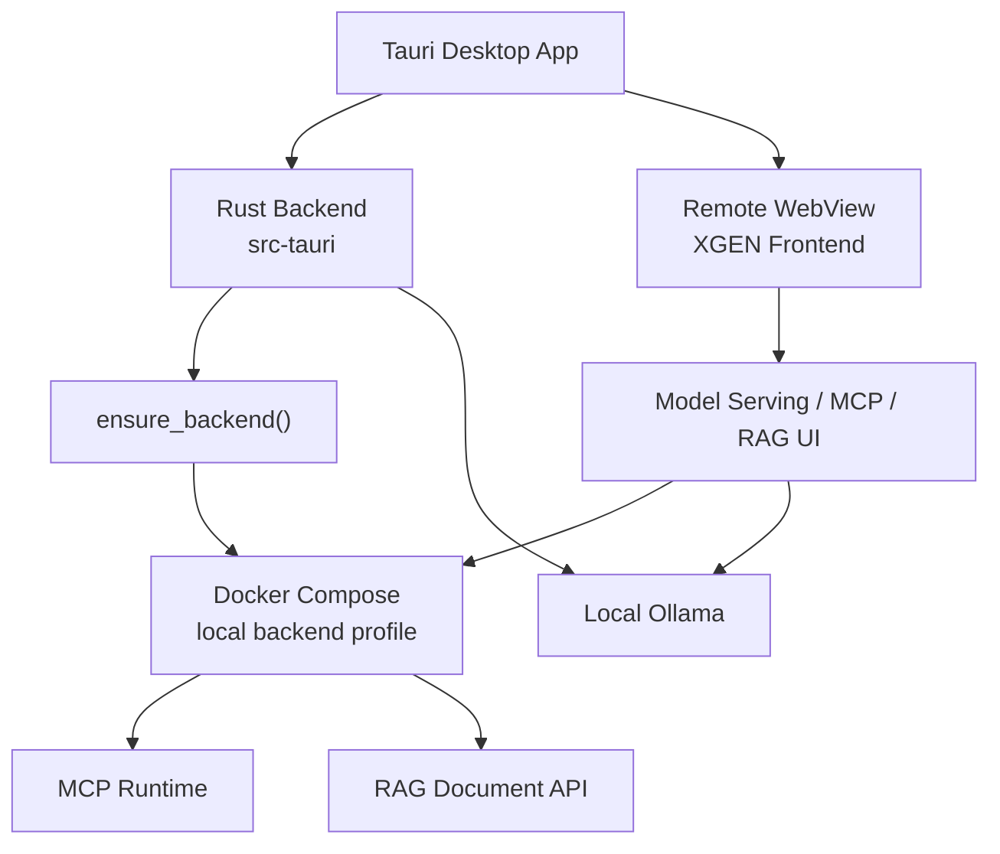
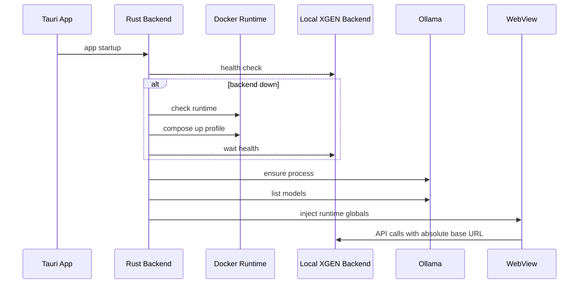
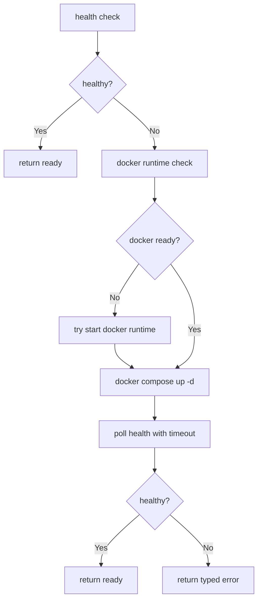
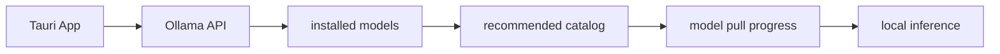
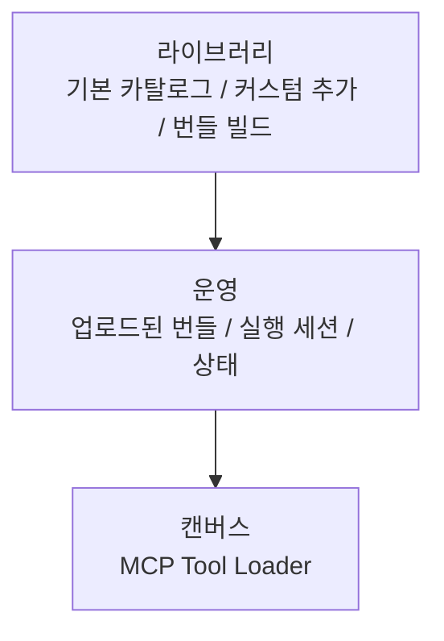
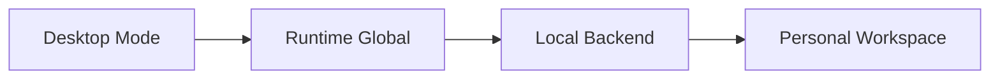
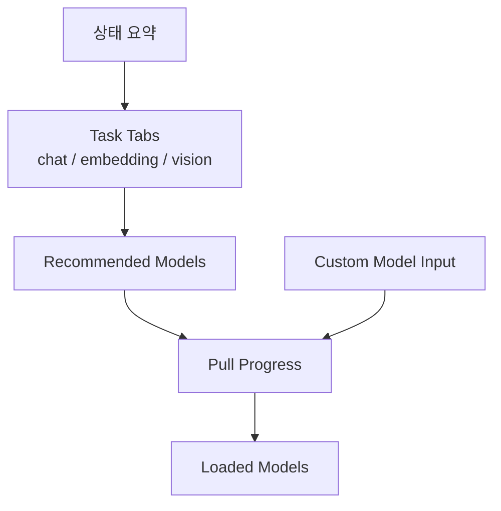
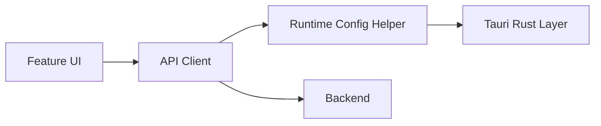

# XGEN 데스크톱 앱 고도화: Tauri에서 로컬 Ollama, 백엔드 자동기동, MCP/RAG를 한 번에 연결하기

## 데스크톱 앱은 웹을 감싸는 것으로 끝나지 않는다

[Tauri 2.0으로 AI 데스크톱 앱 만들기](./tauri-2-0-ai-desktop-app-build.md)에서는 XGEN 웹 프론트엔드를 데스크톱 앱으로 가져오는 기본 구조를 정리했다. Remote WebView, Rust sidecar, 로컬 LLM, 터널, API 추상화 같은 기반이 핵심이었다.

이번 작업은 그 다음 단계다. 목표는 단순한 "웹뷰 앱"이 아니라 **개인 에이전트 개발 앱**이었다. 사용자가 데스크톱 앱을 열면 다음 일이 자동으로 준비되어야 한다.

- 로그인 없이 개인 workspace에 진입한다.
- 로컬 Ollama가 없으면 기동하고, 필요한 모델 상태를 확인한다.
- XGEN 백엔드가 내려가 있으면 Docker Compose로 필요한 profile을 올린다.
- MCP 라이브러리에서 도구를 고르고 세션을 만든다.
- RAG 문서 업로드와 다운로드가 Tauri origin 문제 없이 동작한다.
- 모델 서빙 패널에서 설치된 모델, 추천 모델, 다운로드 진행률을 볼 수 있다.

웹에서는 "서버는 이미 떠 있다"가 자연스러운 가정이다. 데스크톱에서는 그렇지 않다. 앱은 사용자의 로컬 머신 위에서 실행되고, 백엔드와 모델 런타임도 로컬 상태의 영향을 받는다. 앱이 열리는 순간부터 backend readiness, model runtime, API base URL, MCP 세션까지 한 번에 조율해야 한다.

이 글은 2026년 6월 초에 진행한 XGEN 데스크톱 앱 고도화 작업을 정리한다. 관련 작업은 내부 MR 기준 `xgen-frontend!1010`, `xgen-frontend!1011`, `xgen-frontend!1012`, `xgen-frontend!1013`에 걸쳐 있었다. 본문에는 내부 서버 주소, 계정, token 값은 포함하지 않는다.

## 목표 아키텍처

기존 데스크톱 앱은 Tauri shell과 웹 프론트엔드의 결합이었다. 이번에는 로컬 runtime orchestration 계층이 추가됐다.



핵심은 앱이 backend와 runtime을 "외부 선행 조건"으로 두지 않는다는 점이다. 사용자가 앱을 열면 앱이 현재 상태를 확인하고, 필요한 서비스를 올리고, WebView에 runtime config를 주입한다.

## 부팅 시퀀스

부팅 시퀀스는 다음 순서로 잡았다.



이 순서에서 중요한 결정은 WebView를 너무 빨리 열지 않는 것이다. WebView가 먼저 뜨고 API가 실패하면 사용자는 깨진 화면을 본다. 반대로 backend readiness를 기다린 뒤 WebView에 진입하면 첫 화면부터 정상 상태가 된다.

물론 무한 대기는 금물이다. backend 자동 기동은 timeout을 가져야 하고, 실패하면 "어느 단계에서 실패했는지"를 표시해야 한다.

```text
checking_backend
checking_docker
starting_compose
waiting_health
checking_ollama
injecting_runtime
ready
```

상태 이름은 기술 로그가 아니라 사용자가 이해할 수 있는 단계여야 한다. `docker compose exited 1`보다 "로컬 백엔드 시작 실패"가 먼저 보여야 한다.

## ensure_backend: 앱이 백엔드를 깨우는 함수

`ensure_backend()`의 역할은 단순하다. 백엔드가 살아 있으면 아무것도 하지 않고, 죽어 있으면 필요한 compose profile을 올린다.



여기서 "이미 떠 있으면 건드리지 않는다"가 중요하다. 데스크톱 앱이 사용자의 로컬 개발 환경을 마음대로 재시작하면 신뢰를 잃는다. health check가 통과하면 compose를 건드리지 않는다.

에러도 typed error로 나눈다.

```rust
enum BackendEnsureError {
    DockerUnavailable,
    ComposeFailed,
    HealthTimeout,
    InvalidConfig,
}
```

이런 에러 타입이 있어야 UI에서 다음 행동을 안내할 수 있다. Docker가 없는 문제와 health timeout은 해결 방법이 다르다. 내부 command 전체를 UI에 보여주는 방식은 피한다. command에는 로컬 경로, 환경 변수, profile 이름이 섞일 수 있기 때문이다. 사용자 메시지는 분류된 원인 중심으로 만든다.

## Docker Compose profile을 최소화한다

데스크톱 앱이 백엔드를 자동으로 올린다고 해서 전체 개발 스택을 다 띄우면 안 된다. 사용자가 원하는 건 앱 기능이지, 로컬 머신에 무거운 클러스터를 올리는 것이 아니다.

그래서 compose profile을 나눴다.

| profile | 역할 |
|---------|------|
| core | 최소 API와 인증 흐름 |
| mcp | MCP station과 관련 worker |
| rag | 문서 업로드와 retrieval API |
| model | 로컬 모델 서빙 연동 |

앱은 필요한 profile만 올린다. MCP 화면만 쓰는 사용자가 전체 학습 스택을 올릴 이유는 없다. 이 방식은 startup latency와 리소스 사용량을 줄인다.

```bash
docker compose --profile mcp up -d
```

블로그에는 명령 예시만 남긴다. 실제 compose 경로, 내부 이미지 registry, 환경별 override 파일명은 민감하거나 환경 의존적인 정보이므로 본문에 넣지 않는다.

## Ollama 자동 기동과 모델 상태

이번 데스크톱 앱의 핵심 변화 중 하나는 로컬 Ollama 통합이다. 앱은 Ollama 서버가 떠 있는지 확인하고, 설치된 모델 목록과 추천 모델 카탈로그를 UI에 보여준다.



모델 서빙 패널은 다음 정보를 보여준다.

- Ollama 버전
- 설치된 모델 수
- 로드 가능한 모델 목록
- 추천 모델 카탈로그
- 모델 다운로드 진행률
- 대화/임베딩/비전 같은 task별 분류

이 UI에서 중요한 것은 "설치"와 "로드"를 구분하는 것이다. 모델 파일이 디스크에 있어도 현재 inference runtime에 올라와 있지는 않을 수 있다. 반대로 다운로드 중인 모델은 설치 완료 전까지 선택하면 안 된다.

상태 모델을 분리하면 UI가 단순해진다.

```typescript
type LocalModelStatus =
  | "not_installed"
  | "pulling"
  | "installed"
  | "loading"
  | "loaded"
  | "failed";
```

이런 상태가 없으면 버튼 텍스트가 상황마다 꼬인다. "받기", "다운로드 중", "설치됨", "로드됨", "재시도"가 같은 boolean 두세 개로 표현되기 시작하면 유지보수가 어려워진다.

## 추천 모델 카탈로그

데스크톱 앱에서는 사용자가 모델 이름을 직접 외울 필요가 없어야 한다. 그래서 추천 모델 카탈로그를 둔다.

```json
{
  "chat": [
    {
      "name": "small-chat-model",
      "label": "가벼운 대화 모델",
      "memoryHint": "low",
      "tags": ["chat", "general"]
    }
  ],
  "embedding": [
    {
      "name": "embedding-model",
      "label": "문서 검색용 임베딩 모델",
      "memoryHint": "low",
      "tags": ["embedding", "rag"]
    }
  ]
}
```

실제 모델명은 환경과 정책에 따라 바뀔 수 있다. 글에서는 특정 내부 카탈로그 값을 남기지 않고 구조만 설명한다. 제품 관점에서 중요한 것은 "카탈로그가 task 중심"이라는 점이다. 사용자는 모델 repository 이름보다 "대화", "임베딩", "비전" 같은 목적을 먼저 생각한다.

## RAG 문서 API 절대경로화

Tauri 앱에서 가장 흔하게 깨지는 부분이 상대 경로 API다. 웹에서는 `/api/documents/upload`가 현재 도메인의 백엔드로 간다. Tauri WebView에서는 현재 origin이 앱 origin이어서 같은 상대 경로가 백엔드로 가지 않는다.

이번 작업에서 RAG 문서 업로드/다운로드 계열 API가 이 문제를 만났다. 해결은 모든 API client가 공통 base URL 함수를 쓰도록 바꾸는 것이다.

```typescript
function apiUrl(path: string): string {
  const base = getBackendBaseUrl();
  const normalized = path.startsWith("/") ? path : `/${path}`;
  return `${base}${normalized}`;
}

export async function uploadDocument(file: File) {
  const form = new FormData();
  form.append("file", file);

  return fetch(apiUrl("/api/documents/upload"), {
    method: "POST",
    body: form,
  });
}
```

`getBackendBaseUrl()`은 웹에서는 빈 문자열을 반환하고, 데스크톱에서는 Tauri가 주입한 로컬 백엔드 URL을 반환한다. 이 분기를 호출부마다 복사하지 않는 것이 핵심이다.

고친 API는 RAG 문서 bulk, pre-scan, download, dictionary 연동처럼 여러 곳에 퍼져 있었다. 이런 문제는 한두 곳만 고치면 다시 터진다. API client boundary에서 해결해야 한다.

## MCP UX 재설계: 라이브러리와 운영을 분리한다

MCP 기능은 데스크톱 앱 고도화와 같이 움직였다. 사용자는 데스크톱 앱에서 로컬 백엔드를 자동 기동하고, MCP 라이브러리에서 도구를 추가하고, 필요하면 폐쇄망 번들을 업로드한다.

이 흐름을 하나의 "MCP 화면"에 다 넣으면 복잡하다. 그래서 라이브러리와 운영을 분리했다.



라이브러리는 "무엇을 설치할 수 있는가"를 보여준다. 운영은 "무엇이 실행 중인가"를 보여준다. 이 둘을 분리하면 사용자는 설치 가능한 항목과 현재 세션을 헷갈리지 않는다.

데스크톱 앱에서는 이 UX가 더 중요하다. 웹 운영자는 backend와 서비스 상태를 어느 정도 이해할 수 있지만, 데스크톱 사용자는 앱 하나만 보고 판단한다. "MCP 서버가 설치되어 있음"과 "MCP 세션이 실행 중임"은 다른 상태다.

## 런타임 글로벌 주입

Remote WebView 방식에서는 프론트엔드가 빌드 시점에 모든 환경을 알 수 없다. 같은 웹 bundle이 브라우저에서도 돌고 Tauri WebView에서도 돈다. 따라서 앱 부팅 시 런타임 글로벌을 주입한다.

```typescript
declare global {
  interface Window {
    __XGEN_DESKTOP__?: boolean;
    __XGEN_BACKEND_BASE_URL__?: string;
    __XGEN_AUTH_MODE__?: "desktop" | "web";
  }
}
```

이 값은 "기능 분기"보다 "환경 경계"를 알려주는 역할이다. 예를 들어 API client는 backend base URL을 여기서 읽고, UI는 desktop 전용 메뉴를 노출할 수 있다.

주의할 점은 이 글로벌에 민감정보를 넣지 않는 것이다. access token이나 password를 WebView global에 넣으면 개발자 도구와 페이지 스크립트에서 읽을 수 있다. 글로벌에는 boolean, base URL, mode 같은 비밀이 아닌 runtime metadata만 둔다.

## 인증: 로그인 없는 개인 모드

개인 에이전트 개발 앱에서는 매번 웹 로그인 흐름을 거치지 않는 모드가 필요했다. 데스크톱 앱이 로컬 백엔드를 올리고, 로컬 workspace에 들어가는 경우에는 웹 서비스와 같은 인증 UX가 오히려 방해가 된다.

다만 "로그인 없음"은 "권한 없음"이 아니다. 데스크톱 모드에서도 로컬 사용자와 workspace boundary는 있어야 한다. 서버는 desktop mode를 인지하고, 허용된 로컬 기능만 열어야 한다.



이 구조에서 중요한 것은 desktop mode를 환경에서 명시적으로 켜는 것이다. 웹 배포에서 실수로 desktop bypass가 열리면 안 된다. mode 판단은 빌드 상수가 아니라 런타임 설정과 백엔드 정책 양쪽에서 확인해야 한다.

## 모델 서빙 패널 UI 개선

모델 서빙 패널은 단순 목록에서 상태 중심 UI로 바뀌었다.

기존 UI는 "모델 목록"과 "로드 버튼"에 가까웠다. 사용자는 무엇이 설치되어 있고, 무엇이 다운로드 중이고, 현재 메모리 상태가 어떤지 알기 어려웠다.

개선 후에는 다음 구성이 들어갔다.

- 상단 상태 요약: runtime version, 설치 모델 수, 로드 모델 수
- 추천 모델 탭: 대화, 임베딩, 비전
- 직접 입력: 카탈로그에 없는 모델명 입력
- 다운로드 진행률: pull stream 기반 progress
- 설치됨 표시: 이미 있는 모델은 받기 버튼 대신 상태 표시
- 오류 상태: pull 실패와 runtime 실패 구분



UI에서 "추천 모델"과 "직접 입력"을 함께 둔 이유는 현실성 때문이다. 제품은 좋은 기본값을 제공해야 하지만, LLM 생태계는 빠르게 바뀐다. 사용자가 새로운 모델명을 직접 넣을 수 있어야 한다.

## 실패를 조용히 삼키지 않는다

데스크톱 앱은 실패 지점이 많다. Docker가 없을 수 있고, Ollama가 설치되어 있지 않을 수 있고, 모델 pull이 실패할 수 있고, backend health check가 timeout 날 수 있다.

처음에는 실패를 console log에 남기고 UI는 빈 상태로 두는 패턴이 섞여 있었다. 이러면 사용자는 "아무것도 안 된다"고 느낀다. 그래서 실패를 화면 상태로 끌어올렸다.

```typescript
type RuntimeReadiness =
  | { status: "checking" }
  | { status: "ready" }
  | { status: "needs_docker" }
  | { status: "backend_failed"; reason: string }
  | { status: "ollama_failed"; reason: string };
```

에러 메시지에는 내부 명령과 환경 변수 dump를 넣지 않는다. 사용자가 고칠 수 있는 정보만 보여준다.

| 상태 | 사용자에게 보여줄 것 | 숨길 것 |
|------|----------------------|---------|
| Docker 없음 | Docker 실행 필요 | 내부 compose 경로 |
| backend timeout | 로컬 백엔드 시작 실패 | 환경 변수 전체 |
| model pull 실패 | 모델 이름 확인 또는 재시도 | 인증 헤더, registry 상세 |
| RAG API 실패 | 백엔드 연결 상태 확인 | 내부 host |

이 기준은 보안뿐 아니라 UX에도 좋다. 사용자는 stack trace보다 다음 행동을 원한다.

## 웹과 데스크톱을 한 코드베이스로 유지하기

가장 어려운 점은 기능이 아니라 코드베이스 경계였다. 웹 프론트엔드와 데스크톱 WebView가 같은 package를 쓰므로, desktop 전용 분기가 feature 내부에 흩어지면 빠르게 망가진다.

이번 작업에서 정리한 원칙은 다음과 같다.

1. API base URL은 공통 client에서만 판단한다.
2. desktop mode 여부는 runtime global과 helper 함수로만 읽는다.
3. UI는 기능 단위로 분기하되, 데이터 fetching 로직은 공유한다.
4. secret 값은 WebView global에 넣지 않는다.
5. backend 자동기동은 Rust/Tauri 계층 책임이다.
6. 프론트엔드는 "backend가 준비됐는지" 상태만 본다.



이 구조가 있어야 웹 배포와 데스크톱 배포를 동시에 유지할 수 있다. desktop 전용 코드가 feature package마다 흩어지면 다음 리팩토링 때 반드시 누락된다.

## 검증

검증은 UI 클릭만으로 끝내지 않았다. 데스크톱 앱은 부팅 상태에 따라 결과가 달라지므로, 상태별 시나리오를 나눴다.

| 시나리오 | 기대 결과 |
|----------|-----------|
| 백엔드가 이미 떠 있음 | compose를 건드리지 않고 WebView 진입 |
| 백엔드가 내려가 있음 | compose profile 기동 후 health 통과 |
| Docker runtime이 꺼져 있음 | runtime 시작 시도 후 compose 진행 |
| Ollama가 떠 있음 | 모델 목록 로드 |
| Ollama가 내려가 있음 | 자동 기동 또는 명확한 실패 상태 |
| Tauri origin에서 RAG 업로드 | absolute API URL로 성공 |
| MCP 라이브러리 접근 | 기본 카탈로그와 커스텀 항목 표시 |
| 모델 pull | progress 표시와 설치됨 상태 반영 |

이 중 핵심은 "백엔드 stop 후 앱 실행"이다. 이 시나리오가 통과해야 진짜 데스크톱 앱이다. 사용자가 터미널에서 compose를 먼저 띄워야 한다면 아직 개발자용 wrapper에 가깝다.

## 보안 기준

데스크톱 앱은 로컬 머신에서 도는 만큼 느슨하게 생각하기 쉽다. 하지만 WebView, 로컬 backend, Docker, 모델 runtime, MCP server가 한 프로세스 경험으로 묶이면 오히려 경계를 더 분명히 해야 한다.

이번 작업에서 둔 기준은 다음과 같다.

- WebView global에는 secret 값을 넣지 않는다.
- backend base URL은 넣을 수 있지만 credential은 넣지 않는다.
- compose command와 env dump를 UI에 표시하지 않는다.
- 모델 pull 실패 로그에 인증 헤더를 남기지 않는다.
- MCP server 실행 환경 변수 값은 마스킹한다.
- desktop bypass는 웹 배포에서 절대 켜지지 않게 runtime mode로 제한한다.

이 기준은 글을 작성할 때도 그대로 적용했다. 내부 서버 주소, 계정명, token 값, 실제 credential은 본문에 남기지 않았다. 구조만 설명해도 설계 의도는 충분히 전달된다.

## 결과

이번 작업으로 XGEN 데스크톱 앱은 웹뷰 wrapper에서 개인 에이전트 개발 앱에 가까워졌다.

- Tauri 앱 시작 시 로컬 백엔드 health를 확인한다.
- 백엔드가 내려가 있으면 필요한 Docker Compose profile을 자동 기동한다.
- 로컬 Ollama와 설치 모델 상태를 UI에 연결한다.
- 모델 서빙 패널을 task 중심 카탈로그와 진행률 중심으로 개선했다.
- RAG 문서 API를 absolute URL 기반으로 고쳐 Tauri origin 문제를 해결했다.
- MCP 라이브러리/운영 UX를 데스크톱 앱 흐름에 맞게 재설계했다.
- 웹과 데스크톱이 같은 프론트엔드 코드를 쓰도록 runtime config helper를 정리했다.

데스크톱 앱의 본질은 "설치 가능한 웹"이 아니다. 사용자의 로컬 자원을 제품 경험 안으로 끌어오는 것이다. Ollama, Docker, MCP server, RAG 문서, local workspace가 모두 로컬 자원이다. 이 자원들을 사용자가 직접 터미널에서 관리하게 두면 앱은 반쪽짜리다.

이번 고도화의 의미는 그 관리 책임을 앱이 가져오기 시작했다는 데 있다. 앱을 열면 backend가 준비되고, 모델 상태가 보이고, MCP 도구를 붙이고, RAG 문서를 올릴 수 있다. 그 순간부터 데스크톱 앱은 웹의 포장이 아니라 로컬 AI 작업실이 된다.
