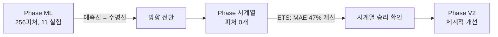

## 개요

사업자별 매출/매입 총공급가액을 월별로 예측하여 현금 유입/유출을 전망하는 프로젝트를 진행했다. 예측 대상은 2개 사업자(company_1, company_2)의 매출과 매입이고, 데이터는 48~54개월치 월별 시계열이다.

처음에는 256개 피처를 만들어 LightGBM/XGBoost/CatBoost로 예측했다. MAE 수치는 나쁘지 않았지만, 예측 그래프를 그려보면 그냥 수평선이었다. 48개월이라는 극소 표본에서 수백 개 피처를 넣은 ML은 결국 평균값으로 수렴한다는 교훈을 얻었다.

방향을 완전히 전환하여 **피처 0개 순수 시계열** 접근으로 바꿨고, AutoARIMA와 Chronos-Bolt가 ML 대비 47% 이상 개선된 성능을 보였다. 최종적으로 역MAE 가중 앙상블과 Rolling CV 체계를 구축하여 안정적인 예측 파이프라인을 완성했다.

이 글에서는 11번의 ML 실험(S1~S11)이 실패로 끝나는 과정, 시계열 전환의 결정적 순간, Rolling CV에서 발견한 고정 홀드아웃의 문제, data leakage 수정, 그리고 Chronos-Bolt Foundation Model의 가능성까지 전체 여정을 정리한다.

---

## 데이터와 예측 타깃

원천 데이터는 7개 parquet 파일로 구성된다.

| 데이터 | 내용 | 기간 |
|--------|------|------|
| revenue | 매출 총공급가액 | 48~54개월 |
| purchase | 매입 총공급가액 | 48~54개월 |
| acc_rec | 매출채권회수액 | 48개월 |
| acc_pay | 매입채무지급액 | 48개월 |
| ar_days | AR Bucket Transition Rate | 48개월 |
| ap_days | AP Bucket Transition Rate | 48개월 |
| coa | 계정과목별 지출 (급여/임차/세금 등) | 48개월 |

핵심 예측 타깃은 두 가지다.

- **매출_총공급가액**: 현금 유입의 선행지표
- **매입_총공급가액**: 현금 유출의 선행지표

사업자 2개(company_1, company_2)의 매출/매입을 각각 예측하므로, 총 4개 시계열을 다룬다. company_1은 월 매출 1~2억 규모의 안정적 시계열이고, company_2는 월 매출 10~30억 규모의 변동이 큰 시계열이다.

---

## Phase 1: ML 접근 — 256개 피처의 함정

### 피처 엔지니어링

전처리 파이프라인에서 12개 블록, 총 256개 피처를 생성했다.

```python
# preprocess.py — 피처 블록 구성
feature_blocks = {
    "calendar":     ["vat_month", "bonus_month", "business_days", ...],
    "lag":          ["lag_1", "lag_2", "lag_3", "lag_6", "lag_12"],
    "rolling":      ["roll_mean_3", "roll_mean_6", "roll_mean_12",
                     "roll_std_3", "roll_std_6", "roll_std_12"],
    "trend":        ["linear_trend", "volatility_6m"],
    "cancel_rate":  ["cancel_ratio", "vat_amount"],
    "sales_type":   ["cash_speed_weighted_embedding"],  # 매출유형별 현금화 속도 가중
    "ar_ap":        ["bucket_transition_rate_30d", "60d", "90d"],
    "coa":          ["inflow", "outflow", "variable", "salary", "rent", "tax"],
    "diversity":    ["hhi_index"],  # 거래처 집중도
    "macro":        ["interest_rate", "exchange_rate", "cpi"],  # ECOS/KOSIS
    "event_regime": ["covid_flag", "regime_label"],
    "interaction":  ["lag1_x_season", "trend_x_volatility", ...],
}
```

누출 방지를 위해 AR/AP, COA, 거래처, 매출유형, 스케줄유출 변수는 모두 lag-1 처리했다. 거시경제 변수만 당월값(known future)을 사용했다.

### 11번의 ML 실험

S1부터 S11까지 단계적으로 개선을 시도했다.

| Stage | 내용 | company_1 매출 MAE(억) |
|-------|------|----------------------:|
| S1 | 베이스라인 (ElasticNet/LightGBM/XGBoost) | 0.179 |
| S3 | 스케줄형 유출 변수 추가 | 0.173 |
| S4 | 거시경제 변수 (금리/환율/CPI) | 0.149 |
| S5 | Feature Selection (256 → 40개) | 0.149 유지 |
| S8 | Rolling CV + Top-3 Ensemble | 검증 체계 표준화 |
| S11 | log1p + Optuna + Stacking | 0.154 |

S4에서 CatBoost + 거시경제 변수 조합이 company_1 매출 MAE 0.149억으로 최저를 기록했다. 수치만 보면 나쁘지 않았다.

### 평균 예측기 함정

문제는 예측 그래프에서 드러났다. S11까지 모든 ML 모델의 예측값을 시각화하면, **예측선이 거의 수평선**이었다. 실제 시계열의 오르내림을 전혀 포착하지 못하고, 학습 기간의 평균값 근처를 맴돌았다.

48개월이라는 극소 표본에서 256개 피처를 넣으면 벌어지는 일이다.

- 학습 데이터: 36~42행 (검증용 6~12개월 제외)
- 피처 수: 40~256개
- 결과: 과적합은 막아도 변동을 학습할 데이터가 없음 → 평균으로 수렴

MAE가 낮아 보이는 이유는, 평균값 자체가 꽤 좋은 예측이기 때문이다. 하지만 실제 운영에서 "다음 달 매출은 평균입니다"라는 예측은 쓸모가 없다. 방향(올라갈지 내려갈지)을 맞춰야 의사결정에 활용할 수 있다.

---

## 전환점: 피처 0개 시계열이 ML을 이기다

ML의 한계를 확인한 후, 순수 시계열 모델을 시도했다. Seasonal Naive(SN), ETS, SARIMA, Prophet, Theta를 피처 없이 시계열 패턴만으로 돌렸다.

결과는 충격적이었다.

```
company_1 매출:
  256피처 CatBoost (S4):    MAE 0.149억
  피처 0개 ETS:             MAE 0.081억  ← 47% 개선
```

**피처가 하나도 없는 ETS가 256개 피처 ML을 47% 이겼다.** 시계열 자체의 계절성과 추세만으로도 ML의 평균 예측보다 훨씬 정확한 예측이 가능했다.



하이브리드 접근(시계열 + ML 잔차 보정)도 시도했으나, 48개월 잔차로는 ML이 학습할 패턴이 부족하여 순수 시계열보다 나빠졌다. 결론은 명확했다 — 이 규모의 데이터에서는 시계열이 정답이다.

---

## Phase V2: Rolling CV 기반 체계적 개선

### 고정 홀드아웃의 위험

Phase 1에서 ETS/SARIMA가 champion으로 선정됐는데, Rolling CV로 전환하자 결과가 뒤집어졌다.

고정 홀드아웃은 마지막 6개월만 검증하므로, 그 기간에 운 좋게 맞은 모델이 선정된다. Rolling CV는 18개월째부터 1개월씩 확장하며 36개 fold를 평가하므로, 다양한 시점에서의 안정성을 측정한다.

```python
# Rolling CV 프레임워크
def rolling_cv(series, model_fn, min_train=18, h=1):
    errors = []
    n = len(series)
    for train_end in range(min_train, n - h + 1):
        train = series[:train_end]
        actual = series[train_end:train_end + h]
        pred = model_fn(train, h)
        pred = clip_predictions(pred, train.values)  # 3x clipping
        errors.append(mean_absolute_error(actual, pred))
    return np.mean(errors)
```

SARIMA가 대표적인 사례다. 고정 홀드아웃에서는 champion이었지만, Rolling CV에서는 특정 fold에서 수천억 규모로 발산했다. 3x clipping(학습 기간 최대값의 3배로 제한)을 도입하여 발산을 방지했지만, 그래도 불안정했다.

### Step 2: StatsForecast 자동탐색

Nixtla의 StatsForecast 라이브러리로 AutoARIMA, AutoETS, AutoTheta 등을 자동 탐색했다.

```python
from statsforecast import StatsForecast
from statsforecast.models import (
    AutoARIMA, AutoETS, AutoTheta,
    SeasonalNaive, ADIDA, IMAPA
)

sf = StatsForecast(
    models=[AutoARIMA(season_length=12),
            AutoETS(season_length=12),
            AutoTheta(season_length=12),
            SeasonalNaive(season_length=12)],
    freq="MS"
)
```

결과적으로 company_1에서는 AutoARIMA가, company_2에서는 Seasonal Naive가 가장 안정적이었다. 사업자마다 시계열 특성이 달라서 단일 champion 모델은 존재하지 않았다.

### Step 4: Chronos-Bolt Foundation Model

Amazon의 Chronos-Bolt(사전학습 시계열 Foundation Model)를 zero-shot으로 적용했다.

```python
from chronos import BaseChronosPipeline
import torch

pipeline = BaseChronosPipeline.from_pretrained(
    "amazon/chronos-bolt-small",
    device_map="cpu"
)

context = torch.tensor(train_values, dtype=torch.float32).unsqueeze(0)
forecast = pipeline.predict(context, prediction_length=h)
point_pred = forecast.median(dim=1).values[0].numpy()
```

Chronos-Bolt는 특히 company_2 매입에서 Seasonal Naive를 22% 이기며 최초로 SN을 돌파했다. 도메인 특화 학습 없이 zero-shot만으로 기존 통계 모델을 넘은 것이다.

### Step 6: 역MAE 가중 앙상블

개별 모델의 강점이 시계열마다 다르므로, 최근 성능 기반으로 가중치를 동적 조절하는 역MAE 앙상블을 구축했다.

```python
def ensemble_inverse_mae(preds: dict, recent_maes: dict) -> float:
    """최근 MAE의 역수로 가중치를 계산하여 앙상블"""
    inv_maes = {k: 1.0 / max(v, 1e-10) for k, v in recent_maes.items()}
    total = sum(inv_maes.values())
    weights = {k: v / total for k, v in inv_maes.items()}
    return sum(w * preds[k] for k, w in weights.items())
```

앙상블 구성 모델은 AutoARIMA, Seasonal Naive, Chronos-Bolt 3개다. 최근 6 fold의 MAE 역수로 가중치를 매 fold마다 갱신한다. 최근에 잘 맞춘 모델에 더 높은 가중치를 부여하는 방식이다.

---

## 트러블슈팅: Data Leakage 발견

V2+ 실험에서 앙상블 성능이 비정상적으로 좋게 나왔다. company_2 매출 MAE가 2.633억으로, 개별 모델(SN 3.263억)보다 지나치게 높은 개선폭을 보였다.

원인은 **역MAE 가중치 계산에 현재 fold의 actual이 포함**된 것이었다.

```python
# 수정 전 (leakage 있음)
for fold_idx, (train_end, actual) in enumerate(folds):
    preds = {name: model.forecast(h) for name, model in models}
    # 현재 fold의 MAE로 가중치 계산 → leakage!
    maes = {name: mae(actual, pred) for name, pred in preds.items()}
    ensemble = ensemble_inverse_mae(preds, maes)

# 수정 후 (leakage 제거)
mae_history: dict[str, list[float]] = {name: [] for name in models}
for fold_idx, (train_end, actual) in enumerate(folds):
    preds = {name: model.forecast(h) for name, model in models}
    # 과거 fold의 MAE만으로 가중치 계산
    recent = {k: np.mean(v[-6:]) for k, v in mae_history.items() if v}
    ensemble = ensemble_inverse_mae(preds, recent)
    # 가중치 계산 이후에 MAE 기록 업데이트
    for name, pred in preds.items():
        mae_history[name].append(mae(actual[:1], pred[:1]))
```

수정 전후 성능 차이:

| 케이스 | leakage MAE(억) | 수정 후 MAE(억) | 차이 |
|--------|----------------:|----------------:|-----:|
| company_2 매출 | 2.633 | 2.962 | +12% |
| company_2 매입 | 1.560 | 2.073 | +33% |

leakage가 있으면 "미래 정보로 현재를 예측"하는 셈이므로 성능이 부풀려진다. 수정 후에도 앙상블이 개별 모델보다 나은 성능을 보여서, 앙상블 자체의 효과는 확인했다.

---

## 최종 결과

### Champion 모델 (Rolling CV, h=1, 36 fold)

| 사업자 | 타깃 | Champion | MAE(억) | vs SN | 방향일치율 |
|--------|------|----------|--------:|------:|----------:|
| company_1 | 매출 | AutoARIMA | 0.190 | +38% | 46% |
| company_1 | 매입 | Chronos-Bolt | 0.391 | +38% | 43% |
| company_2 | 매출 | Ensemble(역MAE) | 2.962 | +10% | 66% |
| company_2 | 매입 | Ensemble(역MAE) | 2.073 | +27% | 63% |

company_1은 규모가 작고 안정적이라 단일 모델이 유리하고, company_2는 변동이 커서 앙상블이 효과적이었다. 모든 케이스에서 SN(Seasonal Naive) 대비 10~38% 개선을 달성했다.

### 구간 예측 (Chronos quantile)

점예측뿐 아니라 95% 신뢰구간도 생성했다. V2+에서 Chronos의 quantile 예측을 활용하여 기존 StatsForecast의 Conformal Prediction 대비 구간 폭을 대폭 줄였다.

| 사업자 | 타깃 | 95% 구간 폭(억) | Coverage | StatsForecast 대비 |
|--------|------|----------------:|----------:|------------------:|
| company_1 | 매출 | 0.81 | 89% | -43% |
| company_1 | 매입 | 0.96 | 83% | -72% |
| company_2 | 매출 | 12.58 | 86% | -33% |
| company_2 | 매입 | 9.98 | 86% | -52% |

구간 폭이 33~72% 줄어들면서도 coverage는 83~89%를 유지했다. 의사결정자 입장에서 "다음 달 매입이 5억~15억 사이"보다 "7억~12억 사이"가 훨씬 유용하다.

### 예측 수평선 안정성 (h=1 → h=6)

| 케이스 | h=1 MAE | h=6 MAE | 열화율 |
|--------|--------:|--------:|-------:|
| company_1 매출 (AutoARIMA) | 0.190 | 0.198 | +4% |
| company_1 매입 (Chronos) | 0.391 | 0.391 | 0% |
| company_2 매출 (Ensemble) | 2.962 | 2.935 | -1% |
| company_2 매입 (Ensemble) | 2.073 | 2.065 | 0% |

6개월 앞까지 예측해도 성능 열화가 거의 없었다. 월별 시계열의 계절 패턴이 강하기 때문에, 먼 미래도 계절성 기반으로 안정적 예측이 가능한 것이다.

---

## 실험 진화 전체 흐름

```mermaid
flowchart LR
    S1["S1-S4<br/>ML 베이스라인<br/>256피처"] --> S5["S5-S11<br/>Feature Selection<br/>Optuna, Stacking"]
    S5 -->|"예측선 = 수평선"| P1["P1<br/>순수 시계열<br/>ETS: MAE 47% 개선"]
    P1 --> P2["P2<br/>하이브리드<br/>시계열+ML 잔차"]
    P2 -->|"순수 시계열 > 하이브리드"| V1["V2 Step1<br/>Rolling CV 도입"]
    V1 --> V2["Step2<br/>StatsForecast<br/>AutoARIMA champion"]
    V2 --> V3["Step3<br/>구간 예측<br/>Conformal"]
    V3 --> V4["Step4<br/>Chronos-Bolt<br/>SN 최초 돌파"]
    V4 --> V5["Step5<br/>계층 Reconciliation<br/>효과 없음"]
    V5 --> V6["Step6<br/>역MAE 앙상블"]
    V6 --> VP["V2+<br/>Leakage 수정<br/>Chronos quantile"]
```



---

## 회고: 세 가지 교훈

### 1. 표본이 적으면 ML은 평균 예측기다

48개월(= 48행)으로 256개 피처를 학습하는 건 무리다. 정규화가 아무리 강해도, 모델이 학습할 수 있는 건 평균 근처의 안전한 값뿐이다. MAE가 낮아 보여도 예측 그래프를 반드시 확인해야 한다. 수평선이면 평균 예측기일 뿐이다.

**원칙**: 행 수가 피처 수의 10배 미만이면 ML보다 시계열을 먼저 시도하라.

### 2. 고정 홀드아웃은 모델 선택을 틀리게 한다

마지막 6개월이 우연히 쉬운 구간이었다면, 발산하는 모델이 champion으로 뽑힌다. SARIMA가 정확히 이 사례였다. Rolling CV는 시간이 더 걸리지만, 36개 시점에서의 평균 성능이므로 운에 덜 좌우된다.

**원칙**: 시계열 검증은 반드시 expanding window Rolling CV를 사용하라.

### 3. Foundation Model은 zero-shot으로도 쓸 만하다

Chronos-Bolt는 도메인 데이터로 학습하지 않았음에도 company_2 매입에서 SN을 22% 이겼다. 사전학습된 시계열 패턴 인식 능력이 48개월 수준의 소규모 데이터에서 특히 효과적이다. 소규모 시계열이라면 fine-tuning 없이 zero-shot부터 시도할 가치가 있다.

### 그럼에도 남은 한계

company_1 매출의 방향일치율이 46%다. 동전 던지기 수준이라는 뜻이다. R^2도 -0.077로 음수다. 이 사업자의 매출은 시계열 패턴으로 설명되지 않는 외부 요인(대형 계약 수주 등)에 좌우되는 것으로 보인다.

"더 좋은 모델"보다 "더 많은 데이터"가 필요한 영역이다. 거래처 정산 스케줄, 수주 파이프라인 같은 구조적 정보가 있으면 매입 급등을 사전에 포착할 수 있을 것이다. 모델을 갈아끼우는 것보다 데이터 소싱이 다음 단계의 핵심이다.
