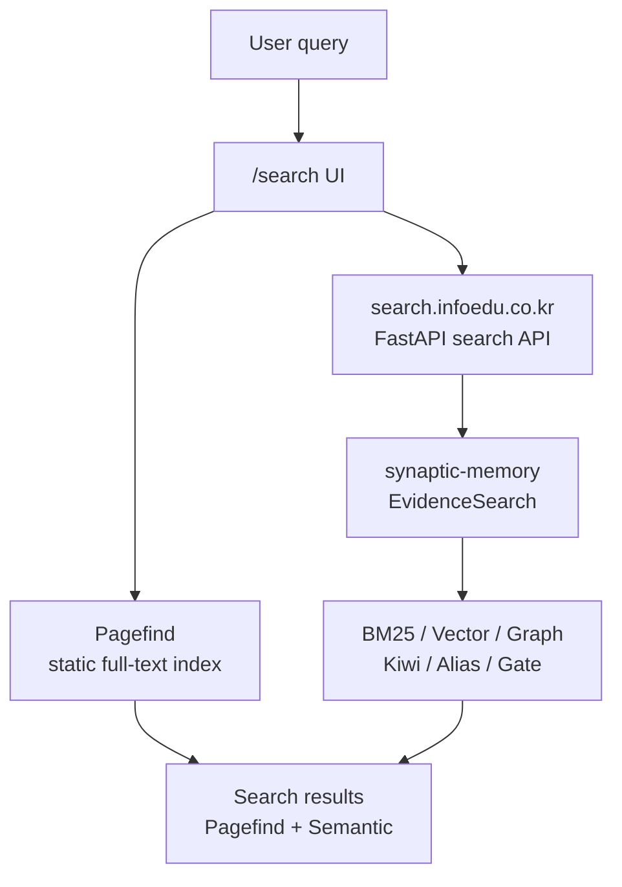
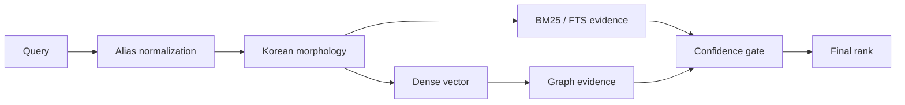
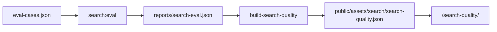
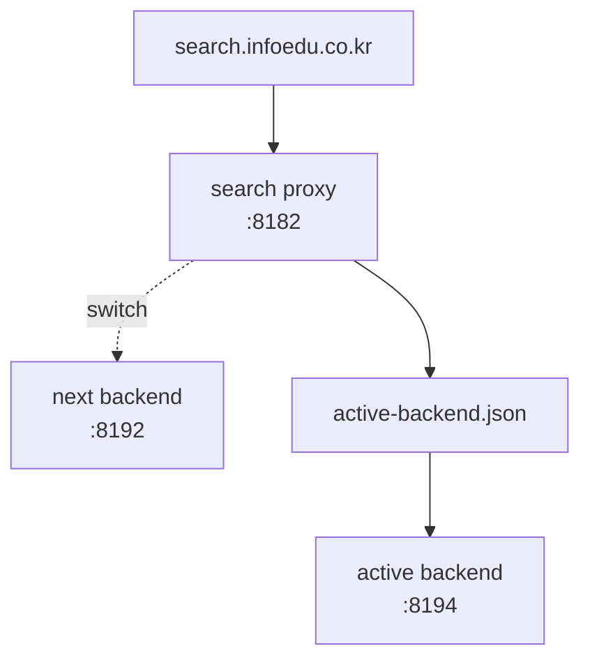
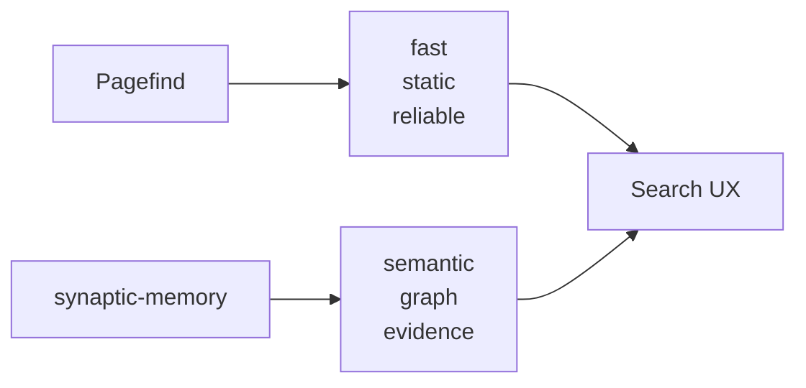

## 검색창은 작은 포트폴리오다

블로그 검색은 보통 부가기능처럼 보인다. 글 목록이 있고, 태그가 있고, 검색창 하나가 있으면 충분해 보인다.

그런데 내 블로그에서는 검색창이 조금 다르다. 나는 커머스 검색, 벡터 검색, RAG, graph-tool-call, synaptic-memory 같은 검색/지식검색 계열 작업을 계속 해왔다. 그렇다면 블로그 검색도 그냥 "검색 됩니다" 수준이면 안 된다. 블로그 자체가 내가 검색엔진을 어떻게 생각하는지 보여주는 작은 제품이어야 한다.

처음 SON BLOG를 Astro로 옮겼을 때는 Pagefind가 기본 검색이었다. 정적 사이트에 잘 맞고, GitHub Pages에서도 별도 서버 없이 동작한다. 하지만 글이 280개를 넘어가고, 주제가 XGEN, MCP, graph-tool-call, Qdrant, Kubernetes, 자동매매, Mermaid까지 흩어지기 시작하자 단순 전문 검색만으로는 부족해졌다.

사용자는 꼭 제목을 정확히 기억하지 않는다.

- "그때 그래프 검색 붙였던 글"
- "대학원 관련 MCP"
- "Qdrant 워크플로우 하이브리드"
- "graph tool call"
- "Deep learning"

이런 식으로 검색한다. 띄어쓰기, 영문/한글 혼합, 약어, 프로젝트명 변형이 계속 섞인다.

그래서 검색 구조를 둘로 나눴다.

Pagefind는 빠르고 안정적인 정적 전문 검색을 맡고, synaptic-memory 기반 검색 서비스는 의미 검색과 그래프 기반 추천을 맡는다.

## 작업 이력부터 보면

이 작업은 하루 만에 끝난 기능 추가가 아니었다. 실제로는 검색을 쓰면서 계속 이상한 점을 발견하고, 고치고, 평가셋으로 고정해간 과정이었다.

| 날짜 | 변화 |
| --- | --- |
| 2026-06-14 | AstroPaper 기반 마이그레이션, Pagefind 검색 도입 |
| 2026-06-14 | 본문 전문 검색 인덱스, BM25, snippet, highlight 추가 |
| 2026-06-14 | WebGPU semantic search와 graph 검색 실험 |
| 2026-06-14 | synaptic-memory 기반 전체 본문 chunk 색인으로 전환 |
| 2026-06-16 | 모바일 검색 UI, empty semantic panel, breadcrumb/title 제거 |
| 2026-06-16 | 검색 평가 harness 추가 |
| 2026-06-21 | 한국어 형태소 분석, alias, AND/OR/EQURL 연산자, confidence gate 반영 |
| 2026-06-21 | Pagefind 결과를 semantic confidence로 gate |
| 2026-06-22 | blue/green 검색 서비스 배포 |
| 2026-06-22 | ranking signal, explain mode, search quality dashboard 추가 |

이 흐름에서 제일 중요한 변화는 "검색 알고리즘을 붙였다"가 아니었다.

검색 품질을 감으로 보지 않기 위해 문제지와 채점기를 만들고, 검색 API를 운영 서비스처럼 배포하고, UI에서 결과의 근거를 조금씩 보여주기 시작했다는 점이다.

## 전체 구조

현재 구조는 이렇게 잡았다.



Pagefind는 `pnpm run build` 과정에서 생성된다.

```bash
pagefind --site dist --glob 'posts/**/*.html'
```

검색 서비스는 별도로 홈서버에서 뜬다. 정적 사이트가 GitHub Pages에 있어도 의미 검색은 서버가 필요하기 때문이다.

중요한 원칙은 하나다.

> semantic search가 죽어도 검색 페이지는 죽으면 안 된다.

Pagefind는 기본 검색이다. synaptic-memory는 의미 기반 보강이다. 둘의 역할이 다르다.

## Pagefind가 맡는 일

Pagefind는 정적 블로그에 잘 맞는다.

- 빌드 산출물 기준으로 인덱스가 고정된다.
- GitHub Pages에서도 동작한다.
- 서버 장애와 무관하다.
- 제목/본문/태그에 정확히 들어간 단어를 빠르게 찾는다.
- snippet과 highlight를 만들기 쉽다.

그래서 사용자가 검색어를 입력하면 Pagefind는 즉시 반응해야 한다. 검색창에 입력했는데 첫 화면이 비어 있으면, 뒤에서 아무리 좋은 의미 검색이 돌아도 사용자는 느리다고 느낀다.

이 블로그 검색에서 Pagefind는 "항상 살아 있는 기본값"이다.

## synaptic-memory가 맡는 일

반면 synaptic-memory 쪽은 문서를 더 큰 맥락으로 본다.

검색 서비스는 빌드 산출물의 `search-fulltext.json`을 읽고, 글을 chunk 단위로 구성한다. 그 위에 synaptic-memory의 EvidenceSearch를 얹는다.

검색 신호는 하나가 아니다.

- BM25/FTS 기반 lexical evidence
- bge-m3 dense vector
- graph traversal 기반 PPR evidence
- 한국어 형태소 분석
- alias normalization
- confidence gate
- URL 정확 필터

처음에는 "semantic score가 높으면 좋은 것 아닌가"라고 생각하기 쉽다. 하지만 실제 블로그 검색에서는 그렇지 않았다.

예를 들어 `Deep learning`을 검색했는데 본문 어딘가에 `learning`이 들어간 검색엔진 글이 더 위로 올라오면 안 된다. `대학원`처럼 한국어 단어 하나가 너무 넓게 걸려도 안 된다. `D2`처럼 짧은 토큰은 본문 어딘가에 한 번 등장했다고 강한 근거로 보면 안 된다.

그래서 raw semantic score만 믿지 않고, 제목/태그/본문의 lexical evidence를 같이 본다.



이 방식은 단순히 "벡터 검색을 붙였다"와 다르다. 검색어가 어떤 경로로 보정됐고, 어떤 근거가 결과를 살렸는지 추적할 수 있어야 한다.

## 왜 결과를 하나로 섞지 않았나

처음에는 Pagefind 결과와 semantic 결과를 하나의 ranking으로 합치는 방식도 가능해 보였다.

하지만 실제로는 분리해서 보여주는 쪽이 더 낫다.

이유는 점수의 의미가 다르기 때문이다.

- Pagefind score는 정적 전문 검색 기준이다.
- semantic score는 embedding, graph, chunk, lexical evidence가 섞인 점수다.
- 둘을 같은 숫자처럼 합치면 ranking 설명이 어려워진다.

그래서 UI에서는 역할을 나눴다.

Pagefind 결과는 기본 검색 결과로 보여주고, semantic 결과는 "시맨틱 추천" 섹션으로 둔다. 대신 semantic API가 정상 응답하면 Pagefind 결과에도 confidence gate를 적용한다.

예를 들어 semantic API가 "이 질의는 결과가 없다"고 판단했는데 Pagefind가 약한 단어 매칭으로 엉뚱한 글을 보여주면, 사용자는 검색 품질이 나쁘다고 느낀다. 그래서 semantic API가 살아 있을 때는 Pagefind 결과 중 confidence가 맞는 URL만 살린다. 반대로 semantic API가 장애면 Pagefind fallback을 그대로 둔다.

이게 하이브리드 검색에서 중요했다.

> fallback은 필요하지만, fallback이 품질을 망치면 안 된다.

## 검색 UI에서 배운 것

검색 알고리즘을 붙인 뒤에는 UI 문제가 바로 드러났다.

처음 semantic 추천 박스는 검색 결과보다 위에서 공간을 너무 많이 차지했다. 데스크톱에서는 그럭저럭 괜찮아도, 모바일에서는 검색 input과 결과 사이를 밀어냈다. 사용자는 검색을 했는데 정작 Pagefind 결과를 보려면 스크롤해야 했다.

그래서 UI 원칙을 다시 잡았다.

- quick search 박스는 제거한다.
- "Search any article ..." 같은 설명문도 제거한다.
- 검색 페이지 title과 breadcrumb도 줄인다.
- semantic panel은 비어 있으면 숨긴다.
- 검색 input과 semantic panel 사이에는 모바일 여백을 둔다.
- 결과에는 index를 보여줘 빠르게 구분하게 한다.
- ranking signal은 작게 보여주되 본문을 방해하지 않는다.

검색 페이지의 주인공은 검색창과 결과다. 추천 박스와 설명문은 도움이 될 때만 있어야 한다.

## raw query는 보내지 않는다

검색 품질을 개선하려면 telemetry가 필요하다. 하지만 검색어는 민감할 수 있다.

블로그 검색이라고 해도 사용자가 회사명, 사람 이름, 내부 프로젝트명, 개인적인 문장을 입력할 수 있다. 그래서 raw query는 외부 analytics로 보내지 않는다.

대신 아래 정도만 보낸다.

```text
query_hash
query_length
result_count
latency_ms
search_source
```

이 정도면 개인 검색어를 저장하지 않아도 구조적인 문제는 볼 수 있다.

- 짧은 질의에서 0건이 많이 나오는가
- 결과 수가 특정 배포 이후 줄었는가
- semantic API latency가 튀는가
- 클릭이 Pagefind에 몰리는가, semantic에 몰리는가

검색 품질을 위해 raw query를 모으는 길은 쉽다. 하지만 블로그 검색에서는 그 유혹을 참는 편이 맞다.

## 평가셋을 만든 이유

검색 고도화에서 가장 위험한 말은 "이제 좋아진 것 같은데"다.

검색은 몇 개 질의를 직접 쳐보면 좋아진 것처럼 보인다. 하지만 다른 질의가 망가졌을 수 있다. 그래서 `search-service/eval-cases.json`에 문제지를 만들고, `scripts/evaluate-search.mjs`로 운영 API를 실제로 때려서 평가한다.

평가 기준은 단순히 정답이 있느냐가 아니다.

- top1: 첫 결과가 정답인가
- recall@5: 상위 5개 안에 정답이 있는가
- MRR@5: 정답이 얼마나 빨리 나오는가
- negative: 무관 질의에서 결과를 과신하지 않는가
- sorted: 점수 내림차순이 깨지지 않는가
- latency: 응답 시간이 예산 안에 있는가
- stage coverage: alias, morphology, lexical fallback, gate가 실제로 쓰였는가

현재 운영 API 기준으로 다시 돌린 결과는 이렇다.

```text
cases: 20
pass: 20
positive top1: 100%
positive recall@5: 100%
positive MRR@5: 1.000
negative pass: 100%
sorted score pass: 100%
avg latency: 237ms
p95 latency: 280ms
```

평가를 한 번 돌렸을 때 latency가 튄 케이스도 있었다. 흥미로운 점은 그때도 정답은 모두 1위였고, 실패 원인은 전부 `latency_over_budget`이었다는 것이다. 이건 오히려 평가셋이 왜 필요한지 보여준다.

검색 품질은 정확도만이 아니다. 사용자가 기다리는 시간도 품질이다.

## 검색 품질 대시보드

평가 결과는 리포트로만 남기면 잘 안 보게 된다. 그래서 `/search-quality/` 페이지에서 공개 대시보드 형태로 볼 수 있게 했다.

빌드 흐름은 이렇다.



대시보드에는 top1, recall, MRR, latency, stage coverage, 실패 케이스가 들어간다. 검색 품질을 감으로 기억하지 않고 숫자로 남기는 장치다.

이 작은 대시보드는 생각보다 중요했다. "검색이 좋다"는 말을 하려면 검색 결과가 좋아야 하고, "계속 좋다"는 말을 하려면 이력이 있어야 한다.

## 검색 서비스도 배포 대상이다

정적 블로그는 GitHub Pages에 올리면 끝난다. 하지만 synaptic-memory 검색은 서버가 있다. 서버가 있으면 배포 문제가 생긴다.

처음에는 검색 서비스를 재시작하면 잠깐 비는 정도로 생각할 수 있다. 하지만 검색을 포트폴리오 표면으로 본다면, 재색인 중에 검색이 죽는 것도 품질 문제다.

그래서 검색 API는 blue/green 방식으로 바꿨다.



배포 스크립트는 비활성 backend를 먼저 띄우고, `/health`와 smoke search가 성공하면 active backend 파일을 원자적으로 바꾼다. proxy는 요청마다 active backend 정보를 읽기 때문에, 준비된 뒤에 트래픽을 넘길 수 있다.

검색 서비스의 startup도 줄였다. 예전에는 synaptic graph를 만들 때 매번 전체 노드를 다시 embedding하는 비용이 컸다. 지금은 manifest에 corpus fingerprint를 남기고, 현재 `search-fulltext.json`과 chunk 설정, embedding 설정이 맞으면 graph DB를 재사용한다.

운영 health 기준으로는 이런 상태가 나온다.

```text
morphology: kiwipiepy
aliases: 10
docs: 278
graphCache: hit
startupMs: 1668ms
warmupStatus: done
```

또 하나 중요한 최적화가 있었다. 문서 전체를 startup 시점에 Kiwi로 미리 형태소 분석하면 startup이 느려졌다. 그래서 문서 lookup은 regex/substring evidence 중심으로 준비하고, Kiwi는 query 분석에만 쓴다. 검색 품질은 유지하면서 startup hot path를 줄이는 쪽이다.

## 이 구조에서 Pagefind와 synaptic-memory는 경쟁하지 않는다

Pagefind와 synaptic-memory를 비교해서 하나를 고르는 문제가 아니었다.

Pagefind는 빠르고 단단한 기본 검색이다. synaptic-memory는 의미와 그래프 맥락을 보강한다. Pagefind가 없으면 semantic API 장애 때 검색 페이지가 약해진다. synaptic-memory가 없으면 정확히 기억하지 못한 질의, 한글/영문 혼합 질의, 연관 글 탐색이 약해진다.

둘을 같은 ranking으로 무리하게 섞기보다, 각자의 역할을 인정하는 편이 낫다.



하이브리드 검색은 알고리즘 이름이 아니라 운영 방식이다.

정적 인덱스, 의미 검색, 한국어 분석, alias, confidence gate, privacy telemetry, 평가셋, 대시보드, blue/green 배포까지 같이 있어야 사용자가 "검색이 괜찮다"고 느낀다.

## 다음에 더 하고 싶은 것

아직 끝난 건 아니다.

지금 남은 작업은 세 가지다.

첫째, 실패 케이스에서 alias 후보를 자동으로 뽑고 싶다. 지금은 사람이 eval backlog를 보고 alias 사전을 보강한다. 이걸 반자동으로 만들면 검색 품질 개선 루프가 더 빨라진다.

둘째, semantic result snippet을 더 잘 보여주고 싶다. 지금은 ranking signal과 explain mode가 있지만, 사용자는 결국 "왜 이 글이지?"를 한 문장으로 보고 싶어 한다.

셋째, Pagefind, semantic API, graph search를 같은 runner에서 비교하고 싶다. 지금은 블로그 검색 페이지와 graph 페이지가 연결되어 있지만, 평가 레이어는 더 통합할 수 있다.

검색은 한 번 붙이면 끝나는 기능이 아니다. 글이 늘어나고, 표현이 바뀌고, 사용자가 이상한 질의를 넣을수록 계속 다시 보게 된다.

그래서 이 블로그의 검색창은 계속 작업 중이다. 그리고 그게 마음에 든다. 검색엔진을 한다는 건 결국, "못 찾겠다"는 말을 줄여가는 일이니까.
