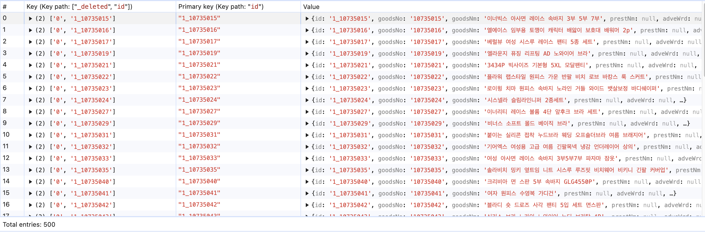

# RxDB 란 무엇인가? (opensearch 연동)

## RxDB가 Frontend에 적합한 이유

RxDB(Reactive Database)는 NoSQL 데이터베이스로, UI 중심의 실시간 상태 변경 감지가 중요한 Frontend 애플리케이션에 최적화된 데이터베이스입니다.

## 기존 SQL이 Frontend에 적합하지 않은 이유

### 1. 초기 빌드 크기와 시작 시간
- SQL 데이터베이스는 초기 빌드 크기가 크며, 애플리케이션 시작 시간이 길어질 수 있습니다.
- Frontend 환경에서는 빠른 로드와 초기화가 중요한데, SQL은 이에 적합하지 않습니다.

### 2. 데이터 모델의 복잡성
- SQL은 스키마 기반의 데이터 모델을 사용하여 변경 시 유연성이 떨어집니다.
- 테이블 간의 관계를 설정하고 관리해야 하기 때문에 UI와의 데이터 매핑이 복잡해질 수 있습니다.

## RxDB란?
RxDB는 Reactive한 NoSQL 데이터베이스로, 데이터의 현재 상태를 질의할 수 있을 뿐만 아니라 상태 변화에 대해 실시간으로 감지(subscribe)할 수 있습니다. 이를 통해 실시간 UI 업데이트가 필요한 Frontend 애플리케이션에 적합한 선택이 됩니다.

## RxDB가 Frontend에 적합한 이유

### 1. JavaScript 기반으로 최적화
- RxDB는 JavaScript로 구현되어 JavaScript 애플리케이션 환경에서 최적화된 성능을 제공합니다.

### 2. JSON 기반 NoSQL 접근 방식
- RxDB는 데이터를 JSON 문서 형태로 관리합니다.
- JavaScript가 JSON 객체와 기본적으로 호환되므로, 데이터 처리와 직관적인 매핑이 용이합니다.

### 3. Reactive Programming 지원
- 데이터 변경을 RxJS를 통해 실시간으로 구독할 수 있습니다.
- 상태 변화에 즉각적으로 반응하는 UI 중심 애플리케이션에서 큰 강점을 가집니다.

### 4. 자연스럽고 직관적인 데이터 모델
- NoSQL 문서 기반의 데이터 모델은 UI 중심 애플리케이션에 직관적이며, 추가적인 데이터 매핑 작업이 줄어듭니다.

### 5. 오프라인-우선 전략
- RxDB는 로컬 데이터 저장소를 활용하여 오프라인 환경에서도 데이터 저장 및 작업이 가능합니다.
- 온라인 상태로 전환되면 서버와 자동 동기화를 지원합니다.

## RxDB 활용 예시

### 1. 할 일 관리 애플리케이션 (Todo Application)
- RxDB를 사용하여 사용자의 할 일 목록을 관리합니다.
- 실시간 데이터 반영을 통해 추가, 수정, 삭제된 작업이 즉시 UI에 표시됩니다.
- 사용자 경험(UX)을 크게 향상시킵니다.

### 2. 채팅 애플리케이션
- 실시간 메시지 전송과 기록 관리를 위해 사용됩니다.
- 새로운 메시지를 저장하고 즉시 사용자에게 표시합니다.
- 오프라인 저장소를 통해 인터넷 연결이 없을 때도 대화 내용을 확인할 수 있습니다.

### 3. 게시판 애플리케이션
- 사용자가 게시글을 작성, 수정, 삭제할 수 있는 애플리케이션에서 활용됩니다.
- 게시글 변경 사항을 실시간으로 동기화하고 다른 사용자에게 반영합니다.

### 4. 협업 도구
- 여러 사용자가 동시에 작업하는 환경에서 RxDB는 실시간 데이터 복제를 통해 원활한 데이터 공유를 지원합니다.
- 실시간 동기화 기능을 활용해 작업 충돌을 최소화할 수 있습니다.

### 5. 모바일 애플리케이션
- 오프라인 지원과 네트워크 상태에 따른 원활한 동기화를 제공합니다.
- 데이터를 로컬에 저장하여 네트워크 연결 없이도 안정적인 사용자 경험을 제공합니다.

### 6. 데이터 집약적 애플리케이션
- 대용량 데이터를 처리하고 효율적으로 관리할 수 있는 애플리케이션에서 사용됩니다.
- 강력한 쿼리 기능과 유연한 저장 옵션을 통해 성능을 최적화할 수 있습니다.

### 7. Electron 기반 데스크톱 애플리케이션
- Electron과 함께 사용하여 데스크톱 환경에서도 반응형 데이터 관리를 구현할 수 있습니다.
- 예: 사용자 정의 영웅 목록 관리 애플리케이션.

## 실습
opensearch에서 데이터를 가져와서 RxDB에 저장하고
 
오프라인에서도 잘 작동하는지 테스트

데이터는 잘 들어간 것을 확인할 수 있다.

간단한 검색 기능을 추가했다. (LIKE 검색)
 
오프라인에서도 잘 동작한다.

## 결론
RxDB는 **JavaScript 기반의 Reactive NoSQL 데이터베이스**로, **실시간 UI 업데이트, 오프라인 지원, 직관적인 데이터 모델**을 제공하여 Frontend 애플리케이션에 최적화되어 있습니다. 특히 **채팅, 협업, 모바일, 데이터 집약적 애플리케이션**과 같은 실시간 반응성이 중요한 프로젝트에서 큰 장점을 가집니다.

