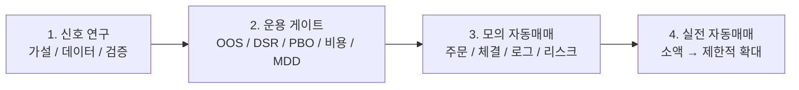
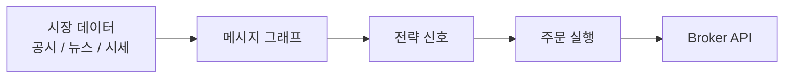
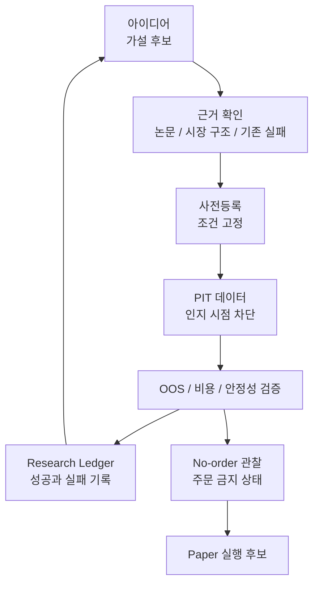
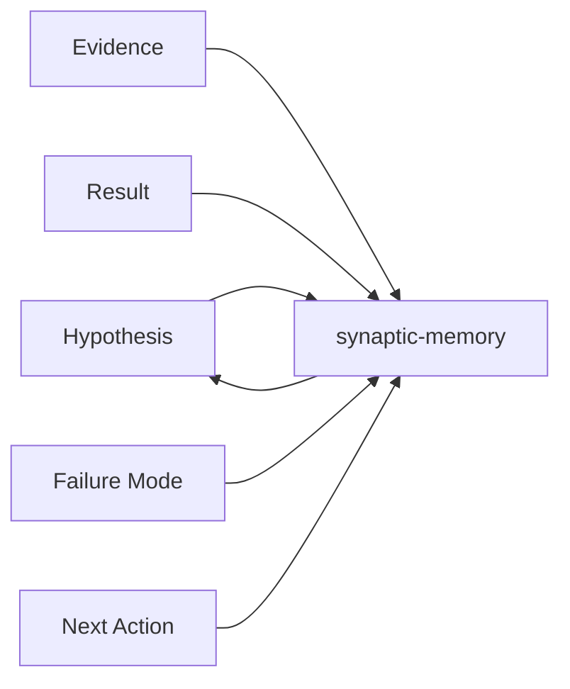

## 자동매매가 최종 목표다

`sontrader`의 최종 목표는 자동매매다. 이 전제는 바뀌지 않았다.

다만 지금 정한 원칙은 "자동매매 봇을 먼저 만들자"가 아니다. "자동매매에 맡겨도 되는 신호를 먼저 증명하자"에 가깝다.

순서는 이렇게 본다.



지금 `sontrader`는 1~2단계에 집중하고 있다. 자동매매를 포기해서가 아니라, 자동매매를 너무 일찍 하지 않기 위해서다.

알파가 없으면 자동매매 봇은 돈 버는 기계가 아니라 손실을 자동화하는 기계가 된다. 그래서 먼저 해야 할 일은 주문 버튼을 자동화하는 것이 아니라, 주문을 맡겨도 되는 판단을 증명하는 것이다.

## 처음에는 주문 봇부터 만들고 싶었다

처음 `sontrader`를 시작했을 때 머릿속 그림은 꽤 단순했다.

시장 데이터를 모으고, 공시와 뉴스를 그래프로 연결하고, 그 위에서 전략 신호를 만들고, 마지막에는 KIS OpenAPI나 NautilusTrader 같은 실행 계층으로 주문까지 이어 붙인다. 이름 그대로 자동매매 봇이다.

개발자로서는 솔직히 재미있는 그림이다. 데이터가 들어오고, 그래프가 맥락을 만들고, 전략이 판단하고, 주문 시스템이 실행한다. 대시보드도 만들 수 있고, 로그도 흘러가고, 시스템이 살아 움직이는 느낌도 난다.



그런데 만들수록 마음 한쪽이 불편했다.

내가 정말 먼저 풀어야 하는 문제가 주문 실행인가?

자동매매에서 주문은 마지막에 붙는 기능이다. 그 앞에는 더 까다롭고 재미없는 질문이 있다.

이 신호가 진짜인가?

이 질문에 답하지 못하면 주문 시스템은 오히려 위험해진다. 잘 만든 실행기는 좋은 판단도 빠르게 실행하지만, 가짜 판단도 아주 성실하게 실행한다.

그래서 어느 순간 순서를 바꿨다. `sontrader`는 최종적으로 자동매매 시스템이 되어야 한다. 하지만 지금 단계에서는 내가 속기 쉬운 아이디어를 먼저 걸러내는 연구 엔진이어야 했다.

## 좋은 백테스트 곡선은 너무 쉽게 나온다

자동매매 프로젝트에서 정말 조심해야 하는 순간은 결과가 나쁠 때가 아니다.

나쁜 결과는 마음은 아프지만 비교적 안전하다. 버리면 된다. 진짜 위험한 건 백테스트가 좋아 보일 때다.

좋은 곡선은 사람을 설득한다. 기간을 조금 바꾸고, universe를 조금 바꾸고, window를 조금 바꾸고, 비용 모델을 조금 느슨하게 하면 그럴듯한 결과는 생각보다 쉽게 나온다. 그렇게 나온 곡선은 꼭 이렇게 말하는 것 같다.

이 정도면 해볼 만하지 않나?

그 말이 위험했다. 좋은 결과가 나왔을 때 바로 믿고 싶어지는 마음이 제일 위험했다.

그래서 `sontrader`에서 먼저 자동화해야 할 것은 주문이 아니라 의심이라고 생각했다. 결과를 보고 기준을 바꾸지 않았는지, 같은 아이디어를 이름만 바꿔 반복한 것은 아닌지, OOS를 사실상 여러 번 본 것은 아닌지, 거래비용과 체결 제약을 나중에 끼워 넣은 것은 아닌지, 상장폐지나 공시 인지 시점 같은 미래 정보를 몰래 읽은 것은 아닌지 계속 물어야 했다.

이 질문에 답하지 못한 채 주문 시스템부터 붙이면 프로젝트는 자동매매가 아니라 자동확신 장치가 된다.

## 지금은 연구 엔진 단계다

현재 단계의 역할은 명확하다.

`sontrader`는 결국 자동매매 시스템으로 가야 한다. 하지만 지금은 주문을 빨리 내는 봇이 아니라, 아이디어를 넣으면 검증하고, 기각하고, 보류하고, 관찰하고, 아주 드물게 승격시키는 연구 엔진 단계다.



이 흐름에서 지금 가장 중요한 단어는 `No-order`다. 주문하지 않는 상태.

좋아 보이는 힌트가 나와도 바로 주문 후보로 올리지 않는다. 많은 결과는 dashboard나 ledger에 남고, 어떤 결과는 더 많은 관찰을 기다리며, 대부분은 그냥 기각된다.

답답하다. 하지만 이 답답함이 필요했다. 그래야 나중에 자동매매를 켰을 때, 아무 신호나 기계에 맡기는 상황을 피할 수 있다.

## 질문이 달라졌다

최종 자동매매 시스템의 질문은 결국 실행에 가까워진다. 지금 살까, 얼마나 살까, 언제 팔까.

하지만 그 전 단계의 질문은 조금 더 귀찮다.

이 아이디어는 경제적 설명이 있는가. 구현 전에 실패 조건을 먼저 적었는가. 입력 데이터는 그 시점에 실제로 알 수 있었는가. 같은 family의 실패를 window 튜닝으로 되살리려는 것은 아닌가. 비용 후에도 benchmark 대비 의미가 있는가. 특정 날짜나 특정 regime 하나에 기대고 있는 것은 아닌가.

질문들이 전부 느리다. 그런데 이 느린 질문을 통과하지 못하면, 빠른 자동화는 별로 장점이 아니다.

## PIT를 먼저 붙잡은 이유

방향을 바꾼 뒤 가장 먼저 붙잡은 기준은 PIT(Point-in-Time)였다.

자동매매 리서치에서 데이터는 단순히 과거 날짜의 값이면 부족하다. 그 값을 그 날짜에 실제로 알고 있었는지가 중요하다.

예를 들어 어떤 사건이 과거에 일어났더라도, 내 시스템이 그 사실을 나중에 알았다면 그 사건은 당시 판단에 사용할 수 없다. 공시가 나중에 정정됐거나, 재무 데이터가 뒤늦게 들어왔거나, 지식 그래프의 엣지가 나중에 생겼다면 더더욱 그렇다.

그래서 두 개의 시간이 필요했다.

```text
effective time: 시장에서 그 사건이 발생한 시점
knowledge time: 내 시스템이 그 사실을 알게 된 시점
```

백테스트는 둘 다 통과해야 한다. 사건이 과거에 일어났더라도, 그 사실을 당시 시스템이 몰랐다면 사용할 수 없다.

이 제약을 넣으면 구현이 귀찮아진다. 쿼리도 복잡해지고, 데이터 모델도 번거로워지고, 작은 리포트 하나를 만들 때도 생각할 게 늘어난다.

하지만 이 귀찮음이 없으면 백테스트는 미래를 몰래 읽는다. 미래를 읽는 백테스트는 언제나 똑똑하다. 문제는 실전에서는 그 능력이 사라진다는 점이다.

## 사전등록은 나중의 나를 막는 장치다

리서치가 길어질수록 사람은 자꾸 결과에 맞춰 설명을 만든다. 나도 예외가 아니다. 결과를 본 뒤에 "사실 이 metric이 더 중요했다"거나 "이 구간은 특수했다"거나 "이 조건만 빼면 괜찮다"라고 말하기 시작하면, 실험은 점점 예뻐진다. 대신 정직함은 줄어든다.

그래서 실험 전에 조건을 잠그는 절차가 필요했다. 사전등록은 거창한 연구자 흉내가 아니라, 결과를 보고 흔들리는 나를 막기 위한 장치에 가깝다.

어떤 가설을 검증하는지, 어떤 데이터를 쓸 수 있는지, 어떤 기간을 train/test로 나눌지, 어떤 metric을 primary로 볼지, 어떤 결과를 통과로 볼지, 어떤 실패는 즉시 폐기로 볼지 먼저 적는다. 그리고 가능하면 그 기준으로만 판단한다.

편한 흐름은 이렇다.

```text
아이디어가 좋아 보인다
→ 구현한다
→ 결과를 본다
→ 기준을 고친다
```

`sontrader`에서는 이 흐름을 피하고 싶었다.

```text
아이디어가 좋아 보인다
→ 기준을 먼저 적는다
→ 구현한다
→ 기준대로만 판정한다
→ 실패 이유를 남긴다
```

멋은 덜하다. 속도도 느리다. 하지만 나중에 나 자신에게 변명할 여지가 줄어든다.

## 기각은 실패가 아니라 산출물이다

자동매매 프로젝트에서 기각된 실험은 흔히 버려진다. 하지만 실제로는 기각 이유가 가장 중요한 산출물일 때가 많다.

예를 들어 어떤 후보가 비용 전에는 좋아 보이지만 비용 후에는 사라질 수 있다. 어떤 후보는 평균 성과는 좋아 보이지만 특정 기간 하나에 의존할 수 있다. 어떤 후보는 market beta를 제거하면 남는 것이 없을 수 있다. 어떤 후보는 신호가 아니라 위험 설명자일 수 있다.

이런 결론은 실패가 아니라 다음 실험의 재료다. 그래서 `sontrader`에서는 기각도 ledger에 남긴다.

```json
{
  "hypothesis": "redacted_hypothesis",
  "verdict": "reject",
  "failure_mode": "cost_or_stability_gate_failed",
  "next_action": "do_not_reopen_without_new_mechanism"
}
```

핵심은 `do_not_reopen_without_new_mechanism` 같은 문장이다.

같은 아이디어를 window나 threshold만 바꿔 되살리는 일을 막기 위해서다. 이런 문장은 약간 차갑게 보이지만, 실제로는 나중의 나를 보호한다.

## synaptic-memory는 예측기보다 연구 노트에 가까웠다

초기에는 메시지 그래프가 직접 알파를 만들 수 있을지 기대했다. 공시, 뉴스, 종목, 테마, 이벤트를 연결하면 특정 관계에서 가격 반응을 읽을 수 있지 않을까 하는 생각이었다.

솔직히 이 부분이 제일 재미있었다. 그래프가 있고, 엣지가 있고, 이벤트가 퍼지고, 뭔가 지능적인 시스템이 될 것 같은 느낌이 있다.

하지만 리서치가 진행되면서 그래프의 1차 역할을 바꿨다.

그래프는 주문 신호 생성기보다 연구 기억 장치에 가까웠다. 어떤 가설이 어떤 근거에서 나왔는지, 어떤 실험이 어떤 이유로 실패했는지, 같은 실패가 반복되는지, 어떤 후보는 risk context로만 남아야 하는지를 연결해서 기억하는 쪽이 더 현실적이었다.



이 구조가 있으면 새 아이디어를 만들 때 과거 실패를 검색할 수 있다.

"이거 예전에 했던 것 아닌가?"

이 질문을 사람이 기억하는 대신 시스템에 묻는다. 자동매매에서 이건 꽤 중요하다. 전략을 통제하는 것만큼이나 연구자의 습관을 통제하는 일이 중요하기 때문이다.

## 주문 시스템은 다음 단계로 밀렸다

KIS OpenAPI, NautilusTrader, risk gate, order router 같은 실행 계층은 여전히 중요하다. 하지만 우선순위가 바뀌었다.

예전에는 이런 순서로 생각했다.

```text
데이터 수집 → 신호 생성 → 주문 시스템 → 운영 안정화
```

지금은 다르게 본다.

```text
데이터 무결성 → 가설 사전등록 → 검증 게이트 → no-order 관찰 → paper 실행 후보 → 주문 시스템
```

실행 계층을 늦춘 이유는 단순하다. 주문할 만한 후보가 없으면 주문 시스템은 중심이 될 수 없다. 먼저 필요한 것은 좋은 주문 API wrapper가 아니라, 주문으로 넘어가면 안 되는 후보를 걸러내는 절차다.

그래서 현재의 많은 산출물은 주문 후보가 아니라 dashboard, ledger, diagnostic report에 가깝다. 겉보기에는 자동매매에서 멀어진 것처럼 보인다. 하지만 실제로는 자동매매로 가는 전 단계다. 주문을 붙이기 전에, 주문하지 않을 이유를 충분히 모으는 쪽으로 간 것이다.

## `order_allowed=false`가 기본값이 됐다

이 프로젝트에서 `order_allowed=false`는 실패 문구가 아니다. 기본 상태다.

대부분의 연구 결과는 `reject`, `diagnostic_only`, `no_order_dashboard`, `waiting_for_observations` 같은 상태로 남는다. 아주 드물게만 paper 실행 후보가 된다.

이 순서가 중요하다. 자동매매 시스템이라고 해서 모든 흐름이 주문으로 끝나면 안 된다. 오히려 대부분은 주문으로 가지 않아야 한다.

현재 상태를 굳이 한 줄로 쓰면 이렇다.

```text
자동매매 최종 목표: 유지
실전 주문: 아직 금지
모의 주문: 실행 인프라 검증용으로만 가능
운용 가능 알고리즘: 아직 미승인
현재 초점: 신호가 왜 게이트를 못 넘는지 원인 분해
```

이건 자동매매를 안 하겠다는 뜻이 아니다. 자동매매를 너무 일찍 하지 않겠다는 뜻이다.

## 프로젝트가 남기는 자산

자동매매까지 가는 순서를 바꾸니 마음이 조금 편해졌다. 전략이 통과하지 못해도 남는 것이 있기 때문이다.

PIT 데이터 처리 기준, 비용 후 백테스트 하네스, 사전등록 문서 양식, 연구 ledger, 실패 유형 분류, no-order dashboard, daily ops report, broker 연동 전 안전 체크리스트, synaptic-memory 기반 연구 기억 같은 것들이 남는다.

이 자산은 특정 전략 하나보다 오래 간다. 전략은 기각될 수 있지만, 기각하는 능력은 다음 전략을 더 싸게 검증하게 해준다. 실패가 쌓일수록 막연한 자신감은 줄고, 대신 다음 실험의 비용이 내려간다.

지금의 `sontrader`를 연구 엔진으로 보는 이유도 여기에 있다. 최종 목적지는 자동매매다. 다만 그 자동매매에 올라탈 신호를 먼저 통과시켜야 한다.

## 결국 먼저 자동화해야 하는 것은 의심이었다

처음에는 주문부터 자동화하고 싶었다. 지금은 순서를 다르게 본다.

자동매매까지 가려면 가장 먼저 자동화해야 하는 것은 주문이 아니라 의심이다.

이 데이터는 당시 알 수 있었나. 이 결과는 benchmark와 비교했나. 이 아이디어는 이미 실패한 family 아닌가. 이 성과는 비용 후에도 남나. 이 후보는 정말 주문 후보인가, 아니면 dashboard 설명자인가.

이 질문을 사람이 매번 손으로 하면 언젠가 빠뜨린다. 그래서 질문 자체를 시스템에 넣어야 한다.

`sontrader`의 방향 전환은 여기서 시작됐다. 실전 자동매매가 최종 목표라면, 그 전에 주문하지 말아야 할 이유를 자동으로 찾는 장치를 먼저 만들어야 한다. 그 장치가 충분히 엄격할 때만, 다음 단계로 paper 실행과 주문 시스템을 붙일 수 있다.

결국 자동매매의 핵심은 더 빨리 주문하는 것이 아니라, 기계에 맡겨도 되는 판단을 더 늦게 믿는 것이다.

## 이 글에서 일부러 말하지 않는 것

마지막으로 선을 긋는다. 이 글은 투자 조언이 아니고, 어떤 전략의 성과를 주장하는 글도 아니다. 실제 계좌, 주문 설정, broker credential, 내부 endpoint, 종목 코드, 선정 기준, 전략 threshold, 손익, 포지션, 원본 리서치 수치는 공개하지 않는다.

대신 공개할 수 있는 것은 방향 전환의 구조다. 자동매매를 하려면 무엇을 사야 하는지보다, 언제 아무것도 하지 않아야 하는지를 먼저 시스템화해야 한다. 지금의 `sontrader`는 그 단계를 지나고 있고, 그 다음 목적지는 여전히 모의 자동매매와 실전 자동매매다.
