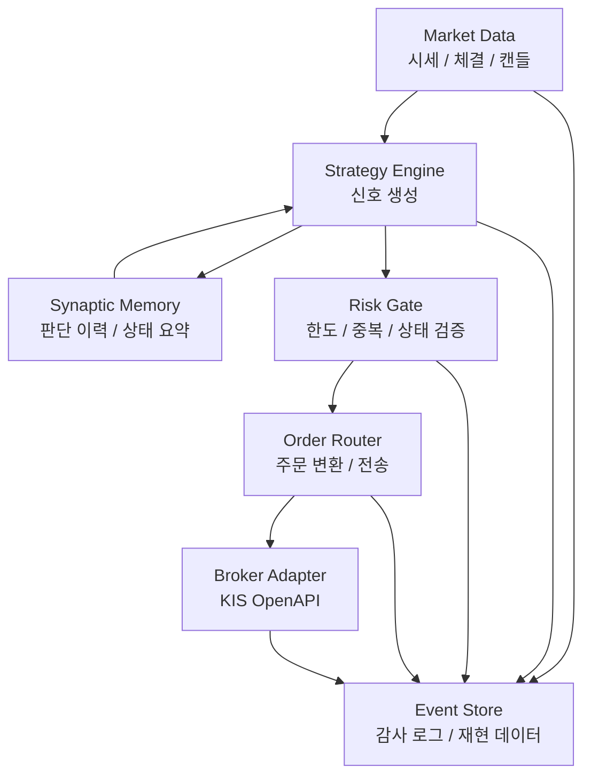
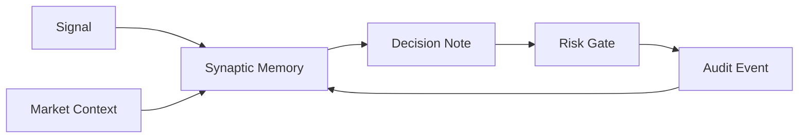
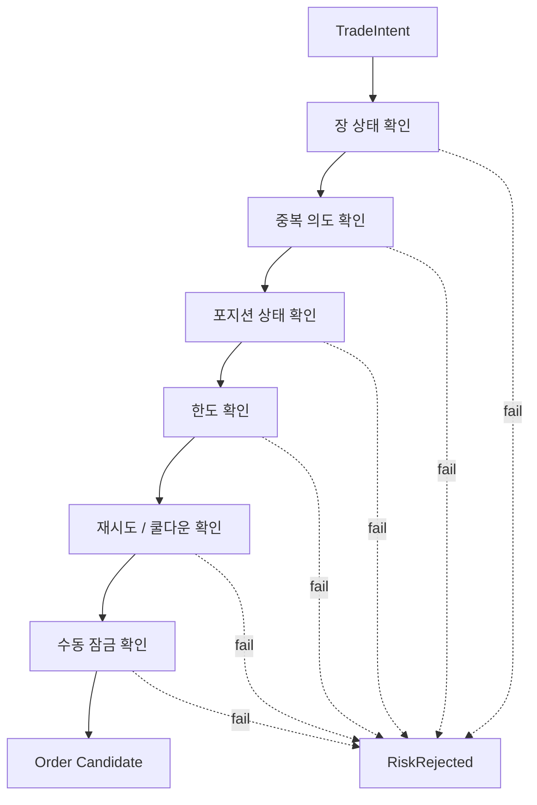
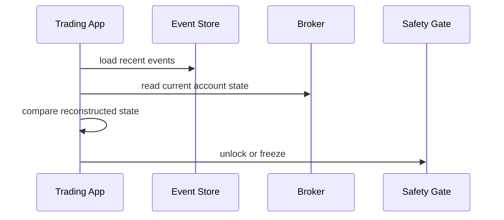

## 자동매매에서 가장 위험한 코드는 매수 로직이 아니다

자동매매 프로젝트를 만들 때 가장 먼저 떠올리는 것은 보통 전략이다. 어떤 지표를 볼 것인가, 어떤 조건에서 진입할 것인가, 손절과 익절은 어떻게 할 것인가. 하지만 실제로 시스템을 만들다 보면 가장 위험한 코드는 전략 함수가 아니라 **주문으로 이어지는 경계면**이다.

전략이 틀리면 손실이 난다. 주문 경계가 틀리면 의도하지 않은 주문이 나가고, 중복 주문이 발생하고, 이미 정정된 상태를 다시 실행하고, 네트워크 재시도 중에 포지션이 꼬인다. 자동매매 시스템은 "똑똑한 예측기"보다 먼저 "멈출 줄 아는 실행기"가 되어야 한다.

`sontrader`는 국내 주식 자동매매를 목표로 만든 private 프로젝트다. 공개 저장소가 아니고 실제 계정, 주문 세부값, 전략 파라미터, 성과 수치, 종목 선택 기준은 블로그에 적지 않는다. 대신 공개해도 되는 엔지니어링 관점만 정리한다. 프로젝트의 큰 축은 Python 기반 시스템, NautilusTrader 스타일의 이벤트/백테스트 모델, KIS OpenAPI 연동, 그리고 synaptic memory를 이용한 의사결정 이력 관리다.

이 글의 목적은 "어떤 전략이 돈을 벌었는가"가 아니다. 자동매매 시스템을 만들 때 전략보다 먼저 분리해야 하는 계층, 실거래 전환 전에 필요한 안전장치, 메모리 기반 의사결정 이력을 어디까지 시스템화할 수 있는지를 정리하는 것이다.

## 공개 글에서 다루지 않을 것

금융 자동화 글은 공개 범위를 먼저 정해야 한다. 기술 블로그라고 해도 다음 정보는 공개하지 않는 편이 맞다.

- 실제 계좌, 앱 식별자, 개인 식별자
- 주문 가능 환경의 접속 정보
- 종목별 진입/청산 조건
- 실거래 성과, 손익, 포지션 크기
- 주문 수량 산식과 리스크 한도 값
- 실시간 알림 채널 식별자
- 배포 서버 주소와 운영 시간표

그래서 이 글에서는 모든 예시를 추상화한다. 코드는 실제 프로젝트 코드를 그대로 옮기지 않고 구조를 설명하기 위한 pseudocode 수준으로만 쓴다.

## 전체 구조

자동매매 시스템은 크게 여섯 계층으로 나눴다.



이 구조에서 전략은 주문 시스템을 직접 호출하지 않는다. 전략은 "의도"를 만든다. 이 의도는 risk gate를 통과해야 주문 후보가 되고, order router가 브로커 API 형식으로 바꾼다. broker adapter는 외부 API의 응답과 오류를 시스템 이벤트로 되돌린다.

자동매매 시스템에서 가장 중요한 질문은 "무엇을 살까"가 아니라 "이 명령이 정말 지금 나가도 되는가"다. 그래서 주문 직전까지 여러 계층이 같은 질문을 다른 방식으로 반복한다.

## 이벤트 기반으로 생각하기

자동매매를 함수 호출 묶음으로 만들면 처음에는 빨리 된다.

```text
가격 조회
→ 지표 계산
→ 조건 확인
→ 주문 요청
```

하지만 운영에 가까워질수록 이 구조는 버티기 어렵다. 네트워크가 끊기거나, 응답이 늦거나, 장중 상태가 바뀌거나, 같은 프로세스가 재시작되면 "방금 어디까지 했는지"가 사라진다.

그래서 이벤트 기반 모델이 필요하다.

```text
MarketTickReceived
BarClosed
SignalGenerated
RiskRejected
OrderSubmitted
OrderAccepted
OrderRejected
OrderFilled
PositionUpdated
```

각 이벤트는 저장 가능해야 한다. 그래야 장애 후 복구할 때 "현재 잔고를 다시 조회해서 맞춘다"와 "내 시스템이 어떤 판단을 했는지 재생한다"를 분리할 수 있다. 전자는 운영 상태 복구이고, 후자는 디버깅과 개선을 위한 재현이다.

NautilusTrader 같은 프레임워크의 장점도 여기에 있다. 전략, 주문, 체결, 포지션을 이벤트 모델로 다루면 백테스트와 실시간 실행의 언어를 맞출 수 있다. 완전히 같은 코드를 쓰는 것은 어렵더라도 최소한 같은 개념으로 말할 수 있다.

## 전략은 주문이 아니라 의도를 반환한다

전략 함수가 바로 주문 API를 호출하면 테스트가 어려워진다. 더 큰 문제는 risk gate를 우회하기 쉬워진다는 점이다. 그래서 전략은 주문이 아니라 `TradeIntent`를 만든다.

```python
from dataclasses import dataclass
from enum import Enum


class IntentSide(str, Enum):
    BUY = "buy"
    SELL = "sell"
    HOLD = "hold"


@dataclass(frozen=True)
class TradeIntent:
    symbol: str
    side: IntentSide
    reason: str
    confidence: float
    source_event_id: str
```

이 예시는 개념 설명용이다. 실제 시스템에서는 시장, 주문 유형, 시간 조건, 포트폴리오 상태, 추적 id 같은 값이 더 필요하다. 핵심은 전략이 외부로 나가는 action을 수행하지 않는다는 점이다.

`TradeIntent`는 다음 질문에 답해야 한다.

- 어떤 종목 또는 자산에 대한 의도인가
- 방향은 무엇인가
- 어떤 이벤트를 근거로 생겼는가
- 왜 이 판단을 했는가
- 어느 정도 확신을 가지는가

여기서 `reason`은 자연어 로그처럼 보일 수 있지만, 운영에서는 꽤 중요하다. 나중에 "왜 이 시점에 주문 후보가 만들어졌는가"를 확인할 때 숫자 지표만 있으면 맥락이 부족하다. 특히 synaptic memory를 붙일 때는 판단 이유를 구조화된 메모리로 남겨야 한다.

## synaptic memory는 신호 생성기가 아니라 판단 이력 계층이다

프로젝트 설명에 synaptic memory가 들어가 있지만, 이것을 "예측을 잘하는 마법의 저장소"처럼 쓰면 위험하다. 자동매매에서 메모리는 주문을 직접 만들기보다 판단 이력을 관리하는 계층으로 두는 편이 안전하다.

메모리가 담당할 수 있는 일은 다음과 같다.

- 최근 판단 요약
- 같은 조건에서 반복적으로 거절된 이유
- 장중 상태 변화에 대한 관찰
- 전략 버전별 판단 차이
- risk gate가 막은 이벤트의 패턴
- 실거래와 백테스트에서 다르게 나온 지점



메모리 계층이 위험해지는 순간은 "이전에 비슷하게 성공했으니 이번에도 주문하자"처럼 직접 주문 판단을 밀어붙일 때다. 과거 사례는 맥락을 제공할 수 있지만, 현재 주문 가능 여부는 risk gate와 브로커 상태 확인을 통과해야 한다.

그래서 메모리 출력은 주문 명령이 아니라 decision note에 가깝게 둔다.

```json
{
  "kind": "decision_note",
  "summary": "최근 유사 조건에서는 변동성이 커진 뒤 신호가 자주 되돌려졌다.",
  "risk_hint": "주문 후보를 만들더라도 중복 포지션과 장중 변동성 조건을 재확인한다.",
  "related_events": ["event_a", "event_b"]
}
```

이렇게 하면 메모리가 전략을 보조하되, 주문 경계를 넘지 않는다.

## Risk Gate는 여러 개의 작은 거부권이다

자동매매에서 risk gate는 하나의 `if` 문이 아니다. 여러 개의 독립적인 거부권을 쌓아야 한다. 각 gate는 작고 명확해야 한다.



각 gate는 거절 이유를 이벤트로 남긴다.

```python
@dataclass(frozen=True)
class RiskDecision:
    accepted: bool
    reason_code: str
    message: str
    intent_id: str
```

거절 로그를 남기는 이유는 두 가지다. 첫째, 운영자가 지금 왜 주문이 안 나갔는지 알아야 한다. 둘째, 전략 개선 시 "좋은 신호였는데 risk gate가 너무 보수적으로 막았는지" 또는 "위험한 신호를 잘 막았는지"를 나중에 분석해야 한다.

중요한 점은 risk gate가 전략의 성과를 높이려고 존재하는 것이 아니라 시스템을 망가뜨리지 않기 위해 존재한다는 점이다. 전략 성능과 risk gate의 목적을 섞으면 위험하다. risk gate는 지루할수록 좋다.

## 주문 라우터는 브로커 API를 격리한다

KIS OpenAPI 같은 외부 연동은 시스템 안에서 가장 변동성이 큰 부분이다. 요청 형식, 응답 형식, 오류 코드, 장중 제한, 계정 상태 조회 방식이 모두 외부 시스템에 묶인다. 그래서 이 부분을 전략이나 risk gate 안에 흩뿌리면 유지보수가 어려워진다.

Order Router는 내부 주문 후보를 브로커 adapter가 이해하는 명령으로 바꾼다.

```text
OrderCandidate
→ BrokerOrderRequest
→ BrokerResponse
→ OrderEvent
```

여기서 내부 모델과 외부 모델을 분리해야 한다.

- 내부 모델은 도메인 언어를 쓴다.
- 외부 모델은 API 계약을 따른다.
- 외부 오류는 내부 오류 코드로 변환한다.
- 재시도 여부는 오류 종류별로 다르게 판단한다.
- 브로커 응답 원문은 필요한 범위에서만 보존한다.

```python
class BrokerAdapter:
    def submit_order(self, request: "BrokerOrderRequest") -> "BrokerOrderResult":
        raise NotImplementedError


class OrderRouter:
    def __init__(self, broker: BrokerAdapter):
        self.broker = broker

    def submit(self, candidate: "OrderCandidate") -> "OrderEvent":
        request = self._to_broker_request(candidate)
        result = self.broker.submit_order(request)
        return self._to_order_event(candidate, result)
```

이 구조의 장점은 테스트다. 실제 브로커 API 없이도 `FakeBrokerAdapter`로 주문 흐름을 검증할 수 있다. 더 중요한 장점은 사고 범위 축소다. 외부 API 변경이 있어도 adapter 경계에서 흡수할 수 있다.

## 상태 복원은 잔고 조회만으로 끝나지 않는다

자동매매 프로세스는 언젠가 재시작된다. 배포, 장애, 네트워크 단절, 로컬 PC sleep, API 제한 등 이유는 많다. 재시작 후 가장 먼저 해야 하는 일은 "내가 알고 있는 상태"와 "브로커가 알고 있는 상태"를 맞추는 것이다.

상태 복원에는 세 종류가 있다.

```text
1. Broker Reconciliation
   현재 잔고, 미체결, 체결 내역을 외부 시스템에서 다시 읽는다.

2. Event Replay
   내 시스템이 남긴 이벤트를 읽어 전략 상태와 메모리를 복원한다.

3. Safety Freeze
   둘이 일치하지 않으면 자동 주문을 잠그고 수동 확인 상태로 둔다.
```

잔고 조회만 하면 현재 포지션은 알 수 있다. 하지만 왜 그 포지션이 생겼는지, 어떤 전략 버전이 판단했는지, risk gate가 무엇을 통과시켰는지는 알 수 없다. 반대로 event replay만 하면 외부 시스템의 실제 상태와 어긋날 수 있다. 둘 다 필요하다.



상태가 조금이라도 불확실하면 주문을 멈추는 쪽이 맞다. 자동매매에서 "대충 맞을 것"은 좋은 복구 전략이 아니다.

## 백테스트와 실거래 사이의 차이를 로그로 좁히기

백테스트에서 잘 돌아가는 전략이 실시간 실행에서 다르게 보이는 이유는 많다.

- 체결 가격과 시뮬레이션 가격이 다르다.
- 장중 데이터 지연이 있다.
- 주문 가능 시간이 제한된다.
- 실제 주문은 거절될 수 있다.
- 재시도와 미체결 상태가 생긴다.
- 수수료와 세금, 최소 주문 단위가 영향을 준다.

그래서 백테스트와 실거래를 완전히 같게 만들겠다는 목표보다, 차이를 관찰 가능하게 만드는 것이 현실적이다.

```text
Backtest Event
SignalGenerated at T
OrderSimulated at T
FillSimulated at T+1

Live Event
SignalGenerated at T
RiskAccepted at T
OrderSubmitted at T+delta
OrderAccepted at T+delta
OrderFilled at T+delta+n
```

이 차이를 이벤트로 남기면 나중에 같은 전략이 왜 다른 결과를 냈는지 좁혀갈 수 있다. 특히 실시간 실행에서는 "신호는 있었지만 risk gate에서 막힘", "주문 후보는 있었지만 API 응답 지연", "주문은 나갔지만 체결되지 않음"이 모두 다른 사건이다. 이것을 하나의 "실패"로 뭉개면 개선 방향을 찾을 수 없다.

## 알림은 편의 기능이 아니라 제어판이다

자동매매 프로젝트에서 알림은 종종 나중에 붙이는 기능처럼 취급된다. 하지만 실제 운영에서는 알림이 제어판에 가깝다. 주문 후보가 만들어졌는지, risk gate가 막았는지, 주문이 접수됐는지, 체결됐는지, 시스템이 멈췄는지를 사람이 알아야 한다.

알림은 다음 수준으로 나눌 수 있다.

```text
INFO
- 장 시작
- 데이터 수신 정상
- 주문 없음

WARN
- risk gate 거절 증가
- 데이터 지연
- 재시도 발생

ACTION
- 상태 불일치로 자동 주문 잠금
- 외부 API 오류 지속
- 수동 확인 필요
```

모든 이벤트를 알림으로 보내면 알림 피로가 생긴다. 반대로 중요한 상태만 보내면 평소에는 조용하고, 위험할 때만 사람을 부른다. 자동매매에서 좋은 알림은 시끄러운 알림이 아니라 개입 타이밍을 정확히 알려주는 알림이다.

## 실거래 전환 체크리스트

실거래로 넘어가기 전에는 전략 성능보다 운영 체크리스트가 먼저다.

```text
데이터
- 장중 데이터 누락을 감지하는가
- 시계열 timestamp가 일관되는가
- 재시작 후 마지막 처리 지점을 찾는가

주문
- dry-run과 live-run 경계가 명확한가
- 같은 의도로 중복 주문이 나가지 않는가
- 미체결 상태를 추적하는가

리스크
- 수동 잠금 스위치가 있는가
- 종목별/전체 한도가 있는가
- 상태 불일치 시 자동으로 멈추는가

관찰성
- 모든 주문 후보와 거절 이유가 남는가
- 외부 API 오류가 분류되는가
- 알림이 너무 많거나 너무 적지 않은가

재현성
- 특정 날짜의 이벤트를 다시 재생할 수 있는가
- 전략 버전과 설정을 이벤트에 남기는가
- 백테스트와 실거래 이벤트를 비교할 수 있는가
```

이 체크리스트를 통과하지 못하면 전략이 아무리 좋아 보여도 실거래로 옮기기 어렵다. 자동매매 시스템은 한 번의 똑똑한 판단보다 천 번의 지루한 검증이 더 중요하다.

## private 프로젝트를 블로그 글감으로 만들 때의 기준

`sontrader`처럼 private이고 금융 도메인인 프로젝트는 블로그로 옮길 때 기준이 필요하다.

공개해도 되는 것:

- 계층 분리 방식
- 이벤트 모델
- 리스크 제어 원칙
- 브로커 adapter 패턴
- 상태 복원 절차
- 로그와 알림 설계
- 백테스트와 실거래의 차이를 줄이는 방법

공개하지 않을 것:

- 실제 전략 파라미터
- 종목 선정 기준
- 주문 수량 계산식
- 실계좌 흐름
- API 연결 세부값
- 손익 수치
- 실시간 운영 스케줄

이 기준을 세우면 private 프로젝트도 충분히 좋은 글감이 된다. 핵심은 "돈 버는 방법"을 쓰는 것이 아니라, "위험한 자동화를 제품처럼 다루는 방법"을 쓰는 것이다.

## 정리

`sontrader`에서 가장 중요한 설계 판단은 전략을 중심에 두지 않는 것이었다. 전략은 시스템의 한 부품이다. 그 앞에는 데이터 정합성이 있고, 그 뒤에는 risk gate, order router, broker adapter, event store, 상태 복원, 알림이 있다.

자동매매 시스템은 성공한 주문보다 실패를 안전하게 다루는 능력으로 평가해야 한다. 신호가 이상하면 주문하지 않아야 하고, 상태가 불확실하면 멈춰야 하고, 외부 API가 흔들리면 재시도보다 잠금이 먼저여야 한다. 그리고 모든 판단은 나중에 다시 읽을 수 있어야 한다.

synaptic memory는 이 구조에서 좋은 보조 장치가 된다. 하지만 메모리는 주문 버튼이 아니라 판단 이력을 정리하는 계층이어야 한다. 과거와 현재를 연결해 전략과 운영자가 더 잘 이해하게 돕되, 실제 주문 경계는 risk gate와 broker 상태 검증이 지켜야 한다.

결국 자동매매 시스템의 품질은 "얼마나 공격적으로 사고파는가"가 아니라 "얼마나 명확하게 멈추고, 기록하고, 복구하는가"에서 갈린다. 이 기준을 먼저 세우면 전략 실험도 훨씬 안전해진다.
