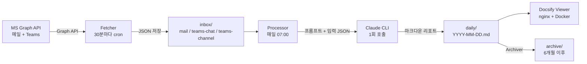

## 개요

하루에 수십 통의 메일과 수백 개의 Teams 메시지가 오간다. 다음 날 아침에 "어제 뭐 했지?"를 되짚으려면 채팅방 여러 개를 뒤져야 하고, 메일함을 다시 스크롤해야 한다. 이걸 자동화했다.

**workstream-kb**는 2-Layer 하이브리드 시스템이다.

- **Layer 1 (Fetcher)**: 30분마다 MS Graph API로 메일/Teams 채팅/Teams 채널을 수집하여 `inbox/`에 JSON으로 저장한다. AI 비용이 발생하지 않는다.
- **Layer 2 (Processor)**: 매일 07:00에 inbox 전체를 Claude CLI 1회 호출로 종합 업무 리포트로 변환한다. `daily/{date}.md`에 저장된다.

추가로 **Archiver**가 6개월 이전 데이터를 `archive/`로 이동하고, **Docsify 뷰어**가 브라우저에서 리포트를 탐색할 수 있게 한다.

## 전체 아키텍처



핵심 설계 결정은 **수집과 처리의 분리**다. Fetcher는 AI를 사용하지 않고 raw 데이터만 쌓는다. AI 비용은 하루 1회, Processor에서만 발생한다. Fetcher가 30분마다 돌아도 Claude API 비용은 0원이다.

## Layer 1: Fetcher — MS Graph API 데이터 수집

### 토큰 관리: MS365 MCP 서버와 캐시 공유

별도의 OAuth 인증 플로우를 구현하지 않았다. MS365 MCP 서버(`~/.config/ms-365-mcp/`)의 토큰 캐시를 그대로 공유한다.

```javascript
export class TokenManager {
  constructor() {
    this.msalApp = new PublicClientApplication({
      auth: {
        clientId: MS365_CLIENT_ID,
        authority: MS365_AUTHORITY,
      },
    });
  }

  async getAccessToken() {
    // 1. MCP 서버의 토큰 캐시 파일 로드
    await this.loadTokenCache();

    // 2. 선택된 계정 정보 읽기
    const selectedAccount = this.readSelectedAccount();

    // 3. 캐시에서 계정 매칭
    const accounts = await this.msalApp.getTokenCache().getAllAccounts();
    const account = accounts.find(a =>
      a.homeAccountId === accountId || a.username === selectedAccount.username
    );

    // 4. Silent token 획득 (MSAL이 만료 시 자동 갱신)
    const result = await this.msalApp.acquireTokenSilent({
      account,
      scopes: MS365_SCOPES,
    });

    // 5. 갱신된 토큰 캐시 저장
    await this.saveTokenCache();
    return result.accessToken;
  }
}
```

`acquireTokenSilent`가 refresh token으로 자동 갱신해 주므로, 한 번 MCP 서버에서 로그인하면 이후에는 수동 인증 없이 계속 동작한다. 토큰 갱신 실패 시에는 macOS `terminal-notifier`로 데스크톱 알림을 보내서 재로그인을 유도한다.

### Graph Client: 재시도와 Rate Limit

MS Graph API 호출을 담당하는 클라이언트다. 세 가지 에러 상황을 구분한다.

```javascript
export class GraphClient {
  async makeRequest(method, endpoint, options = {}) {
    for (let attempt = 1; attempt <= MAX_RETRIES; attempt++) {
      const token = await this.tokenManager.getAccessToken();
      const response = await fetch(url, { headers: { Authorization: `Bearer ${token}` } });

      // 401: 인증 실패 — 재시도 의미 없음, 즉시 에러
      if (response.status === 401) throw new AuthError(`인증 실패: ${endpoint}`);

      // 429: Rate limit — Retry-After 헤더 존중
      if (response.status === 429) {
        const retryAfter = parseInt(response.headers.get('Retry-After') || '5');
        await this.sleep(retryAfter * 1000);
        continue;
      }

      // 5xx: 서버 오류 — exponential backoff
      if (response.status >= 500) {
        await this.sleep(INITIAL_BACKOFF_MS * Math.pow(2, attempt - 1));
        continue;
      }

      const data = await response.json();
      return this.stripOdataProperties(data);
    }
  }
}
```

`stripOdataProperties`는 Graph API 응답에 포함된 `@odata.context`, `@odata.nextLink` 같은 메타데이터를 재귀적으로 제거한다. inbox JSON 파일의 용량을 줄이고, 이후 Processor에서 불필요한 노이즈가 Claude에게 전달되는 것을 방지한다.

### 메일 수집: HTML을 Markdown으로

MailFetcher는 Graph API `/me/messages`를 호출하여 메일을 가져온다.

```javascript
async fetchNewMails() {
  // DATA_START_DATE 이전 데이터는 무시
  const filterDate = candidate < startFloor ? startFloor : candidate;

  const data = await this.graphClient.get('/me/messages', {
    $filter: `receivedDateTime ge ${filterDate}`,
    $top: String(MAIL_FETCH_LIMIT),
    $orderby: 'receivedDateTime desc',
    $select: 'id,subject,from,toRecipients,receivedDateTime,body,bodyPreview,hasAttachments,importance',
  });

  for (const msg of messages) {
    if (this.dedupManager.isProcessed('mail', msg.id)) continue;

    const attachments = await this.processAttachments(msg);
    const bodyMarkdown = this.convertBodyToMarkdown(msg.body);
    // ...
  }
}
```

중복 방지는 `DedupManager`가 처리한다. `processed-ids.json`에 처리 완료된 메시지 ID를 기록하고, 다음 실행에서 건너뛴다. 30분마다 실행되니 같은 메일을 두 번 가져오면 안 된다.

메일 본문은 HTML인 경우가 많다. Turndown 라이브러리로 Markdown 변환하되, 변환 실패 시 HTML 태그를 regex로 제거하는 폴백이 있다.

```javascript
convertBodyToMarkdown(body) {
  if (body.contentType === 'html') {
    try {
      return turndownService.turndown(body.content);
    } catch (err) {
      return body.content.replace(/<[^>]+>/g, '').trim();
    }
  }
  return body.content;
}
```

첨부파일은 10MB 이하만 저장한다. `contentBytes`(base64)를 디코딩하여 `inbox/mail/attachments/`에 저장하고, 나중에 Processor가 `daily/attachments/{date}/`로 복사한다.

### Teams 수집: 채팅과 채널

TeamsFetcher는 두 가지 경로로 메시지를 수집한다.

**채팅** (`/me/chats`): 1:1 DM과 그룹 채팅을 가져온다. 채팅 목록을 먼저 조회하고, 각 채팅의 메시지를 순회한다. 시스템 메시지(`messageType !== 'message'`)는 건너뛴다.

```javascript
for (const chat of chats) {
  const msgData = await this.graphClient.get(`/chats/${chat.id}/messages`, {
    $top: String(TEAMS_MESSAGE_LIMIT),
  });
  for (const msg of messages) {
    if (msg.messageType && msg.messageType !== 'message') continue;
    if (msg.createdDateTime && msg.createdDateTime <= filterDate) continue;
    // ...
  }
}
```

**채널** (`/me/joinedTeams` → `/teams/{id}/channels` → `/channels/{id}/messages`): 가입된 팀 → 채널 → 메시지 3단계 순회다. 접근 불가 채널(403/404)은 경고만 남기고 건너뛴다.

Teams 메시지의 HTML은 메일보다 단순하다. `<br>`을 줄바꿈으로, `<p>`/`<div>`를 줄바꿈으로 변환하고 나머지 태그를 제거하는 regex 기반 처리로 충분하다. Turndown까지 쓸 필요가 없다.

### 데이터 구조

Fetcher가 생성하는 inbox JSON은 소스 타입별로 분리된다.

```
inbox/
├── mail/
│   ├── {message-id}.json
│   └── attachments/
│       └── {message-id}_{filename}
├── teams-chat/
│   └── {chat-id}_{message-id}.json
└── teams-channel/
    └── {team-id}_{channel-id}_{message-id}.json
```

파일 하나가 메시지 하나에 대응한다. Processor가 디렉토리 전체를 읽어서 한 번에 처리하는 구조이므로, 개별 파일의 크기보다 전체 파일 수가 중요하다.

## Layer 2: Processor — Claude CLI로 일일 리포트 생성

### 데이터 전처리

Processor는 inbox의 모든 JSON을 읽은 뒤 세 단계의 전처리를 거친다.

**1. 채팅방별 그룹화**: 메일, Teams 채팅, Teams 채널 메시지를 "방" 단위로 묶는다. Teams 채팅은 `chatId` 기준, 채널은 `teamId_channelId` 기준, 메일은 하나의 `mail` 방으로 통합한다. 1:1 DM은 상대방 이름으로 표시하고, 그룹 채팅은 참여자 이름을 조합한다.

```javascript
function groupByRoom(items) {
  const rooms = new Map();
  for (const item of items) {
    // teams-chat → chatId 기준
    // teams-channel → teamId_channelId 기준
    // mail → 단일 'mail' 방
  }

  // 2차 패스: displayName 미결정 채팅방 처리
  for (const [roomKey, room] of rooms) {
    if (room.displayName) continue;
    const otherMembers = members.filter(m => m !== MY_DISPLAY_NAME);
    if (otherMembers.length === 1) {
      room.displayName = `DM: ${otherMembers[0]}`;
    }
  }
}
```

**2. 노이즈 필터링**: "네", "넵", "ㅋㅋ", "확인" 같은 단답과 시스템 발신자(noreply@, mailer-daemon) 메일을 제거한다.

```javascript
const NOISE_PATTERNS = /^(네|넵|넹|ㅇㅇ|ㅋㅋ+|ㅎㅎ+|ok|확인|감사|수고|👍|👌)$/i;
const SYSTEM_SENDERS = /noreply|no-reply|microsoft|mailer-daemon|postmaster/i;
```

필터링 후 메시지가 0건인 방은 아예 삭제한다. Claude에게 보내는 입력 크기를 줄이는 것이 목적이다.

**3. 입력 JSON 구성**: Claude에게 보낼 구조화된 입력을 만든다.

```javascript
function buildReportInput(rooms, dateStr) {
  const roomsData = rooms.map(room => ({
    name: room.displayName,
    type: room.roomType,
    participants: [...room.members],
    messages: room.messages.map(m => ({
      from: m.from?.name,
      time: extractTime(m.createdDateTime),
      content: (m.content || m.bodyPreview || '').slice(0, 500),
      // 메일은 subject, to, attachments 추가
    })),
  }));

  return { date: dateStr, myName: MY_DISPLAY_NAME, stats, rooms: roomsData };
}
```

메시지 본문은 500자로 잘린다. 하루에 수백 개 메시지가 올 수 있고, Claude의 입력 크기를 제어해야 한다.

### Claude CLI 호출과 품질 검증

프롬프트 템플릿(`prompts/daily-report.md`)에 입력 JSON을 삽입하여 Claude CLI를 1회 호출한다.

```javascript
function generateDailyReport(rooms) {
  const promptTemplate = readFileSync(join(PROMPTS_DIR, 'daily-report.md'), 'utf-8');
  const inputJson = JSON.stringify(reportInput, null, 2);
  const fullPrompt = promptTemplate
    .replace('{INPUT}', inputJson)
    .replace('{MY_NAME}', MY_DISPLAY_NAME)
    .replace(/{DATE}/g, today);

  for (let attempt = 1; attempt <= MAX_RETRIES; attempt++) {
    const result = execFileSync(CLAUDE_CLI, [
      '-p', fullPrompt,
      '--output-format', 'json',
      '--no-session-persistence',
      '--dangerously-skip-permissions',
    ], { timeout: CLAUDE_TIMEOUT_MS, maxBuffer: 10 * 1024 * 1024, env: getClaudeEnv() });

    const reportContent = extractMarkdownFromResponse(result);
    const validation = validateReport(reportContent);

    if (!validation.valid) {
      // 디버그용 raw 응답 저장
      writeFileSync(join(LOGS_DIR, `${today}-raw-attempt${attempt}.txt`), result);
      if (attempt < MAX_RETRIES) continue;
    }

    writeFileAtomic(reportPath, reportContent);
    return { date: today, path: `daily/${today}.md`, totalMessages };
  }
}
```

여기서 `getClaudeEnv()`가 흥미롭다. `process.env`를 복사하되 `CLAUDECODE` 환경 변수를 삭제한다. Claude Code 안에서 Processor를 실행할 때, 내부 Claude CLI 호출이 Claude Code 세션과 충돌하는 것을 방지하기 위해서다.

**품질 검증**은 세 가지를 확인한다:

```javascript
function validateReport(content) {
  if (!content || content.length < 2000)
    return { valid: false, reason: `응답이 너무 짧음 (${content?.length || 0}자)` };
  if (!content.includes('---'))
    return { valid: false, reason: 'front-matter(---) 없음' };
  if (!content.includes('# 업무 일일 리포트'))
    return { valid: false, reason: '"# 업무 일일 리포트" 헤딩 없음' };
  return { valid: true };
}
```

초기에는 Claude가 "리포트를 생성했습니다"라는 메타 설명만 반환하는 경우가 있었다. 검증 실패 시 최대 2회 재시도하고, raw 응답을 `logs/`에 저장하여 디버깅할 수 있게 했다. 프롬프트에도 "리포트 본문 자체를 출력하세요"라는 명시적 지시를 추가하여 이 문제를 해결했다.

### 프롬프트 설계

`daily-report.md` 프롬프트는 약 150줄이다. 단순히 "요약해줘"가 아니라, 리포트의 정확한 구조와 품질 기준을 정의한다.

핵심 원칙:
- **구체성**: "논의함" 대신 "A가 B에게 ~를 요청, C 방식으로 결정" 수준
- **맥락 보존**: 나중에 다시 봤을 때 "이게 무슨 건이었지?"가 안 되도록 배경/이유 포함
- **핵심 발언 인용**: 중요한 의사결정/수치는 `> 인용` 형식으로 원문 보존
- **추적 가능성**: 누가 → 누구에게 → 무엇을 → 왜 → 언제까지 5W 구조

리포트 구조:

```markdown
## 핵심 요약 (3~5개 bullet)
## 오늘의 의사결정
## 액션 아이템
  ### 내가 처리할 건 (테이블)
  ### 다른 사람에게 요청한 건 (테이블)
## 프로젝트별 현황
  ### {프로젝트명} — 오늘 진행/기술 상세/이슈/다음 단계
## 외부 대응 (고객사/파트너)
## 팀 활동 (팀원별)
## 주요 기술 메모
## 일정
## 통계
```

`MY_DISPLAY_NAME`을 프롬프트에 전달하여 "내가 처리할 건" vs "다른 사람에게 요청한 건"을 구분한다. 보안 관련으로 비밀번호/토큰/API 키는 `****`로 마스킹하도록 지시한다.

첨부파일은 Docsify의 라우팅 규칙에 맞게 `[파일명](daily/attachments/{DATE}/파일명 ':ignore')` 형식으로 링크하도록 지시한다. `:ignore`가 없으면 Docsify가 `.docx` 파일을 마크다운으로 파싱하려고 시도하여 에러가 난다.

### 처리 후 정리

리포트 생성이 성공하면 inbox 파일을 삭제한다. 실패하면 inbox를 보존하여 다음 날 재처리할 수 있게 한다.

```javascript
// 리포트 성공 시에만 inbox 정리
if (reportResult) {
  cleanupInbox(items);
} else {
  log('warn', '리포트 생성 실패 — inbox 파일을 보존합니다');
}
```

이 결정이 중요하다. Claude CLI 호출이 타임아웃되거나 검증에 실패해도 원본 데이터는 살아있다.

## Archiver: 데이터 보존 정책

6개월 이전 리포트를 `archive/daily/`로 이동하는 단순한 스크립트다. `index.json`의 경로도 함께 업데이트한다.

```javascript
function archiveDaily(cutoffMonth) {
  const files = readdirSync(DAILY_DIR)
    .filter(f => /^\d{4}-\d{2}-\d{2}\.md$/.test(f));

  for (const file of files) {
    const fileMonth = file.slice(0, 7); // "2026-03"
    if (fileMonth >= cutoffMonth) continue;
    renameSync(join(DAILY_DIR, file), join(archiveDailyDir, file));
  }
}
```

`DATA_START_DATE`로 수집 시작일을 제한하고, `ARCHIVE_AFTER_MONTHS`로 보존 기간을 설정한다. 기본값은 2026-02-01 시작, 6개월 보존이다.

## Docsify 뷰어: 빌드 없는 문서 브라우저

리포트를 브라우저에서 탐색할 수 있도록 Docsify 기반 뷰어를 Docker로 제공한다.

```yaml
# docker-compose.yml
services:
  viewer:
    build: ./docker
    container_name: workstream-kb-viewer
    ports:
      - "3000:80"
    volumes:
      - ./index.html:/usr/share/nginx/html/index.html:ro
      - ./homepage.md:/usr/share/nginx/html/homepage.md:ro
      - ./_sidebar.md:/usr/share/nginx/html/_sidebar.md:ro
      - ./daily:/usr/share/nginx/html/daily:ro
      - ./archive:/usr/share/nginx/html/archive:ro
      - ./index.json:/usr/share/nginx/html/index.json:ro
```

nginx 설정에서 핵심은 두 가지다:

1. `index.json`은 캐시하지 않는다 (새 리포트 반영을 위해)
2. SPA fallback으로 Docsify 라우팅을 지원한다

```nginx
location = /index.json {
    expires -1;
    add_header Cache-Control "no-cache";
}
location / {
    try_files $uri $uri/ /index.html;
}
```

`_sidebar.md`는 `generate-sidebar.mjs`가 `daily/` 디렉토리를 스캔하여 자동 생성한다. Processor가 리포트를 저장한 후 자동으로 sidebar를 재생성한다. 파일명에서 날짜를 추출하고, front-matter에서 제목을 읽어서 `[날짜 - 제목](daily/날짜.md)` 형식의 링크를 만든다.

## Atomic Write 패턴

전체 시스템에서 파일 쓰기는 atomic write 패턴을 일관되게 사용한다.

```javascript
function writeFileAtomic(filePath, content) {
  const tmpPath = filePath + '.tmp.' + Date.now();
  writeFileSync(tmpPath, content, 'utf-8');
  renameSync(tmpPath, filePath);
}
```

임시 파일에 먼저 쓰고 `rename`으로 교체한다. 쓰기 중 프로세스가 죽어도 원본 파일이 손상되지 않는다. cron으로 30분마다 실행되는 스크립트에서 이런 안전장치는 필수적이다. `sync-state.json`, `processed-ids.json`, `index.json`, inbox JSON, 리포트 파일 모두 이 패턴을 쓴다.

## Graceful Degradation

시스템 전체에서 일관된 에러 처리 철학이 있다: **개별 항목의 실패가 전체를 중단하지 않는다.**

Fetcher에서:
```javascript
// 메일이 실패해도 Teams는 계속 수집
try { mailCount = await mailFetcher.fetchNewMails(); }
catch (err) { hasError = true; }

try { chatCount = await teamsFetcher.fetchChats(); }
catch (err) { hasError = true; }
```

Processor에서:
```javascript
// 리포트 생성, 첨부파일 복사, index 업데이트, inbox 정리를 각각 try-catch
try { reportResult = generateDailyReport(rooms); }
catch (err) { log('error', `리포트 생성 실패: ${err.message}`); }

try { copyAttachments(items, today); }
catch (err) { log('error', `첨부파일 복사 실패: ${err.message}`); }
```

메일 1통 처리에 실패해도 나머지 49통은 정상 처리된다. Teams 403 에러로 특정 채널에 접근 못 해도 다른 채널 메시지는 수집된다. 이 방식이 cron 기반 자동화에서는 가장 현실적이다.

## 설정 중앙화

모든 설정은 `scripts/lib/config.mjs`에서 `.env` 기반으로 관리한다.

```javascript
export const MS365_TOKEN_CACHE_PATH = expandHome(
  env('MS365_TOKEN_CACHE_PATH', '~/.config/ms-365-mcp/.token-cache.json')
);
export const MAIL_FETCH_LIMIT = envInt('MAIL_FETCH_LIMIT', 50);
export const TEAMS_CHAT_LIMIT = envInt('TEAMS_CHAT_LIMIT', 30);
export const DATA_START_DATE = env('DATA_START_DATE', '2026-02-01');
export const ARCHIVE_AFTER_MONTHS = envInt('ARCHIVE_AFTER_MONTHS', 6);
export const CLAUDE_TIMEOUT_MS = envInt('CLAUDE_TIMEOUT_MS', 300000);
```

모든 export에 합리적인 기본값이 있어서 `.env` 없이도 동작한다. 하드코딩이 없으므로 환경(개발/운영)에 따라 `.env`만 바꾸면 된다. Claude CLI 타임아웃(5분), 첨부파일 크기 제한(10MB), 데이터 보존 기간(6개월)이 모두 설정 가능하다.

## 스케줄링: cron 설정

리눅스에서는 crontab으로 설정한다.

```
# 30분마다 데이터 수집
*/30 * * * * node /home/son/projects/personal/workstream-kb/scripts/fetcher.mjs

# 매일 07:00 리포트 생성
0 7 * * * node /home/son/projects/personal/workstream-kb/scripts/processor.mjs
```

macOS에서는 launchd plist를 사용한다. `config/com.kb.fetcher.plist`와 `config/com.kb.processor.plist`가 준비되어 있다. Fetcher의 exit code 2(인증 오류)를 감지하면 `terminal-notifier`로 알림을 보낸다.

## 회고

### 잘 된 것

**2-Layer 분리**: Fetcher와 Processor를 분리한 것이 정확한 판단이었다. Fetcher가 매번 Claude를 호출했다면 하루에 48회(30분 × 24시간) API 비용이 발생했을 것이다. 지금은 하루 1회다. 데이터 수집의 빈도와 AI 처리의 빈도를 독립적으로 조절할 수 있다.

**프롬프트의 구체성**: "요약해줘"가 아니라 150줄짜리 상세 프롬프트를 작성한 덕분에, 리포트 품질이 일관적이다. 특히 5W 구조와 인용 원칙이 효과적이다. 3개월 전 리포트를 다시 봤을 때 "이게 뭔 소리지?"가 되지 않는다.

**Atomic write + Graceful degradation**: cron 기반 자동화에서 이 둘은 선택이 아니라 필수다. 한 달 운영하면서 데이터 손실이 한 건도 없었다.

### 개선할 것

**Graph API 페이지네이션**: 현재 `$top` 파라미터로 최대 건수만 제한하고, `@odata.nextLink`를 따라가는 페이지네이션은 구현하지 않았다. 하루에 50통 이상 메일이 올 경우 누락이 발생할 수 있다.

**벡터 검색**: 현재는 Docsify의 전문 검색뿐이다. 리포트가 쌓이면 "3월에 제주은행 관련 논의가 뭐 있었지?" 같은 시맨틱 검색이 필요해질 것이다. 기존에 운영 중인 Qdrant를 연동하면 해결할 수 있다.

**멀티 계정**: 토큰 캐시를 MS365 MCP 서버와 공유하는 방식은 단일 계정만 지원한다. 여러 MS365 계정의 데이터를 동시에 수집하려면 TokenManager를 확장해야 한다.
