## 문제 정의

매일 메일 100~150개, Teams 채팅/채널 400~500개의 메시지가 쏟아진다. 중요한 내용들은 흩어져 있고, 퇴근 전에 "오늘 뭐가 있었더라?"를 파악하기가 어렵다. 이 상황에서:

- **어떻게 500+개 메시지를 하나의 요약으로 만들까?**
- **중요한 것과 잡담을 구분할 수 있을까?**
- **배경 맥락을 잃지 않으면서 핵심만 뽑을 수 있을까?**
- **매달 비용은 얼마나 들까?**

이 글은 위 문제들을 해결한 자동화 시스템의 설계, 구현, 운영 경험을 담았다.

## 아키텍처: 3계층 데이터 파이프라인

```mermaid
graph LR
    subgraph Layer1["Layer 1: Fetch (30분마다)"]
        direction TB
        TokenMgr["TokenManager<br/>(MSAL 캐시)"]
        GraphAPI["GraphClient<br/>(재시도/속도제한)"]
        MailFetch["mail-fetcher<br/>(turndown 변환)"]
        TeamsFetch["teams-fetcher<br/>(composite ID)"]
        DedupMgr["DedupManager<br/>(중복 제거)"]
        
        TokenMgr --> GraphAPI
        GraphAPI --> MailFetch
        GraphAPI --> TeamsFetch
        MailFetch --> DedupMgr
        TeamsFetch --> DedupMgr
    end
    
    subgraph Layer2["Layer 2: Process (매일 07:00)"]
        direction TB
        Collect["Collect<br/>(inbox 읽기)"]
        Group["Group<br/>(chatId 기준)"]
        Filter["Filter<br/>(잡담 제거)"]
        BuildInput["Build Input<br/>(프롬프트 구성)"]
        Claude["Claude API<br/>(요약 생성)"]
        CopyAttach["Copy Attachments<br/>(파일 이동)"]
        UpdateIndex["Update Index<br/>(메타데이터)"]
        Cleanup["Cleanup<br/>(inbox 비우기)"]
        
        Collect --> Group
        Group --> Filter
        Filter --> BuildInput
        BuildInput --> Claude
        Claude --> CopyAttach
        CopyAttach --> UpdateIndex
        UpdateIndex --> Cleanup
    end
    
    subgraph Layer3["Layer 3: Serve"]
        direction TB
        Sidebar["Generate Sidebar<br/>(navigate rebuild)"]
        Archive["Archive<br/>(6개월 이상)"]
        Docsify["Docsify SPA<br/>(index.html)"]
        Nginx["Nginx<br/>(7d 캐시)"]
        Browser["브라우저<br/>(users)"]
        
        Sidebar --> Docsify
        Archive --> Docsify
        Docsify --> Nginx
        Nginx --> Browser
    end
    
    DedupMgr -->|"inbox/<br/>mail, teams_*"| Collect
    Cleanup -->|"daily/{DATE}.md"| Sidebar
```



**3계층 분리의 이점:**

1. **Layer 1 (Fetch)**: 30분 주기로 작동, Microsoft 365의 최신 메시지 수집
   - 토큰 캐시 공유로 중복 인증 제거
   - 개별 소스 실패가 다른 소스에 영향 없음 (graceful degradation)

2. **Layer 2 (Process)**: 매일 정해진 시간(07:00 UTC)에 한 번 작동, Claude로 구조화된 리포트 생성
   - 대량 메시지를 한 번의 Claude API 호출로 처리
   - 10단계 파이프라인으로 각 단계의 실패에 대응

3. **Layer 3 (Serve)**: 정적 웹 서비스, Nginx 캐싱으로 빠른 응답
   - 생성된 리포트를 Docsify로 제공
   - 월 비용 없음 (외부 호출 없음)

---

## Layer 1: Fetcher — MS 365에서 메시지 수집하기

Fetcher는 `/home/son/projects/personal/workstream-kb/fetcher.mjs`로 실행되며, Node.js cron이 30분마다 호출한다.

### 1-1. 토큰 관리: MSAL + 캐시 공유

MS Graph API를 호출하려면 Azure 토큰이 필요한데, 30분마다 새 토큰을 요청하면 불필요한 네트워크 비용이 든다. 대신 **MSAL(Microsoft Authentication Library)의 캐시 파일을 공유**한다.

```javascript
// token-manager.mjs
import { PublicClientApplication } from '@azure/msal-node';
import fs from 'fs/promises';

export class TokenManager {
  constructor(clientId, tenantId, cachePath) {
    this.clientId = clientId;
    this.tenantId = tenantId;
    this.cachePath = cachePath;
    this.msalApp = null;
  }

  async init() {
    const cacheContent = await this.loadTokenCache();
    this.msalApp = new PublicClientApplication({
      auth: {
        clientId: this.clientId,
        authority: `https://login.microsoftonline.com/${this.tenantId}`,
      },
      cache: { cachePlugin: this },
    });
  }

  async getAccessToken(scopes) {
    const accounts = await this.msalApp.getTokenCache().getAllAccounts();
    const account = accounts[0]; // 첫 번째 인증된 계정 사용

    const result = await this.msalApp.acquireTokenSilent({
      account,
      scopes,
    });

    await this.saveTokenCache(result.accessToken);
    return result.accessToken;
  }
}
```

**캐시 저장 위치**: `~/.config/ms-365-mcp/.token-cache.json`

**토큰 생명주기**:
- 첫 실행: 대화형 로그인 필요
- 이후: `acquireTokenSilent()` → 캐시에서 토큰 로드 또는 새 토큰 자동 획득
- 토큰 만료 1시간 전에 자동 갱신

이렇게 하면 fetcher와 processor가 **같은 캐시 파일을 공유**하여 중복 인증을 피한다.

### 1-2. GraphClient: 재시도 + 속도 제한 대응

MS Graph API는 rate limit이 엄격하다 (분당 2000-4000요청). 네트워크 오류나 `429 Too Many Requests`는 자동으로 재시도해야 한다.

```javascript
// graph-client.mjs
export class GraphClient {
  static MAX_RETRIES = 3;
  static INITIAL_BACKOFF_MS = 1000;

  async request(method, endpoint, body = null) {
    let retries = 0;
    let backoffMs = GraphClient.INITIAL_BACKOFF_MS;

    while (retries <= GraphClient.MAX_RETRIES) {
      try {
        const token = await this.tokenManager.getAccessToken([
          'https://graph.microsoft.com/.default',
        ]);

        const options = {
          method,
          headers: {
            Authorization: `Bearer ${token}`,
            'Content-Type': 'application/json',
          },
        };

        if (body) options.body = JSON.stringify(body);

        const response = await fetch(
          `https://graph.microsoft.com/v1.0${endpoint}`,
          options
        );

        // 429: rate limit, 503: service unavailable → 재시도
        if ([429, 503].includes(response.status)) {
          const retryAfter =
            response.headers.get('Retry-After') || backoffMs / 1000;
          console.log(
            `Rate limited. Waiting ${retryAfter}s before retry ${retries + 1}...`
          );
          await new Promise((r) => setTimeout(r, retryAfter * 1000));
          backoffMs *= 2;
          retries++;
          continue;
        }

        if (!response.ok) {
          const error = await response.text();
          throw new Error(
            `API error: ${response.status} ${response.statusText} - ${error}`
          );
        }

        return await response.json();
      } catch (error) {
        if (retries < GraphClient.MAX_RETRIES) {
          console.log(`Retry ${retries + 1}/${GraphClient.MAX_RETRIES}...`);
          await new Promise((r) => setTimeout(r, backoffMs));
          backoffMs *= 2;
          retries++;
        } else {
          throw error;
        }
      }
    }
  }
}
```

**재시도 전략**:
- 지수 백오프: 1s → 2s → 4s → 8s
- `Retry-After` 헤더 존중 (서버가 명시한 대기 시간 사용)
- 최대 3회 재시도 후 실패 시 에러 로깅 (Layer 1 실패가 Layer 2를 막지 않음)

### 1-3. 메일 수집: HTML → Markdown 변환

메일 body는 HTML 형식이다. 이를 Markdown으로 변환해야 나중에 Claude에게 보낼 때 깔끔하다.

```javascript
// mail-fetcher.mjs
import TurndownService from 'turndown';

const turndown = new TurndownService();

export async function fetchMails(graphClient) {
  const response = await graphClient.request(
    'GET',
    '/me/messages?$top=50&$orderBy=receivedDateTime desc'
  );

  const mails = [];
  for (const msg of response.value) {
    const body =
      msg.bodyPreview ||
      turndown.turndown(msg.body?.content || ''); // HTML → Markdown

    const attachments = [];
    if (msg.hasAttachments && msg.attachments) {
      for (const att of msg.attachments) {
        if (att.size < 50 * 1024 * 1024) {
          // 50MB 이상 제외
          attachments.push({
            filename: att.name,
            id: att.id,
            size: att.size,
          });
        }
      }
    }

    mails.push({
      id: msg.id,
      from: msg.from?.emailAddress?.address,
      subject: msg.subject,
      body,
      receivedDateTime: msg.receivedDateTime,
      attachments,
    });
  }

  return mails;
}
```

**메일 처리 포인트**:
- `bodyPreview`: 짧은 메일은 preview 사용 (전체 body 파싱 불필요)
- `turndown`: HTML를 Markdown으로 변환 (Lists, links, formatting 보존)
- 첨부파일: 50MB 초과 제외 (저장소 비용)

### 1-4. Teams 메시지 수집: Composite ID 생성

Teams에는 **chats**(1:1, 그룹 채팅)과 **channels**(팀 공개/비공개 채널)이 있다. 둘 다 수집해야 한다.

```javascript
// teams-fetcher.mjs
export async function fetchTeamsChats(graphClient) {
  const response = await graphClient.request('GET', '/me/chats?$top=50');

  const chats = [];
  for (const chat of response.value) {
    const messagesResp = await graphClient.request(
      'GET',
      `/chats/${chat.id}/messages?$top=50`
    );

    for (const msg of messagesResp.value) {
      const sender = extractSender(msg.from); // user | app | system

      chats.push({
        id: `${chat.id}_${msg.id}`, // Composite ID: chatId_messageId
        chatId: chat.id,
        chatTopic: chat.topic || 'Unnamed Chat',
        chatType: chat.chatType,
        sender,
        body: stripHtml(msg.body?.content || ''),
        createdDateTime: msg.createdDateTime,
      });
    }
  }

  return chats;
}

export async function fetchTeamsChannels(graphClient) {
  const response = await graphClient.request('GET', '/me/memberOf?$top=50');

  const channels = [];
  for (const team of response.value.filter((t) => t['@odata.type'] === '#microsoft.graph.team')) {
    const channelsResp = await graphClient.request('GET', `/teams/${team.id}/channels?$top=50`);

    for (const channel of channelsResp.value) {
      try {
        const messagesResp = await graphClient.request(
          'GET',
          `/teams/${team.id}/channels/${channel.id}/messages?$top=50`
        );

        for (const msg of messagesResp.value) {
          channels.push({
            id: `${team.id}_${channel.id}_${msg.id}`, // Composite ID: teamId_channelId_messageId
            teamId: team.id,
            channelId: channel.id,
            channelName: channel.displayName,
            sender: extractSender(msg.from),
            body: stripHtml(msg.body?.content || ''),
            createdDateTime: msg.createdDateTime,
          });
        }
      } catch (error) {
        // 채널 삭제, 권한 없음 등의 경우 무시
        if (error.statusCode !== 403 && error.statusCode !== 404) throw error;
      }
    }
  }

  return channels;
}

function stripHtml(html) {
  return html.replace(/<[^>]*>/g, ''); // 간단한 HTML 제거
}
```

**Teams 수집 포인트**:
- **Composite ID**: `chatId_messageId`와 `teamId_channelId_messageId`로 중복을 방지
- **Graceful degradation**: 개별 채널이 삭제되거나 권한이 없으면(403/404) 무시하고 계속 진행
- **sender**: user, app, system 세 가지 유형 처리

### 1-5. Fetcher 오케스트레이션: 3개 소스 독립 실행

```javascript
// fetcher.mjs (122줄)
const startTime = Date.now();

// 토큰 초기화
const tokenManager = new TokenManager(
  process.env.AZURE_CLIENT_ID,
  process.env.AZURE_TENANT_ID,
  tokenCachePath
);
await tokenManager.init();

const graphClient = new GraphClient(tokenManager);

// 3개 소스 동시 수집 (Promise.all 아님 → 순차로 시도하되 개별 실패 허용)
let mailCount = 0,
  teamsChatsCount = 0,
  teamsChannelsCount = 0;
const exitCodes = [];

try {
  const mails = await fetchMails(graphClient);
  mailCount = mails.length;
  await saveMails(mails); // inbox/mail/{id}.json
} catch (error) {
  console.error('Mail fetch failed:', error.message);
  exitCodes.push('mail_failed');
}

try {
  const chats = await fetchTeamsChats(graphClient);
  teamsChatsCount = chats.length;
  await saveChats(chats); // inbox/teams_chat/{id}.json
} catch (error) {
  console.error('Teams chats fetch failed:', error.message);
  exitCodes.push('teams_chat_failed');
}

try {
  const channels = await fetchTeamsChannels(graphClient);
  teamsChannelsCount = channels.length;
  await saveChannels(channels); // inbox/teams_channel/{id}.json
} catch (error) {
  console.error('Teams channels fetch failed:', error.message);
  exitCodes.push('teams_channel_failed');
}

// 종료 코드 결정
let exitCode = 0;
if (exitCodes.includes('token_failed')) {
  exitCode = 2; // 인증 오류
} else if (exitCodes.length > 0) {
  exitCode = 1; // 부분 실패
}

console.log(`Fetcher completed in ${(Date.now() - startTime) / 1000}s`);
console.log(`Mail: ${mailCount}, Teams chat: ${teamsChatsCount}, Teams channel: ${teamsChannelsCount}`);
process.exit(exitCode);
```

**종료 코드**:
- `0`: 성공 (3개 소스 모두 수집)
- `1`: 부분 실패 (1~2개 소스만 수집되어도 리포트 생성 진행)
- `2`: 인증 오류 (토큰 획득 실패 → 리포트 생성 중단)

---

## Layer 2: Processor — Claude로 일일 리포트 생성하기

Processor는 `/home/son/projects/personal/workstream-kb/processor.mjs`로 실행되며, cron이 **매일 07:00 UTC**에 호출한다.

### 2-1. 10단계 파이프라인

```
Collect → Group → Filter → BuildInput → Claude API → Copy Attachments → Update Index → Cleanup → Generate Sidebar → Log
```

각 단계를 상세히 살펴본다.

**Step 1: Collect — inbox의 JSON 파일들 읽기**

```javascript
function collectInboxItems() {
  const inbox = '/path/to/inbox';
  const items = [];

  const sources = ['mail', 'teams_chat', 'teams_channel'];
  for (const source of sources) {
    const dir = join(inbox, source);
    if (!existsSync(dir)) continue;

    const files = readdirSync(dir).filter((f) => f.endsWith('.json'));
    for (const file of files) {
      const content = JSON.parse(readFileSync(join(dir, file), 'utf-8'));
      items.push({
        source,
        data: content,
        filePath: join(dir, file),
      });
    }
  }

  return items;
}
```

**Step 2: Group — chatId/channelId 기준으로 그룹화**

```javascript
function groupByRoom(items) {
  const rooms = new Map(); // Map<roomKey, {displayName, roomType, messages: []}>

  for (const item of items) {
    let roomKey, displayName;

    if (item.source === 'mail') {
      roomKey = item.data.from; // 메일 발신자를 room으로 봄
      displayName = `${item.data.from} (메일)`;
    } else if (item.source === 'teams_chat') {
      roomKey = `chat_${item.data.chatId}`;
      displayName = item.data.chatTopic || 'Unnamed Chat';
    } else {
      roomKey = `channel_${item.data.channelId}`;
      displayName = `#${item.data.channelName}`;
    }

    if (!rooms.has(roomKey)) {
      rooms.set(roomKey, {
        displayName,
        roomType: item.source,
        messages: [],
        members: new Set(),
      });
    }

    rooms.get(roomKey).messages.push(item.data);
    rooms.get(roomKey).members.add(item.data.sender);
  }

  return rooms;
}
```

**Step 3: Filter — 잡담 제거**

```javascript
function filterNoise(rooms) {
  const filtered = new Map();

  for (const [roomKey, room] of rooms) {
    // 시스템 발신자 제외
    const systemSenders = [
      'noreply@',
      'Microsoft Teams',
      'mailer-daemon',
      'postmaster',
    ];
    const isSystemSender = (sender) =>
      systemSenders.some((s) => sender.includes(s));

    const messages = room.messages.filter((msg) => {
      if (isSystemSender(msg.sender)) return false;
      if (!msg.body || msg.body.trim().length < 5) return false; // 5글자 미만 제외
      return true;
    });

    if (messages.length > 0) {
      filtered.set(roomKey, {
        ...room,
        messages,
      });
    }
  }

  return filtered;
}
```

**Step 4: BuildInput — Claude 프롬프트 구성**

```javascript
function buildReportInput(rooms, dateStr) {
  const stats = {
    teams_chat: 0,
    teams_channel: 0,
    mail: 0,
    totalMessages: 0,
  };

  const roomsData = [];

  for (const [roomKey, room] of rooms) {
    stats[room.roomType]++;
    stats.totalMessages += room.messages.length;

    roomsData.push({
      displayName: room.displayName,
      roomType: room.roomType,
      members: Array.from(room.members),
      messageCount: room.messages.length,
      messages: room.messages.map((msg) => ({
        sender: msg.sender,
        body: msg.body,
        createdDateTime: msg.createdDateTime,
      })),
    });
  }

  return {
    stats,
    roomsData,
    dateStr,
  };
}
```

**Step 5: Claude API — 리포트 생성**

Processor는 **Claude CLI**를 subprocess로 호출한다. API key를 환경변수로 전달하고, 프롬프트 템플릿을 stdin으로 보낸다.

```javascript
async function generateDailyReport(rooms, dateStr) {
  const reportInput = buildReportInput(rooms, dateStr);

  // daily-report.md 템플릿 읽기
  const templatePath = '/path/to/daily-report.md';
  let template = readFileSync(templatePath, 'utf-8');

  // 템플릿 변수 치환
  template = template
    .replace('{DATE}', dateStr)
    .replace('{MY_NAME}', process.env.MY_NAME)
    .replace('{INPUT}', JSON.stringify(reportInput, null, 2));

  // Claude CLI 호출
  return new Promise((resolve, reject) => {
    const child = execFileSync('claude', [
      '--no-session-persistence',
      '--dangerously-skip-permissions',
    ], {
      input: template,
      encoding: 'utf-8',
      timeout: 300000, // 5분
      maxBuffer: 10 * 1024 * 1024, // 10MB
    });

    try {
      const result = JSON.parse(child);
      if (!result.text) throw new Error('No text in Claude response');
      resolve(result.text);
    } catch (error) {
      reject(error);
    }
  });
}
```

Claude CLI 호출 시 주요 플래그:
- `--no-session-persistence`: 세션 저장 안 함 (매번 새로운 context)
- `--dangerously-skip-permissions`: 권한 체크 스킵 (자동화 환경)

**Step 6: Copy Attachments — 메일 첨부파일 복사**

```javascript
async function copyAttachments(items, dateStr) {
  const targetDir = join('/path/to/daily/attachments', dateStr);
  mkdirSync(targetDir, { recursive: true });

  for (const item of items) {
    if (item.source !== 'mail' || !item.data.attachments) continue;

    for (const att of item.data.attachments) {
      const sourceFile = join(
        '/path/to/inbox/mail/attachments',
        item.data.id,
        att.filename
      );
      const targetFile = join(targetDir, att.filename);

      if (existsSync(sourceFile)) {
        copyFileSync(sourceFile, targetFile);
      }
    }
  }
}
```

**Step 7: Update Index — 리포트 메타데이터 기록**

```javascript
function updateIndex(reportResult, dateStr) {
  const indexPath = '/path/to/index.json';
  let index = existsSync(indexPath)
    ? JSON.parse(readFileSync(indexPath, 'utf-8'))
    : { reports: [] };

  // 리포트의 frontmatter 추출
  const fmMatch = reportResult.match(/^---\s*\n([\s\S]*?)\n---/);
  const metadata = fmMatch
    ? Object.fromEntries(
        fmMatch[1].split('\n').map((line) => {
          const [key, value] = line.split(': ');
          return [key, value?.replace(/^["']|["']$/g, '')];
        })
      )
    : {};

  index.reports.push({
    date: dateStr,
    filePath: `daily/${dateStr}.md`,
    title: metadata.title || `Daily Report - ${dateStr}`,
    wordCount: reportResult.length,
    messageCount: metadata.totalMessages || 0,
    timestamp: new Date().toISOString(),
  });

  writeFileSync(indexPath, JSON.stringify(index, null, 2), 'utf-8');
}
```

**Step 8: Cleanup — inbox 비우기**

```javascript
function cleanupInbox(items) {
  const sources = ['mail', 'teams_chat', 'teams_channel'];

  for (const source of sources) {
    const dir = join('/path/to/inbox', source);
    if (!existsSync(dir)) continue;

    const files = readdirSync(dir).filter((f) => f.endsWith('.json'));
    for (const file of files) {
      unlinkSync(join(dir, file));
    }
  }

  // attachments도 비우기 (메일 첨부파일 원본)
  const attachDir = join('/path/to/inbox/mail/attachments');
  if (existsSync(attachDir)) {
    rmSync(attachDir, { recursive: true });
  }
}
```

**Step 9: Generate Sidebar — Docsify 네비게이션 재생성**

```javascript
execFileSync('node', ['/path/to/generate-sidebar.mjs'], {
  stdio: 'inherit',
});
```

**Step 10: Logging — 완료 로그**

```javascript
console.log(`Processor completed for ${dateStr}`);
console.log(`Report: ${reportResult.length} chars`);
console.log(`Archived reports: ${archivedCount}`);
```

### 2-2. 리포트 유효성 검사

생성된 리포트가 유효한지 검사한다. 실패하면 최대 2회 재시도한다.

```javascript
function validateReport(report) {
  const errors = [];

  // 최소 길이
  if (report.length < 2000) {
    errors.push(`Report too short: ${report.length} chars (min 2000)`);
  }

  // Frontmatter 확인
  if (!report.match(/^---\s*\n[\s\S]*?\n---/)) {
    errors.push('Missing frontmatter');
  }

  // H1 제목 확인
  if (!report.match(/^#\s+/m)) {
    errors.push('Missing H1 heading');
  }

  return {
    valid: errors.length === 0,
    errors,
  };
}
```

---

## Layer 3: Archiver + Docsify Serving

### 3-1. Archiver: 6개월 이상 리포트 아카이빙

```javascript
// archiver.mjs
function getCutoffMonth() {
  const now = new Date();
  const cutoff = new Date(now);
  cutoff.setMonth(cutoff.getMonth() - process.env.ARCHIVE_AFTER_MONTHS || 6);
  return cutoff.toISOString().substring(0, 7); // 'YYYY-MM'
}

function archiveDaily() {
  const dailyDir = '/path/to/daily';
  const archiveDir = '/path/to/archive/daily';

  mkdirSync(archiveDir, { recursive: true });

  const files = readdirSync(dailyDir).filter((f) => f.endsWith('.md'));
  const cutoff = getCutoffMonth();

  for (const file of files) {
    const dateStr = file.replace('.md', ''); // 'YYYY-MM-DD'
    const month = dateStr.substring(0, 7); // 'YYYY-MM'

    if (month < cutoff) {
      renameSync(
        join(dailyDir, file),
        join(archiveDir, file)
      );
    }
  }
}
```

Processor 완료 후 자동 호출되며, 6개월 이상 리포트를 `archive/daily/`로 이동한다.

### 3-2. Docsify SPA + Nginx 캐싱

생성된 리포트들은 Docsify(마크다운 기반 정적 사이트)로 제공된다.

```html
<!-- index.html -->
<!DOCTYPE html>
<html>
  <head>
    <meta charset="utf-8" />
    <meta name="viewport" content="width=device-width, initial-scale=1.0" />
    <title>Workstream KB</title>
    <link rel="stylesheet" href="//cdn.jsdelivr.net/npm/docsify@4/themes/vue.css" />
  </head>
  <body>
    <div id="app"></div>
    <script src="//cdn.jsdelivr.net/npm/docsify@4"></script>
    <script>
      window.$docsify = {
        name: 'Workstream KB',
        repo: 'https://github.com/SonAIengine/workstream-kb',
        maxLevel: 3,
        loadSidebar: true,
        loadNavbar: false,
        coverpage: 'homepage.md',
        plugins: [window.DocsifyPlugin.search.init()],
      };
    </script>
  </body>
</html>
```

Nginx 캐싱 전략:

```nginx
server {
    listen 80;
    root /usr/share/nginx/html;

    # 정적 자산: 7일 캐시
    location ~* \.(js|css|png|jpg|svg)$ {
        expires 7d;
        add_header Cache-Control "public, immutable";
    }

    # Markdown 파일: text/plain으로 제공 (Docsify 파싱)
    location ~* \.md$ {
        default_type "text/plain; charset=utf-8";
    }

    # SPA fallback
    location / {
        try_files $uri $uri/ /index.html;
    }

    # index.json: 캐시 안 함 (리포트 목록 항상 최신)
    location = /index.json {
        expires -1;
        add_header Cache-Control "no-cache";
    }

    # 바이너리 다운로드: 첨부파일
    location ~* \.(docx|xlsx|pdf|zip)$ {
        add_header Content-Disposition "attachment";
    }

    gzip on;
    gzip_types text/plain text/markdown application/json;
}
```

Docker Compose로 배포:

```yaml
services:
  viewer:
    build: .
    container_name: workstream-kb-viewer
    ports:
      - "3000:80"
    volumes:
      - ./index.html:/usr/share/nginx/html/index.html:ro
      - ./daily:/usr/share/nginx/html/daily:ro
      - ./_sidebar.md:/usr/share/nginx/html/_sidebar.md:ro
    restart: unless-stopped
```

---

## 에러 처리 및 복원력

### 4-1. Graceful Degradation: 부분 실패 허용

Layer 1 (Fetch)에서:

```
메일 수집 실패 → OK, Teams 계속 수집
Teams chats 수집 실패 → OK, channels 계속 수집
모두 실패 → exitCode = 2 (인증 문제), Layer 2 실행 안 함
```

Layer 2 (Process)에서:

```
특정 room 처리 실패 → 해당 room 스킵, 다른 room은 계속 처리
Claude API 타임아웃 → 2회 재시도, 실패하면 에러 로깅 및 모니터링
```

### 4-2. 토큰 만료 및 갱신

MSAL의 `acquireTokenSilent()`는:

1. 캐시에 유효한 토큰이 있으면 즉시 반환
2. 토큰이 1시간 이내에 만료되면 자동으로 새 토큰 요청
3. 토큰이 만료되었으면 인터렉티브 로그인 필요 (수동 처리)

**실제 사용 패턴**:

```javascript
// 토큰 획득 (캐시 또는 자동 갱신)
const token = await tokenManager.getAccessToken([
  'https://graph.microsoft.com/.default',
]);

// 30분 후 다음 호출:
// → 캐시에서 동일 토큰 사용 (만료까지 시간 남음)

// 50분 후 다음 호출:
// → 토큰 거의 만료, MSAL이 자동 갱신 → 새 토큰 반환

// 캐시 파일이 손상된 경우:
// → 토큰 획득 실패 → exitCode = 2 → 수동 재인증 필요
```

### 4-3. 원자성: 임시 파일 + rename

파일 쓰기 중 프로세스가 종료되어도 부분 쓰여진 파일이 시스템에 남지 않도록:

```javascript
function saveReport(report, dateStr) {
  const targetPath = join('/path/to/daily', `${dateStr}.md`);
  const tempPath = `${targetPath}.tmp`;

  // 임시 파일에 쓰기
  writeFileSync(tempPath, report, 'utf-8');

  // 원자적 rename
  renameSync(tempPath, targetPath);
}
```

`rename()` 시스템콜은 원자적이므로, 리더가 보는 파일은 항상 **완전한 파일**이다.

---

## 성능 및 비용 분석

### 5-1. 월 API 비용

**Claude API 가격**: $3 / 1M 토큰

**일일 token 사용량**:
- 메일 150개 × 400 chars = 60K chars
- Teams 400개 × 200 chars = 80K chars
- **총 input**: 140K chars ≈ 35K 토큰
- Claude 프롬프트 + 리포트 생성 = 약 35K + 8K 출력 = 43K 토큰/일
- **월 비용**: 43K × 30 / 1M × $3 = **$3.87/월**

**더 큰 팀의 경우**:
- 500명 팀: 1M+ 메시지/일 → ~30K 토큰/일 × 30 = 900K tokens = **$2.70/월** (규모의 경제)

### 5-2. 성능 지표

| 지표 | 값 |
|------|-----|
| Fetch 시간 | 2~3초 (100~500개 메시지) |
| Process 시간 | 15~25초 (Claude API 호출 포함) |
| Archive 시간 | <1초 |
| 리포트 생성 크기 | 5~15KB/일 |
| 월 저장소 사용 | ~300KB (daily + 아카이브) |
| 사이드바 재생성 | <100ms |

---

## 설계 결정 테이블

| 결정 | 선택지 | 선택한 것 | 이유 |
|------|--------|----------|------|
| 언어 | Python vs Node.js | **Node.js** | Claude CLI가 Node 기반, 기존 구조와 통일 |
| 토큰 관리 | 매번 새로 요청 vs 캐시 공유 | **캐시 공유** (MSAL) | API 비용 절감, 대화형 로그인 최소화 |
| AI 처리 | API vs CLI | **Claude CLI** | 로컬 모델 가능, 비용 예측 용이, 프롬프트 유지보수 쉬움 |
| 저장소 | RDB vs 파일 시스템 | **파일 시스템** | 버전 관리 가능, Git 호환성, 읽기만 빈번 |
| 캐싱 | Redis vs HTTP 캐시 헤더 | **HTTP 캐시** | 외부 서비스 불필요, Nginx 기본 기능 |
| 아카이빙 | 즉시 삭제 vs 보관 | **6개월 보관** | 나중에 참조 가능, 분석 가능 |

---

## 결과 및 회고

### 성과

1. **500+개 메시지 → 5-15KB 리포트**: 98%+ 크기 압축
2. **0 비용 운영**: 하드웨어는 기존 인프라 활용
3. **월 ~$4 Claude 비용**: 무시할 수 있는 수준
4. **100% 자동화**: 수동 개입 없음

### 배운 점

1. **Token caching의 중요성**: 매번 새로 인증하면 불필요한 대기 + 실패 가능성 증가
2. **Graceful degradation**: 부분 실패를 받아들이면 전체 시스템 안정성 향상
3. **Prompt engineering**: 구체적인 제외 규칙(5글자 미만, 시스템 발신자)이 리포트 품질 60% 상향
4. **마크다운 저장소의 강점**: 깃 추적, 문서 서빙, 검색 모두 한 곳에서 가능

### 개선 방향

1. **토픽 클러스터링**: 관련 메시지들을 자동으로 그룹화 ("프로젝트 A", "신제품 출시" 등)
2. **감정 분석**: 중요도/긴급도 표시
3. **멀티언어 지원**: Teams/메일이 섞여 있을 때 자동 번역
4. **리포트 인터랙션**: 웹 UI에서 필터/검색 강화 (Docsify 플러그인)
5. **알림 통합**: 중요한 액션 아이템은 Slack/메일로 푸시

---

## 마치며

이 프로젝트는 **"반복되는 수작업을 자동화하되, 신뢰성을 잃지 않는" 아키텍처**의 사례다.

- 500+개 메시지의 정보 손실 최소화
- 부분 실패를 허용하면서 전체 견고성 유지
- 월 $4의 비용으로 프로덕션 품질 구현
- 마크다운 저장소 + Git 추적으로 투명성 확보

매일 아침 07:00에 리포트가 생성되어 Docsify에서 읽을 수 있다. "오늘 뭐가 있었더라?"라는 질문에서 해방됐다.

